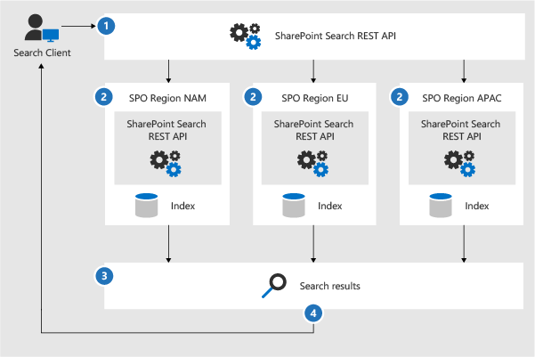

# Microsoft 365 иконы и шаблоны архитектурыMicrosoft 365 architecture icons and templates

Важно помочь нашим партнерам и клиентам разработать и разработать новые решения.Helping our partners and customers design and architect new solutions is important. Схемы архитектуры, такие как схемы, включенные в наше руководство, помогают общаться с решениями по проектированию и отношениями между компонентами в среде.Architecture diagrams like those included in our guidance can help communicate design decisions and the relationships between components in an environment. Мы используем набор символов и значков вместе с Visio шаблонами для создания схем архитектуры, которые мы создаем, и предоставляем эти средства здесь, чтобы помочь вам создать настраиваемую схему архитектуры для следующего решения.We use a set of symbols and icons along with Visio templates to create the architecture diagrams we product and are providing these tools here to help you build a custom architecture diagram for your next solution.

Эти значки, символы и шаблоны можно увидеть в действии в загружаемых файлах, доступных на следующих страницах:You can see these icons, symbols, and templates in action in downloadable files available on the following pages:

- [Иллюстрации производительностиProductivity illustrations](productivity-illustrations.md)
- [Модели облачной архитектуры МайкрософтMicrosoft cloud architecture models](cloud-architecture-models.md)

## Условия и загрузкаTerms and download

Корпорация Майкрософт разрешает использовать эти значки в архитектурных схемах, учебных материалах или документации.Microsoft permits the use of these icons in architectural diagrams, training materials, or documentation. Вы можете копировать, распространять и отображать значки только для разрешенного использования, если корпорация Майкрософт не предоставила явное разрешение.You may copy, distribute, and display the icons only for the permitted use unless granted explicit permission by Microsoft. Microsoft reserves all other rights.Microsoft reserves all other rights.

 > [!div class="button"]
 > [Скачайте значки SVG и PNGDownload SVG and PNG icons](https://go.microsoft.com/fwlink/?linkid=869455)

 > [!div class="button"]
 > [Загрузка Visio шаблонов и трафаретовDownload Visio templates and stencils](https://go.microsoft.com/fwlink/?linkid=2056186)

## Примеры схем архитектурыExample architecture diagrams

Эти значки и шаблоны можно использовать для создания схем, таких как следующие примеры:You can use these icons and templates to create diagrams like the following examples:

1. Пример схемы архитектуры поиска для SharePoint:Example search architecture diagram for SharePoint:

    

2. Teams схемы архитектуры жизненного цикла хранения:Teams retention lifecycle architecture diagram:

    
