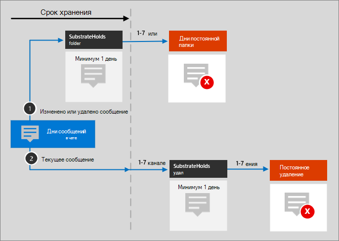

# Значки и шаблоны архитектуры Microsoft 365

Важно помочь партнерам и клиентам проектировать и проектировать новые решения. Схемы архитектуры, такие как схемы, включенные в наше руководство, помогают сообщать о проектных решениях и связях между компонентами в среде. Мы используем набор символов и значков вместе с шаблонами Visio для создания схем архитектуры, которые мы используем, и предоставляем здесь эти инструменты для создания пользовательской схемы архитектуры для следующего решения.

Вы можете увидеть эти значки, символы и шаблоны в действии в загружаемых файлах, доступных на следующих страницах:

- [Иллюстрации производительности](productivity-illustrations.md)
- [Модели облачной архитектуры Майкрософт](cloud-architecture-models.md)

## Условия и загрузка

Корпорация Майкрософт разрешает использовать эти значки в архитектурных схемах, учебных материалах или документации. Вы можете копировать, распространять и отображать значки только для разрешенного использования, если корпорация Майкрософт не предоставила явное разрешение. Microsoft reserves all other rights.

 > [!div class="button"]
 > [Скачивание значков SVG и PNG](https://go.microsoft.com/fwlink/?linkid=869455)

 > [!div class="button"]
 > [Загрузка шаблонов и трафаретов Visio](https://go.microsoft.com/fwlink/?linkid=2056186)

## Примеры схем архитектуры

Эти значки и шаблоны можно использовать для создания схем, как в следующих примерах:

1. Пример схемы архитектуры поиска для SharePoint:

    

2. Схема архитектуры жизненного цикла хранения Teams:

    
