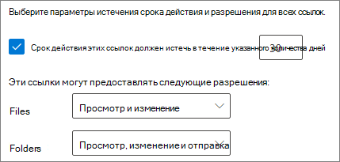
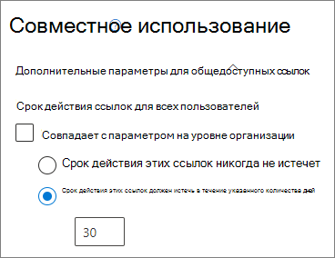
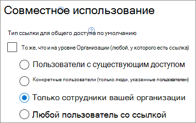
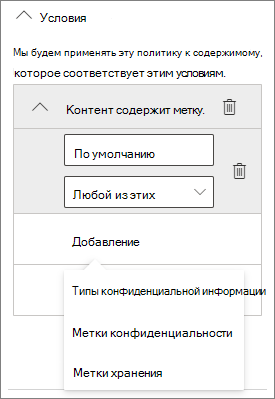
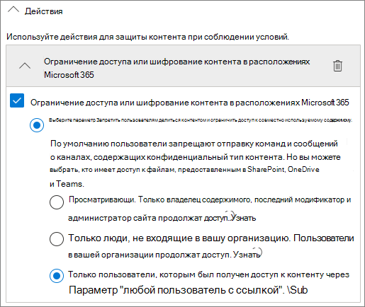
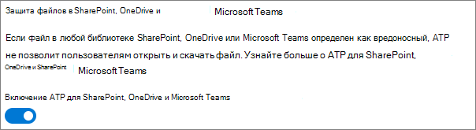

# Рекомендации по предоставлению общего доступа к файлам и папкам пользователям, не прошедшим проверку подлинности

Предоставление общего доступа без проверки подлинности (*общедоступные* ссылки) — это удобное средство, которое может быть полезно в различных сценариях. *Общедоступные* ссылки отлично подходят для предоставления общего доступа: пользователи могут переходить по ссылке без проверки подлинности, а также передавать ее другим.

Как правило, не весь контент в организации подходит для предоставления общего доступа без проверки подлинности. В этой статье рассматриваются доступные варианты для создания среды, в которой пользователи могут предоставлять общий доступ к файлам и папкам без проверки подлинности, но приняты меры безопасности для защиты контента в организации.

> [!NOTE]
> Чтобы общий доступ без проверки подлинности работал, необходимо включить его для своей организации, а также для отдельного сайта или группы, которые вы будете использовать. Нужный вам сценарий описывается в статье [Совместная работа с пользователями за пределами организации](collaborate-with-people-outside-your-organization.md).

## Установка срока действия для ссылок типа "Любой пользователь"

Файлы часто хранятся на сайтах, в группах и в командах на протяжении долгого времени. Иногда действуют политики хранения данных, требующие хранить файлы много лет. Если предоставить пользователям, не прошедшим проверку подлинности, общий доступ к таким файлам, они могут быть непредвиденно просмотрены и изменены в будущем. Чтобы устранить этот риск, можно настроить срок действия ссылок типа *Любой пользователь*.

По истечении срока действия ссылку типа *Любой пользователь* становится невозможно использовать для доступа к контенту.

Установка срока действия для ссылок типа "Любой пользователь" в организации

1. Откройте [Центр администрирования SharePoint](https://admin.microsoft.com/sharepoint).
2. На левой панели навигации нажмите кнопку **Общий доступ**.
3. В разделе **Выбор параметров срока действия и разрешений для ссылок типа "Любой пользователь"** установите флажок **Срок действия этих ссылок должен истечь в течение указанного количества дней**. 
   
4. Введите в поле количество дней и нажмите кнопку **Сохранить**.

Установка срока действия для ссылок типа "Любой пользователь" на конкретном сайте

1. Откройте [Центр администрирования SharePoint](https://admin.microsoft.com/sharepoint).
2. В области навигации слева разверните элемент **Сайты** и щелкните **Активные сайты**.
3. Выберите сайт, который необходимо изменить, и нажмите **Общий доступ**.
4. В области **Дополнительные параметры для общедоступных ссылок** в разделе **Истечение срока действия любых ссылок** снимите флажок **Совпадает с параметром на уровне организации**. 
   
5. Установите флажок **Срок действия этих ссылок должен истечь в течение указанного количества дней** и введите в поле количество дней.
6. Щелкните **Сохранить**.

Обратите внимание, что когда срок действия ссылки типа *Любой пользователь* истечет, доступ к файлу или папке можно будет предоставить заново с помощью новой ссылки типа *Любой пользователь*.

Вы можете настроить истечение срока действия ссылки типа *Любой пользователь* для определенного хранилища OneDrive с помощью командлета [Set-SPOSite](/powershell/module/sharepoint-online/set-sposite).

## Установка разрешений для ссылок

По умолчанию ссылки типа *Любой пользователь* предоставляют пользователям возможность редактировать любой файл. При этом ссылки типа *Любой пользователь* для папок позволяют не только редактировать и просматривать имеющиеся файлы, но и отправлять в папку новые. Вы можете устанавливать для отдельных файлов и папок разрешения только на чтение.

Если требуется разрешить общий доступ без проверки подлинности, но вас беспокоит, что пользователи, не прошедшие проверку подлинности, смогут редактировать контент организации, вы можете задать для файлов и папок разрешение **Просмотр**.

Установка разрешения для ссылок типа "Любой пользователь" в организации

1. Откройте [Центр администрирования SharePoint](https://admin.microsoft.com/sharepoint).
2. На левой панели навигации нажмите кнопку **Общий доступ**.
3. В разделе **Дополнительные параметры ссылок типа "Любой пользователь"** выберите нужные разрешения для файлов и папок. 
   

Если для ссылок типа *Любой пользователь* задано разрешение **Просмотр**, пользователи по-прежнему могут предоставлять гостям доступ к файлам и папкам, а также разрешения, используя ссылки типа *Конкретные люди*. Для использования этих ссылок пользователям за пределами вашей организации необходимо проходить проверку подлинности в качестве гостей, а вы можете отслеживать и проверять их действия с файлами и папками, доступ к которым предоставлен с помощью этих ссылок.

## Настройка типа ссылки по умолчанию, работающего только у сотрудников организации

Если в организации разрешено предоставлять доступ с помощью ссылок типа *Любой пользователь*, то по умолчанию используются ссылки типа **Любой пользователь**. Это удобно для пользователей, но повышает риск непреднамеренного предоставления общего доступа без проверки подлинности. Если пользователь забудет изменить тип ссылки, предоставляя доступ к конфиденциальному документу, он может непреднамеренно создать ссылку для общего доступа, не требующую проверки подлинности.

Вы можете снизить этот риск, выбрав в качестве стандартной ссылку, работающую только у сотрудников организации. Тогда тем, кто желает предоставить общий доступ пользователям, не прошедшим проверку подлинности, потребуется специально выбрать этот вариант.

Выбор стандартной ссылки для предоставления доступа к файлам и папкам в организации
1. Откройте [Центр администрирования SharePoint](https://admin.microsoft.com/sharepoint).
2. На левой панели навигации нажмите кнопку **Общий доступ**.
3. В разделе **Ссылки на файлы и папки** выберите пункт **Только пользователи из организации**.

   

4. Нажмите **Сохранить**

Выбор стандартной ссылки для предоставления доступа к файлам и папкам на определенном сайте
1. Откройте [Центр администрирования SharePoint](https://admin.microsoft.com/sharepoint).
2. В области навигации слева разверните элемент **Сайты** и щелкните **Активные сайты**.
3. Выберите сайт, который необходимо изменить, и нажмите **Общий доступ**.
4. В разделе **Тип ссылки для общего доступа по умолчанию** снимите флажок **Совпадает с параметром на уровне организации**.

   

5. Установите флажок **Только пользователи из вашей организации** и нажмите **Сохранить**.

## Предотвращение несанкционированного предоставления конфиденциального содержимого

Чтобы предотвратить несанкционированное предоставление конфиденциального содержимого, вы можете использовать [защиту от потери данных](../compliance/data-loss-prevention-policies.md). Защита от потери данных может выполнять действия с учетом метки конфиденциальности или метки хранения файла, а также на основе конфиденциальной информации в самом файле.

Создание правила DLP
1. В Центре соответствия требованиям Microsoft 365 перейдите на страницу [Защита от потери данных](https://compliance.microsoft.com/datalossprevention).
2. Щелкните **Создать политику**.
3. Выберите **Настроить** и нажмите кнопку **Далее**.
4. Введите имя политики и нажмите кнопку **Далее**.
5. На странице **Расположения для применения политик** отключите все параметры, кроме **Сайты SharePoint** и **Учетные записи OneDrive**, затем нажмите кнопку **Далее**.
6. На странице **Определение параметров политики** нажмите кнопку **Далее**.
7. На странице **Настройка расширенных правил DLP** щелкните **Создать правило** и введите имя правила.
8. В разделе **Условия** щелкните **Добавить условие** и выберите **Содержит**.
9. Нажмите **Добавить** и выберите тип информации, для которого нужно предотвратить несанкционированное предоставление.

   

10. В разделе **Действия** нажмите **Добавить действие** и выберите **Ограничить доступ или зашифровать содержимое в расположениях Microsoft 365**.
11. Установите флажок **Ограничить доступ или зашифровать содержимое в расположениях Microsoft 365** и выберите параметр **Только люди, получившие доступ к содержимому с помощью параметра "Любой пользователь, у которого есть ссылка"**.

      

12. Нажмите **Сохранить**, а затем — **Далее**.
13. Выберите настройки тестирования и нажмите кнопку **Далее**.
14. Нажмите кнопку **Отправить**, затем нажмите кнопку **Готово**.

## Защита от вредоносных файлов

Если анонимным пользователям разрешено отправлять файлы, повышается риск загрузки вредоносного файла. В Microsoft 365 можно воспользоваться *безопасными вложениями* — возможностью службы Defender для Office 365, позволяющей автоматически сканировать отправленные файлы, а также помещать на карантин файлы, которые считаются небезопасными.

Включение безопасных вложений
1. Откройте [страницу безопасных вложений ATP](https://protection.office.com/safeattachmentv2) в Центре безопасности и соответствия требованиям.
2. Выберите **Глобальные параметры**.
3. Включите ATP для SharePoint, OneDrive и Microsoft Teams.

   

4. При желании также включите безопасные документы и нажмите **Сохранить**.

Дополнительные инструкции см. в статьях [ATP для SharePoint, OneDrive и Microsoft Teams](../security/office-365-security/mdo-for-spo-odb-and-teams.md) и [Включение ATP для SharePoint, OneDrive и Microsoft Teams](../security/office-365-security/turn-on-mdo-for-spo-odb-and-teams.md).

## Добавление сведений об авторских правах к файлам

Если в Центре соответствия требованиям Microsoft 365 используются метки конфиденциальности, то к документам Office организации можно автоматически добавлять водяной знак или колонтитул. Это гарантирует, что в общих файлах сохранятся сведения об авторских правах и другие данные о владении.

Добавление нижнего колонтитула к отмеченному файлу

1. Откройте [Центр соответствия требованиям Microsoft 365](https://compliance.microsoft.com).
2. В области навигации слева в разделе **Решения** щелкните **Защита информации**.
3. Выберите нужную метку и нажмите кнопку **Изменить метку**.
4. Нажимайте **Далее**, чтобы перейти на вкладку **Маркировка содержимого**, и **включите** маркировку содержимого.
5. Установите флажок для того типа текста, который требуется добавить, а затем нажмите кнопку **Изменить текст**.
6. Введите текст, который требуется добавить к документам, выберите нужные параметры текста и нажмите кнопку **Сохранить**. 
   
7. Нажимайте **Далее**, чтобы перейти к последнему экрану мастера, и щелкните **Сохранить метку**.

Если для метки включена маркировка содержимого, указанный текст будет добавляться к документам Office, когда пользователи применяют эту метку.

## См. также

[Обзор меток конфиденциальности](/Office365/SecurityCompliance/sensitivity-labels)

[Ограничение возможности случайного раскрытия файлов при предоставлении доступа гостям](share-limit-accidental-exposure.md)

[Создание безопасной среды гостевого общего доступа](create-secure-guest-sharing-environment.md)