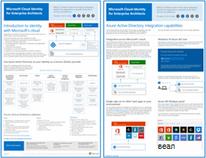

# Иллюстрации "Облако Майкрософт для корпоративных архитекторов"Microsoft cloud for enterprise architects illustrations

Эти плакаты облачной архитектуры предоставляют сведения о облачных службах Майкрософт, в том числе Microsoft 365, Azure Active Directory (Azure AD), Microsoft Intune, Microsoft Dynamics 365 и гибридные локальные и облачные решения.These cloud architecture posters give you information about Microsoft cloud services, including Microsoft 365, Azure Active Directory (Azure AD), Microsoft Intune, Microsoft Dynamics 365, and hybrid on-premises and cloud solutions. 

ИТ и архитекторы, принимающие решения, могут использовать эти ресурсы для определения оптимальных решений для их рабочих нагрузок и принятия решений о базовых компонентах инфраструктуры, таких как сеть, идентификация и безопасность.IT decision makers and architects can use these resources to determine the ideal solutions for their workloads and to make decisions about core infrastructure components such as networking, identity, and security.

### Облачное удостоверение Майкрософт для корпоративных архитекторовMicrosoft cloud identity for enterprise architects

Сведения для ИТ-архитекторов о создании системы удостоверений для организаций, использующих облачные службы и платформы Майкрософт.What IT architects need to know about designing identity for organizations using Microsoft cloud services and platforms.
  
|**Элемент****Item**|**Описание****Description**|
|:-----|:-----|
|   [Просмотр в виде PDF-файла](../downloads/MSFT_cloud_architecture_identity.pdf) \| [Загрузка в виде PDF-файла](https://github.com/MicrosoftDocs/microsoft-365-docs/raw/public/microsoft-365/downloads/MSFT_cloud_architecture_identity.pdf) \| [Скачать как Visio](https://github.com/MicrosoftDocs/microsoft-365-docs/raw/public/microsoft-365/downloads/MSFT_cloud_architecture_identity.vsdx)  [View as a PDF](../downloads/MSFT_cloud_architecture_identity.pdf) \| [Download as a PDF](https://github.com/MicrosoftDocs/microsoft-365-docs/raw/public/microsoft-365/downloads/MSFT_cloud_architecture_identity.pdf)  \| [Download as a Visio](https://github.com/MicrosoftDocs/microsoft-365-docs/raw/public/microsoft-365/downloads/MSFT_cloud_architecture_identity.vsdx)  Обновлено 2020 августаUpdated August 2020 | Эта модель содержит:This model contains:  <ul> <li> Общие сведения об использовании удостоверений в облаке МайкрософтIntroduction to identity with Microsoft's cloud </li><li> Возможности платформы IDaaS в Azure ADAzure AD IDaaS capabilities </li><li> Интеграция локальных учетных записей доменных служб Active Directory (AD DS) с Azure ADIntegrating on-premises Active Directory Domain Services (AD DS) accounts with Azure AD </li><li> Размещение компонентов каталога в Azure IaaSPutting directory components in Azure IaaS </li><li> Параметры доменных служб Active Directory для рабочих нагрузок в Azure IaaSAD DS options for workloads in Azure IaaS </li></ul>    |
   

### Организация сети в облаке Майкрософт для корпоративных архитекторовMicrosoft cloud networking for enterprise architects

Сведения для ИТ-архитекторов о сетях для облачных служб и платформ Майкрософт.What IT architects need to know about networking for Microsoft cloud services and platforms.
  
|**Элемент****Item**|**Описание****Description**|
|:-----|:-----|
|     [Просмотр в виде PDF-файла](../downloads/MSFT_cloud_architecture_networking.pdf) \| [Загрузка в виде PDF-файла](https://github.com/MicrosoftDocs/microsoft-365-docs/raw/public/microsoft-365/downloads/MSFT_cloud_architecture_networking.pdf) \| [Скачать как Visio](https://github.com/MicrosoftDocs/microsoft-365-docs/raw/public/microsoft-365/downloads/MSFT_cloud_architecture_networking.vsdx)  [View as a PDF](../downloads/MSFT_cloud_architecture_networking.pdf) \| [Download as a PDF](https://github.com/MicrosoftDocs/microsoft-365-docs/raw/public/microsoft-365/downloads/MSFT_cloud_architecture_networking.pdf)  \| [Download as a Visio](https://github.com/MicrosoftDocs/microsoft-365-docs/raw/public/microsoft-365/downloads/MSFT_cloud_architecture_networking.vsdx)  Обновлено 2020 августаUpdated August 2020 | Эта модель содержит:This model contains: <ul><li> Развитие сети для облачного подключенияEvolving your network for cloud connectivity </li><li> Общие элементы облачного подключения МайкрософтCommon elements of Microsoft cloud connectivity </li><li> ExpressRoute для подключения к Microsoft CloudExpressRoute for Microsoft cloud connectivity </li><li> Проектирование сети для Microsoft SaaS, Azure PaaS и Azure IaaSDesigning networking for Microsoft SaaS, Azure PaaS, and Azure IaaS </li></ul>    |

### Гибридное облако Майкрософт для корпоративных архитекторовMicrosoft hybrid cloud for enterprise architects

Сведения для ИТ-архитекторов о гибридном облаке для служб и платформ Майкрософт.What IT architects need to know about hybrid cloud for Microsoft services and platforms.
  
|**Элемент****Item**|**Описание****Description**|
|:-----|:-----|
|             [Просмотр в виде PDF-файла](../downloads/MSFT_cloud_architecture_hybrid.pdf) \| [Загрузка в виде PDF-файла](https://github.com/MicrosoftDocs/microsoft-365-docs/raw/public/microsoft-365/downloads/MSFT_cloud_architecture_hybrid.pdf) \| [Скачать как Visio](https://github.com/MicrosoftDocs/microsoft-365-docs/raw/public/microsoft-365/downloads/MSFT_cloud_architecture_hybrid.vsdx)    [View as a PDF](../downloads/MSFT_cloud_architecture_hybrid.pdf)  \| [Download as a PDF](https://github.com/MicrosoftDocs/microsoft-365-docs/raw/public/microsoft-365/downloads/MSFT_cloud_architecture_hybrid.pdf)  \| [Download as a Visio](https://github.com/MicrosoftDocs/microsoft-365-docs/raw/public/microsoft-365/downloads/MSFT_cloud_architecture_hybrid.vsdx)  Обновлено 2020 августаUpdated August 2020 | Эта модель содержит:This model contains: <ul><li> Облачные предложения Майкрософт (SaaS, Azure PaaS и Azure IaaS) и их общие элементыMicrosoft's cloud offerings (SaaS, Azure PaaS, and Azure IaaS) and their common elements </li><li> Архитектуру гибридного облака для облачных предложений МайкрософтHybrid cloud architecture for Microsoft's cloud offerings </li><li> Сценарии гибридного облака для Microsoft SaaS (Office 365), Azure PaaS и Azure IaaSHybrid cloud scenarios for Microsoft SaaS (Office 365), Azure PaaS, and Azure IaaS </li></ul> |
   

### Подходы в отношении архитектуры для переходов между клиентами в облаке МайкрософтArchitecture approaches for Microsoft cloud tenant-to-tenant migrations 
В этих статьях описано несколько подходов в отношении архитектуры для слияний, приобретений, отделений и других сценариев, которые могут привести к переходу на новый облачный клиент.This series of topics illustrates several architecture approaches for mergers, acquisitions, divestitures, and other scenarios that might lead you to migrate to a new cloud tenant. В этих статьях приведены начальные инструкции по планированию.These topics provide starting-point guidance for planning. 

|**Ресурс****Item**|**Описание****Description**|
|:-----|:-----|
|   [PDF](https://github.com/MicrosoftDocs/microsoft-365-docs/raw/public/microsoft-365/downloads/Microsoft-365-tenant-to-tenant-migration.pdf) \| [Visio](https://github.com/MicrosoftDocs/microsoft-365-docs/raw/public/microsoft-365/downloads/Microsoft-365-tenant-to-tenant-migration.vsdx)[PDF](https://github.com/MicrosoftDocs/microsoft-365-docs/raw/public/microsoft-365/downloads/Microsoft-365-tenant-to-tenant-migration.pdf) \| [Visio](https://github.com/MicrosoftDocs/microsoft-365-docs/raw/public/microsoft-365/downloads/Microsoft-365-tenant-to-tenant-migration.vsdx)  Обновлено 2019 июляUpdated July 2019    |Эта модель содержит:This model contains: <ul><li>Сопоставление бизнес-сценариев для подходов в отношении архитектурыA mapping of business scenarios to architecture approaches</li><li>Рекомендации по разработкеDesign considerations</li><li>Поток миграции одного событияSingle event migration flow</li><li>Поток поэтапной миграцииPhased migration flow</li><li>Поток перемещения или разделения клиентаTenant move or split flow</li></ul>|

### Обеспечение безопасности в облаке Майкрософт для корпоративных архитекторовMicrosoft cloud security for enterprise architects

Сведения для ИТ-архитекторов о безопасности в облачных службах и платформах Майкрософт.What IT architects need to know about security in Microsoft cloud services and platforms.
  
|**Элемент****Item**|**Описание****Description**|
|:-----|:-----|
|[          ](https://www.microsoft.com/download/details.aspx?id=48121)[          ](https://www.microsoft.com/download/details.aspx?id=48121)   [PDF](https://go.microsoft.com/fwlink/p/?linkid=842070)  \| [Visio](https://go.microsoft.com/fwlink/p/?LinkId=842071)  \| [Другие языки](https://www.microsoft.com/download/details.aspx?id=48121)[PDF](https://go.microsoft.com/fwlink/p/?linkid=842070)  \| [Visio](https://go.microsoft.com/fwlink/p/?LinkId=842071)  \| [More languages](https://www.microsoft.com/download/details.aspx?id=48121)  Обновлено 2018 декабряUpdated December 2018 | Эта модель содержит:This model contains: <ul><li>Роль корпорации Майкрософт в предоставлении безопасных служб и платформ.Microsoft's role in providing secure services and platforms</li><li>Обязанности клиента по снижению угроз безопасности.Customer responsibilities to mitigate security risks</li><li>Лучшие варианты сертификации защиты.Top security certifications </li><li>Решения для обеспечения безопасности от консалтинговых служб Майкрософт.Security offerings provided by Microsoft consulting services </ul> |

### Распространенные атаки и средства Майкрософт для защиты вашей организацииCommon attacks and Microsoft capabilities that protect your organization
Узнайте о распространенных кибер-атаках и о том, как Майкрософт поможет вашей организации на каждом этапе атаки.Learn about the most common cyber attacks and how Microsoft can help your organization at every stage of an attack. 

|**Ресурс****Item**|**Описание****Description**|
|:-----|:-----|
|   [PDF](https://download.microsoft.com/download/F/A/C/FACFC1E9-FA35-4DF1-943C-8D4237B4275B/MSFT_Cloud_architecture_security_commonattacks.pdf) \| [Visio](https://download.microsoft.com/download/F/A/C/FACFC1E9-FA35-4DF1-943C-8D4237B4275B/MSFT_Cloud_architecture_security_commonattacks.vsdx)[PDF](https://download.microsoft.com/download/F/A/C/FACFC1E9-FA35-4DF1-943C-8D4237B4275B/MSFT_Cloud_architecture_security_commonattacks.pdf) \| [Visio](https://download.microsoft.com/download/F/A/C/FACFC1E9-FA35-4DF1-943C-8D4237B4275B/MSFT_Cloud_architecture_security_commonattacks.vsdx)   Обновлено 2017 августаUpdated August 2017 | На этом плакате показаны этапы основных атак и описаны возможности, позволяющие остановить злоумышленников на каждом из них.This poster illustrates the path of common attacks and describes which capabilities help stop attackers at each stage of an attack.  |

