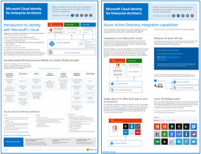

# Иллюстрации "Облако Майкрософт для корпоративных архитекторов"

Эти плакаты облачной архитектуры предоставляют сведения о облачных службах Майкрософт, в том числе Microsoft 365, Azure Active Directory (Azure AD), Microsoft Intune, Microsoft Dynamics 365 и гибридные локальные и облачные решения. 

ИТ и архитекторы, принимающие решения, могут использовать эти ресурсы для определения оптимальных решений для их рабочих нагрузок и принятия решений о базовых компонентах инфраструктуры, таких как сеть, идентификация и безопасность.

### Облачное удостоверение Майкрософт для корпоративных архитекторов

Сведения для ИТ-архитекторов о создании системы удостоверений для организаций, использующих облачные службы и платформы Майкрософт.
  
|**Ресурс**|**Описание**|
|:-----|:-----|
|   [Просмотр в виде PDF-файла](../downloads/MSFT_cloud_architecture_identity.pdf) \| [Загрузка в виде PDF-файла](https://github.com/MicrosoftDocs/microsoft-365-docs/raw/public/microsoft-365/downloads/MSFT_cloud_architecture_identity.pdf) \| [Скачать как Visio](https://github.com/MicrosoftDocs/microsoft-365-docs/raw/public/microsoft-365/downloads/MSFT_cloud_architecture_identity.vsdx)    Обновлено 2020 августа | Эта модель содержит:  <ul> <li> Общие сведения об использовании удостоверений в облаке Майкрософт </li><li> Возможности платформы IDaaS в Azure AD </li><li> Интеграция локальных учетных записей доменных служб Active Directory (AD DS) с Azure AD </li><li> Размещение компонентов каталога в Azure IaaS </li><li> Параметры доменных служб Active Directory для рабочих нагрузок в Azure IaaS </li></ul>    |
   

### Организация сети в облаке Майкрософт для корпоративных архитекторов

Сведения для ИТ-архитекторов о сетях для облачных служб и платформ Майкрософт.
  
|**Ресурс**|**Описание**|
|:-----|:-----|
|     [Просмотр в виде PDF-файла](../downloads/MSFT_cloud_architecture_networking.pdf) \| [Загрузка в виде PDF-файла](https://github.com/MicrosoftDocs/microsoft-365-docs/raw/public/microsoft-365/downloads/MSFT_cloud_architecture_networking.pdf) \| [Скачать как Visio](https://github.com/MicrosoftDocs/microsoft-365-docs/raw/public/microsoft-365/downloads/MSFT_cloud_architecture_networking.vsdx)    Обновлено 2020 августа | Эта модель содержит: <ul><li> Развитие сети для облачного подключения </li><li> Общие элементы облачного подключения Майкрософт </li><li> ExpressRoute для подключения к Microsoft Cloud </li><li> Проектирование сети для Microsoft SaaS, Azure PaaS и Azure IaaS </li></ul>    |

### Гибридное облако Майкрософт для корпоративных архитекторов

Сведения для ИТ-архитекторов о гибридном облаке для служб и платформ Майкрософт.
  
|**Ресурс**|**Описание**|
|:-----|:-----|
|             [Просмотр в виде PDF-файла](../downloads/MSFT_cloud_architecture_hybrid.pdf) \| [Загрузка в виде PDF-файла](https://github.com/MicrosoftDocs/microsoft-365-docs/raw/public/microsoft-365/downloads/MSFT_cloud_architecture_hybrid.pdf) \| [Скачать как Visio](https://github.com/MicrosoftDocs/microsoft-365-docs/raw/public/microsoft-365/downloads/MSFT_cloud_architecture_hybrid.vsdx)      Обновлено 2020 августа | Эта модель содержит: <ul><li> Облачные предложения Майкрософт (SaaS, Azure PaaS и Azure IaaS) и их общие элементы </li><li> Архитектуру гибридного облака для облачных предложений Майкрософт </li><li> Сценарии гибридного облака для Microsoft SaaS (Office 365), Azure PaaS и Azure IaaS </li></ul> |
   

### Подходы в отношении архитектуры для переходов между клиентами в облаке Майкрософт 
В этих статьях описано несколько подходов в отношении архитектуры для слияний, приобретений, отделений и других сценариев, которые могут привести к переходу на новый облачный клиент. В этих статьях приведены начальные инструкции по планированию. 

|**Ресурс**|**Описание**|
|:-----|:-----|
|   [PDF](https://github.com/MicrosoftDocs/microsoft-365-docs/raw/public/microsoft-365/downloads/Microsoft-365-tenant-to-tenant-migration.pdf) \| [Visio](https://github.com/MicrosoftDocs/microsoft-365-docs/raw/public/microsoft-365/downloads/Microsoft-365-tenant-to-tenant-migration.vsdx)  Обновлено 2020 октября    |Эта модель содержит: <ul><li>Сопоставление бизнес-сценариев для подходов в отношении архитектуры</li><li>Рекомендации по разработке</li><li>Пример однопотоковой миграции с одним событием</li><li>Пример поэтапной миграции</li><li>Пример перемещения или разбиения клиента</li></ul>|

### Обеспечение безопасности в облаке Майкрософт для корпоративных архитекторов

>[!Note]
>Эта модель пересмотрена. Ознакомьтесь с этой статьей в будущем, чтобы получить обновленную версию.
>

<!--

What IT architects need to know about security in Microsoft cloud services and platforms.
  
|**Item**|**Description**|
|:-----|:-----|
|[          ](https://www.microsoft.com/download/details.aspx?id=48121)   [PDF](https://go.microsoft.com/fwlink/p/?linkid=842070)  \| [Visio](https://go.microsoft.com/fwlink/p/?LinkId=842071)  \| [More languages](https://www.microsoft.com/download/details.aspx?id=48121)  Updated December 2018 | This model contains: <ul><li>Microsoft's role in providing secure services and platforms</li><li>Customer responsibilities to mitigate security risks</li><li>Top security certifications </li><li>Security offerings provided by Microsoft consulting services </ul> |

--> 

### Распространенные атаки и возможности корпорации Майкрософт, которые защищают организацию от наиболее распространенных атак кибератак и от того, как корпорация Майкрософт может помочь Организации на каждом этапе атаки. 

|**Item**|**Описание**|
|:-----|:-----|
|   [PDF](https://download.microsoft.com/download/F/A/C/FACFC1E9-FA35-4DF1-943C-8D4237B4275B/MSFT_Cloud_architecture_security_commonattacks.pdf) \| [Visio](https://download.microsoft.com/download/F/A/C/FACFC1E9-FA35-4DF1-943C-8D4237B4275B/MSFT_Cloud_architecture_security_commonattacks.vsdx)   Обновлено 2017 августа | На этом плакате показаны этапы основных атак и описаны возможности, позволяющие остановить злоумышленников на каждом из них.  |

