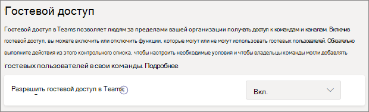

# Совместная работа с гостями в командеCollaborate with guests in a team

Если вам требуется совместно работать с гостями в документах, задачах и беседах, рекомендуется использовать Microsoft Teams.If you need to collaborate with guests across documents, tasks, and conversations, we recommend using Microsoft Teams. Teams предоставляет все функции совместной работы, доступные в Office и SharePoint с сохраняемым чат и настраиваемым и расширяемым набором средств совместной работы в едином пользовательском интерфейсе.Teams provides all of the collaboration features available in Office and SharePoint with persistent chat and a customizable and extensible set of collaboration tools in a unified user experience.

В этой статье мы рассмотрим действия по настройке Microsoft 365, необходимые для настройки группы для совместной работы с гостями.In this article, we'll walk through the Microsoft 365 configuration steps necessary to set up a team for collaboration with guests.

## ВидеодемонстрацияVideo demonstration

В этом видеоролике показаны действия по настройке, описанные в этом документе.This video shows the configuration steps described in this document. 

> [!VIDEO https://www.microsoft.com/videoplayer/embed/RE44NTr?autoplay=false]

## Параметры связей в Организации AzureAzure Organizational relationships settings

Общий доступ в Microsoft 365 регулируется на самом высоком уровне параметрами организационных отношений в Azure Active Directory.Sharing in Microsoft 365 is governed at its highest level by the organizational relationships settings in Azure Active Directory. Если общий доступ к гостям отключен или ограничен в Azure AD, все параметры общего доступа, настроенные в Microsoft 365, будут переопределены.If guest sharing is disabled or restricted in Azure AD, this will override any sharing settings that you configure in Microsoft 365.

Проверьте параметры организационных отношений, чтобы предотвратить блокировку общего доступа с гостями.Check the organizational relationships settings to ensure that sharing with guests is not blocked.

Настройка параметров организационных отношенийTo set organizational relationship settings

1. Выполните вход в Microsoft Azure по [https://portal.azure.com](https://portal.azure.com)адресу.Log in to Microsoft Azure at [https://portal.azure.com](https://portal.azure.com).
2. В области навигации слева выберите **Azure Active Directory**.In the left navigation, click **Azure Active Directory**.
3. В области **Обзор** щелкните **организационные связи**.In the **Overview** pane, click **Organizational relationships**.
4. В области **организационные связи** щелкните **Параметры**.In the **Organizational relationships** pane, click **Settings**.
5. Убедитесь, что у **администраторов и пользователей в роли гостя может быть приглашение** , а **Участники** — значение **Да**.Ensure that **Admins and users in the guest inviter role can invite** and **Members can invite** are both set to **Yes**.
6. Если внесены изменения, нажмите кнопку **Сохранить**.If you made changes, click **Save**.

Обратите внимание на параметры в разделе **ограничения совместной работы** .Note the settings in the **Collaboration restrictions** section. Убедитесь, что домены гостей, с которыми вы хотите работать совместно, не заблокированы.Make sure that the domains of the guests that you want to collaborate with aren't blocked.

## Параметры гостевого доступа TeamsTeams guest access settings

У Teams есть главный переключатель включения/выключения для гостевого доступа, а также различные параметры, позволяющие контролировать, какие гости могут выполнять в команде.Teams has a master on/off switch for guest access and a variety of settings available to control what guests can do in a team. Главный коммутатор, **разрешающий гостевой доступ в Teams** , должен быть **включен** для работы в Teams.The master switch, **Allow guest access in Teams** must be **On** for guest access to work in Teams.

Убедитесь, что гостевой доступ включен в Teams, и внесите любую корректировку параметров гостя в соответствии с бизнес-потребностями.Check to ensure that guest access is enabled in Teams and make any adjustment to the guest settings based on your business needs. Помните, что эти параметры влияют на все команды.Keep in mind that these settings affect all teams.

Настройка параметров гостевого доступа для TeamsTo set Teams guest access settings

1. Войдите в центр администрирования Microsoft 365 по адресу [https://admin.microsoft.com](https://admin.microsoft.com).Log in to the Microsoft 365 admin center at [https://admin.microsoft.com](https://admin.microsoft.com).
2. В области навигации слева щелкните **Показать все**.In the left navigation, click **Show all**.
3. В разделе **центры администрирования**щелкните **Teams**.Under **Admin centers**, click **Teams**.
4. В центре администрирования Teams в области навигации слева разверните раздел **Параметры на уровне Организации** и выберите **гостевой доступ**.In the Teams admin center, in the left navigation, expand **Org-wide settings** and click **Guest access**.
5. Убедитесь, что для параметра **Разрешить гостевой доступ в Teams** задано значение **включено**.Ensure that **Allow guest access in Teams** is set to **On**.
6. Внесите необходимые изменения в дополнительные параметры гостей, а затем нажмите кнопку **сохранить**.Make any desired changes to the additional guest settings, and then click **Save**.

> [!NOTE]
> После включения гостевой настройки Teams может потребоваться до двадцати четырех часов.It may take up to twenty-four hours for the Teams guest setting to become active after you turn it on.

## Параметры гостей для групп Microsoft 365Microsoft 365 Groups guest settings

Teams использует группы Microsoft 365 для членства в группах.Teams uses Microsoft 365 Groups for team membership. Чтобы гостевой доступ в Teams работали в Teams, необходимо включить параметры гостей для группы Microsoft 365.The Microsoft 365 Groups guest settings must be turned on in order for guest access in Teams to work.

Настройка параметров гостя для групп Microsoft 365To set Microsoft 365 Groups guest settings

1. В центре администрирования Microsoft 365 в левой панели навигации разверните узел **Параметры**.In the Microsoft 365 admin center, in the left navigation, expand **Settings**.
2. Щелкните **службы & надстройки**.Click **Services & add-ins**.
3. В списке выберите пункт **Microsoft 365 группы**.In the list, click **Microsoft 365 Groups**.
4. Убедитесь, что установлены флажки для членов группы, не входящих в **вашу организацию** , и **разрешите владельцам групп добавлять людей за пределом Организации в группы** .Ensure that the **Let group members outside your organization access group content** and **Let group owners add people outside your organization to groups** check boxes are both checked.
5. Если вы внесли изменения, нажмите кнопку **сохранить изменения**.If you made changes, click **Save changes**.

## Параметры общего доступа на уровне Организации SharePointSharePoint organization level sharing settings

Содержимое Teams, например файлы, папки и списки, хранятся в SharePoint.Teams content such as files, folders, and lists are all stored in SharePoint. Чтобы гости могли иметь доступ к этим элементам в Teams, параметры общего доступа на уровне Организации SharePoint должны разрешить совместное использование с гостями.In order for guests to have access to these items in Teams, the SharePoint organization-level sharing settings must allow for sharing with guests.

Параметры на уровне Организации определяют, какие параметры доступны для отдельных сайтов, включая сайты, связанные с Teams.The organization-level settings determine what settings are available for individual sites, including sites associated with teams. Параметры сайта не могут быть более разрешительнои, чем параметры на уровне Организации.Site settings cannot be more permissive than the organization-level settings.

Если вы хотите разрешить общий доступ к файлам и папкам для людей, не прошедших проверку подлинности, выберите пункт **все**.If you want to allow file and folder sharing with unauthenticated people, choose **Anyone**. Если необходимо обеспечить проверку подлинности для всех гостей, выберите **новые и существующие гости**.If you want to ensure that all guests have to authenticate, choose **New and existing guests**. Выберите наиболее разрешительное значение, которое потребуется всем сайтам в вашей организации.Choose the most permissive setting that will be needed by any site in your organization.

Настройка параметров общего доступа на уровне Организации SharePointTo set SharePoint organization level sharing settings

1. В центре администрирования Microsoft 365 в области навигации слева в разделе **центры администрирования**щелкните **SharePoint**.In the Microsoft 365 admin center, in the left navigation, under **Admin centers**, click **SharePoint**.
2. Откройте Центр администрирования SharePoint и на панели навигации слева нажмите кнопку **Доступ**.In the SharePoint admin center, in the left navigation, click **Sharing**.
3. Убедитесь, что для внешнего общего доступа для SharePoint задано значение " **любой пользователь** " или " **новые и существующие гости**".Ensure that external sharing for SharePoint is set to **Anyone** or **New and existing guests**.
4. Если внесены изменения, нажмите кнопку **Сохранить**.If you made changes, click **Save**.

## Параметры ссылок по умолчанию на уровне Организации SharePointSharePoint organization level default link settings

Параметры ссылки по умолчанию для файлов и папок определяют, какой вариант ссылки отображается для пользователя по умолчанию при предоставлении общего доступа к файлу или папке.The default file and folder link settings determine which link option is shown to the user by default when they share a file or folder. При необходимости пользователи могут изменить тип ссылки на один из других вариантов, прежде чем предоставлять общий доступ.Users can change the link type to one of the other options before sharing if desired.

Помните, что этот параметр влияет на все команды и сайты SharePoint в Организации.Keep in mind that this setting affects all teams and SharePoint sites in your organization.

Выберите тип ссылки, выбранной по умолчанию, когда пользователи совместно используют файлы и папки:Choose the type of link that's selected by default when users share files and folders:

- Если вы ожидаете совместное использование файлов и папок, не прошедших проверку подлинности **, выберите** этот параметр.**Anyone with the link** - Choose this option if you expect to do a lot of unauthenticated sharing of files and folders. Если вы хотите разрешить ссылки для *всех пользователей* , но беспокоитесь о случайном совместном доступе без проверки подлинности, рассмотрите один из других параметров по умолчанию.If you want to allow *Anyone* links but are concerned about accidental unauthenticated sharing, consider one of the other options as the default. Этот тип ссылки доступен только в том случае, если вы включили **общий доступ** .This link type is only available if you've enabled **Anyone** sharing.
- **Только люди из вашей организации** — выберите этот вариант, если вы хотите, чтобы большая часть общего доступа к файлам и папкам была доступна пользователям в вашей организации.**Only people in your organization** - Choose this option if you expect most file and folder sharing to be with people inside your organization.
- **Specific people** Если вы собираетесь делать большой объем общего доступа к файлам и папкам для гостей, используйте этот вариант.**Specific people** - Consider this option if you expect to do a lot of file and folder sharing with guests. Этот тип ссылки работает с гостями и требует проверки подлинности.This type of link works with guests and requires them to authenticate.
 

Настройка параметров по умолчанию для ссылок на уровень организации SharePointTo set the SharePoint organization level default link settings

1. Перейдите на страницу "общий доступ" в центре администрирования SharePoint.Navigate to the Sharing page in the SharePoint admin center.
2. В разделе **ссылки на файлы и папки**выберите ссылку для совместного доступа по умолчанию, которую нужно использовать.Under **File and folder links**, select the default sharing link that you want to use.
3. Если внесены изменения, нажмите кнопку **Сохранить**.If you made changes, click **Save**.

## Создание командыCreate a team

Следующий шаг — создание команды, которую планируется использовать для совместной работы с гостями.The next step is to create the team that you plan to use for collaborating with guests.

Создание командыTo create a team
1. В Teams на вкладке **группы** выберите команду **присоединиться или создайте** команду в нижней части левой области.In Teams, on the **Teams** tab, click **Join or create a team** at the bottom of the left pane.
2. Нажмите **создать группу**.Click **Create a team**.
3. Нажмите **"создать группу"**.Click **Build a team from scratch**.
4. Выберите **частный** или **общедоступный**.Choose **Private** or **Public**.
5. Введите имя и описание команды, а затем нажмите кнопку **создать**.Type a name and description for the team, and then click **Create**.
6. Нажмите кнопку **пропустить**.Click **Skip**.

Мы будем приглашать пользователей позже.We'll invite users later. Затем важно проверить параметры общего доступа на уровне сайта для сайта SharePoint, связанного с командой.Next, it's important to check the site-level sharing settings for the SharePoint site that is associated with the team.

## Параметры общего доступа на уровне сайта SharePointSharePoint site level sharing settings

Проверьте параметры общего доступа на уровне сайта, чтобы убедиться, что они допускают тип доступа, который вы хотите использовать для этой команды.Check the site-level sharing settings to make sure that they allow the type of access that you want for this team. Например, если вы настроили параметры на уровне Организации для всех **пользователей**, но хотите, чтобы все гости подлинны для этой команды, убедитесь, что для параметров общего доступа на уровне сайта задано значение " **новые и существующие гости**".For example, if you set the organization-level settings to **Anyone**, but you want all guests to authenticate for this team, then make sure the site-level sharing settings are set to **New and existing guests**.

Установка параметров общего доступа на уровне сайтаTo set site-level sharing settings
1. Откройте Центр администрирования SharePoint, затем на панели навигации слева разверните меню **Сайты** и нажмите **Активные сайты**.In the SharePoint admin center, in the left navigation, expand **Sites** and click **Active sites**.
2. Выберите сайт для команды, которую вы только что создали.Select the site for the team that you just created.
3. На ленте выберите **Доступ**.In the ribbon, click **Sharing**.
4. Убедитесь, что для общего доступа задано значение " **любой пользователь** " или " **новые и существующие гости**".Ensure that sharing is set to **Anyone** or **New and existing guests**.
5. Если внесены изменения, нажмите кнопку **Сохранить**.If you made changes, click **Save**.

## Приглашение пользователейInvite users

Параметры общего доступа к гостевой сети настроены, поэтому вы можете добавить в команду внутренних пользователей и гостей.Guest sharing settings are now configured, so you can start adding internal users and guests to your team. 

Приглашение внутренних пользователей в командуTo invite internal users to a team
1. В группе выберите **Дополнительные параметры** (**\*\***), а затем нажмите кнопку **Добавить участника**.In the team, click **More options** (**\*\*\***), and then click **Add member**.
2. Введите имя человека, которого хотите пригласить.Type the name of the person who you want to invite.
3. Нажмите **Добавить**, а затем **Закрыть**.Click **Add**, and then click **Close**.

Приглашение гостей в командуTo invite guests to a team
1. В группе выберите **Дополнительные параметры** (**\*\***), а затем нажмите кнопку **Добавить участника**.In the team, click **More options** (**\*\*\***), and then click **Add member**.
2. Введите адрес электронной почты гостя, которого вы хотите пригласить.Type the email address of the guest who you want to invite.
3. Щелкните ссылку **изменить сведения о гостевой**системе.Click **Edit guest information**.
4. Введите полное имя гостя и щелкните галочку.Type the guest's full name and click the check mark.
5. Нажмите **Добавить**, а затем **Закрыть**.Click **Add**, and then click **Close**.

## См. такжеSee Also

[Рекомендации по предоставлению общего доступа к файлам и папкам непроверенным пользователямBest practices for sharing files and folders with unauthenticated users](best-practices-anonymous-sharing.md)

[Ограничение возможности случайного раскрытия файлов при предоставлении доступа гостямLimit accidental exposure to files when sharing with guests](share-limit-accidental-exposure.md)

[Создание безопасной среды гостевого общего доступаCreate a secure guest sharing environment](create-secure-guest-sharing-environment.md)

[Создание экстрасети B2B с управляемыми гостямиCreate a B2B extranet with managed guests](b2b-extranet.md)
