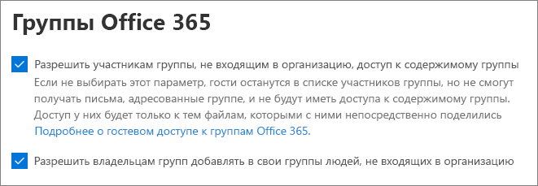

# Совместная работа с гостями в команде

Если вам нужно совместно работать с гостями в документах, задачах и беседах, рекомендуем использовать Microsoft Teams. Teams предоставляет все функции совместной работы, доступные в Office и SharePoint, включая сохраняемый чат и настраиваемый и расширяемый набор средств совместной работы, в едином пользовательском интерфейсе.

В этой статье рассматриваются действия по настройке Microsoft 365, необходимые для настройки команды для совместной работы с гостями. После завершения настройки гостевого доступа вы сможете приглашать гостей в команды. Соответствующие инструкции см. в статье [Добавление гостей в команду в Teams](https://support.microsoft.com/office/fccb4fa6-f864-4508-bdde-256e7384a14f).

## Видеодемонстрация

В этом видео показаны действия по настройке, описанные в этом документе. 

> [!VIDEO https://www.microsoft.com/videoplayer/embed/RE44NTr?autoplay=false]

## Настройка параметров внешней совместной работы в Azure

Общий доступ в Microsoft 365 настраивается на самом высоком уровне с помощью [параметров внешней совместной работы B2B в Azure Active Directory](/azure/active-directory/external-identities/delegate-invitations). Если гостевой общий доступ отключен или ограничен в Azure AD, этот параметр переопределит все параметры общего доступа, настроенные в Microsoft 365.

Проверьте настройки параметров внешней совместной работы B2B, чтобы убедиться, что гостевой общий доступ не заблокирован.

Чтобы настроить параметры внешней совместной работы, выполните следующее.

1. Войдите в Azure Active Directory на сайте [https://aad.portal.azure.com](https://aad.portal.azure.com).
2. В области навигации слева щелкните **Azure Active Directory**.
3. Нажмите **Внешние удостоверения**.
4. На экране **Начало работы** в области навигации слева щелкните **Параметры внешней совместной работы**.
5. Убедитесь, что для параметров **Администраторы и пользователи с ролью "Приглашающий гостей" могут приглашать** и **Участники могут приглашать** установлено значение **Да**.
6. Если вы внесли изменения, нажмите кнопку **Сохранить**.

Обратите внимание на параметры в разделе **Ограничения совместной работы**. Убедитесь, что домены гостей, с которыми вы хотите сотрудничать, не заблокированы.

Если вы работаете с гостями из нескольких организаций, вы можете ограничить их доступ к данным каталога. Это не позволит им видеть других гостей в каталоге. Для этого в разделе **Ограничения доступа гостевых пользователей** выберите **Гостевые пользователи имеют ограниченный доступ к свойствам и членству в параметрах объектов каталога** или **Доступ гостевых пользователей ограничен свойствами и членством в их собственных объектах каталога**.

## Настройка параметров гостевого доступа в Teams

В Teams есть главный переключатель, позволяющий включать или отключать гостевой доступ, и различные параметры, позволяющие настраивать действия гостей в команде. Чтобы включить гостевой доступ в Teams, необходимо привести главный переключатель **Разрешить гостевой доступ в Teams** в положение **Вкл**.

Включите гостевой доступ в Teams и внесите любые изменения в параметры гостей в зависимости от потребностей вашей организации. Помните, что эти параметры влияют на все команды.

Настройка параметров гостевого доступа в Teams

1. Войдите в Центр администрирования Microsoft 365 на сайте [https://admin.microsoft.com](https://admin.microsoft.com).
2. В области навигации слева щелкните **Показать все**.
3. В разделе **Центры администрирования** щелкните **Teams**.
4. В Центре администрирования Teams в области навигации слева разверните раздел **Параметры на уровне организации** и щелкните **Гостевой доступ**.
5. Убедитесь, что для параметра **Разрешить гостевой доступ в Teams** задано значение **Вкл.**.
6. Внесите необходимые изменения в дополнительные параметры гостей и нажмите кнопку **Сохранить**.

После включения гостевого доступа в Teams вы можете дополнительно настроить гостевой доступ для отдельных команд и связанных с ними сайтов SharePoint с помощью меток конфиденциальности. Дополнительные сведения см. в статье [Использование меток конфиденциальности для защиты контента в Microsoft Teams, в группах Microsoft 365 и на сайтах SharePoint](../compliance/sensitivity-labels-teams-groups-sites.md).

> [!NOTE]
> Активация параметров гостей в Teams может занять до двадцати четырех часов с момента включения.

## Настройка параметров гостей для групп Microsoft 365

Teams использует группы Microsoft 365 для участия в командах. Чтобы гостевой доступ в Teams работал, необходимо включить параметры гостей для групп Microsoft 365.

Чтобы настроить параметры гостей для групп Microsoft 365, выполните следующее.

1. В Центре администрирования Microsoft 365 в области навигации слева разверните раздел **Параметры**.
2. Нажмите **Параметры организации**.
3. Выберите в списке **Группы Microsoft 365**.
4. Убедитесь, что рядом с пунктами **Разрешить владельцам групп добавлять людей за пределами вашей организации в группы Microsoft 365 в качестве гостей** и **Разрешить гостевым участникам группы получать доступ к содержимому группы** установлены флажки.
5. Если вы внесли изменения, нажмите кнопку **Сохранить изменения**.

## Настройка параметров общего доступа для SharePoint на уровне организации

Все содержимое Teams, например файлы, папки и списки, хранится в SharePoint. Чтобы у гостей был доступ к этим элементам в Teams, параметры общего доступа SharePoint на уровне организации должны разрешать общий доступ гостям.

Параметры на уровне организации определяют доступность параметров для отдельных сайтов, включая сайты, связанные с командами. Параметры сайта не могут разрешать больше, чем параметры на уровне организации.

Если вы хотите разрешить общий доступ к файлам и папкам непроверенным пользователям выберите **Все**. Если вы хотите, чтобы все гости проходили проверку подлинности, выберите **Новые и существующие гости**. Выберите наиболее разрешительный параметр, который будет необходим любому сайту в вашей организации.

Чтобы настроить общий доступ для SharePoint на уровне организации, выполните следующее.

1. В Центре администрирования Microsoft 365 в области навигации слева в разделе **Центры администрирования** выберите **SharePoint**.
2. В Центре администрирования SharePoint в области навигации слева разверните раздел **Политики** и щелкните пункт **Общий доступ**.
3. Убедитесь, что для параметра внешнего общего доступа SharePoint задано значение **Все** или **Новые и существующие гости**.
4. Если вы внесли изменения, нажмите кнопку **Сохранить**.

## Настройка ссылок по умолчанию для SharePoint на уровне организации

Параметры ссылок на файлы или папки по умолчанию определяют тип ссылок, которые будет отображаться пользователям по умолчанию при совместном использовании файлов или папок. При желании пользователи могут изменить тип ссылки на один из доступных вариантов перед совместным использованием.

Помните, что этот параметр влияет на все команды и сайты SharePoint в организации.

Выберите один из следующих типов ссылок, которые будут использоваться по умолчанию при общем доступе пользователей к файлам и папкам.

- **Все, у кого есть ссылка**. Выберите этот вариант, если ожидается совместное использование большого количества файлов и папок без проверки подлинности. Если вы хотите разрешить тип ссылок *Все*, но беспокоитесь о случайном общем доступе без проверки подлинности, рассмотрите один из следующих вариантов в качестве варианта по умолчанию. Этот тип ссылки доступен, только если включен общий доступ для **всех**.
- **Только люди в вашей организации**. Выберите этот вариант, если ожидается, что совместное использование большей части файлов и папок будет осуществляться пользователями внутри вашей организации.
- **Конкретные люди**. Рассмотрите этот вариант, если ожидается совместное использование большого количества файлов и папок гостями. Этот тип ссылки работает с гостями и требует от них прохождения проверки подлинности.
 

Чтобы настроить ссылки по умолчанию для SharePoint на уровне организации, выполните следующее.

1. Перейдите на страницу общего доступа в Центре администрирования SharePoint.
2. В разделе **Ссылки на файлы и папки** выберите ссылку для общего доступа, которая будет использоваться по умолчанию.
3. Если вы внесли изменения, нажмите кнопку **Сохранить**.

## Создание команды

Следующий этап — создание команды, которая будет использоваться для совместной работы с гостями.

Чтобы создать команду, выполните следующее.
1. В Teams на вкладке **Команды** щелкните **Присоединиться или создать команду** в левой области внизу.
2. Нажмите **Создать команду**.
3. Щелкните **Создать команду с нуля**.
4. Выберите **Частная** или **Общедоступная**.
5. Введите имя и описание команды и нажмите кнопку **Создать**.
6. Щелкните **Пропустить**.

Инструкции по приглашению пользователей приводятся далее. На следующем этапе важно проверить параметры общего доступа на уровне сайта SharePoint, связанного с командой.

## Настройка параметров общего доступа на уровне сайта SharePoint

Проверьте параметры общего доступа на уровне сайта, чтобы убедиться, что они разрешают тип доступа, необходимый для этой команды. Например, если для параметров на уровне организации установлено значение **Все**, но вы хотите, чтобы все гости в этой команде проходили проверку подлинности, установите для параметров общего доступа на уровне сайта значение **Новые и существующие гости**.

Чтобы настроить параметры общего доступа на уровне сайта, выполните следующее.
1. В Центре администрирования SharePoint в области навигации слева разверните раздел **Сайты** и нажмите **Активные сайты**.
2. Выберите сайт для команды, которую вы только что создали.
3. Щелкните значок многоточия "..." и выберите **Общий доступ**.
4. Убедитесь, что для параметра общего доступа установлено значение **Все** или **Новые и существующие гости**.
5. Если вы внесли изменения, нажмите кнопку **Сохранить**.

## Приглашение пользователей

После настройки параметров гостевого общего доступа можно приступать к добавлению внутренних пользователей и гостей в свою команду. 

Чтобы пригласить внутренних пользователей в команду, выполните следующее.
1. В команде нажмите **Дополнительные параметры** (**\*\*\***) и выберите **Добавить участника**.
2. Введите имя пользователя, которого вы хотите пригласить.
3. Нажмите **Добавить**, а затем — **Закрыть**.

Чтобы пригласить гостей в команду, выполните следующее.
1. В команде нажмите **Дополнительные параметры** (**\*\*\***) и выберите **Добавить участника**.
2. Введите адрес электронной почты пользователя, которого вы хотите пригласить.
3. Нажмите **Изменить сведения о госте**.
4. Введите полное имя гостя и установите флажок.
5. Нажмите **Добавить**, а затем — **Закрыть**.

## См. также

[Рекомендации по предоставлению общего доступа к файлам и папкам непроверенным пользователям](best-practices-anonymous-sharing.md)

[Ограничение возможности случайного раскрытия файлов при предоставлении доступа гостям](share-limit-accidental-exposure.md)

[Создание безопасной среды гостевого общего доступа](create-secure-guest-sharing-environment.md)

[Создание экстрасети B2B с управляемыми гостями](b2b-extranet.md)

[Интеграция SharePoint и OneDrive с Azure AD B2B](/sharepoint/sharepoint-azureb2b-integration-preview)

[При совместном использовании в SharePoint Online или OneDrive параметры общего доступа недоступны для выбора](/sharepoint/troubleshoot/administration/sharing-options-grayed-out-when-sharing-from-sharepoint-online-or-onedrive)