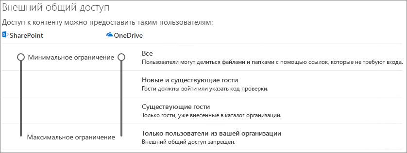

# Совместная работа с гостями в командеCollaborate with guests in a team

Если вам нужно совместно работать с гостями в документах, задачах и беседах, рекомендуем использовать Microsoft Teams.If you need to collaborate with guests across documents, tasks, and conversations, we recommend using Microsoft Teams. Teams предоставляет все функции совместной работы, доступные в Office и SharePoint, включая сохраняемый чат и настраиваемый и расширяемый набор средств совместной работы, в едином пользовательском интерфейсе.Teams provides all of the collaboration features available in Office and SharePoint with persistent chat and a customizable and extensible set of collaboration tools in a unified user experience.

В этой статье рассматриваются действия по настройке Microsoft 365, необходимые для настройки команды для совместной работы с гостями.In this article, we'll walk through the Microsoft 365 configuration steps necessary to set up a team for collaboration with guests. После завершения настройки гостевого доступа вы сможете приглашать гостей в команды. Соответствующие инструкции см. в статье [Добавление гостей в команду в Teams](https://support.microsoft.com/office/fccb4fa6-f864-4508-bdde-256e7384a14f).Once you have configured guest access, you can invite guests to teams by following the steps in [Add guests to a team in Teams](https://support.microsoft.com/office/fccb4fa6-f864-4508-bdde-256e7384a14f).

## ВидеодемонстрацияVideo demonstration

В этом видео показаны действия по настройке, описанные в этом документе.This video shows the configuration steps described in this document. 

> [!VIDEO https://www.microsoft.com/videoplayer/embed/RE44NTr?autoplay=false]

## Настройка параметров внешней совместной работы в AzureAzure External collaboration settings

Общий доступ в Microsoft 365 настраивается на самом высоком уровне с помощью [параметров внешней совместной работы B2B в Azure Active Directory](/azure/active-directory/external-identities/delegate-invitations).Sharing in Microsoft 365 is governed at its highest level by the [B2B external collaboration settings in Azure Active Directory](/azure/active-directory/external-identities/delegate-invitations). Если гостевой общий доступ отключен или ограничен в Azure AD, этот параметр переопределит все параметры общего доступа, настроенные в Microsoft 365.If guest sharing is disabled or restricted in Azure AD, this setting overrides any sharing settings that you configure in Microsoft 365.

Проверьте настройки параметров внешней совместной работы B2B, чтобы убедиться, что гостевой общий доступ не заблокирован.Check the B2B external collaboration settings settings to ensure that sharing with guests is not blocked.

Чтобы настроить параметры внешней совместной работы, выполните следующее.To set external collaboration settings

1. Войдите в Azure Active Directory на сайте [https://aad.portal.azure.com](https://aad.portal.azure.com).Log in to Azure Active Directory at [https://aad.portal.azure.com](https://aad.portal.azure.com).
2. В области навигации слева щелкните **Azure Active Directory**.In the left navigation pane, click **Azure Active Directory**.
3. Нажмите **Внешние удостоверения**.Click **External identities**.
4. На экране **Начало работы** в области навигации слева щелкните **Параметры внешней совместной работы**.On the **Get started** screen, in the left navigation pane, click **External collaboration settings**.
5. Убедитесь, что для параметров **Администраторы и пользователи с ролью "Приглашающий гостей" могут приглашать** и **Участники могут приглашать** установлено значение **Да**.Ensure that **Admins and users in the guest inviter role can invite** and **Members can invite** are both set to **Yes**.
6. Если вы внесли изменения, нажмите кнопку **Сохранить**.If you made changes, click **Save**.

Обратите внимание на параметры в разделе **Ограничения совместной работы**.Note the settings in the **Collaboration restrictions** section. Убедитесь, что домены гостей, с которыми вы хотите сотрудничать, не заблокированы.Make sure that the domains of the guests that you want to collaborate with aren't blocked.

Если вы работаете с гостями из нескольких организаций, вы можете ограничить их доступ к данным каталога.If you work with guests from multiple organizations, you may want to restrict their ability to access directory data. Это не позволит им видеть других гостей в каталоге.This will prevent them from seeing who else is a guest in the directory. Для этого в разделе **Ограничения доступа гостевых пользователей** выберите **Гостевые пользователи имеют ограниченный доступ к свойствам и членству в параметрах объектов каталога** или **Доступ гостевых пользователей ограничен свойствами и членством в их собственных объектах каталога**.To do this, under **Guest user access restrictions**, select **Guest users have limited access to properties and membership of directory objects settings** or **Guest user access is restricted to properties and memberships of their own directory objects**.

## Настройка параметров гостевого доступа в TeamsTeams guest access settings

В Teams есть главный переключатель, позволяющий включать или отключать гостевой доступ, и различные параметры, позволяющие настраивать действия гостей в команде.Teams has a master on/off switch for guest access and a variety of settings available to control what guests can do in a team. Чтобы включить гостевой доступ в Teams, необходимо привести главный переключатель **Разрешить гостевой доступ в Teams** в положение **Вкл**.The master switch, **Allow guest access in Teams** must be **On** for guest access to work in Teams.

Включите гостевой доступ в Teams и внесите любые изменения в параметры гостей в зависимости от потребностей вашей организации. Помните, что эти параметры влияют на все команды.Check to ensure that guest access is enabled in Teams and make any adjustment to the guest settings based on your business needs. Keep in mind that these settings affect all teams.

Настройка параметров гостевого доступа в TeamsTo set Teams guest access settings

1. Войдите в Центр администрирования Microsoft 365 на сайте [https://admin.microsoft.com](https://admin.microsoft.com).Log in to the Microsoft 365 admin center at [https://admin.microsoft.com](https://admin.microsoft.com).
2. В области навигации слева щелкните **Показать все**.In the left navigation pane, click **Show all**.
3. В разделе **Центры администрирования** щелкните **Teams**.Under **Admin centers**, click **Teams**.
4. В Центре администрирования Teams в области навигации слева разверните раздел **Параметры на уровне организации** и щелкните **Гостевой доступ**.In the Teams admin center, in the left navigation pane, expand **Org-wide settings** and click **Guest access**.
5. Убедитесь, что для параметра **Разрешить гостевой доступ в Teams** задано значение **Вкл.**.Ensure that **Allow guest access in Teams** is set to **On**.
6. Внесите необходимые изменения в дополнительные параметры гостей и нажмите кнопку **Сохранить**.Make any desired changes to the additional guest settings, and then click **Save**.

После включения гостевого доступа в Teams вы можете дополнительно настроить гостевой доступ для отдельных команд и связанных с ними сайтов SharePoint с помощью меток конфиденциальности.Once Teams guest access is turned on, you can optionally control guest access to individual teams and their associated SharePoint sites using sensitivity labels. Дополнительные сведения см. в статье [Использование меток конфиденциальности для защиты контента в Microsoft Teams, в группах Microsoft 365 и на сайтах SharePoint](../compliance/sensitivity-labels-teams-groups-sites.md).For more information, see [Use sensitivity labels to protect content in Microsoft Teams, Microsoft 365 groups, and SharePoint sites](../compliance/sensitivity-labels-teams-groups-sites.md).

> [!NOTE]
> Активация параметров гостей в Teams может занять до двадцати четырех часов с момента включения.It may take up to twenty-four hours for the Teams guest settings to become active after you turn it on.

## Настройка параметров гостей для групп Microsoft 365Microsoft 365 Groups guest settings

Teams использует группы Microsoft 365 для участия в командах. Чтобы гостевой доступ в Teams работал, необходимо включить параметры гостей для групп Microsoft 365.Teams uses Microsoft 365 Groups for team membership. The Microsoft 365 Groups guest settings must be turned on in order for guest access in Teams to work.

Чтобы настроить параметры гостей для групп Microsoft 365, выполните следующее.To set Microsoft 365 Groups guest settings

1. В Центре администрирования Microsoft 365 в области навигации слева разверните раздел **Параметры**.In the Microsoft 365 admin center, in the left navigation pane, expand **Settings**.
2. Нажмите **Параметры организации**.Click **Org settings**.
3. Выберите в списке **Группы Microsoft 365**.In the list, click **Microsoft 365 Groups**.
4. Убедитесь, что рядом с пунктами **Разрешить владельцам групп добавлять людей за пределами вашей организации в группы Microsoft 365 в качестве гостей** и **Разрешить гостевым участникам группы получать доступ к содержимому группы** установлены флажки.Ensure that the **Let group owners add people outside your organization to Microsoft 365 Groups as guests** and **Let guest group members access group content** check boxes are both checked.
5. Если вы внесли изменения, нажмите кнопку **Сохранить изменения**.If you made changes, click **Save changes**.

## Настройка параметров общего доступа для SharePoint на уровне организацииSharePoint organization level sharing settings

Все содержимое Teams, например файлы, папки и списки, хранится в SharePoint.Teams content such as files, folders, and lists are all stored in SharePoint. Чтобы у гостей был доступ к этим элементам в Teams, параметры общего доступа SharePoint на уровне организации должны разрешать общий доступ гостям.In order for guests to have access to these items in Teams, the SharePoint organization-level sharing settings must allow for sharing with guests.

Параметры на уровне организации определяют доступность параметров для отдельных сайтов, включая сайты, связанные с командами.The organization-level settings determine what settings are available for individual sites, including sites associated with teams. Параметры сайта не могут разрешать больше, чем параметры на уровне организации.Site settings cannot be more permissive than the organization-level settings.

Если вы хотите разрешить общий доступ к файлам и папкам непроверенным пользователям выберите **Все**.If you want to allow file and folder sharing with unauthenticated people, choose **Anyone**. Если вы хотите, чтобы все гости проходили проверку подлинности, выберите **Новые и существующие гости**.If you want to ensure that all guests have to authenticate, choose **New and existing guests**. Выберите наиболее разрешительный параметр, который будет необходим любому сайту в вашей организации.Choose the most permissive setting that will be needed by any site in your organization.

Чтобы настроить общий доступ для SharePoint на уровне организации, выполните следующее.To set SharePoint organization-level sharing settings

1. В Центре администрирования Microsoft 365 в области навигации слева в разделе **Центры администрирования** выберите **SharePoint**.In the Microsoft 365 admin center, in the left navigation pane, under **Admin centers**, click **SharePoint**.
2. В Центре администрирования SharePoint в области навигации слева разверните раздел **Политики** и щелкните пункт **Общий доступ**.In the SharePoint admin center, in the left navigation pane, expand **Policies** and then click **Sharing**.
3. Убедитесь, что для параметра внешнего общего доступа SharePoint задано значение **Все** или **Новые и существующие гости**.Ensure that external sharing for SharePoint is set to **Anyone** or **New and existing guests**.
4. Если вы внесли изменения, нажмите кнопку **Сохранить**.If you made changes, click **Save**.

## Настройка ссылок по умолчанию для SharePoint на уровне организацииSharePoint organization-level default link settings

Параметры ссылок на файлы или папки по умолчанию определяют тип ссылок, которые будет отображаться пользователям по умолчанию при совместном использовании файлов или папок.The default file and folder link settings determine the link option that will be shown to users by default when they share a file or folder. При желании пользователи могут изменить тип ссылки на один из доступных вариантов перед совместным использованием.Users can change the link type to one of the other options before sharing, if desired.

Помните, что этот параметр влияет на все команды и сайты SharePoint в организации.Keep in mind that this setting affects all teams and SharePoint sites in your organization.

Выберите один из следующих типов ссылок, которые будут использоваться по умолчанию при общем доступе пользователей к файлам и папкам.Choose any one of the following link-types which will be selected by default when users share files and folders:

- **Все, у кого есть ссылка**. Выберите этот вариант, если ожидается совместное использование большого количества файлов и папок без проверки подлинности.**Anyone with the link** - Choose this option if you expect to do a lot of unauthenticated sharing of files and folders. Если вы хотите разрешить тип ссылок *Все*, но беспокоитесь о случайном общем доступе без проверки подлинности, рассмотрите один из следующих вариантов в качестве варианта по умолчанию.If you want to allow *Anyone* links but are concerned about accidental unauthenticated sharing, consider one of the other options as the default. Этот тип ссылки доступен, только если включен общий доступ для **всех**.This link type is only available if you've enabled **Anyone** sharing.
- **Только люди в вашей организации**. Выберите этот вариант, если ожидается, что совместное использование большей части файлов и папок будет осуществляться пользователями внутри вашей организации.**Only people in your organization** - Choose this option if you expect most file and folder sharing to be with people inside your organization.
- **Конкретные люди**. Рассмотрите этот вариант, если ожидается совместное использование большого количества файлов и папок гостями.**Specific people** - Consider this option if you expect to do a lot of file and folder sharing with guests. Этот тип ссылки работает с гостями и требует от них прохождения проверки подлинности.This type of link works with guests and requires them to authenticate.
 

Чтобы настроить ссылки по умолчанию для SharePoint на уровне организации, выполните следующее.To set the SharePoint organization-level default link settings

1. Перейдите на страницу общего доступа в Центре администрирования SharePoint.Navigate to the Sharing page in the SharePoint admin center.
2. В разделе **Ссылки на файлы и папки** выберите ссылку для общего доступа, которая будет использоваться по умолчанию.Under **File and folder links**, select the default sharing link that you want to use.
3. Если вы внесли изменения, нажмите кнопку **Сохранить**.If you made changes, click **Save**.

## Создание командыCreate a team

Следующий этап — создание команды, которая будет использоваться для совместной работы с гостями.The next step is to create the team that you plan to use for collaborating with guests.

Чтобы создать команду, выполните следующее.To create a team
1. В Teams на вкладке **Команды** щелкните **Присоединиться или создать команду** в левой области внизу.In Teams, on the **Teams** tab, click **Join or create a team** at the bottom of the left pane.
2. Нажмите **Создать команду**.Click **Create a team**.
3. Щелкните **Создать команду с нуля**.Click **Build a team from scratch**.
4. Выберите **Частная** или **Общедоступная**.Choose **Private** or **Public**.
5. Введите имя и описание команды и нажмите кнопку **Создать**.Type a name and description for the team, and then click **Create**.
6. Щелкните **Пропустить**.Click **Skip**.

Инструкции по приглашению пользователей приводятся далее. На следующем этапе важно проверить параметры общего доступа на уровне сайта SharePoint, связанного с командой.We'll invite users later. Next, it's important to check the site-level sharing settings for the SharePoint site that is associated with the team.

## Настройка параметров общего доступа на уровне сайта SharePointSharePoint site-level sharing settings

Проверьте параметры общего доступа на уровне сайта, чтобы убедиться, что они разрешают тип доступа, необходимый для этой команды.Check the site-level sharing settings to make sure that they allow the type of access that you want for this team. Например, если для параметров на уровне организации установлено значение **Все**, но вы хотите, чтобы все гости в этой команде проходили проверку подлинности, установите для параметров общего доступа на уровне сайта значение **Новые и существующие гости**.For example, if you set the organization-level settings to **Anyone**, but you want all guests to authenticate for this team, then make sure the site-level sharing settings are set to **New and existing guests**.

Чтобы настроить параметры общего доступа на уровне сайта, выполните следующее.To set site-level sharing settings
1. В Центре администрирования SharePoint в области навигации слева разверните раздел **Сайты** и нажмите **Активные сайты**.In the SharePoint admin center, in the left navigation pane, expand **Sites** and click **Active sites**.
2. Выберите сайт для команды, которую вы только что создали.Select the site for the team that you just created.
3. Щелкните значок многоточия "..." и выберите **Общий доступ**.Click ... and choose **Sharing**.
4. Убедитесь, что для параметра общего доступа установлено значение **Все** или **Новые и существующие гости**.Ensure that sharing is set to **Anyone** or **New and existing guests**.
5. Если вы внесли изменения, нажмите кнопку **Сохранить**.If you made changes, click **Save**.

## Приглашение пользователейInvite users

После настройки параметров гостевого общего доступа можно приступать к добавлению внутренних пользователей и гостей в свою команду.Guest sharing settings are now configured, so you can start adding internal users and guests to your team. 

Чтобы пригласить внутренних пользователей в команду, выполните следующее.To invite internal users to a team
1. В команде нажмите **Дополнительные параметры** (**\*\*\***) и выберите **Добавить участника**.In the team, click **More options** (**\*\*\***), and then click **Add member**.
2. Введите имя пользователя, которого вы хотите пригласить.Type the name of the person who you want to invite.
3. Нажмите **Добавить**, а затем — **Закрыть**.Click **Add**, and then click **Close**.

Чтобы пригласить гостей в команду, выполните следующее.To invite guests to a team
1. В команде нажмите **Дополнительные параметры** (**\*\*\***) и выберите **Добавить участника**.In the team, click **More options** (**\*\*\***), and then click **Add member**.
2. Введите адрес электронной почты пользователя, которого вы хотите пригласить.Type the email address of the guest whom you want to invite.
3. Нажмите **Изменить сведения о госте**.Click **Edit guest information**.
4. Введите полное имя гостя и установите флажок.Type the guest's full name and click the check mark.
5. Нажмите **Добавить**, а затем — **Закрыть**.Click **Add**, and then click **Close**.

## См. такжеSee also

[Рекомендации по предоставлению общего доступа к файлам и папкам непроверенным пользователямBest practices for sharing files and folders with unauthenticated users](best-practices-anonymous-sharing.md)

[Ограничение возможности случайного раскрытия файлов при предоставлении доступа гостямLimit accidental exposure to files when sharing with guests](share-limit-accidental-exposure.md)

[Создание безопасной среды гостевого общего доступаCreate a secure guest sharing environment](create-secure-guest-sharing-environment.md)

[Создание экстрасети B2B с управляемыми гостямиCreate a B2B extranet with managed guests](b2b-extranet.md)

[Интеграция SharePoint и OneDrive с Azure AD B2BSharePoint and OneDrive integration with Azure AD B2B](/sharepoint/sharepoint-azureb2b-integration-preview)

[При совместном использовании в SharePoint Online или OneDrive параметры общего доступа недоступны для выбораSharing options are greyed out when sharing from SharePoint or OneDrive](/sharepoint/troubleshoot/administration/sharing-options-grayed-out-when-sharing-from-sharepoint-online-or-onedrive)