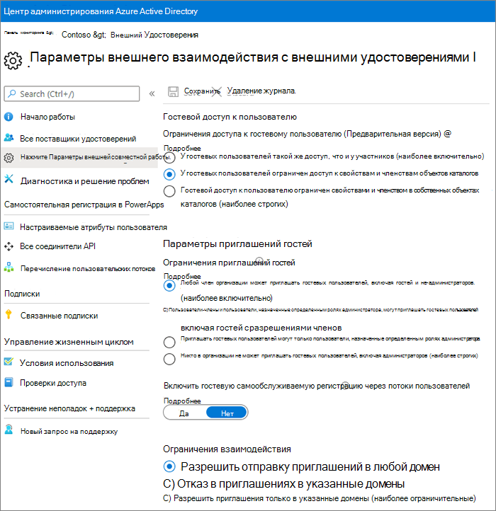

# Совместная работа с гостями на сайте

Если вам нужно совместно работать с гостями в документах, данных и списках, можно использовать сайт SharePoint. Современные сайты SharePoint подключены к группам Microsoft 365 и могут управлять членством на сайте и предоставлять дополнительные средства совместной работы, такие как общий почтовый ящик и календарь.

В этой статье мы разберем действия по настройке Microsoft 365, необходимые для настройки сайта SharePoint для совместной работы с гостями.

## Видеодемонстрация

В этом видео показаны действия по настройке, описанные в этом документе. 

> [!VIDEO https://www.microsoft.com/videoplayer/embed/RE44Llg?autoplay=false]

## Параметры внешней совместной работы Azure

Общий доступ в Microsoft 365 управляется на самом высоком уровне с помощью параметров внешней совместной работы [B2B в Azure Active Directory.](https://docs.microsoft.com/azure/active-directory/external-identities/delegate-invitations) Если в Azure AD отключен или запрещен гостевой общий доступ, этот параметр переопределит все параметры общего доступа, настроенные в Microsoft 365.

Проверьте параметры внешней совместной работы B2B, чтобы убедиться, что общий доступ гостям не заблокирован.

Настройка параметров внешней совместной работы

1. Войдите в Azure Active Directory [https://aad.portal.azure.com](https://aad.portal.azure.com) по
2. В левой области навигации щелкните **Azure Active Directory.**
3. Щелкните **внешние удостоверения.**
4. На экране **"Начало работы"** в левой области навигации щелкните **параметры внешней совместной работы.**
5. **Убедитесь, что администраторы** и пользователи в  роли приглашенного гостя могут приглашать гостей, а для участников установлено значение **"Да".**
6. Если внесены изменения, нажмите кнопку **Сохранить**.

Обратите внимание на параметры в разделе **"Ограничения для совместной работы".** Убедитесь, что домены гостей, с которых вы хотите сотрудничать, не блокируются.

Если вы работаете с гостями из нескольких организаций, вы можете ограничить их возможность доступа к данным каталога. Это не позволит им увидеть, кто еще является гостем в каталоге. Для этого в соответствии с ограничениями  доступа гостевых пользователей доступ к гостевых пользователей ограничен доступом к свойствам и членством в параметрах объектов каталога или доступ гостевых пользователей ограничен свойствами и членством в их собственных объектах **каталогов.**

## Гостевая настройка групп Microsoft 365

Современные сайты SharePoint используют группы Microsoft 365 для управления доступом к сайту. Чтобы гостевой доступ на сайтах SharePoint работал, параметры гостей групп Microsoft 365 должны быть включены.

Настройка гостевых параметров групп Microsoft 365

1. В Центре администрирования Microsoft 365 в левой области навигации **разорите параметров.**
2. Щелкните **параметры организации.**
3. В списке выберите **"Группы Microsoft 365".**
4. Убедитесь, что владельцы группы могут добавлять пользователей за пределами  вашей организации в группы **Microsoft 365** в качестве гостей, и чтобы участники группы гостей получили доступ к флажкам содержимого группы гостей.
5. Если вы влияли на изменения, нажмите **кнопку "Сохранить изменения".**

## Параметры общего доступа на уровне организации SharePoint

Чтобы у гостей был доступ к сайтам SharePoint, параметры общего доступа на уровне организации SharePoint должны разрешать общий доступ гостям.

Параметры на уровне организации определяют параметры, которые будут доступны для отдельных сайтов. Параметры сайта не могут быть более нео разрешательными, чем параметры на уровне организации.

Если вы хотите разрешить общий доступ к файлам и папам безauthenticated, выберите **"Все".** Если вы хотите убедиться, что все люди за пределами организации должны проверить подлинность, выберите **"Новые" и "Существующие гости".** Выберите самый недопустимый параметр, который потребуется любому сайту в организации.

Настройка параметров общего доступа на уровне организации SharePoint

1. В Центре администрирования Microsoft 365 в левой области навигации в центре администрирования **щелкните** **SharePoint.**
2. В Центре администрирования SharePoint в области навигации слева в разделе **"Политики"** щелкните **"Общий доступ".**
3. Убедитесь, что для внешнего общего доступа для SharePoint установлено **"Любой"** или **"Новый" и "Существующие гости".**
4. Если внесены изменения, нажмите кнопку **Сохранить**.

## Создание сайта

Следующим шагом является создание сайта, который планируется использовать для совместной работы с гостями.

Создание сайта
1. В Центре администрирования SharePoint в разделе **Сайты** щелкните **Активные сайты**.
2. Нажмите **Создать**.
3. Щелкните **сайт группы.**
4. Введите имя сайта и введите имя владельца группы (владельца сайта).
5. В **области "Дополнительные параметры"** выберите, должен ли этот сайт быть общедоступным или частным.
6. Нажмите кнопку **Далее**.
7. Нажмите кнопку **Готово**.

Мы приглашаем пользователей позже. Затем важно проверить параметры общего доступа на уровне сайта для этого сайта.

## Параметры общего доступа на уровне сайта SharePoint

Проверьте параметры общего доступа на уровне сайта, чтобы убедиться, что они позволяют использовать нужный тип доступа для этого сайта. Например, если для параметров на уровне организации установлено "Все", но вы хотите, чтобы все гости могли проверить подлинность для этого сайта, убедитесь, что для параметров общего доступа на уровне сайта установлено "Новые" и "Существующие гости". 

Обратите внимание, что доступ к сайту не может быть общим для непроверяющих людей **(параметр** "Любой"), но отдельные файлы и папки могут быть.

Вы также можете использовать [метки конфиденциальности для управления настройками](https://docs.microsoft.com/microsoft-365/compliance/sensitivity-labels-teams-groups-sites)внешнего общего доступа для сайтов SharePoint.

Настройка параметров общего доступа на уровне сайта
1. Откройте Центр администрирования SharePoint, затем на панели навигации слева разверните меню **Сайты** и нажмите **Активные сайты**.
2. Выберите сайт, который вы хотите поделиться.
3. Щелкните ...и щелкните **"Общий доступ".**
4. Убедитесь, что для общего доступа установлено **"Все",** **"Создать" и "Существующие гости".**
5. Если внесены изменения, нажмите кнопку **Сохранить**.

## Приглашение пользователей

Теперь параметры гостевого общего доступа настроены, поэтому вы можете приступить к добавлению внутренних пользователей и гостей на сайт. Доступ к сайту контролируется через связанную группу Microsoft 365, поэтому мы добавим в нее пользователей.

Приглашение внутренних пользователей в группу
1. Перейдите на сайт, на который вы хотите добавить пользователей.
2. Щелкните **ссылку** "Участники" в правом верхнем правом направлении, обозначая количество участников.
3. Нажмите **Добавить участников**.
4. Введите имена или адреса электронной почты пользователей, которых вы хотите пригласить на сайт, и нажмите кнопку **"Сохранить".**

Гостей нельзя добавить с сайта. Их необходимо добавить с помощью Outlook в Интернете. Таким образом, чтобы добавить гостей в группу и пригласить их, необходимо  щелкнуть URL-адрес сайта в столбце URL-адреса, чтобы перейти на страницу для конкретного сайта. На этой странице щелкните **значок запуска** приложений и выберите **Outlook.** Это экран, с которого можно приглашать гостей в группу, для которой описана процедура ниже.

Приглашение гостей в группу
1. В **группе** выберите группу, в которую вы хотите пригласить гостей.
2. Откройте карточку контакта группы и щелкните **ссылку "Участники"** в правом верхнем (ссылка, обозначая количество участников).
3. Нажмите **кнопку "Добавить участников"**.
4. Введите адреса электронной почты гостей, которые вы хотите пригласить, и нажмите кнопку **"Добавить".**
5. Щелкните **Закрыть**.
Обратите внимание, что нажать кнопку **"Закрыть"** следует только в том случае, если вы не является владельцем группы, и в результате вы не сможете добавить гостя в группу. В таких случаях запрос на добавление гостя в группу передается владельцу группы для утверждения.

## См. также

[Рекомендации по предоставлению общего доступа к файлам и папкам непроверенным пользователям](best-practices-anonymous-sharing.md)

[Ограничение возможности случайного раскрытия файлов при предоставлении доступа гостям](share-limit-accidental-exposure.md)

[Создание безопасной среды гостевого общего доступа](create-secure-guest-sharing-environment.md)

[Создание экстрасети B2B с управляемыми гостями](b2b-extranet.md)

[Интеграция SharePoint и OneDrive с Azure AD B2B](https://docs.microsoft.com/sharepoint/sharepoint-azureb2b-integration-preview)
