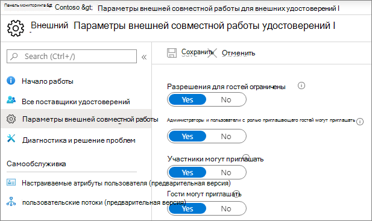
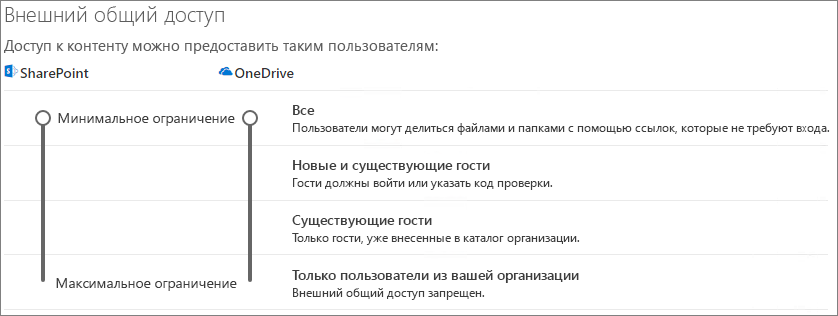
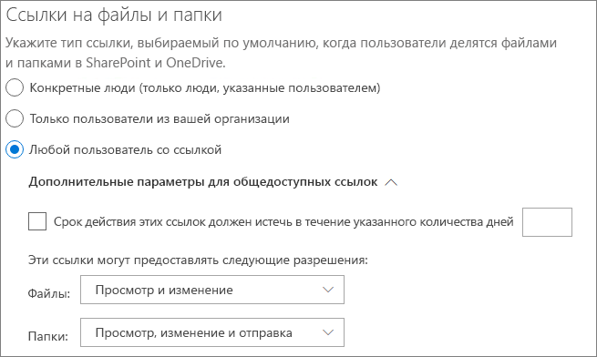
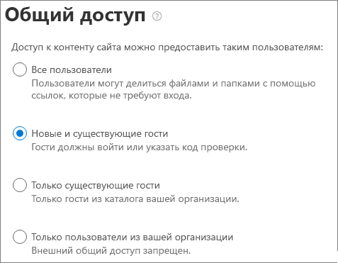

# Совместная работа с гостями над документом

Если вам необходимо сотрудничать с людьми за пределами организации в документах SharePoint или OneDrive, вы можете отправить им ссылку на общий доступ к документу. В этой статье мы проявим Microsoft 365 настройки, необходимые для настройки ссылок общего доступа для SharePoint и OneDrive для нужд вашей организации.

## Видеодемонстрация

В этом видео показаны действия по настройке, описанные в этом документе. 

> [!VIDEO https://www.microsoft.com/videoplayer/embed/RE450Vt?autoplay=false]

## Параметры внешней совместной работы Azure

Общий доступ в Microsoft 365 настраивается на самом высоком уровне с помощью [параметров внешней совместной работы B2B в Azure Active Directory](/azure/active-directory/external-identities/delegate-invitations). Если общий доступ к гостю отключен или ограничен в Azure AD, этот параметр переопределяет параметры общего доступа, настроенные в Microsoft 365.

Проверьте параметры внешней совместной работы B2B, чтобы обеспечить, чтобы общий доступ к гостям не был заблокирован.

Чтобы настроить параметры внешней совместной работы, выполните следующее.

1. Войдите в Azure Active Directory на сайте [https://aad.portal.azure.com](https://aad.portal.azure.com).
2. В области навигации слева щелкните **Azure Active Directory**.
3. Нажмите **Внешние удостоверения**.
4. На экране **Начало работы** в области навигации слева щелкните **Параметры внешней совместной работы**.
5. Убедитесь, что для параметров **Администраторы и пользователи с ролью "Приглашающий гостей" могут приглашать** и **Участники могут приглашать** установлено значение **Да**.
6. Если вы внесли изменения, нажмите кнопку **Сохранить**.

Обратите внимание на параметры в разделе **Ограничения совместной работы**. Убедитесь, что домены гостей, с которыми вы хотите сотрудничать, не заблокированы.

Если вы работаете с гостями из нескольких организаций, вы можете ограничить их доступ к данным каталога. Это не позволит им видеть других гостей в каталоге. Для этого в разделе **Ограничения доступа гостевых пользователей** выберите **Гостевые пользователи имеют ограниченный доступ к свойствам и членству в параметрах объектов каталога** или **Доступ гостевых пользователей ограничен свойствами и членством в их собственных объектах каталога**.

## SharePoint параметров общего доступа на уровне организации

Чтобы у людей за пределами организации был доступ к документу в SharePoint или OneDrive, параметры общего доступа SharePoint и OneDrive на уровне организации должны разрешать общий доступ к пользователям, не входя в организацию.

Параметры уровня организации для SharePoint определяют параметры, которые будут доступны для отдельных SharePoint сайтов. Параметры сайта не могут разрешать больше, чем параметры на уровне организации. Параметр уровня организации для OneDrive определяет уровень общего доступа, который будет доступен в библиотеках OneDrive пользователей.

Если SharePoint и OneDrive разрешить неавентированное совместное использование файлов и папок, выберите **Anyone**. Если вы хотите убедиться, что люди за пределами организации должны проверить подлинность, выберите **новые и существующие гости.** *Все* ссылки — это самый простой способ обмена данными: люди за пределами организации могут открыть ссылку без проверки подлинности и могут бесплатно передавать ее другим.

Для SharePoint выберите наиболее разрешительный параметр, который потребуется любому сайту в организации.

Чтобы настроить общий доступ для SharePoint на уровне организации, выполните следующее.

1. В Центре администрирования Microsoft 365 в области навигации слева в разделе **Центры администрирования** выберите **SharePoint**.
2. В центре администрирования SharePoint в левой области навигации в разделе **Политики** нажмите **кнопку Общий доступ**.
3. Убедитесь, что внешний общий доступ SharePoint или OneDrive для **всех** или новых и существующих **гостей.** (Обратите внимание, OneDrive параметр не может быть более допустимым, чем SharePoint параметр.)
4. Если вы внесли изменения, нажмите кнопку **Сохранить**.

## Настройка ссылок по умолчанию для SharePoint на уровне организации

Параметры ссылок на файлы или папки по умолчанию определяют тип ссылок, которые будет отображаться пользователям по умолчанию при совместном использовании файлов или папок. При желании пользователи могут изменить тип ссылки на один из доступных вариантов перед совместным использованием.

Помните, что этот параметр влияет SharePoint сайтов в организации, а также OneDrive.

Выберите ссылку из любого из следующих типов, которые затем выбираются по умолчанию при совместном доступе пользователей к файлам и папок:

- **Любой человек со ссылкой** — выберите этот параметр, если вы ожидаете сделать много неавентированных файлов и общего доступа к папкам. Если вы хотите разрешить тип ссылок *Все*, но беспокоитесь о случайном общем доступе без проверки подлинности, рассмотрите один из следующих вариантов в качестве варианта по умолчанию. Этот тип ссылки доступен, только если включен общий доступ для **всех**.
- **Только люди в вашей организации**. Выберите этот вариант, если ожидается, что совместное использование большей части файлов и папок будет осуществляться пользователями внутри вашей организации.
- **Конкретные люди**. Рассмотрите этот вариант, если ожидается совместное использование большого количества файлов и папок гостями. Этот тип ссылки работает с гостями и требует от них прохождения проверки подлинности.
 

Настройка параметров SharePoint и OneDrive по умолчанию на уровне организации

1. Перейдите на страницу общего доступа в Центре администрирования SharePoint.
2. В разделе **Ссылки на файлы и папки** выберите ссылку для общего доступа, которая будет использоваться по умолчанию.
3. Если вы внесли изменения, нажмите кнопку **Сохранить**.

Чтобы установить разрешение для ссылки общего доступа, выберите разрешение, выбранное по умолчанию **для обмена ссылками.**

1. Выберите **View,** если не хотите, чтобы неавентированные пользователи внося изменения в файлы и папки.
2. Выберите **Изменить,** если вы хотите разрешить неавентическим пользователям вносить изменения в файлы и папки.

Обратите внимание, что эти два параметра предварительной миссии могут применяться не только для гостей и внешних пользователей, но и для внутренних пользователей. Выбор разрешения определяется по собственному усмотрению.

Настройка разрешений для ссылок, позволяющих делиться с кем-либо

1. В соответствии **с этими ссылками можно предоставить такие разрешения:** 
    1. Из **выпадаемого** списка Files 
        - Выберите **Просмотр и изменение,** если вы хотите разрешить неавентическим пользователям вносить изменения в файлы.
        - Выберите **View,** если не хотите, чтобы неавентированные пользователи внося изменения в файлы.
    2. Из **выпадаемого** списка папок
        - Выберите **Просмотр, редактирование** и отправку, если вы хотите разрешить неавентическим пользователям вносить изменения в папки.
        - Выберите **Просмотр,** если вы не хотите, чтобы неавентированные пользователи внося изменения в папки.

## Настройка параметров общего доступа на уровне сайта SharePoint

Если вы делите файлы и папки, которые находятся на SharePoint сайте, необходимо также проверить параметры общего доступа на уровне сайта для этого сайта.

Чтобы настроить параметры общего доступа на уровне сайта, выполните следующее.

1. В Центре администрирования SharePoint в области навигации слева разверните раздел **Сайты** и нажмите **Активные сайты**.
2. Выберите сайт, на котором необходимо обмениваться файлами и папками с гостями.
3. Прокрутите правую строку (в которой присутствует выбранный сайт) и нажмите кнопку в любом месте в столбце **Внешний общий** доступ.
4. На всплываемой странице нажмите вкладку **Политики.**
5. В области **внешнего общего** доступа нажмите кнопку **Изменить**.
6. Убедитесь, что для параметра общего доступа установлено значение **Все** или **Новые и существующие гости**.
7. Если вы внесли изменения, нажмите кнопку **Сохранить**.

## Приглашение пользователей

Параметры обмена гостями теперь настроены; чтобы теперь пользователи могли обмениваться файлами и папками с людьми за пределами организации. Дополнительные [сведения см. в OneDrive](https://support.office.com/article/9fcc2f7d-de0c-4cec-93b0-a82024800c07) и папках Share SharePoint [или](https://support.office.com/article/1fe37332-0f9a-4719-970e-d2578da4941c) папок.

## См. также

[Рекомендации по предоставлению общего доступа к файлам и папкам непроверенным пользователям](best-practices-anonymous-sharing.md)

[Ограничение возможности случайного раскрытия файлов при предоставлении доступа гостям](share-limit-accidental-exposure.md)

[Интеграция SharePoint и OneDrive с Azure AD B2B](/sharepoint/sharepoint-azureb2b-integration-preview)