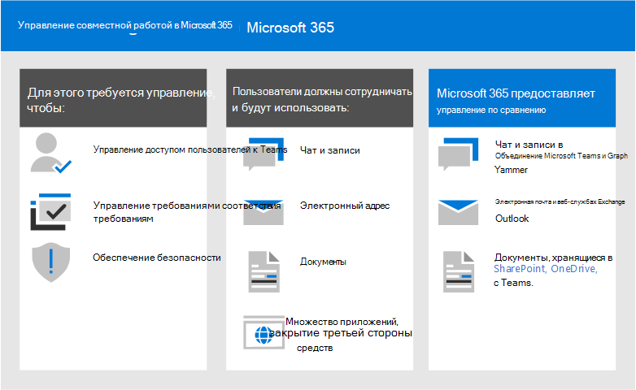
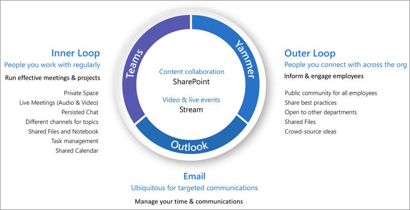

# Что такое управление совместным рабочими данными?

Управление совместной работой — это то, как вы управляете доступом пользователей к ресурсам, соблюдению стандартов бизнеса и обеспечению безопасности данных.

В настоящее время организации используют различные наборы средств. Существует группа разработчиков, использующих чат группы, руководителей, отправляющих электронную почту и всю организацию, соединяющую корпоративную социальную сеть. Используется несколько средств совместной работы, так как каждая группа уникальна и имеет свои собственные требования к функциональности и характер работы. В некоторых случаях будут использоваться только сообщения электронной почты, а другие будут в основном в чате. 

Если пользователи считают, что предоставляемые ИТ-инструменты не соответствуют потребностям, они, скорее всего, будут скачивать свое любимое приложение для пользователей, которое поддерживает свои сценарии. Несмотря на то, что этот процесс позволяет пользователям быстро приступить к работе, он ведет к неприятному взаимодействию с пользователем в Организации с несколькими учетными данными, с трудностями при совместной работе и без одного места для просмотра контента. Эта концепция называется "теневой" и создает важный риск для организаций. Она сокращает возможность единообразного управления доступом пользователей, обеспечения безопасности и соответствия требованиям служб.

Службы, такие как Microsoft 365 Groups, Teams и Yammer, позволяют пользователям и снизить риск их затенения, предоставляя средства, необходимые для сотрудничества. Microsoft 365 имеет богатый набор средств для реализации функций управления, которые может потребоваться вашей организации. 

В этой серии статей вы узнаете, как взаимодействовать группы, Teams и параметры SharePoint, какие возможности управления доступны и как создать и реализовать план управления для функций совместной работы в Microsoft 365.

## Что такое группы Microsoft 365?

Группы Microsoft 365 позволяют выбрать группу людей, которым требуется совместная работа, и легко настроить набор ресурсов для совместного использования. Добавление участников в группу автоматически предоставляет необходимые разрешения всем ресурсам, предоставляемым группой. Для управления членством в Teams и Yammer используются группы Microsoft 365.

Группы Microsoft 365 включают набор связанных ресурсов, которые пользователи могут использовать для общения и совместной работы. Группы всегда включают сайт SharePoint, планировщик, рабочую область Power BI, почтовый ящик и календарь, а также поток. В зависимости от того, как вы создадите группу, вы можете дополнительно добавить другие службы, такие как Teams, Yammer и Project.

|Ресурс|Описание|
|:------|:----------|
|[Calendar](https://support.office.com/article/schedule-a-meeting-on-a-group-calendar-in-outlook-0cf1ad68-1034-4306-b367-d75e9818376a)|Для планирования событий, связанных с группой|
|[Входящие](https://support.office.com/article/have-a-group-conversation-in-outlook-a0482e24-a769-4e39-a5ba-a7c56e828b22)|Для почтовых диалогов между членами группы. В этом почтовом ящике есть адрес электронной почты, который можно настроить на прием сообщений от пользователей вне группы и даже за преходясь в Организации, подобно обычному списку рассылки.|
|[записную книжку OneNote;](https://support.office.com/article/get-started-with-onenote-e768fafa-8f9b-4eac-8600-65aa10b2fe97)|Сбор идей, исследование и информация|
|[Планировщик](https://support.office.com/article/microsoft-planner-help-4a9a13c6-3adf-4a60-a6fc-15c0b15e16fc)|Для назначения задач проекта и управления ими между участниками группы|
|[Рабочая область Power BI](https://docs.microsoft.com/power-bi/collaborate-share/service-new-workspaces)|Пространство для совместной работы с данными с панелями мониторинга и отчетами|
|[Проект и план](https://support.microsoft.com/project)|Средства управления проектами на основе веб-сайта|
|[сайт группы SharePoint;](https://support.office.com/article/what-is-a-sharepoint-team-site-75545757-36c3-46a7-beed-0aaa74f0401e)|Центральный репозиторий для сведений, ссылок и контента, связанных с группой.|
|[Stream](https://support.microsoft.com/microsoft-stream)|Служба потоковой передачи видео|
|[Teams](https://support.microsoft.com/teams)|Рабочая область на основе чата в Microsoft 365|
|[Группа Yammer](https://support.office.com/article/Learn-about-Office-365-groups-b565caa1-5c40-40ef-9915-60fdb2d97fa2)|Общее место для бесед и обмена информацией|

Группы Microsoft 365 включают в себя разнообразные элементы управления, в том числе политику истечения срока действия, соглашения об именовании и политику заблокированных слов, которые помогают управлять группами в Организации. Так как группы управляют членством и доступом к этому набору ресурсов, Управление группами является ключевой частью управления совместной работой в Microsoft 365.

## Определение стратегии совместной работы для Организации

Существует несколько мест для сотрудничества и общения в Microsoft 365. Общие сведения о том, где пользователи могут начать беседу, помогут определить стратегию общения.

Microsoft 365 поддерживает три основных способа связи:

- Outlook: совместная работа через электронную почту с общей групповой папкой "Входящие" и "Календарь"
- Microsoft Teams — это Рабочая область для долговременного разговора, в которой вы можете иметь неформальные, в режиме реального времени, беседы по различным темам, организованным по определенным вложенным группам.
- Yammer: Корпоративный социальное интерфейс для совместной работы

- Teams: Рабочая область на основе чата (высокая скорость совместной работы) — внутренний цикл
  - Создана для совместной работы с сотрудниками, с которыми пользователи работают ежедневно
  - Информация о пользователях в одной возможности
  - Добавление вкладок, соединителей и Боты
  - Live Chat, аудио-и видеоконференций, записанные собрания

- Yammer: подключение через организацию (корпоративный социальное) — внешний цикл
  - Сообщества практических функциональных групп людей, совместно использующих общий интерес или опыт, но необязательно работающие с повседневной работой на повседневной основе
  - Подключение, учебные сообщества, сообщества на основе ролей

- Почтовый ящик и календарь (совместная работа на основе электронной почты)
  - Используется для целевой связи с группой людей
  - Общий календарь для собраний с другими участниками группы
 
По мере того как вы определите, как вы хотите использовать функции совместной работы в Microsoft 365, примите во внимание следующие методы общения, которые пользователи могут использовать в различных сценариях.

> [!NOTE]
> Если новая группа Office 365 создана с помощью Yammer или Teams, эта группа не отображается в Outlook или адресной книге, так как основной обмен данными между этими пользователями происходит в соответствующих клиентах. Группы Yammer не могут быть подключены к Teams.

## Рекомендации

При запуске процесса планирования управления учитывайте следующие рекомендации:

- **Обратитесь к пользователям** , чтобы определить самых важных пользователей функций для совместной работы и встретиться с ними, чтобы понять основные бизнес-требования и сценарии использования.

- **Балансирование рисков и преимуществ** — Проанализируйте требования к Организации, законодательным требованиям, юридическим требованиям и соответствия требованиям, а затем спланируйте решение, которое оптимизирует все результаты.

- **Адаптироваться к различным организациям, а также к различным типам контента и сценариям** следует учитывать различные потребности для разных групп или отделов, а также различные типы контента, такие как содержимое интрасети и содержимое OneDrive пользователя.

- **Прировняйте к бизнес** -целям — бизнес-цели поможет вам определить, сколько времени и энергии необходимо для инвестиций в управление.

- **Внедрение решений управления непосредственно в решения, которые вы создаете** , решения по управлению можно реализовать, включив или отключив функции в Microsoft 365.

- Разработайте с решениями **по обучению** , такими как [Microsoft 365 Learning](https://docs.microsoft.com/office365/customlearning) , чтобы убедиться в том, что ваши ожидания в Организации поддаются обучающим материалам, предоставляемым корпорацией Майкрософт.

- **В вашей организации есть стратегия для общения с политиками и рекомендациями по управлению** для создания центра принятия Microsoft 365 на сайте SharePoint для обмена данными о политиках и процедурах.

- **Определение ролей и обязанностей** — Идентифицируйте основную группу управления и работайте с ними с помощью ключевых решений по подготовке и именованию и внешнему доступу, а затем обходите оставшиеся решения.

- Повторно **посещайте ваши решения как изменения бизнеса и технологий** — периодически выполняйте проверку новых возможностей и новых возможностей бизнеса.

Чтобы подробно ознакомиться с этими рекомендациями, прочитайте статью [Создание плана управления совместным](collaboration-governance-first.md)использованием.

## Влияние на конечные пользователи и управление изменениями

Так как группы и Teams можно создавать несколькими способами, мы рекомендуем провести обучение пользователей, чтобы использовать метод, который лучше всего подходит для вашей организации:

- Если ваша организация выполняет большую часть своей связи с помощью электронной почты, попросите пользователей создать группы в Outlook.
- Если ваша организация в большой степени использует SharePoint или переносится из локальной среды SharePoint, попросите пользователей создать сайты групп SharePoint для совместной работы.
- Если в вашей организации развернуты Teams, попросите пользователей создать группу, когда им потребуется место для совместной работы.

Это позволяет избежать путаницы, если пользователи незнакомы с тем, как группы связываются с соответствующими службами. Дополнительные сведения о том, как общаться с пользователями о группах, можно узнать в [статье объяснение групп Microsoft 365 для пользователей](../admin/create-groups/explain-groups-knowledge-worker.md).

## Основные требования к управлению и лицензирование

Возможности управления для совместной работы в Microsoft 365 включают функции в Microsoft 365, Teams, SharePoint и Azure Active Directory.

| Возможность или функция | Описание | Лицензирование |
|:----------------------|:------------|:----------|
|Общий доступ к группам и сайтам|Управлять доступом к группам, группам и сайтам для пользователей за пределами вашей организации.|Microsoft 365 в ~ или E3|
|Разрешить или запретить домен|Ограничьте общий доступ для пользователей, не входящих в вашу организацию, к пользователям из определенных доменов.|Microsoft 365 в ~ или E3|
|Средства самостоятельного создания сайтов|Разрешите или запретите пользователям создавать собственные сайты SharePoint.|Microsoft 365 в ~ или E3|
|Ограниченный доступ к сайту и файлам|Ограничьте общий доступ к сайтам, файлам и папкам для членов определенной группы безопасности.|Microsoft 365 в ~ или E3|
|Создание группы с ограниченным доступом|Ограничьте создание групп и групп членами определенной группы безопасности.|Microsoft 365 в ~ или E3 с Azure AD Premium или Azure AD Basic EDU|
|Политика именования групп|Принудительное использование префиксов или суффиксов в именах групп и групп.|Microsoft 365 в ~ или E3 с Azure AD Premium или Azure AD Basic EDU|
|Политика истечения срока действия групп|Настройка истечения срока действия неактивных групп и команд и их удаление через заданный период времени.|Microsoft 365 в качестве лицензий на Azure AD Premium|
|Гостевой доступ по группам|Разрешите или запретите совместное использование групп и групп пользователями, не входящими в вашу организацию, на уровне отдельных групп.|Microsoft 365 в ~ или E3|

## Создание плана управления

Чтобы создать план управления, выполните следующие основные действия:

1. Оцените основные бизнес-цели и процессы — [Создайте план](collaboration-governance-first.md) управления в соответствии с потребностями вашего бизнеса.
2. Общие сведения о параметрах служб — [Параметры в группах и SharePoint](groups-sharepoint-governance.md) взаимодействуют друг с другом, как и [Параметры в группах, SharePoint и Teams](groups-sharepoint-teams-governance.md) и [других службах](groups-services-interactions.md). Не забудьте ознакомиться с этими действиями при планировании стратегии по управлению.
3. Планирование управления доступом пользователей — планирование [уровня доступа, который вы хотите предоставить пользователям в группах, SharePoint и Teams](groups-teams-access-governance.md).
4. Планирование управления параметрами соответствия требованиям: просмотрите доступные [варианты соответствия для групп Microsoft 365, Teams и совместной работы SharePoint](groups-teams-compliance-governance.md).
5. Планирование управления связями — обзор доступных [параметров управления связью для сценариев совместной работы](groups-teams-communication-governance.md).
6. Планирование организации и управления жизненным циклом — выбор [политик, которые необходимо использовать для создания групп и групп, именования, истечения срока действия и архивации](plan-organization-lifecycle-governance.md). Кроме того, Узнайте о [завершении параметров жизненного цикла для групп, Teams и Yammer](end-life-cycle-groups-teams-sites-yammer.md)

## Обучение для администраторов

Эти обучающие модули от Майкрософт помогут вам освоить функции совместной работы в Teams и SharePoint.

#### Teams

|Распознавател|Управление совместной работой команды с помощью Microsoft Teams|
|:---|:---|
||Управляя совместной работой команды с помощью Microsoft Teams, вы ознакомитесь с функциями и возможностями Microsoft Teams, центра совместной работы в Microsoft 365. Вы узнаете, как использовать Teams для упрощения совместной работы и связи в организации, локально и за ее пределами, на различных устройствах (настольных компьютерах, планшетах, телефонах), применяя все разнообразие функций приложений Office 365. Вы поймете, каким образом Teams обеспечивает комплексную и гибкую среду для совместной работы в разных приложениях и на разных устройствах. Эта схема обучения поможет вам подготовиться к сертификации Сертификат Microsoft 365: помощник администратора Teams.  2 часа 17 (мин), учебный путь — 5 модулей|

> [!div class="nextstepaction"]
> [Запуск >](https://docs.microsoft.com/learn/modules/m365-teams-collab-prepare-deployment/introduction/)

#### SharePoint

|Распознавател|Совместная работа с использованием SharePoint в Microsoft 365|
|:---|:---|
||В статье, посвященной управлению общим контентом с помощью Microsoft SharePoint, рассказывается о функциях и возможностях SharePoint, а также о том, как этот продукт работает с Microsoft 365. Вы узнаете о различных типах сайтов SharePoint (в том числе о центральных сайтах), а также о функциях защиты данных, составления отчетов и мониторинга. Вы также узнаете, как с помощью функции общего доступа к файлам и папкам в SharePoint оптимизировать совместную работу, как предоставлять внешний доступ к файлам и как управлять сайтами SharePoint в Центре администрирования SharePoint. Эта схема обучения поможет вам подготовиться к сертификации Сертификат Microsoft 365: помощник администратора по командной работе.  1 час (мин.), с поминутным обучением – 4 модуля|

> [!div class="nextstepaction"]
> [Запуск >](https://docs.microsoft.com/learn/modules/m365-teams-sharepoint-plan-sharepoint/introduction/)

## Обучение пользователей

Эти обучающие модули могут помочь пользователям использовать команды, группы и SharePoint для совместной работы в Microsoft 365.

|Teams|SharePoint|
|:---|:---|
| **[Настройка и настройка команды](https://support.microsoft.com/office/702a2977-e662-4038-bef5-bdf8ee47b17b)**| **[Общий доступ и синхронизация](https://support.microsoft.com/office/98cb2ff2-c27e-42ea-b055-c2d895f8a5de)**|
| **[Отправка и поиск файлов](https://support.microsoft.com/office/57b669db-678e-424e-b0a0-15d19215cb12)**||
| **[Сотрудничество в Teams и каналах](https://support.microsoft.com/office/c3d63c10-77d5-4204-a566-53ddcf723b46)**|||

## Рисунке

На этих иллюстрациях вы узнаете, как группы и Teams взаимодействуют с другими службами в Microsoft 365 и какие функции управления и соответствия доступны для управления этими службами в Организации.

### Группы в Microsoft 365 для ИТ-архитекторов
Что следует знать ИТ-архитекторам о группах в Microsoft 365

|**Item**|**Описание**|
|:-----|:-----|
|   [PDF](https://github.com/MicrosoftDocs/microsoft-365-docs/raw/public/microsoft-365/downloads/msft-m365-groups.pdf) \| [Visio](https://github.com/MicrosoftDocs/OfficeDocs-Enterprise/raw/live/Enterprise/downloads/msft-m365-groups.vsdx)   Обновление: июнь 2019 г.|На этих иллюстрациях подробно показаны разные типы групп, как они создаются и управляются, а также приводится несколько рекомендаций по управлению.|

### Microsoft Teams и связанные службы повышения производительности в Microsoft 365 для ИТ-архитекторов
Логическая архитектура служб повышения производительности в Microsoft 365, начиная с Microsoft Teams.

|**Item**|**Описание**|
|:-----|:-----|
|   [PDF](https://github.com/MicrosoftDocs/microsoft-365-docs/raw/public/microsoft-365/downloads/msft-m365-teams-logical-architecture.pdf) \| [Visio](https://github.com/MicrosoftDocs/OfficeDocs-Enterprise/raw/live/Enterprise/downloads/msft-m365-teams-logical-architecture.vsdx)   Обновление: апрель 2019 г.   |Корпорация Майкрософт предоставляет набор служб повышения производительности, которые взаимодействуют между собой, обеспечивая возможности совместной работы для управления данными, безопасности и соответствия требованиям.    Этот набор иллюстраций демонстрирует логическую архитектуру служб повышения производительности для корпоративных архитекторов, начиная с Microsoft Teams.|

### Возможности защиты информации и обеспечения соответствия требованиям Microsoft 365

Microsoft 365 включает широкий набор возможностей защиты информации и соответствия требованиям. Вместе с инструментами для повышения продуктивности корпорации Майкрософт эти возможности предназначены для того, чтобы помочь организациям совместно работать в режиме реального времени и придерживаться строгих нормативных требований. 

В этом наборе иллюстраций используется одна из наиболее поднадзорных отраслей, финансовых служб, чтобы продемонстрировать, как эти возможности можно применять для удовлетворения распространенных нормативных требований. Вы можете адаптировать эти иллюстрации для собственного использования. 

| Item | Описание |
|:-----|:-----|
|   Английский: [скачать как файл в формате PDF](https://download.microsoft.com/download/3/a/6/3a6ab1a3-feb0-4ee2-8e77-62415a772e53/m365-compliance-illustrations.pdf) \| [как Visio](https://download.microsoft.com/download/3/a/6/3a6ab1a3-feb0-4ee2-8e77-62415a772e53/m365-compliance-illustrations.vsdx)     Японский: [скачать как файл в формате PDF](https://download.microsoft.com/download/6/f/1/6f1a7d0e-dd8e-442e-b073-8e94327ae4f8/m365-compliance-illustrations.pdf) \| [как Visio](https://download.microsoft.com/download/6/f/1/6f1a7d0e-dd8e-442e-b073-8e94327ae4f8/m365-compliance-illustrations.vsdx)     Обновлено 2020 ноября|Включаются <ul><li>  Защита информации Майкрософт и защита от потери данных</li><li>Политики и метки хранения </li><li>Информационные барьеры</li><li>Соответствие требованиям к обмену данными</li><li>Риск для оценки</li><li>Сторонние приемы данных</li>|

## Conference sessions (Сеансы конференций)

Просмотрите эти сеансы конференции, чтобы узнать больше об управлении для групп и Teams Microsoft 365.

**Процессах**

Изучите основы и новые нововведения в группах Microsoft 365, в том числе управление и управление на масштабируемости, рекомендации по эффективному использованию и внедрению и самообслуживания.

- [Принятие групп Microsoft 365](https://www.youtube.com/watch?v=dAamBF1gb7M)

**Управление**

Сведения о том, как настроить жизненный цикл срока действия групп, политики именования, метки классификации, совместную работу с внешними гостями и управлять разрешениями на создание групп.

- [Преобразование совместной работы и борьбы с теневым копированием с помощью групп Office 365](https://www.youtube.com/watch?v=Bhf_bKx3lAg)

**Пример клиента**

В этом примере показано, как использовать группы Microsoft 365, SharePoint, Teams и Yammer совместно для предоставления глобальной платформы совместной работы.

- [Поиск своей точки взаимодействия с группами Office 365, SharePoint, Teams и Yammer](https://www.youtube.com/watch?v=Rx9eVwqXeQk)
