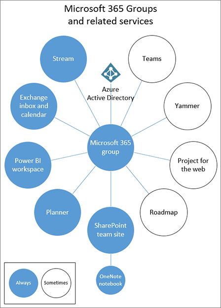

# Обзор руководства по совместной работе в Microsoft 365Overview of collaboration governance in Microsoft 365

Microsoft 365 имеет богатый набор средств для реализации функций управления, которые может потребоваться вашей организации.Microsoft 365 has a rich set of tools to implement any governance capabilities your organization might require. Эта статья посвящена ИТ-специалистам с указанием правильных вопросов по определению требований к управлению и способам их удовлетворения в соответствии с их профилями Организации.This article guides IT Pros to ask the right questions to determine their requirements for governance and how to meet them based on their organizational profile.

## Что такое группы Microsoft 365?What are Microsoft 365 groups?

Мы знаем, что в настоящее время организации используют различные наборы инструментов.We know that organizations today are using a diverse tool set. Существует группа разработчиков, использующих чат группы, руководителей, отправляющих электронную почту и всю организацию, соединяющую корпоративную социальную сеть.There's the team of developers using team chat, the executives sending email, and the entire organization connecting over enterprise social. Используется несколько средств совместной работы, так как каждая группа уникальна и имеет свои собственные требования к функциональности и характер работы.Multiple collaboration tools are in use because every group is unique and has their own functional needs and work style. В некоторых случаях будут использоваться только сообщения электронной почты, а другие будут в основном в чате.Some will use only email while others will live primarily in chat. 

Если пользователи считают, что предоставляемые ИТ-инструменты не соответствуют потребностям, они, скорее всего, будут скачивать свое любимое приложение для пользователей, которое поддерживает свои сценарии.If users feel the IT-provided tools do not fit their needs, they will likely download their favorite consumer app which supports their scenarios. Несмотря на то, что этот процесс позволяет пользователям быстро приступить к работе, он ведет к неприятному взаимодействию с пользователем в Организации с несколькими учетными данными, с трудностями при совместной работе и без одного места для просмотра контента.Although this process allows users to get started quickly, it leads to a frustrating user experience across the organization with multiple logins, difficulty sharing, and no single place to view content. Эта концепция называется "теневой" и создает важный риск для организаций.This concept is referred to as “Shadow IT” and poses a significant risk to organizations. Она сокращает возможность единообразного управления доступом пользователей, обеспечения безопасности и соответствия требованиям служб.It reduces the ability to uniformly manage user access, ensure security, and service compliance needs.

Службы, такие как Microsoft 365 Groups, Teams и Yammer, позволяют пользователям и снизить риск их затенения, предоставляя средства, необходимые для сотрудничества.Services such as Microsoft 365 groups, Teams, and Yammer empower users and reduces the risk of shadow IT by providing the tools needed to collaborate. Группы Microsoft 365 позволяют выбрать группу людей, которым требуется совместная работа, и легко настроить набор ресурсов для совместного использования.Microsoft 365 groups lets you choose a set of people with whom you wish to collaborate, and easily set up a collection of resources for those people to share. Добавление участников в группу автоматически предоставляет необходимые разрешения всем ресурсам, предоставляемым группой.Adding members to the group automatically grants the needed permissions to all assets provided by the group. Для управления членством в Teams и Yammer используются группы Microsoft 365.Both Teams and Yammer use Microsoft 365 groups to manage their membership.

Группы Microsoft 365 включают в себя разнообразные элементы управления, в том числе политику истечения срока действия, соглашения об именовании и политику заблокированных слов, которые помогают управлять группами в Организации.Microsoft 365 Groups includes a variety of governance controls, including an expiration policy, naming conventions, and a blocked words policy, to help you manage groups in your organization. Ознакомьтесь с разделом [Планирование управления Организацией и жизненным циклом для групп microsoft 365 и Microsoft Teams](plan-organization-lifecycle-governance.md) для получения дополнительных сведений.See [Plan organization and lifecycle governance for Microsoft 365 groups and Microsoft Teams](plan-organization-lifecycle-governance.md) for details.

## Техническая архитектураTechnical architecture

Microsoft 365 поддерживает три основных способа связи:There are three main communication methods supported by Microsoft 365:

- Outlook: совместная работа через электронную почту с общей групповой папкой "Входящие" и "Календарь"Outlook: collaboration through email with a shared group inbox and calendar
- Microsoft Teams — это Рабочая область для долговременного разговора, в которой вы можете иметь неформальные, в режиме реального времени, беседы по различным темам, организованным по определенным вложенным группам.Microsoft Teams: a persistent-chat-based workspace where you can have informal, real-time, conversations around a variety of topics, organized by specific sub-groups
- Yammer: Корпоративный социальное интерфейс для совместной работыYammer: enterprise social experience for collaboration

> [!NOTE]
> Создание новой группы с помощью других приложений для совместной работы, таких как SharePoint, планировщика или потока, приведет к созданию группы с папкой "Входящие" Outlook и возможности подключения к Teams.Creating a new group via other teamwork applications - such as SharePoint, Planner or Stream - will create a group with an Outlook inbox and the ability to connect to Teams.

В зависимости от того, где создана группа, определенные ресурсы автоматически подготавливаются, например:Depending on where a group is created, certain resources are provisioned automatically, such as:
- [Папка "Входящие"](https://support.office.com/article/have-a-group-conversation-in-outlook-a0482e24-a769-4e39-a5ba-a7c56e828b22) — для сообщений электронной почты между участниками группы.[Inbox](https://support.office.com/article/have-a-group-conversation-in-outlook-a0482e24-a769-4e39-a5ba-a7c56e828b22) - For email conversations between group members. В этом почтовом ящике есть адрес электронной почты, который можно настроить на прием сообщений от пользователей вне группы и даже за преходясь в Организации, подобно обычному списку рассылки.This inbox has an email address and can be set to accept messages from people outside the group and even outside your organization, much like a traditional distribution list.
 - [Calendar](https://support.office.com/article/schedule-a-meeting-on-a-group-calendar-in-outlook-0cf1ad68-1034-4306-b367-d75e9818376a) — для планирования событий, связанных с группой[Calendar](https://support.office.com/article/schedule-a-meeting-on-a-group-calendar-in-outlook-0cf1ad68-1034-4306-b367-d75e9818376a) – For scheduling events related to the group
- [Сайт группы SharePoint](https://support.office.com/article/what-is-a-sharepoint-team-site-75545757-36c3-46a7-beed-0aaa74f0401e) — центральный репозиторий для сведений, ссылок и контента, связанных с группой.[SharePoint team site](https://support.office.com/article/what-is-a-sharepoint-team-site-75545757-36c3-46a7-beed-0aaa74f0401e) – A central repository for information, links and content relating to your group
- [Записная книжка OneNote](https://support.office.com/article/get-started-with-onenote-e768fafa-8f9b-4eac-8600-65aa10b2fe97) — для сбора идей, исследований и информации[OneNote notebook](https://support.office.com/article/get-started-with-onenote-e768fafa-8f9b-4eac-8600-65aa10b2fe97) – For gathering ideas, research, and information
- [Планировщик](https://support.office.com/article/microsoft-planner-help-4a9a13c6-3adf-4a60-a6fc-15c0b15e16fc) — для назначения и управления задачами проекта среди участников группы[Planner](https://support.office.com/article/microsoft-planner-help-4a9a13c6-3adf-4a60-a6fc-15c0b15e16fc) – For assigning and managing project tasks among your group members
- [Группа Yammer](https://support.office.com/article/Learn-about-Office-365-groups-b565caa1-5c40-40ef-9915-60fdb2d97fa2) — общее место для бесед и обмена информацией[Yammer group](https://support.office.com/article/Learn-about-Office-365-groups-b565caa1-5c40-40ef-9915-60fdb2d97fa2) – A common place to have conversations and share information
- Teams — Рабочая область на основе чата в Microsoft 365Teams – A chat-based workspace in Microsoft 365
- Поток — служба потоковой передачи видеоStream - A video streaming service

> [!NOTE]
> Если новая группа Office 365 создана с помощью Yammer или Teams, эта группа не отображается в Outlook или адресной книге, так как основной обмен данными между этими пользователями происходит в соответствующих клиентах.When a new Office 365 Group is created via Yammer or Teams, the group isn't visible in Outlook or the address book because the primary communication between those users happens in their respective clients. Группы Yammer не могут быть подключены к Teams.Yammer groups cannot be connected to Teams.

## Параметры совместной работыCollaboration options

Существует несколько мест для сотрудничества и общения в Microsoft 365.There are multiple places to collaborate and have conversations within Microsoft 365. Общее представление о том, как начать беседу, поможет определить стратегию общения.Understanding where to start a conversation can help you define a strategy for communication.

- Teams: Рабочая область на основе чата (высокая скорость совместной работы) — внутренний циклTeams: chat-based workspace (high velocity collaboration) – inner loop
  - Создана для совместной работы с людьми, с которыми вы работаете ежедневноBuilt for collaboration with the people you work with every day
  - Информация о пользователях в одной возможностиPuts information at the fingertips of users in a single experience
  - Добавление вкладок, соединителей и БотыAdd tabs, connectors and bots
  - Live Chat, аудио-и видеоконференций, записанные собранияLive chat, audio/video conferencing, recorded meetings

- Yammer: подключение через организацию (корпоративный социальное) — внешний циклYammer: connect across the org (enterprise social) – outer loop
  - Сообщества практических функциональных групп людей, совместно использующих общий интерес или опыт, но необязательно работающие с повседневной работой на повседневной основеCommunities of practice - Cross-functional groups of people who share a common interest or expertise but are not necessarily working together on a day-to-day basis
  - Подключение, учебные сообщества, сообщества на основе ролейLeadership connection, learning communities, role-based communities

- Почтовый ящик и календарь (совместная работа на основе электронной почты)Mailbox and calendar (email-based collaboration)
  - Использование для целевой связи с группой людейUse for targeted communication with a group of people
  - Общий календарь для собраний с другими участниками группыShared calendar for meetings with other group members
 
Каждая группа получает подключенный сайт группы SharePoint, на котором пользователи могут обмениваться контентом, создавать собственные страницы и создавать Новости.Every group gets a connected SharePoint team site where users can share content, create customized pages and author news. Вы также можете [подключить существующие сайты группы SharePoint к новым группам Microsoft 365](https://docs.microsoft.com/sharepoint/dev/features/groupify/groupify-overview).You can also [connect existing SharePoint team sites to new Microsoft 365 groups](https://docs.microsoft.com/sharepoint/dev/features/groupify/groupify-overview).

## РисункеIllustrations

### Microsoft Teams и связанные службы повышения производительности в Microsoft 365 для ИТ-архитекторовMicrosoft Teams and related productivity services in Microsoft 365 for IT architects
Логическая архитектура служб повышения производительности в Microsoft 365, начиная с Microsoft Teams.The logical architecture of productivity services in Microsoft 365, leading with Microsoft Teams.

|**Ресурс****Item**|**Описание****Description**|
|:-----|:-----|
|   [PDF](https://github.com/MicrosoftDocs/microsoft-365-docs/raw/public/microsoft-365/downloads/msft-m365-teams-logical-architecture.pdf) \| [Visio](https://github.com/MicrosoftDocs/OfficeDocs-Enterprise/raw/live/Enterprise/downloads/msft-m365-teams-logical-architecture.vsdx)[PDF](https://github.com/MicrosoftDocs/microsoft-365-docs/raw/public/microsoft-365/downloads/msft-m365-teams-logical-architecture.pdf) \| [Visio](https://github.com/MicrosoftDocs/OfficeDocs-Enterprise/raw/live/Enterprise/downloads/msft-m365-teams-logical-architecture.vsdx)   Обновление: апрель 2019 г.Updated April 2019   |Корпорация Майкрософт предоставляет набор служб повышения производительности, которые взаимодействуют между собой, обеспечивая возможности совместной работы для управления данными, безопасности и соответствия требованиям.Microsoft provides a suite of productivity services that work together to provide collaboration experiences with data governance, security, and compliance capabilities.    Этот набор иллюстраций демонстрирует логическую архитектуру служб повышения производительности для корпоративных архитекторов, начиная с Microsoft Teams.This series of illustrations provides a view into the logical architecture of productivity services for enterprise architects, leading with Microsoft Teams.|

### Группы в Microsoft 365 для ИТ-архитекторовGroups in Microsoft 365 for IT Architects
Что следует знать ИТ-архитекторам о группах в Microsoft 365What IT architects need to know about groups in Microsoft 365

|**Ресурс****Item**|**Описание****Description**|
|:-----|:-----|
|   [PDF](https://github.com/MicrosoftDocs/microsoft-365-docs/raw/public/microsoft-365/downloads/msft-m365-groups.pdf) \| [Visio](https://github.com/MicrosoftDocs/OfficeDocs-Enterprise/raw/live/Enterprise/downloads/msft-m365-groups.vsdx)[PDF](https://github.com/MicrosoftDocs/microsoft-365-docs/raw/public/microsoft-365/downloads/msft-m365-groups.pdf) \| [Visio](https://github.com/MicrosoftDocs/OfficeDocs-Enterprise/raw/live/Enterprise/downloads/msft-m365-groups.vsdx)   Обновление: июнь 2019 г.Updated June 2019|На этих иллюстрациях подробно показаны разные типы групп, как они создаются и управляются, а также приводится несколько рекомендаций по управлению.These illustrations detail the different types of groups, how these are created and managed, and a few governance recommendations.|

## Conference sessions (Сеансы конференций)Conference sessions

Просмотрите эти сеансы конференции, чтобы узнать больше об управлении для групп и Teams Microsoft 365.Watch these conference sessions to learn more about governance for Microsoft 365 Groups and Teams.

**Процессах****Fundamentals**

Изучите основы и новые нововведения в группах Microsoft 365, в том числе управление и управление на масштабируемости, рекомендации по эффективному использованию и внедрению и самообслуживания.Learn the fundamentals and new innovations in Microsoft 365 Groups, including management and governance at scale, best practices for driving usage and adoption, and self-service.

- [Принятие групп Microsoft 365Embrace Microsoft 365 Groups](https://www.youtube.com/watch?v=dAamBF1gb7M)

**Управление****Governance**

Сведения о том, как настроить жизненный цикл срока действия групп, политики именования, метки классификации, совместную работу с внешними гостями и управлять разрешениями на создание групп.Learn how to set up your groups expiry lifecycle, naming policies, classification labels, collaboration with external guests, and manage group creation permissions.

- [Преобразование совместной работы и борьбы с теневым копированием с помощью групп Office 365Transform collaboration and fight shadow IT with Office 365 groups](https://www.youtube.com/watch?v=Bhf_bKx3lAg)

**Пример клиента****Customer example**

В этом примере показано, как использовать группы Microsoft 365, SharePoint, Teams и Yammer совместно для предоставления глобальной платформы совместной работы.See a behind-the-scenes example of how Microsoft 365 Groups, SharePoint, Teams, and Yammer work together to provide a global collaboration platform.

- [Поиск своей точки взаимодействия с группами Office 365, SharePoint, Teams и YammerFinding your collaboration sweet spot with Office 365 Groups, SharePoint, Teams, and Yammer](https://www.youtube.com/watch?v=Rx9eVwqXeQk)
