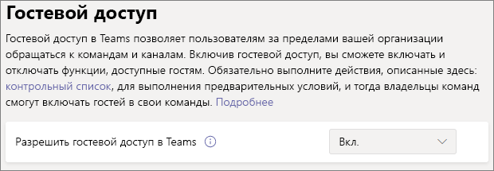

# Настройка команд с базовым уровнем защиты

В этой статье объясняется, как развернуть команды с базовым уровнем защиты. Этот уровень предоставляет пользователям широкий спектр возможностей для совместной работы, улучшает управление разрешениями и обеспечивает базовую защиту от чрезмерного раскрытия информации. Для защиты этого уровня рекомендуется использовать политики удостоверений и доступа к устройствам, а также защиту от вредоносных программ. Кроме того, при необходимости можно применить политики условного доступа и защиты от потери данных.

## Начальная защита

На первом этапе рекомендуется настроить базовые политики удостоверений и доступа к устройствам. Дополнительные сведения см. в статье [Рекомендации по политикам безопасности для чатов, групп и файлов Teams](https://docs.microsoft.com/microsoft-365/enterprise/teams-access-policies).

Мы также рекомендуем включить основные функции Расширенной защиты от угроз для защиты от вредоносных программ в документах, вложениях и ссылках. Рекомендуем включить все параметры, указанные в таблице ниже.

|Параметр|Информация|
|:------|:-----------|
|Безопасные вложения ATP для SPO, OneDrive и Teams|[Безопасные вложения Office 365 ATP](https://docs.microsoft.com/microsoft-365/security/office-365-security/atp-safe-attachments) [Office 365 ATP для SharePoint, OneDrive и Microsoft Teams](https://docs.microsoft.com/microsoft-365/security/office-365-security/atp-for-spo-odb-and-teams)|
|Безопасные документы ATP|[Безопасные документы в Office 365 Advanced Threat Protection](https://docs.microsoft.com/microsoft-365/security/office-365-security/safe-docs)|
|Безопасные ссылки ATP для Teams|[Безопасные ссылки Office 365 в Teams](https://docs.microsoft.com/microsoft-365/security/office-365-security/atp-safe-links-for-teams) [Безопасные ссылки Office 365 ATP](https://docs.microsoft.com/microsoft-365/security/office-365-security/atp-safe-links)|

## Предоставление общего доступа гостям в Teams

На каждом из уровней имеется возможность общего доступа для пользователей за пределами организации. На конфиденциальном и строго конфиденциальном уровнях защиты можно отключить предоставление общего доступа гостям на уровне команды, воспользовавшись метками конфиденциальности. Однако параметр общего доступа для гостей на уровне организации должен быть включен, чтобы предоставление общего доступа гостям вообще было возможно в Teams.

Настройка параметров гостевого доступа в Teams

1. Войдите в Центр администрирования Microsoft 365 на сайте [https://admin.microsoft.com](https://admin.microsoft.com).
2. В области навигации слева щелкните **Показать все**.
3. В разделе **Центры администрирования** щелкните **Teams**.
4. В Центре администрирования Teams, в области навигации слева разверните раздел **Параметры на уровне организации** и щелкните **Гостевой доступ**.
5. Убедитесь, что для параметра **Разрешить гостевой доступ в Teams** задано значение **Вкл.**.
6. Внесите необходимые изменения в дополнительные параметры гостей и нажмите кнопку **Сохранить**.

> [!NOTE]
> Активация параметра гостя в Teams может занять до двадцати четырех часов с момента включения.

Общий доступ для гостей включается по умолчанию для групп Office 365 и SharePoint, однако если его настройки для организации были изменены, рекомендуем ознакомиться со статьей [Совместная работа с гостями в команде](https://docs.microsoft.com/microsoft-365/solutions/collaborate-as-team), чтобы убедиться, что общий доступ для гостей будет доступен в Teams.

## Общий доступ к сайтам и файлам

Чтобы снизить риск случайного предоставления общего доступа к файлам или папкам пользователям за пределами вашей организации, рекомендуем изменить ссылку для общего доступа по умолчанию для SharePoint на *Только пользователи из организации*. (Если необходим внешний общий доступ и включен общий доступ для гостей, пользователи могут изменить тип ссылки при предоставлении общего доступа.)

Изменение ссылки для общего доступа по умолчанию
1. Откройте [Центр администрирования SharePoint](https://admin.microsoft.com/sharepoint).
2. В разделе **Политики** щелкните **Общий доступ**.
3. В разделе **Ссылки на файлы и папки** выберите пункт **Только пользователи из организации**.
4. Нажмите кнопку **Сохранить**.

Чтобы обеспечить оптимальный общий доступ для гостей, мы также рекомендуем включить [интеграцию SharePoint и OneDrive с Azure AD B2B](https://docs.microsoft.com/sharepoint/sharepoint-azureb2b-integration-preview).

## Создание команды

Дополнительная настройка для базового уровня защиты выполняется на сайте SharePoint, связанном с командой. Прежде чем перейти к следующему разделу, [создайте общедоступную или приватную команду](https://support.office.com/article/174adf5f-846b-4780-b765-de1a0a737e2b).

## Настройки общего доступа к сайту

По умолчанию участники сайта SharePoint могут приглашать других пользователей на сайт. Если сайт является частью команды, участники команды будут включены в число участников сайта. Тем не менее, пользователи, добавленные непосредственно на сайт, не имеют доступа к остальной части команды. В связи с этим рекомендуем управлять разрешениями только через команду.

Чтобы помочь в управлении разрешениями, рекомендуем настроить связанный сайт, который могут совместно использовать только владельцы. Это упрощает управление разрешениями и помогает избежать доступа пользователей без ведома владельца команды. Выполните эти действия для каждой команды, которой требуется базовый уровень защиты.

Обновление параметров общего доступа к сайту
1. На панели инструментов для команды щелкните **Файлы**.
2. Щелкните **Открыть в SharePoint**.
3. На панели инструментов сайта SharePoint щелкните значок параметров и выберите **Разрешения для сайта**.
4. В области **Разрешения для сайта** в разделе **Параметры общего доступа** щелкните **Изменить параметры общего доступа**.
5. В разделе **Разрешения общего доступа** выберите **Владельцы и участники сайта, и пользователи с правами «Редактировать» могут предоставлять общий доступ к файлам и папкам, но только владельцы сайта могут делиться сайтом**, а затем нажмите кнопку **Сохранить**.

## Дополнительная защита

В Microsoft 365 доступны дополнительные методы защиты контента. Рассмотрите возможность использования следующих параметров для улучшения защиты вашей организации.

- Ваши пользователи должны согласиться с [условиями использования](https://docs.microsoft.com/azure/active-directory/conditional-access/terms-of-use).
- Настройте [политику времени ожидания сеанса](https://docs.microsoft.com/azure/active-directory/conditional-access/howto-conditional-access-session-lifetime) для гостей.
- Создайте [типы конфиденциальной информации](https://docs.microsoft.com/microsoft-365/compliance/custom-sensitive-info-types) и используйте [защиту от потери данных](https://docs.microsoft.com/microsoft-365/compliance/data-loss-prevention-policies) для настройки политик доступа к конфиденциальной информации.

## См. также

[Управление политиками собраний в Teams](https://docs.microsoft.com/microsoftteams/meeting-policies-in-teams)

[Приступая к управлению рисками утечки внутренней информации](https://docs.microsoft.com/microsoft-365/compliance/insider-risk-management-configure)
