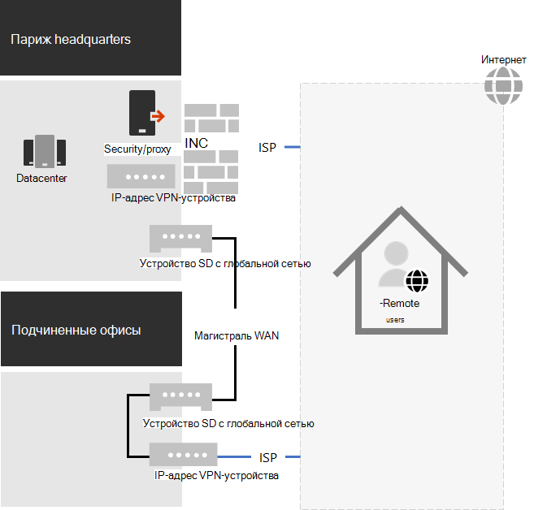
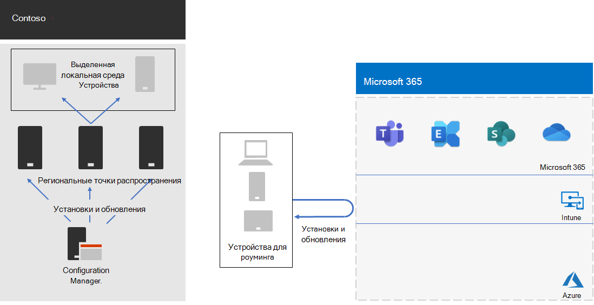

# Отклик COVID-19 компании Contoso и поддержка удаленной и удаленной работы на местеContoso's COVID-19 response and support for remote and onsite work

Компания Contoso всегда поддерживала удаленных сотрудников, которые имели доступ к локальному ресурсу через центральный VPN-сервер в главный офис в Париже.Contoso had always supported its remote workers, who accessed on-premises resources through a central VPN server in the Paris headquarters. Contoso выдала всем удаленным сотрудникам управляемый ноутбук.Contoso had issued all remote workers a managed laptop. В локальной рабочей области было сочетание настольных компьютеров и ноутбуков.On-premises workers had a mixture of desktop computers and laptops.

## Ответ contoso на COVID-19Contoso’s response to COVID-19

С появлением эпидемии COVID-19 все, кроме основных, были удаленными сотрудниками.With the onset of the COVID-19 pandemic, suddenly all but essential workers were remote workers. Корпорация Contoso ответила, переместив своих сотрудников на работу из дома и проводя основные действия с помощью удаленного доступа к ресурсам локальной организации и через Интернет с помощью облачных служб Microsoft 365.Contoso responded by shifting its workforce to work from home and conduct its primary activities through remote access to on-premises resources and online using Microsoft 365 cloud services.

В компании Contoso были VPN-серверы удаленного доступа в офисе в Париже для поддержки 25 % своих уже удаленных сотрудников, но быстро переместились на более масштабную работу, чтобы поддерживать 90 % сотрудников.Contoso had remote access VPN servers in the Paris headquarters office to support the 25% of its already remote workforce, but quickly moved to scale up it's remote access capacity to support 90% of its workforce. Компания Contoso развернула VPN-серверы удаленного доступа во всех офисах, чтобы удаленные сотрудники использовали региональную точки входа для доступа к интрасети Contoso.Contoso deployed remote access VPN servers in each satellite office so that remote workers would use a regionally close entry point for access to the Contoso intranet.

Компания Contoso также обновила конфигурацию VPN-клиентов, установленных на ноутбуках, планшетах и смартфонах, для раздельного туннелирования, чтобы трафик для оптимизировать набор конечных точек Office 365 обходил VPN-подключение и был отправлен непосредственно через Интернет.Contoso also updated the configuration of VPN clients installed on laptops, tablets, and smart phones for split tunneling so that traffic for the Optimize set of Office 365 endpoints bypassed the VPN connection and was sent directly over the internet. Дополнительные сведения см. в подсети "Оптимизация подключения Office 365 для удаленных пользователей, использующих [раздельное VPN-туннелинг".](../enterprise/microsoft-365-vpn-split-tunnel.md)For more information, see [Optimize Office 365 connectivity for remote users using VPN split tunneling](../enterprise/microsoft-365-vpn-split-tunnel.md).

Ниже приводится итоговая конфигурация с VPN-устройствами, установленными в главный офис в Париже и каждом из его офисов.Here is the resulting configuration with VPN devices installed in the Paris headquarters and each of the satellite offices. 

Удаленный сотрудник с установленным VPN-клиентом использует DNS для поиска ближайшего офиса в регионе и подключается к установленному там VPN-устройству.A remote worker with the installed VPN client uses DNS to find the regionally closest office and connects to the VPN device installed there. При разделенном туннелях трафик, направляющийся в конечные точки Microsoft 365 Optimize, отправляется непосредственно в ближайшее к региону сетевое расположение Microsoft 365.With split tunneling, traffic to Microsoft 365 Optimize endpoints gets sent directly to the regionally closest Microsoft 365 network location. Весь другой трафик отправляется через VPN-подключение на VPN-устройство.All other traffic gets sent over the VPN connection to the VPN device.

## Поддержка удаленной и удаленной работы в компании ContosoContoso’s support for remote and onsite work

После внесения первоначальных изменений в поддержку в основном удаленных сотрудников во время региональных блокировки в компании Contoso вносили изменения в инфраструктуру, чтобы поддерживать удаленную и локальную работу, в которой могут работать:After the initial changes were made to support mostly remote workers during regional lockdowns, Contoso made infrastructure changes to support remote and onsite work in which a worker could be:

- Всегда удаленный.Always remote.
- Всегда на месте.Always onsite.
- Сочетание удаленного и удаленного на месте.A combination of onsite and remote.

Функции удостоверений, безопасности и соответствия требованиям Microsoft 365 предназначены для нулевого доверия и работают независимо от расположения пользователя и его устройства.Microsoft 365 identity, security, and compliance features are designed for Zero Trust and to work regardless of the location of the user and their device. Дополнительные сведения см. в сведениях [об нулевом доверии.](https://www.microsoft.com/security/business/zero-trust)For more information, see [Zero Trust](https://www.microsoft.com/security/business/zero-trust).

Однако управление новыми установками и обновлениями программного обеспечения зависит от расположения устройства, так как устанавливаемая программа может быть источником локального или интернет-источника.However, managing new installs and updates of software is dependent on the location of the device because the software to install could come from an on-premises or an internet source. ИТ-архитекторы Contoso разработали новую инфраструктуру установок и обновлений на основе расположения устройства, а не рабочего устройства.Contoso IT architects designed their new installs and updates infrastructure based on the location of the device, rather than the worker.

Они обозначили два типа устройств: выделенные на локальном и в роуминге.They designated two types of devices: dedicated on-premises and roaming.

### Выделенное локальноеDedicated on-premises

Выделенное локальное устройство — это настольный компьютер или серверный компьютер, который никогда не покидает интрасеть Contoso и не имеет установленного VPN-клиента.A dedicated on-premises device is a desktop or server computer that never leaves the Contoso intranet and does not have a VPN client installed. На этих локальном устройстве по-прежнему используется Microsoft Endpoint Configuration Manager и его точки распространения для установки и обновления Windows 10, приложений Microsoft 365 для предприятий и браузера Edge.These on-premises devices continue to use Microsoft Endpoint Configuration Manager and its distribution points for installs and updates of Windows 10, Microsoft 365 Apps for enterprise, and the Edge browser.

### РоумингRoaming

Перемещающееся устройство может покинуть интрасеть Contoso и включает ноутбуки, выданные многим сотрудникам офисов, а также всем удаленным сотрудникам и другим устройствам организации, таким как смартфоны и планшеты с установленным VPN-клиентом Contoso.A roaming device can leave the Contoso intranet and includes laptops issued to many office workers and all remote workers and other organization-owned devices such as smart phones and tablets with the Contoso VPN client installed. 

Поскольку эти устройства могут быть подключены к Интернету в любой момент времени, они используют Intune или другие облачные службы для установки и обновления Windows 10, приложений Microsoft 365 для предприятий и Edge.Because these devices can be connected to the Internet at any given time, they use Intune or other cloud-based services for installs and updates of Windows 10, Microsoft 365 Apps for enterprise, and Edge. Они не используют существующие точки распространения Configuration Manager.They do not use the existing on-premises Configuration Manager distribution points.

Это означает, что некоторые установки и обновления перемещаемого устройства будут происходить через Интернет, когда они находятся в локальной сети и подключены к интрасети.This means some of the installs and updates for roaming device will be done over the internet while they are on-premises and connected to the intranet. Но ИТ-архитекторы Компании Contoso решили, что простота конфигурации имеет большее значение, чем оптимизация пропускной способности интрасети для Интернета, особенно если большинство удаленных сотрудников редко подключены к интрасети.But Contoso IT architects decided that simplicity of configuration was more important than optimization of intranet bandwidth to the internet, especially when most remote workers are seldom connected to the intranet.

Ниже приводится итоговая инфраструктура.Here is the resulting infrastructure.

Поведение при установке и обновлении определяется путем принятия учетных записей компьютеров устройств в одну из этих групп:Install and update behavior is determined by making the computer accounts of devices a member of one of these groups:

- OnPremDevicesOnPremDevices

  Клиент Configuration Manager на устройстве использует точки распространения для установки и обновления.The Configuration Manager client on the device uses distribution points for installs and updates.

- RoamingDevicesRoamingDevices

  Intune и другие параметры на устройстве определяют использование сети Microsoft 365 для установки и обновления.Intune and other settings on the device specify the use of the Microsoft 365 network for installs and updates.

## Новый процесс в onboardingNew onboarding process

Для нового выделенного локального устройства, выданного новому сотруднику или новому серверу в центр обработки данных, когда рабочий процесс вошел, клиент Configuration Manager на основе членства устройства в группе OnPremDevices загружает и устанавливает последние обновления для Windows 10, приложений Microsoft 365 для предприятий и Edge из локальной точки распространения Configuration Manager.For a new dedicated on-premises device issued to a new worker or for a new server in a datacenter, when the worker signs in, the Configuration Manager client based on the device's membership in the OnPremDevices group downloads and installs the latest updates for Windows 10, Microsoft 365 Apps for enterprise, and Edge from on-premises Configuration Manager distribution points. После завершения работы выделенное локальное устройство готово к использованию и использует эти точки распространения для текущих обновлений.When complete, the dedicated on-premises device is ready for use and uses these distribution points for ongoing updates.

Для нового удаленного устройства, выданного новому сотруднику, устройство, в зависимости от членства в группе RoamingDevices, контактирует с облачной службой Intune и другими службами, загружает и устанавливает последние обновления для Windows 10, приложений Microsoft 365 для предприятий и Edge.For a new remote device issued to a new worker, when the worker signs in, the device, based on its membership in the RoamingDevices group, contacts the Intune cloud service and other services and downloads and installs the latest updates for Windows 10, Microsoft 365 Apps for enterprise, and Edge. После завершения удаленное устройство готово к использованию и использует установленный VPN-клиент для доступа к локальному ресурсу и сети Microsoft 365 для текущих обновлений.When complete, the remote device is ready for use and uses the installed VPN client for access to on-premises resources and the Microsoft 365 network for ongoing updates.

## Следующий этапNext step

[Уполномойте удаленных](empower-people-to-work-remotely.md) сотрудников в организации.[Empower the remote workers](empower-people-to-work-remotely.md) in your organization.
