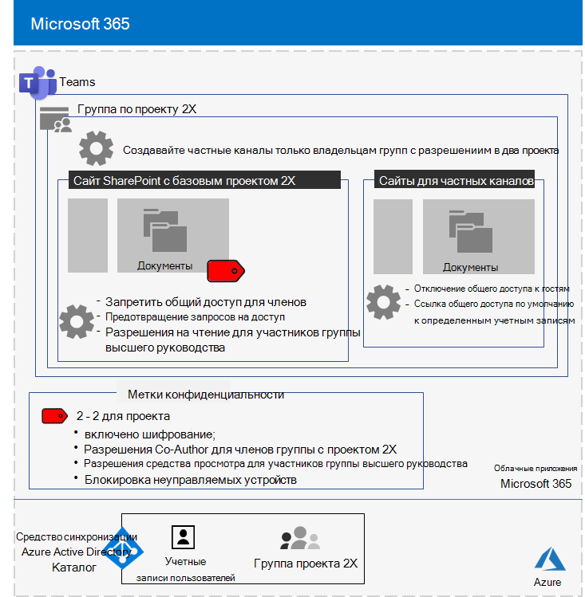
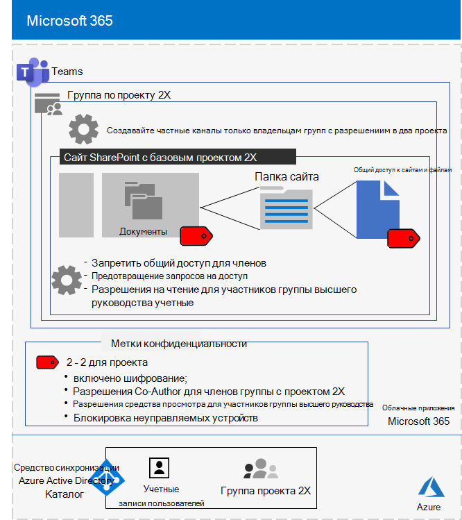

# Изолированная команда для совершенно секретного проекта корпорации ContosoIsolated team for a top-secret project of the Contoso Corporation

После этого генеральный директор Contoso распорядился разработать новый набор продуктов и служб, который мог бы удвоить прибыль Contoso в течение следующих пяти лет.After an executive offsite, Contoso’s CEO ordered the development of a new suite of products and services that could double Contoso’s profits in the next five years. Совершенно секретный проект по разработке бизнес-, инженерных и рыночных планов был Project **2X,** и были набрано ключевые сотрудники в компании.The top-secret project to develop the business, engineering, and market plan was named **Project 2X** and key staff across the company were recruited. 

Сроки для исследований и разработок были сжатыми, что означало, что совместная работа должна быть эффективной и обеспечивать безопасные собрания, текущие беседы и хранение файлов.The timelines for research and development were tight, which meant that collaboration had to be efficient and provide for secure meetings, ongoing conversations, and file storage.

В результате для Project 2X были бизнес-планы, спецификации продукта и инженерии, а также маркетинговые материалы и расписания в виде файлов Word, Excel и PowerPoint.The resulting deliverables for Project 2X were business plans, product and engineering specifications, and marketing materials and schedules in the form of Word, Excel, and PowerPoint files. 

В связи с их конфиденциальным характером доступ к этим файлам был:Due to their sensitive nature, access to these files were:

- Ограничивается Project 2X членов команды и высшего руководства.Restricted to Project 2X team members and senior leadership.
- Шифруется и защищено разрешениями, чтобы разрешить доступ только Project 2X членам команды и старшему руководству, даже если файлы распространялись за пределами их защищенных папок.Encrypted and protected with permissions to allow access only to Project 2X team members and senior leadership, even if the files were distributed outside of their secured folders.

ИТ-сотрудники Contoso использовали команду [с](secure-teams-security-isolation.md) изолированностью безопасности для Project 2X и этих действий.Contoso IT staff used a [team with security isolation](secure-teams-security-isolation.md) for Project 2X and these steps.

## Шаг 1. Созданная частная командаStep 1: Created a private team

Во-первых, чтобы защитить доступ к основному сайту SharePoint для группы, ИТ-администраторы Contoso настроили рекомендуемые политики SharePoint [доступа.](../security/office-365-security/sharepoint-file-access-policies.md)First, to protect access to the underlying SharePoint site for the team, Contoso IT administrators configured the [recommended SharePoint access policies](../security/office-365-security/sharepoint-file-access-policies.md).

Затем ИТ-администратор Contoso создал новую частную команду с именем Project 2X и добавил учетные записи пользователей Project 2X в качестве членов.Next, a Contoso IT administrator created a new private team named Project 2X and added the user accounts of Project 2X staff as members. Они также настраивали команду так, чтобы только Project 2X-команд могли создавать частные каналы.They also configured the team so that only Project 2X team owners can create private channels.

Сведения о конфигурации см. в [материале Create a private team.](secure-teams-security-isolation.md#create-a-private-team)For the configuration details, see [Create a private team](secure-teams-security-isolation.md#create-a-private-team).

## Шаг 2. Создан метка конфиденциальности для Project 2XStep 2: Created a sensitivity label for the Project 2X team

Администраторы Contoso создали новую метку конфиденциальности с именем **Project 2X,** которая:Contoso admins created a new sensitivity label named **Project 2X** that:

- Включено шифрование.Enabled encryption.
- Разрешено Co-Author разрешений для Project 2X Microsoft 365 группы.Allowed Co-Author permissions for the Project 2X Microsoft 365 group.
- Разрешенные разрешения просмотра для группы старших руководителей.Allowed Viewer permissions for the Senior Leadership group.
- Заблокирован доступ к неугодным устройствам.Blocked access to unmanaged devices.

Файлы в **разделе Документы** в основном сайте Project 2X SharePoint защищены:Files in the **Documents** section of the underlying Project 2X SharePoint site were protected by:

- Разрешения сайта, которые позволяют только полные разрешения членам группы Project 2X Microsoft 365 и читать разрешения группе старшего руководства.The site permissions, which only allow full permissions to members of the Project 2X Microsoft 365 group and read permissions to the Senior Leadership group.
- Метка Project 2X с шифрованием и разрешениями, которые перемещаются с файлом при перемещении или копировании с сайта.The Project 2X sensitivity label, with encryption and permissions that travel with the file if it is moved or copied from the site.

Сведения о конфигурации см. в [материале Create a sensitivity label](secure-teams-security-isolation.md#create-a-sensitivity-label).For the configuration details, see [Create a sensitivity label](secure-teams-security-isolation.md#create-a-sensitivity-label).

## Шаг 3. Настройка SharePoint сайтаStep 3: Configured the underlying SharePoint site

Во-первых, чтобы защитить доступ к основному сайту SharePoint для группы, ИТ-администраторы Contoso настроили рекомендуемые политики SharePoint [доступа.](../security/office-365-security/sharepoint-file-access-policies.md)First, to protect access to the underlying SharePoint site for the team, Contoso IT administrators configured the [recommended SharePoint access policies](../security/office-365-security/sharepoint-file-access-policies.md).

Затем они настроили дополнительные параметры разрешений для сайта:Next, they configured additional permission settings for the site:

- Чтобы Project участникам группы 2X не удалось делиться доступом к сайту.To prevent Project 2X group members from sharing access to the site. Сведения о конфигурации см. [в SharePoint параметров для группы с изолированностью безопасности.](secure-teams-security-isolation.md#sharepoint-settings)For the configuration details, see [SharePoint settings for a team with security isolation](secure-teams-security-isolation.md#sharepoint-settings).
- Для получения разрешений на чтение для группы старших руководителей.For Read permissions for the Senior Leadership group.

Далее они настроили дополнительные параметры разрешений для сайта, чтобы Project участникам группы 2X доступ к сайту.Next, they configured additional permission settings for the site to prevent Project 2X group members from sharing access to the site. 

По мере создания частных каналов Project 2X владелец группы отключил общий доступ к гостю и установил ссылку на общий доступ по умолчанию к значению **Specific people.**As private channels for the Project 2X were created, the group owner disabled guest sharing and set the default sharing link to the **Specific people** value.

Вот итоговая конфигурация команды Project 2X с изолированностью безопасности.Here is the resulting configuration of the Project 2X team with security isolation.

 ## Шаг 4. Обучение Project членов команды 2XStep 4: Trained Project 2X team members

Сотрудники службы безопасности Contoso обучили членов Project 2X в обязательный курс, который прошел через них:Contoso security staff trained the Project 2X team members in a mandatory course that stepped them through:

- Доступ к новой команде Project 2X, использование собраний и чатов и совместное использование файлов группы.How to access the new Project 2X team, use meetings and chats, and how to collaborate on team files.
- Создание новых файлов в команде и отправка новых файлов, созданных локально.How to create new files in the team and upload new files created locally.
- Как маркировать файлы меткой Project 2X.How to label files with the Project 2X sensitivity label.
- Демонстрация того, как метка Project 2X защищает файл, даже если он покидает команду.A demonstration of how the Project 2X  label protects a file even when it leaves the team.

Конечным результатом стала безопасная среда, в которой Project 2X сотрудничали в безопасной среде для чатов, собраний и файлов.The end result was a secure environment in which Project 2X team members collaborated in a secure environment for chats, meetings, and files.

Вот пример файла, хранимого в основном сайте Project 2X с присвоенным меткой чувствительности Project 2X.Here is an example of a file stored in the underlying Project 2X site with the Project 2X sensitivity label assigned.

В нескольких случаях члены Project 2X скачали файлы, защищенные меткой 2X Project 2X, на локальный диск для автономной работы.In a couple of instances, Project 2X team members downloaded files protected by the Project 2X label to a local drive for offline work. 

Однако после запроса учетных данных при их открытии они осознали свою ошибку и удалили их.However, after being prompted for credentials when opening them, they realized their mistake and deleted them.

Из-за среды совместной Teams и функций безопасности Microsoft 365, сведения о Project 2X хранятся в секрете на протяжении всего проекта.Because of the collaboration environment of Teams and the security features of Microsoft 365, the details of Project 2X were kept secret for the duration of the project. Contoso объявила о своих планах и в настоящее время развертывает новые продукты и услуги на радость своих клиентов и инвесторов и огорчение своих конкурентов.Contoso announced its plans and is in the process of rolling out the new products and services to the delight of its customers and investors and the chagrin of its competitors.

## Следующий этапNext step

[Развертывание группы с изолированностью безопасности](secure-teams-security-isolation.md) в организации.[Deploy a team with security isolation](secure-teams-security-isolation.md) in your organization.

