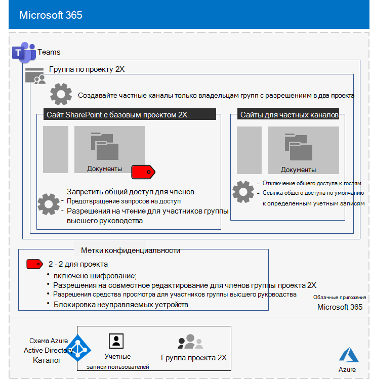

# Изолированная группа для верхнего уровня секретного проекта корпорации Contoso

После того, как руководитель организации находится за пределами, Генеральный директор Contoso упорядочивает разработку нового набора продуктов и услуг, которые могут вдвое прибыли от компании Contoso в течение следующих пяти лет. Проект верхнего уровня для разработки бизнес-, инженерного и маркетингового плана назывался **Project 2x** и основные сотрудники компании. 

Временные шкалы для исследования и разработки были тесно выполнены, поэтому совместная работа должна быть эффективной и обеспечивать безопасное собрание, текущие беседы и хранение файлов.

Конечные результаты для проекта 2X: бизнес-планы, спецификации продуктов и технических материалов, а также маркетинговые материалы и расписания в виде файлов Word, Excel и PowerPoint. 

Из-за конфиденциальной природы доступ к этим файлам имел следующий вид:

- Ограничено членами группы "проект 2X".
- Шифруются и защищаются с помощью разрешений, чтобы предоставить доступ только участникам группы в Project 2X, даже если файлы были распределены за прев них папки.

Сотрудники ИТ Contoso использовали [команду с изоляцией безопасности](secure-teams-security-isolation.md) для Project 2x и следующими действиями.

## Шаг 1: создание частной команды

Во-первых, чтобы защитить доступ к базовому сайту SharePoint для группы, ИТ-администраторы Contoso настроили [Рекомендуемые политики доступа к SharePoint](../enterprise/sharepoint-file-access-policies.md).

Затем администратор Contoso создал новую частную группу с именем Project 2X и добавила учетные записи пользователей в качестве участников Project 2X.

Сведения о конфигурации можно найти в статье [Создание частной команды](secure-teams-security-isolation.md#create-a-private-team).

## Шаг 2: создание метки чувствительности для группы проекта 2X

Администраторы Contoso создали новую метку чувствительности с именем **Project 2x** , которая:

- Требует шифрования.
- Разрешает разрешения совместного редактирования для группы Microsoft 365 в проекте 2X.

Файлы в разделе **документы** базового сайта SharePoint на 2x защищены:

- Разрешения сайта, которые разрешают доступ только к участникам группы Microsoft 365 в проекте 2X.
- Метка "чувствительность к проекту 2X" с шифрованием и разрешениями, которые передаются вместе с файлом, если он перемещается или копируется с сайта.

Сведения о конфигурации приведены в разделе [Создание метки конфиденциальности](secure-teams-security-isolation.md#create-a-sensitivity-label).

## Шаг 3: Настройка базового сайта SharePoint

Во-первых, чтобы защитить доступ к базовому сайту SharePoint для группы, ИТ-администраторы Contoso настроили [Рекомендуемые политики доступа к SharePoint](../enterprise/sharepoint-file-access-policies.md).

Затем они настроили дополнительные параметры разрешений для сайта, чтобы предотвратить общий доступ к сайту с помощью Project 2X. Сведения о конфигурации представлены в разделе [Параметры SharePoint для группы с изоляцией безопасности](secure-teams-security-isolation.md#sharepoint-settings).

Ниже показана итоговая конфигурация команды Project 2X.

 ## Шаг 4: квалифицированные участники группы для Project 2X

Сотрудники отдела безопасности Contoso обучены членам группы "проект 2" в обязательном курсе, в котором их пошагово пройдет следующим образом:

- Как получить доступ к новой команде Project 2X, использовать собрания и беседы, а также как совместно работать с файлами группы.
- Создание новых файлов в команде и отправка новых файлов, созданных локально.
- Демонстрация того, как политика DLP блокирует доступ к файлам извне.
- Пометка файлов с помощью метки чувствительности к проекту 2X.
- Демонстрация того, как подпись проекта 2X защищает файл, даже если он покидает команду.

Конечный результат — это безопасная среда, в которой участники группы Project 2X совместно работают в безопасной среде для чатов, собраний и файлов.

Ниже приведен пример файла, хранящегося на базовом сайте с проектом 2X с назначенной меткой конфиденциальности для проекта 2X.

В нескольких экземплярах участники группы Project 2X загрузили файлы, защищенные меткой проекта 2X, на локальный диск для работы в автономном режиме. Однако после того как вы запрашиваете учетные данные при их открытии, они выдавали свои ошибки и удалили их.

Из-за среды совместной работы Teams и функций безопасности Microsoft 365 сведения о проекте 2X хранятся в секрете в течение проекта. Компания Contoso объявила о своих планах и в процессе развертывания новых продуктов и служб в сведения своих клиентов и инвесторов и Чагрин конкурентов.

## Следующий шаг

[Развертывание группы с изоляцией безопасности](secure-teams-security-isolation.md) в Организации.

