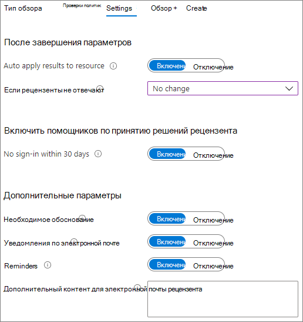

# Создание безопасной среды гостевого общего доступа

В этой статье рассматриваются различные параметры создания безопасной среды гостевого общего доступа в Microsoft 365. Эти примеры помогут получить представление о доступных возможностях. Эти процедуры можно использовать в различных сочетаниях для обеспечения безопасности и соответствия требованиям в организации.

В этой статье:

- Настройка многофакторной проверки подлинности для гостей.
- Настройка условий использования для гостей.
- Настройка ежеквартальных проверок гостевого доступа, чтобы периодически подтверждать необходимость предоставления гостям разрешения на доступ к группам и сайтам.
- Ограничение для гостей, с предоставлением им доступа только через Интернет с неуправляемых устройств.
- Настройка политики ожидания сеанса, чтобы обеспечить ежедневную проверку подлинности гостей.
- Создание типа конфиденциальной информации для строго конфиденциального проекта.
- Автоматическое присвоение метки конфиденциальности документам, содержащим конфиденциальную информацию.
- Автоматический запрет гостевого доступа к файлам с меткой конфиденциальности.

Для некоторых параметров, рассматриваемых в этой статье, требуется наличие у гостей учетной записи в Azure Active Directory. Чтобы обеспечить включение гостей в каталог при совместном использовании файлов и папок с ними, используйте[интеграцию SharePoint и OneDrive с Azure AD B2B (предварительная версия)](/sharepoint/sharepoint-azureb2b-integration-preview).

Обратите внимание, что в этой статье не рассматривается включение параметров гостевого общего доступа. Дополнительные сведения о включении гостевого общего доступа для разных сценариев см. в статье [Совместная работа с пользователями не из организации](collaborate-with-people-outside-your-organization.md).

## Настройка многофакторной проверки подлинности для гостей

Многофакторная проверка подлинности значительно снижает вероятность компрометации учетной записи. Так как гости могут использовать личные учетные записи электронной почты, не применяющие политики или рекомендации управления, очень важно требовать многофакторную проверку подлинности для гостей. Если имя пользователя и пароль гостя похищены, обязательная дополнительная проверка подлинности значительно снижает вероятность получения неизвестными лицами доступа к вашим сайтам и файлам.

В этом примере настраивается многофакторная проверка подлинности для гостей с помощью политики условного доступа в Azure Active Directory.

Чтобы настроить многофакторную проверку подлинности для гостей

1. Перейдите в раздел [Политики условного доступа Azure](https://portal.azure.com/#blade/Microsoft_AAD_IAM/ConditionalAccessBlade).
2. В колонке **Условный доступ | Политики** щелкните **Новая политика**.
3. В поле **Имя** введите имя.
4. В разделе **Назначения** выберите **Пользователи и группы**.
5. В колонке **Пользователи и группы** щелкните параметр **Выбрать пользователей и группы** и установите флажок **Все гостевые и внешние пользователи**.
6. В разделе **Назначения** щелкните **Облачные приложения или действия**.
7. В колонке **Облачные приложения или действия** выберите **Все облачные приложения** на вкладке **Включение**.
8. В разделе **Элементы управления доступом** выберите **Предоставление**.
9. В колонке **Предоставление** установите флажок **Требовать многофакторную проверку подлинности** и нажмите кнопку **Выбрать**.
10. В колонке **Создать** в разделе **Включить политику** установите переключатель в положение **Вкл.** и нажмите кнопку **Создать**.

Теперь гостям потребуется зарегистрироваться в службе многофакторной проверки подлинности, чтобы получить доступ к общему контенту, сайтам или группам.

### Дополнительные сведения

[Планирование развертывания многофакторной проверки подлинности Azure AD](/azure/active-directory/authentication/howto-mfa-getstarted)

## Настройка условий использования для гостей

В некоторых ситуациях у гостей могут отсутствовать подписанные соглашения о неразглашении или другие юридические договоры с вашей организацией. Вы можете требовать у пользователей согласия с условиями использования перед предоставлением доступа к файлам, которыми с ними поделились. Условия использования могут отображаться при первой попытке доступа к общему файлу или сайту.

Чтобы создать условия использования, сначала нужно создать документ в Word или другом редакторе, а затем сохранить его как PDF-файл. Затем этот файл можно отправить в Azure AD.

Чтобы создать условия использования Azure AD

1. Войдите на портал Azure от имени глобального администратора, администратора безопасности или администратора условного доступа.
2. Откройте раздел [Условия использования](https://aka.ms/catou).
3. Щелкните **Добавить условия**.

   

4. Введите значения в поля **Имя** и **Отображаемое имя**.
6. Чтобы перейти к **документу с условиями использования**, найдите созданный вами PDF-файл и выберите его.
7. Выберите язык для документа с условиями использования.
8. Установите переключатель **Требовать, чтобы пользователи развернули условия использования** в положение **Включить**.
9. В разделе **Условный доступ** в списке **Принудительное применение шаблонов политик условного доступа** выберите вариант **Создать политику условного доступа позже**.
10. Нажмите кнопку **Создать**.

После создания условий использования нужно создать политику условного доступа, отображающую условия использования для гостей.

Чтобы создать политику условного доступа

1. Перейдите в раздел [Политики условного доступа Azure](https://portal.azure.com/#blade/Microsoft_AAD_IAM/ConditionalAccessBlade).
2. В колонке **Условный доступ | Политики** щелкните **Новая политика**.
3. Введите имя в поле **Имя**.
4. В разделе **Назначения** выберите **Пользователи и группы**.
5. В колонке **Пользователи и группы** щелкните параметр **Выбрать пользователей и группы** и установите флажок **Все гостевые и внешние пользователи**.
6. В разделе **Назначения** щелкните **Облачные приложения или действия**.
7. На вкладке **Включение** установите флажок **Выбрать приложения** и щелкните **Выбрать**.
8. В колонке **Выбрать** выберите **Microsoft Teams**, **Office 365 SharePoint Online** и **Outlook Groups**, затем нажмите кнопку **Выбрать**.
9. В разделе **Элементы управления доступом** выберите **Предоставление**.
10. В колонке **Предоставление** выберите пункт **Условия использования для гостей** и нажмите кнопку **Выбрать**.
11. В колонке **Создать** в разделе **Включить политику** установите переключатель в положение **Вкл.** и нажмите кнопку **Создать**.

Теперь при первой попытке гостя получить доступ к содержимому, группе или сайту в вашей организации ему потребуется принять условия использования.

> [!NOTE]
> Для использования условного доступа требуется лицензия Azure AD Premium P1. Дополнительные сведения см. в статье [Что такое условный доступ](/azure/active-directory/conditional-access/overview).

### Дополнительные сведения

[Условия использования Azure Active Directory](/azure/active-directory/conditional-access/terms-of-use)

## Настройка проверок гостевого доступа

С помощью проверок доступа в Azure AD вы можете автоматизировать периодические проверки доступа пользователей к различным командам и группам. Требуя специальную проверку доступа для гостей, вы можете гарантировать, что доступ гостей к конфиденциальным сведениям вашей организации не сохраняется дольше, чем требуется.

Чтобы настроить проверку доступа гостя

1. На странице [Управление удостоверениями](https://portal.azure.com/#blade/Microsoft_AAD_ERM/DashboardBlade) в меню слева щелкните **Проверки доступа**.
2. Нажмите кнопку **Новая проверка доступа**.
3. Выберите параметр **Команды и группы**.
4. Выберите параметр **Все группы Microsoft 365 с гостевыми пользователями**. Щелкните **Выберите группы для исключения**, если хотите исключить какие-либо группы.
5. Выберите параметр **Только гостевые пользователи** и нажмите **Далее: проверки**.
6. В разделе **Выбор проверяющих** выберите **Владельцы группы**.
7. Щелкните **Выберите резервных проверяющих**, укажите нужных резервных проверяющих и нажмите **Выбрать**.
8. В разделе **Указание повторения проверки** выберите **Ежеквартально**.
9. Выберите дату начала и длительность.
10. Для параметра **Завершение** выберите **Никогда** и щелкните **Далее: параметры**.

    

11. На вкладке **Параметры** проверьте параметры соответствия правилам своей организации.

    

12. Щелкните **Далее: проверка и создание**.
13. Введите **имя проверки** и проверьте параметры.
14. Щелкните **Создать**.

Важно отметить, что гостям можно предоставлять доступ к командам или группам, а также к отдельным файлам и папкам. При наличии доступа к файлам и папкам гости могут не добавляться в определенную группу. Если нужно выполнить проверки доступа для гостей, не состоящих в команде или группе, можно создать динамическую группу в Azure AD для размещения всех гостей, а затем создать для нее проверку доступа. Владельцы сайтов также могут управлять [истечением срока действия гостевого доступа к сайтам](https://support.microsoft.com/office/25bee24f-42ad-4ee8-8402-4186eed74dea).

### Дополнительные сведения

[Управление гостевым доступом с помощью проверок доступа Azure AD](/azure/active-directory/governance/manage-guest-access-with-access-reviews)

[Создание проверки доступа для групп или приложений в службе проверки доступа Azure AD](/azure/active-directory/governance/create-access-review)

## Настройка доступа только через Интернет для гостей

Вы можете сократить направления атак и упростить администрирование, требуя, чтобы гости обращались к командам, сайтам и файлам только с помощью веб-браузера.

Для групп Microsoft 365 и Teams в подобных случаях используется политика условного доступа Azure AD. Для SharePoint настройка производится в Центре администрирования SharePoint. (Также можно и[использовать метки конфиденциальности, чтобы предоставить гостям доступ только для чтения](../compliance/sensitivity-labels-teams-groups-sites.md).)

Чтобы ограничить доступ гостей к группам и командам только веб-доступом:

1. Перейдите в раздел [Политики условного доступа Azure](https://portal.azure.com/#blade/Microsoft_AAD_IAM/ConditionalAccessBlade).
2. В колонке **Условный доступ — Политики** щелкните **Новая политика**.
3. Введите имя в поле **Имя**.
4. В разделе **Назначения** выберите **Пользователи и группы**.
5. В колонке **Пользователи и группы** щелкните параметр **Выбрать пользователей и группы** и установите флажок **Все гостевые и внешние пользователи**.
6. В разделе **Назначения** щелкните **Облачные приложения или действия**.
7. На вкладке **Включение** установите флажок **Выбрать приложения** и щелкните **Выбрать**.
8. В колонке **Выбрать** выберите **Microsoft Teams** и **Outlook Groups**, затем щелкните **Выбрать**.
9. В разделе **Назначения** щелкните **Условия**.
10. В колонке **Условия** щелкните раздел **Клиентские приложения**.
11. В колонке **Клиентские приложения** установите переключатель **Да** для параметр **Настроить**, выберите параметры **Мобильные приложения и настольные клиенты**, **Клиенты Exchange ActiveSync** и **Другие клиенты**. Снимите флажок **Браузер**.

    

12. Нажмите кнопку **Готово**.
13. В разделе **Элементы управления доступом** выберите **Предоставление**.
14. В колонке **Предоставление** установите флажки **Требовать, чтобы устройство было отмечено как соответствующее** и **Требовать устройство с гибридным присоединением к Azure AD**.
15. В разделе **Для нескольких элементов управления** установите флажок **Требовать один из выбранных элементов управления** и нажмите кнопку **Выбрать**.
16. В колонке **Создать** в разделе **Включить политику** установите переключатель в положение **Вкл.** и нажмите кнопку **Создать**.

Ограничение гостевого доступа к SharePoint: только веб-доступ

1. В [Центре администрирования SharePoint](https://admin.microsoft.com/sharepoint) разверните **Политики** и щелкните **Управление доступом**.
2. Щелкните **Неуправляемые устройства**.
3. Выберите **Разрешить только ограниченный веб-доступ** и нажмите кнопку **Сохранить**.

Обратите внимание, что этот параметр в Центр администрирования SharePoint создает соответствующую политику условного доступа в Azure AD.

## Настройка времени ожидания сеанса для гостей

Обязательная регулярная проверка подлинности гостей может снизить вероятность доступа неизвестных лиц к содержимому вашей организации, если нарушена безопасность устройства гостя. Вы можете настроить политику условного доступа со временем ожидания сеанса для гостей в Azure AD.

Чтобы настроить политику времени ожидания сеанса для гостей

1. Перейдите в раздел [Политики условного доступа Azure](https://portal.azure.com/#blade/Microsoft_AAD_IAM/ConditionalAccessBlade).
2. В колонке **Условный доступ — Политики** нажмите кнопку **Новая политика**.
3. В поле **Имя** введите *Время ожидания сеанса для гостей*.
4. В разделе **Назначения** выберите **Пользователи и группы**.
5. В колонке **Пользователи и группы** щелкните параметр **Выбрать пользователей и группы** и установите флажок **Все гостевые и внешние пользователи**.
6. В разделе **Назначения** щелкните **Облачные приложения или действия**.
7. На вкладке **Включение** установите флажок **Выбрать приложения** и щелкните **Выбрать**.
8. В колонке **Выбрать** выберите **Microsoft Teams**, **Office 365 SharePoint Online** и **Outlook Groups**, затем нажмите кнопку **Выбрать**.
9. В разделе **Элементы управления доступом** выберите пункт **Сеанс**.
10. В колонке **Сеанс** установите флажок **Частота входа**.
11. Выберите значения **1** и **Дни** для периода времени и нажмите кнопку **Выбрать**.
12. В колонке **Создать** в разделе **Включить политику** установите переключатель в положение **Вкл.** и нажмите кнопку **Создать**.

## Создание типа конфиденциальной информации для строго конфиденциального проекта

Типы конфиденциальной информации — это предопределенные строки, которые можно использовать в рабочих процессах политик для принудительного обеспечения соответствия требованиям. В Центре соответствия требованиям Microsoft 365 доступны более ста типов конфиденциальной информации, включая номера водительских удостоверений, номера кредитных карт, номера банковских счетов и т. д.

Вы можете создавать настраиваемые типы конфиденциальной информации для управления содержимым своей организации. В этом примере создается настраиваемый тип конфиденциальной информации для строго конфиденциального проекта. Этот тип конфиденциальной информации можно затем использовать для автоматического применения метки конфиденциальности.

Чтобы создать тип конфиденциальной информации

1. В [Центре соответствия требованиям Microsoft 365](https://compliance.microsoft.com) в панели навигации слева разверните раздел **Классификация** и щелкните пункт **Типы конфиденциальной информации**.
2. Нажмите кнопку **Создать**.
3. В полях **Название** и **Описание** введите **Проект Сатурн** и нажмите кнопку **Далее**.
4. Нажмите **Добавить элемент**.
5. В списке **Обнаруживать содержимое с указанными элементами** выберите параметр **Ключевые слова** и введите *Проект Сатурн* в поле ключевых слов.
6. Нажмите кнопку **Далее**, а затем нажмите кнопку **Готово**.
7. Если вам будет предложено проверить тип конфиденциальной информации, нажмите кнопку **Нет**.

### Дополнительные сведения

[Пользовательские типы конфиденциальной информации](/Office365/SecurityCompliance/custom-sensitive-info-types)

## Создание политики автоматического применения меток для присвоения меток конфиденциальности на основе типа конфиденциальной информации

Если вы используете метки конфиденциальности в организации, можно автоматически применять метки к файлам, содержащим определенные типы конфиденциальной информации. 

Создание политики автоматического применения меток

1. Откройте [Центр соответствия требованиям Microsoft 365](https://compliance.microsoft.com).
2. В области навигации слева щелкните **Защита информации**.
3. На вкладке **Автоматическое применение меток** щелкните **Создать политику автоматического применения меток**.
4. На странице **Выберите информацию, к которой должна применяться эта метка** выберите **Настроить** и нажмите кнопку **Далее**.
5. Введите имя и описание политики и нажмите кнопку **Далее**.
6. На странице **Выбор расположений для применения метки** включите переключатель **Сайты SharePoint**, затем щелкните **Выбрать сайты**.
7. Добавьте URL-адреса сайтов, на которых вы нужно включить автоматическое применение меток, затем нажмите кнопку **Готово**.
8. Нажмите кнопку **Далее**.
9. На странице **Настройка общих и расширенных правил** выберите **Общие правила** и нажмите кнопку **Далее**.
10. На странице **Определение правил для содержимого во всех расположениях** щелкните **Создать правило**.
11. На странице **Создание правила** укажите имя правила, щелкните **Добавить условие**, затем щелкните **Содержимое включает типы конфиденциальной информации**.
12. Нажмите кнопку **Добавить**, щелкните **Типы конфиденциальной информации**, выберите нужные типы конфиденциальной информации, нажмите кнопку **Добавить**, затем нажмите кнопку **Сохранить**.
13. Нажмите кнопку **Далее**.
14. Щелкните **Выбрать метку**, выберите нужную метку и нажмите кнопку **Добавить**.
15. Нажмите кнопку **Далее**.
16. Оставьте политику в режиме имитации и нажмите кнопку **Далее**.
17. Щелкните **Создать политику**, затем нажмите кнопку **Готово**.

Если после создания политики пользователь введет в документе текст "Project Saturn", политика автоматического применения меток автоматически применит указанную метку при сканировании файла.

### Дополнительные сведения

[Автоматическое применение метки конфиденциальности к содержимому](../compliance/apply-sensitivity-label-automatically.md)

## Создание политики DLP для запрета гостевого доступа к строго конфиденциальным файлам

Можно использовать [защиту от потери данных (DLP)](../compliance/data-loss-prevention-policies.md), чтобы предотвратить нежелательное предоставление гостям доступа к конфиденциальному содержимому. Функция защиты от потери данных может действовать на основании метки конфиденциальности файла и запретить гостевой доступ.

Создание правила DLP

1. В Центре соответствия требованиям Microsoft 365 перейдите на страницу [Защита от потери данных](https://compliance.microsoft.com/datalossprevention).
2. Щелкните **Создать политику**.
3. Выберите **Настроить** и нажмите кнопку **Далее**.
4. Введите имя политики и нажмите кнопку **Далее**.
5. На странице **Расположения для применения политик** отключите все параметры, кроме **Сайты SharePoint** и **Учетные записи OneDrive**, затем нажмите кнопку **Далее**.
6. На странице **Определение параметров политики** нажмите кнопку **Далее**.
7. На странице **Настройка расширенных правил DLP** щелкните **Создать правило** и введите имя правила.
8. В разделе **Условия** щелкните **Добавить условие** и выберите **Содержит**.
9. Нажмите кнопку **Добавить**, выберите **Метки конфиденциальности**, выберите нужные метки конфиденциальности и нажмите кнопку **Добавить**.

   

10. В разделе **Действия** нажмите **Добавить действие** и выберите **Ограничить доступ или зашифровать содержимое в расположениях Microsoft 365**.
11. Установите флажок **Ограничить доступ или зашифровать содержимое в расположениях Microsoft 365** и выберите **Только люди за пределами организации**.

      

12. Нажмите **Сохранить**, а затем — **Далее**.
13. Выберите настройки тестирования и нажмите кнопку **Далее**.
14. Нажмите кнопку **Отправить**, затем нажмите кнопку **Готово**.

Важно отметить, что эта политика не запрещает доступ, если гость является участником сайта или команды в целом. Если вы планируете использовать строго конфиденциальные документы на сайте или в команде с гостевыми участниками, рекомендуется использовать [закрытые каналы в Teams](https://support.microsoft.com/office/de3e20b0-7494-439c-b7e5-75899ebe6a0e), допуская к работе с ними только участников вашей организации.

## Дополнительные параметры

Для обеспечения безопасности среды гостевого общего доступа также можно использовать некоторые дополнительные параметры в Microsoft 365 и Azure Active Directory.

- Вы можете создать список доменов, для которых общий доступ разрешен или запрещен, чтобы ограничить тех, с кем пользователи могут делиться. Дополнительные сведения см. в статье [Ограничение общего доступа к контенту SharePoint и OneDrive по домену](/sharepoint/restricted-domains-sharing) и [Разрешение или блокировка приглашений для пользователей B2B из определенных организаций](/azure/active-directory/b2b/allow-deny-list).
- Вы можете ограничить других клиентов Azure Active Directory, к которым могут подключаться пользователи. Сведения см. в статье [Использование ограничений клиентов для управления доступом к облачным приложениям SaaS](/azure/active-directory/manage-apps/tenant-restrictions).
- Вы можете создать управляемую среду, в которой партнеры могут помочь в управлении гостевыми учетными записями. Сведения см. в статье [Создание экстрасети B2B с управляемыми гостями](/Office365/Enterprise/b2b-extranet).

## См. также

[Ограничение возможности случайного раскрытия файлов при предоставлении доступа гостям](share-limit-accidental-exposure.md)

[Рекомендации по предоставлению общего доступа к файлам и папкам непроверенным пользователям](best-practices-anonymous-sharing.md)

[Создание экстрасети B2B с управляемыми гостями](b2b-extranet.md)