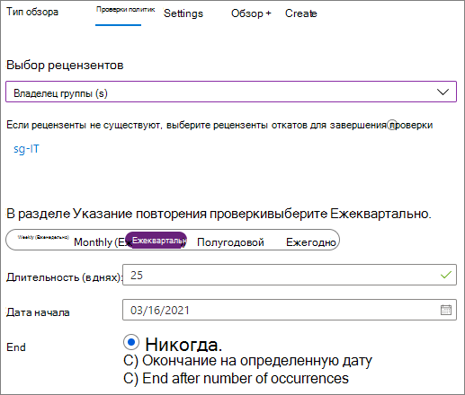

# Создание безопасной среды гостевого общего доступа

В этой статье рассматриваются различные параметры создания безопасной среды гостевого общего доступа в Microsoft 365. Это пример сценария, знакомящий с доступными параметрами. Эти процедуры можно использовать в различных сочетаниях для обеспечения безопасности и соответствия требованиям в организации. В конце статьи представлен тестовый сценарий, в котором рассматривается сочетание некоторых из этих параметров.

Этот сценарий включает следующее:

- Настройка многофакторной проверки подлинности для гостей.
- Настройка условий использования для гостей.
- Настройка ежеквартальных проверок гостевого доступа, чтобы периодически подтверждать необходимость предоставления гостям разрешения на доступ к группам и сайтам.
- Ограничение для гостей, с предоставлением им доступа только через Интернет с неуправляемых устройств.
- Настройка политики ожидания сеанса, чтобы обеспечить ежедневную проверку подлинности гостей.
- Создание и публикация меток конфиденциальности для классификации содержимого.
- Создание типа конфиденциальной информации для строго конфиденциального проекта.
- Автоматическое присвоение метки *строгой конфиденциальности* документам, содержащим конфиденциальную информацию.
- Автоматический запрет гостевого доступа к файлам с меткой *строгой конфиденциальности*.

Для некоторых параметров, рассматриваемых в этой статье, требуется наличие у гостей учетной записи в Azure Active Directory. Чтобы обеспечить включение гостей в каталог при совместном использовании файлов и папок с ними, используйте[интеграцию SharePoint и OneDrive с Azure AD B2B (предварительная версия)](https://docs.microsoft.com/sharepoint/sharepoint-azureb2b-integration-preview).

Обратите внимание, что в этой статье не рассматривается включение параметров гостевого общего доступа. Дополнительные сведения о включении гостевого общего доступа для разных сценариев см. в статье [Совместная работа с пользователями не из организации](collaborate-with-people-outside-your-organization.md).

## Настройка многофакторной проверки подлинности для гостей

Многофакторная проверка подлинности значительно снижает вероятность компрометации учетной записи. Так как гостевые пользователи могут использовать личные учетные записи электронной почты, не применяющие политики или рекомендации управления, очень важно требовать многофакторную проверку подлинности для гостей. Если имя пользователя и пароль гостя похищены, обязательная дополнительная проверка подлинности значительно снижает вероятность получения неизвестными лицами доступа к вашим сайтам и файлам.

В этом примере настраивается многофакторная проверка подлинности для гостей с помощью политики условного доступа в Azure Active Directory.

Чтобы настроить многофакторную проверку подлинности для гостей
1. В Microsoft Azure выполните поиск по запросу *Условный доступ*.
2. В колонке **Условный доступ — Политики** нажмите кнопку **Новая политика**.
3. В поле **Имя** введите *Многофакторная проверка подлинности для гостей*.
4. В разделе **Назначения** выберите **Пользователи и группы**.
5. В колонке **Пользователи и группы** щелкните параметр **Выбрать пользователей и группы** и установите флажок **Все гостевые и внешние пользователи**.
6. В разделе **Назначения** щелкните **Облачные приложения или действия**.
7. В колонке **Облачные приложения или действия** выберите **Все облачные приложения** на вкладке **Включение**.
8. В разделе **Элементы управления доступом** выберите **Предоставление**.
9. В колонке **Предоставление** установите флажок **Требовать многофакторную проверку подлинности** и нажмите кнопку **Выбрать**.
10. В колонке **Создать** в разделе **Включить политику** установите переключатель в положение **Вкл.** и нажмите кнопку **Создать**.

Теперь гостям потребуется зарегистрироваться в службе многофакторной проверки подлинности, чтобы получить доступ к общему контенту, сайтам или группам.

### Дополнительные сведения

[Планирование развертывания облачной службы многофакторной проверки подлинности Azure](https://docs.microsoft.com/azure/active-directory/authentication/howto-mfa-getstarted).

## Настройка условий использования для гостей

Часто у гостевых пользователей могут отсутствовать подписанные соглашения о неразглашении или другие юридические договоры с вашей организацией. Вы можете требовать у пользователей согласия с условиями использования перед предоставлением доступа к файлам, которыми с ними поделились. Условия использования могут отображаться при первой попытке доступа к общему файлу или сайту.

Чтобы создать условия использования, сначала нужно создать документ в Word или другом редакторе, а затем сохранить его как PDF-файл. Затем этот файл можно отправить в Azure AD.

Чтобы создать условия использования Azure AD
1. Войдите на портал Azure от имени глобального администратора, администратора безопасности или администратора условного доступа.
2. Откройте раздел [Условия использования](https://aka.ms/catou).
3. Щелкните **Добавить условия**. 
   
4. В полях **Имя** и **Отображаемое имя** введите *Условия использования для гостей*.
6. Чтобы перейти к **документу с условиями использования**, найдите созданный вами PDF-файл и выберите его.
7. Выберите язык для документа с условиями использования.
8. Установите переключатель **Требовать, чтобы пользователи развернули условия использования** в положение **Включить**.
9. В разделе **Условный доступ** в списке **Принудительное применение шаблонов политик условного доступа** выберите вариант **Создать политику условного доступа позже**.
10. Нажмите кнопку **Создать**.

После создания условий использования нужно создать политику условного доступа, отображающую условия использования для гостевых пользователей.

Чтобы создать политику условного доступа
1. В Microsoft Azure выполните поиск по запросу *Условный доступ*.
2. В колонке **Условный доступ — Политики** нажмите кнопку **Новая политика**.
3. В поле **Имя** введите *Политика условий использования для гостевых пользователей*.
4. В разделе **Назначения** выберите **Пользователи и группы**.
5. В колонке **Пользователи и группы** щелкните параметр **Выбрать пользователей и группы**, установите флажок **Все гостевые и внешние пользователи** и нажмите кнопку **Готово**.
6. В разделе **Назначения** щелкните **Облачные приложения или действия**.
7. На вкладке **Включение** установите флажок **Выбрать приложения** и щелкните **Выбрать**.
8. В колонке **Выбрать** выберите **Microsoft Teams**, **Office 365 SharePoint Online** и **Outlook Groups**, затем нажмите кнопку **Выбрать**.
9. В колонке **Облачные приложения или действия** нажмите кнопку **Готово**.
10. В разделе **Элементы управления доступом** выберите **Предоставление**.
11. В колонке **Предоставление** выберите пункт **Условия использования для гостей** и нажмите кнопку **Выбрать**.
12. В колонке **Создать** в разделе **Включить политику** установите переключатель в положение **Вкл.** и нажмите кнопку **Создать**.

Теперь при первой попытке гостевого пользователя получить доступ к содержимому, группе или сайту в вашей организации ему потребуется принять условия использования.

> [!NOTE]
> Для использования условного доступа требуется лицензия Azure AD Premium P1. Дополнительные сведения см. в статье [Что такое условный доступ](https://docs.microsoft.com/azure/active-directory/conditional-access/overview).

### Дополнительные сведения
[Условия использования Azure Active Directory](https://docs.microsoft.com/azure/active-directory/conditional-access/terms-of-use)

## Настройка проверок гостевого доступа

С помощью проверок доступа в Azure AD вы можете автоматизировать периодические проверки доступа пользователей к различным командам и группам. Требуя специальную проверку доступа для гостей, вы можете гарантировать, что доступ гостевых пользователей к конфиденциальным сведениям вашей организации не сохраняется дольше, чем требуется.

Проверки доступа можно упорядочить в программах. Программа — это сгруппированные похожие проверки доступа, которые можно использовать для упорядочивания проверок доступа с целью создания отчетов и аудита.

В этом примере создается программа для проверки гостевого доступа.

Чтобы создать программу
1. Войдите на портал Azure и откройте страницу [Управление удостоверениями](https://portal.azure.com/#blade/Microsoft_AAD_ERM/DashboardBlade).
2. В меню слева щелкните **Программы**.
3. Щелкните **Новая программа**.
4. В поле **Имя** введите *Программа проверки гостевого доступа*.
5. В поле **Описание** введите *Программа для проверок гостевого доступа*.
6. Нажмите кнопку **Создать**.

После создания программы можно создать проверку гостевого доступа и связать ее с программой.

Чтобы настроить проверку доступа гостевого пользователя
1. На странице [Управление удостоверениями](https://portal.azure.com/#blade/Microsoft_AAD_ERM/DashboardBlade) в меню слева щелкните **Проверки доступа**.
2. Нажмите кнопку **Новая проверка доступа**. 
   
3. В поле **Имя** введите *Квартальная проверка гостевого доступа*.
4. Для параметра **Частота** выберите значение **Ежеквартально**.
5. Для параметра **Завершить** выберите значение **Никогда**.
6. Для параметра **Область** установите флажок **Только пользователи-гости**.
7. Щелкните раздел **Группа**, выберите группы, которые нужно включить в проверку доступа, и нажмите кнопку **Выбрать**.
8. В разделе **Программы** щелкните пункт **Ссылка на программу**.
9. В колонке **Выбор программы** выберите вариант **Программа проверки гостевого доступа**
10. Нажмите кнопку **Начало**.

Для каждой указанной группы создается отдельная проверка доступа. Владельцы всех групп будут ежеквартально получать сообщение электронной почты, чтобы утвердить или отклонить гостевой доступ к своим группам.

Важно отметить, что гостям можно предоставлять доступ к командам или группам, а также к отдельным файлам и папкам. При наличии доступа к файлам и папкам гости могут не добавляться в определенную группу. Если нужно выполнить проверки доступа для гостевых пользователей, не состоящих в команде или группе, можно создать динамическую группу в Azure AD для размещения всех гостей, а затем создать для нее проверку доступа.

### Дополнительные сведения
[Управление гостевым доступом с помощью проверок доступа Azure AD](https://docs.microsoft.com/azure/active-directory/governance/manage-guest-access-with-access-reviews)

[Создание проверки доступа для групп или приложений в службе проверки доступа Azure AD](https://docs.microsoft.com/azure/active-directory/governance/create-access-review)

## Настройка доступа только через Интернет для гостевых пользователей

Вы можете сократить направления атак и упростить администрирование, требуя, чтобы гостевые пользователи обращались к командам, сайтам и файлам только с помощью веб-браузера. Это осуществляется с помощью политики условного доступа Azure AD.

Чтобы ограничить гостей только доступом через Интернет
1. В Microsoft Azure выполните поиск по запросу *Условный доступ*.
2. В колонке **Условный доступ — Политики** нажмите кнопку **Новая политика**.
3. В поле **Имя** введите *Браузерный доступ гостевых пользователей*.
4. В разделе **Назначения** выберите **Пользователи и группы**.
5. В колонке **Пользователи и группы** щелкните параметр **Выбрать пользователей и группы**, установите флажок **Все гостевые и внешние пользователи** и нажмите кнопку **Готово**.
6. В разделе **Назначения** щелкните **Облачные приложения или действия**.
7. На вкладке **Включение** установите флажок **Выбрать приложения** и щелкните **Выбрать**.
8. В колонке **Выбрать** выберите **Microsoft Teams**, **Office 365 SharePoint Online** и **Outlook Groups**, затем нажмите кнопку **Выбрать**.
9. В колонке **Облачные приложения или действия** нажмите кнопку **Готово**.
10. В разделе **Назначения** щелкните **Условия**.
11. В колонке **Условия** щелкните раздел **Клиентские приложения**.
12. В колонке **Клиентские приложения** установите переключатель **Да** для параметра **Настроить**, затем выберите параметры **Мобильные приложения и настольные клиенты** и **Клиенты с современной проверкой подлинности**. 
    
13. Нажмите кнопку **Готово**, затем в колонке **Условия** снова нажмите **Готово**.
14. В разделе **Элементы управления доступом** выберите **Предоставление**.
15. В колонке **Предоставление** установите флажки **Требовать, чтобы устройство было отмечено как соответствующее** и **Требовать устройство с гибридным присоединением к Azure AD**.
16. В разделе **Для нескольких элементов управления** установите флажок **Требовать один из выбранных элементов управления** и нажмите кнопку **Выбрать**.
17. В колонке **Создать** в разделе **Включить политику** установите переключатель в положение **Вкл.** и нажмите кнопку **Создать**.

## Настройка времени ожидания сеанса для гостевых пользователей

Обязательная регулярная проверка подлинности гостевых пользователей может снизить вероятность доступа неизвестных лиц к содержимому вашей организации, если нарушена безопасность устройства гостевого пользователя. Вы можете настроить политику условного доступа с временем ожидания сеанса для гостевых пользователей в Azure AD.

Чтобы настроить политику времени ожидания сеанса для гостей
1. В Microsoft Azure выполните поиск по запросу *Условный доступ*.
2. В колонке **Условный доступ — Политики** нажмите кнопку **Новая политика**.
3. В поле **Имя** введите *Время ожидания сеанса для гостей*.
4. В разделе **Назначения** выберите **Пользователи и группы**.
5. В колонке **Пользователи и группы** щелкните параметр **Выбрать пользователей и группы**, установите флажок **Все гостевые и внешние пользователи** и нажмите кнопку **Готово**.
6. В разделе **Назначения** щелкните **Облачные приложения или действия**.
7. На вкладке **Включение** установите флажок **Выбрать приложения** и щелкните **Выбрать**.
8. В колонке **Выбрать** выберите **Microsoft Teams**, **Office 365 SharePoint Online** и **Outlook Groups**, затем нажмите кнопку **Выбрать**.
9. В колонке **Облачные приложения или действия** нажмите кнопку **Готово**.
10. В разделе **Элементы управления доступом** выберите пункт **Сеанс**.
11. В колонке **Сеанс** установите флажок **Частота входа**.
12. Выберите значения **1** и **Дни** для периода времени и нажмите кнопку **Выбрать**.
13. В колонке **Создать** в разделе **Включить политику** установите переключатель в положение **Вкл.** и нажмите кнопку **Создать**.

## Создание меток конфиденциальности

Метки конфиденциальности можно использовать различными способами для классификации и защиты сведений организации. В этом примере рассматривается способ использования меток для управления гостевым доступом к общим файлам и папкам.

Сначала создадим три метки конфиденциальности в Центре соответствия требованиям Microsoft 365:

- Общие
- конфиденциально
- Строго конфиденциально

Используйте следующую процедуру, чтобы создать метки *Общедоступно* и *Конфиденциально*.

Создание метки классификации ("Общедоступно" и "Конфиденциально")
1. В [Центре соответствия требованиям Microsoft 365](https://compliance.microsoft.com) в панели навигации слева разверните раздел **Классификация** и щелкните пункт **Метки конфиденциальности**.
2. Нажмите **Создать метку**.
3. В **Названии метки** введите *Общедоступно* или *Конфиденциально*.
4. В поле **Подсказка** введите *Общедоступные сведения, которые можно предоставлять сотрудникам, гостям и партнерам* или *Конфиденциальные сведения. Предоставляются только сотрудникам и авторизованным гостям* и нажмите кнопку **Далее**.
5. Оставьте переключатель шифрования в положении **Выкл.** и нажмите кнопку **Далее**.
6. Оставьте переключатель маркировки содержимого в положении **Выкл.** и нажмите кнопку **Далее**.
7. Оставьте переключатель защиты от потери данных в конечной точке в положении **Выкл.** и нажмите кнопку **Далее**.
8. Оставьте переключатель автоматического применения меток в положении **Выкл.** и нажмите кнопку **Далее**.
9. Нажмите кнопку **Создать**.

Для метки *Строго конфиденциально* добавим автоматическое применение водяных знаков к документам с меткой.

Создание метки классификации ("Строго конфиденциально")
1. Нажмите **Создать метку**.
2. В поле **Название метки** введите *Строго конфиденциально*.
3. В поле **Подсказка** введите *Строго конфиденциальные сведения. Не предоставляйте гостям* и нажмите кнопку **Далее**.
4. Оставьте переключатель шифрования в положении **Выкл.** и нажмите кнопку **Далее**.
5. Установите переключатель маркировки содержимого в положение **Вкл**, установите флажок **Добавить верхний колонтитул** и щелкните ссылку **Измените текст**.
6. Введите *Строго конфиденциально* в качестве текста верхнего колонтитула и нажмите кнопку **Сохранить**.
7. На странице **Маркировка содержимого** установите переключатель маркировки содержимого в положение **Вкл**.
8. Установите флажок **Добавить водяной знак** и щелкните ссылку **Измените текст**.
9. В качестве **текста водяного знака** введите *Строго конфиденциально*.
10. Введите значение *24* для параметра **Размер шрифта** и нажмите кнопку **Сохранить**.
11. На странице **Маркировка содержимого** нажмите кнопку **Далее**.
12. Оставьте переключатель защиты от потери данных в конечной точке в положении **Выкл.** и нажмите кнопку **Далее**.
13. Оставьте переключатель автоматического применения меток в положении **Выкл.** и нажмите кнопку **Далее**.
14. Нажмите кнопку **Создать**.

После создания меток требуется их опубликовать. 

Чтобы опубликовать метки
1. На странице **Метки конфиденциальности** нажмите кнопку **Опубликовать метки**.
2. Щелкните ссылку **Выберите метки для публикации**.
3. Щелкните **Добавить**, выберите созданные метки и нажмите кнопку **Добавить**.
4. Нажмите кнопку **Готово**.
5. Нажмите кнопку **Далее**.
6. Оставьте для параметра пользователей и групп значение **Все** и нажмите кнопку **Далее**.
7. В списке **По умолчанию присваивать эту метку документам и сообщениям** выберите вариант **Общедоступно** и нажмите кнопку **Далее**.
8. На странице **Параметры политики** введите в качестве названия *Конфиденциальность документа* и нажмите кнопку **Далее**.
9. Нажмите кнопку **Опубликовать**.

После публикации меток они становятся доступны для пользователей классических приложений Office. Когда пользователь применяет метку **Строго конфиденциально**, в документ автоматически добавляется водяной знак.

### Дополнительные сведения
[Обзор меток конфиденциальности](https://docs.microsoft.com/Office365/SecurityCompliance/sensitivity-labels)

## Создание типа конфиденциальной информации для строго конфиденциального проекта

Типы конфиденциальной информации — это предопределенные строки, которые можно использовать в рабочих процессах политик для принудительного обеспечения соответствия требованиям. В Центре соответствия требованиям Microsoft 365 доступны более ста типов конфиденциальной информации, включая номера водительских удостоверений, номера кредитных карт, номера банковских счетов и т. д.

Вы можете создавать настраиваемые типы конфиденциальной информации для управления содержимым своей организации. В этом примере создается настраиваемый тип конфиденциальной информации для строго конфиденциального проекта. Этот тип конфиденциальной информации можно затем использовать для автоматического применения метки классификации.

Чтобы создать тип конфиденциальной информации
1. В [Центре соответствия требованиям Microsoft 365](https://compliance.microsoft.com) в панели навигации слева разверните раздел **Классификация** и щелкните пункт **Типы конфиденциальной информации**.
2. Нажмите кнопку **Создать**.
3. В полях **Название** и **Описание** введите **Проект Сатурн** и нажмите кнопку **Далее**.
4. Нажмите **Добавить элемент**.
5. В списке **Обнаруживать содержимое с указанными элементами** выберите параметр **Ключевые слова** и введите *Проект Сатурн* в поле ключевых слов.
6. Нажмите кнопку **Далее**, а затем нажмите кнопку **Готово**.
7. Если вам будет предложено проверить тип конфиденциальной информации, нажмите кнопку **Нет**.

### Дополнительные сведения
[Пользовательские типы конфиденциальной информации](https://docs.microsoft.com/Office365/SecurityCompliance/custom-sensitive-info-types)

## Создание политики для присвоения метки на основе типа конфиденциальной информации

После создания типа конфиденциальной информации можно создать файловую политику в Microsoft Cloud App Security для автоматического применения метки *Строго конфиденциально* к документам, содержащим строку *Проект Сатурн*.

> [!NOTE]
> Существует процесс репликации, обеспечивающий доступность меток конфиденциальности в Cloud App Security. Метки, доступные для политики, могут не отображаться сразу.

Чтобы создать файловую политику на основе типа конфиденциальной информации
1. Откройте [Microsoft Cloud App Security](https://portal.cloudappsecurity.com).
2. В области навигации слева разверните элемент **Управление** и щелкните пункт **Политики**.
3. Нажмите кнопку **Создать политику** и выберите пункт **Файловая политика**.
4. В поле **Имя политики** введите *Присвоение меток проекта Сатурн*.
5. В разделе **Создание фильтра для файлов, к которым будет применяться эта политика** дважды щелкните значок X, чтобы удалить фильтры по умолчанию.
7. В списке **Выберите фильтр** щелкните пункт **Приложение** и выберите **Microsoft SharePoint Online** из списка **Выберите приложения...**.
8. В разделе **Метод проверки** выберите пункт **Служба классификации данных**.
9. В списке **Выберите тип проверки** выберите вариант **Тип конфиденциальной информации**.
10. Найдите и выберите метку конфиденциальности *Проект Сатурн* и нажмите кнопку **Готово**. 
   
11. В разделе **Управление** разверните пункт **Microsoft SharePoint Online**.
12. Установите флажок **Применить метку классификации ** и выберите метку **Строго конфиденциально**.
13. Нажмите кнопку **Создать**.

После создания политики, если пользователь ввел слова "проект Сатурн" в документе, Cloud App Security при сканировании файла автоматически применит метку *Строго конфиденциально*.

### Дополнительные сведения
[Файловые политики](https://docs.microsoft.com/cloud-app-security/data-protection-policies)

## Создание политики для запрета гостевого доступа к строго конфиденциальным файлам

В примере из этой статьи файлы с меткой *Строго конфиденциально* не должны быть доступны гостям. В Cloud App Security можно создать файловую политику, автоматически запрещающую гостевой доступ к файлам с этой меткой.

Обратите внимание, что это не помешает пользователям делиться этими файлами. Вы по-прежнему зависите от соблюдения пользователями ваших политик управления файлами, сохраненными на сайтах, разрешающих гостевой общий доступ. Однако это может быть удобным средством удаления разрешений на гостевой доступ из файлов, в которые добавлены конфиденциальные сведения после их предоставления гостям.

Чтобы создать файловую политику на основе меток
1. Откройте [Microsoft Cloud App Security](https://portal.cloudappsecurity.com).
2. В области навигации слева разверните элемент **Управление** и щелкните пункт **Политики**.
3. Нажмите кнопку **Создать политику** и выберите пункт **Файловая политика**.
4. В поле **Имя политики** введите *Проект Сатурн — запрет гостевого доступа*.
5. В разделе **Создание фильтра для файлов, к которым будет применяться эта политика** дважды щелкните значок X, чтобы удалить фильтры по умолчанию.
6. В списке **Выберите фильтр** щелкните пункт **Приложение** и выберите **Microsoft SharePoint Online** из списка **Выберите приложения...**.
7. Щелкните **Добавить фильтр**.
8. В списке **Выберите фильтр** выберите пункт **Метка классификации**, затем выберите вариант **Azure Information Protection** в списке **Выберите фильтр...**.
9. В списке **Выберите метку классификации** выберите вариант **Строго конфиденциально**. 
   
10. В разделе **Управление** разверните пункт **Microsoft SharePoint Online**.
11. Установите флажки **Отправить дайджест соответствия политики владельцу файла** и **Удалить внешних пользователей**.
12. Для настраиваемого сообщения уведомления введите *Этот файл строго конфиденциален. Политика компании запрещает предоставление к нему доступа гостям*.
13. Нажмите кнопку **Создать**.

Важно отметить, что эта политика запрещает доступ к файлам, которые предоставлены с помощью ссылки типа *Определенные пользователи*. Она не запрещает доступ, предоставленный с помощью непроверенных (*общедоступных*) ссылок. Она также не запрещает доступ, если гость является участником сайта или команды в целом. Если вы планируете использовать строго конфиденциальные документы на сайте или в команде с гостевыми участниками, рекомендуется использовать [закрытые каналы в Teams](https://support.office.com/article/60ef929a-4d68-418b-bf4f-5784db184ec9), допуская к работе с ними только участников вашей организации.

## Тестирование решения

Чтобы протестировать решение, описанное в этой статье, создайте документ Word и сохраните его в библиотеке документов. Предоставьте гостевому пользователю общий доступ к файлу. Когда гость попытается получить доступ к документу, он должен обязательно зарегистрироваться в службе многофакторной проверки подлинности и принять условия использования.

После получения гостем доступа к документу введите текст *Проект Сатурн* в документе и сохраните его. После сканирования документа службой Cloud App Security должна быть применена метка *Строго конфиденциально*, а гостевому пользователю должен быть закрыт доступ к документу.

Средства, описанные в этой статье, можно использовать в различных сочетаниях, чтобы создать эффективную и безопасную среду гостевого общего доступа для организации.

## Дополнительные параметры

Для обеспечения безопасности среды гостевого общего доступа также можно использовать некоторые дополнительные параметры в Microsoft 365 и Azure Active Directory.

- Вы можете создать список доменов, для которых общий доступ разрешен или запрещен, чтобы ограничить тех, с кем пользователи могут делиться. Дополнительные сведения см. в статье [Ограничение общего доступа к контенту SharePoint и OneDrive по домену](https://docs.microsoft.com/sharepoint/restricted-domains-sharing) и [Разрешение или блокировка приглашений для пользователей B2B из определенных организаций](https://docs.microsoft.com/azure/active-directory/b2b/allow-deny-list).
- Вы можете ограничить других клиентов Azure Active Directory, к которым могут подключаться пользователи. Сведения см. в статье [Использование ограничений клиентов для управления доступом к облачным приложениям SaaS](https://docs.microsoft.com/azure/active-directory/manage-apps/tenant-restrictions).
- Вы можете создать управляемую среду, в которой партнеры могут помочь в управлении гостевыми учетными записями. Сведения см. в статье [Создание экстрасети B2B с управляемыми гостями](https://docs.microsoft.com/Office365/Enterprise/b2b-extranet).

## См. также

[Ограничение возможности случайного раскрытия файлов при предоставлении доступа гостям](share-limit-accidental-exposure.md)

[Рекомендации по предоставлению общего доступа к файлам и папкам непроверенным пользователям](best-practices-anonymous-sharing.md)

[Создание экстрасети B2B с управляемыми гостями](b2b-extranet.md)
