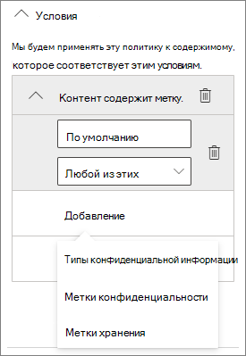

# Создание безопасной среды гостевого общего доступаCreate a secure guest sharing environment

В этой статье рассматриваются различные параметры создания безопасной среды гостевого общего доступа в Microsoft 365.In this article, we'll walk through a variety of options for creating a secure guest sharing environment in Microsoft 365. Эти примеры помогут получить представление о доступных возможностях.These are examples to give you an idea of the options available. Эти процедуры можно использовать в различных сочетаниях для обеспечения безопасности и соответствия требованиям в организации.You can use these procedures in different combinations to meet the security and compliance needs of your organization.

В этой статье:This article includes:

- Настройка многофакторной проверки подлинности для гостей.Setting up multi-factor authentication for guests.
- Настройка условий использования для гостей.Setting up a terms of use for guests.
- Настройка ежеквартальных проверок гостевого доступа, чтобы периодически подтверждать необходимость предоставления гостям разрешения на доступ к группам и сайтам.Setting up quarterly guest access reviews to periodically validate whether guests continue to need permissions to teams and sites.
- Ограничение для гостей, с предоставлением им доступа только через Интернет с неуправляемых устройств.Restricting guests to web-only access for unmanaged devices.
- Настройка политики ожидания сеанса, чтобы обеспечить ежедневную проверку подлинности гостей.Configuring a session timeout policy to ensure guests authenticate daily.
- Создание типа конфиденциальной информации для строго конфиденциального проекта.Creating a sensitive information type for a highly sensitive project.
- Автоматическое присвоение метки конфиденциальности документам, содержащим конфиденциальную информацию.Automatically assigning a sensitivity label to documents that contain a sensitive information type.
- Автоматический запрет гостевого доступа к файлам с меткой конфиденциальности.Automatically removing guest access from files with a sensitivity label.

Для некоторых параметров, рассматриваемых в этой статье, требуется наличие у гостей учетной записи в Azure Active Directory.Some of the options discussed in this article require guests to have an account in Azure Active Directory. Чтобы обеспечить включение гостей в каталог при совместном использовании файлов и папок с ними, используйте[интеграцию SharePoint и OneDrive с Azure AD B2B (предварительная версия)](https://docs.microsoft.com/sharepoint/sharepoint-azureb2b-integration-preview).To ensure that guests are included in the directory when you share files and folders with them, use the [SharePoint and OneDrive integration with Azure AD B2B Preview](https://docs.microsoft.com/sharepoint/sharepoint-azureb2b-integration-preview).

Обратите внимание, что в этой статье не рассматривается включение параметров гостевого общего доступа.Note that we won't discuss enabling guest sharing settings in this article. Дополнительные сведения о включении гостевого общего доступа для разных сценариев см. в статье [Совместная работа с пользователями не из организации](collaborate-with-people-outside-your-organization.md).See [Collaborating with people outside your organization](collaborate-with-people-outside-your-organization.md) for details about enabling guest sharing for different scenarios.

## Настройка многофакторной проверки подлинности для гостейSet up multi-factor authentication for guests

Многофакторная проверка подлинности значительно снижает вероятность компрометации учетной записи.Multi-factor authentication greatly reduces the chances of an account being compromised. Так как гостевые пользователи могут использовать личные учетные записи электронной почты, не применяющие политики или рекомендации управления, очень важно требовать многофакторную проверку подлинности для гостей.Since guest users may be using personal email accounts that don't adhere to any governance policies or best practices, it's especially important to require multi-factor authentication for guests. Если имя пользователя и пароль гостя похищены, обязательная дополнительная проверка подлинности значительно снижает вероятность получения неизвестными лицами доступа к вашим сайтам и файлам.If a guest user's username and password is stolen, requiring a second factor of authentication greatly reduces the chances of unknown parties gaining access to your sites and files.

В этом примере настраивается многофакторная проверка подлинности для гостей с помощью политики условного доступа в Azure Active Directory.In this example, we'll set up multi-factor authentication for guests by using a conditional access policy in Azure Active Directory.

Чтобы настроить многофакторную проверку подлинности для гостейTo set up multi-factor authentication for guests

1. Перейдите в раздел [Политики условного доступа Azure](https://portal.azure.com/#blade/Microsoft_AAD_IAM/ConditionalAccessBlade).Go to [Azure conditional access policies](https://portal.azure.com/#blade/Microsoft_AAD_IAM/ConditionalAccessBlade).
2. В колонке **Условный доступ | Политики** щелкните **Новая политика**.On the **Conditional Access | Policies** blade, click **New policy**.
3. В поле **Имя** введите имя.In the **Name** field, type a name.
4. В разделе **Назначения** выберите **Пользователи и группы**.Under **Assignments**, click **Users and groups**.
5. В колонке **Пользователи и группы** щелкните параметр **Выбрать пользователей и группы** и установите флажок **Все гостевые и внешние пользователи**.On the **Users and groups** blade, select **Select users and groups**, select the **All guests and external users** check box.
6. В разделе **Назначения** щелкните **Облачные приложения или действия**.Under **Assignments**, click **Cloud apps or actions**.
7. В колонке **Облачные приложения или действия** выберите **Все облачные приложения** на вкладке **Включение**.On the **Cloud apps or actions** blade, select **All cloud apps** on the **Include** tab.
8. В разделе **Элементы управления доступом** выберите **Предоставление**.Under **Access controls**, click **Grant**.
9. В колонке **Предоставление** установите флажок **Требовать многофакторную проверку подлинности** и нажмите кнопку **Выбрать**.On the **Grant** blade, select the **Require multi-factor authentication** check box, and then click **Select**.
10. В колонке **Создать** в разделе **Включить политику** установите переключатель в положение **Вкл.** и нажмите кнопку **Создать**.On the **New** blade, under **Enable policy**, click **On**, and then click **Create**.

Теперь гостям потребуется зарегистрироваться в службе многофакторной проверки подлинности, чтобы получить доступ к общему контенту, сайтам или группам.Now, guest will be required to enroll in multi-factor authentication before they can access shared content, sites, or teams.

### Дополнительные сведенияMore information

[Планирование развертывания многофакторной проверки подлинности Azure ADPlanning an Azure AD Multi-Factor Authentication deployment](https://docs.microsoft.com/azure/active-directory/authentication/howto-mfa-getstarted)

## Настройка условий использования для гостейSet up a terms of use for guests

В некоторых ситуациях у гостевых пользователей могут отсутствовать подписанные соглашения о неразглашении или другие юридические договоры с вашей организацией.In some situations guest users may not have signed non-disclosure agreements or other legal agreements with your organization. Вы можете требовать у пользователей согласия с условиями использования перед предоставлением доступа к файлам, которыми с ними поделились.You can require guests to agree to a terms of use before accessing files that are shared with them. Условия использования могут отображаться при первой попытке доступа к общему файлу или сайту.The terms of use can be displayed the first time they attempt to access a shared file or site.

Чтобы создать условия использования, сначала нужно создать документ в Word или другом редакторе, а затем сохранить его как PDF-файл.To create a terms of use, you first need to create the document in Word or another authoring program, and then save it as a .pdf file. Затем этот файл можно отправить в Azure AD.This file can then be uploaded to Azure AD.

Чтобы создать условия использования Azure ADTo create an Azure AD terms of use

1. Войдите на портал Azure от имени глобального администратора, администратора безопасности или администратора условного доступа.Sign in to Azure as a Global Administrator, Security Administrator, or Conditional Access Administrator.
2. Откройте раздел [Условия использования](https://aka.ms/catou).Navigate to [Terms of use](https://aka.ms/catou).
3. Щелкните **Добавить условия**.Click **New terms**.

   

4. Введите значения в поля **Имя** и **Отображаемое имя**.Type a **Name** and **Display name**.
6. Чтобы перейти к **документу с условиями использования**, найдите созданный вами PDF-файл и выберите его.For **Terms of use document**, browse to the pdf file that you created and select it.
7. Выберите язык для документа с условиями использования.Select the language for your terms of use document.
8. Установите переключатель **Требовать, чтобы пользователи развернули условия использования** в положение **Включить**.Set **Require users to expand the terms of use** to **On**.
9. В разделе **Условный доступ** в списке **Принудительное применение шаблонов политик условного доступа** выберите вариант **Создать политику условного доступа позже**.Under **Conditional Access**, in the **Enforce with Conditional Access policy template** list choose **Create conditional access policy later**.
10. Нажмите кнопку **Создать**.Click **Create**.

После создания условий использования нужно создать политику условного доступа, отображающую условия использования для гостевых пользователей.Once you've created the terms of use, the next step is to create a conditional access policy that displays the terms of use to guest users.

Чтобы создать политику условного доступаTo create a conditional access policy

1. Перейдите в раздел [Политики условного доступа Azure](https://portal.azure.com/#blade/Microsoft_AAD_IAM/ConditionalAccessBlade).Go to [Azure conditional access policies](https://portal.azure.com/#blade/Microsoft_AAD_IAM/ConditionalAccessBlade).
2. В колонке **Условный доступ | Политики** щелкните **Новая политика**.On the **Conditional Access | Policies** blade, click **New policy**.
3. Введите имя в поле **Имя**.In the **Name** box, type a name.
4. В разделе **Назначения** выберите **Пользователи и группы**.Under **Assignments**, click **Users and groups**.
5. В колонке **Пользователи и группы** щелкните параметр **Выбрать пользователей и группы** и установите флажок **Все гостевые и внешние пользователи**.On the **Users and groups** blade, select **Select users and groups**, select the **All guests and external users** check box.
6. В разделе **Назначения** щелкните **Облачные приложения или действия**.Under **Assignments**, click **Cloud apps or actions**.
7. На вкладке **Включение** установите флажок **Выбрать приложения** и щелкните **Выбрать**.On the **Include** tab, select **Select apps**, and then click **Select**.
8. В колонке **Выбрать** выберите **Microsoft Teams**, **Office 365 SharePoint Online** и **Outlook Groups**, затем нажмите кнопку **Выбрать**.On the **Select** blade, select **Microsoft Teams**, **Office 365 SharePoint Online**, and **Outlook Groups**, and then click **Select**.
9. В разделе **Элементы управления доступом** выберите **Предоставление**.Under **Access controls**, click **Grant**.
10. В колонке **Предоставление** выберите пункт **Условия использования для гостей** и нажмите кнопку **Выбрать**.On the **Grant** blade, select **Guest terms of use**, and then click **Select**.
11. В колонке **Создать** в разделе **Включить политику** установите переключатель в положение **Вкл.** и нажмите кнопку **Создать**.On the **New** blade, under **Enable policy**, click **On**, and then click **Create**.

Теперь при первой попытке гостевого пользователя получить доступ к содержимому, группе или сайту в вашей организации ему потребуется принять условия использования.Now, the first time a guest user attempts to access content or a team or site in your organization, they will be required to accept the terms of use.

> [!NOTE]
> Для использования условного доступа требуется лицензия Azure AD Premium P1.Using Conditional Access requires an Azure AD Premium P1 license. Дополнительные сведения см. в статье [Что такое условный доступ](https://docs.microsoft.com/azure/active-directory/conditional-access/overview).For more information, see [What is Conditional Access](https://docs.microsoft.com/azure/active-directory/conditional-access/overview).

### Дополнительные сведенияMore information

[Условия использования Azure Active DirectoryAzure Active Directory terms of use](https://docs.microsoft.com/azure/active-directory/conditional-access/terms-of-use)

## Настройка проверок гостевого доступаSet up guest access reviews

С помощью проверок доступа в Azure AD вы можете автоматизировать периодические проверки доступа пользователей к различным командам и группам.With access reviews in Azure AD, you can automate a periodic review of user access to various teams and groups. Требуя специальную проверку доступа для гостей, вы можете гарантировать, что доступ гостевых пользователей к конфиденциальным сведениям вашей организации не сохраняется дольше, чем требуется.By requiring an access review for guests specifically, you can help ensure guest users do not retain access to your organization's sensitive information for longer than is necessary.

Проверки доступа можно упорядочить в программах.Access reviews can be organized into programs. Программа — это сгруппированные похожие проверки доступа, которые можно использовать для упорядочивания проверок доступа с целью создания отчетов и аудита.A program is a grouping of similar access reviews that can be used to organize access reviews for reporting and auditing purposes.

Чтобы создать программуTo create a program

1. Войдите на портал Azure и откройте страницу [Управление удостоверениями](https://portal.azure.com/#blade/Microsoft_AAD_ERM/DashboardBlade).Sign in to the Azure portal and open the [Identity Governance page](https://portal.azure.com/#blade/Microsoft_AAD_ERM/DashboardBlade).
2. В меню слева щелкните **Программы**.In the left menu, click **Programs**
3. Щелкните **Новая программа**.Click **New program**.
4. Введите значения в поля **Имя** и **Описание**.Type a **Name**  and **Description**.
5. Нажмите **Создать**.Click **Create**.

После создания программы можно создать проверку гостевого доступа и связать ее с программой.Once the program has been created, we can create a guest access review and associate it with the program.

Чтобы настроить проверку доступа гостевого пользователяTo set up a guest user access review

1. На странице [Управление удостоверениями](https://portal.azure.com/#blade/Microsoft_AAD_ERM/DashboardBlade) в меню слева щелкните **Проверки доступа**.On the [Identity Governance page](https://portal.azure.com/#blade/Microsoft_AAD_ERM/DashboardBlade), in the left menu, click **Access reviews**.
2. Нажмите кнопку **Новая проверка доступа**.Click **New access review**.

   

3. Введите имя в поле **Имя**.In the **Name** box, type a name.
4. Для параметра **Частота** выберите значение **Ежеквартально**.For **Frequency**, choose **Quarterly**.
5. Для параметра **Завершить** выберите значение **Никогда**.For **End**, choose **Never**.
6. Для параметра **Область** установите флажок **Только пользователи-гости**.For **Scope**, choose **Guest users only**.
7. Щелкните раздел **Группа**, выберите группы, которые нужно включить в проверку доступа, и нажмите кнопку **Выбрать**.Click **Group**, select the groups that you want to include in the access review, and then click **Select**.
8. В разделе **Программы** щелкните пункт **Ссылка на программу**.Under **Programs**, click **Link to program**.
9. В колонке **Выбор программы** выберите вариант **Программа проверки гостевого доступа**On the **Select a program** blade, choose **Guest access review program**
10. Нажмите кнопку **Начало**.Click **Start**.

Для каждой указанной группы создается отдельная проверка доступа.A separate access review is created for each group that you specify. Владельцы всех групп будут ежеквартально получать сообщение электронной почты, чтобы утвердить или отклонить гостевой доступ к своим группам.Group owners of each group will be emailed quarterly to approve or deny guest access to their groups.

Важно отметить, что гостям можно предоставлять доступ к командам или группам, а также к отдельным файлам и папкам.It's important to note that guests can be given access to teams or groups, or to individual files and folders. При наличии доступа к файлам и папкам гости могут не добавляться в определенную группу.When given access to files and folders, guests may not be added to any particular group. Если нужно выполнить проверки доступа для гостевых пользователей, не состоящих в команде или группе, можно создать динамическую группу в Azure AD для размещения всех гостей, а затем создать для нее проверку доступа.If you want to do access reviews on guest users who don't belong to a team or group, you can create a dynamic group in Azure AD to contain all guests and then create an access review for that group. Владельцы сайтов также могут управлять [истечением срока действия гостевого доступа к сайтам](https://support.microsoft.com/office/25bee24f-42ad-4ee8-8402-4186eed74dea).Site owners can also manage [guest expiration for the site](https://support.microsoft.com/office/25bee24f-42ad-4ee8-8402-4186eed74dea)

### Дополнительные сведенияMore information

[Управление гостевым доступом с помощью проверок доступа Azure ADManage guest access with Azure AD access reviews](https://docs.microsoft.com/azure/active-directory/governance/manage-guest-access-with-access-reviews)

[Создание проверки доступа для групп или приложений в службе проверки доступа Azure ADCreate an access review of groups or applications in Azure AD access reviews](https://docs.microsoft.com/azure/active-directory/governance/create-access-review)

## Настройка доступа только через Интернет для гостевых пользователейSet up web-only access for guest users

Вы можете сократить направления атак и упростить администрирование, требуя, чтобы гостевые пользователи обращались к командам, сайтам и файлам только с помощью веб-браузера.You can reduce your attack surface and ease administration by requiring guest users to access your teams, sites, and files by using a web browser only.

Для групп Microsoft 365 и Teams в подобных случаях используется политика условного доступа Azure AD.For Microsoft 365 Groups and Teams, this is done with an Azure AD conditional access policy. Для SharePoint настройка производится в Центре администрирования SharePoint.For SharePoint, this is configured in the SharePoint admin center. (Также можно и[использовать метки конфиденциальности, чтобы предоставить гостям доступ только для чтения](https://docs.microsoft.com/microsoft-365/compliance/sensitivity-labels-teams-groups-sites).)(You can also [use sensitivity labels to restrict guests to web-only access](https://docs.microsoft.com/microsoft-365/compliance/sensitivity-labels-teams-groups-sites).)

Чтобы ограничить доступ гостей к группам и командам только веб-доступом:To restrict guests to web-only access for Groups and Teams:

1. Перейдите в раздел [Политики условного доступа Azure](https://portal.azure.com/#blade/Microsoft_AAD_IAM/ConditionalAccessBlade).Go to [Azure conditional access policies](https://portal.azure.com/#blade/Microsoft_AAD_IAM/ConditionalAccessBlade).
2. В колонке **Условный доступ — Политики** щелкните **Новая политика**.On the **Conditional Access - Policies** blade, click **New policy**.
3. Введите имя в поле **Имя**.In the **Name** box, type a name.
4. В разделе **Назначения** выберите **Пользователи и группы**.Under **Assignments**, click **Users and groups**.
5. В колонке **Пользователи и группы** щелкните параметр **Выбрать пользователей и группы** и установите флажок **Все гостевые и внешние пользователи**.On the **Users and groups** blade, select **Select users and groups**, select the **All guests and external users** check box.
6. В разделе **Назначения** щелкните **Облачные приложения или действия**.Under **Assignments**, click **Cloud apps or actions**.
7. На вкладке **Включение** установите флажок **Выбрать приложения** и щелкните **Выбрать**.On the **Include** tab, select **Select apps**, and then click **Select**.
8. В колонке **Выбрать** выберите **Microsoft Teams** и **Outlook Groups**, затем щелкните **Выбрать**.On the **Select** blade, select **Microsoft Teams** and **Outlook Groups**, and then click **Select**.
9. В разделе **Назначения** щелкните **Условия**.Under **Assignments**, click **Conditions**.
10. В колонке **Условия** щелкните раздел **Клиентские приложения**.On the **Conditions** blade, click **Client apps**.
11. В колонке **Клиентские приложения** установите переключатель **Да** для параметр **Настроить**, выберите параметры **Мобильные приложения и настольные клиенты**, **Клиенты Exchange ActiveSync** и **Другие клиенты**.On the **Client apps** blade, click **Yes** for **Configure**, and then select the **Mobile apps and desktop clients**, **Exchange ActiveSync clients**, and **Other clients** settings. Снимите флажок **Браузер**.Clear the **Browser** check box.

    

12. Нажмите кнопку **Готово**.Click **Done**.
13. В разделе **Элементы управления доступом** выберите **Предоставление**.Under **Access controls**, click **Grant**.
14. В колонке **Предоставление** установите флажки **Требовать, чтобы устройство было отмечено как соответствующее** и **Требовать устройство с гибридным присоединением к Azure AD**.On the **Grant** blade, select **Require device to be marked as compliant** and **Require Hybrid Azure AD joined device**.
15. В разделе **Для нескольких элементов управления** установите флажок **Требовать один из выбранных элементов управления** и нажмите кнопку **Выбрать**.Under **For multiple controls**, select **Require one of the selected controls**, and then click **Select**.
16. В колонке **Создать** в разделе **Включить политику** установите переключатель в положение **Вкл.** и нажмите кнопку **Создать**.On the **New** blade, under **Enable policy**, click **On**, and then click **Create**.

Ограничение гостевого доступа к SharePoint: только веб-доступTo restrict guests to web-ony access for SharePoint

1. В [Центре администрирования SharePoint](https://admin.microsoft.com/sharepoint) разверните **Политики** и щелкните **Управление доступом**.In the [SharePoint admin center](https://admin.microsoft.com/sharepoint), expand **Policies** and click **Access control**.
2. Щелкните **Неуправляемые устройства**.Click **Unmanaged devices**.
3. Выберите **Разрешить только ограниченный веб-доступ** и нажмите кнопку **Сохранить**.Select the **Allow limited, web-only access** option, and then click **Save**.

Обратите внимание, что этот параметр в Центр администрирования SharePoint создает соответствующую политику условного доступа в Azure AD.Note that this setting in the SharePoint admin center creates a supporting conditional access policy in Azure AD.

## Настройка времени ожидания сеанса для гостевых пользователейConfigure a session timeout for guest users

Обязательная регулярная проверка подлинности гостевых пользователей может снизить вероятность доступа неизвестных лиц к содержимому вашей организации, если нарушена безопасность устройства гостевого пользователя.Requiring guests to authenticate on a regular basis can reduce the possibility of unknown users accessing your organization's content if a guest user's device isn't kept secure. Вы можете настроить политику условного доступа с временем ожидания сеанса для гостевых пользователей в Azure AD.You can configure a session timeout conditional access policy for guest users in Azure AD.

Чтобы настроить политику времени ожидания сеанса для гостейTo configure a guest session timeout policy

1. Перейдите в раздел [Политики условного доступа Azure](https://portal.azure.com/#blade/Microsoft_AAD_IAM/ConditionalAccessBlade).Go to [Azure conditional access policies](https://portal.azure.com/#blade/Microsoft_AAD_IAM/ConditionalAccessBlade).
2. В колонке **Условный доступ — Политики** нажмите кнопку **Новая политика**.On the **Conditional Access - Policies** blade, click **New policy**.
3. В поле **Имя** введите *Время ожидания сеанса для гостей*.In the **Name** box, type *Guest session timeout*.
4. В разделе **Назначения** выберите **Пользователи и группы**.Under **Assignments**, click **Users and groups**.
5. В колонке **Пользователи и группы** щелкните параметр **Выбрать пользователей и группы** и установите флажок **Все гостевые и внешние пользователи**.On the **Users and groups** blade, select **Select users and groups**, select the **All guests and external users** check box.
6. В разделе **Назначения** щелкните **Облачные приложения или действия**.Under **Assignments**, click **Cloud apps or actions**.
7. На вкладке **Включение** установите флажок **Выбрать приложения** и щелкните **Выбрать**.On the **Include** tab, select **Select apps**, and then click **Select**.
8. В колонке **Выбрать** выберите **Microsoft Teams**, **Office 365 SharePoint Online** и **Outlook Groups**, затем нажмите кнопку **Выбрать**.On the **Select** blade, select **Microsoft Teams**, **Office 365 SharePoint Online**, and **Outlook Groups**, and then click **Select**.
9. В разделе **Элементы управления доступом** выберите пункт **Сеанс**.Under **Access controls**, click **Session**.
10. В колонке **Сеанс** установите флажок **Частота входа**.On the **Session** blade, select **Sign-in frequency**.
11. Выберите значения **1** и **Дни** для периода времени и нажмите кнопку **Выбрать**.Select **1** and **Days** for the time period, and then click **Select**.
12. В колонке **Создать** в разделе **Включить политику** установите переключатель в положение **Вкл.** и нажмите кнопку **Создать**.On the **New** blade, under **Enable policy**, click **On**, and then click **Create**.

## Создание типа конфиденциальной информации для строго конфиденциального проектаCreate a sensitive information type for a highly sensitive project

Типы конфиденциальной информации — это предопределенные строки, которые можно использовать в рабочих процессах политик для принудительного обеспечения соответствия требованиям.Sensitive information types are predefined strings that can be used in policy workflows to enforce compliance requirements. В Центре соответствия требованиям Microsoft 365 доступны более ста типов конфиденциальной информации, включая номера водительских удостоверений, номера кредитных карт, номера банковских счетов и т. д.The Microsoft 365 Compliance Center comes with over one hundred sensitive information types, including driver's license numbers, credit card numbers, bank account numbers, etc.

Вы можете создавать настраиваемые типы конфиденциальной информации для управления содержимым своей организации.You can create custom sensitive information types to help manage content specific to your organization. В этом примере создается настраиваемый тип конфиденциальной информации для строго конфиденциального проекта.In this example, we'll create a custom sensitive information type for a highly sensitive project. Этот тип конфиденциальной информации можно затем использовать для автоматического применения метки конфиденциальности.We can then use this sensitive information type to automatically apply a sensitivity label.

Чтобы создать тип конфиденциальной информацииTo create a sensitive information type

1. В [Центре соответствия требованиям Microsoft 365](https://compliance.microsoft.com) в панели навигации слева разверните раздел **Классификация** и щелкните пункт **Типы конфиденциальной информации**.In the [Microsoft 365 Compliance Center](https://compliance.microsoft.com), in the left navigation, expand **Classification**, and then click **Sensitive info types**.
2. Нажмите кнопку **Создать**.Click **Create**.
3. В полях **Название** и **Описание** введите **Проект Сатурн** и нажмите кнопку **Далее**.For **Name** and **Description**, type **Project Saturn**, and then click **Next**.
4. Нажмите **Добавить элемент**.Click **Add an element**.
5. В списке **Обнаруживать содержимое с указанными элементами** выберите параметр **Ключевые слова** и введите *Проект Сатурн* в поле ключевых слов.On the **Detect content containing** list, select **Keywords**, and then type *Project Saturn* in the keyword box.
6. Нажмите кнопку **Далее**, а затем нажмите кнопку **Готово**.Click **Next**, and then click **Finish**.
7. Если вам будет предложено проверить тип конфиденциальной информации, нажмите кнопку **Нет**.If asked if you would like to test the sensitive information type, click **No**.

### Дополнительные сведенияMore information

[Пользовательские типы конфиденциальной информацииCustom sensitive information types](https://docs.microsoft.com/Office365/SecurityCompliance/custom-sensitive-info-types)

## Создание политики автоматического применения меток для присвоения меток конфиденциальности на основе типа конфиденциальной информацииCreate an auto-labeling policy to assign a sensitivity label based on a sensitive information type

Если вы используете метки конфиденциальности в организации, можно автоматически применять метки к файлам, содержащим определенные типы конфиденциальной информации.If you are using sensitivity labels in your organization, you can automatically apply a label to files that contain defined sensitive information types. 

Создание политики автоматического применения метокTo create an auto-labeling policy

1. Откройте [Центр соответствия требованиям Microsoft 365](https://compliance.microsoft.com).Open the [Microsoft 365 compliance admin center](https://compliance.microsoft.com).
2. В области навигации слева щелкните **Защита информации**.In the left navigation, click **Information protection**.
3. На вкладке **Автоматическое применение меток** щелкните **Создать политику автоматического применения меток**.On the **Auto-labeling** tab, click **Create auto-labeling policy**.
4. На странице **Выберите информацию, к которой должна применяться эта метка** выберите **Настроить** и нажмите кнопку **Далее**.On the **Choose info you want this label applied to** page, choose **Custom** and click **Next**.
5. Введите имя и описание политики и нажмите кнопку **Далее**.Type a name and description for the policy and click **Next**.
6. На странице **Выбор расположений для применения метки** включите переключатель **Сайты SharePoint**, затем щелкните **Выбрать сайты**.On the **Choose locations where you want to apply the label** page, turn on **SharePoint sites** and click **Choose sites**.
7. Добавьте URL-адреса сайтов, на которых вы нужно включить автоматическое применение меток, затем нажмите кнопку **Готово**.Add the URLs for the sites where you want to turn on auto-labeling and click **Done**.
8. Нажмите кнопку **Далее**.Click **Next**.
9. На странице **Настройка общих и расширенных правил** выберите **Общие правила** и нажмите кнопку **Далее**.On the **Set up common or advanced rules** page, choose **Common rules** and click **Next**.
10. На странице **Определение правил для содержимого во всех расположениях** щелкните **Создать правило**.On the **Define rules for content in all locations** page, click **New rule**.
11. На странице **Создание правила** укажите имя правила, щелкните **Добавить условие**, затем щелкните **Содержимое включает типы конфиденциальной информации**.On the **New rule** page, give the rule a name, click **Add condition**, and then click **Content contains sensitive info types**.
12. Нажмите кнопку **Добавить**, щелкните **Типы конфиденциальной информации**, выберите нужные типы конфиденциальной информации, нажмите кнопку **Добавить**, затем нажмите кнопку **Сохранить**.Click **Add**, click **Sensitive info types**, choose the sensitive info types that you want to use, click **Add**, and then click **Save**.
13. Нажмите кнопку **Далее**.Click **Next**.
14. Щелкните **Выбрать метку**, выберите нужную метку и нажмите кнопку **Добавить**.Click **Choose a label**, select the label you want to use, and then click **Add**.
15. Нажмите кнопку **Далее**.Click **Next**.
16. Оставьте политику в режиме имитации и нажмите кнопку **Далее**.Leave the policy in simulation mode and click **Next**.
17. Щелкните **Создать политику**, затем нажмите кнопку **Готово**.Click **Create policy**, and then click **Done**.

Если после создания политики пользователь введет в документе текст "Project Saturn", политика автоматического применения меток автоматически применит указанную метку при сканировании файла.With the policy in place, when a user types "Project Saturn" into a document, the auto-labeling policy will automatically apply the specified label when it scans the file.

### Дополнительные сведенияMore information

[Автоматическое применение метки конфиденциальности к содержимомуApply a sensitivity label to content automatically](https://docs.microsoft.com/microsoft-365/compliance/apply-sensitivity-label-automatically)

## Создание политики DLP для запрета гостевого доступа к строго конфиденциальным файламCreate a DLP policy to remove guest access to highly sensitive files

Можно использовать [защиту от потери данных (DLP)](https://docs.microsoft.com/microsoft-365/compliance/data-loss-prevention-policies), чтобы предотвратить нежелательное предоставление гостям доступа к конфиденциальному содержимому.You can use [data loss prevention (DLP)](https://docs.microsoft.com/microsoft-365/compliance/data-loss-prevention-policies) to prevent unwanted guest sharing of sensitive content. Функция защиты от потери данных может действовать на основании метки конфиденциальности файла и запретить гостевой доступ.Data loss prevention can take action based on a file's sensitivity label and remove guest access.

Создание правила DLPTo create a DLP rule

1. В Центре соответствия требованиям Microsoft 365 перейдите на страницу [Защита от потери данных](https://compliance.microsoft.com/datalossprevention).In the Microsoft 365 compliance admin center, go to the [Data loss prevention page](https://compliance.microsoft.com/datalossprevention).
2. Щелкните **Создать политику**.Click **Create policy**.
3. Выберите **Настроить** и нажмите кнопку **Далее**.Choose **Custom** and click **Next**.
4. Введите имя политики и нажмите кнопку **Далее**.Type a name for the policy and click **Next**.
5. На странице **Расположения для применения политик** отключите все параметры, кроме **Сайты SharePoint** и **Учетные записи OneDrive**, затем нажмите кнопку **Далее**.On the **Locations to apply the policy** page turn off all settings except **SharePoint sites** and **OneDrive accounts**, and then click **Next**.
6. На странице **Определение параметров политики** нажмите кнопку **Далее**.On the **Define policy settings** page, click **Next**.
7. На странице **Настройка расширенных правил DLP** щелкните **Создать правило** и введите имя правила.On the **Customize advanced DLP rules** page, click **Create rule** and type a name for the rule.
8. В разделе **Условия** щелкните **Добавить условие** и выберите **Содержит**.Under **Conditions**, click **Add condition**, and choose **Content contains**.
9. Нажмите кнопку **Добавить**, выберите **Метки конфиденциальности**, выберите нужные метки конфиденциальности и нажмите кнопку **Добавить**.Click **Add**, choose **Sensitivity labels**, choose the labels you want to use, and click **Add**.

   

10. В разделе **Действия** нажмите **Добавить действие** и выберите **Ограничить доступ или зашифровать содержимое в расположениях Microsoft 365**.Under **Actions** click **Add an action** and choose **Restrict access or encrypt the content in Microsoft 365 locations**.
11. Установите флажок **Ограничить доступ или зашифровать содержимое в расположениях Microsoft 365** и выберите **Только люди за пределами организации**.Select the **Restrict access or encrypt the content in Microsoft 365 locations** check box and then choose the **Only people outside your organization** option.

      

12. Нажмите **Сохранить**, а затем — **Далее**.Click **Save** and then click **Next**.
13. Выберите настройки тестирования и нажмите кнопку **Далее**.Choose your test options and click **Next**.
14. Нажмите кнопку **Отправить**, затем нажмите кнопку **Готово**.Click **Submit**, and then click **Done**.

Важно отметить, что эта политика не запрещает доступ, если гость является участником сайта или команды в целом.It's important to note that this policy doesn't remove access if the guest is a member of the site or team as a whole. Если вы планируете использовать строго конфиденциальные документы на сайте или в команде с гостевыми участниками, рекомендуется использовать [закрытые каналы в Teams](https://support.microsoft.com/office/de3e20b0-7494-439c-b7e5-75899ebe6a0e), допуская к работе с ними только участников вашей организации.If you plan to have highly sensitive documents in a site or team with guest members, consider using [private channels in Teams](https://support.microsoft.com/office/de3e20b0-7494-439c-b7e5-75899ebe6a0e) and only allowing members of your organization in the private channels.

## Дополнительные параметрыAdditional options

Для обеспечения безопасности среды гостевого общего доступа также можно использовать некоторые дополнительные параметры в Microsoft 365 и Azure Active Directory.There are some additional options in Microsoft 365 and Azure Active Directory that can help secure your guest sharing environment.

- Вы можете создать список доменов, для которых общий доступ разрешен или запрещен, чтобы ограничить тех, с кем пользователи могут делиться.You can create a list of allowed or denied sharing domains to limit who users can share with. Дополнительные сведения см. в статье [Ограничение общего доступа к контенту SharePoint и OneDrive по домену](https://docs.microsoft.com/sharepoint/restricted-domains-sharing) и [Разрешение или блокировка приглашений для пользователей B2B из определенных организаций](https://docs.microsoft.com/azure/active-directory/b2b/allow-deny-list).See [Restrict sharing of SharePoint and OneDrive content by domain](https://docs.microsoft.com/sharepoint/restricted-domains-sharing) and [Allow or block invitations to B2B users from specific organizations](https://docs.microsoft.com/azure/active-directory/b2b/allow-deny-list) for more information.
- Вы можете ограничить других клиентов Azure Active Directory, к которым могут подключаться пользователи.You can limit which other Azure Active Directory tenants your users can connect to. Сведения см. в статье [Использование ограничений клиентов для управления доступом к облачным приложениям SaaS](https://docs.microsoft.com/azure/active-directory/manage-apps/tenant-restrictions).See [Use tenant restrictions to manage access to SaaS cloud applications](https://docs.microsoft.com/azure/active-directory/manage-apps/tenant-restrictions) for information.
- Вы можете создать управляемую среду, в которой партнеры могут помочь в управлении гостевыми учетными записями.You can create a managed environment where partners can help manage guest accounts. Сведения см. в статье [Создание экстрасети B2B с управляемыми гостями](https://docs.microsoft.com/Office365/Enterprise/b2b-extranet).See [Create a B2B extranet with managed guests](https://docs.microsoft.com/Office365/Enterprise/b2b-extranet) for information.

## См. такжеSee Also

[Ограничение возможности случайного раскрытия файлов при предоставлении доступа гостямLimit accidental exposure to files when sharing with guests](share-limit-accidental-exposure.md)

[Рекомендации по предоставлению общего доступа к файлам и папкам непроверенным пользователямBest practices for sharing files and folders with unauthenticated users](best-practices-anonymous-sharing.md)

[Создание экстрасети B2B с управляемыми гостямиCreate a B2B extranet with managed guests](b2b-extranet.md)
