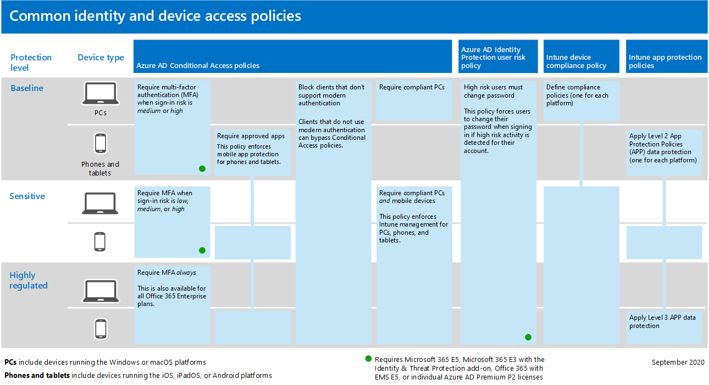

# Настройка возможностей защиты от угроз во всех Microsoft 365

Выполните следующие действия, чтобы настроить защиту от угроз во Microsoft 365.

## Шаг 1. Настройка многофакторной проверки подлинности и политики условного доступа

[Многофакторная проверка](/azure/active-directory/authentication/concept-mfa-howitworks) подлинности (MFA) требует, чтобы пользователи проверяли свою личность с помощью телефонного звонка или приложения-аутентификации. [Политики условного доступа определяют](/azure/active-directory/conditional-access/overview) определенные требования, которые должны быть выполнены, чтобы пользователи получили доступ к приложениям и данным в Microsoft 365. Политики MFA и условного доступа работают вместе, чтобы защитить вашу организацию. Например, если кто-то пытается войти с мобильного устройства с помощью учетной записи, которая не включена для MFA, и политика условного доступа требует, чтобы MFA была в силе, этот пользователь не может войти.  

Корпорация Майкрософт проверила и рекомендует определенный набор условного доступа и связанных политик для защиты доступа ко всем приложениям SaaS, особенно к Microsoft 365. Политики рекомендуется использовать для базовой, конфиденциальной и строго регламентирующейся защиты. Начните с реализации политик базовой защиты.

и доступа к 
 [устройствам См. в большей версии этого изображения](https://github.com/MicrosoftDocs/microsoft-365-docs/raw/public/microsoft-365/media/microsoft-365-policies-configurations/identity-device-access-policies-byplan.png)

### Реализация базовой защиты для Microsoft 365

 

1. [Настройка необходимых условий, включая защиту удостоверений Azure AD.](../security/office-365-security/identity-access-prerequisites.md)
2. [Настройка общих политик доступа к](../security/office-365-security/identity-access-policies.md) удостоверениям и устройствам для базовой защиты.
3. Настройка политик для [гостевых](../security/office-365-security/identity-access-policies-guest-access.md)пользователей [, Microsoft Teams,](../security/office-365-security/teams-access-policies.md) [Exchange Online](../security/office-365-security/secure-email-recommended-policies.md)и SharePoint Online [и OneDrive](../security/office-365-security/sharepoint-file-access-policies.md).

### Дополнительные сведения о защите удостоверений

- [Конфигурации доступа для удостоверений и устройств](../security/office-365-security/microsoft-365-policies-configurations.md)
- [Руководство по безопасности для Azure MFA](/azure/active-directory/authentication/multi-factor-authentication-security-best-practices)

## Шаг 2. Настройка Microsoft Defender для удостоверений

[Microsoft Defender for Identity](/defender-for-identity/what-is) — это облачное решение безопасности, которое работает с локальной службой доменных служб Active Directory (AD DS) для выявления, обнаружения и расследования расширенных угроз, скомпрометных удостоверений и вредоносных действий инсайдеров, направленных на организацию.

Microsoft Defender for Identity позволяет аналитикам и специалистам по безопасности в операциях безопасности (SecOps) выявлять расширенные атаки в гибридных средах, чтобы:

- Отслеживайте поведение пользователей, поведение и действия с помощью аналитики на основе обучения.
- Защищать удостоверения и учетные данные пользователей, хранящиеся в Active Directory.
- Выявление и расследование подозрительных действий пользователей и продвинутых атак по всей цепочке уничтожений.
- Предоставьте четкую информацию об инциденте на простой временной шкале для быстрой сортировки.

### Настройка Microsoft Defender для удостоверений

 

1. [Настройка Microsoft Defender для удостоверений](/azure-advanced-threat-protection/install-atp-step1) для защиты основных сред.
2. Защитите все [контроллеры домена](/azure-advanced-threat-protection/atp-sensor-monitoring) [и леса.](/azure-advanced-threat-protection/atp-multi-forest)
3. Интеграция [оповещений](/azure-advanced-threat-protection/suspicious-activity-guide?tabs=external) Microsoft Defender для удостоверений в рабочий процесс операций безопасности (SecOps).

### Дополнительные сведения о Microsoft Defender for Identity

- [Что такое Microsoft Defender для удостоверений?](/azure-advanced-threat-protection/what-is-atp)
- [Видео: Введение в Microsoft Defender для удостоверений](https://www.youtube.com/watch?reload=9&v=EGY2m8yU_KE)
- [Microsoft Defender для развертывания удостоверений](/azure-advanced-threat-protection/what-is-atp#whats-next)

## Шаг 3. Включаем Microsoft 365 Defender

[Microsoft 365 Defender](../security/defender/microsoft-365-defender.md) объединяет сигналы и объединяет возможности в единое решение. С помощью интегрированного Microsoft 365 Defender специалисты по безопасности могут сшить вместе сигналы угрозы, получаемые каждым из этих продуктов, и определить полный объем и влияние угрозы; как он вошел в среду, на что она влияет, и как она в настоящее время влияет на организацию. Microsoft 365 Defender автоматические действия для предотвращения или остановки атаки и самостоятельного излечия затронутых почтовых ящиков, конечных точек и удостоверений пользователей.

Microsoft 365 Defender объединяет оповещений, инцидентов, автоматизированных исследований и ответов, а также расширенный поиск по рабочим нагрузкам (Microsoft Defender for Identity, Microsoft Defender для Office 365, Microsoft Defender для endpoint и Microsoft Cloud App Security) в единое стекло. Новые функции постоянно добавляются в Microsoft 365 Defender; рассмотрите возможность получения функций предварительного просмотра.

### Настройка Microsoft 365 Defender

 

1. [Просмотрите необходимые условия.](../security/defender/prerequisites.md)
2. [Включи Microsoft 365 Defender.](../security/defender/m365d-enable.md)
3. [Выберите функции предварительного просмотра.](../security/defender/preview.md)

### Дополнительные сведения о Microsoft 365 Defender

- [Что такое Microsoft 365 Defender?](../security/defender/microsoft-365-defender.md)
- [Новые возможности Microsoft 365 Defender](../security/defender/whats-new.md)

## Шаг 4. Настройка Microsoft Defender для Office 365

[Microsoft Defender для Office 365](../security/office-365-security/defender-for-office-365.md) защищает организацию от вредоносных угроз в сообщениях электронной почты (вложениях и URL-адресах), Office документах и средствах совместной работы. В следующей таблице перечислены функции и Office 365 Microsoft Defender, включенные в Microsoft 365 E5:

 

****

|Возможности настройки, защиты и обнаружения|Возможности автоматизации, исследования, восстановления и образования|
|---|---|
|[Безопасные вложения](../security/office-365-security/safe-attachments.md) 
 [Безопасные ссылки](../security/office-365-security/safe-links.md) 
 [Безопасные документы](../security/office-365-security/safe-docs.md) 
 [Безопасные вложения для SharePoint, OneDrive и Microsoft Teams](../security/office-365-security/mdo-for-spo-odb-and-teams.md) 
 [Защита от фишинга в Microsoft 365](../security/office-365-security/anti-phishing-protection.md)|[Трекеры угроз](../security/office-365-security/threat-trackers.md) 
 [Обозреватель угроз](../security/office-365-security/threat-explorer.md) 
 [Автоматизированный анализ угроз и реагирование на них](../security/office-365-security/office-365-air.md) 
 [Обучение имитации атаки](../security/office-365-security/attack-simulation-training.md)|
|

С помощью Microsoft Defender для Office 365 люди в вашей организации могут более безопасно общаться и сотрудничать с помощью защиты от угроз для контента электронной почты и Office документов.

### Настройка Microsoft Defender для Office 365

 

1. [Настройка и настройка microsoft Defender для Office 365 политик.](../security/office-365-security/protect-against-threats.md)
2. [Просмотр и использование Microsoft Defender для Office 365 отчетов.](../security/office-365-security/view-reports-for-mdo.md)
3. [Используйте возможности расследования и реагирования на угрозы.](../security/office-365-security/office-365-ti.md)

### Дополнительные сведения о Microsoft Defender для Office 365

- [Обзор Microsoft Defender для Office 365](../security/office-365-security/defender-for-office-365.md)
- [Что нового в Microsoft Defender для Office 365](../security/office-365-security/whats-new-in-defender-for-office-365.md)

## Шаг 5. Настройка Microsoft Defender для конечной точки

[Microsoft Defender для конечной точки](/windows/security/threat-protection) защищает устройства организаций (также именуются конечными точками) от киберугроз, расширенных атак и нарушений данных. Группы безопасности могут быть более эффективными в управлении безопасностью конечных точек. Надежные средства помогают организациям не отстать от неокрепаемой системы с помощью обнаружения уязвимостей с [помощью управления угрозами и уязвимостью.](/windows/security/threat-protection/microsoft-defender-atp/next-gen-threat-and-vuln-mgt) Автоматизированные возможности обнаружения и восстановления, такие как уменьшение поверхности [атаки,](/windows/security/threat-protection/microsoft-defender-atp/overview-attack-surface-reduction)защита следующего  [поколения,](/windows/security/threat-protection/windows-defender-antivirus/windows-defender-antivirus-in-windows-10)обнаружение и нейтрализация атак на конечные точки [и](/windows/security/threat-protection/microsoft-defender-atp/overview-endpoint-detection-response)автоматическое исследование и исправление помогают защитить устройства от вредоносных программ. Помимо этих возможностей клиенты могут получать упреждающие уведомления и консультироваться с эксперты Майкрософт по угрозам по запросу в рамках службы управляемой охоты.

### Настройка Microsoft Defender для конечной точки

 

1. [Подготовка среды для Microsoft Defender для конечной точки](../security/defender-endpoint/deployment-phases.md).
2. [Развертывание Microsoft Defender для конечной точки](../security/defender-endpoint/production-deployment.md).
3. [На борту службы Microsoft Defender для конечных точек](../security/defender-endpoint/onboarding.md).
4. [Выполните ваши главные административные задачи по обеспечению безопасности.](../security/defender-endpoint/tvm-security-recommendation.md)

### Дополнительные сведения о Microsoft Defender для конечной точки

- [Дополнительные информацию о Microsoft Defender для конечной точки](../security/defender-endpoint/microsoft-defender-endpoint.md).
- [Попробуйте лабораторию оценки Microsoft Defender для конечной точки.](../security/defender-endpoint/evaluation-lab.md)

## Шаг 6. Настройка Microsoft Cloud App Security

[Microsoft Cloud App Security](/cloud-app-security) является брокером по безопасности облачного доступа, который поддерживает коллекцию журналов, соединители API и обратный прокси. Microsoft Cloud App Security обеспечивает большую видимость, контроль за перемещениями данных и сложную аналитику для выявления и борьбы с киберугрозами во всех облачных службах. С Microsoft Cloud App Security операций по безопасности можно защитить конфиденциальные сведения организации, защитить от киберугроз и аномалий, обнаружить и отслеживать приложения, которые имеют доступ к данным организации, и помочь убедиться, что облачные приложения организации соответствуют требованиям соответствия требованиям.

### Настройка Microsoft Cloud App Security

 

1. [Настройка портала и других основных требований.](/cloud-app-security/general-setup)
2. [Настройка обнаружения облаков и подключение](/cloud-app-security/set-up-cloud-discovery) [приложений.](/cloud-app-security/enable-instant-visibility-protection-and-governance-actions-for-your-apps)
3. [Развертывание элементов управления приложениями условного доступа для рекомендуемых приложений.](/cloud-app-security/proxy-deployment-aad)
4. [Используйте средства расследования и панели мониторинга.](/cloud-app-security/investigate)

### Дополнительные сведения о Microsoft Cloud App Security

- [Просмотрите новые функции и возможности.](/cloud-app-security/release-notes)
- [Дополнительные дополнительные Microsoft Cloud App Security](/cloud-app-security/what-is-cloud-app-security).

## Шаг 7. Мониторинг состояния и действия

После того как вы настроите и развернете службы и возможности защиты от угроз, следующим шагом будет мониторинг обнаружения угроз и соответствующие действия. Лучшей отправной точкой является центр Microsoft 365 безопасности ( ), где можно отслеживать и управлять безопасностью во всех идентификаторах, данных, устройствах, приложениях и [https://security.microsoft.com](https://security.microsoft.com) инфраструктуре Майкрософт.

Центр Microsoft 365 безопасности предназначен для администраторов безопасности и групп операций безопасности. В центре Microsoft 365 безопасности можно:

- Просмотр общего состояния безопасности организации с помощью [secure Score.](/microsoft-365/security/defender/microsoft-secure-score)
- [Мониторинг и просмотр отчетов](../security/defender-endpoint/threat-protection-reports.md) о состоянии удостоверений, данных, устройств, приложений и инфраструктуры.
- Подключение точки на оповещениях с помощью [инцидентов](/microsoft-365/security/defender/incident-queue).
- Для [устранения угроз](../security/defender/m365d-autoir.md) используйте автоматическое расследование и исправление.
- [Активная охота на угрозы,](/microsoft-365/security/defender/advanced-hunting-overview)такие как попытки вторжения или нарушения, влияющие на вашу электронную почту, данные, устройства и удостоверения.
- [С помощью аналитики угроз](/microsoft-365/security/defender/latest-attack-campaigns) вы поймете последние кампании и методы атак.
- ... и больше!

### Дополнительные сведения о центре Microsoft 365 безопасности

- [Начало работы с центром Microsoft 365 безопасности.](../security/defender/overview-security-center.md)
- [Мониторинг и просмотр отчетов](../security/defender/overview-security-center.md).
- [См. порталы безопасности в Microsoft 365.](../security/defender/portals.md)

## Шаг 8. Обучение пользователей

Обучение пользователей может сэкономить пользователям и группе операций безопасности много времени и разочарований. Опытные пользователи реже открывают вложения или щелкают ссылки в сомнительных сообщениях электронной почты, и они с большей вероятностью избегают подозрительных веб-сайтов. 

Руководство по  кампании кибербезопасности в школе Кеннеди в Гарварде предоставляет отличные рекомендации по созданию сильной культуры осведомленности о безопасности в вашей организации, включая обучение пользователей выявлению фишинговых атак. 

Microsoft 365 предоставляет следующие ресурсы для информирования пользователей в организации:

 

****

|Концепция|Ресурсы|
|---|---|
|Microsoft 365|[Настраиваемые пути обучения](/office365/customlearning/) 
 Эти ресурсы помогут вам собрать обучение для конечных пользователей в организации|
|Безопасность Microsoft 365|[Обучение: защита организации с помощью встроенной и интеллектуальной безопасности из Microsoft 365](/learn/modules/security-with-microsoft-365) 
 Этот модуль позволяет описать, Microsoft 365 функции безопасности работают вместе, и сформулировать преимущества этих функций безопасности.|
|Многофакторная проверка подлинности|[Двухшаговая проверка: что такое дополнительная страница проверки?](/azure/active-directory/user-help/multi-factor-authentication-end-user-first-time) 
 Эта статья помогает конечным пользователям понять, что такое многофакторная проверка подлинности и почему она используется в организации.|
|

В дополнение к этому руководству Корпорация Майкрософт рекомендует пользователям принимать меры, описанные в этой статье: Защита учетной записи и устройств от хакеров [и вредоносных программ.](https://support.office.com/article/066d6216-a56b-4f90-9af3-b3a1e9a327d6.aspx) Эти действия включают в себя:

- Использование надежных паролей
- Защита устройств
- Включение функций безопасности на Windows 10 пк и Mac (для неугодных устройств)

Корпорация Майкрософт также рекомендует пользователям защищать свои личные учетные записи электронной почты, принимая меры, рекомендуемые в следующих статьях:

- [Защита учетной записи электронной почты Outlook.com](https://support.microsoft.com/office/help-protect-your-outlook-com-email-account-a4f20fc5-4307-4ece-8231-6d4d4bd8a9ba)
- [Защита учетной записи Gmail с помощью 2-х этапов проверки](https://go.microsoft.com/fwlink/?linkid=2015688&amp;clcid=0x409)
