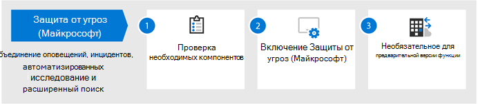
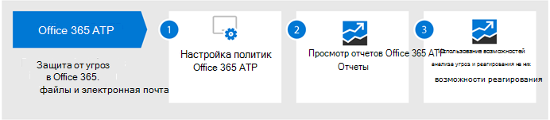
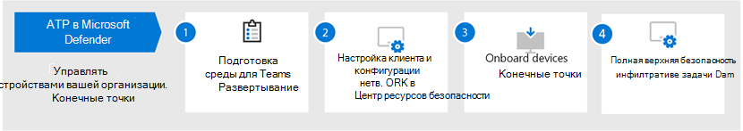
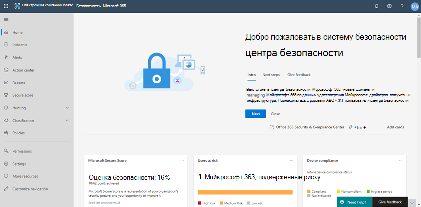

# Настройка возможностей защиты от угроз в Microsoft 365

Выполните следующие действия, чтобы настроить защиту от угроз в Microsoft 365.

## Шаг 1: Настройка многофакторной проверки подлинности и политик условного доступа

[Многофакторная проверка подлинности](https://docs.microsoft.com/azure/active-directory/authentication/concept-mfa-howitworks) (MFA) требует от пользователей проверки их подлинности с помощью телефонного вызова или приложения проверки подлинности. [Политики условного доступа](https://docs.microsoft.com/azure/active-directory/conditional-access/overview) определяют определенные требования, которые должны быть выполнены для доступа пользователей к приложениям и данным в Microsoft 365. Для защиты Организации MFA и политики условного доступа работают вместе. Например, если кто-то пытается войти с мобильного устройства, используя учетную запись, для которой не включена поддержка MFA, а для политики условного доступа требуется, чтобы сервер MFA действовал, он не сможет войти в систему.  

Корпорация Майкрософт проверила и рекомендует определенный набор условного доступа и связанных политик для защиты доступа ко всем приложениям SaaS, особенно Microsoft 365. Политики рекомендуются для базовой, конфиденциальной и строго регулируемой защиты. Начните с реализации политик для базовой защиты. 

 
 [просмотреть более крупную версию этого изображения](https://github.com/MicrosoftDocs/microsoft-365-docs/raw/public/microsoft-365/media/microsoft-365-policies-configurations/Identity_device_access_policies_byplan.png)

### Реализация базовой защиты для Microsoft 365

 

1. [Настройка необходимых компонентов, в том числе защита удостоверений Azure](../security/office-365-security/identity-access-prerequisites.md).
2. [Настройка общих политик идентификации и доступа к устройствам](../security/office-365-security/identity-access-policies.md) для базовой защиты.
3. Настройка политик для [гостевых пользователей](../security/office-365-security/identity-access-policies-guest-access.md), [Microsoft Teams](../security/office-365-security/teams-access-policies.md), [Exchange Online](../security/office-365-security/secure-email-recommended-policies.md)и [SharePoint Online и OneDrive](../security/office-365-security/sharepoint-file-access-policies.md).

### Дополнительные сведения о защите удостоверений

- [Конфигурации доступа для удостоверений и устройств](../security/office-365-security/microsoft-365-policies-configurations.md)
- [Руководство по безопасности для Azure MFA](https://docs.microsoft.com/azure/active-directory/authentication/multi-factor-authentication-security-best-practices)

## Шаг 2: Настройка функции "Advanced Threat Protection в Azure"

Служба [Advanced Threat Protection в Azure](https://docs.microsoft.com/azure-advanced-threat-protection/what-is-atp) (Azure ATP) — это решение для обеспечения безопасности на основе облака, которое работает с вашими локальными оповещениями [Azure Active Directory](https://docs.microsoft.com/azure/active-directory/fundamentals/active-directory-whatis) для определения, обнаружения и исследования сложных угроз, скомпрометированных удостоверений и действий по предварительной программе предварительной оценки, направленных в организацию.

Azure ATP позволяет аналитикам и специалистам по безопасности (Секопс), которые испытывают возможность обнаруживать расширенные атаки в гибридных средах, для выполнения следующих операций.
- Наблюдение за пользователями, поведением сущностей и действиями с помощью анализа на основе обучения.
- Защищать удостоверения и учетные данные пользователей, хранящиеся в Active Directory.
- Выявление и расследование подозрительных действий пользователей и продвинутых атак по всей цепочке уничтожений.
- Предоставьте четкую информацию об инциденте на простой временной шкале для быстрой сортировки.

### Настройка Azure ATP

 

1. [Настройте Azure ATP](https://docs.microsoft.com/azure-advanced-threat-protection/install-atp-step1) для защиты основных сред.
2. Защитите все [контроллеры домена](https://docs.microsoft.com/azure-advanced-threat-protection/atp-sensor-monitoring) и [леса](https://docs.microsoft.com/azure-advanced-threat-protection/atp-multi-forest).
3. Интеграция [оповещений Azure ATP](https://docs.microsoft.com/azure-advanced-threat-protection/suspicious-activity-guide?tabs=external) в рабочий процесс операций безопасности (секопс).

### Дополнительные сведения о Azure ATP

- [Что такое Azure ATP?](https://docs.microsoft.com/azure-advanced-threat-protection/what-is-atp)
- [Видео: введение в Azure ATP](https://www.youtube.com/watch?reload=9&v=EGY2m8yU_KE)
- [Развертывание Azure ATP](https://docs.microsoft.com/azure-advanced-threat-protection/what-is-atp#whats-next)

## Шаг 3: Включение защиты от угроз Майкрософт

[Защита от угроз Майкрософт](https://docs.microsoft.com/microsoft-365/security/mtp/microsoft-threat-protection) сочетает в себе сигналы и сочетает в себе возможности в едином решении. Благодаря встроенному решению для защиты от угроз Майкрософт, специалисты по безопасности могут объединить угрозу, чтобы каждый из этих продуктов получал и определил полную область и влияние угрозы. сведения о том, как она была введена в среду, каковы ее влияние и как в настоящее время влияет на организацию. Защита от угроз Майкрософт выполняет автоматические действия по предотвращению или прекращению атак и автовосстановления, затронутых почтовых ящиков, конечных точек и удостоверений пользователей.

Защита от угроз Майкрософт объединяет оповещения, происшествия, автоматическое исследование и ответ на рабочие нагрузки (Azure ATP, Office 365 ATP, Microsoft Defender ATP и Microsoft Cloud App Security) в единую область интерфейса прозрачности. После того как вы настроили одну или несколько служб Advanced Threat Protection, включите защиту от угроз Майкрософт. Новые возможности постоянно добавляются к защите от угроз Майкрософт; Рассмотрите возможность принимать функции предварительного просмотра.

### Настройка защиты от угроз Майкрософт

 

1. [Проверьте предварительные требования](https://docs.microsoft.com/microsoft-365/security/mtp/prerequisites).
2. [Включите защиту от угроз Майкрософт](https://docs.microsoft.com/microsoft-365/security/mtp/mtp-enable).
3. [Обязательное участие в функциях предварительного просмотра](https://docs.microsoft.com/microsoft-365/security/mtp/preview).

### Дополнительные сведения о защите от угроз Майкрософт

- [Что такое защита от угроз (Майкрософт)?](https://docs.microsoft.com/microsoft-365/security/mtp/microsoft-threat-protection)
- [Что нового в службе защиты от угроз (Майкрософт)?](https://docs.microsoft.com/microsoft-365/security/mtp/whats-new)

## Шаг 4: Настройка Office 365 Advanced Threat protection

[Office 365 Advanced Threat protection](https://docs.microsoft.com/microsoft-365/security/office-365-security/office-365-atp) (Office 365 ATP) защищает организацию от вредоносных угроз в сообщениях электронной почты (вложения и URL-адреса), документов Office и средств для совместной работы. В следующей таблице перечислены функции и возможности Office 365 ATP, включенные в Microsoft 365:

|Возможности настройки, защиты и обнаружения|Возможности автоматизации, исследования, исправления и образования|
|---|---|
|[Безопасные вложения](https://docs.microsoft.com/microsoft-365/security/office-365-security/atp-safe-attachments) [Безопасные ссылки](https://docs.microsoft.com/microsoft-365/security/office-365-security/atp-safe-links) [Безопасные документы](https://docs.microsoft.com/microsoft-365/security/office-365-security/safe-docs) [ATP для SharePoint, OneDrive и Microsoft Teams](https://docs.microsoft.com/microsoft-365/security/office-365-security/atp-for-spo-odb-and-teams) [Защита от фишинга ATP](https://docs.microsoft.com/microsoft-365/security/office-365-security/set-up-anti-phishing-policies#exclusive-settings-in-atp-anti-phishing-policies)|[Трекеры угроз](https://docs.microsoft.com/microsoft-365/security/office-365-security/threat-trackers) [Обозреватель угроз](https://docs.microsoft.com/microsoft-365/security/office-365-security/threat-explorer) [Автоматизированный анализ угроз и реагирование на них](https://docs.microsoft.com/microsoft-365/security/office-365-security/office-365-air) [Эмулятор атак](https://docs.microsoft.com/microsoft-365/security/office-365-security/attack-simulator)|
|

С помощью Office 365 ATP сотрудники Организации могут общаться и совместно работать более безопасно, с защитой от угроз для содержимого электронной почты и документов Office.

### Настройка Office 365 ATP

 

1. [Установите и настройте политики Office 365 ATP](https://docs.microsoft.com/microsoft-365/security/office-365-security/protect-against-threats).
2. [Просмотр и использование отчетов Office 365 ATP](https://docs.microsoft.com/microsoft-365/security/office-365-security/view-reports-for-atp).
3. [Используйте функцию расследования угроз и возможности реагирования](https://docs.microsoft.com/microsoft-365/security/office-365-security/office-365-ti).

### Дополнительные сведения о пакете Office 365 ATP

- [Обзор Office 365 ATP](https://docs.microsoft.com/microsoft-365/security/office-365-security/office-365-atp)
- [Новые возможности Office 365 ATP](https://docs.microsoft.com/microsoft-365/security/office-365-security/whats-new-in-office-365-atp)

## Шаг 5: Настройка Advanced Threat Protection в защитнике Майкрософт

[Advanced Threat Protection в защитнике Майкрософт](https://docs.microsoft.com/windows/security/threat-protection) (Майкрософт Defender ATP) защищает устройства Организации (также называемые конечными точками) из киберугрозами, расширенных атак и нарушений данных. Группы безопасности могут эффективнее управлять безопасностью конечных точек. Мощные средства помогают организациям справиться с неисправленными системами с помощью обнаружения уязвимостей [и управления угрозами и уязвимости](https://docs.microsoft.com/windows/security/threat-protection/microsoft-defender-atp/next-gen-threat-and-vuln-mgt). Автоматизированные функции обнаружения и устранения неполадок, такие [как уменьшение](https://docs.microsoft.com/windows/security/threat-protection/microsoft-defender-atp/overview-attack-surface-reduction)уязвимой зоны, [Защита следующего поколения](https://docs.microsoft.com/windows/security/threat-protection/windows-defender-antivirus/windows-defender-antivirus-in-windows-10), [обнаружение конечных точек и ответ](https://docs.microsoft.com/windows/security/threat-protection/microsoft-defender-atp/overview-endpoint-detection-response)на них, а также [Автоматическое исследование и устранение](https://docs.microsoft.com/windows/security/threat-protection/microsoft-defender-atp/automated-investigations) помогают обеспечить безопасность устройств от вредоносных программ. Поверх этих возможностей клиенты могут получать уведомления об профилактическых уведомлениях и обращаться к экспертным специалистам Майкрософт по требованию в рамках управляемой службы поискового запроса. 

### Настройка пакета ATP для защитника Майкрософт

 

1. [Подготовка развертывания Microsoft Defender ATP](https://docs.microsoft.com/windows/security/threat-protection/microsoft-defender-atp/deployment-phases).
2. [Настройка развертывания Microsoft Defender ATP](https://docs.microsoft.com/windows/security/threat-protection/micros.oft-defender-atp/production-deployment)
3. Подключение [к службе Microsoft Defender ATP](https://docs.microsoft.com/windows/security/threat-protection/microsoft-defender-atp/onboarding).
4. [Заполните основные задачи администрирования безопасности](https://docs.microsoft.com/windows/security/threat-protection/microsoft-defender-atp/tvm-security-recommendation).

### Дополнительные сведения о программе Microsoft Defender ATP

- [Узнайте больше о защитнике Майкрософт для ATP](https://docs.microsoft.com/windows/security/threat-protection).
- [Попробуйте пробную версию ATP для защитника Майкрософт](https://docs.microsoft.com/windows/security/threat-protection/microsoft-defender-atp/evaluation-lab).

## Шаг 6: Настройка Microsoft Cloud App Security

[Microsoft Cloud App Security](https://docs.microsoft.com/cloud-app-security) — это брокер безопасности облачного доступа, поддерживающий сбор журналов, соединители API и обратный прокси-сервер. Microsoft Cloud App Security обеспечивает широкие возможности просмотра и управления путешествием данных, а также интеллектуальную аналитику для выявления и борьбы киберугрозами среди всех облачных служб. С помощью Microsoft Cloud App Security ваши операции безопасности могут защищать конфиденциальную информацию вашей организации, защищаться от киберугрозами и аномалий, обнаруживать и отслеживать приложения, обращающиеся к данным вашей организации, а также обеспечивать соответствие облачных приложений организации требованиям.

### Настройка Microsoft Cloud App Security

 

1. [Настройка портала и других базовых требований](https://docs.microsoft.com/cloud-app-security/general-setup).
2. [Настройка облачного обнаружения](https://docs.microsoft.com/cloud-app-security/set-up-cloud-discovery) и [Подключение приложений](https://docs.microsoft.com/cloud-app-security/enable-instant-visibility-protection-and-governance-actions-for-your-apps).
3. [Разверните элемент Управление приложением условного доступа для популярных приложений](https://docs.microsoft.com/cloud-app-security/proxy-deployment-aad).
4. [Используйте средства расследования и панели мониторинга](https://docs.microsoft.com/cloud-app-security/investigate).

### Дополнительные сведения о Microsoft Cloud App Security

- [Просмотрите новые функции и возможности](https://docs.microsoft.com/cloud-app-security/release-notes).
- [Узнайте больше о Microsoft Cloud App Security](https://docs.microsoft.com/cloud-app-security/what-is-cloud-app-security).

## Шаг 7: мониторинг состояния и выполнение действий

После того как вы настроили и развернули службы защиты от угроз, ваш следующий шаг предназначен для отслеживания обнаружений угроз и выполнения соответствующих действий. Лучший отправную точку является центр безопасности Microsoft 365 ( [https://security.microsoft.com](https://security.microsoft.com) ), на котором можно отслеживать и управлять безопасностью для своих удостоверений, данных, устройств, приложений и инфраструктуры Майкрософт. 

Центр обеспечения безопасности Microsoft 365 специально предназначен для администраторов безопасности и действий по обеспечению безопасности Teams. В центре безопасности Майкрософт 365 можно выполнить следующие действия:
- Просмотр общей работоспособности системы безопасности Организации с [надежным рейтингом](https://docs.microsoft.com/microsoft-365/security/mtp/microsoft-secure-score).
- [Отслеживайте и просматривайте отчеты](https://docs.microsoft.com/microsoft-365/security/mtp/monitoring-and-reporting) о состоянии ваших удостоверений, данных, устройств, приложений и инфраструктуры.
- Подключайте точки на оповещениях через [происшествия](https://docs.microsoft.com/microsoft-365/security/mtp/incident-queue).
- Используйте [Автоматическое исследование и исправление](https://docs.microsoft.com/microsoft-365/security/mtp/mtp-autoir) для устранения угроз.
- [Профилактическое профилактическое слежение за угрозами](https://docs.microsoft.com/microsoft-365/security/mtp/advanced-hunting-overview), такими как попытки вторжения или нарушение активности, затрагивающие вашу почту, данные, устройства и удостоверения.
- [Узнайте о новейших кампаниях](https://docs.microsoft.com/microsoft-365/security/mtp/latest-attack-campaigns) и методиках атак с помощью средства анализа угроз.
- ... и многое другое!

### Дополнительные сведения о центре безопасности Майкрософт 365

- Приступая [к работе с центром безопасности Microsoft 365](https://docs.microsoft.com/microsoft-365/security/mtp/overview-security-center).
- [Отслеживание и просмотр отчетов](https://docs.microsoft.com/microsoft-365/security/mtp/monitoring-and-reporting).
- [Посетите порталы безопасности в Microsoft 365](https://docs.microsoft.com/microsoft-365/security/mtp/portals).

## Шаг 8: обучение пользователей

Обучающие пользователи могут сэкономить время и недовольство для групп пользователей и действий по обеспечению безопасности. Пользователям с техническим уровнем вероятности рекомендуется открывать вложения или щелкать ссылки в сообщениях электронной почты, которые чаще всего не допускают подозрительных веб-сайтов. 

В [справочнике](https://go.microsoft.com/fwlink/?linkid=2015598&amp;clcid=0x409) по Харвард Кеннеди School циберсекурити содержатся отличные рекомендации по созданию строгой культуры осведомленности в Организации, в том числе учебные пользователи для определения фишинговых атак. 

Microsoft 365 предоставляет следующие материалы для информирования пользователей организации:

|Концепция  |Ресурсы  |
|---------|---------|
|Microsoft 365     |[Настраиваемые пути обучения](https://docs.microsoft.com/office365/customlearning/) 
Эти ресурсы помогут вам объединить учебные курсы для конечных пользователей в Организации.        |
|Безопасность Microsoft 365 |[Модуль обучения: Защитите свою организацию с помощью встроенной, интеллектуальной системы безопасности от Microsoft 365](https://docs.microsoft.com/learn/modules/security-with-microsoft-365) 
Этот модуль позволяет описать принципы взаимодействия функций безопасности Microsoft 365 и преимущества этих функций безопасности. |
|Многофакторная проверка подлинности     | [Две этапа проверки: что такое дополнительная страница проверки?](https://docs.microsoft.com/azure/active-directory/user-help/multi-factor-authentication-end-user-first-time) 
Эта статья поможет пользователям определить многофакторную проверку подлинности и ее использование в вашей организации.    |

В дополнение к этим рекомендациям Корпорация Майкрософт рекомендует выполнять действия, описанные в этой статье: [Защитите свою учетную запись и устройства от хакеров и вредоносных программ](https://support.office.com/article/066d6216-a56b-4f90-9af3-b3a1e9a327d6.aspx). Сюда входят следующие действия:
- Использование надежных паролей
- Защита устройств 
- Включение функций безопасности на компьютерах с Windows 10 и Mac (для неуправляемых устройств)
    
Кроме того, корпорация Майкрософт рекомендует пользователям защищать свои личные учетные записи электронной почты, выполнив действия, Рекомендуемые в следующих статьях:
- [Защитите свою учетную запись электронной почты Outlook.com](https://support.microsoft.com/office/help-protect-your-outlook-com-email-account-a4f20fc5-4307-4ece-8231-6d4d4bd8a9ba)
- [Защита учетной записи Gmail с помощью 2 шаговой проверки](https://go.microsoft.com/fwlink/?linkid=2015688&amp;clcid=0x409)
