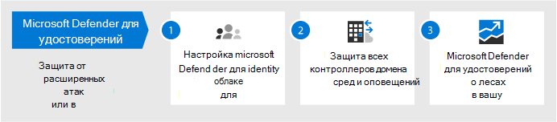
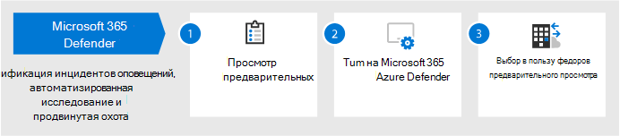
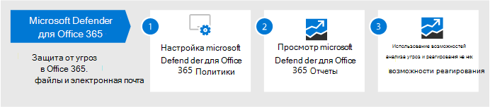
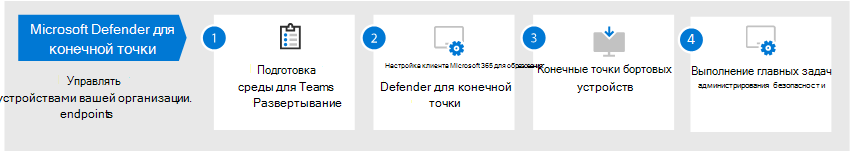
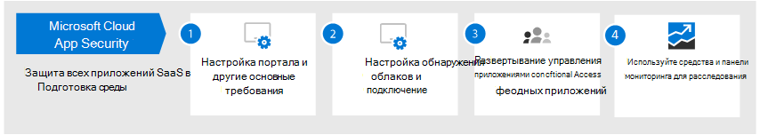

# Настройка возможностей защиты от угроз в Microsoft 365

Выполните следующие действия, чтобы настроить защиту от угроз в Microsoft 365.

## Шаг 1. Настройка многофакторной проверки подлинности и политики условного доступа

[Многофакторная проверка](/azure/active-directory/authentication/concept-mfa-howitworks) подлинности (MFA) требует, чтобы пользователи проверяли свою личность с помощью телефонного звонка или приложения-аутентификации. [Политики условного доступа определяют](/azure/active-directory/conditional-access/overview) определенные требования, которые должны быть выполнены для доступа пользователей к приложениям и данным в Microsoft 365. Политики MFA и условного доступа работают вместе, чтобы защитить вашу организацию. Например, если кто-то пытается войти с мобильного устройства с помощью учетной записи, которая не включена для MFA, а политика условного доступа требует, чтобы MFA была в силе, этому пользователю будет отключен вход.  

Корпорация Майкрософт проверила и рекомендует определенный набор условного доступа и связанных политик для защиты доступа ко всем приложениям SaaS, особенно к Microsoft 365. Политики рекомендуется использовать для базовой, конфиденциальной и строго регламентирующейся защиты. Начните с реализации политик базовой защиты. 

и доступа к 
 [устройствам См. в большей версии этого изображения](https://github.com/MicrosoftDocs/microsoft-365-docs/raw/public/microsoft-365/media/microsoft-365-policies-configurations/Identity_device_access_policies_byplan.png)

### Реализация базовой защиты для Microsoft 365

 

1. [Настройка необходимых условий, включая защиту удостоверений Azure AD.](../security/office-365-security/identity-access-prerequisites.md)
2. [Настройка общих политик доступа к](../security/office-365-security/identity-access-policies.md) удостоверениям и устройствам для базовой защиты.
3. Настройка политик для [гостевых пользователей,](../security/office-365-security/identity-access-policies-guest-access.md) [Microsoft Teams,](../security/office-365-security/teams-access-policies.md) [Exchange Online](../security/office-365-security/secure-email-recommended-policies.md)и [SharePoint Online и OneDrive.](../security/office-365-security/sharepoint-file-access-policies.md)

### Дополнительные сведения о защите удостоверений

- [Конфигурации доступа для удостоверений и устройств](../security/office-365-security/microsoft-365-policies-configurations.md)
- [Руководство по безопасности для Azure MFA](/azure/active-directory/authentication/multi-factor-authentication-security-best-practices)

## Шаг 2. Настройка Microsoft Defender для удостоверений

[Microsoft Defender for Identity](/azure-advanced-threat-protection/what-is-atp) — это облачное решение безопасности, которое работает с локальной службой доменных служб Active Directory (AD DS) для выявления, обнаружения и расследования расширенных угроз, скомпрометных удостоверений и вредоносных действий инсайдеров, направленных на организацию.

Microsoft Defender for Identity позволяет аналитикам и специалистам по безопасности в операциях безопасности (SecOps) выявлять расширенные атаки в гибридных средах, чтобы:
- Отслеживайте поведение пользователей, поведение и действия с помощью аналитики на основе обучения.
- Защищать удостоверения и учетные данные пользователей, хранящиеся в Active Directory.
- Выявление и расследование подозрительных действий пользователей и продвинутых атак по всей цепочке уничтожений.
- Предоставьте четкую информацию об инциденте на простой временной шкале для быстрой сортировки.

### Настройка Microsoft Defender для удостоверений

 

1. [Настройка Microsoft Defender для удостоверений](/azure-advanced-threat-protection/install-atp-step1) для защиты основных сред.
2. Защитите все [контроллеры домена](/azure-advanced-threat-protection/atp-sensor-monitoring) [и леса.](/azure-advanced-threat-protection/atp-multi-forest)
3. Интеграция [оповещений](/azure-advanced-threat-protection/suspicious-activity-guide?tabs=external) Microsoft Defender для удостоверений в рабочий процесс операций безопасности (SecOps).

### Дополнительные сведения о Microsoft Defender for Identity

- [Что такое Microsoft Defender для удостоверений?](/azure-advanced-threat-protection/what-is-atp)
- [Видео: Введение в Microsoft Defender для удостоверений](https://www.youtube.com/watch?reload=9&v=EGY2m8yU_KE)
- [Microsoft Defender для развертывания удостоверений](/azure-advanced-threat-protection/what-is-atp#whats-next)

## Шаг 3. Включив защитник Microsoft 365

[Microsoft 365 Defender](../security/defender/microsoft-365-defender.md) объединяет сигналы и объединяет возможности в одно решение. С интегрированным решением Microsoft 365 Defender специалисты по безопасности могут сшить вместе сигналы угрозы, получаемые каждым из этих продуктов, и определить полный охват и влияние угрозы; как он вошел в среду, на что она влияет, и как она в настоящее время влияет на организацию. Microsoft 365 Defender принимает автоматические меры для предотвращения или остановки атаки и самостоятельного заживления затронутых почтовых ящиков, конечных точек и удостоверений пользователей.

Microsoft 365 Defender объединяет оповещения, инциденты, автоматическое расследование и ответы, а также расширенный поиск по рабочим нагрузкам (Microsoft Defender for Identity, Microsoft Defender for Office 365, Microsoft Defender for Endpoint и Microsoft Cloud App Security) в единое стекло. После настройки одной или более служб Defender для Office 365 включите Microsoft 365 Defender. Новые функции постоянно добавляются в Microsoft 365 Defender; рассмотрите возможность получения функций предварительного просмотра.

### Настройка Защитника Microsoft 365

 

1. [Просмотрите необходимые условия.](../security/defender/prerequisites.md)
2. [Включи Microsoft 365 Defender.](../security/defender/m365d-enable.md)
3. [Выберите функции предварительного просмотра.](../security/defender/preview.md)

### Дополнительные сведения о Microsoft 365 Defender

- [Что такое Microsoft 365 Defender?](../security/defender/microsoft-365-defender.md)
- [Новые возможности Microsoft 365 Defender](../security/defender/whats-new.md)

## Шаг 4. Настройка Microsoft Defender для Office 365

[Microsoft Defender для Office 365](../security/office-365-security/defender-for-office-365.md) защищает организацию от вредоносных угроз в сообщениях электронной почты (вложениях и URL-адресах), документах Office и средствах совместной работы. В следующей таблице перечислены функции и возможности Microsoft Defender для Office 365, включенные в Microsoft 365 E5:

|Возможности настройки, защиты и обнаружения|Возможности автоматизации, исследования, восстановления и образования|
|---|---|
|[Безопасные вложения](../security/office-365-security/safe-attachments.md) [Безопасные ссылки](../security/office-365-security/safe-links.md) [Безопасные документы](../security/office-365-security/safe-docs.md) [ATP для SharePoint, OneDrive и Microsoft Teams](../security/office-365-security/mdo-for-spo-odb-and-teams.md) [Защита от фишинга в Defender для Office 365](../security/office-365-security/set-up-anti-phishing-policies.md#Exclusive-settings-in-anti-phishing-policies-in Microsoft-Defender-for-Office-365)|[Трекеры угроз](../security/office-365-security/threat-trackers.md) [Обозреватель угроз](../security/office-365-security/threat-explorer.md) [Автоматизированный анализ угроз и реагирование на них](../security/office-365-security/office-365-air.md) [Эмулятор атак](../security/office-365-security/attack-simulator.md)|
|

С помощью Microsoft Defender для Office 365 люди в вашей организации могут более безопасно общаться и сотрудничать с помощью защиты от угроз для контента электронной почты и документов Office.

### Настройка Microsoft Defender для Office 365

 

1. [Настройка и настройка политик Microsoft Defender для Office 365.](../security/office-365-security/protect-against-threats.md)
2. [Просмотр и использование отчетов Microsoft Defender для Office 365.](../security/office-365-security/view-reports-for-mdo.md)
3. [Используйте возможности расследования и реагирования на угрозы.](../security/office-365-security/office-365-ti.md)

### Дополнительные сведения о Microsoft Defender для Office 365

- [Обзор Microsoft Defender для Office 365](../security/office-365-security/defender-for-office-365.md)
- [Новые возможности в Microsoft Defender для Office 365](../security/office-365-security/whats-new-in-defender-for-office-365.md)

## Шаг 5. Настройка Microsoft Defender для конечной точки

[Microsoft Defender для конечной точки](/windows/security/threat-protection) защищает устройства организаций (также именуются конечными точками) от киберугроз, расширенных атак и нарушений данных. Группы безопасности могут быть более эффективными в управлении безопасностью конечных точек. Надежные средства помогают организациям не отстать от неокрепаемой системы с помощью обнаружения уязвимостей с [помощью управления угрозами и уязвимостью.](/windows/security/threat-protection/microsoft-defender-atp/next-gen-threat-and-vuln-mgt) Автоматизированные возможности обнаружения и восстановления, такие как уменьшение поверхности [атаки,](/windows/security/threat-protection/microsoft-defender-atp/overview-attack-surface-reduction)защита следующего  [поколения,](/windows/security/threat-protection/windows-defender-antivirus/windows-defender-antivirus-in-windows-10)обнаружение конечных точек и реагирование, а также автоматическое расследование и исправление помогают защитить устройства от вредоносных программ. Помимо этих возможностей, клиенты могут получать упреждающие уведомления и консультироваться по запросу с экспертами microsoft Threat По запросу в рамках службы управляемой охоты. 

### Настройка Microsoft Defender для конечной точки

 

1. [Подготовка среды для microsoft Defender для развертывания конечных точек.](/windows/security/threat-protection/microsoft-defender-atp/deployment-phases)
2. [Настройка microsoft Defender для развертывания конечных точек.](/windows/security/threat-protection/micros.oft-defender-atp/production-deployment)
3. [На борту службы Microsoft Defender для конечных точек](/windows/security/threat-protection/microsoft-defender-atp/onboarding).
4. [Выполните ваши главные административные задачи по обеспечению безопасности.](/windows/security/threat-protection/microsoft-defender-atp/tvm-security-recommendation)

### Дополнительные сведения о Microsoft Defender для конечной точки

- [Дополнительные информацию о Microsoft Defender для конечной точки](/windows/security/threat-protection).
- [Попробуйте лабораторию оценки Microsoft Defender для конечной точки.](/windows/security/threat-protection/microsoft-defender-atp/evaluation-lab)

## Шаг 6. Настройка безопасности облачных приложений Майкрософт

[Microsoft Cloud App Security](/cloud-app-security) — это брокер по безопасности облачного доступа, который поддерживает коллекцию журналов, соединители API и обратный прокси. Безопасность облачных приложений Майкрософт обеспечивает доступ к информации, управление перемещениями данных и сложную аналитику для выявления и борьбы с киберугрозами во всех облачных службах. С помощью microsoft Cloud App Security операции безопасности могут защитить конфиденциальные сведения организации, защититься от киберугроз и аномалий, обнаружить и отслеживать приложения, которые имеют доступ к данным организации, а также убедиться, что облачные приложения организации соответствуют требованиям соответствия требованиям.

### Настройка безопасности облачных приложений Майкрософт

 

1. [Настройка портала и других основных требований.](/cloud-app-security/general-setup)
2. [Настройка обнаружения облаков и подключение](/cloud-app-security/set-up-cloud-discovery) [приложений.](/cloud-app-security/enable-instant-visibility-protection-and-governance-actions-for-your-apps)
3. [Развертывание элементов управления приложениями условного доступа для рекомендуемых приложений.](/cloud-app-security/proxy-deployment-aad)
4. [Используйте средства расследования и панели мониторинга.](/cloud-app-security/investigate)

### Дополнительные сведения о Microsoft Cloud App Security

- [Просмотрите новые функции и возможности.](/cloud-app-security/release-notes)
- [Узнайте больше о безопасности облачных приложений Майкрософт.](/cloud-app-security/what-is-cloud-app-security)

## Шаг 7. Мониторинг состояния и действия

После того как вы настроите и развернете службы и возможности защиты от угроз, следующим шагом будет мониторинг обнаружения угроз и соответствующие действия. Лучшей отправной точкой является центр безопасности Microsoft 365 (), где можно отслеживать и управлять безопасностью в удостоверениях, данных, устройствах, приложениях и инфраструктуре [https://security.microsoft.com](https://security.microsoft.com) Майкрософт. 

Центр безопасности Microsoft 365 предназначен специально для администраторов безопасности и групп операций безопасности. В центре безопасности Microsoft 365 можно:
- Просмотр общего состояния безопасности организации с помощью [secure Score.](https://docs.microsoft.com/microsoft-365/security/defender/microsoft-secure-score)
- [Мониторинг и просмотр отчетов](https://docs.microsoft.com/microsoft-365/security/defender/monitoring-and-reporting) о состоянии удостоверений, данных, устройств, приложений и инфраструктуры.
- Соедините точки оповещений с [помощью инцидентов.](https://docs.microsoft.com/microsoft-365/security/defender/incident-queue)
- Для [устранения угроз](https://docs.microsoft.com/microsoft-365/security/defender/mtp-autoir) используйте автоматическое расследование и исправление.
- [Активная охота на угрозы,](https://docs.microsoft.com/microsoft-365/security/defender/advanced-hunting-overview)такие как попытки вторжения или нарушения, влияющие на вашу электронную почту, данные, устройства и удостоверения.
- [С помощью аналитики угроз](https://docs.microsoft.com/microsoft-365/security/defender/latest-attack-campaigns) вы поймете последние кампании и методы атак.
- ... и больше!

### Дополнительные сведения о центре безопасности Microsoft 365

- [Начало работы с центром безопасности Microsoft 365.](../security/defender/overview-security-center.md)
- [Мониторинг и просмотр отчетов](../security/defender/overview-security-center.md).
- [См. порталы безопасности в Microsoft 365](../security/defender/portals.md).

## Шаг 8. Обучение пользователей

Обучение пользователей может сэкономить пользователям и группе операций безопасности много времени и разочарований. Опытные пользователи реже открывают вложения или щелкают ссылки в сомнительных сообщениях электронной почты, и они с большей вероятностью избегают подозрительных веб-сайтов. 

Руководство по  кампании кибербезопасности в школе Кеннеди в Гарварде предоставляет отличные рекомендации по созданию сильной культуры осведомленности о безопасности в вашей организации, включая обучение пользователей выявлению фишинговых атак. 

Microsoft 365 предоставляет следующие ресурсы, которые помогут информировать пользователей в вашей организации:

|Понятие  |Ресурсы  |
|---------|---------|
|Microsoft 365     |[Настраиваемые пути обучения](/office365/customlearning/) 
Эти ресурсы помогут вам собрать обучение для конечных пользователей в организации        |
|Безопасность Microsoft 365 |[Модуль обучения: защита организации встроенной и интеллектуальной безопасностью от Microsoft 365](/learn/modules/security-with-microsoft-365) 
Этот модуль позволяет описать, как функции безопасности Microsoft 365 работают вместе, и сформулировать преимущества этих функций безопасности. |
|Многофакторная проверка подлинности     | [Двухшаговая проверка: что такое дополнительная страница проверки?](/azure/active-directory/user-help/multi-factor-authentication-end-user-first-time) 
Эта статья помогает конечным пользователям понять, что такое многофакторная проверка подлинности и почему она используется в организации.    |

В дополнение к этому руководству Корпорация Майкрософт рекомендует пользователям принимать меры, описанные в этой статье: Защита учетной записи и устройств от хакеров [и вредоносных программ.](https://support.office.com/article/066d6216-a56b-4f90-9af3-b3a1e9a327d6.aspx) Эти действия включают в себя:
- Использование надежных паролей
- Защита устройств 
- Включение функций безопасности на ПК Windows 10 и Mac (для неугодных устройств)
    
Корпорация Майкрософт также рекомендует пользователям защищать свои личные учетные записи электронной почты, принимая меры, рекомендуемые в следующих статьях:
- [Справка по защите Outlook.com учетной записи электронной почты](https://support.microsoft.com/office/help-protect-your-outlook-com-email-account-a4f20fc5-4307-4ece-8231-6d4d4bd8a9ba)
- [Защита учетной записи Gmail с помощью 2-х этапов проверки](https://go.microsoft.com/fwlink/?linkid=2015688&amp;clcid=0x409)
