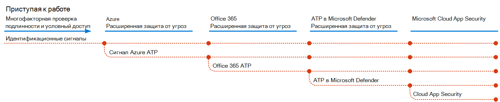
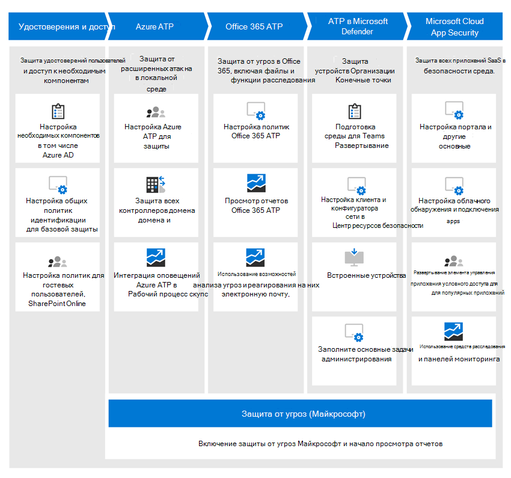

# Развертывание возможностей защиты от угроз в Microsoft 365Deploy threat protection capabilities across Microsoft 365

[Вредоносные программы](https://docs.microsoft.com/windows/security/threat-protection/intelligence/understanding-malware)и сложные кибератаки, такие как [угрозы без файлов](https://docs.microsoft.com/windows/security/threat-protection/intelligence/fileless-threats), являются распространенным событием.[Malware](https://docs.microsoft.com/windows/security/threat-protection/intelligence/understanding-malware), and sophisticated cyberattacks, such as [fileless threats](https://docs.microsoft.com/windows/security/threat-protection/intelligence/fileless-threats), are a common occurrence. Предприятиям необходимо защищать себя и их клиентов.Businesses need to protect themselves and their customers. Такие атаки могут привести к серьезным проблемам в Организации, от потери доверия до финансовых воес, простоев бизнес-угрожающие материалы и т. д.Such attacks can cause major problems for your organization, ranging from a loss of trust to financial woes, business-threatening downtime, and more. Защита от угроз имеет важное значение, но может быть трудно определить, где следует уделить время, усилия и ресурсы Организации.Protecting against threats is important, but it can be challenging to determine where to focus your organization's time, effort, and resources. 

Решения для обеспечения безопасности Майкрософт встроены в наши продукты и службы.Microsoft security solutions are built into our products and services. Возможности автоматизации и машинного обучения снижают нагрузку на группы по обеспечению безопасности, чтобы убедиться в том, что нужные элементы направлены.Automation and machine learning capabilities reduce the load on your security teams to make sure the right items are addressed. А надежность решений Майкрософт по обеспечению безопасности основаны на триллионсх, которые обрабатываются ежедневно в нашем [интеллектуальном графе безопасности](https://cloud-platform-assets.azurewebsites.net/intelligent-security-graph).And the strength of Microsoft security solutions is built on trillions of signals we process every day in our [Intelligent Security Graph](https://cloud-platform-assets.azurewebsites.net/intelligent-security-graph). Решения для обеспечения безопасности Microsoft 365 включают в себя [защиту от угроз Майкрософт](https://docs.microsoft.com/microsoft-365/security/mtp/microsoft-threat-protection), решение, объединяющее сигналы электронной почты, данных, устройств и удостоверений для покраски изображения сложных угроз в Организации.Microsoft 365 security solutions include [Microsoft Threat Protection](https://docs.microsoft.com/microsoft-365/security/mtp/microsoft-threat-protection), a solution that brings together signals across your email, data, devices, and identities to paint a picture of advanced threats against your organization.

В этом видеоролике приводится обзор процесса развертывания.Watch this video for an overview of the deployment process.

> [!VIDEO https://www.microsoft.com/videoplayer/embed/RE4vsI7]

Используйте эту статью в качестве руководства по внедрению решения для защиты от угроз.Use this article as a guide for implementing your threat protection solution.

## Защита от угроз в Microsoft 365Threat protection in Microsoft 365 E5

[Microsoft 365](https://www.microsoft.com/microsoft-365/enterprise-e5-business-software?activetab=pivot%3aoverviewtab) , что позволяет защищать организацию с помощью адаптивной встроенной аналитики.[Microsoft 365 E5](https://www.microsoft.com/microsoft-365/enterprise-e5-business-software?activetab=pivot%3aoverviewtab) enables you to protect your organization with adaptive, built-in intelligence. С помощью функций защиты от угроз в Microsoft 365, вы можете обнаруживать и изучать расширенные угрозы, скомпрометированные удостоверения и вредоносные действия в локальных и облачных средах.With the threat protection features in Microsoft 365 E5, you can detect and investigate advanced threats, compromised identities, and malicious actions across your on-premises and cloud environments.

В Microsoft 365 е функции защиты от угроз интегрированы по умолчанию.In Microsoft 365 E5, threat protection capabilities are integrated by default. Подается сигнал от каждой возможности — возможность обнаруживать угрозы и реагировать на них.Signals from each capability add strength to the overall ability to detect and respond to threats. Комбинированный набор возможностей обеспечивает наилучшую защиту для организаций, особенно многоязычных организаций, по сравнению с выполнением продуктов, не относящихся к корпорации Майкрософт.The combined set of capabilities offers the best protection for organizations, especially multi-national organizations, compared to running non-Microsoft products. На следующем рисунке изображены службы и функции защиты от угроз в Microsoft 365, описанные в этой статье.The following image depicts the threat protection services and capabilities in Microsoft 365 E5 that are described in this article.

Как только вы развертываете какие — расширенные возможности защиты от угроз, вы можете включить защиту от угроз Майкрософт, которая переводит сигналы и данные в одном месте.As soon as you deploy any of the advanced threat protection capabilities, you can turn on Microsoft Threat Protection, which brings the signals and data together into one place. 

На следующем рисунке представлен рекомендуемый путь для развертывания отдельных возможностей.The following illustration depicts a recommended path for deploying these individual capabilities. 

|Решение и возможностиSolution/capabilities  |ОписаниеDescription  |
|---------|---------|
|Многофакторная проверка подлинности и условный доступMulti-factor authentication and conditional access     |Защита от скомпрометированных удостоверений и устройств.Protect against compromised identities and devices. Начните с этой защиты, так как это основано.Begin with this protection because it's foundational. Конфигурация, рекомендуемая в этом руководстве, включает в себя защиту удостоверения Azure AD.The configuration recommended in this guidance includes Azure AD Identity Protection as a prerequisite.     |
|Расширенная защита от угроз AzureAzure Advanced Threat Protection     |  Облачное решение для обеспечения безопасности, использующее локальные сигналы Active Directory для определения, обнаружения и исследования сложных угроз, скомпрометированных удостоверений и действий по предварительной программе предварительной оценки, направленных в организацию.A cloud-based security solution that leverages your on-premises Active Directory signals to identify, detect, and investigate advanced threats, compromised identities, and malicious insider actions directed at your organization. Обратите внимание на следующее, так как она защищает локальную среду и облачную инфраструктуру, не имеет зависимостей и предварительных требований, а также может обеспечить немедленную пользу.Focus on this next because it protects your on-prem and your cloud infrastructure, has no dependencies or prerequisites, and can provide immediate benefit.       | 
|Office 365 Advanced Threat ProtectionOffice 365 Advanced Threat Protection     | Защищает организацию от вредоносных угроз, исносящихся к сообщениям электронной почты, ссылкам (URL-адресам) и средствам совместной работы.Safeguards your organization against malicious threats posed by email messages, links (URLs), and collaboration tools. Защита от вредоносных программ, фишинговых атак, подмены и других типов атак.Protections for malware, phishing, spoofing, and other attack types. Это рекомендуется, так как управление изменениями, перенос параметров из системы инкумбент и другие вопросы могут занимать больше длительного развертывания.This is recommended next because change control, migrating settings from incumbent system, and other considerations can take longer to deploy.   Примечание. Убедитесь, что вы также настроили возможности защиты от угроз, включенные во все подписки на Office 365 (Exchange Online Protection).Note: Be sure you also configure the threat protection capabilities included in all Office 365 subscriptions (Exchange Online Protection).       |
|Advanced Threat Protection в Microsoft DefenderMicrosoft Defender Advanced Threat Protection    | Платформа Endpoint Protection, которая помогает предотвращать, обнаруживать и отвечать на расширенные угрозы.An endpoint protection platform that helps prevent, detect, investigate, and respond to advanced threats. Процесс развертывания занимает больше времени, но его можно выполнить параллельно с другими возможностями, если ответственным являются другие администраторы.This takes longer to deploy, but can be done in parallel with the other capabilities if other admins are responsible.   |
|Microsoft Cloud App SecurityMicrosoft Cloud App Security     |   Брокер безопасности облачного доступа для обнаружения, исследования и управления.A cloud access security broker for discovery, investigation, and governance. Вы можете сделать это раньше, чтобы начать сбор данных и аналитику.You can enable this early to begin collecting data and insights. Реализация информации и другой целевой защиты в приложениях SaaS включает планирование и может занять больше времени.Implementing information and other targeted protection across your SaaS apps involves planning and can take more time.       | 

> [!TIP]
> Организации с несколькими участниками группы безопасности могут параллельно реализовать эти возможности.Organizations with multiple security teams can implement these capabilities in parallel.

## Развертывание решения для защиты от угрозDeploy your threat protection solution

Чтобы убедиться в том, что ваша организация обладает лучшей защитой, установите и разверните свое решение по обеспечению безопасности, чтобы включить следующие действия:To make sure your organization has the best protection possible, set up and deploy your security solution to include the following steps:

1. [Настройка многофакторной проверки подлинности и политик условного доступаSet up multi-factor authentication and conditional access policies](deploy-threat-protection-configure.md#step-1-set-up-multi-factor-authentication-and-conditional-access-policies)
2. [Настройка Advanced Threat Protection в AzureConfigure Azure Advanced Threat Protection](deploy-threat-protection-configure.md#step-2-configure-azure-advanced-threat-protection)
3. [Включение Защиты от угроз (Майкрософт)Turn on Microsoft Threat Protection](deploy-threat-protection-configure.md#step-3-turn-on-microsoft-threat-protection)
4. [Настройка Office 365 Advanced Threat protectionConfigure Office 365 Advanced Threat Protection](deploy-threat-protection-configure.md#step-4-configure-office-365-advanced-threat-protection)
5. [Настройка Advanced Threat Protection в защитнике МайкрософтConfigure Microsoft Defender Advanced Threat Protection](deploy-threat-protection-configure.md#step-5-configure-microsoft-defender-advanced-threat-protection)
6. [Настройка Microsoft Cloud App SecurityConfigure Microsoft Cloud App Security](deploy-threat-protection-configure.md#step-6-configure-microsoft-cloud-app-security)
7. [Отслеживание состояния и выполнение действийMonitor status and take actions](deploy-threat-protection-configure.md#step-7-monitor-status-and-take-actions)
8. [Обучение пользователейTrain users](deploy-threat-protection-configure.md#step-8-train-users)

Функции защиты от угроз можно настроить параллельно, поэтому при наличии нескольких групп безопасности, ответственных за различные службы, они могут настраивать функции защиты Организации одновременно.Your threat protection features can be configured in parallel, so if you have multiple security teams responsible for different services, they can configure your organization’s protection features at the same time. На следующей схеме показан процесс высокого уровня для развертывания возможностей защиты от угроз.The following diagram illustrates the high-level process for deploying threat protection capabilities. 

 

