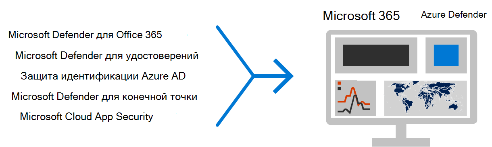
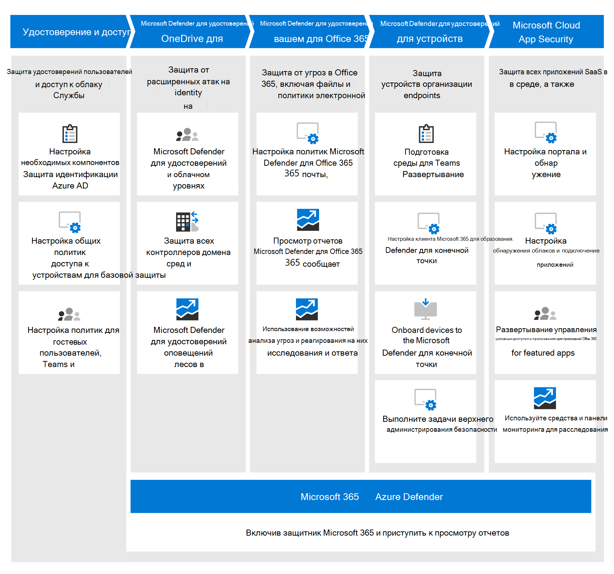

# Развертывание возможностей защиты от угроз в Microsoft 365 E5

Это решение описывает мощные возможности защиты от угроз в Microsoft 365 E5 и то, почему защита от угроз имеет важное значение. Получите обзор защиты от угроз в Microsoft 365 E5 и узнайте, как подойти к настройке и конфигурации для вашей организации.

## Почему защита от угроз важна 

[Вредоносные](/windows/security/threat-protection/intelligence/understanding-malware)программы и сложные кибератаки, такие как [угрозы](/windows/security/threat-protection/intelligence/fileless-threats)без файлов, являются распространенным явлением. Предприятиям необходимо защитить себя и своих клиентов эффективными возможностями ИТ-безопасности. Кибератаки могут вызвать серьезные проблемы для организации, начиная от потери доверия до финансовых проблем, простоев, угрожающих бизнесу, и т. д. Защита от угроз имеет важное значение, но может быть сложно определить, где сосредоточить время, усилия и ресурсы организации. Microsoft 365 E5 может помочь. 

## Защита от угроз в Microsoft 365 E5

Решения для обеспечения безопасности Майкрософт встроены в наши продукты и службы. Возможности автоматизации и машинного обучения уменьшают нагрузку на группы безопасности, чтобы убедиться, что нужные элементы будут устранены. Сила решений безопасности Майкрософт построена на триллионах сигналов, которые мы обработать каждый день в нашем интеллектуальном Graph [.](/graph/security-concept-overview) Microsoft 365 безопасности [включают Microsoft 365 Defender](../security/defender/microsoft-365-defender.md), решение, которое объединяет сигналы по электронной почте, данным, устройствам и удостоверениям, чтобы нарисовать картину расширенных угроз в отношении вашей организации.

[Microsoft 365 E5](https://www.microsoft.com/microsoft-365/enterprise-e5-business-software?activetab=pivot%3aoverviewtab) позволяет защитить организацию адаптивным встроенным интеллектом. С помощью возможностей безопасности в Microsoft 365 E5 вы можете обнаруживать и исследовать расширенные угрозы, скомпрометированную идентичность и вредоносные действия в среде (локальной среде и в облаке).

## Улучшение защиты с помощью интеграции

В Microsoft 365 E5 по умолчанию интегрированы возможности защиты от угроз. Сигналы от каждой возможности добавляют силу общей способности обнаруживать угрозы и реагировать на них. Комбинированный набор возможностей обеспечивает лучшую защиту для организаций, особенно многонациональных организаций, по сравнению с запуском продуктов, не в microsoft. На следующем изображении показаны службы и возможности защиты от угроз, описанные в этой статье.

Microsoft 365 Defender объединяет сигналы и данные в единый центр Microsoft 365 [безопасности.](/microsoft-365/security/defender/overview-security-center) 

> [!div class="mx-imgBorder"]
> 

## Обзор развертывания

На следующей иллюстрации показан рекомендуемый путь для развертывания этих отдельных возможностей. 

> [!div class="mx-imgBorder"]
> 

Обзор процесса развертывания показан в приведенном ниже видео.
  
> [!VIDEO https://www.microsoft.com/videoplayer/embed/RE4vsI7]

В следующей таблице описываются различные решения и возможности для настройки и их действия.

|Шаг |Решение/возможности  |Описание  |
|--|---------|---------|
| 1 |[Многофакторная проверка подлинности и условный доступ](deploy-threat-protection-configure.md#step-1-set-up-multi-factor-authentication-and-conditional-access-policies)     |Защита от скомпрометированных удостоверений и устройств. Начните с этой защиты, так как она является фундаментальной. Рекомендуемая в этом руководстве конфигурация включает в себя защиту удостоверений Azure AD в качестве обязательного условия. Дополнительные сведения см. в [видеоролике Azure AD Identity Protection.](/azure/security/fundamentals/threat-detection#azure-active-directory-identity-protection)     |
| 2 |[Microsoft Defender для удостоверений](deploy-threat-protection-configure.md#step-2-configure-microsoft-defender-for-identity)     |  Облачное решение безопасности, использующее локальное решение Active Directory Domain Services (AD DS) для выявления, обнаружения и расследования расширенных угроз, скомпрометных удостоверений и вредоносных действий инсайдеров, направленных на организацию. Сосредоточься на Microsoft Defender для identity далее, так как он защищает локальной и облачной инфраструктуры, не имеет зависимостей и необходимых условий и может обеспечить немедленные преимущества для безопасности. Дополнительные сведения см. в [том, что такое защита удостоверений?](/azure/active-directory/identity-protection/overview-identity-protection). | 
| 3 |[Microsoft 365 Defender](deploy-threat-protection-configure.md#step-3-turn-on-microsoft-365-defender) |Объединяет сигналы и объединяет возможности в единое решение. Позволяет специалистам по безопасности сшить вместе сигналы угрозы и определить полный объем и влияние угрозы. Microsoft 365 Defender принимает автоматические действия для предотвращения или остановки атаки и самообувления затронутых почтовых ящиков, конечных точек и удостоверений пользователей. Дополнительные сведения см. [в Microsoft 365 Defender.](/microsoft-365/security/defender/microsoft-365-defender) |
| 4  |[Microsoft Defender для Office 365](deploy-threat-protection-configure.md#step-4-configure-microsoft-defender-for-office-365)     | Защищает организацию от вредоносных угроз, создаваемых электронными сообщениями, ссылками (URL-адресами) и средствами совместной работы. Защищает от вредоносных программ, фишинга, спуфинга и других типов атак. Настройка Microsoft Defender для Office 365 рекомендуется, так как управление изменениями, перенос параметров из действующей системы и другие соображения могут занять больше времени для развертывания. Дополнительные сведения см. [в веб-сайте Microsoft Defender для Office 365.](/microsoft-365/security/office-365-security/defender-for-office-365)       |
| 5  |[Microsoft Defender для конечной точки](deploy-threat-protection-configure.md#step-5-configure-microsoft-defender-for-endpoint)    | Помогает предотвращать, обнаруживать, исследовать и реагировать на расширенные угрозы на устройствах (также именуются конечными точками). Defender for Endpoint — это надежное предложение по защите от угроз. Дополнительные сведения см. [в веб-сайте Microsoft Defender для конечной точки.](/microsoft-365/security/defender-endpoint/microsoft-defender-endpoint)  |
| 6  |[Microsoft Cloud App Security](deploy-threat-protection-configure.md#step-6-configure-microsoft-cloud-app-security)     | Брокер по безопасности облачного доступа для обнаружения, расследования и управления. Вы можете включить Microsoft Cloud App Security, чтобы приступить к сбору данных и анализу. Реализация информации и другой адресной защиты в приложениях SaaS включает планирование и может занять больше времени. Дополнительные сведения см. [в Cloud App Security?](/cloud-app-security/what-is-cloud-app-security)      | 

> [!TIP]
> Организации с несколькими группами безопасности могут реализовать возможности параллельно. Например, одна команда может настроить Defender для Office 365, а другая — Для Endpoint. Конфигурация не должна точно следовать нашему предложенного порядка. 

## Планирование развертывания решения по защите от угроз

Следующая схема иллюстрирует процесс развертывания возможностей защиты от угроз на высоком уровне. 

Чтобы убедиться, что ваша организация обладает максимальной [защитой,](deploy-threat-protection-configure.md) настройка и развертывание решения безопасности с помощью процесса, который включает следующие действия:

1. [Настройка многофакторной проверки подлинности и политики условного доступа.](deploy-threat-protection-configure.md#step-1-set-up-multi-factor-authentication-and-conditional-access-policies)
2. [Настройка Microsoft Defender для удостоверений.](deploy-threat-protection-configure.md#step-2-configure-microsoft-defender-for-identity)
3. [Включи Microsoft 365 Defender](deploy-threat-protection-configure.md#step-3-turn-on-microsoft-365-defender).
4. [Настройка Defender для Office 365](deploy-threat-protection-configure.md#step-4-configure-microsoft-defender-for-office-365).
5. [Настройка Microsoft Defender для конечной точки](deploy-threat-protection-configure.md#step-5-configure-microsoft-defender-for-endpoint).
6. [Настройка Microsoft Cloud App Security](deploy-threat-protection-configure.md#step-6-configure-microsoft-cloud-app-security).
7. [Отслеживайте состояние и принимайте меры.](deploy-threat-protection-configure.md#step-7-monitor-status-and-take-actions)
8. [Обучение пользователей](deploy-threat-protection-configure.md#step-8-train-users).

Функции защиты от угроз можно настраивать параллельно, поэтому если у вас есть несколько групп сетевой безопасности, отвечающих за различные службы, они могут настроить функции защиты организации одновременно.

## Следующий этап

Продолжайте [настраивать возможности](deploy-threat-protection-configure.md)защиты от угроз во всех Microsoft 365.

