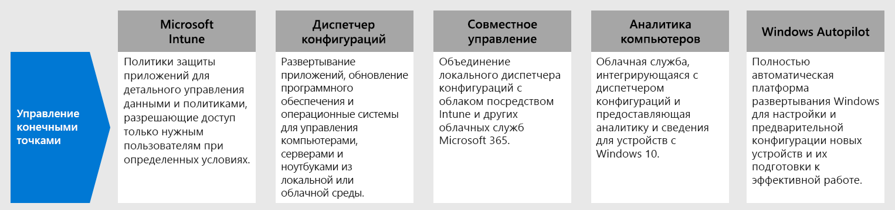
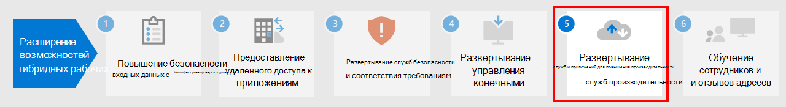

# Этап 4.Step 4. Развертывание управления конечными точками для устройств, компьютеров и других конечных точекDeploy endpoint management for your devices, PCs, and other endpoints

При наличии удаленных сотрудников вам потребуется поддерживать растущее количество личных устройств.With remote workers, you need to support a growing number of personal devices. Управление конечными точками — это основанный на политике подход к безопасности, требующий соответствия устройств определенным условиям, прежде чем им будет предоставлен доступ к ресурсам.Endpoint management is a policy-based approach to security that requires devices to comply with specific criteria before they are granted access to resources. Microsoft Endpoint Manager обеспечивает современные возможности управления для защиты ваших данных в облачной и локальной среде.Microsoft Endpoint Manager delivers modern management capabilities to keep your data secure in the cloud and on-premises. 

[Microsoft Endpoint Manager](https://docs.microsoft.com/mem/endpoint-manager-overview) предоставляет службы и инструменты для управления мобильными устройствами, компьютерами, виртуальными машинами, встроенными устройствами и серверами путем сочетания следующих служб, которые вам могут быть уже знакомы.[Microsoft Endpoint Manager](https://docs.microsoft.com/mem/endpoint-manager-overview) provides services and tools for managing mobile devices, desktop computers, virtual machines, embedded devices, and servers by combining the following services you may already know and be using.

## Microsoft IntuneMicrosoft Intune

Microsoft Intune — это облачная служба, которая включена в Microsoft 365 и предназначена для управления мобильными устройствами (MDM) и мобильными приложениями (MAM).Microsoft Intune is a cloud-based service that focuses on mobile device management (MDM) and mobile application management (MAM) that is included with Microsoft 365. 

- **MDM:** вы можете полностью контролировать устройства, принадлежащие организации, в том числе их параметры, компоненты и безопасность.**MDM:** For organization-owned devices, you can exercise full control including settings, features, and security. Устройства регистрируются в Intune, где они получают политики Intune с правилами и параметрами.Devices are "enrolled" in Intune where they receive Intune policies with rules and settings. Например, вы можете задать требования к паролю и ПИН-коду, создать VPN-подключение, настроить защиту от угроз и многое другое.For example, you can set password and PIN requirements, create a VPN connection, set up threat protection, and more.

- **MAM:** возможно, удаленные сотрудники не захотят, чтобы вы полностью контролировали их личные устройства, также известные как устройства BYOD ("принеси свое устройство").**MAM:** Remote workers might not want you to have full control on their personal devices, also known as bring-your-own device (BYOD) devices. Вы можете предоставить удаленным сотрудникам выбор и при этом защитить организацию.You can give your remote workers options and still protect your organization. Они могут зарегистрировать свои устройства, если хотят получить полный доступ к ресурсам организации.For example, remote workers can enroll their devices if they want full access to your organization resources. Если же этим пользователям нужен доступ только к электронной почте или Microsoft Teams, используйте политики защиты приложений, требующие многофакторной проверки подлинности (MFA) для использования этих приложений.Or, if these users only want access to email or Microsoft Teams, then use app protection policies that require multi-factor authentication (MFA) to use these apps.

Дополнительные сведения см. в [обзоре Microsoft Intune](https://docs.microsoft.com/intune/fundamentals/what-is-intune).For more information, see this [overview of Microsoft Intune](https://docs.microsoft.com/intune/fundamentals/what-is-intune).

## Диспетчер конфигурацийConfiguration Manager

Диспетчер конфигураций — это локальное решение для управления компьютерами, серверами и ноутбуками в вашей сети или в Интернете.Configuration Manager is an on-premises management solution to manage desktops, servers, and laptops that are on your network or internet-based. Используйте диспетчер конфигураций для развертывания приложений, обновлений программного обеспечения и операционных систем.Use Configuration Manager to deploy apps, software updates, and operating systems. Кроме того, вы можете отслеживать соответствие требованиям, запросы, применять действия в клиентах в режиме реального времени и т. д.You can also monitor compliance, query and act on clients in real time, and much more. Вы можете включить в нем поддержку облака для интеграции с Intune, Azure AD, ATP в Microsoft Defender и другими облачными службами.You can cloud-enable it to integrate with Intune, Azure AD, Microsoft Defender ATP, and other cloud services. 

Дополнительные сведения см. в [обзоре диспетчера конфигураций](https://docs.microsoft.com/mem/configmgr/core/understand/introduction).For more information, see this [overview of Configuration Manager](https://docs.microsoft.com/mem/configmgr/core/understand/introduction).

## Совместное управлениеCo-management

Совместное управление объединяет существующие вложения в локальный диспетчер конфигураций с облаком посредством Intune и других облачных служб Майкрософт 365.Co-management combines your existing on-premises Configuration Manager investment with the cloud using Intune and other Microsoft 365 cloud services. Вы можете выбрать диспетчер конфигураций или Intune в качестве центра управления для различных рабочих нагрузок.You choose whether Configuration Manager or Intune is the management authority for different workload. 

Для совместного управления используются облачные функции на основе Intune, в том числе условный доступ и обеспечение соблюдения требований к устройствам.Co-management uses Intune-based cloud features, including Conditional Access and enforcing device compliance. Некоторые задачи остаются локальными, а другие выполняются в облаке.You keep some tasks on-premises, while running other tasks in the cloud.

Дополнительные сведения см. в [обзоре совместного управления](https://docs.microsoft.com/mem/configmgr/comanage/overview).For more information, see this [overview of co-management](https://docs.microsoft.com/mem/configmgr/comanage/overview).

## Аналитика компьютеровDesktop Analytics

Аналитика компьютеров — это облачная служба, интегрирующаяся с диспетчером конфигураций и предоставляющая аналитику, чтобы вы могли принимать взвешенные решения о клиентах Windows.Desktop Analytics is a cloud-based service that integrates with Configuration Manager and provides you with insight and intelligence so you can make informed decisions about your Windows clients. В ней данные из вашей организации объединяются с данными, собранными из миллионов других устройств, подключенных к облачным службам Майкрософт.It combines data from your organization with data aggregated from millions of other devices connected to Microsoft cloud services. 

С помощью Аналитики компьютеров можно:With Desktop Analytics, you can:

- Создать опись приложений, используемых в организации.Create an inventory of apps running in your organization.
- Оценить совместимость приложений с последними обновлениями компонентов Windows 10.Assess app compatibility with the latest Windows 10 feature updates.
- Обнаружить проблемы совместимости и получить рекомендации по их устранению на основе облачной аналитики данных.Identify compatibility issues and receive mitigation suggestions based on cloud-enabled data insights.
- Создать пилотные группы, отражающие состояние приложений и драйверов на минимальном наборе устройств.Create pilot groups that represent the entire application and driver estate across a minimal set of devices.
- Развернуть Windows 10 на пилотных и рабочих устройствах.Deploy Windows 10 to pilot and production-managed devices.

Дополнительные сведения см. в [обзоре Аналитики компьютеров](https://docs.microsoft.com/mem/configmgr/desktop-analytics/overview).For more information, see this [overview of Desktop Analytics](https://docs.microsoft.com/mem/configmgr/desktop-analytics/overview)

## Windows AutopilotWindows Autopilot

В Windows Autopilot реализована автоматическая платформа для самостоятельного развертывания Windows.Windows Autopilot is a zero-touch, self-service Windows deployment platform. Она включает набор технологий, используемых вами для настройки и предварительной конфигурации новых устройств, а также подготовки их к работе.It includes a collection of technologies you use to set up and pre-configure new devices, getting them ready for productive use. Также можно использовать Windows Autopilot для сброса, перепрофилирования и восстановления устройств.You can also use Windows Autopilot to reset, repurpose and recover devices. 

Windows Autopilot позволяет ИТ-отделам предварительно настроить устройства с минимальной инфраструктурой для управления или без нее, используя простой и удобный процесс.Windows Autopilot enables an IT department to pre-configure devices with little to no infrastructure to manage, with a process that's easy and simple. 

- С точки зрения пользователя для подготовки устройства к работе достаточно нескольких простых действий.From the user's perspective, it only takes a few simple operations to make their device ready to use. 
- С точки зрения ИТ-специалиста пользователь должен лишь подключиться к сети и подтвердить свои учетные данные.From the IT pro's perspective, the only interaction required from the end user is to connect to a network and to verify their credentials.

Дополнительные сведения см. в [обзоре Windows Autopilot](https://docs.microsoft.com/windows/deployment/windows-autopilot/windows-autopilot).For more information, see this [overview of Windows Autopilot](https://docs.microsoft.com/windows/deployment/windows-autopilot/windows-autopilot).

## Технические ресурсы администраторов для управления конечными точкамиAdmin technical resources for endpoint management

- [Стратегия управления устройством в Microsoft 365Device management roadmap for Microsoft 365](../enterprise/device-management-roadmap-microsoft-365.md)
- [Способы регистрации различных типов устройств для управления мобильными устройствамиHow to enroll different types of devices for mobile device management](https://docs.microsoft.com/mem/intune/enrollment/device-enrollment)
- [Инструкции по использованию Microsoft Intune для конечных пользователейHow to educate your end users about Microsoft Intune](https://docs.microsoft.com/mem/intune/fundamentals/end-user-educate)
 
## Результаты этапа 3Results of Step 3

Вы используете набор функций и возможностей Endpoint Manager для управления мобильными устройствами, компьютерами, виртуальными машинами, встроенными устройствами и серверами.You are using the suite of Endpoint Manager features and capabilities to manage mobile devices, desktop computers, virtual machines, embedded devices, and servers.

## Следующий этапNext step

Перейдите к [этапу 5](empower-people-to-work-remotely-teams-productivity-apps.md), чтобы дать удаленным сотрудникам возможность использовать приложения Microsoft 365 для повышения производительности, такие как Microsoft Teams.Continue with [Step 5](empower-people-to-work-remotely-teams-productivity-apps.md) to get your remote workers using Microsoft 365 productivity apps such as Microsoft Teams.
