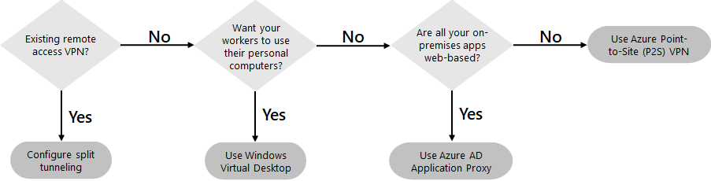
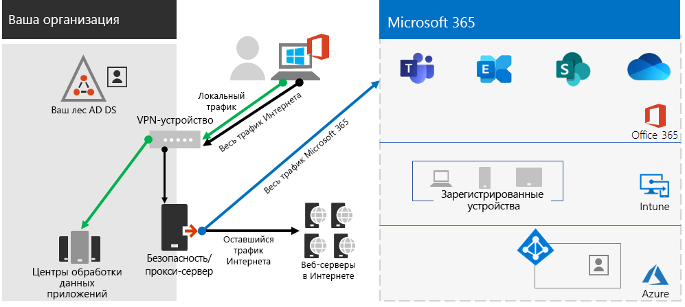
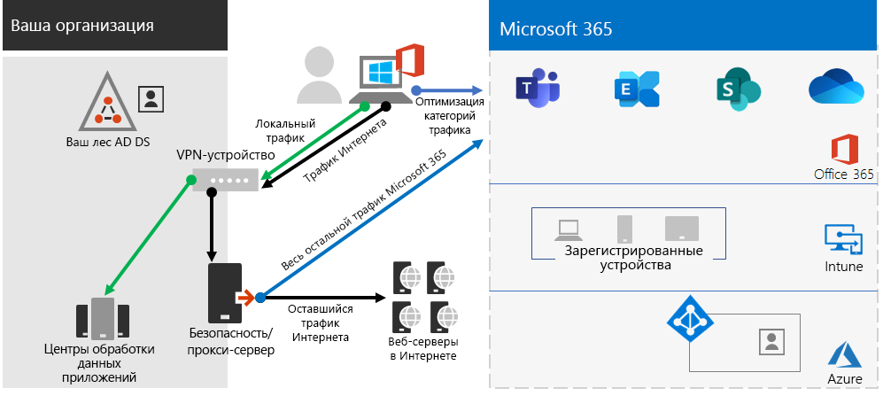
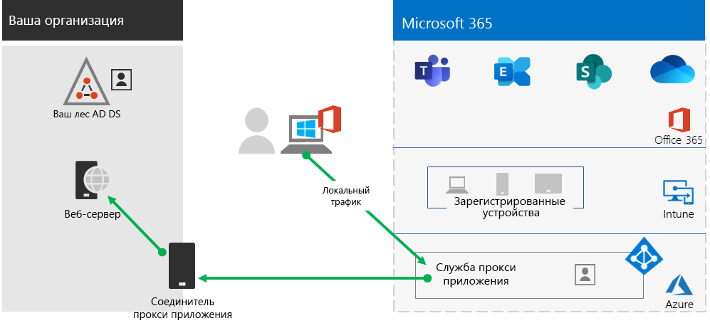
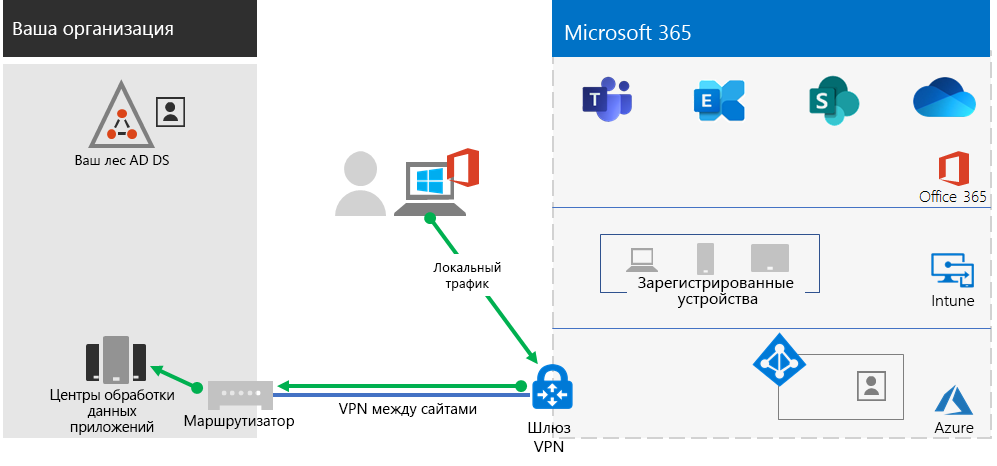
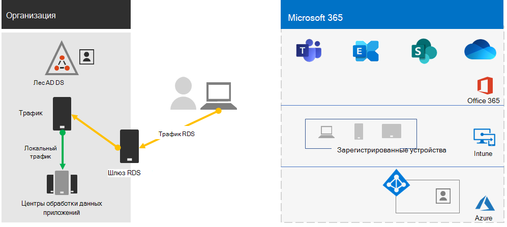

# Этап 2.Step 2. Обеспечение удаленного доступа к локальным приложениям и службамProvide remote access to on-premises apps and services

Если в вашей организации используется VPN-решение для удаленного доступа, как правило, с VPN-серверами на краю сети и VPN-клиентами, установленными на устройствах пользователей, пользователи могут использовать VPN-подключения удаленного доступа для доступа к локальным приложениям и серверам.If your organization uses a remote access VPN solution, typically with VPN servers on the edge of your network and VPN clients installed on your users' devices, your users can use remote access VPN connections to access on-premises apps and servers. Однако может потребоваться оптимизировать трафик в облачных службах Microsoft 365.But you may need to optimize traffic to Microsoft 365 cloud-based services.

Если пользователи не используют VPN-решение, вы можете предоставить доступ с помощью Azure Active Directory (Azure AD) Application Proxy или VPN-подключения типа "точка-сеть" (P2S) в Azure, в зависимости от того, все ли ваши приложения являются веб-приложениями.If your users do not use a VPN solution, you can use Azure Active Directory (Azure AD) Application Proxy and Azure Point-to-Site (P2S) VPN to provide access, depending on whether all your apps are web-based.

Ниже приведены основные конфигурации для удаленного доступа:Here are the primary configurations for remote access:

- Вы уже используете VPN-решение для удаленного доступа.You are already using a remote access VPN solution.
- Вы не используете VPN-решение для удаленного доступа и хотите, чтобы удаленные сотрудники использовали персональные компьютеры.You are not using a remote access VPN solution and you want your remote workers to use their personal computers.
- Вы не используете VPN-решение для удаленного доступа, у вас есть гибридное удостоверение, и вам необходим удаленный доступ только к локальным веб-приложениям.You are not using a remote access VPN solution, you have hybrid identity, and you need remote access only to on-premises web-based apps.
- Вы не используете VPN-решение для удаленного доступа, и вам необходим доступ к локальным приложениям, некоторые из которых не являются веб-приложениями.You are not using a remote access VPN solution and you need access to on-premises apps, some of which are not web-based.

На этой блок-схеме представлены параметры настройки удаленного доступа, рассматриваемые в этой статье.See this flowchart for the remote access configuration options discussed in this article.

При наличии подключений удаленного доступа можно также использовать [удаленный рабочий стол](https://support.microsoft.com/help/4028379/windows-10-how-to-use-remote-desktop) для подключения пользователей к локальному ПК.With remote access connections, you can also use [Remote Desktop](https://support.microsoft.com/help/4028379/windows-10-how-to-use-remote-desktop) to connect your users to an on-premises PC. Например, удаленный сотрудник может использовать удаленный рабочий стол для подключения к ПК в офисе со своего устройства Windows, iOS или Android.For example, a remote worker can use Remote Desktop to connect to the PC in their office from their Windows, iOS, or Android device. Выполнив удаленное подключение, он может пользоваться компьютером, как если бы находился перед ним.Once they are remotely connected, they can use it as if they were sitting in front of it.

## Оптимизация производительности VPN-клиентов с удаленным доступом для облачных служб Microsoft 365Optimize performance for remote access VPN clients to Microsoft 365 cloud services

Если удаленные сотрудники используют традиционный VPN-клиент для получения удаленного доступа к сети организации, убедитесь, что для VPN-клиента поддерживается раздельное туннелирование.If your remote workers are using a traditional VPN client to obtain remote access to your organization network, verify that the VPN client has split tunneling support.

Без раздельного туннелирования весь трафик для удаленной работы направляется через VPN-подключение, откуда перенаправляется на пограничные устройства организации, обрабатывается, а затем отправляется в Интернет.Without split tunneling, all of your remote work traffic gets sent across the VPN connection, where it must be forwarded to your organization’s edge devices, get processed, and then sent on the Internet.

Трафик Microsoft 365 в организации должен быть непрямым, для чего может использоваться перенаправление на точку входа в сеть Microsoft далеко от физического расположения VPN-клиента.Microsoft 365 traffic must take an indirect route through your organization, which could be the forwarded to a Microsoft network entry point far away from the VPN client’s physical location. Использование непрямого пути приводит к задержке сетевого трафика и снижению общей производительности.This indirect path adds latency to the network traffic and decreases overall performance. 

При использовании раздельного туннелирования в настройках VPN-клиента можно исключить передачу определенных типов трафика через VPN-подключение в сеть организации.With split tunneling, you can configure your VPN client to exclude specific types of traffic from being sent over the VPN connection to the organization network.

Чтобы оптимизировать доступ к облачным ресурсам Microsoft 365, в настройках VPN-клиентов с раздельным туннелированием исключите трафик через VPN-подключение к конечным точкам Microsoft 365 категории **оптимизации**.To optimize access to Microsoft 365 cloud resources, configure your split tunneling VPN clients to exclude traffic to the **Optimize** category Microsoft 365 endpoints over the VPN connection. Дополнительные сведения см. в статье [Категории конечных точек Office 365](https://docs.microsoft.com/microsoft-365/enterprise/microsoft-365-network-connectivity-principles#new-office-365-endpoint-categories).For more information, see [Office 365 endpoint categories](https://docs.microsoft.com/microsoft-365/enterprise/microsoft-365-network-connectivity-principles#new-office-365-endpoint-categories). См. [список](https://docs.microsoft.com/microsoft-365/enterprise/urls-and-ip-address-ranges) конечных точек категории оптимизации.See [this list](https://docs.microsoft.com/microsoft-365/enterprise/urls-and-ip-address-ranges) of Optimize category endpoints.

Ниже приведен полученный в результате поток трафика, в котором большая часть трафика к облачным приложениям Microsoft 365 обходит VPN-подключение.Here is the resulting traffic flow, in which most of the traffic to Microsoft 365 cloud apps bypass the VPN connection.

Эта возможность позволяет VPN-клиенту отправлять и получать необходимый трафик облачных служб Microsoft 365 непосредственно через Интернет в ближайшей точке входа в сеть Microsoft.This allows the VPN client to send and receive crucial Microsoft 365 cloud service traffic directly over the Internet and to the nearest entry point into the Microsoft network.

Дополнительные сведения и инструкции см. в статье [Оптимизация подключения Office 365 для удаленных пользователей с помощью раздельного VPN-туннелирования](https://docs.microsoft.com/microsoft-365/enterprise/microsoft-365-vpn-split-tunnel??).For more information and guidance, see [Optimize Office 365 connectivity for remote users using VPN split tunneling](https://docs.microsoft.com/microsoft-365/enterprise/microsoft-365-vpn-split-tunnel??).

## Развертывание удаленного доступа при наличии гибридного удостоверения, если все приложения являются веб-приложениямиDeploy remote access when all your apps are web apps and you have hybrid identity

Если удаленные сотрудники не используют традиционный VPN-клиент, а локальные учетные записи и группы синхронизированы с Azure AD, можно использовать Azure AD Application Proxy, чтобы предоставить безопасный удаленный доступ к веб-приложениям, размещенным на локальных серверах.If your remote workers are not using a traditional VPN client and your on-premises user accounts and groups are synchronized with Azure AD, you can use Azure AD Application Proxy to provide secure remote access for web-based applications hosted on on-premises servers. Веб-приложения включают сайты SharePoint Server, серверы Outlook Web Access и другие бизнес-приложения.Web-based applications include SharePoint Server sites, Outlook Web Access servers, or any other web-based line of business applications. 

Ниже описаны компоненты Azure AD Application Proxy.Here are the components of Azure AD Application Proxy.

Дополнительные сведения см. в [обзоре Azure AD Application Proxy](https://docs.microsoft.com/azure/active-directory/manage-apps/application-proxy).For more information, see this [overview of Azure AD Application Proxy](https://docs.microsoft.com/azure/active-directory/manage-apps/application-proxy).

>[!Note]
>Прокси приложения Azure AD не входит в подписку на Microsoft 365.Azure AD Application Proxy is not included with a Microsoft 365 subscription. Вам следует оплачивать использование с отдельной подпиской Azure.You must pay for usage with a separate Azure subscription.
>

## Развертывание удаленного доступа, если не все приложения являются веб-приложениямиDeploy remote access when not all your apps are web apps

Если удаленные сотрудники не используют традиционный VPN-клиент и у вас есть приложения, которые не являются веб-приложениями, можно использовать VPN-подключение типа "точка-сеть" (P2S) в Azure.If your remote workers are not using a traditional VPN client and you have apps that are not web-based, you can use an Azure Point-to-Site (P2S) VPN.

При использовании VPN-подключения P2S создается безопасное подключение с устройства удаленного сотрудника к сети организации через виртуальную сеть Azure.A P2S VPN connection creates a secure connection from a remote worker’s device to your organization network through an Azure virtual network. 

Дополнительные сведения см. в [обзоре VPN-подключения P2S](https://docs.microsoft.com/azure/vpn-gateway/point-to-site-about).For more information, see this [overview of P2S VPN](https://docs.microsoft.com/azure/vpn-gateway/point-to-site-about).

>[!Note]
>Azure P2S VPN не входит в подписку на Microsoft 365.Azure P2S VPN is not included with a Microsoft 365 subscription. Вам следует оплачивать использование с отдельной подпиской Azure.You must pay for usage with a separate Azure subscription.
>

## Развертывание Виртуального рабочего стола Windows для предоставления удаленного доступа удаленным сотрудникам, использующим личные устройстваDeploy Windows Virtual Desktop to provide remote access for remote workers using personal devices 

В целях поддержки удаленных сотрудников, использующих только личные и неуправляемые устройства, используйте Виртуальный рабочий стол Windows в Azure, чтобы создавать и назначать виртуальные рабочие столы пользователям для работы из дома.To support remote workers who can only use their personal and unmanaged devices, use Windows Virtual Desktop in Azure to create and allocate virtual desktops for your users to use from home. Виртуализированные ПК могут работать так же, как компьютеры, подключенные к сети организации.Virtualized PCs can act just like PCs connected to your organization network.

Дополнительные сведения см. в [обзоре Виртуального рабочего стола Windows](https://docs.microsoft.com/azure/virtual-desktop/overview).For more information, see this [overview of Windows Virtual Desktop](https://docs.microsoft.com/azure/virtual-desktop/overview). 

>[!Note]
>Виртуальный рабочий стол Windows не входит в подписку на Microsoft 365.Windows Virtual Desktop is not included with a Microsoft 365 subscription. Вам следует оплачивать использование с отдельной подпиской Azure.You must pay for usage with a separate Azure subscription.
>

## Защитите подключения к службам удаленных рабочих столов с помощью шлюза служб удаленных рабочих столовProtect your Remote Desktop Services connections with the Remote Desktop Services Gateway

Если вы используете службы удаленных рабочих столов (RDS), чтобы разрешить сотрудникам подключаться к компьютерам под управлением Windows в локальной сети, используйте шлюз служб удаленных рабочих столов (Майкрософт) в сети периметра.If you are using Remote Desktop Services (RDS) to allow employees to connect into Windows-based computers on your on-premises network, you should use a Microsoft Remote Desktop Services gateway in your edge network. Шлюз использует протокол SSL для шифрования сообщений и предотвращает непосредственное подключение локального компьютера, на котором размещены службы RDS, к Интернету.The gateway uses Secure Sockets Layer (SSL) to encrypt communications and prevents the on-premises computer hosting RDS from being directly exposed to the Internet.

Дополнительные сведения см. в [этой статье](https://www.microsoft.com/security/blog/2020/04/16/security-guidance-remote-desktop-adoption/).See [this article](https://www.microsoft.com/security/blog/2020/04/16/security-guidance-remote-desktop-adoption/) for more information.

## Технические ресурсы администраторов для предоставления удаленного доступаAdmin technical resources for remote access

- [Быстрая оптимизация трафика Office 365 для удаленных сотрудников и снижение нагрузки на инфраструктуру](https://techcommunity.microsoft.com/t5/office-365-blog/how-to-quickly-optimize-office-365-traffic-for-remote-staff-amp/ba-p/1214571).[How to quickly optimize Office 365 traffic for remote staff & reduce the load on your infrastructure](https://techcommunity.microsoft.com/t5/office-365-blog/how-to-quickly-optimize-office-365-traffic-for-remote-staff-amp/ba-p/1214571)
- [Оптимизация подключения Office 365 для удаленных пользователей с использованием раздельного VPN-туннелированияOptimize Office 365 connectivity for remote users using VPN split tunneling](https://docs.microsoft.com/microsoft-365/enterprise/microsoft-365-vpn-split-tunnel?)

## Результаты этапа 2Results of Step 2

После развертывания решения для удаленного доступа для удаленных сотрудников:After deployment of a remote access solution for your remote workers:

| Конфигурация удаленного доступаRemote access configuration | РезультатыResults |
|:-------|:-----|
| Используется VPN-решение для удаленного доступаA remote access VPN solution is in place | Для VPN-клиента с удаленным доступом настроено раздельное туннелирование и конечные точки Microsoft 365 категории оптимизации.You have configured your remote access VPN client for split tunneling and for the Optimize category of Microsoft 365 endpoints. |
| VPN-решение для удаленного доступа не используется, необходим только удаленный доступ к локальным веб-приложениямNo remote access VPN solution and you need remote access only to on-premises web-based apps | Настроена функция Azure Application Proxy.You have configured Azure Application Proxy. |
| VPN-решение для удаленного доступа не используется, необходим доступ к локальным приложениям, некоторые из которых не являются веб-приложениямиNo remote access VPN solution and you need access to on-premises apps, some of which are not web-based | Настроено VPN-подключение P2S в Azure.You have configured Azure P2S VPN. |
| Удаленные сотрудники используют личные устройства из домаRemote workers are using their personal devices from home | Настроен Виртуальный рабочий стол Windows.You have configured Windows Virtual Desktop. |
| Удаленные работники используют подключения RDS к локальным системам.Remote workers are using RDS connections to on-premises systems | Вы развернули шлюз служб удаленных рабочих столов в сети периметра.You have deployed a Remote Desktop Services gateway in your edge network. |
|||

## Следующий этапNext step

Перейдите к [Этапу 3](empower-people-to-work-remotely-security-compliance.md), чтобы развернуть службы безопасности и соответствия требованиям Microsoft 365 для защиты приложений, данных и устройств.Continue with [Step 3](empower-people-to-work-remotely-security-compliance.md) to deploy Microsoft 365 security and compliance services to protect your apps, data, and devices.

