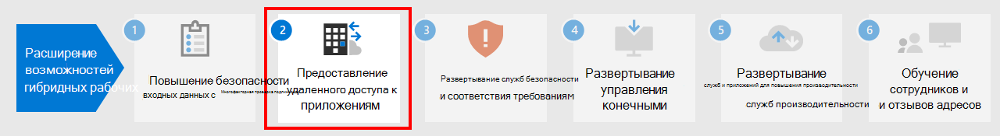

# Этап 1.Step 1. Повышение безопасности входа для удаленных сотрудников с помощью MFAIncrease sign-in security for remote workers with MFA

Чтобы повысить безопасность входа удаленных сотрудников, используйте многофакторную проверку подлинности (MFA).To increase the security of sign-ins of your remote workers, use multi-factor authentication (MFA). В MFA для входа в систему кроме пароля учетной записи пользователя необходимо использовать дополнительные проверки.MFA requires that user sign-ins be subject to an additional verification beyond the user account password. Даже если злонамеренный пользователь определит пароль учетной записи пользователя, до получения доступа он должен пройти дополнительные проверки, например ответить на текстовые сообщения, отправленные на смартфон.Even if a malicious user determines a user account password, they must also be able to respond to an additional verification, such as a text message sent to a smartphone before access is granted.

Для всех пользователей, в том числе для удаленных сотрудников и особенно для администраторов, корпорация Майкрософт настоятельно рекомендует использование MFA.For all users, including remote workers and especially admins, Microsoft strongly recommends MFA.

Обеспечить применение пользователями MFA на основе плана Microsoft 365 можно тремя способами.There are three ways to require your users to use MFA based on your Microsoft 365 plan.

|ПланPlan  |РекомендацияRecommendation  |
|---------|---------|
|Все планы Microsoft 365 (без лицензий Azure AD Premium P1 или P2)All Microsoft 365 plans (without Azure AD Premium P1 or P2 licenses)     |[Включите параметры безопасности, по умолчанию заданные в Azure AD](https://docs.microsoft.com/azure/active-directory/fundamentals/concept-fundamentals-security-defaults).[Enable Security defaults in Azure AD](https://docs.microsoft.com/azure/active-directory/fundamentals/concept-fundamentals-security-defaults). По умолчанию в параметры безопасности Azure AD входит MFA для пользователей и администраторов.Security defaults in Azure AD include MFA for users and administrators.   |
|Microsoft 365 E3 (включает лицензии Azure AD Premium P1)Microsoft 365 E3 (includes Azure AD Premium P1 licenses)     | Используйте [Общие политики условного доступа](https://docs.microsoft.com/azure/active-directory/conditional-access/concept-conditional-access-policy-common) для настройки указанных ниже политик.Use [Common Conditional Access policies](https://docs.microsoft.com/azure/active-directory/conditional-access/concept-conditional-access-policy-common) to configure the following policies:  - [Обязательное использование MFA для администраторов](https://docs.microsoft.com/azure/active-directory/conditional-access/howto-conditional-access-policy-admin-mfa)- [Require MFA for administrators](https://docs.microsoft.com/azure/active-directory/conditional-access/howto-conditional-access-policy-admin-mfa)  - [Обязательное использование MFA для всех пользователей](https://docs.microsoft.com/azure/active-directory/conditional-access/howto-conditional-access-policy-all-users-mfa)- [Require MFA for all users](https://docs.microsoft.com/azure/active-directory/conditional-access/howto-conditional-access-policy-all-users-mfa)   - [Блокирование традиционной проверки подлинности](https://docs.microsoft.com/azure/active-directory/conditional-access/howto-conditional-access-policy-block-legacy)- [Block legacy authentication](https://docs.microsoft.com/azure/active-directory/conditional-access/howto-conditional-access-policy-block-legacy)       |
|Microsoft 365 E5 (включает лицензии Azure AD Premium P2)Microsoft 365 E5 (includes Azure AD Premium P2 licenses)     | Пользуйтесь преимуществами защиты идентификации Azure AD, начните применять [рекомендуемый набор политики условного доступа и связанных с ней политик](../security/office-365-security/identity-access-policies.md) (Майкрософт), создав две следующие политики.Taking advantage of Azure AD Identity Protection, begin to implement Microsoft's [recommended set of Conditional Access and related policies](../security/office-365-security/identity-access-policies.md) by creating these two policies:  - [Обязательное использование MFA при среднем или высоком риске входа в систему](../security/office-365-security/identity-access-policies.md#require-mfa-based-on-sign-in-risk)- [Require MFA when sign-in risk is medium or high](../security/office-365-security/identity-access-policies.md#require-mfa-based-on-sign-in-risk)  - [Блокирование клиентов, не поддерживающих современную проверку подлинности](../security/office-365-security/identity-access-policies.md#block-clients-that-dont-support-modern-authentication)- [Block clients that don't support modern authentication](../security/office-365-security/identity-access-policies.md#block-clients-that-dont-support-modern-authentication) - [Необходимость смены пароля для пользователей с высоким риском](../security/office-365-security/identity-access-policies.md#high-risk-users-must-change-password)- [High risk users must change password](../security/office-365-security/identity-access-policies.md#high-risk-users-must-change-password)       |
| | |

## Параметры безопасности по умолчаниюSecurity defaults

Параметры безопасности по умолчанию — новая функция в платных и пробных подписках Microsoft 365 и Office 365, появившаяся после 21 октября 2019 г.Security defaults is a new feature for Microsoft 365 and Office 365 paid or trial subscriptions created after October 21, 2019. В этих подписках включены параметры безопасности по умолчанию, что ***обязывает всех пользователей применять MFA в приложении Microsoft Authenticator***.These subscriptions have security defaults turned on, which ***requires all of your users to use MFA with the Microsoft Authenticator app***.
 
На регистрацию MFA в приложении Microsoft Authenticator с помощью смартфонов у пользователей есть 14 дней с момента первого входа в систему после включения параметров безопасности по умолчанию.Users have 14 days to register for MFA with the Microsoft Authenticator app from their smart phones, which begins from the first time they sign in after security defaults has been enabled. По истечении 14 дней пользователь не сможет войти в систему до завершения регистрации MFA.After 14 days have passed, the user won't be able to sign in until MFA registration is completed.

Применение параметров безопасности по умолчанию гарантирует, что все организации имеют базовый уровень безопасности при входе пользователей в систему, включенный по умолчанию.Security defaults ensure that all organizations have a basic level of security for user sign-in that is enabled by default. Вы можете отключить параметры безопасности по умолчанию, если предпочитаете использовать MFA с условным доступом или для отдельных учетных записей.You can disable security defaults in favor of MFA with Conditional Access policies or for individual accounts.

Дополнительные сведения см. в статье [Обзор параметров безопасности, заданных по умолчанию](https://docs.microsoft.com/azure/active-directory/fundamentals/concept-fundamentals-security-defaults).For more information, see this [overview of security defaults](https://docs.microsoft.com/azure/active-directory/fundamentals/concept-fundamentals-security-defaults).

## Политики условного доступаConditional Access policies

Политики условного доступа — это набор правил, определяющих условия, в соответствии с которым оценивается и разрешается вход в систему.Conditional Access policies are a set of rules that specify the conditions under which sign-ins are evaluated and allowed. Например, вы можете создать политику условного доступа, которая устанавливает указанные ниже условия.For example, you can create a Conditional Access policy that states:

- Если имя учетной записи пользователя является членом группы для пользователей, которым назначены роли Exchange, пользователь, пароль, безопасность, SharePoint или глобальный администратор, требуется MFA, прежде чем разрешить доступ.If the user account name is a member of a group for users that are assigned the Exchange, user, password, security, SharePoint, or global administrator roles, require MFA before allowing access.

Эта политика позволяет вам требовать MFA на основе членства в группах, а не пытаться настроить отдельные учетные записи пользователей для MFA, когда они назначены или не назначены из этих ролей администратора.This policy allows you to require MFA based on group membership, rather than trying to configure individual user accounts for MFA when they are assigned or unassigned from these administrator roles.

Кроме того, вы можете использовать политики условного доступа для более сложных функций, таких как требование выполнения входа с определенного устройства, например ноутбука с Windows 10.You can also use Conditional Access policies for more advanced capabilities, such as requiring that the sign-in is done from a compliant device, such as your laptop running Windows 10.

Для использования условного доступа требуется наличие лицензий Azure AD Premium P1, входящих в состав Microsoft 365 E3 и E5.Conditional Access requires Azure AD Premium P1 licenses, which are included with Microsoft 365 E3 and E5.

Дополнительные сведения см. в статье [Обзор условного доступа](https://docs.microsoft.com/azure/active-directory/conditional-access/overview).For more information, see this [overview of Conditional Access](https://docs.microsoft.com/azure/active-directory/conditional-access/overview).

## Поддержка Azure AD Identity ProtectionAzure AD Identity Protection support

С помощью Azure AD Identity Protection вы можете создать дополнительную политику условного доступа, которая гласит:With Azure AD Identity Protection, you can create an additional Conditional Access policy that states:

- Если риск входа в систему определяется как средний или высокий, требуется MFA.If the risk of the sign-in is determined to be medium or high, require MFA.

Для использования защиты идентификации Azure AD требуется наличие лицензий Azure AD Premium P2, входящих в состав Microsoft 365 E5.Azure AD Identity Protection requires Azure AD Premium P2 licenses, which are included with Microsoft 365 E5.

Для получения дополнительной информации см. [Условный доступ на основе риска](https://docs.microsoft.com/azure/active-directory/conditional-access/howto-conditional-access-policy-risk#require-mfa-medium-or-high-sign-in-risk-users).For more information, see [Risk-based Conditional Access](https://docs.microsoft.com/azure/active-directory/conditional-access/howto-conditional-access-policy-risk#require-mfa-medium-or-high-sign-in-risk-users).

## Совместное использование этих методовUsing these methods together

Учитывайте следующее:Keep the following in mind:

- Если для вас включены политики условного доступа, вы не можете включить параметры безопасности по умолчанию.You cannot enable security defaults if you have any Conditional Access policies enabled.
- Если для вас включены параметры безопасности по умолчанию, вы не можете включить никакие политики условного доступа.You cannot enable any Conditional Access policies if you have security defaults enabled.

Если включены параметры безопасности по умолчанию, всем новым пользователям будет предложено пройти регистрацию в MFA и использовать приложение Microsoft Authenticator.If security defaults are enabled, all new users are prompted for MFA registration and the use of the Microsoft Authenticator app. 

В этой таблице показаны результаты включения MFA с параметрами безопасности по умолчанию и политиками условного доступа.This table shows the results of enabling MFA with security defaults and Conditional Access policies.

| МетодMethod | ВключеноEnabled | ОтключеноDisabled | Дополнительный метод аутентификацииAdditional authentication method |
|:-------|:-----|:-------|:-------|
| **Параметры безопасности по умолчанию****Security defaults**  | Невозможно использовать политики условного доступаCan’t use Conditional Access policies | Возможно использование политик условного доступаCan use Conditional Access policies | Приложение Microsoft AuthenticatorMicrosoft Authenticator app |
| **Политики условного доступа****Conditional Access policies** | Если включена хотя бы одна из них, то включение параметров безопасности по умолчанию невозможноIf any are enabled, you can’t enable security defaults | Если все отключены, вы можете включить настройки безопасности по умолчаниюIf all are disabled, you can enable security defaults  | Пользователь указывает при регистрации MFAUser specifies during MFA registration  |
||||

## Предоставление пользователям прав на самостоятельный сброс пароляLet your users reset their own passwords

Самостоятельный сброс пароля (SSPR) позволяет пользователям сбрасывать собственные пароли, не обращаясь к ИТ-персоналу.Self-Service Password Reset (SSPR) enables users to reset their own passwords without impacting IT staff. Пользователи могут быстро сбрасывать свои пароли в любое время и в любом месте.Users can quickly reset their passwords at any time and from any place. Посмотрите [это видео](https://go.microsoft.com/fwlink/?linkid=2128524), чтобы настроить SSPR.Watch [this video](https://go.microsoft.com/fwlink/?linkid=2128524) to set up SSPR.

## Вход в приложения SaaS с помощью Azure ADSign in to SaaS apps with Azure AD

Кроме того, чтобы обеспечить облачную проверку подлинности для пользователей, Azure AD также можно использовать в качестве централизованного способа защиты всех приложений: локальных, в облаке Майкрософт или в другом облаке.In addition to providing cloud authentication for users, Azure AD can also be your central way to secure all your apps, whether they’re on-premises, in Microsoft’s cloud, or in another cloud. С помощью [интеграции приложений в Azure AD](https://docs.microsoft.com/azure/active-directory/manage-apps/plan-an-application-integration) вы можете упростить для удаленных сотрудников поиск нужных приложений и безопасный вход в них.By [integrating your apps into Azure AD](https://docs.microsoft.com/azure/active-directory/manage-apps/plan-an-application-integration), you can make it easy for remote workers to discover the applications they need and sign into them securely.

## Технические ресурсы для администраторов по MFA и удостоверениямAdmin technical resources for MFA and identity

- [MFA для Microsoft 365MFA for Microsoft 365](https://docs.microsoft.com/microsoft-365/admin/security-and-compliance/multi-factor-authentication-microsoft-365)
- [5 основных способов использования Azure AD в организации удаленной работыTop 5 ways your Azure AD can help you enable remote work](https://techcommunity.microsoft.com/t5/azure-active-directory-identity/top-5-ways-your-azure-ad-can-help-you-enable-remote-work/ba-p/1144691)
- [Стратегия удостоверений для Microsoft 365Identity roadmap for Microsoft 365](../enterprise/identity-roadmap-microsoft-365.md)
- [Учебные видеоматериалы по Azure AD академии AzureAzure Academy Azure AD training videos](https://www.youtube.com/watch?v=pN8o0owHfI0&list=PL-V4YVm6AmwUFpC3rXr2i2piRQ708q_ia)
- [Настройте политику регистрации многофакторной проверки подлинности AzureConfigure the Azure Multi-Factor Authentication registration policy](https://docs.microsoft.com/azure/active-directory/identity-protection/howto-identity-protection-configure-mfa-policy)
- [Планирование развертывания самостоятельного сброса пароля в Azure ADPlan an Azure AD self-service password reset deployment](https://docs.microsoft.com/azure/active-directory/authentication/howto-sspr-deployment)

## Результаты этапа 1Results of Step 1

После развертывания MFA пользователи:After deployment of MFA, your users:

- должны использовать MFA для входа в систему.Are required to use MFA for sign-ins.
- должны завершить процесс регистрации в MFA и использовать MFA для всех операций входа.Have completed the MFA registration process and are using MFA for all sign-ins.
- могут использовать SSPR для сброса своих паролей.Can use SSPR to reset their own passwords.

## Следующий этапNext step

Перейдите к [этапу 2](empower-people-to-work-remotely-remote-access.md), чтобы обеспечить удаленный доступ к локальным приложениям и службам.Continue with [Step 2](empower-people-to-work-remotely-remote-access.md) to provide remote access to on-premises apps and services.
