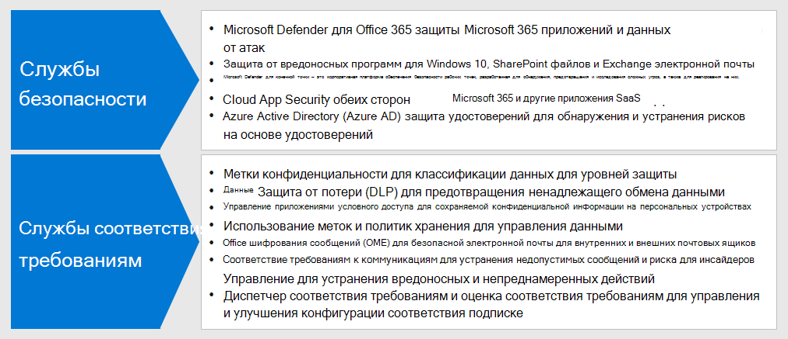

# Шаг 3. Развертывание служб безопасности и соответствия требованиям для сотрудников, работающих удаленноStep 3: Deploy security and compliance for remote workers

Обеспечение безопасности и соответствия требованиям является важной частью общего решения для сотрудников, работающих удаленно, среди которых есть сотрудники, никогда не бывающие в офисе или бывающие там редко.For remote workers, some of whom never go into the office or who go infrequently, security and compliance are an important part of the overall solution. Все взаимодействие с ними осуществляется через Интернет, не будучи ограниченным внутренней сетью организации.All of their communications occur over the Internet instead of being confined to an organizational intranet. 

Для вас и ваших сотрудников существуют способы поддержания эффективности работы при снижении риска в области информационной безопасности и сохранении соответствия внутренним политикам и нормативным требованиям в отношении данных.There are things you and your workers can do to remain productive while decreasing cybersecurity risk and maintaining compliance with your internal policies and data regulations.

Для удаленной работы необходимы следующие элементы системы безопасности и соответствия требованиям.Remote work needs these elements of security and compliance:

- Управляемый доступ к приложениям для эффективной работы, используемые сотрудниками, работающими удаленно, например Microsoft TeamsControlled access to the productivity apps that remote workers use, such as Microsoft Teams 
- Управляемый доступ к данным, которые создаются и используются сотрудниками, работающими удаленно, например беседы в чатах и общие файлы, и защита этих данныхControlled access to and protection of the data that remote workers create and use, such as chat conversations or shared files
- Защита устройств с Windows 10 от вредоносных программ и других типов кибератакProtection of Windows 10 devices from malware and other types of cyberattacks
- Защита электронной почты, файлов и сайтов путем последовательного присвоения меток различных уровней конфиденциальности и защитыProtection of email, files, and site with consistent labeling for levels of sensitivity and protection
- Защита от утечки данныхPrevention of leaked information
- Соблюдение региональных нормативных требований в отношении данныхAdherence to regional data regulations

## БезопасностьSecurity

Защитите свои приложения и данные с помощью этих функций безопасности Microsoft 365.Protect your applications and data with these security features of Microsoft 365.

| Возможность или функцияCapability or feature | ОписаниеDescription | ЛицензированиеLicensing |
|:-------|:-----|:-------|
| Office 365 Advanced Threat Protection (ATP)Office 365 Advanced Threat Protection (ATP) | Защитите от атак свои приложения и данные в Microsoft 365, такие как сообщения электронной почты, документы Office и средства совместной работы.Protect your Microsoft 365 apps and data—such as email messages, Office documents, and collaboration tools—from attack.    Office ATP собирает и анализирует сигналы от ваших приложений для обнаружения, исследования и устранения рисков для безопасности, а также защищает организацию от угроз, связанных с сообщениями электронной почты, ссылками (URL-адресами) и средствами совместной работы.Office ATP collects and analyzes signals from your apps for detection, investigation, and remediation of security risks and safeguards your organization against malicious threats posed by email messages, links (URLs), and collaboration tools. | Microsoft 365 E3 и E5Microsoft 365 E3 and E5 | 
| Защита от вредоносного программного обеспеченияMalware protection | ‎Программа Antivirus and Device Guard Защитника Windows обеспечивает защиту от вредоносного программного обеспечения на уровне устройства.‎Windows Defender Antivirus and Device Guard provides device-based malware protection.    В SharePoint‎ Online отправляемые файлы автоматически проверяются на наличие известных вредоносных программ.SharePoint‎ Online automatically scans file uploads for known malware. ‎‎   Служба Exchange Online Protection‎ (‎EOP‎) защищает облачные почтовые ящики.Exchange Online Protection‎ (‎EOP‎) secures cloud mailboxes. | Microsoft 365 E3 и E5Microsoft 365 E3 and E5 |
| ATP в Microsoft DefenderMicrosoft Defender ATP | Защитите устройства своей организации от кибератак и нарушений безопасности данных. Выявляйте и исследуйте сложные угрозы и реагируйте на них.Protect your organization’s devices from cyberthreats and data breaches and detect, investigate, and respond to advanced threats. | Microsoft 365 E5Microsoft 365 E5 |
| Безопасность облачных приложенийCloud App Security | Обеспечьте защиту от атак для таких облачных служб, как Microsoft 365 и другие приложения SaaSProtect your cloud-based services—both Microsoft 365 and other SaaS apps— from attack. | Microsoft 365 E5 и индивидуальные лицензии на обеспечение безопасности облачных приложенийMicrosoft 365 E5 or individual Cloud App Security licenses |
| Защита идентификации Azure ADAzure AD Identity Protection  | Автоматизация обнаружения и устранения рисков, связанных с идентификацией.Automate detection and remediation of identity-based risks.   Создание политик условного доступа на основе оценки риска для включения многофакторной проверки подлинности (MFA) при выполнении рискованных входов.Create risk-based Conditional Access policies to require multi-factor authentication (MFA) for risky sign-ins. | Microsoft 365 E5 или E3 с лицензиями Azure AD Premium P2Microsoft 365 E5 or E3 with Azure AD Premium P2 licenses |
||||

Дополнительные сведения см. в статье [Быстрые задачи для обеспечения соответствия требованиям в Microsoft 365](../compliance/compliance-quick-tasks.md).See [Quick tasks for getting started with Microsoft 365 compliance](../compliance/compliance-quick-tasks.md) for more information.

## Соответствие требованиямCompliance

Соблюдение внутренних политик и нормативных требований с помощью функций обеспечения соответствия требованиям Microsoft 365.Comply with internal policies or regulatory requirements with these compliance features of Microsoft 365.

| Возможность или функцияCapability or feature | ОписаниеDescription | ЛицензированиеLicensing |
|:-------|:-----|:-------|
| Метки конфиденциальностиSensitivity labels | Классифицируйте и защищайте данные своей организации путем присвоения меток различных уровней защиты сообщениям электронной почты, файлам и сайтам, не вызывая снижения эффективности работы пользователей и не ограничивая возможностей их совместной работы.Classify and protect your organization's data without hindering the productivity of users and their ability to collaborate by placing labels with various levels of protection on email, files, or sites. | Microsoft 365 E3 и E5Microsoft 365 E3 and E5 |
| Защита от потери данных (DLP)Data Loss Protection (DLP) | Выявляйте, создавайте предупреждения и блокируйте рискованное, ненамеренное или нежелательное предоставление общего доступа (внутри и вне организации) к ресурсам, например к информации, содержащей персональные данные.Detect, warn, and block risky, inadvertent, or inappropriate sharing, such as sharing of data containing personal information, both internally and externally. | Microsoft 365 E3 и E5Microsoft 365 E3 and E5 | 
| Элемент управления условным доступом приложенийConditional Access App Control | Воспрепятствуйте скачиванию конфиденциальных данных на персональные устройства пользователей.Prevent sensitive data from being downloaded to users' personal devices. | Microsoft 365 E3 и E5Microsoft 365 E3 and E5 |
| Метки и политики хранения данныхData retention labels and policies | Воспользуйтесь такими элементами управления информацией, как параметр продолжительности хранения данных и требования к хранению персональных данных о клиентах, для соблюдения политик организации и нормативных требований в отношении данных.Implement information governance controls, such as how long to keep data and requirements on the storage of personal data on customers, to comply with your organization's policies or data regulations. | Microsoft 365 E3 и E5Microsoft 365 E3 and E5 |
| Шифрование сообщений Office (OME)Office message encryption (OME) | Воспользуйтесь возможностью отправки и получения пользователями в организации и за ее пределами зашифрованных сообщений электронной почты, содержащих данные, на которые распространяется действие нормативных положений, например персональные данные клиентов.Send and receive encrypted email messages between people inside and outside your organization that contains regulated data, such as personal data on customers. | Microsoft 365 E3 и E5Microsoft 365 E3 and E5 |
| Диспетчер соответствия требованиямCompliance Manager | Управляйте относящимися к облачным службам Майкрософт действиями по исполнению нормативных требований с помощью этого средства оценки риска на основе рабочих процессов, размещенного на Microsoft Service Trust Portal.Manage regulatory compliance activities related to Microsoft cloud services with this workflow-based risk assessment tool in the Microsoft Service Trust Portal. | Microsoft 365 E3 и E5Microsoft 365 E3 and E5 |
| Рейтинг соответствия требованиям (предварительная версия)Compliance Score (preview) | Ознакомьтесь с общей оценкой вашей текущей конфигурации соответствия требованиям и с рекомендациями по ее улучшению в центре соответствия требованиям Microsoft 365.See an overall score of your current compliance configuration and recommendations for improving it in the Microsoft 365 Compliance Center. | Microsoft 365 E3 и E5Microsoft 365 E3 and E5 |
||||

Дополнительные сведения см. в статье [Основные 12 задач для отделов обеспечения безопасности при поддержке работы из дома](../security/top-security-tasks-for-remote-work.md).See [Top 12 tasks for security teams to support working from home](../security/top-security-tasks-for-remote-work.md) for more information.

## Результаты шага 3Results of Step 3

Внедрены следующие возможности для сотрудников, работающих удаленно.For your remote workers, you have implemented:

- БезопасностьSecurity:
  - Управляемый доступ к приложениям и данным, которые используются сотрудниками, работающими удаленно, для коммуникации и совместной работы.Controlled access to apps and data that remote workers use to communicate and collaborate
  - Защита от вредоносного программного обеспечения в облачных службах для данных, электронной почты и устройств с Windows 10Malware protection for cloud service data, email, and Windows 10 devices 
- Соответствие требованиямCompliance:
  - Последовательное применение меток различных уровней конфиденциальности и защитыConsistent labeling for levels of sensitivity and protection
  - Политики предотвращения утечки информацииPolicies to prevention information leakage
  - Соблюдение региональных нормативных требований в отношении данныхAdherence to regional data regulations

## Следующий шагNext step

Для управления вашими устройствами, компьютерами и другими конечными точками перейдите к [шагу 4](empower-people-to-work-remotely-manage-endpoints.md).Continue with [Step 4](empower-people-to-work-remotely-manage-endpoints.md) to manage your devices, PCs, and other endpoints.
