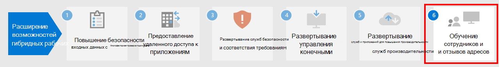

# Этап 5. Развертывание служб и приложений для повышения производительности удаленных сотрудников

Для эффективной работы людям требуется общаться и взаимодействовать друг с другом. Им нужно проводить собрания, общаться в голосовых и текстовых чатах, создавать новые материалы и делиться данными и файлами, обмениваться письмами, а также управлять календарем и задачами. Microsoft 365 предоставляет облачные службы для всех этих основных функций:

| ИТ-функция | Компоненты Microsoft 365 | Описание |
|:-------|:-----|:-------|
| Службы электронной почты | Exchange Online | Почтовая переписка и управление календарями, контактами и задачами с клиента Outlook. |
| Общение в чате организации, компьютерная телефония (VOIP) и совместная работа на основе команд | Microsoft Teams | Обеспечивайте взаимодействие людей при удаленной работе с помощью единого центра коммуникации для собраний, чатов и хранения файлов для организации, отделов, небольших команд и отдельных пользователей. |
| Сайты интрасети, совместная работа над документами | SharePoint и OneDrive | Храните файлы и совместно работайте над ними в веб-браузере или в Teams. |
| Классические и мобильные приложения Office | Приложения Microsoft 365 | Создавайте контент или совместно работайте над существующим контентом, используя версии Word, PowerPoint, Excel и Outlook, установленные на локальном компьютере и получающие текущие обновления компонентов и системы безопасности. |
||||

## Взаимодействие людей в Microsoft Teams

Приложение Teams позволяет общаться в чате, проводить собрания, звонить и совместно работать в одном месте. Миллионы людей ежедневно выполняют задачи в Teams, так как в этом центре командной работы объединено все необходимое для удаленной работы. 

Подробные инструкции см. в разделе [Поддержка удаленных сотрудников с помощью Microsoft Teams](/microsoftteams/support-remote-work-with-teams). 

Инструкции и демонстрации по использованию Teams для удаленной работы см. в [веб-трансляциях по поддержке гибридной работы с помощью Microsoft Teams](https://resources.techcommunity.microsoft.com/enabling-hybrid-work/).

### Чаты и беседы

Чат и цепочки бесед — это основа Teams с поддержкой личных чатов и групповых бесед. Удаленные сотрудники могут обмениваться информацией, мнениями и идеями, используя GIF, стикеры и эмодзи в групповых чатах или личных сообщениях.

### Собрания и конференции 

Teams помогает поддерживать коммуникации и обмен информацией с удаленными сотрудниками. В этом особенно помогают собрания, поддерживающие до 250 пользователей. Собрания Teams позволяют проводить интерактивные собрания с пользователями внутри и за пределами организации. Удаленные сотрудники могут использовать собрания Teams для повседневных задач, включая повторяющиеся проверки контрольных точек проекта, обсуждение новостей с коллегами, сеансы мозгового штурма и общение с клиентами. 

### Звонки

Teams поддерживает прямые звонки VoIP между пользователями и даже с другими организациями с помощью федерации. В них используются те же кодеки, что и для собраний, и они обеспечивают отличную голосовую связь по всему миру без дополнительных затрат на ТСОП. Однако некоторым пользователям могут потребоваться специальные номера телефонов для совершения внешних звонков при удаленной работе. Teams позволяет быстро предоставить облачную телефонную службу для этих пользователей, чтобы они могли совершать и принимать телефонные звонки.

### Приложения и рабочие процессы

Teams предоставляет платформу для приложений и рабочих процессов, доступных из классических, мобильных и веб-версий Teams. В Teams есть сотни приложений, опубликованных Майкрософт и сторонними разработчиками, для вовлечения пользователей, поддержки производительности и интеграции часто используемых бизнес-служб в Teams. Пользователи и администраторы также могут создавать настраиваемые приложения и автоматизированные рабочие процессы для Teams, используя средства разработки с минимальным написанием кода Power Apps и Power Automate.

Приложения и рабочие процессы позволяют удаленным сотрудникам повышать производительность в Teams путем сбора и предоставления важной информации, автоматизации повторяющихся задач и общения с интерактивным ботом. Закрепление приложений в канале или на панели приложений Teams — это отличный способ упрощения доступа к приложениям в соответствующем месте. Администраторы могут закреплять приложения в целях информирования и внедрения приложений, которые должны применять все пользователи.

## Почтовая переписка и управление календарями, контактами и задачами с помощью Exchange Online и Outlook

В Outlook удаленные сотрудники могут в одном месте поддерживать связь и наводить порядок с помощью писем, календарей, контактов, задач и т. д. Приложение Outlook помогает отслеживать и определять приоритеты дня на основе важных задач. Outlook позволяет делиться вложениями прямо из OneDrive, планировать собрания Teams и присоединяться к ним, просматривать календари и делиться ими, а также предоставлять разрешения делегата другим пользователям. Если удаленные сотрудники в курсе предстоящих рабочих и личных обязательств, требующих внимания, это поможет им сосредоточиться на самых важных задачах. Outlook позволяет удаленным сотрудникам управлять своим временем и легко находить нужное, включая файлы, людей в организации и т. д. 

Ознакомьтесь с [этой статьей](../security/office-365-security/secure-email-recommended-policies.md), чтобы узнать о рекомендуемых политиках доступа для удостоверений и устройств, предназначенных для защиты электронной почты и почтовых клиентов организации, поддерживающих современную проверку подлинности и условный доступ.

## Хранение и совместное использование файлов с помощью SharePoint и OneDrive

При совместной работе над контентом удаленные сотрудники могут использовать папки SharePoint и OneDrive как центральное расположение в облаке для хранения и совместного использования файлов, совместного редактирования, общения и взаимодействия. Удаленные сотрудники могут безопасно работать из любого места с помощью браузера, Teams и приложений Office.

Вам может потребоваться перенести документы в SharePoint или OneDrive из:

- [сайтов групп SharePoint Server](/sharepointmigration/sp-teams-sites-migration-guide);
- [личных сайтов](/sharepointmigration/mysites-to-onedrive-migration-guide);
- [общих папок](/sharepointmigration/fileshare-to-odsp-migration-guide);
- [Box](/sharepointmigration/box-to-onedrive-and-sharepoint-migration-guide).

Рекомендуемые политики удостоверений и доступа с устройств для защиты SharePoint и OneDrive представлены в [этой статье](../security/office-365-security/sharepoint-file-access-policies.md).

## Создание и совместное использование контента с помощью приложений Microsoft 365

Приложения Microsoft 365 — это наиболее эффективный и безопасный интерфейс Office для предприятий, позволяющий пользователям легко взаимодействовать откуда угодно и в любое время. Удаленные сотрудники могут совместно работать над документом одновременно с несколькими людьми: просматривать изменения и вносить их в реальном времени, а также совместно редактировать документы на любом ноутбуке, компьютере или мобильном устройстве.

Дополнительные сведения см. в [руководстве по развертыванию для Приложений Microsoft 365](/deployoffice/deployment-guide-microsoft-365-apps).

## Технические ресурсы администраторов для приложений и служб повышения производительности

- [Поддержка удаленных сотрудников с помощью Microsoft Teams](/microsoftteams/support-remote-work-with-teams)
- [Веб-трансляции по поддержке гибридной работы с помощью Microsoft Teams](https://resources.techcommunity.microsoft.com/enabling-hybrid-work/)
- [Скачивание комплекта для эффективной работы в Teams](https://www.microsoft.com/download/details.aspx?id=54244)
- [Инструменты для внедрения Teams](/microsoftteams/adopt-tools-and-downloads) 
- [Создание стратегии управления изменениями для Microsoft Teams](/MicrosoftTeams/change-management-strategy)
- [Teams с тремя уровнями защиты](configure-teams-three-tiers-protection.md)

## Ресурсы для обучения пользователей работе с приложениями и службами повышения производительности

- [Обучение пользователей работе с Office и Microsoft 365](https://support.microsoft.com/office/train-your-users-on-office-and-microsoft-365-7cba3c97-7f19-46ed-a1c6-763971a26c27)
- [Использование Office в Интернете](https://support.microsoft.com/office/get-started-with-office-for-the-web-in-microsoft-365-5622c7c9-721d-4b3d-8cb9-a7276c2470e5)

## Следующий этап

Перейдите на [этап 6](empower-people-to-work-remotely-train-monitor-usage.md), чтобы приступить к подготовке пользователей и отслеживанию освоения ими материала.