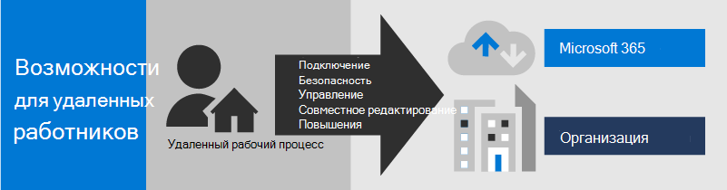
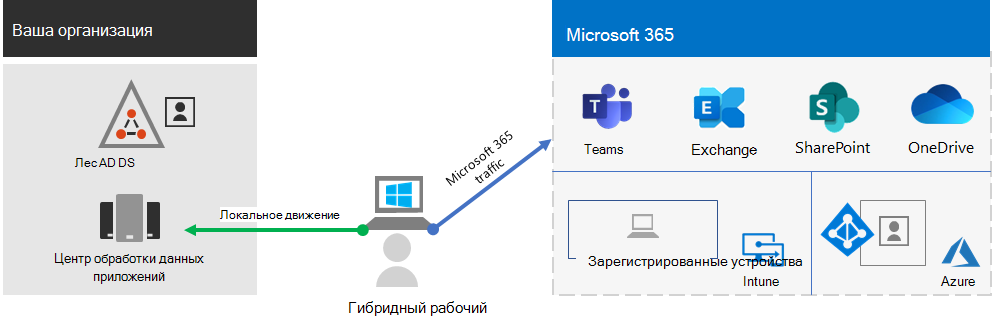
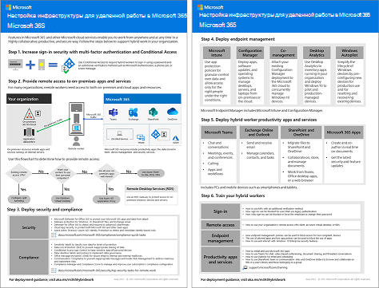

# Повышение эффективности работы удаленных сотрудников с помощью Microsoft 365

Вашей организации может потребоваться предоставить сотрудникам защищенный доступ из дома к локальной и облачной информации, инструментам и ресурсам организации. Возможность работы вне офиса необходима для многих организаций, чтобы:

- Сэкономить пространство в офисе.
- Нанять и сохранить сотрудников, которые не могут переехать.
- Уменьшить время поездок сотрудников, предоставив им больше времени на работу и действий снижающих стресс.

Microsoft 365 обеспечивает возможности удаленной работы для ваших сотрудников.

Обзор процесса развертывания показан в приведенном ниже видео.
 
> [!VIDEO https://www.microsoft.com/videoplayer/embed/RE4F1af]

Это решение предоставляет перечисленные ключевые возможности.

- Подключение

  Из любой точки мира и в любое время для удаленных сотрудников доступны: 

  - Облачные службы и данные подписки на Microsoft 365. 
  - Ресурсы организации, например предлагаемые локальными центрами обработки данных приложений.

- Безопасность

  Вход защищен с помощью многофакторной проверки подлинности (MFA), а встроенные средства безопасности Microsoft 365 и Windows 10 защищают от вредоносных программ, вредоносных атак и потери данных.

- Управление

  Устройствами удаленных сотрудников можно управлять из облака с помощью параметров безопасности и разрешенных приложений, чтобы обеспечить соответствующую работоспособность системы

- Совместная работа и эффективность

  Удаленные сотрудники могут быть так же эффективны, как в офисе, если в своей работе они активно используют:
  - Собрания по сети и сеансы чата в Teams. 
  - Общие рабочие области для облачного хранилища файлов с глобальным доступом и взаимодействием в режиме реального времени в OneDrive и SharePoint.
  - Общие задачи и рабочие процессы для разделения работы и выполнения целей. 

Для удобного входа ваши локальные пользовательские учетные записи доменных служб Active Directory (AD DS) следует синхронизировать с Azure Active Directory (Azure AD). Чтобы защитить устройства с Windows 10, их следует зарегистрировать в Intune. Ниже приведен общий обзор инфраструктуры.

Чтобы соответствовать условиям для удаленных сотрудников, используйте эти возможности и функции Microsoft 365.

| Возможность или функция | Описание | Лицензирование |
|:-------|:-----|:-------|
| MFA, внедренная параметрами безопасности, используемыми по умолчанию   | Защита от скомпрометированных удостоверений и устройств путем требования второй формы проверки подлинности для входов. Используемые по умолчанию параметры безопасности требуют MFA для всех учетных записей пользователей.   | Microsoft 365 E3 или E5 |
| MFA, внедренная условным доступом| Требование MFA на основе свойств входа с помощью политик условного доступа.    | Microsoft 365 E3 или E5 | 
| MFA, внедренная условным доступом на основе риска   | Требование MFA на основе риска пользовательского входа с помощью расширенной защиты от угроз Azure. | Microsoft 365 E5 или E3 с лицензиями Azure AD Premium P2 | 
| Самостоятельный сброс пароля (SSPR)    | Разрешение пользователям сбрасывать или разблокировать свои пароли и учетные записи.  | Microsoft 365 E3 или E5 |
| Прокси приложения Azure AD    | Обеспечение безопасного удаленного доступа к веб-приложениям, размещенным на серверах интрасети.   | Требуется отдельная платная подписка на Azure |
| Подключение VPN типа "точка-сеть" Azure    | Создание безопасного подключения с устройства удаленного сотрудника к вашей интрасети через виртуальную сеть Azure.   | Требуется отдельная платная подписка на Azure |
| Виртуальный рабочий стол Windows   | Поддержка удаленных сотрудников, которые могут использовать только свои личные и неуправляемые устройства, с помощью виртуальных рабочих столов, работающих в Azure. | Требуется отдельная платная подписка на Azure |
| Службы удаленных рабочих столов (RDS) | Разрешение сотрудникам подключаться к компьютерам под управлением Windows в вашей интрасети. | Microsoft 365 E3 или E5 | 
| Шлюз служб удаленных рабочих столов   | Шифрование сообщений и предотвращение прямого доступа к узлам RDS в Интернете. | Требуются отдельные лицензии на Windows Server |
| Microsoft Intune | Управление устройствами и приложениями.   | Microsoft 365 E3 или E5 | 
| Configuration Manager. | Управление установкой, обновлениями и параметрами программного обеспечения на ваших устройствах | Требуются отдельные лицензии для диспетчера конфигураций |
| Аналитика компьютеров | Определение готовности к обновлению ваших клиентов Windows.   | Требуются отдельные лицензии для диспетчера конфигураций |
| Windows Autopilot | Настройка и предварительная конфигурация новых устройств с Windows 10 для эффективной работы.   | Microsoft 365 E3 или E5 |
| Microsoft Teams, Exchange Online, SharePoint Online и OneDrive, Приложения Microsoft 365, Microsoft Power Platform, Yammer, Power Apps | Создание, общение и совместная работа. | Microsoft 365 E3 или E5 |
||||

Условия обеспечения безопасности и соответствия требованиям см. в статье [Развертывание средств безопасности и соответствия требованиям для удаленных сотрудников](empower-people-to-work-remotely-security-compliance.md).

 2-страничное краткое описание этого решения приведено на [плакате "Возможности для удаленных сотрудников"](../downloads/empower-remote-workers.pdf).

Вы также можете скачать этот плакат в формате [PDF](https://github.com/MicrosoftDocs/microsoft-365-docs/raw/public/microsoft-365/downloads/empower-remote-workers.pdf) и распечатать его на бумаге размера letter, legal или tabloid (11 x 17).

Следуйте указанным ниже инструкциям, чтобы защитить и оптимизировать доступ к серверам, данным и облачным службам вашей организации и позволить сотрудникам работать с максимальной продуктивностью.

1. [Повышение уровня безопасности входа в систему с помощью MFA](empower-people-to-work-remotely-secure-sign-in.md)
2. [Обеспечение удаленного доступа к локальным приложениям и службам](empower-people-to-work-remotely-remote-access.md)
3. [Развертывание служб безопасности и соответствия требованиям](empower-people-to-work-remotely-security-compliance.md)
4. [Развертывание управления конечными точками для устройств, компьютеров и других конечных точек](empower-people-to-work-remotely-manage-endpoints.md)
5. [Развертывание служб и приложений для повышения производительности удаленных сотрудников](empower-people-to-work-remotely-teams-productivity-apps.md)
6. [Обучение сотрудников удаленной работе с учетом их отзывов](empower-people-to-work-remotely-train-monitor-usage.md)

Последние сведения от корпорации Майкрософт о поддержке удаленных сотрудников, см. в статье [Начало удаленной работы с Tech Community](https://resources.techcommunity.microsoft.com/enabling-remote-work/).
