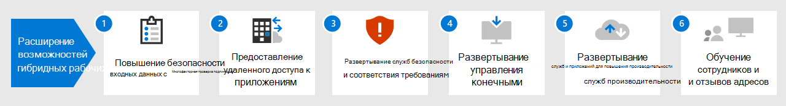

# Повышение эффективности работы удаленных сотрудников с помощью Microsoft 365Empower remote workers with Microsoft 365

Вашей организации может потребоваться предоставить сотрудникам защищенный доступ из дома к локальной и облачной информации, инструментам и ресурсам организации.Your business may need to enable your workers to have secure access to your organization's on-premises and cloud-based information, tools, and resources from their homes. Возможность удобной и безопасной работы вне офиса необходима для многих организаций, чтобы:Allowing workers to work away from the office seamlessly and securely is important for many organizations to:

- Сэкономить пространство в офисе.Save on office space.
- Нанять и сохранить сотрудников, которые не могут переехать.Hire and retain workers who are unwilling to relocate.
- Уменьшить время поездок сотрудников, предоставив им больше времени на работу и действий снижающих стресс.Reduce worker commuting, leaving them with more time to be productive and for stress-reducing activities outside of work.

К удаленной работе, также называемой дистанционной, относится следующее:Remote working, also known as teleworking, can span a spectrum that includes:

- работники, периодически находящиеся вне офиса на конференциях или собраниях с клиентами.workers that are occasionally away from the office for conferences or client meetings.
- Подчиненные, работающие удаленно постоянно.Some workers that work remotely full-time.
- Полностью удаленная организация, в которой нет офиса и все работники являются удаленными.A fully remote organization in which there is no office and all workers are remote.

Для поддержки удаленных работников, например в условиях кризиса, вызванного пандемией COVID-19, в Microsoft 365 имеется сочетание функций, позволяющее им эффективно сотрудничать, например:To support remote workers, for example in response to the COVID-19 crisis, a combination of features in Microsoft 365 enables your remote workers in a highly collaborative way, such as:

- Собрания по сети и сеансы чата.Online meetings and chat sessions.
- Общие рабочие области для облачного хранилища файлов с глобальным доступом и взаимодействием в режиме реального времени.Shared workspaces for cloud-based file storage with global accessibility and real-time collaboration.
- Общие задачи и рабочие процессы для разделения работы и выполнения целей.Shared tasks and workflows to divide up the work and get things done.

Для надежной защиты Microsoft 365 включает:For strong security, Microsoft 365 includes:

- Требования принудительной проверки проверка подлинности, обнаружение рискованных входов и реагирование на них, блокирование выбранных приложений и устройств, не соответствующих требованиям.Enforced authentication requirements, detecting and responding to high-risk sign-ins, and blocking selected apps and non-compliant devices.
- Зашифрованные подключения и цифровые ресурсы в облаке.Encrypted connections and digital assets in the cloud.
- Разрешения, чтобы определять, кто и какие действия может выполнять с файлами.Permissions to define who can do what with files.
- Комплексные функции безопасности для защиты устройств с Windows 10.Comprehensive security features to protect Windows 10 devices.

Чтобы соблюдать эти условия для удаленных сотрудников, используйте следующие возможности Microsoft 365:To meet these criteria for remote workers, use the following Microsoft 365 features:

- Удостоверение пользователя и безопасность входаUser identity and sign-in security
  - Учетные записи пользователей Azure Active Directory (Azure AD) с многофакторной проверкой подлинности (MFA)Azure Active Directory (Azure AD) user accounts with multi-factor authentication (MFA)
  - Политика условного доступа с целью обязательного применения MFA для рискованных входов (Microsoft 365 E5)A Conditional Access policy to require MFA for risky sign-ins (Microsoft 365 E5)
- Платформы для совместной работыCollaboration platforms
  - Microsoft Teams, SharePoint и OneDrive, с помощью которых удаленные работники могут планировать собрания и участвовать в видеособраниях по сети, а также одновременно работать над одним документомMicrosoft Teams, SharePoint, and OneDrive, with which remote workers can schedule and attend online video-based meetings and work on the same documents at the same time
- Безопасный доступ к ресурсамSecure access to resources
  - Группы и разрешения для Teams, сайтов SharePoint и OneDrive, чтобы доступ предоставлялся только прошедшим проверку подлинности пользователям с соответствующими разрешениямиGroups and permissions for Teams, SharePoint sites, and OneDrive so that only authenticated and permitted users have access
- Защита от утечки файловProtection for leaked files
  - Метки конфиденциальности для шифрования и разрешения, передаваемые с файламиSensitivity labels for encryption and permissions that travel with files
- Управление устройствами и обеспечение безопасности с использованием Microsoft IntuneDevice management and security with Microsoft Intune
  - Регистрация управляемых устройствEnrollment for managed devices
  - Параметры приложений для личных устройствApp settings for personal devices
  - Политики устройств и приложенийDevice and app policies
- Приложения для устройств, предназначенные для эффективной работыProductivity apps for devices
  - Приложения Microsoft 365 (Word, PowerPoint, Excel) для совместной работы в Teams, Exchange, SharePoint и OneDriveMicrosoft 365 Apps (Word, PowerPoint, Excel) for collaborative experiences with Teams, Exchange, SharePoint, and OneDrive 
- Windows 10 КорпоративнаяWindows 10 Enterprise
  - Встроенный набор функций безопасности для защиты от кибератак и предотвращения утечки данныхBuilt-in suite of security features to protect against cyberattacks and prevent data leakage
- Доступ к локальным приложениям и службамAccess to on-premises apps and servers
  - Подключения к виртуальной частной сети (VPN), прокси приложения Azure AD или VPN-подключению типа "точка — сеть" в AzureVirtual private network (VPN) connections, Azure AD Application Proxy, or Azure Point-to-Site VPN

Следуйте указанным ниже инструкциям, чтобы защитить и оптимизировать доступ к серверам, данным и облачным службам вашей организации и позволить сотрудникам работать с максимальной продуктивностью.Use these steps to secure and optimize access to your organization's servers, data, and cloud services and enable maximum worker productivity.

1. [Повышение уровня безопасности входа в систему с помощью MFAIncrease sign-in security with MFA](empower-people-to-work-remotely-secure-sign-in.md)
2. [Обеспечение удаленного доступа к локальным приложениям и службамProvide remote access to on-premises apps and services](empower-people-to-work-remotely-remote-access.md)
3. [Развертывание управления конечными точками для устройств, компьютеров и других конечных точекDeploy endpoint management for your devices, PCs, and other endpoints](empower-people-to-work-remotely-manage-endpoints.md)
4. [Развертывание служб и приложений для повышения производительности удаленных сотрудниковDeploy remote worker productivity apps and services](empower-people-to-work-remotely-teams-productivity-apps.md)
5. [Создание информационных объектовCreate communication venues](empower-people-to-work-remotely-communication-venues.md)
6. [Обучение сотрудников удаленной работе с учетом их отзывовTrain remote workers and address usage feedback](empower-people-to-work-remotely-train-monitor-usage.md)

Последние сведения от корпорации Майкрософт о поддержке удаленных сотрудников, см. в статье [Начало удаленной работы с Tech Community](https://resources.techcommunity.microsoft.com/enabling-remote-work/).For the latest information from Microsoft about supporting remote workers, see the [Enabling remote work Tech Community site](https://resources.techcommunity.microsoft.com/enabling-remote-work/).
