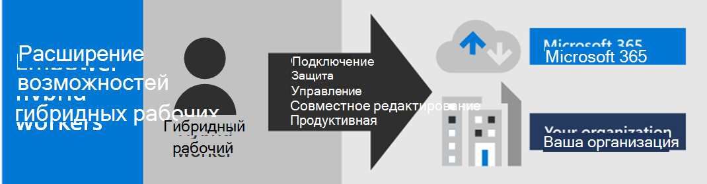

# Настройка инфраструктуры для удаленной работы в Microsoft 365Set up your infrastructure for remote work with Microsoft 365

Чтобы защитить и оптимизировать производительность и совместную работу удаленных сотрудников, вам необходимо настроить ИТ-инфраструктуру и облачную инфраструктуру для обеспечения удаленной работы и предоставления доступа к локальной и облачной информации, инструментам и ресурсам вашей организации.To secure and optimize your remote worker’s productivity and collaboration, you need to configure your IT and cloud infrastructure to enable remote work and to provide access to your organization's on-premises and cloud-based information, tools, and resources. Это решение проводит по развертыванию ключевых уровней инфраструктуры, которые позволяют вашим сотрудникам достигать наилучших результатов в работе, где бы они ни находились.This solution steps through the deployment of key layers of infrastructure that empower your workers to do their best work, wherever they are.

Возможность работы вне офиса необходима для многих организаций, чтобы:Allowing workers to work away from the office is important for many organizations to:

- Сэкономить пространство в офисе.Save on office space.
- Нанять и сохранить сотрудников, которые не могут переехать.Hire and retain workers who are unwilling to relocate.
- Уменьшить время поездок сотрудников, предоставив им больше времени на работу и действий снижающих стресс.Reduce worker commuting, leaving them with more time to be productive and for stress-reducing activities outside of work.

Microsoft 365 обеспечивает возможности удаленной работы для ваших сотрудников.Microsoft 365 has the capabilities to empower your workers to work remotely.

>[!Note]
>Если вы еще не работали с Microsoft 365, см. [эти ресурсы](https://www.microsoft.com/microsoft-365).If you are new to Microsoft 365, see [these resources](https://www.microsoft.com/microsoft-365).
>

Обзор процесса развертывания показан в приведенном ниже видео.Watch this video for an overview of the deployment process.
 
 
> [!VIDEO https://www.microsoft.com/videoplayer/embed/RE4F1af]

Это решение предоставляет следующие ключевые возможности ИТ-специалистам, управляющим местной и облачной инфраструктурой с целью повышения производительности сотрудников.For IT professionals managing onsite and cloud-based infrastructure to enable worker productivity, this solution provides these key capabilities:

- ПодключениеConnected

  Из любой точки мира и в любое время для удаленных сотрудников доступны:From anywhere in the world and at any time, remote workers are able to access: 

  - Облачные службы и данные подписки на Microsoft 365.Cloud-based services and data in your Microsoft 365 subscription. 

  - Ресурсы организации, например предлагаемые локальными центрами обработки данных приложений.Organization resources, such those offered by on-premises application datacenters.

- БезопасностьSecure

  Вход защищен с помощью многофакторной проверки подлинности (MFA), а встроенные средства безопасности Microsoft 365 и Windows 10 защищают от вредоносных программ, вредоносных атак и потери данных.Sign-ins are secured with multi-factor authentication (MFA) and built-in security features of Microsoft 365 and Windows 10 protect against malware, malicious attacks, and data loss.

- УправлениеManaged

  Устройствами удаленных сотрудников можно управлять из облака с помощью параметров безопасности и разрешенных приложений, чтобы обеспечить соответствующую работоспособность системыYour remote worker's devices can be managed from the cloud with security settings, allowed apps, and to require compliance with system health.

- Совместная работа и эффективностьCollaborative and productive

  Удаленные сотрудники могут быть так же эффективны, как в офисе, если в своей работе они активно используют:Your remote workers can be as productive as on-premises in a highly collaborative way with:

  - Собрания по сети и сеансы чата в Teams.Online meetings and chat sessions with Teams. 

  - Общие рабочие области для облачного хранилища файлов с глобальным доступом и взаимодействием в режиме реального времени в OneDrive и SharePoint.Shared workspaces for cloud-based file storage with global accessibility and real-time collaboration with SharePoint and OneDrive.

  - Общие задачи и рабочие процессы для разделения работы и выполнения целей.Shared tasks and workflows to divide up the work and get things done. 

Для удобного входа ваши локальные пользовательские учетные записи доменных служб Active Directory (AD DS) следует синхронизировать с Azure Active Directory (Azure AD).For a seamless sign-in experience, your on-premises Active Directory Domain Services (AD DS) user accounts should be synchronized with Azure Active Directory (Azure AD). Чтобы защитить устройства с Windows 10, их следует зарегистрировать в Intune.To protect your Windows 10 devices, they should be enrolled in Intune. Ниже приведен общий обзор инфраструктуры.Here is a high-level view of the infrastructure.

Чтобы включить возможности Microsoft 365 для удаленных сотрудников, используйте следующие функции Microsoft 365.To enable the capabilities of Microsoft 365 for your remote workers, use these Microsoft 365 features.

| Возможность или функцияCapability or feature | ОписаниеDescription | ЛицензированиеLicensing |
|:-------|:-----|:-------|
| MFA, внедренная параметрами безопасности, используемыми по умолчаниюMFA enforced with security defaults   | Защита от скомпрометированных удостоверений и устройств путем требования второй формы проверки подлинности для входов. Используемые по умолчанию параметры безопасности требуют MFA для всех учетных записей пользователей.Protect against compromised identities and devices by requiring a second form of authentication for sign-ins. Security defaults requires MFA for all user accounts.   | Microsoft 365 E3 или E5Microsoft 365 E3 or E5 |
| MFA, внедренная условным доступомMFA enforced with Conditional Access| Требование MFA на основе свойств входа с помощью политик условного доступа.Require MFA based on the properties of the sign-in with Conditional Access policies.    | Microsoft 365 E3 или E5Microsoft 365 E3 or E5 | 
| MFA, внедренная условным доступом на основе рискаMFA enforced with risk-based Conditional Access   | Требование MFA на основе риска пользовательского входа с помощью Microsoft Defender для удостоверений.Require MFA based on the risk of the user sign-in with Microsoft Defender for Identity. | Microsoft 365 E5 или E3 с лицензиями Azure AD Premium P2Microsoft 365 E5 or E3 with Azure AD Premium P2 licenses | 
| Самостоятельный сброс пароля (SSPR)Self-Service Password Reset (SSPR)    | Разрешение пользователям сбрасывать или разблокировать свои пароли и учетные записи.Allow your users to reset or unlock their passwords or accounts.  | Microsoft 365 E3 или E5Microsoft 365 E3 or E5 |
| Прокси приложения Azure ADAzure AD Application Proxy    | Обеспечение безопасного удаленного доступа к веб-приложениям, размещенным на серверах интрасети.Provide secure remote access for web-based applications hosted on intranet servers.   | Требуется отдельная платная подписка на AzureRequires separate paid Azure subscription |
| Подключение VPN типа "точка-сеть" Azure Azure Point-to-Site VPN   | Создание безопасного подключения с устройства удаленного сотрудника к вашей интрасети через виртуальную сеть Azure.Create a secure connection from a remote worker’s device to your intranet through an Azure virtual network.   | Требуется отдельная платная подписка на AzureRequires separate paid Azure subscription |
| Виртуальный рабочий стол WindowsWindows Virtual Desktop   | Поддержка удаленных сотрудников, которые могут использовать только свои личные и неуправляемые устройства, с помощью виртуальных рабочих столов, работающих в Azure.Support remote workers who can only use their personal and unmanaged devices with virtual desktops running in Azure. | Требуется отдельная платная подписка на AzureRequires separate paid Azure subscription |
| Службы удаленных рабочих столов (RDS)Remote Desktop Services (RDS) | Разрешение сотрудникам подключаться к компьютерам под управлением Windows в вашей интрасети.Allow employees to connect into Windows-based computers on your intranet. | Microsoft 365 E3 или E5Microsoft 365 E3 or E5 | 
| Шлюз служб удаленных рабочих столовRemote Desktop Services Gateway   | Шифрование сообщений и предотвращение прямого доступа к узлам RDS в Интернете.Encrypt communications and prevent the RDS hosts from being directly exposed to the Internet. | Требуются отдельные лицензии на Windows ServerRequires separate Windows Server licenses |
| Microsoft IntuneMicrosoft Intune | Управление устройствами и приложениями.Manage devices and applications.   | Microsoft 365 E3 или E5Microsoft 365 E3 or E5 | 
| Configuration Manager.Configuration Manager | Управление установкой, обновлениями и параметрами программного обеспечения на ваших устройствахManage software installations, updates, and settings on your devices | Требуются отдельные лицензии для диспетчера конфигурацийRequires separate Configuration Manager licenses |
| Аналитика компьютеровDesktop Analytics | Определение готовности к обновлению ваших клиентов Windows.Determine the update readiness of your Windows clients.   | Требуются отдельные лицензии для диспетчера конфигурацийRequires separate Configuration Manager licenses |
| Windows AutopilotWindows Autopilot | Настройка и предварительная конфигурация новых устройств с Windows 10 для эффективной работы.Set up and pre-configure new Windows 10 devices for productive use.   | Microsoft 365 E3 или E5Microsoft 365 E3 or E5 |
| Microsoft Teams, Exchange Online, SharePoint Online и OneDrive, Приложения Microsoft 365, Microsoft Power Platform и YammerMicrosoft Teams, Exchange Online, SharePoint Online and OneDrive, Microsoft 365 Apps, Microsoft Power Platform, and Yammer | Создание, общение и совместная работа.Create, communicate, and collaborate. | Microsoft 365 E3 или E5Microsoft 365 E3 or E5 |
||||

Условия обеспечения безопасности и соответствия требованиям см. в статье [Развертывание средств безопасности и соответствия требованиям для удаленных сотрудников](empower-people-to-work-remotely-security-compliance.md).For security and compliance criteria, see [Deploy security and compliance for remote workers](empower-people-to-work-remotely-security-compliance.md).

 2-страничное краткое описание этого решения приведено на [плакате "Возможности для удаленных сотрудников"](../downloads/empower-remote-workers.pdf).For a 2-page summary of this solution, see the [Empower remote workers poster](../downloads/empower-remote-workers.pdf).

Вы также можете скачать этот плакат в формате [PDF](https://github.com/MicrosoftDocs/microsoft-365-docs/raw/public/microsoft-365/downloads/empower-remote-workers.pdf) или [PowerPoint](https://download.microsoft.com/download/5/1/1/511b77a9-a34c-4ea7-af2a-32b07f20b780/empower-remote-workers.pptx) и распечатать его на бумаге размера letter, legal или tabloid (11 x 17).You can also download this poster in [PDF](https://github.com/MicrosoftDocs/microsoft-365-docs/raw/public/microsoft-365/downloads/empower-remote-workers.pdf) or  [PowerPoint](https://download.microsoft.com/download/5/1/1/511b77a9-a34c-4ea7-af2a-32b07f20b780/empower-remote-workers.pptx) formats and print it on letter, legal, or tabloid (11 x 17) size paper.

## Предоставление удаленной работы для всех сотрудниковProvide remote working for all of your workers

Обеспечивайте продуктивность работы всех сотрудников отовсюду с любого устройства.You can enable all of your workers to stay productive from anywhere with these devices:

- С современного устройства, например Surface Laptop и Windows 10 с функционалом, безопасностью и производительностью для доступа к облачным приложениям и службам Microsoft 365 непосредственно через Интернет.A modern device, such as a Surface laptop and Windows 10, which has the features, security, and performance to access Microsoft 365 cloud apps and services directly over the web.

- С любого устройства, включая более старые ноутбуки или настольные компьютеры, которые используются из дома, и имеют доступ к облачным приложениям и службам Microsoft 365 с помощью [виртуального рабочего стола под управлением Windows 10](empower-people-to-work-remotely-remote-access.md#deploy-windows-virtual-desktop-to-provide-remote-access-for-remote-workers-using-personal-devices), который быстро разворачивается.Any device including older laptops or desktops used from home, which can access Microsoft 365 cloud apps and services indirectly through a quickly deployed [Windows 10-based virtual desktop](empower-people-to-work-remotely-remote-access.md#deploy-windows-virtual-desktop-to-provide-remote-access-for-remote-workers-using-personal-devices). Эта возможность обеспечивает высокую производительность, надежную защиту и упрощает управление ИТ.This option provides high performance, strong security, and simplified IT management.

## Дальнейшие действияNext steps

Следуйте указанным инструкциям, чтобы защитить и оптимизировать доступ к серверам и облачным службам вашей организации и максимально повысить эффективность удаленных сотрудников.Use these steps to secure and optimize access to your organization's servers and cloud services and maximize your remote worker's productivity.

1. [Повышение уровня безопасности входа в систему с помощью MFAIncrease sign-in security with MFA](empower-people-to-work-remotely-secure-sign-in.md)
2. [Обеспечение удаленного доступа к локальным приложениям и службамProvide remote access to on-premises apps and services](empower-people-to-work-remotely-remote-access.md)
3. [Развертывание служб безопасности и соответствия требованиямDeploy security and compliance services](empower-people-to-work-remotely-security-compliance.md)
4. [Развертывание управления конечными точками для устройств, компьютеров и других конечных точекDeploy endpoint management for your devices, PCs, and other endpoints](empower-people-to-work-remotely-manage-endpoints.md)
5. [Развертывание служб и приложений для повышения производительности удаленных сотрудниковDeploy remote worker productivity apps and services](empower-people-to-work-remotely-teams-productivity-apps.md)
6. [Обучение сотрудников удаленной работе с учетом их отзывовTrain remote workers and address usage feedback](empower-people-to-work-remotely-train-monitor-usage.md)

Пример того, как вымышленная показательная транснациональная компания выполняет настройку своей инфраструктуры для удаленной работы, см. в статье [Реакция Contoso на COVID-19 и инфраструктура для удаленной работы и работы в офисе](contoso-remote-onsite-work.md).To see how a fictional but representative multi-national organization set up its infrastructure for remote work, see [Contoso's COVID-19 response and infrastructure for remote and onsite work](contoso-remote-onsite-work.md).
