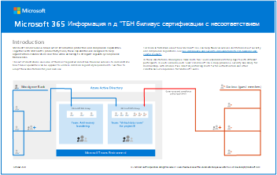

# Основные вопросы соблюдения и безопасности для банковского рынка США и рынков капитала

## Введение
Учреждения финансовых услуг превосходят практически все коммерческие предприятия в своем требовании строгого контроля безопасности, соответствия и управления. Защита данных, идентификационных данных, устройств и приложений важна не только для их бизнеса, но и в соответствии с требованиями соответствия и руководящими принципами со стороны регулирующих органов, таких как Комиссия по ценным бумагам и биржам США (SEC), Регулирующий орган финансовой отрасли (FINRA), Федеральный совет по рассмотрению финансовых учреждений (FFIEC) и Комиссия по торговле товарными фьючерсами (CFTC). Кроме того, на финансовые учреждения распространяются такие законы, как Закон Додда-Франка и Закон Сарбейнса-Оксли 2002 года.

В сегодняшней обстановке повышенной бдительности в области безопасности, опасений, связанных с внутренними рисками и нарушениями открытых данных, клиенты также требуют от своих финансовых учреждений высокого уровня безопасности, чтобы доверять им свои личные данные и банковские активы.

Исторически сложилось так, что необходимость в комплексном контроле напрямую влияла и ограничивала ИТ-системы и платформы, которые финансовые учреждения используют для обеспечения сотрудничества внутри и снаружи. Сегодня работникам финансовых служб нужна современная платформа для совместной работы, которую легко внедрить и которую легко использовать. Но финансовые службы не могут обмениваться гибкостью для совместной работы между пользователями, командами и отделами с помощью средств контроля безопасности и соответствия требованиям, которые применяют политики для защиты пользователей и ИТ-систем от угроз.

В секторе финансовых услуг необходимо тщательно продумать настройку и развертывание инструментов для совместной работы и контроля безопасности, в том числе:
- Оценка рисков общих организационных сценариев сотрудничества и бизнес-процессов
- Требования к защите информации и управлению данными
- Кибербезопасность и внутренние угрозы
- Соответствие нормативным требованиям
- Другие операционные риски

**Microsoft 365 - это современная облачная среда на рабочем месте, которая может решать современные проблемы, с которыми сталкиваются финансовые службы. Безопасное и гибкое сотрудничество в масштабах всего предприятия в сочетании с элементами управления и политикой обеспечивает соблюдение строгих нормативных требований.** В этой статье описывается, как платформа Microsoft 365 помогает финансовым службам перейти на современную платформу для совместной работы, обеспечивая безопасность и соответствие данных и систем нормативным требованиям:

* Обеспечение продуктивности организации и сотрудников с помощью Microsoft 365 и Microsoft Teams
* Защитите современное сотрудничество с помощью Microsoft 365 
* Определите конфиденциальные данные и предотвратите потерю данных
* Защищать крепость
* Управление данными и соблюдение правил путем эффективного управления записями
* Установить этические стены с информационными барьерами
* Защита от кражи данных и внутренних рисков

Будучи партнером Майкрософт, компания Protiviti внесла свой вклад и предоставила значимый отзыв для этой статьи.

Следующие скачиваемые изображения дополняют эту статью. Woodgrove Bank и Contoso используются для демонстрации применения возможностей, описанных в этой статье, с целью выполнения распространенных нормативных требований к финансовым услугам. Вы можете адаптировать эти изображения для собственного применения. 

**Изображения защиты информации и соответствия требованиям Microsoft 365**

| Элемент | Описание |
|:-----|:-----|
|  Английский язык: [Скачать в виде PDF-файла](https://download.microsoft.com/download/3/a/6/3a6ab1a3-feb0-4ee2-8e77-62415a772e53/m365-compliance-illustrations.pdf)  \| [Скачать в виде файла Visio](https://download.microsoft.com/download/3/a/6/3a6ab1a3-feb0-4ee2-8e77-62415a772e53/m365-compliance-illustrations.vsdx)   Японский язык: [Скачать в виде PDF-файла](https://download.microsoft.com/download/6/f/1/6f1a7d0e-dd8e-442e-b073-8e94327ae4f8/m365-compliance-illustrations.pdf)  \| [Скачать в виде файла Visio](https://download.microsoft.com/download/6/f/1/6f1a7d0e-dd8e-442e-b073-8e94327ae4f8/m365-compliance-illustrations.vsdx)  Обновление: ноябрь 2020 г.|Содержимое: <ul><li>  Защита информации (Майкрософт) и защита от потери данных</li><li>Политики и метки хранения </li><li>Информационные барьеры</li><li>Соответствие требованиям к обмену данными</li><li>Внутренний риск</li><li>Внедрение сторонних данных</li>|

## Повышение производительности сотрудников и организаций с помощью Microsoft 365 и Teams

Для совместной работы обычно требуются различные формы общения, возможность хранить документы и данные и получать к ним доступ, а также возможность при необходимости интегрировать другие приложения. Сотрудникам финансовых служб обычно необходимо сотрудничать и общаться с членами других отделов или групп, а иногда и с внешними организациями. Поэтому использование систем, которые создают бункеры или затрудняют обмен информацией, нежелательно. Вместо этого предпочтительнее использовать платформы и приложения, которые позволяют сотрудникам безопасно общаться и обмениваться информацией в соответствии с корпоративной политикой.

Предоставление сотрудникам современной облачной платформы для совместной работы позволяет им выбирать и интегрировать инструменты, которые повышают их продуктивность и дают им возможность находить гибкие способы работы. Использование Teams в сочетании с мерами безопасности и политиками управления информацией, которые защищают организацию, может помочь вашей рабочей силе общаться и эффективно сотрудничать.

Teams обеспечивают центр сотрудничества для организации. Это помогает объединить людей для продуктивной работы над общими инициативами и проектами. Teams позволяют членам команды вести беседы в формате 1:1 и многопартийные чаты, совместно работать над соавторами документов, а также хранить и обмениваться файлами. Teams также упрощает встречи по сети благодаря интегрированной корпоративной голосовой и видеосвязи. Teams также можно настроить с помощью приложений Майкрософт, таких как Планировщик (Майкрософт), Microsoft Dynamics 365, PowerApps, Power BI и сторонние бизнес-приложения. Приложение Teams предназначено для использования как участниками внутри команды, так и разрешенными внешними пользователями, которые могут присоединяться к каналам команды, участвовать в беседах в чате, получать доступ к сохраненным файлам и использовать другие приложения.

Каждая команда Microsoft Team опирается на группу Microsoft 365. Эта группа считается службой членства для многочисленных служб Office 365, включая Teams. Группы Microsoft 365 используются для безопасного разграничения между "владельцами" и "участниками" и для контроля доступа к различным возможностям в Teams. В сочетании с соответствующими средствами управления и регулярно проводимыми проверками доступа, Teams позволяют только членам и владельцам использовать авторизованные каналы и возможности.

Распространенный сценарий, в котором Teams получают финансовые услуги, заключается в выполнении внутренних проектов или программ. Например, многие финансовые учреждения, в том числе банки, фирмы по управлению активами, кредитные союзы и страховые компании, должны иметь в наличии программы по борьбе с отмыванием денег и другие программы обеспечения соответствия. Многопрофильная команда, состоящая из ИТ, таких направлений бизнеса, как розничная торговля и управление активами, и подразделение, занимающееся финансовыми преступлениями, может потребоваться для обмена данными друг с другом и обмена информацией о программе или конкретных расследованиях. Традиционно в этих программах использовались общие сетевые диски, но такой подход может создавать многочисленные проблемы, в том числе:
* Только один человек может редактировать документ одновременно.
* Управление безопасностью занимает много времени, так как в этом случае их можно добавлять и удалять.
* Данные остаются на общих сетевых дисках гораздо дольше, чем требуется или требуется.

Команды могут предоставить пространство для совместной работы для безопасного хранения конфиденциальных клиентских данных и ведения бесед между членами команды, где могут обсуждаться важные темы. Несколько членов команды могут редактировать или совместно работать над одним документом одновременно. Владелец или координатор программы может быть настроен как владелец команды, а затем может добавлять и удалять участников по мере необходимости.

Другой распространенный сценарий - использование команд в качестве «виртуальной комнаты данных» для безопасной совместной работы, включая хранение документов и управление ими. Члены команды и синдикаты в инвестиционных банках, компаниях по управлению активами или частных акционерных компаниях могут безопасно сотрудничать в сделке или инвестициях. Межфункциональные группы часто участвуют в планировании и выполнении таких сделок, и возможность безопасного обмена данными и ведения бесед является ключевым требованием. Надежный обмен соответствующими документами с внешними инвесторами также является ключевым требованием. Teams предоставляют безопасное и полностью проверяемое место для централизованного хранения, защиты и обмена инвестиционными данными.

 
### Teams: улучшение взаимодействия и снижение риска нарушения требований

Microsoft 365 предоставляет другие общие возможности для работы с политиками Teams, используя группы Microsoft 365 в качестве базовой службы членства. Эти политики могут помочь улучшить сотрудничество и удовлетворить требования соответствия.

**Политики именования групп в Microsoft 365** гарантируют, что имена групп Microsoft 365 (а значит, и команд) будут соответствовать корпоративной политике. Имена могут быть проблематичными, если они не подходят. Например, сотрудники могут не знать, с какими командами работать или обмениваться информацией, если имена не применяются соответствующим образом. Политики именования групп (включая поддержку политик на основе префиксов / суффиксов и пользовательских заблокированных слов) могут обеспечивать соблюдение правил гигиены и предотвращать использование определенных слов, таких как зарезервированные слова или неправильная терминология.
  
**Политики сроков действия групп Microsoft 365** гарантируют, что группы Microsoft 365 (а значит, и команды) не будут храниться дольше, чем нужно организации. Эта возможность помогает предотвратить две ключевые проблемы управления информацией:

* Распространение команд, которые не нужны или используются.
* Чрезмерное хранение данных, которые больше не требуются или не используются организацией (за исключением случаев законного хранения / сохранения).

Администраторы могут задавать сроки действия для групп Microsoft 365 (например, 90, 180 или 365 дней). Если служба, которая опирается на группу Microsoft 365, неактивна в течение срока действия, владельцы группы получают уведомление. Если никаких действий не предпринимается, группа Microsoft 365 и все связанные с ней службы, включая Teams, удаляются.
  
Чрезмерное хранение данных, хранящихся в Teams и других групповых услугах, может представлять риск для организаций, оказывающих финансовые услуги. Рекомендуем использовать политики сроков действия групп Microsoft 365, чтобы предотвратить сохранение ненужных данных. В сочетании со встроенными метками хранения и политиками Microsoft 365 помогает организациям сохранять только те данные, которые необходимы для соблюдения корпоративных политик и обязательств по соблюдению нормативных требований.

#### Teams: Интеграция пользовательских требований с легкостью

Teams позволяют создавать команды самообслуживания по умолчанию. Однако многие регулируемые организации хотят контролировать и понимать, какие каналы совместной работы в настоящее время используются их сотрудниками, какие каналы могут содержать конфиденциальные данные и права собственности на организационные каналы. Чтобы упростить эти средства управления, Microsoft 365 позволяет организации отключать создание групп самообслуживания. Используя инструменты автоматизации бизнес-процессов, такие как Microsoft Power Apps и Power Automate, организации могут создавать и развертывать простые формы и процессы утверждения для сотрудников, чтобы запросить создание новой команды. После утверждения команда может быть автоматически подготовлена и ссылка отправлена запрашивающей стороне. Таким образом, организации могут разрабатывать и интегрировать свои средства контроля соответствия и пользовательские требования в процесс создания команды.
 
### Допустимые цифровые каналы связи

FINRA [подчеркивает, что цифровая связь регулируемых фирм соответствует требованиям ведения бухгалтерского учета правил 17a-3 и 17a-4 Закона об обмене, а также серии правил 4510 FINRA](https://www.finra.org/rules-guidance/key-topics/books-records). FINRA выпускает ежегодный отчет, который содержит основные выводы, наблюдения и эффективные методы, помогающие организациям улучшить соблюдение требований и управление рисками. В своем [отчете о результатах и наблюдениях за 2019 год](https://www.finra.org/rules-guidance/guidance/reports/2019-report-exam-findings-and-observations) FINRA определила цифровую связь как ключевую область, в которой фирмы сталкиваются с проблемами, связанными с требованиями к надзору и ведению записей.

Если организация разрешает своим сотрудникам использовать определенное приложение, такое как служба обмена сообщениями на основе приложений или платформа для совместной работы, фирма должна архивировать деловые записи и контролировать действия и связи этих сотрудников в этом приложении. Организации несут ответственность за надлежащую проверку соблюдения правил FINRA и законов о ценных бумагах, а также за отслеживание возможных нарушений этих правил, связанных с использованием таких приложений сотрудниками.
  
Эффективные методы, рекомендованные FINRA, включают следующее:
* Создать комплексную программу управления цифровыми каналами связи. Управляйте решениями организации о том, какие цифровые каналы связи разрешены, и определяйте процессы соответствия для каждого цифрового канала. Внимательно следите за быстро меняющимся ландшафтом цифровых каналов связи и постоянно обновляйте процессы соответствия.
* Четко определить и контролировать допустимые цифровые каналы. Определите как разрешенные, так и запрещенные цифровые каналы. Блокировать или ограничивать использование запрещенных цифровых каналов или запрещенных функций в цифровых каналах, которые ограничивают способность организации соблюдать требования к управлению записями и надзору.
* Обеспечить обучение для цифровых коммуникаций. Внедрить обязательные программы обучения, прежде чем предоставить зарегистрированным представителям доступ к утвержденным цифровым каналам. Обучение помогает прояснить ожидания организации в отношении деловых и личных цифровых коммуникаций, а также помогает персоналу использовать разрешенные функции каждого канала соответствующим образом.

Выводы и наблюдения FINRA в отношении цифровых коммуникаций напрямую связаны со способностью организации соблюдать правило [SEC Rule 17a-4](https://www.law.cornell.edu/cfr/text/17/240.17a-4) для сохранения всех сообщений, связанных с бизнесом, правила [3110](https://www.finra.org/rules-guidance/rulebooks/finra-rules/3110)и [3120](https://www.finra.org/rules-guidance/rulebooks/finra-rules/3120)FINRA для контроля и анализа сообщений, а также правило [4510](https://www.finra.org/rules-guidance/rulebooks/finra-rules/4510)для ведения учета. Комиссия по торговле товарными фьючерсами (CFTC) объявляет аналогичные требования, соответствующие правилу 17 CFR 131. Эти правила подробно обсуждаются далее в этой статье.

***Teams, наряду с полным набором предложений по безопасности и соответствию требованиям Microsoft 365, предоставляют корпоративным цифровым каналам связи учреждениям финансовых услуг для эффективного ведения бизнеса и соблюдения нормативных требований.*** В оставшейся части этой статьи описывается, как встроенные возможности Microsoft 365 для управления записями, защиты информации, информационных барьеров и надзорного контроля дают Teams надежный набор инструментов для выполнения этих нормативных обязательств.

## Защитите современное сотрудничество с Microsoft 365

### Безопасная идентификация пользователей и контроль доступа

***Защита доступа к информации о клиентах, финансовым документам и приложениям начинается с надежной защиты идентификационных данных пользователей.*** Это требует от предприятия защищенной платформы для хранения и управления удостоверениями, обеспечения надежных средств аутентификации и динамического управления доступом к этим приложениям.

Когда сотрудники работают, они могут перемещаться из приложения в приложение или между несколькими местоположениями и устройствами. Доступ к данным должен быть аутентифицирован на каждом этапе пути. Процесс аутентификации должен поддерживать строгий протокол и множество факторов аутентификации (таких как однократный пароль SMS, приложение аутентификатора и сертификат), чтобы гарантировать, что идентификационные данные не будут скомпрометированы. Применение политик доступа, основанных на оценке риска, имеет решающее значение для защиты финансовых данных и приложений от внутренних угроз, случайных утечек данных и их фильтрации.

Microsoft 365 предоставляет безопасную платформу удостоверений в [Azure Active Directory (Azure AD)](/azure/active-directory/), где удостоверения хранятся централизованно и надежно управляются. Azure AD вместе с множеством связанных служб безопасности Microsoft 365 служит основой для предоставления сотрудникам доступа, необходимого им для безопасной работы, а также защиты организации от угроз.

[Многофакторная проверка подлинности Azure AD (MFA)](/azure/active-directory/fundamentals/concept-fundamentals-mfa-get-started) встроена в платформу и предоставляет дополнительное подтверждение проверки подлинности, помогающее подтвердить личность пользователя при доступе к конфиденциальным финансовым данным и приложениям. Для Azure MFA требуется как минимум два способа проверки подлинности, например пароль и известное мобильное устройство. Он поддерживает несколько вариантов аутентификации второго фактора, в том числе:

- Приложение Microsoft Authenticator
- Одноразовый пароль, доставленный с помощью SMS
- Телефонный звонок, где пользователь должен ввести PIN-код

Если пароль каким-либо образом скомпрометирован, потенциальному хакеру все равно понадобится телефон пользователя, чтобы получить доступ к организационным данным. Кроме того, Microsoft 365 использует Modern Authentication в качестве ключевого протокола, который обеспечивает такие же надежные и богатые возможности аутентификации, как веб-браузеры, для инструментов совместной работы, которые сотрудники используют изо дня в день, включая Microsoft Outlook и другие приложения Microsoft Office.

#### Беспарольная

Пароли являются самым слабым звеном в цепочке безопасности. Они могут быть единственной точкой отказа, если нет дополнительной проверки. Microsoft поддерживает широкий спектр вариантов аутентификации, чтобы соответствовать потребностям финансовых учреждений.

Методы *без пароля* помогают сделать MFA более удобным для пользователей. Хотя не все MFA не имеют пароля, в технологиях без пароля используется многофакторная аутентификация. Microsoft, Google и другие лидеры отрасли разработали стандарты, обеспечивающие более простую и надежную аутентификацию через Интернет и мобильные устройства в группе под названием Fast IDentity Online (FIDO). Недавно разработанный стандарт FIDO2 позволяет пользователям легко и безопасно проходить аутентификацию, не требуя пароля для устранения фишинга.

Методы Microsoft MFA, которые не имеют пароля, включают в себя:
* [Microsoft Authenticator](/azure/active-directory/user-help/user-help-auth-app-overview): Для обеспечения гибкости, удобства и стоимости мы рекомендуем использовать мобильное приложение Microsoft Authenticator. Microsoft Authenticator поддерживает биометрические данные, push-уведомления и одноразовые пароли для любого приложения, подключенного к Azure AD. Он доступен в магазинах приложений Apple и Android.
*  [Windows Hello](/windows/security/identity-protection/hello-for-business/hello-overview): для работы на ПК мы рекомендуем использовать Windows Hello. Для автоматического входа используется биометрическая информация (например, лицо или отпечаток пальца).  
* [Ключи безопасности FIDO2](/windows/security/identity-protection/hello-for-business/microsoft-compatible-security-key) теперь доступны у нескольких партнеров Microsoft: Yubico, Feitian Technologies и HID Global в виде USB, NFC-совместимого значка или биометрического ключа.

[Условный доступ Azure AD](/azure/active-directory/conditional-access/) обеспечивает надежное решение для автоматизации решений по управлению доступом и реализации организационных политик для защиты активов компании. Классическим примером является случай, когда специалист по финансовому планированию хочет получить доступ к приложению, которое имеет конфиденциальные данные клиентов. Они автоматически должны выполнять многофакторную аутентификацию для конкретного доступа к этому приложению, и доступ должен осуществляться с устройства, управляемого корпоративным способом. Условный доступ Azure объединяет сигналы о запросе доступа пользователя, например о свойствах пользователя, устройстве, местоположении и сети, а также о приложении, к которому пользователь пытается получить доступ. Он динамически оценивает попытки доступа к приложению на основе настроенных политик. Если риск пользователя или устройства повышен или другие условия не выполняются, Azure AD может автоматически применять политики, например требовать MFA, требовать безопасного сброса пароля или ограничивать или блокировать доступ. Это помогает обеспечить защиту чувствительных организационных активов в динамически изменяющихся средах.
 
Azure AD и связанные службы безопасности Microsoft 365 обеспечивают основу, на которой современная облачная платформа для совместной работы может быть развернута для финансовых учреждений, чтобы можно было обеспечить доступ к данным и приложениям, а также выполнить требования нормативных требований. Эти инструменты предоставляют следующие ключевые возможности:

* Централизованно хранить и безопасно управлять идентификационными данными пользователей.
* Используйте протокол строгой аутентификации, включая многофакторную аутентификацию, для аутентификации пользователей по запросам доступа и обеспечения согласованной и надежной аутентификации во всех приложениях.
* Динамическая проверка политик по всем запросам доступа, включение нескольких сигналов в процесс принятия решений, включая идентификацию, членство в группе / пользователе, приложение, устройство, сеть, местоположение и оценку риска в режиме реального времени.
* Проверяйте детализированные политики на основе поведения пользователя и свойств файла и динамически применяйте дополнительные меры безопасности при необходимости.
* Выявить «теневые ИТ» в организации и позволить командам InfoSec разрешать или блокировать облачные приложения.
* Мониторинг и контроль доступа к облачным приложениям Microsoft и других производителей.
* Заблаговременно защищайте от фишинга электронной почты и атак вымогателей.

#### Защита идентификации Azure AD
В то время как условный доступ защищает ресурсы от подозрительных запросов, Identity Protection идет дальше, обеспечивая постоянное обнаружение рисков и исправление подозрительных учетных записей пользователей. Identity Protection круглосуточно информирует вас о подозрительном поведении пользователя и входа в вашу среду. Его автоматический ответ предотвращает злоупотребления скомпрометированными личностями.
 
Identity Protection - это инструмент, который позволяет организациям выполнять три ключевые задачи:

* Автоматизировать обнаружение и устранение рисков, связанных с идентификацией.
* Исследуйте риски, используя данные на портале.
* Экспорт данных обнаружения рисков в сторонние утилиты для дальнейшего анализа.

Identity Protection использует знания, которые Microsoft приобрела благодаря своей позиции в организациях с Azure AD, в потребительской сфере с учетными записями Microsoft и в играх с Xbox для защиты ваших пользователей. Microsoft анализирует 65 триллионов сигналов в день для выявления и защиты клиентов от угроз. Сигналы, генерируемые и передаваемые в Identity Protection, могут далее поступать в такие инструменты, как условный доступ, для принятия решений о доступе. Они также могут быть переданы обратно в инструмент обеспечения безопасности информации и управления событиями (SIEM) для дальнейшего расследования на основе принудительных политик вашей организации.

Identity Protection помогает организациям автоматически защищаться от компрометации идентификационных данных, используя преимущества облачного интеллекта на основе расширенного обнаружения, основанного на эвристике, анализе поведения пользователей и сущностей (UEBA) и машинном обучении (ML) в экосистеме Microsoft.

 
## Определите конфиденциальные данные и предотвратите потерю данных
Microsoft 365 позволяет всем организациям идентифицировать конфиденциальные данные внутри организации с помощью комбинации мощных возможностей, в том числе:

* **Microsoft Information Protection (MIP)** как для пользовательской классификации, так и для автоматической классификации конфиденциальных данных.
* **Office 365 Data Loss Prevention (DLP)** для автоматической идентификации конфиденциальных данных с использованием конфиденциальных типов данных (другими словами, регулярных выражений), а также ключевых слов и применения политик.

**[Microsoft Information Protection (MIP)](../compliance/information-protection.md)** позволяет организациям разумно классифицировать документы и электронные письма, используя метки чувствительности. Ярлыки чувствительности могут применяться пользователями вручную к документам в приложениях Microsoft Office и к электронным письмам в Outlook. Этикетки могут автоматически применять маркировку документов, защиту с помощью шифрования и принудительное управление правами. Метки чувствительности также можно применять автоматически, настраивая политики, в которых используются ключевые слова и типы конфиденциальных данных (например, номера кредитных карт, номера социального страхования и идентификационные номера) для автоматического поиска и классификации конфиденциальных данных.

Кроме того, Microsoft предоставляет «обучаемые классификаторы», которые используют модели машинного обучения для идентификации конфиденциальных данных на основе контента, а не просто путем сопоставления с образцом или элементами внутри контента. Классификатор узнает, как идентифицировать тип контента, просматривая многочисленные примеры контента, подлежащего классификации. Обучение классификатора начинается с предоставления ему примеров содержания в определенной категории. После изучения этих примеров модель тестируется путем сопоставления подходящих и несоответствующих примеров. Классификатор предсказывает, попадает ли данный пример в категорию или нет. Затем человек подтверждает результаты, сортируя положительные, отрицательные, ложные положительные и ложные отрицательные значения, чтобы повысить точность предсказаний классификатора. После публикации обученного классификатора он обрабатывает контент в Microsoft SharePoint Online, Exchange Online и OneDrive для бизнеса и автоматически классифицирует контент.

Применение меток чувствительности к документам и электронным письмам встраивает метаданные, которые идентифицируют выбранную чувствительность внутри объекта. Чувствительность затем путешествует с данными. Таким образом, даже если помеченный документ хранится на рабочем столе пользователя или в локальной системе, он все равно защищен. Эта функция позволяет другим решениям Microsoft 365, таким как Microsoft Cloud App Security или периферийным устройствам сети, идентифицировать конфиденциальные данные и автоматически применять меры безопасности. Ярлыки чувствительности имеют дополнительное преимущество: они информируют сотрудников о том, какие данные в организации считаются конфиденциальными, и как обрабатывать эти данные при получении.

**[Office 365 Data Loss Prevention (DLP)](../compliance/data-loss-prevention-policies.md?view=o365-worldwide)** автоматически идентифицирует документы, электронные письма и разговоры, которые содержат конфиденциальные данные, сканируя их на наличие конфиденциальных данных и затем применяя политику к этим объектам. Политики применяются к документам в SharePoint и OneDrive для бизнеса. Они также применяются, когда пользователи отправляют электронную почту, а также в чатах и чатах Команд. Политики могут быть настроены на поиск ключевых слов, типов конфиденциальных данных, меток хранения, а также на предмет совместного использования данных внутри организации или за ее пределами. Предусмотрены средства контроля, помогающие организациям точно настраивать политики DLP для уменьшения ложных срабатываний. Когда конфиденциальные данные обнаруживаются, пользователи приложений Microsoft 365 могут отображать настраиваемые советы по политике, информирующие их о том, что их содержимое содержит конфиденциальные данные, и затем предлагать корректирующие действия. Политики также могут запрещать пользователям доступ к документам, совместное использование документов или отправку электронных писем, содержащих определенные типы конфиденциальных данных. Microsoft 365 поддерживает более 100 встроенных типов конфиденциальных данных. Организации могут настраивать собственные типы конфиденциальных данных в соответствии со своими политиками.

Развертывание политик MIP и DLP для организаций требует тщательного планирования и программы обучения пользователей, чтобы сотрудники понимали схему классификации данных организации и какие типы данных считаются конфиденциальными. Предоставление сотрудникам инструментов и образовательных программ, которые помогают им идентифицировать конфиденциальные данные и понять, как с ними обращаться, делает их частью решения для снижения рисков информационной безопасности.

Сигналы, генерируемые и передаваемые в Identity Protection, также могут поступать в такие инструменты, как условный доступ, для принятия решений о доступе, или в инструмент управления информацией и событиями безопасности (SIEM) для расследования на основе принудительных политик организации.

Identity Protection помогает организациям автоматически защищаться от компрометации идентификационных данных, используя преимущества облачного интеллекта на основе расширенных обнаружений, основанных на эвристике, анализе поведения пользователей и сущностей и машинном обучении в экосистеме Microsoft.

## Защищать крепость

Недавно корпорация Майкрософт выпустила решение Microsoft 365 Defender, предназначенное для защиты современной организации от постоянно меняющейся картины угроз. Благодаря использованию графика интеллектуальной безопасности решение для защиты от угроз предлагает комплексную интегрированную защиту от нескольких векторов атак.

### [Интеллектуальный график безопасности](https://www.microsoft.com/security/business/intelligence) 
Службы безопасности от Microsoft 365 работают на основе Intelligent Security Graph. Для борьбы с кибер угрозами график интеллектуальной безопасности использует расширенную аналитику, чтобы связать разведку угроз и сигналы безопасности от Microsoft и ее партнеров. Microsoft эксплуатирует глобальные службы в огромных масштабах, собирая триллионы сигналов безопасности, которые обеспечивают уровни защиты по всему стеку. Модели машинного обучения оценивают эту информацию, а понимание сигналов и угроз широко распространено в наших продуктах и услугах. Это позволяет нам быстро обнаруживать угрозы и реагировать на них, а также предоставлять действующие предупреждения и информацию клиентам для исправления. Наши модели машинного обучения постоянно проходят обучение и обновляются, что позволяет нам создавать более безопасные продукты и обеспечивать более упреждающую безопасность.

[Microsoft Defender для Office 365](../security/office-365-security/office-365-atp.md?view=o365-worldwide) предоставляет интегрированную службу Microsoft 365, защищающую организации от вредоносных ссылок и вредоносных программ, распространяемых через электронную почту и документы Office. Одним из наиболее распространенных векторов атак, которые сегодня затрагивают пользователей, являются фишинговые атаки по электронной почте. Эти атаки могут быть нацелены на конкретных пользователей и могут быть очень убедительными, с некоторым призывом к действию, который побуждает пользователя щелкнуть вредоносную ссылку или открыть вложение, содержащее вредоносное ПО. Как только компьютер заражен, злоумышленник может либо украсть учетные данные пользователя и перемещаться в боковом направлении по всей организации, либо отфильтровать электронные письма и данные в поисках конфиденциальной информации. Defender для Office 365 поддерживает безопасные вложения и безопасные ссылки, оценивая документы и ссылки во время нажатия на наличие потенциально вредоносных действий и блокируя доступ. Вложения электронной почты открываются в защищенной песочнице, прежде чем они доставляются в почтовый ящик пользователя. Он также оценивает ссылки в документах Office на наличие вредоносных URL-адресов. Defender для Office 365 также защищает ссылки и файлы в SharePoint Online, OneDrive для бизнеса и Teams. Если вредоносный файл обнаружен, Defender для Office 365 автоматически блокирует этот файл, чтобы уменьшить потенциальный ущерб.

[Microsoft Defender для конечной точки](/windows/security/threat-protection/microsoft-defender-atp/microsoft-defender-advanced-threat-protection) — это унифицированная платформа безопасности конечных точек для превентивной защиты, обнаружения после взлома, автоматического исследования и реагирования. Defender для конечной точки предоставляет встроенные возможности для обнаружения и защиты конфиденциальных данных в конечных точках организации.

[Microsoft Cloud App Security (MCAS)](/cloud-app-security/what-is-cloud-app-security) позволяет организациям применять политики на детальном уровне и обнаруживать поведенческие аномалии на основе индивидуальных профилей пользователей, которые автоматически определяются с помощью машинного обучения. Политики MCAS могут основываться на политиках условного доступа Azure для защиты конфиденциальных активов компании путем оценки дополнительных сигналов, связанных с поведением пользователей и свойствами документов, к которым осуществляется доступ. Со временем MCAS изучает типичное поведение каждого сотрудника в отношении данных, к которым он обращается, и приложений, которые они используют. Основываясь на изученных моделях поведения, политики могут автоматически применять меры безопасности, если сотрудник действует за пределами этого профиля поведения. Например, если сотрудник обычно обращается к приложению бухгалтерского учета с 9:00 до 17:00 с понедельника по пятницу, но внезапно начинает интенсивно обращаться к этому приложению в воскресенье вечером, MCAS может динамически применять политики, требующие от пользователя повторной аутентификации. Это помогает гарантировать, что учетные данные пользователя не были скомпрометированы. MCAS также может помочь определить «теневые ИТ» в организации, что помогает группам информационной безопасности гарантировать, что сотрудники используют санкционированные инструменты при работе с конфиденциальными данными. Наконец, MCAS может защитить конфиденциальные данные в любом месте облака, даже за пределами платформы Microsoft 365. Это позволяет организациям санкционировать (или не отменять) определенные внешние облачные приложения, контролировать доступ и отслеживать использование.
 
[Microsoft Defender для удостоверений](/azure-advanced-threat-protection/what-is-atp) — это облачное решение для обеспечения безопасности, использующее ваши локальные сигналы Active Directory для выявления, обнаружения и исследования расширенных угроз, скомпрометированных удостоверений и вредоносных внутренних действий, направленных против вашей организации. AATP позволяет аналитикам SecOp и специалистам по безопасности обнаруживать сложные атаки в гибридных средах для:
* Мониторинг пользователей, поведения объектов и действий с помощью аналитики, основанной на обучении.
* Защищать удостоверения и учетные данные пользователей, хранящиеся в Active Directory.
* Выявление и расследование подозрительных действий пользователей и продвинутых атак по всей цепочке уничтожений.
* Предоставьте четкую информацию об инциденте на простой временной шкале для быстрой сортировки.

 
## Управлять данными и управлять записями

Финансовые учреждения должны хранить свои записи и информацию в соответствии со своими нормативными, юридическими и деловыми обязательствами, представленными в корпоративном графике хранения. Например, [SEC устанавливает срок хранения](https://www.sec.gov/rules/interp/34-47806.htm) от трех до шести лет, в зависимости от типа записи, с немедленной доступностью в течение первых двух лет. Организации сталкиваются с правовыми и нормативными рисками соответствия, если данные не сохраняются (отбрасываются слишком рано), и теперь также управляют правилами, которые требуют удаления, когда информация больше не требуется. Эффективные стратегии управления записями подчеркивают практический и последовательный подход, позволяющий надлежащим образом распоряжаться информацией, одновременно минимизируя затраты и риски для организации.
 
Кроме того, нормативные мандаты Департамента финансовых услуг штата Нью-Йорк требуют от организаций, на которые распространяется действие страховки, соблюдения политики и процедур удаления непубличной информации. 23 NYCRR 500, Раздел 500.13, Ограничения на хранение данных, требует, чтобы «В рамках своей программы кибербезопасности каждое Покрываемое предприятие должно периодически включать политики и процедуры для безопасного удаления любой Непубличной информации, определенной в разделе 500.01 (g)(2)-(3) данной Части, которая больше не нужна для деловых операций или для других законных деловых целей Покрываемого лица, за исключением случаев, когда такая информация должна быть сохранена законом или нормативным актом. "
 
Финансовые учреждения управляют огромными объемами данных. А некоторые периоды хранения инициируются событиями, такими как истечение срока действия контракта или уход работника из организации. В этой атмосфере может быть сложно применить правила хранения записей. Подходы к точному назначению сроков хранения записей в документах организации могут различаться. Некоторые широко применяют политики хранения или используют методы авто-классификации и машинного обучения. Другие идентифицируют подход, который требует более детального процесса, который назначает периоды хранения уникально для отдельных документов.

***Microsoft 365 предоставляет гибкие возможности для определения меток и политик хранения для интеллектуального внедрения требований к управлению записями.*** Менеджер записей определяет метку хранения, которая представляет «тип записи» в традиционном графике хранения. Метка хранения содержит настройки, которые определяют эти детали:

- Как долго хранится запись
- Что происходит, когда истекает срок хранения (удалить документ, запустить проверку утилизации или не предпринимать никаких действий)
-  Что запускает период хранения (дата создания, дата последнего изменения, помеченная дата или событие) и помечает документ или электронную почту как запись (то есть ее нельзя редактировать или удалять)

Затем метки хранения публикуются на сайтах SharePoint или OneDrive, в почтовых ящиках Exchange и в группах Microsoft 365. Пользователи могут применять метки хранения вручную к документам и электронным письмам. Менеджеры записей могут использовать интеллект для автоматического нанесения меток. Интеллектуальные возможности могут основываться на [более девяноста встроенных типах конфиденциальной информации](../compliance/content-search.md?view=o365-worldwide) (таких как номер ABA, номер банковского счета в США или номер социального страхования США). Они также настраиваются на основе ключевых слов или конфиденциальных данных, найденных в документах или электронных письмах, таких как номера кредитных карт или другая личная информация или на основе метаданных SharePoint. Для данных, которые нелегко идентифицировать с помощью ручного или автоматического сопоставления с образцом, обучаемые классификаторы могут использоваться для интеллектуальной классификации документов на основе методов машинного обучения.
 
**Комиссия по ценным бумагам и биржам (SEC)** требует, чтобы брокеры-дилеры и другие регулируемые финансовые учреждения сохраняли все деловые связи. Эти требования применяются ко многим типам сообщений и данных, включая электронную почту, документы, мгновенные сообщения, факсы и многое другое. **Правило SEC 17a-4** определяет критерии, которым эти организации должны соответствовать, чтобы хранить записи в электронной системе хранения данных. В 2003 году SEC выпустила выпуск, который разъяснил эти требования. Он включал следующие критерии:

* Данные, сохраняемые электронной системой хранения, должны быть не перезаписываемыми и не стираемыми. Это называется требованием WORM (напишите один раз, прочитайте много).
* Система хранения должна иметь возможность хранить данные за пределами срока хранения, требуемого правилом, в случае повестки в суд или другого законного распоряжения.
* Организация не будет нарушать требования пункта (f) (2) (ii) (A) правила, если она использует электронную систему хранения, которая предотвращает перезапись, стирание или иное изменение записи в течение требуемого срока хранения. за счет использования встроенных аппаратных и программных управляющих кодов.
* Электронные системы хранения, которые просто «снижают» риск того, что запись будет перезаписана или стерта, например, полагаясь на контроль доступа, не отвечают требованиям правила.

Чтобы помочь финансовым учреждениям соответствовать требованиям правила SEC 17a-4, Microsoft 365 предоставляет комбинацию возможностей, связанных с тем, как хранятся данные, настраиваются политики и данные хранятся в службе. Они включают:

* **Сохранение данных (Правило 17a-4 (a), (b) (4))** - Метки и политики хранения являются гибкими для удовлетворения потребностей организации и могут автоматически или вручную применяться к различным типам данных, документов и информации. Поддерживается широкий спектр типов данных и сообщений, включая документы в SharePoint и OneDrive для бизнеса, данные в почтовых ящиках Exchange Online и данные в группах.  
* **Не перезаписываемый, не стираемый формат (Правило 17a-4 (f) (2) (ii) (A))** - Возможность блокировки сохранения для политик хранения позволяет менеджерам записей и администраторам настраивать политики хранения как ограничивающие, чтобы они могли больше не будет изменено. Это запрещает кому-либо удалять, отключать или изменять политику хранения любым способом. Это означает, что после включения блокировки сохранения ее нельзя отключить, и не существует метода, с помощью которого любые данные, к которым была применена политика хранения, можно перезаписывать, изменять или удалять в течение периода хранения. Кроме того, срок хранения не может быть сокращен. Однако срок хранения может быть увеличен, когда существует законное требование продолжить хранение данных.  Когда блокировка сохранения применяется к политике хранения, следующие действия ограничены:

  - Срок хранения полиса может быть только увеличен. Это не может быть сокращено.
  - Пользователи могут быть добавлены в политику, но существующие пользователи, настроенные в политике, не могут быть удалены.
   - Политика хранения не может быть удалена ни одним администратором в организации.
 
  Preservation Lock помогает гарантировать, что ни один пользователь, даже администраторы с наивысшими уровнями привилегированного доступа, не смогут изменять параметры, изменять, перезаписывать или удалять данные, которые были сохранены, приводя архивирование в Office 365 в соответствие с рекомендациями, предоставленными в SEC Выпуск 2003 года.

* **Качество, точность и проверка хранения / сериализации и индексации данных (Правило 17a-4 (f) (2) (ii) (B) и (C))** - каждая рабочая нагрузка Office 365 содержит возможности для автоматической проверки качества и точности процесса записи данных на носитель. Кроме того, данные хранятся с использованием метаданных и временных меток, чтобы обеспечить достаточную индексацию для эффективного поиска и извлечения данных.
 
* **Отдельное хранилище для дублированных копий (Правило 17a-4 (f) (3 (iii))** Облачная служба Office 365 хранит дублированные копии данных в качестве основного аспекта своей высокой доступности. Это достигается путем реализации избыточности на всех уровнях службы, в том числе на физическом уровне на всех серверах, на уровне сервера в центре обработки данных и на уровне обслуживания для географически распределенных центров обработки данных.

* **Загружаемые и доступные данные (Правило 17a-4 (f) (2) (ii) (D))** - Office 365 обычно разрешает искать, получать доступ и загружать данные, которые были помечены как сохраняемые. И это позволяет осуществлять поиск данных в онлайн-архивах Exchange с помощью встроенных функций eDiscovery. Затем данные могут быть загружены по мере необходимости в стандартных форматах, включая EDRML и PST.
 
* **Требования аудита (Правило 17a-4 (f) (3) (v))** - Office 365 обеспечивает ведение журнала аудита для каждого административного и пользовательского действия, которое модифицирует объекты данных, настраивает или изменяет политики хранения, выполняет поиск eDiscovery или изменяет разрешения на доступ. Office 365 поддерживает полный журнал аудита, включая данные о том, кто выполнил действие, когда оно было выполнено, сведения о действии и выполненные команды. Затем журнал аудита может быть выведен и включен как часть формальных процессов аудита по мере необходимости.

Наконец, Правило 17a-4 требует, чтобы организации хранили записи для многих типов транзакций, чтобы они были немедленно доступны в течение двух лет. Записи должны быть сохранены в течение трех-шести лет с немедленным доступом. Дублирующие записи также должны храниться в течение того же периода в другом месте. Возможности управления записями Office 365 позволяют сохранять записи таким образом, чтобы их нельзя было изменить или удалить, но к ним легко получить доступ в течение периода времени, который контролируется менеджером записей. Эти периоды могут занимать дни, месяцы или годы, в зависимости от обязательств организации по соблюдению нормативных требований.
 
По запросу Microsoft предоставит аттестационное письмо о соответствии требованиям SEC 17a-4, если этого требует организация.

Кроме того, эти возможности также помогают Microsoft 365 выполнять требования к хранилищу в соответствии с [правилом CFTC 1.31 (c)-(d)](https://www.cftc.gov/sites/default/files/opa/press99/opa4266-99-attch.htm) от **Комиссии по торговле товарными фьючерсами США** и [серии правил 4510 FINRA](https://www.finra.org/rules-guidance/rulebooks/finra-rules/4511) от **регулирующего органа финансовой индустрии.** В совокупности эти правила представляют собой наиболее предписывающее руководство в мире для финансовых учреждений по сохранению записей.

Дополнительные сведения о том, как Microsoft 365 соответствует правилу SEC 17a-4 и другим правилам, доступны в документе [Оценка Office 365 Exchange Online SEC 17a-4 (f) / CFTC 1.31 (c) - (d) от Cohasset Associates](https://servicetrust.microsoft.com/ViewPage/TrustDocuments?command=Download&downloadType=Document&downloadId=9fa8349d-a0c9-47d9-93ad-472aa0fa44ec&docTab=6d000410-c9e9-11e7-9a91-892aae8839ad_FAQ_and_White_Papers).

## Установить этические стены с информационными барьерами

На финансовые учреждения могут распространяться положения, запрещающие сотрудникам, выполняющим определенные функции, обмениваться информацией или сотрудничать с другими сотрудниками. Например, FINRA опубликовала правила 2241(b)(2)(G), 2242(b)(2)(D), (b)(2)(H)(ii) и (b)(2)(H)(iii) которые требуют от членов:

«(G) установить информационные барьеры или другие институциональные меры предосторожности, разумно предназначенные для обеспечения того, чтобы аналитики-исследователи были защищены от обзора, давления или контроля со стороны лиц, занимающихся деятельностью, связанной с инвестиционными банковскими услугами, или других лиц, включая персонал по продажам и торговле, которые могут быть предвзятыми по их мнению или надзору; " и «(H) установить информационные барьеры или другие институциональные меры предосторожности, разумно предназначенные для обеспечения того, чтобы аналитики исследования задолженности были защищены от обзора, давления или контроля со стороны лиц, занимающихся: (i) инвестиционными банковскими услугами; (ii) основной торговлей или продажами и торговая деятельность и (iii) другие лица, которые могут быть предвзятыми в своем суждении или надзоре; "

В конечном счете, эти правила требуют от организаций устанавливать политики и устанавливать информационные барьеры между ролями, связанными с банковскими услугами, продажами или торговлей, от обмена информацией и коммуникациями с аналитиками.

[Информационные барьеры](../compliance/information-barriers.md?view=o365-worldwide) предоставляют возможность устанавливать этические границы в вашей среде Office 365, позволяя администраторам соответствия или другим уполномоченным администраторам определять политики, которые разрешают или запрещают обмен данными между группами пользователей в командах. Информационные барьеры выполняют проверки конкретных действий, чтобы предотвратить несанкционированное общение. Информационные барьеры также могут ограничивать общение в ситуациях, когда внутренние команды работают над слияниями, приобретениями или конфиденциальными сделками либо работают с конфиденциальной внутренней информацией, которая должна быть строго ограничена.

Информационные барьеры в Microsoft 365 поддерживают разговоры и файлы в Teams. Они могут предотвратить следующие типы действий, связанных со связью, чтобы помочь соблюдать правила FINRA:

* Поиск пользователя
* Добавить участника в команду или продолжить участвовать с другим участником команды
* Начать или продолжить сеанс чата
* Начать или продолжить групповой чат
* Пригласите кого-нибудь присоединиться к встрече
* Поделиться экраном
* Сделать звонок

## Осуществлять надзорный контроль

Финансовые учреждения, как правило, обязаны создавать и поддерживать надзорную функцию в своих организациях для контроля за деятельностью сотрудников и оказания им помощи в достижении соответствия применимым законам о ценных бумагах. В частности, FINRA установила следующие требования к надзору:
 
* [Правило FINRA 3110 (надзор)](https://www.finra.org/rules-guidance/rulebooks/finra-rules/3110) требует, чтобы фирмы имели письменные надзорные процедуры (WSP) для надзора за деятельностью своих сотрудников и видами бизнеса, в которых он участвует. В дополнение к другим требованиям, процедуры должны включать:
   - Надзор за руководящим персоналом
   - Обзор инвестиционного банкинга, бизнеса в сфере ценных бумаг, внутренних коммуникаций и внутренних расследований
   - Обзор транзакций для инсайдерской торговли
   - Обзор переписки и жалоб

   Процедуры должны описывать лиц, ответственных за проверки, надзорную деятельность, которую будет выполнять каждый человек, частоту проверок и типы рассматриваемой документации или сообщений.
 
* [Правило FINRA 3120 (Система надзорного контроля)](https://www.finra.org/rules-guidance/rulebooks/finra-rules/3120) требует, чтобы фирмы имели систему политик и процедур надзора (SCP), которая подтверждает их письменные надзорные процедуры в соответствии с правилом 3110. Фирмы обязаны не только иметь ПОБВ, но также иметь политику, которая ежегодно проверяет эти процедуры, чтобы подтвердить их способность обеспечивать соответствие применимым законам и положениям о ценных бумагах. Основанные на риске методологии и выборка могут использоваться для определения объема тестирования. Помимо других требований, это правило требует от компаний предоставления ежегодного отчета старшему руководству, который включает в себя сводку результатов испытаний и любые существенные исключения или измененные процедуры в ответ на результаты испытаний.

 
### Соответствие требованиям к обмену данными

Соответствие коммуникациям в Microsoft 365 позволяет организациям предварительно сконфигурировать политики для сбора коммуникаций сотрудников для мониторинга и проверки уполномоченными руководителями. Политики соответствия требованиям к общению могут регистрировать внутреннюю / внешнюю электронную почту и вложения, сообщения в чате и каналах команд, а также сообщения и вложения в чате Skype для бизнеса Online. Кроме того, соблюдение правил связи может потреблять информацию и данные от сторонних служб (таких как Bloomberg, Thomson Reuters, LinkedIn, Twitter, Facebook, Box и Dropbox).
Комплексный характер коммуникаций, которые могут быть получены и проанализированы внутри организации, а также обширные условия, с которыми могут быть настроены политики, позволяют политикам соответствия коммуникаций помогать финансовым учреждениям соблюдать правило 3110 FINRA. Политики могут быть настроены для просмотра сообщений для отдельных лиц или групп.  Назначенные руководители могут назначаться на индивидуальном или групповом уровне. Всесторонние условия могут быть настроены для захвата сообщений на основе входящих или исходящих сообщений, доменов, меток хранения, ключевых слов или фраз, словарей ключевых слов, типов конфиденциальных данных, вложений, размера сообщения или размера вложения. Рецензенты получают панель управления, на которой они могут просматривать помеченные сообщения, работать с сообщениями, которые могут нарушать политики, и помечать помеченные элементы как разрешенные. Они также могут просматривать результаты проверок и пунктов, которые были ранее решены.
  
Соответствие коммуникациям предоставляет отчеты, которые позволяют проверять действия проверки политики на основе политики и проверяющего. Доступны отчеты для проверки того, что политики работают в соответствии с политикой организации в области письменного надзора. Их также можно использовать для идентификации сообщений, требующих проверки, и тех, которые не соответствуют корпоративной политике. Наконец, все действия, связанные с настройкой политик и проверкой сообщений, проверяются в объединенном журнале аудита Office 365. В результате, соблюдение правил связи в Microsoft 365 также помогает финансовым учреждениям соблюдать правило 3120 FINRA.

В дополнение к соблюдению правил FINRA, коммуникационное соответствие позволяет организациям контролировать коммуникации на соответствие другим юридическим требованиям, корпоративным политикам и этическим стандартам. Соответствие коммуникациям предоставляет встроенные классификаторы угроз, домогательств и ненормативной лексики, которые помогают уменьшить количество ложных срабатываний при просмотре сообщений, экономя время проверяющих в процессе расследования и исправления. Это также позволяет организациям снижать риски путем мониторинга коммуникаций, когда они претерпевают чувствительные изменения, такие как слияния и поглощения или смена руководства.

 
## Защита от кражи данных и внутренних рисков

Общей угрозой для предприятий является эксфильтрация данных или акт извлечения данных из организации. Этот риск может быть серьезной проблемой для финансовых учреждений из-за деликатного характера информации, к которой можно обращаться изо дня в день. С увеличением числа доступных каналов связи и распространением инструментов для перемещения данных, как правило, требуются расширенные возможности для снижения рисков утечки данных, нарушений политики и внутренних рисков.

### Внутреннее управление рисками

Предоставление сотрудникам интерактивных инструментов для совместной работы, к которым можно получить доступ в любом месте, по своей природе создает риск для организации. Сотрудники могут непреднамеренно или злонамеренно передавать данные злоумышленникам или конкурентам.  Кроме того, они могут отфильтровать данные для личного использования или передать данные будущему работодателю. Эти сценарии представляют серьезный риск для учреждений финансового обслуживания как с точки зрения безопасности, так и соблюдения. Выявление этих рисков в случае их возникновения и быстрое их устранение требуют как интеллектуальных инструментов для сбора данных, так и совместной работы различных отделов, таких как юридический отдел, отдел кадров и информационная безопасность.

Microsoft 365 недавно запустила решение для управления рисками инсайдеров, которое коррелирует сигналы между службами Microsoft 365 и использует модели машинного обучения для анализа поведения пользователей на предмет скрытых паттернов и признаков риска инсайдеров. Этот инструмент обеспечивает взаимодействие между операциями безопасности, внутренними следователями и персоналом, что позволяет им легко исправлять случаи на основе заранее определенных рабочих процессов.  

Например, управление рисками инсайдеров в Microsoft 365 может сопоставлять сигналы с рабочего стола Windows 10 пользователя, такие как копирование файлов на USB-накопитель или отправка электронной почты в личную учетную запись электронной почты, с действиями из онлайн-служб, таких как электронная почта Office 365, SharePoint Online, Microsoft Teams или OneDrive для бизнеса, чтобы определить шаблоны эксфильтрации данных. Он также может соотнести эти действия с сотрудниками, покидающими организацию, что является распространенным шаблоном удаления данных. Он может контролировать несколько видов деятельности и поведения с течением времени. Когда появляются общие шаблоны, это может привести к появлению предупреждений и помочь следователям сосредоточиться на ключевых действиях для проверки нарушения политики с высокой степенью достоверности. Внутреннее управление рисками может сделать данные следователей псевдо-анонимными, чтобы соответствовать правилам конфиденциальности данных, и в то же время выявлять ключевые действия, которые помогают им эффективно проводить расследования. Это позволяет следователям упаковывать и надежно отправлять ключевые данные о деятельности в отдел кадров и юридические отделы, следуя распространенным рабочим процессам эскалации для возбуждения дел для действий по исправлению.

Внутреннее управление рисками в Microsoft 365 значительно расширяет возможности организаций по мониторингу и расследованию инсайдерских рисков, позволяя организациям по-прежнему соблюдать правила конфиденциальности данных и следовать установленным путям эскалации, когда дела требуют действий более высокого уровня. Дополнительные сведения об управление внутренними рисками в Microsoft 365 см. в статье [Современные типы рисков и рабочий процесс в управлении внутренними рисками в Microsoft 365](../compliance/insider-risk-management.md?view=o365-worldwide).

 
### Ограничения арендатора
Организации, работающие с конфиденциальными данными и уделяющие особое внимание безопасности, обычно хотят контролировать онлайн-ресурсы, к которым могут обращаться пользователи. В то же время они хотят обеспечить безопасное сотрудничество с помощью онлайн-сервисов, таких как Office 365. В результате управление средами Office 365, к которым имеют доступ пользователи, становится проблемой, поскольку некорпоративные среды Office 365 могут использоваться для эксфильтрации данных с корпоративных устройств злонамеренно или непреднамеренно. Традиционно организации ограничивают домены или IP-адреса, к которым пользователи могут обращаться с корпоративных устройств. Но это не работает в мире облачных вычислений, где пользователям необходим законный доступ к службам Office 365.

Microsoft 365 предоставляет арендатору [ограничения](/azure/active-directory/manage-apps/tenant-restrictions) для решения этой проблемы. Ограничения клиента могут быть настроены таким образом, чтобы ограничить доступ сотрудников к внешним корпоративным клиентам Office 365 с использованием мошеннических удостоверений (удостоверений, которые не являются частью вашего корпоративного каталога). Сегодня ограничения арендатора применяются ко всем арендаторам, предоставляя доступ только тем арендаторам, которые указаны в настраиваемом списке. Microsoft продолжает разрабатывать это решение, чтобы повысить степень детализации управления и повысить степень защиты, которую оно обеспечивает.

 
## Заключение

Microsoft 365 и Teams предоставляют интегрированное и комплексное решение для компаний, предоставляющих финансовые услуги, обеспечивая простые, но мощные облачные возможности для совместной работы и обмена данными по всему предприятию. Используя технологии обеспечения безопасности и соответствия от Microsoft 365, учреждения могут работать более безопасным и совместимым образом с надежными средствами контроля безопасности, чтобы защитить данные, идентификационные данные, устройства и приложения от различных операционных рисков, включая кибербезопасность и внутренние риски. Microsoft 365 предоставляет фундаментально защищенную платформу, на которой организации, предоставляющие финансовые услуги, могут добиться большего, одновременно защищая свою компанию, сотрудников и клиентов.