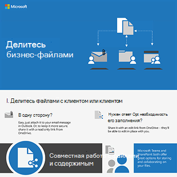
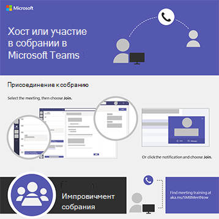
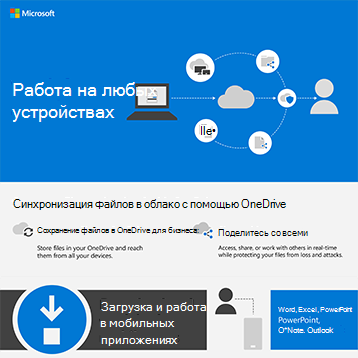
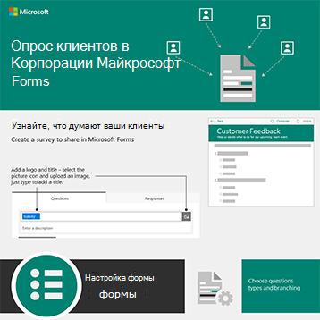

# Инфографика Microsoft 365 для пользователей

Эти инфографики представляют собой наилучшие методы работы и совместной работы в Microsoft 365. Поделитесь ими с пользователями, чтобы убедиться, что они пользуются преимуществами безопасного хранения и обмена файлами, проведения совместных собраний и других.

Дополнительные [загружаемые инфографики Office можно найти](https://support.microsoft.com/office/great-ways-to-work-with-office-6fe70269-b9a4-4ef0-a96e-7a5858b3bd5a) на учебном [сайте Microsoft 365.](https://support.microsoft.com/training)

## Советы по безопасности

Скачайте эту инфографику с советами по безопасности для членов вашей команды , независимо от того, является ли ваша команда бизнес-организацией или некоммерческой организацией, например политической кампанией:

| Item | Описание |
|:-----|:-----|
|   [Скачивание в формате PDF](../campaigns/downloads/M365CampaignsWhatCanUsersDoToSecure.pdf)  \  [Скачивание в качестве PowerPoint](../campaigns/downloads/M365CampaignsWhatCanUsersDoToSecure.pptx)| Поделитесь этими лучшими практиками для обеспечения безопасности сведений организации. Эта инфографика была создана для поддержки сотрудников политических кампаний, так как они ориентированы на сложных хакеров. Вы можете использовать PowerPoint для настройки этой инфографики для вашей организации. Связанная статья. Как рекомендации по безопасности [для Microsoft 365 влияют на пользователей](../campaigns/m365-campaigns-users.md)|

## Делитесь бизнес-файлами

Скачайте инфографику, чтобы получить краткий обзор способов обмена бизнес-файлами:
  
| Item | Описание |
|:-----|:-----|
|   [Скачивание в формате PDF](https://go.microsoft.com/fwlink/?linkid=2079435)  \  [Скачивание в качестве PowerPoint](https://go.microsoft.com/fwlink/?linkid=2079438) | Используйте эти методы при совместном использовании бизнес-файлов и совместной работы, чтобы обеспечить безопасность и защиту данных. Связанная статья: [Обзор общего доступа к бизнес-файлам](../business-video/overview-file-sharing.md)|

## Проведение собраний в Интернете

Скачайте инфографику, чтобы получить краткий обзор того, как присоединиться или провести онлайн-встречу с Microsoft Teams:

| Item | Описание |
|:-----|:-----|
|   [Скачивание в формате PDF](https://go.microsoft.com/fwlink/?linkid=2078712)  \  [Скачивание в качестве PowerPoint](https://go.microsoft.com/fwlink/?linkid=2079515) | Краткое представление о том, как провести или присоединиться к собранию в Интернете с Microsoft Teams. Связанная статья. [Проведение собраний в](../business-video/overview-online-meetings.md) Интернете для бизнеса|

## Работа на любых устройствах

Скачайте инфографику, чтобы получить советы по работе из любого места:

| Item | Описание |
|:-----|:-----|
|   [Скачивание в формате PDF](https://go.microsoft.com/fwlink/?linkid=2079451)  \  [Скачивание в качестве PowerPoint](https://go.microsoft.com/fwlink/?linkid=2079455) | Советы по настройкам мобильных устройств, позволяющих работать из любого места. Связанная статья: [Работа из любой точки](../business-video/work-from-anywhere.md)|

## Опрос клиентов с помощью форм

Скачайте инфографику, чтобы узнать, как обследованы клиенты (внутренние или внешние) с помощью Microsoft Forms:

| Item | Описание |
|:-----|:-----|
|   [Скачивание в формате PDF](https://go.microsoft.com/fwlink/?linkid=2079526)  \  [Скачивание в качестве PowerPoint](https://go.microsoft.com/fwlink/?linkid=2079446) | Чтобы узнать, что думают ваши клиенты, используйте Microsoft Forms. Связанная статья. [Сбор сведений с помощью Microsoft Forms](https://support.microsoft.com/topic/collect-information-with-microsoft-forms-a55d6e0d-04f6-45b8-b05f-b141b8ecb4d5)|
