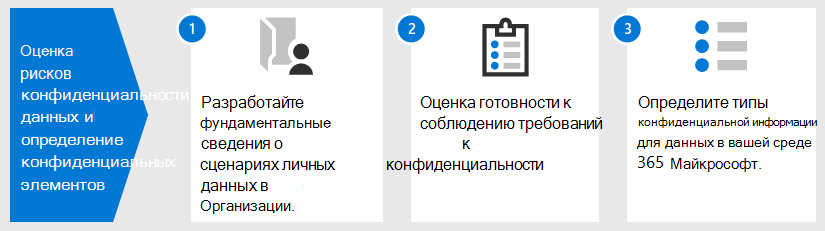

# Оценка рисков конфиденциальности данных и определение конфиденциальных элементов с помощью Microsoft 365

Оценка нормативов конфиденциальности данных и рисков, на которые может лагаться ваша организация, является ключевым первым шагом перед реализацией любых связанных действий по улучшению, включая те, которые достижимы с помощью функций и служб Microsoft 365. 

## Потенциально применимые нормы конфиденциальности данных

Хороший справочник по более широкой регулятивной структуре для нормативов конфиденциальности данных см. на портале [Microsoft Services Trust Portal,](https://servicetrust.microsoft.com/) а также в серии статей, посвященных общему регламенту по защите данных [(GDPR),](../compliance/gdpr.md)а также другим материалам по нормативным актам, на которые вы можете налагаться в вашей отрасли или регионе.

### GDPR

GDPR, наиболее известный и упоминаемый нормативными актами конфиденциальности данных, регулирует сбор, хранение, обработку и совместное использование любых персональных данных, которые относятся к идентифицируемого или идентифицируемого лица, который является резидентом Европейского Союза (ЕС). 

В соответствии со статьей 4 GDPR: 

- "персональные данные" — это любая информация, связанная с идентифицированным или идентифицируемым лицом ("субъект данных"); Идентифицируемым физическим лицом является лицо, которое может быть определено прямо или косвенно, в частности, по ссылке на идентификатор, такой как имя, идентификационный номер, данные о расположении, сетевой идентификатор или один или несколько факторов, характерных для физического, генетических, ментальный, экономического или социального удостоверения этого физического лица.

### ISO 27001

Соблюдение других стандартов, таких как ISO 27001, также было признано несколькими европейскими надзорными органами в качестве допустимого прокси-сервера намерения для людей, процессов и спектра технологий. Стандарты, которые он определяет, перекрывают и выполняют механизмы защиты на основе ISO-27001, могут рассматриваться как прокси-сервер, который выполняет некоторые обязательства по конфиденциальности в определенных обстоятельствах.

### Другие правила конфиденциальности данных

Другие важные нормативы конфиденциальности данных также определяют требования к обработке персональных данных.

В США к ним относятся Закон Калифорнии о защите потребителей[(CCPA),](../compliance/ccpa-faq.md)HIPAA-HITECH (закон о конфиденциальности в здравоохранения США) и Закон По о защите данных (GLBA) Для Соединенных Штатов. Кроме того, на месте или в разработке находятся дополнительные нормативные акты для конкретного состояния. 

Во всем мире к дополнительным примерам относятся Национальный закон Германии о реализации GDPR (BDSG), Закон Бразилии о защите данных (LGPD) и многие другие.

## Сопоставление нормативов с категориями технического контроля Microsoft 365

Многие нормативные акты, связанные с конфиденциальностью данных, имеют перекрывающиеся требования, поэтому перед разработкой какой-либо схемы технического контроля следует понять, к какому регламенту они подчиняются. 

Для более поздней ссылки в статьях этого общего решения в этой таблице приводятся выдержки из выборки нормативов конфиденциальности данных. 

| Норматив | Статья или раздел | Выдержка | Применимые категории технического контроля |
|:-------|:-----|:-------|:-------|
| GDPR | Статья 5(1)(f) | Персональные данные должны обрабатываться таким образом, чтобы обеспечить соответствующую безопасность персональных данных, включая защиту от несанкционированной или незаконной обработки, а также от случайной потери, уничтожения или повреждения, используя соответствующие технические или организационные меры ("целостность и конфиденциальность").  |  (Все)   Identity   Устройство   Защита от угроз   Защита информации   Управление информацией   Обнаружение и ответ |
|  | Статья (32)(1)(a) | Принимая во внимание состояние техники, затраты на реализацию и характер, область, контекст и цели обработки, а также риск различной вероятности и серьезности прав и свобод естественных лиц, контролер и обработчик должны реализовать соответствующие технические и организационные меры для обеспечения уровня безопасности, соответствующего риску , включая псевдоним по мере необходимости: (a) псевдонимизация и шифрование персональных данных. | Защита информации |
|  | Статья (13)(2)(a) | "... в момент получения персональных данных контролер должен предоставить субъекту данных следующую дополнительную информацию, необходимую для обеспечения справедливой и прозрачной обработки: (a) период, в течение которого будут храниться персональные данные, или, если это невозможно, критерии, используемые для определения этого периода. | Управление информацией |
|  | Статья (15)(1)(e) | Субъект данных имеет право получить от контролера подтверждение того, обрабатываются ли персональные данные, связанные с ним, и где это так, доступ к персональным данным и следующую информацию: (e) наличие права на запрос от контролера на исправление или стирание персональных данных или ограничение обработки персональных данных в отношении субъекта данных или на объект такой обработки | Обнаружение и ответ |
| LGPD | Статья 46 | Агенты обработки должны принять меры безопасности, технические и административные меры, способные защитить персональные данные от несанкционированного доступа и случайных или незаконных ситуаций уничтожения, потери, изменения, связи или любого типа несанкционированной или незаконной обработки. | Защита информации   Управление информацией   Обнаружение и ответ|
|  | Статья 48 | Оператор должен сообщать органам государственной власти и субъектам данных об инцидентах безопасности, которые могут повлечь за собой риски или соответствующий ущерб для субъектов данных. | Обнаружение и ответ |
| HIPPA-HITECH | 45 CFR 164.312(e)(1) | Реализуйте технические меры безопасности для защиты от несанкционированного доступа к охраняемой электронной медицинской информации, которая передается по сети электронных коммуникаций. | Защита информации |
|  | 45 C.F.R. 164.312(e)(2)(ii) | Реализуйте механизм шифрования охраняемой электронной медицинской информации, когда это будет сочтено целесообразным. | Защита информации |
|  | 45 CFR 164.312 (c) (2) | Реализуйте электронные механизмы, позволяющие убедиться, что охраняемая медицинская информация в электронном виде не была изменена или удалена несанкционированным образом. | Управление информацией |
|  | 45 CFR 164.316(b)(1)(i) | Если для документации действия, действия или оценки требуется документироваться, охраняем записи о действии, действии или оценке в письменной форме (которая может быть электронной) | Управление информацией |
|  | 45 CFR 164.316(b)(1)(ii) | Храните документацию, необходимую согласно требованиям из параграфа (b)(1) данного раздела, в течение 6 лет с даты ее создания или окончания срока ее действия (смотря какая из них наступит позже). | Управление информацией |
|  | 45 C.F.R. 164.308(a)(1)(ii)(D) | Внедрить процедуры для регулярного просмотра записей о действиях информационной системы, таких как журналы аудита, отчеты о доступе и отчеты об отслеживании инцидентов безопасности | Обнаружение и ответ |
|  | 45 C.F.R. 164.308(a)(6)(ii) | Выявляйте и реагируйте на предполагаемые или известные нарушения безопасности; смягчайте, насколько это практически возможно, вредные последствия нарушений безопасности, о которых известно соответствующему субъекту или деловому партнеру; документируйте нарушения безопасности и их последствия. | Обнаружение и ответ |
|  | 45 C.F.R. 164.312(b) | Внедрить аппаратные, программные и процедурные механизмы, которые записывают и проверяют деятельность в информационных системах, содержащих или которые используют охраняемую электронной медицинской информацией. | Обнаружение и ответ |
| CCPA | 1798.105(c) | Предприятие, которое получает проверяемый запрос от потребителя на удаление личной информации потребителя в соответствии с подразделом (a) этого раздела, должно удалить личную информацию потребителя из его записей и направить любым поставщикам услуг удалить личную информацию потребителя из своих записей. | Обнаружение и ответ |
|  | 1798.105(d) | (исключения 1798.105(c)   Компании или поставщику услуг не требуется выполнять запрос потребителя на удаление персональных данных потребителя, если необходимо, чтобы предприятие или поставщик услуг поддерживало личную информацию потребителя, чтобы: (дополнительные сведения см. в текущем регламенте). | Обнаружение и ответ |
|||||

>[!Important]
>Этот список не является исчерпывающим. Дополнительные  сведения о применимости указанных разделов к перечисленным категориям технического контроля можно найти в диспетчере соответствия требованиям или вашем юридическом или консультанте по обеспечению соответствия требованиям.
>

## Знание данных

Независимо от нормативных требований, на которые вы распространяете свои действия, различные типы пользовательских данных в вашей организации и за ее пределами взаимодействуют с вашими системами— это все важные факторы, которые могут повлиять на общую стратегию защиты персональных данных в зависимости от отраслевых и правительственных норм, применимой к вашей организации. Это относится к месту хранения персональных данных, типу и их объему и при каких обстоятельствах они были собраны.
 

### Перенос данных 

Данные также перемещаются по мере их обработки, уточнения и иных версий. Исходного снимка никогда не бывает достаточно. Необходимо постоянно зная ваши данные. Это одна из самых сложных задач для крупных организаций, которые обрабатывают значительные объемы персональных данных. Организации, которые не могут решить проблему "знать свои данные", потенциально могут получить очень высокий риск и возможные штрафы от надзорных органов.

 
### Где персональные данные

Чтобы решить проблемы конфиденциальности данных, вы не можете полагаться на общие понятия о том, где могут существовать персональные данные, как сейчас, так и в будущем. Правила конфиденциальности данных требуют, чтобы организации докажет, что они знают, где персональные данные на постоянной основе. Это делает важно сделать начальный снимок всех источников данных для возможного хранения личной информации, включая среду Microsoft 365, и установить механизмы для непрерывного мониторинга и обнаружения.

Если вы еще не оценивали общую готовность и риски, связанные с правилами конфиденциальности данных, используйте следующую трехшаговую структуру для начала работы. 

>[!Note]
>Данная статья и ее содержимое не предназначены для того, чтобы взять на себя роль юридических консультаций. Он просто предоставляет некоторые основные рекомендации и ссылки на средства, которые могут оказаться вам на помощь на ранних этапах оценки.
>
 
## Шаг 1. Разработайте основную информацию о сценариях использования персональных данных в организации 

Необходимо оценить степень риска конфиденциальности данных на основе типа персональных данных, которыми он управляет в настоящее время, где они хранятся, на какие защитные средства на них наложены, как управляется жизненный цикл и кто имеет к ним доступ. 

В качестве отправной точки важно указать, какие типы персональных данных существуют в среде Microsoft 365. Используйте эти категории:

- Данные о сотрудниках, необходимые для выполнения бизнес-функций
- Данные организации о своих бизнес-клиентах, партнерах и других отношениях в сценарии "бизнес-бизнес" (B2B)
- Данные организации о потребителях, которые предоставляют информацию в веб-службы, которыми организация управляет в сценарии "бизнес-клиент" (B2C)

Вот пример различных типов данных для типичных отделов организации.

Большая часть персональных данных, на которые налагается регламент конфиденциальности данных, обычно собираются и хранятся за пределами Microsoft 365. Все персональные данные из веб-приложений или мобильных приложений, с которыми сталкиваются пользователи, должны экспортироваться из таких приложений в Microsoft 365, чтобы в Microsoft 365 была тщательно проверять конфиденциальность данных. 

Уровень конфиденциальности данных в Microsoft 365 может быть более ограниченным по отношению к веб-приложениям и системам CRM, которые это решение не решает.

Кроме того, при оценке профиля риска важно помнить о следующих распространенных проблемах, связанных с соблюдением конфиденциальности данных:

 - **Распространение персональных данных.** Насколько точечная информация о заданной теме? Достаточно ли хорошо известно, чтобы убедить органы надзора в том, что имеются надлежащие средства контроля? Можно ли при необходимости его исследование и исправление?
- **Защита от эксфильтрации.** Как защитить персональные данные заданного типа или источника от компрометации и как реагировать на них?
- **Защита и риск.** Какие механизмы защиты информации подходят относительно риска и как обеспечить непрерывность и производительность бизнеса и свести к минимуму влияние на конечных пользователей, если требуется вмешательство конечных пользователей? Например, следует ли использовать ручную классификацию или шифрование?
- **Хранение персональных данных.** Сколько времени нужно хранить информацию, содержащую персональные данные, по допустимым бизнес-причинам и как избежать прошлых действий, которые не должны сохраняться навсегда, сбалансировав потребности в хранении для непрерывности бизнеса?
- **Обработка запросов субъектов данных.** Какие механизмы будут необходимы для обработки запросов субъектов данных (DSRs) и любых исправлений, таких как анонимизация, исправление и удаление?
- **Постоянный мониторинг и отчетность.** Какие методы ежедневного мониторинга, анализа и отчетности доступны для различных типов данных и источников?
- **Ограничения на обработку данных.** Существуют ли ограничения на использование данных для собираемой или хранимой с помощью этих методов, которые организация должна отражать в средствах контроля конфиденциальности? Например, обязательства по тому, что персонал отдела продаж не будет использовать персональные данные, могут потребовать от вашей организации на месте механизмов предотвращения передачи или хранения этой информации в системах, связанных с организацией продаж.

### Данные о сотрудниках, необходимые для выполнения бизнес-функций

Организации по своей природе должны собирать данные о сотрудниках в целях электронного удостоверения и отдела кадров в зависимости от того, на что они соглашаются в своих соглашениях о сотрудниках. Если человек работает в компании, это обычно не является проблемой. Организация может захотеть создать механизмы для предотвращения утечки или утечки персональных данных сотрудников злоумышленниками. 

Если сотрудник покидает компанию, организации обычно имеют процессы, процедуры, а также расписания хранения и удаления для удаления учетных записей пользователей, списания почтовых ящиков и личных дисков, а также изменения состояния сотрудника в таких системах, как системы управления персоналом. В ситуациях, когда речь идет о судебных разбирательствах, сотрудник или другая сторона, участвующие в судебном расследовании, могут иметь допустимые причины для получения сведений о персональных данных, хранимых в системах организации. В некоторых случаях эта сторона может запросить удаление или анонимную анонимную передачу таких данных. 

Для решения таких потребностей в организациях должны быть процессы и процедуры, которые устраняют профилактические, оперативно-разыскные и исправление, чтобы упростить такие запросы, заметив, что некоторые сведения о сотруднике могут быть разумно считаться критически важными для непрерывности бизнеса. Например, сведения о том, что отдельный автор файла или выполнил функцию. 

>[!Note]
>Сведения о методах анализа и устранения личных данных в Microsoft 365 см. в статье "Мониторинг [и реагирование".](information-protection-deploy-monitor-respond.md) Кроме того, может потребоваться использовать автоматизированные схемы классификации и защиты, чтобы контролировать персональные данные в организации, а также предотвращать их выход из организации в ситуациях злоумышленников. Дополнительные [сведения см. в](information-protection-deploy-protect-information.md) статье "Защита информации".
>
 
### Данные организации о своих бизнес-клиентах в сценарии B2B

Сбор B2B-сведений также является сложной задачей, так как вашей организации может потребоваться хранить записи имен клиентов и транзакций в различных системах для обеспечения непрерывности бизнеса, но при этом защитить эту информацию от случайного или злонамеренного раскрытия. Как и данные сотрудников, в организациях должны быть политики, процедуры и технические средства контроля для защиты таких данных, а также их возраст в соответствии с определенными расписаниями хранения и удаления. 

Как правило, контракты с внешними клиентами, партнерами и другими организациями, с которыми организация работает, будут иметь язык обработки таких данных, включая защиту, хранение и удаление как во время, так и после связи сущности с организацией. 

### Данные организации о потребителях, которые предоставляют сведения в веб-службы, которыми организация управляет в сценарии B2C

Эта категория является одной из наиболее важных для пользователей в области конфиденциальности данных из-за многих общедоступных экземпляров утечки данных клиентов. Это может быть преднамеренным, например третьей стороной по контракту с поставщиком или непреднамеренной, например путем вымещения злоумышленником. Защита данных потребителей — одна из основных причин, по которой ЕС и другие страны приняли эти нормы. Нормативы конфиденциальности данных, такие как GDPR и CCPA, требуют планирования:

- [Планы действий](../compliance/gdpr-action-plan.md) и [контрольные списки готовности к подотчетности](../compliance/gdpr-arc-office365.md)
- [Оценки влияния на защиту данных](../compliance/gdpr-data-protection-impact-assessments.md)
- [Уведомления о нарушении безопасности](../compliance/gdpr-breach-office365.md)
- [Запросы субъектов данных](../compliance/gdpr-dsr-office365.md)

Если ваша организация не занимается сбором данных напрямую из-за потребителя, эта категория может быть менее проблемной. Однако для обеспечения соответствия требованиям может потребоваться пройти процедуры, описанные в этих статьях.

### Сводка по шагу 1

Понимание рисков и нормативов конфиденциальности данных — это важный первый шаг, основанный на понимании сценариев персональных данных вашей организации.

Если у вас нет персональных данных от потребителей в среде Microsoft 365 или они ограничены определенными частями среды и потребность в техническом контроле зависит от того, существует ли экспозиция данных типа потребителя, этот технический контроль может потребоваться только в частях среды с высоким уровнем риска, а не везде.

Хотя рекомендации по внешней организации или стандартному набору контроля, например из диспетчера соответствия требованиям в Microsoft 365, могут помочь вам проинформировать о стратегии управления, выбор реализации должен быть обусловлен осведомленностью о наличии данных для оценки риска.

Большинство организаций могут быть подвержены одному из вышеперечисленного сценариев. Комплексный подход к оценке очень важен.

## Шаг 2. Оценка готовности к соблюдению нормативных требований к конфиденциальности данных

Хотя вопросы, связанные с GDPR, заданные в бесплатном средстве оценки [GDPR](https://www.microsoft.com/cyberassessment/en/gdpr/uso365) корпорации Майкрософт, можно начать с понимания общей готовности к конфиденциальности данных. 

Организации, на которые накладываются другие нормы конфиденциальности данных, такие как CCPA в США или LGPD Бразилии, также могут воспользоваться преимуществами этого средства в перечне готовности из-за перекрывающихся положений GDPR.

Оценка GDPR состоит из указанных здесь разделов.

| Раздел | Описание |
|:-------|:-----|
| Управление | <ol><li>Политика конфиденциальности явно сообщает, какие данные обрабатываются? </li><li>Вы регулярно проводите оценки влияния на конфиденциальность (PIAS)? </li><li> Используете ли вы средство для управления личной информацией? </li><li> Имеются ли у вас юридические полномочия для ведения бизнеса с использованием данных pi для любого конкретного лица? Отслеживает ли вы согласие на данные? </li><li> Отслеживаете, внедряйте и управляете средствами контроля аудита? Отслеживается ли утечка данных? </li></ol>|
| Удаление и уведомление | <ol><li>Даете ли вы явные инструкции по доступу к данным пользователей? </li><li> Есть ли задокументированные процессы обработки отказа от согласия? </li><li> У вас есть процесс автоматического удаления данных? </li><li>   Есть ли у вас процесс проверки удостоверений при работе с клиентом? </li></ol>|
| Меры риска и информационная безопасность | <ol><li>Используются ли средства для сканирования неструктурированных данных? </li><li>Все ли серверы находятся в состоянии "в курсе" и используют ли вы брандмауэры для их защиты? </li><li>Регулярно ли запускается резервное копирование серверов? </li><li>Активно ли отслеживаются утечки данных? </li><li>Шифруются ли неавтные данные и при передаче данных? </li></ol>|
| Управление политиками | <ol><li>Как управлять корпоративными правилами привязки (BCRs)? </li><li>Отслеживает ли вы согласие на данные? </li><li> В масштабах от 1 до 5, 5, которые полностью охвачены, охватываются ли контракты классификацией данных и требованиями к обработке? </li><li>Вы регулярно тестировали план реагирования на инциденты? </li><li>Какую политику вы используете для управления доступом? </li></ol>|
|||
 
## Шаг 3. Определение типов конфиденциальной информации, которые происходят в среде Microsoft 365. 

Этот шаг включает идентификацию определенных типов конфиденциальной информации, на которые налагаются определенные нормативные меры, а также их появление в среде Microsoft 365. 

Поиск контента в вашей среде, содержащего персональные данные, может быть сложной задачей, которая ранее содержала сочетание поиска соответствия, обнаружения электронных данных, Advanced eDiscovery, DLP и аудита. 

Благодаря новому  решению классификации данных в Центре администрирования соответствия  требованиям Майкрософт это стало намного проще с помощью обозревателя содержимого, который работает со встроенными или пользовательскими типами конфиденциальной информации, включая те, которые связаны с персональными данными.
 
### Типы конфиденциальной информации

В Центре администрирования соответствия требованиям (Майкрософт) предварительно загружено более 100 типов конфиденциальной информации, большинство из которых связаны с идентификацией и поиском персональных данных. Эти встроенные типы конфиденциальной информации могут помочь в определении и защите номеров кредитных карт, банковских счетов, паспортов и других данных на основе шаблонов, определенных регулярным выражением (regex) или функцией. Дополнительные сведения см. в статье [Что позволяют искать типы конфиденциальной информации](../compliance/what-the-sensitive-information-types-look-for.md).

Если необходимо определить и защитить конфиденциальные элементы определенного или регионального типа организации, например пользовательский формат для идентификации сотрудников или другие персональные данные, которые еще не охвачены встроенным типом конфиденциальной информации, можно создать пользовательский тип конфиденциальной информации с помощью указанных здесь методов. 

- PowerShell
- Настраиваемые правила с точным совпадением данных (EDM)
- С помощью пользовательского интерфейса администратора Центра соответствия требованиям, как выделено в статье "Использование оценки соответствия требованиям [и диспетчера соответствия требованиям"](information-protection-deploy-compliance.md)

Вы также можете настроить существующий встроенный тип конфиденциальной информации.

Дополнительные сведения см. в указанных здесь статьях.

- [Настройка встроенных типов конфиденциальной информации](../compliance/customize-a-built-in-sensitive-information-type.md)
- [Сведения о типах конфиденциальной информации](../compliance/sensitive-information-type-learn-about.md)
- [Создание пользовательского типа конфиденциальной информации в Центре безопасности и соответствия требованиям](../compliance/create-a-custom-sensitive-information-type.md)
- [Создание пользовательского типа конфиденциальной информации в PowerShell Центра безопасности и соответствия требованиям](../compliance/create-a-custom-sensitive-information-type-in-scc-powershell.md)
- [Создание пользовательских типов конфиденциальной информации с помощью классификации на основе точного совпадения данных](../compliance/create-custom-sensitive-information-types-with-exact-data-match-based-classification.md)

### Обозреватель содержимого

Важным средством для определения появления конфиденциальных элементов  в вашей среде является новый обозреватель содержимого в Центре администрирования соответствия требованиям Microsoft 365. Это автоматизированное средство для начального и текущего сканирования всей подписки Microsoft 365 на появление типов конфиденциальной информации и отображение результатов.
 
Новое средство обозревателя содержимого позволяет быстро определять расположения конфиденциальных элементов в вашей среде, используя встроенные типы конфиденциальной информации или пользовательские. Это может включать создание процесса и назначенную ответственность за регулярное изучение присутствия и расположения конфиденциальных элементов.

Наряду с другими действиями, которые выделены в этой статье, это дает отправную точку для определения общей подверженности риску, готовности и расположения конфиденциальных элементов для защиты с помощью запланированной конфигурации и мониторинга Microsoft 365. 

### Другие методы идентификации персональных данных в вашей среде

Помимо обозревателя содержимого, организации имеют доступ к возможности поиска контента для создания настраиваемого поиска для поиска персональных данных в своей среде с использованием расширенных условий поиска и пользовательских фильтров.

В этой статье предоставлены подробные инструкции по использованию средства "Поиск контента" для обнаружения [персональных данных.](../compliance/search-for-and-find-personal-data.md) Поиск контента и другие методы обнаружения также изучаются в [DSR для GDPR и CCPA.](../compliance/gdpr-dsr-office365.md#introduction-to-dsrs)

Дополнительные сведения о методах исследования и устранения последствий для персональных данных в Microsoft 365 предоставляются в статье о мониторе и [ответе.](information-protection-deploy-monitor-respond.md)

> [!NOTE]
> Чтобы узнать, какая конфиденциальную информацию у вас есть в файлах, хранимых локально, обратитесь к [Службе Azure Information Protection.](https://docs.microsoft.com/azure/information-protection/quickstart-findsensitiveinfo)

