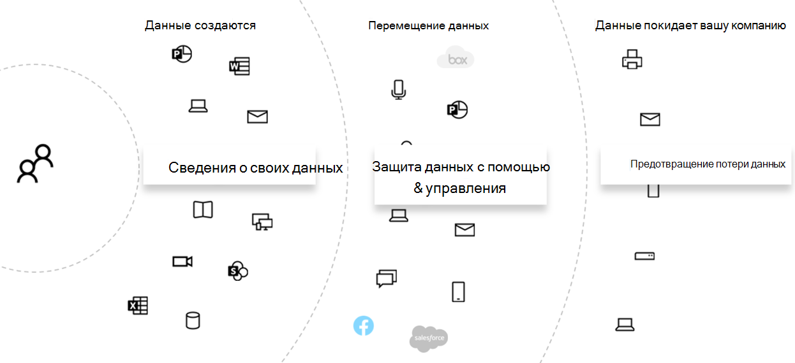
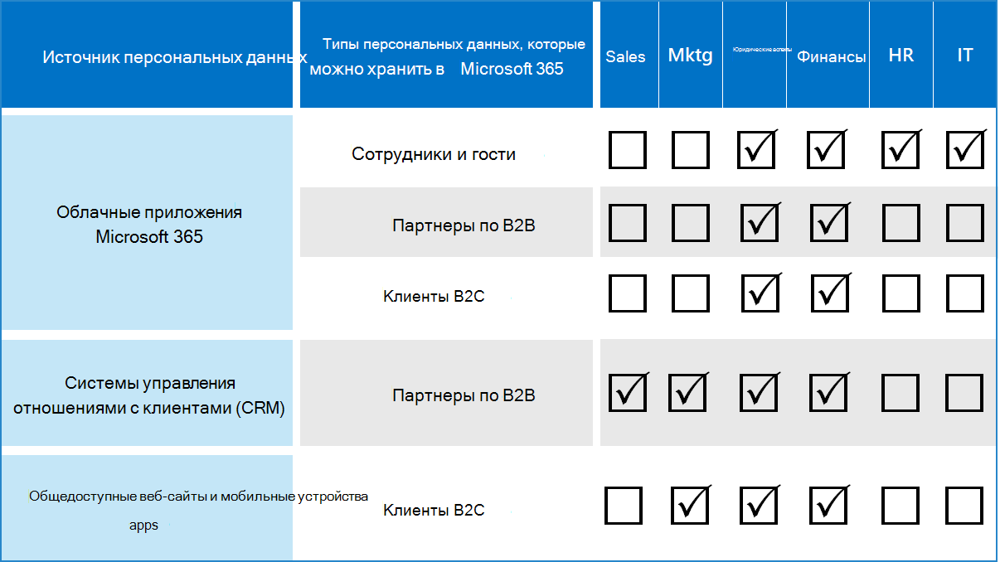

# Оценка рисков конфиденциальности данных и определение конфиденциальных элементов с помощью Microsoft 365Assess data privacy risks and identify sensitive items with Microsoft 365

Оценка требований к конфиденциальности данных и рисков, на которые распространяется организация, является ключевым первым шагом перед внедрением любых связанных действий по улучшению, в том числе доступных в Microsoft 365 функциях и службах.Assessing the data privacy regulations and risks that your organization is subject to is a key first step before implementing any related improvement actions, including those achievable with Microsoft 365 features and services. 

## Потенциально применяемые правила конфиденциальности данныхPotentially applicable data privacy regulations

Для получения хорошей справки по нормативным требованиям для обеспечения конфиденциальности данных на [портале trusting Services (Майкрософт](https://servicetrust.microsoft.com/) ) и серии статей, посвященных нормативным требованиям к [защите данных (GDPR)](../compliance/gdpr.md), а также других материалах по нормативным требованиям, которые могут быть соблюдены в вашей отрасли или регионе.For a good reference on the broader regulatory framework for data privacy regulations, see the [Microsoft Services Trust Portal](https://servicetrust.microsoft.com/) and the [series of articles on the General Data Protection Regulation (GDPR) regulation](../compliance/gdpr.md), as well as other materials on the regulations you may be subject to in your industry or region.

### GDPRGDPR

GDPR, наиболее хорошо известные и цитируемые положениями конфиденциальности данных, регулирует сбор, хранение, обработку и общий доступ к личным данным, связанным с идентифицированным или идентифицируемым естественным человеком, который является резидентным для Европейского союза (ЕС).The GDPR, the most well-known and cited of the data privacy regulations, regulates the collection, storage, processing, and sharing of any personal data that relates to an identified or identifiable natural person that is a resident of the European Union (EU). 

В соответствии со статьей GDPR 4:According to GDPR Article 4: 

- ' личные данные ' — любая информация, относящаяся к идентифицированному или идентифицируемому человеку (' subject Data '); идентифицируемый естественный пользователь — это один пользователь, который может быть идентифицирован, прямо или косвенно, в частности, с помощью ссылки на идентификатор, идентификационный номер, данные о местонахождении, сетевой идентификатор или один или несколько факторов, характерных для физического, фисиологикал, женетик,, экономической, экономической, культуры или социального удостоверения этого физического лица.‘personal data’ means any information relating to an identified or identifiable natural person (‘data subject’); an identifiable natural person is one who can be identified, directly or indirectly, in particular by reference to an identifier such as a name, an identification number, location data, an online identifier or to one or more factors specific to the physical, physiological, genetic, mental, economic, cultural or social identity of that natural person.

### ISO 27001ISO 27001

Соблюдение других стандартов, таких как ISO 27001, также было распознано несколькими европейскими администраторами как действительный прокси-сервер в спектре людей, процессов и технологий.Adherence to other standards like ISO 27001 has also been recognized by several European supervisory authorities as a valid proxy of intent across the people, process, and technology spectrum. Стандарты защиты, которые он задает, перекрываются и удовлетворяют требованиям механизмов защиты, основанных на стандарте ISO-27001, могут считаться прокси-сервером, который выполняет некоторые обязательства в определенных обстоятельствах.The standards it specifies overlap and adherence to ISO-27001-driven protection mechanisms may be considered a proxy fulfilling some privacy obligations in certain circumstances.

### Прочие правила конфиденциальности данныхOther data privacy regulations

Кроме того, в других выразительном нормативе по конфиденциальности данных указываются требования для обработки персональных данных.Other prominent data privacy regulations also specify requirements for the handling of personal data.

В США они включают ACT по защите потребителей в Калифорнии ([ККПА](../compliance/ccpa-faq.md)), HIPAA-HiTech (акт о конфиденциальности здравоохранения в США) и Грахам Лича Блили ACT (GLBA).In the United States, these include the California Consumer Protection Act ([CCPA](../compliance/ccpa-faq.md)), HIPAA-HITECH (United States health care privacy act), and the Graham Leach Bliley Act (GLBA). Дополнительные нормативные нормативы, зависящие от состояния, также находятся на месте или в разработке.Additional state-specific regulations are also in-place or in development. 

По всему миру дополнительные примеры включают в себя ACT по реализации национального GDPR для Германии (БДСГ), ACT по защите данных в Бразилии (ЛГПД) и многие другие.Around the world, additional examples include Germany's National GDPR Implementation Act (BDSG), the Brazil Data Protection Act (LGPD), and many others.

## Подстановка соответствия нормативным категориям Microsoft 365 Technical ControlRegulation mapping to Microsoft 365 technical control categories

Многие нормативы, связанные с конфиденциальностью данных, имеют перекрывающиеся требования, поэтому необходимо знать, какие нормативы они могут использовать до разработки любой схемы технического контроля.Many of the data privacy-related regulations have overlapping requirements, so you should understand which regulations they are subject to prior to developing any technical control scheme. 

Для дальнейшего использования в статьях этого общего решения в этой таблице приводятся выдержки из набора правил конфиденциальности данных.For later reference in the articles of this overall solution, this table provides excerpts from a sampling of data privacy regulations. 

| РегулированияRegulation | Статья/разделArticle/section | РывокExcerpt | Категории соответствующих технических контроляApplicable technical control categories |
|:-------|:-----|:-------|:-------|
| GDPRGDPR | Статья 5 (1) (f)Article 5(1)(f) | Личные данные должны обрабатываться таким образом, чтобы обеспечить соответствующую безопасность персональных данных, в том числе защиту от незаконной или незаконному обработки и от случайных потерь, уничтожения или повреждений, используя подходящие технические или организационные меры ("целостность и конфиденциальность").Personal data shall be processed in a manner that ensures appropriate security of the personal data, including protection against unauthorized or unlawful processing and against accidental loss, destruction or damage, using appropriate technical or organizational measures ('integrity and confidentiality'.  |  Ко(All)   IdentityIdentity   DeviceDevice   Защита от угрозThreat Protection   Защита информацииProtect information   Управление сведениямиGovern information   Обнаружение и ответDiscover and respond |
|  | Статья (32) (1) (a)Article (32)(1)(a) | Учитывая состояние рисунка, затраты на реализацию и природу, область действия, контекст и цели обработки, а также риск различной вероятности и серьезности для прав и свобод для природных людей, контроллер и процессор реализуют соответствующие технические и организационные меры, чтобы обеспечить уровень безопасности, соответствующий риску , включая Алиа в соответствии с требованиями: (a), псевдонимизацию и encryption персональных данных.Taking into account the state of the art, the costs of implementation and the nature, scope, context and purposes of processing as well as the risk of varying likelihood and severity for the rights and freedoms of natural persons, the controller and the processor shall implement appropriate technical and organizational measures to ensure a level of security appropriate to the risk, including inter alia as appropriate: (a) the pseudonymization and encryption of personal data. | Защита информацииProtect information |
|  | Статья (13) (2) (a)Article (13)(2)(a) | "... во время получения персональных данных контроллер должен предоставить субъекту данных следующие дополнительные сведения, необходимые для обеспечения достаточной и прозрачной обработки: (a) период, для которого будут храниться личные данные, или если это невозможно, критерии, используемые для определения этого периода."…the controller shall, at the time when personal data are obtained, provide the data subject with the following further information necessary to ensure fair and transparent processing: (a) the period for which the personal data will be stored, or if that is not possible, the criteria used to determine that period. | Управление сведениямиGovern information |
|  | Статья (15) (1) (e)Article (15)(1)(e) | Субъект данных имеет право получить от подтверждения контроллера до того, обрабатывались ли персональные данные, касающиеся его и там, где это происходит, можно получить доступ к личным данным и следующие сведения: (e) о существовании права на запрос от контроллера субъектов или стирание персональных данных или ограничений обработки персональных данных, касающихся субъекта данных или объекта для такой обработки.The data subject shall have the right to obtain from the controller confirmation as to whether or not personal data concerning him or her are being processed, and where that is the case, access to the personal data and the following information: (e) the existence of the right to request from the controller rectification or erasure of personal data or restriction of processing of personal data concerning the data subject or to object to such processing | Обнаружение и ответDiscover and respond |
| лгпдLGPD | Статья 46Article 46 | Агенты обработки обеспечивают безопасность, технические и административные меры для защиты персональных данных от несанкционированного доступа и случайных или незаконному ситуаций уничтожения, потери, изменения, обмена данными, а также любых типов неправильной обработки и незаконному.Processing agents shall adopt security, technical and administrative measures able to protect personal data from unauthorized accesses and accidental or unlawful situations of destruction, loss, alteration, communication, or any type of improper or unlawful processing. | Защита информацииProtect information   Управление сведениямиGovern information   Обнаружение и ответDiscover and respond|
|  | Статья 48Article 48 | Оператор должен сообщать органам государственной власти и субъектам данных об инцидентах безопасности, которые могут повлечь за собой риски или соответствующий ущерб для субъектов данных.The controller must communicate to the national authority and to the data subject the occurrence of a security incident that may create risk or relevant damage to the data subjects. | Обнаружение и ответDiscover and respond |
| ХИППА — HITECHHIPPA-HITECH | 45 CFR 164.312(e)(1)45 CFR 164.312(e)(1) | Реализуйте технические меры безопасности для защиты от несанкционированного доступа к охраняемой электронной медицинской информации, которая передается по сети электронных коммуникаций.Implement technical security measures to guard against unauthorized access to electronic protected health information that is being transmitted over an electronic communications network. | Защита информацииProtect information |
|  | 45 C.F.R.45 C.F.R. 164.312(e)(2)(ii)164.312(e)(2)(ii) | Реализуйте механизм шифрования охраняемой электронной медицинской информации, когда это будет сочтено целесообразным.Implement a mechanism to encrypt electronic protected health information whenever deemed appropriate. | Защита информацииProtect information |
|  | 45 CFR 164.312 (c) (2)45 CFR 164.312(c)(2) | Реализуйте электронные механизмы, позволяющие убедиться, что охраняемая медицинская информация в электронном виде не была изменена или удалена несанкционированным образом.Implement electronic mechanisms to corroborate that electronic protected health information has not been altered or destroyed in an unauthorized manner. | Управление сведениямиGovern information |
|  | 45 CFR 164.316(b)(1)(i)45 CFR 164.316(b)(1)(i) | Если для документирования действия, действия или оценки требуется задокументирована Эта вложенная часть, сохраните запись (которая может быть электронной) запись действия, действия или оценки.If an action, activity, or assessment is required by this subpart to be documented, maintain a written (which may be electronic) record of the action, activity, or assessment | Управление сведениямиGovern information |
|  | 45 CFR 164.316(b)(1)(ii)45 CFR 164.316(b)(1)(ii) | Храните документацию, необходимую согласно требованиям из параграфа (b)(1) данного раздела, в течение 6 лет с даты ее создания или окончания срока ее действия (смотря какая из них наступит позже).Retain the documentation required by paragraph (b)(1) of this section for 6 years from the date of its creation or the date when it last was in effect, whichever is later. | Управление сведениямиGovern information |
|  | 45 C.F.R.45 C.F.R. 164.308(a)(1)(ii)(D)164.308(a)(1)(ii)(D) | Реализация процедур для регулярного просмотра записей об активности информационных систем, таких как журналы аудита, отчеты Access и отчеты отслеживания инцидентов безопасностиImplement procedures to regularly review records of information system activity, such as audit logs, access reports, and security incident tracking reports | Обнаружение и ответDiscover and respond |
|  | 45 C.F.R.45 C.F.R. 164.308(a)(6)(ii)164.308(a)(6)(ii) | Выявляйте и реагируйте на предполагаемые или известные нарушения безопасности; смягчайте, насколько это практически возможно, вредные последствия нарушений безопасности, о которых известно соответствующему субъекту или деловому партнеру; документируйте нарушения безопасности и их последствия.Identify and respond to suspected or known security incidents; mitigate, to the extent practicable, harmful effects of security incidents that are known to the covered entity or business associate; and document security incidents and their outcomes. | Обнаружение и ответDiscover and respond |
|  | 45 C.F.R.45 C.F.R. 164.312(b)164.312(b) | Реализуйте механизмы аппаратного обеспечения, программного обеспечения и процедур, которые записывают и просматривают действия в информационных системах, содержащих или использующих электронную информацию о работоспособности.Implement hardware, software, and procedural mechanisms that record and examine activity in information systems that contain or use electronic protected health information. | Обнаружение и ответDiscover and respond |
| ккпаCCPA | 1798.105(c)1798.105(c) | Бизнес, который получает проверяемый запрос от потребителя для удаления персональных данных пользователя в соответствии с подразделением (a) этого раздела, удаляет персональные данные потребителя из записей и направляет всех поставщиков услуг удалить персональные данные пользователя из своих записей.A business that receives a verifiable request from a consumer to delete the consumer’s personal information pursuant to subdivision (a) of this section shall delete the consumer’s personal information from its records and direct any service providers to delete the consumer’s personal information from their records | Обнаружение и ответDiscover and respond |
|  | 1798.105(d)1798.105(d) | (исключения из 1798.105 (c)(exceptions to 1798.105(c)   Организация или поставщик услуг не обязаны отвечать на запрос пользователя на удаление персональных данных пользователя, если это необходимо для того, чтобы компания или поставщик услуг могли поддерживать персональные данные пользователя в следующих целях: (обратитесь к текущему нормативу для получения дополнительных сведений).A business or a service provider shall not be required to comply with a consumer’s request to delete the consumer’s personal information if it is necessary for the business or service provider to maintain the consumer’s personal information in order to: (refer to the current regulation for additional information). | Обнаружение и ответDiscover and respond |
|||||

>[!Important]
>Этот список не предназначен для использования в качестве исчерпывающего.This is not intended to be an exhaustive list. Обратитесь к [менеджеру по соответствию требованиям](../compliance/compliance-manager-overview.md) или юридическим требованиям, чтобы получить дополнительные сведения о применимости упомянутых разделов к спискам категорий технического контроля.Refer to [Compliance Manager](../compliance/compliance-manager-overview.md) or your legal or compliance advisor for further information on the applicability of the cited sections to the technical control categories listed.
>

## Знание данныхKnowing your data

Независимо от нормативных положений, на которые вы намерены наблюдаются различные типы пользовательских данных внутри и за пределами вашей организации, — это все важные факторы, которые могут повлиять на общую стратегию защиты персональных данных, в соответствии с отраслевыми и правительственными нормами, применяемыми к вашей организации.Regardless of the regulations you are subject to, where different user data types inside and outside your organization interact with your systems are all important factors that may impact your overall personal data protection strategy, subject to the industry and government regulations that apply to your organization. Сюда входят сведения о том, где хранятся персональные данные, каков тип и какова их часть, а также при каких обстоятельствах они были собраны.This includes where personal data is stored, what type it is, and how much of it there is, and under what circumstances it was collected.
 

### Перенос данныхData portability 

Кроме того, данные перемещаются по мере их обработки, уточнения и других версий, производных от него.Data also moves around over time as it is processed, refined, and other versions are derived from it. Исходный моментальный снимок не является достаточно допустимым.An initial snapshot is never enough. Необходимо выполнить непрерывный процесс, чтобы знать ваши данные.There needs to be an ongoing process for knowing your data. Это одна из крупнейших задач для крупных организаций, которые обрабатывают значительные тома персональных данных.This represents one of the biggest challenges for large organizations that handle significant volumes of personal data. Организациям, не связанным с "известными данными", потенциально важна высокая степень риска и возможности, которые могут быть признаны нормативными.Organizations that don't address the "know your data" problem could potentially end up with very high risk and possible fines from regulatory agencies.

 
### Где персональные данныеWhere the personal data is

Чтобы устранить конфиденциальность данных, вы не можете полагаться на общие понятия того, где вы считаете, что ваши персональные данные могут существовать как сейчас, так и в будущем.To address data privacy regulations, you can’t rely on general notions of where you think personal data might exist, either now or in the future. Требования к конфиденциальности данных требуют, чтобы организациям знали, в каких случаях персональные данные находятся на постоянной основе.Data privacy regulations require that organizations prove that they know where personal data is on an ongoing basis. Это позволяет создать исходный моментальный снимок всех источников данных для хранения персональных данных, включая среду Microsoft 365, а также установить механизмы для непрерывного отслеживания и обнаружения.This makes it important to take an initial snapshot of all your data sources for possible storage of personal information, including your Microsoft 365 environment, and establish mechanisms for ongoing monitoring and detection.

Если вы еще не оцените общую готовность и риски, связанные с положениями конфиденциальности данных, используйте следующую 3 – пошаговую платформу, чтобы приступить к работе.If you have not already assessed your overall readiness and risk associated with data privacy regulations, use the following 3-step framework to get started. 

>[!Note]
>Эта статья и ее контент не предназначены для юридических консультационных услуг.This article and its content are not meant to take the place of legal advisory services. Он просто предоставляет некоторые базовые рекомендации и ссылки на средства, которые могут быть доступны на ранних стадиях оценки.It just provides some basic guidance and links to tools that may be of assistance in the early stages of your assessment.
>
 
## Шаг 1: разработка основы работы с личными данными в ОрганизацииStep 1: Develop a foundational understanding of your organization's personal data scenarios 

Необходимо оценить риск для обеспечения конфиденциальности данных в зависимости от типа персональных данных, которые в настоящее время управляются, где они хранятся, какие защитные элементы управления размещаются на нем, как он управляет жизненным циклом и кто имеет доступ к нему.You need to gauge exposure to data privacy risk based on the type of personal data it currently manages, where it is stored, what protective controls are placed on it, how it's lifecycle is managed, and who has access to it. 

В качестве отправной точки важно учитывать, какие типы личных данных существуют в вашей среде Microsoft 365.As a starting point, it's important to inventory what types of personal data exist in your Microsoft 365 environment. Используйте следующие категории:Use these categories:

- Данные о сотрудниках, необходимые для выполнения повседневных бизнес-функцийEmployee data required to carry out day-to-day business functions
- Данные, которые организация посвящена корпоративным клиентам, партнерам и другим связям в сценарии "бизнес-бизнес" (B2B).Data the organization has about its business customers, partners, and other relationships in the business-to-business (B2B) scenario
- Данные, предоставляемые Организацией сведениями о клиентах, которые предоставляют сведения для веб-служб, которые организация управляет в сценарии "предприятие-клиент" (B2C).Data the organization has about consumers who provide information to online services that the organization manages in the business-to-customer (B2C) scenario

Ниже приведен пример различных типов данных для типичных отделов Организации.Here is an example of the different types of data for typical departments of an organization.

Большинство персональных данных, которые подчиняются норме конфиденциальности данных, обычно собираются и хранятся в Microsoft 365.Much of the personal data that is subject to data privacy regulation is typically collected and stored outside of Microsoft 365. Все персональные данные из веб-приложений и мобильных приложений должны быть экспортированы из таких приложений в Microsoft 365, чтобы обеспечить конфиденциальность данных в Microsoft 365.Any personal data from consumer-facing web or mobile applications would need to have been exported from such applications to Microsoft 365 in order to be subject to data privacy scrutiny within Microsoft 365. 

Сведения о конфиденциальности данных в Microsoft 365 могут быть более ограничены относительно веб-приложений и систем CRM, которые не являются решениями.Your data privacy exposure in Microsoft 365 may be more limited relative to your web applications and CRM systems, which this solution does not address.

Кроме того, важно учесть следующие распространенные проблемы соответствия конфиденциальности данных при оценке профиля риска:It's also important to think about the following common data privacy compliance challenges when evaluating your risk profile:

 - **Распространение персональных данных.****Personal data distribution.** Каким образом разбросаны сведения об определенном предмете?How scattered is information about a given subject? Достаточно ли хорошо известно, чтобы убедить соответствия нормативным требованиям, что и соответствующие элементы управления?Is it known well enough to convince regulatory bodies that proper controls are in place? Можно ли его исследовать и устранять при необходимости?Can it be investigated and remediated if needed?
- **Защита от ексфилтратион.****Protecting against exfiltration.** Как защитить персональные данные определенного типа или источника от взлома и как реагировать на них?How do you protect personal data of a given type or source from being compromised and how to respond if it was?
- **Защита и риск.****Protection vs. risk.** Какие механизмы защиты информации подходят для риска и как обеспечить бесперебойность работы и производительность бизнеса и минимизировать влияние конечного пользователя, если требуется вмешательство конечного пользователя?What information protection mechanisms are appropriate relative to the risk and how to maintain business continuity and productivity and minimize end-user impact if end-user intervention is required? Например, следует ли использовать классификацию или шифрование вручную?For example, should manual classification or encryption be used?
- **Хранение персональных данных.****Personal data retention.** Как долго данные, содержащие персональные данные, должны содержаться в допустимых бизнес-целях и как избежать прошлых практических рекомендаций, сбалансированных с учетом требований к хранению для непрерывности бизнеса?How long does information containing personal data need to be kept around for valid business reasons and how to avoid past keep-it-forever practices, balanced with retention needs for business continuity?
- **Обработка запросов субъектов данных.****Handling data subject requests.** Какие механизмы необходимы для обработки запросов субъектов данных (DSR) и любых действий, таких как анонимность, исправление и удаление?What mechanisms will be needed to handle data subject requests (DSRs) and any remedial actions, such as anonymization, redaction, and deletion?
- **Непрерывный мониторинг и создание отчетов.****Ongoing monitoring and reporting.** Какие приемы ежедневного мониторинга, исследования и создания отчетов доступны для различных типов и источников данных?What sort of day-to-day monitoring, investigative, and reporting techniques are available for the different data types and sources?
- **Ограничения на обработку данных.****Limitations on data processing.** Существуют ли ограничения на использование данных для информации, собранной или сохраненной с помощью этих методов, которые Организация должна отразить в элементах управления конфиденциальностью?Are there limitations on data use for information collected or stored through these methods that the organization must reflect in privacy controls? Например, обязательства, которые не будут использоваться сотрудниками отдела продаж, могут потребовать, чтобы ваша организация выводила механизмы для предотвращения переноса или хранения этих сведений в системах, связанных с организацией продаж.For example, commitments that personal data will not be used by sales personnel may require your organization to put mechanisms in place to prevent transfer or storage of that information in systems associated with the sales organization.

### Данные о сотрудниках, необходимые для выполнения повседневных бизнес-функцийEmployee data required to carry out day-to-day business functions

Организациям необходимо собрать данные сотрудников для электронных удостоверений и целей отдела кадров в соответствии с тем, что они принимаю в своих соглашениях сотрудников.Organizations by nature need to collect data on employees for electronic identity and HR purposes, subject to what they agree to in their employee agreements. Если пользователь работает в компании, обычно это не проблема.As long as a person works for a company, this is typically not an issue. Организация может попытаться разместить механизмы, чтобы предотвратить несанкционированные субъекты от ексфилтратинг или утечки персональных данных сотрудников.The organization may want to put mechanisms in place to prevent malicious actors from exfiltrating or leaking employee personal data. 

Если пользователь покидает компанию, организациям обычно необходимы процессы, процедуры и расписания хранения и удаления для удаления учетных записей пользователей, списания почтовых ящиков и персональных дисков, а также для изменения состояния сотрудника (например, систем отдела кадров).If a person leaves a company, organizations typically have processes, procedures, and retention and deletion schedules for removing user accounts, decommissioning mailboxes and personal drives, and changing the employee status in things like human resources systems. В случаях, когда используется судебное разбирательство, сотрудник или другая сторона для судебного исследования могут иметь действительные причины для получения сведений о персональных данных, хранящихся в системах организации.For situations where litigation is involved, an employee or another party to a legal investigation may have valid reasons for obtaining information about personal data stored in the organization's systems. В некоторых случаях эта сторона может запросить удаление или анонимность таких данных.On some occasions, that party may request that such data be removed or anonymized. 

Для решения таких задач организациям должны быть назначены процессы и процедуры на месте, где для обеспечения поддержки подобных запросов необходимо учитывать, что некоторые сведения о сотруднике могут считаться важными для обеспечения непрерывности бизнеса.To address such needs, organizations should have processes and procedures in place that address preventative, detective, and remedial needs to facilitate such requests, noting that some information about an employee may be reasonably considered crucial for business continuity. Например, сведения о том, кто создал файл или выполнил функцию.For example, information that an individual authored a file or performed a function. 

>[!Note]
>Для получения информации о приемах и исправлениях персональных данных в Microsoft 365, ознакомьтесь со [статьей мониторинг и ответ](information-protection-deploy-monitor-respond.md).For investigative and remediation techniques for personal data in Microsoft 365, see the [monitor and respond article](information-protection-deploy-monitor-respond.md). Кроме того, можно использовать автоматическую классификацию и схемы защиты, чтобы обеспечить управление личными данными в пределах организации, а также предотвратить выход Организации из вредоносных программ.You may also want to employ automated classification and protection schemes to make sure that personal data is controlled while inside the organization, as well as prevent it from leaving the organization in malicious actor situations. Для получения дополнительных сведений ознакомьтесь со [статьей Защитите информацию](information-protection-deploy-protect-information.md) .See the [protect information article](information-protection-deploy-protect-information.md) for more information.
>
 
### Данные, которые организация посвящена корпоративным клиентам в сценарии B2BData the organization has about its business customers in the B2B scenario

Сбор сведений о B2B также является сложной задачей, так как организации может требоваться хранить записи имен клиентов и транзакций в различных системах для целей непрерывности бизнеса, но защитить эту информацию от случайного или злонамеренного ексфилтратион.Collection of B2B information is also a challenge because your organization might need to keep records of customer names and transactions in its various systems for business continuity purposes yet protect that information from inadvertent or malicious exfiltration. Как и данные о сотрудниках, организациям необходимы политики, процедуры и технические элементы управления на месте для защиты таких данных, а также для их последующего хранения в соответствии с определенными расписаниями хранения и удаления.Like employee data, organizations must have policies, procedures, and technical controls in place to protect such data, as well as age it out according to defined retention and deletion schedules. 

Как правило, контракты с внешними клиентами, партнерами и другими сущностями, с которыми работает организация, будут использовать языковые адресацию таких данных, как защита, хранение и удаление, как во время, так и после того, как сущность имеет связь с Организацией.Typically, contracts with external customers, partners, and the other entities with which the organization does business will have language addressing the handling of such data, including protection, retention, and deletion both during and after the entity has a relationship with the organization. 

### Данные, предоставляемые Организацией о потребителях, которые предоставляют сведения для веб-служб, которые организация управляет в сценарии B2CData the organization has about consumers who provide information to online services that the organization manages in the B2C scenario

Эта категория является одним из самых людей, которые думают о конфиденциальности данных, так как многие общедоступные экземпляры утечек данных клиентов.This category is the one most people think about for data privacy, due to many public instances of customer data leakage. Это может быть намеренно, например третья сторона в контракте к поставщику или неумышленное, например перехвачена вредоносным субъектом.This can be intentional, such as a third party under contract to the provider, or unintentional, such as exfiltrated by a malicious actor. Защита данных потребителей является одной из основных причин, в которых в ЕС и других были присвоены эти нормативные требования.Consumer data protection is one of the primary reasons the EU and others enacted these regulations. Для обеспечения конфиденциальности данных, таких как GDPR и ККПА, необходимо выполнить планирование следующих действий:Data privacy regulations like GDPR and CCPA require you to do planning for:

- [Планы действий](../compliance/gdpr-action-plan.md) и [Контрольные списки готовности к отчетности](../compliance/gdpr-arc-office365.md)[Action plans](../compliance/gdpr-action-plan.md) and [accountability readiness checklists](../compliance/gdpr-arc-office365.md)
- [Оценка влияния на защиту данныхData Protection Impact Assessments](../compliance/gdpr-data-protection-impact-assessments.md)
- [Уведомления о нарушенияхBreach notifications](../compliance/gdpr-breach-office365.md)
- [Запросы субъектов данныхData subject requests](../compliance/gdpr-dsr-office365.md)

Если ваша организация не выполняет большое количество данных прямого сбора данных от потребителя, эта категория может быть меньше, чем проблема.If your organization does not do a lot of direct-from-consumer data collection, this category may be less of an issue. Тем не менее, для обеспечения соответствия вам, возможно, потребуется выполнить описанные в этих статьях процессы.However, you may still need to go through the processes outlined in these articles to achieve compliance.

### Сводка по этапу 1Step 1 summary

Общие сведения о рисках и нормах конфиденциальности данных — это важный первый шаг, основанный на понимании сценариев личных данных в Организации.Understanding your exposure to risk and data privacy regulation is an important first step that is based on a foundational understanding of your organization's personal data scenarios.

Если у вас нет персональных данных от потребителей в среде Microsoft 365 или они ограничены определенными частями среды, а для технического контроля указана доступность данных типа "потребитель", то этот технический элемент управления может потребоваться только в частях среды с высоким уровнем риска, а не везде.If you don't have personal data from consumers in your Microsoft 365 environment or it is confined to certain parts of the environment and the need for a technical control is predicated on there being consumer-type data exposure, then that technical control may only need to be employed in high risk parts of the environment, not everywhere.

Несмотря на то, что в соответствии с рекомендациями по внешней организации или стандартному набору элементов управления, например из оценки соответствия в Microsoft 365, может помочь помощь в решении стратегии управления, выбор реализации должен осуществляться с помощью средства информирования о наличии данных, чтобы оценить реальную угрозу риска.While an external organization or standard control set recommendation, such as from Compliance Score in Microsoft 365, may help inform your control strategy, your choice of implementation should be driven by data inventory awareness to quantify your real risk exposure.

Большинство организаций будут иметь некоторую раскрытие с одним из описанных выше сценариев.Most organizations will have some exposure to one of the above scenarios. Важно получить целостный подход к оценке.Taking a holistic approach to assessment is important.

## Шаг 2: Оценка готовности к соблюдению нормативных требований для обеспечения конфиденциальности данныхStep 2: Assess your readiness for complying with data privacy regulations

Как и в случае с GDPR, вопросы, связанные с бесплатным [средством оценки Microsoft GDPR](https://www.microsoft.com/cyberassessment/en/gdpr/uso365) , позволяют лучше понять общую готовность к конфиденциальности данных.Although specific to GDPR, the questions posed in the free [Microsoft GDPR assessment tool](https://www.microsoft.com/cyberassessment/en/gdpr/uso365) provide a good start towards understanding your overall data privacy readiness. 

Организации, которые подчиняются другим нормативам конфиденциальности данных, таким как ККПА в США или ЛГПД, могут также воспользоваться преимуществами этого инструмента в перекрывающихся подрешениях, отличных от готовности, с помощью GDPR.Organizations subject to other data privacy regulations, such as CCPA in the United States or Brazil’s LGPD, may also benefit from this tool’s inventory of readiness due overlapping provisions with the GDPR.

Оценка GDPR состоит из следующих разделов:GDPR assessment consists of these sections:

| | |
|:-------|:-----|
| УправлениеGovernance | <ol><li>Явно ли политика конфиденциальности определяет, какие данные обрабатываются?Does your privacy policy explicitly state what data information is being processed? </li><li>Вы регулярно выполняете оценки влияния на конфиденциальность (PIA)?Do you regularly run Privacy Impact Assessments (PIAs)? </li><li> Используется какое-либо средство для управления личными данными (PI)?Do you use a tool to manage personal information (PI)? </li><li> Есть ли у вас юридическая информация о том, что вы можете вести бизнес с использованием данных Пи для каждого конкретного пользователя?Do you have legal authority to conduct business using PI data on any given individual? Отслеживается согласие на наличие данных?Do you track consent for data? </li><li> Отслеживаете, внедряет и управляете элементы управления аудитом?Do you track, implement, and manage audit controls? Отслеживается утечка данных?Do you monitor for data leaks? </li></ol>|
| Уведомление об удалении &Deletion & Notification | <ol><li>Предоставляются ли явные инструкции по доступу к данным пользователей?Do you give explicit instructions on how users' data can be accessed? </li><li> Есть ли у вас документированные процессы для обработки согласия на отправку отказа?Do you have documented processes in place for handling opt out consent? </li><li>   У вас есть автоматизированный процесс удаления данных?Do you have an Automated Deletion process for data? </li><li>   Есть ли у вас процесс проверки подлинности при работе с клиентом?Do you have a process to validate identity when engaging with a customer? </li></ol>|
| Снижение риска и безопасность данныхRisk Mitigation and Information Security | <ol><li>Используются средства для сканирования неструктурированных данных?Do you use tools to scan unstructured data? </li><li>Все серверы обновлены и используют брандмауэры для их защиты?Are all servers up to date, and do you leverage firewalls to protect them? </li><li>Выполняются регулярные архивации серверов?Do you run regular backups of your servers? </li><li>Следите за утечками данных?Do you actively monitor for data leaks? </li><li>Шифруете данные в REST и при передаче?Do you encrypt your data at rest and in transmission? </li></ol>|
| Управление политикамиPolicy Management | <ol><li>Как управлять корпоративными правилами привязки (БКРС)?How do you manage your Binding Corporate Rules (BCRs)? </li><li>Отслеживается согласие на наличие данных?Do you track consent for data? </li><li> В масштабе от 1 до 5, в полном объеме освещено, что контракты охватывают классификацию данных и требования к обработке?On a scale of 1 to 5, 5 being completely covered, do your contracts cover data classifications and handling requirements? </li><li>Вы регулярно тестируете план реагирования на инциденты?Do you have and regularly test an incident response plan? </li><li>Какая политика используется для управления доступом?What policy do you use to manage access? </li></ol>|
|||
 
## Шаг 3: определение типов конфиденциальной информации, которая выполняется в среде Microsoft 365.Step 3: Identify sensitive information types that occur in your Microsoft 365 environment. 

Этот шаг включает идентификацию определенных типов конфиденциальной информации, которые относятся к определенным нормативным элементам управления, а также к их появлению в среде Microsoft 365.This step involves identification of particular sensitive information types that are subject to specific regulatory controls, as well as the occurrence of them in your Microsoft 365 environment. 

Поиск контента в вашей среде с личными возможностями может быть задачей формидабле, прежде чем использовать поиск соответствия требованиям, обнаружение электронных данных, расширенные DLP DLP и аудит.Finding content in your environment containing personal can be a formidable task, formerly involving a combination of using Compliance Search, eDiscovery, Advanced eDiscovery DLP, and auditing. 

С помощью нового решения **классификации данных** в центре администрирования соответствия Майкрософт это стало значительно проще благодаря возможности [обозревателя содержимого](../compliance/data-classification-content-explorer.md) , которая работает со встроенными или пользовательскими типами конфиденциальных данных, включая те, которые относятся к персональным данным.With the new **Data Classification** solution in the Microsoft Compliance admin center, this has become much easier with the [Content Explorer](../compliance/data-classification-content-explorer.md) capability, which works with either built-in or custom sensitive information types, including those related to personal data.
 
### Типы конфиденциальной информацииSensitive information types

Центр администрирования Майкрософт для обеспечения соответствия требованиям поставляется в предварительной версии с более чем 100 конфиденциальной информацией, большинство из них относятся к идентификации и размещению персональных данных.The Microsoft Compliance admin center comes pre-loaded with over 100 sensitive information types, most of them related to identifying and locating personal data. Эти встроенные типы конфиденциальной информации могут помочь определить и защитить номера кредитных карт, номера банковских счетов, номера паспортов и многое другое, на основе шаблонов, определенных регулярным выражением (Regex) или функцией.These built-in sensitive information types can help identify and protect credit card numbers, bank account numbers, passport numbers, and more, based on patterns that are defined by a regular expression (regex) or a function. Дополнительные сведения см. в статье [Что позволяют искать типы конфиденциальной информации](../compliance/what-the-sensitive-information-types-look-for.md).To learn more, see [What the sensitive information types look for](../compliance/what-the-sensitive-information-types-look-for.md).

Если вам нужно определить и защитить тип конфиденциальных элементов, например пользовательский формат для идентификаторов сотрудников, или другие персональные данные, еще не охваченные встроенным типом конфиденциальной информации, можно создать настраиваемый тип конфиденциальной информации с помощью следующих методов:If you need to identify and protect an organization-specific or regional type of sensitive items, such as a custom format for employee IDs, or other personal information not already covered by a built-in sensitive information type, you can create a custom sensitive information type with these methods: 

- PowerShellPowerShell
- Настраиваемые правила с точным совпадением данных (модель EDM)Custom rules with exact data match (EDM)
- Через пользовательский интерфейс администрирования центра соответствия требованиям, выделенный в [статье Оценка соответствия требованиям и диспетчере соответствия требованиям](information-protection-deploy-compliance.md)Through the Compliance Center admin UI, as highlighted in the [Use Compliance Score and Compliance Manager article](information-protection-deploy-compliance.md)

Кроме того, можно настроить существующий встроенный тип конфиденциальной информации.You can also customize an existing, built-in sensitive information type.

Для получения дополнительных сведений ознакомьтесь со следующими статьями:See these articles for more information:

- [Настройка встроенных типов конфиденциальной информацииCustomize a built-in sensitive information type](../compliance/customize-a-built-in-sensitive-information-type.md)
- [Пользовательские типы конфиденциальной информацииCustom sensitive information types](../compliance/custom-sensitive-info-types.md)
- [Создание пользовательского типа конфиденциальной информации в Центре безопасности и соответствия требованиямCreate a custom sensitive information type in the Security & Compliance Center](../compliance/create-a-custom-sensitive-information-type.md)
- [Создание пользовательского типа конфиденциальной информации в PowerShell Центра безопасности и соответствия требованиямCreate a custom sensitive information type in Security & Compliance Center PowerShell](../compliance/create-a-custom-sensitive-information-type-in-scc-powershell.md)
- [Создание пользовательских типов конфиденциальной информации с классификацией на основе точного совпадения данныхCreate custom sensitive information types with Exact Data Match based classification](../compliance/create-custom-sensitive-information-types-with-exact-data-match-based-classification.md)

### Обозреватель контентаContent Explorer

Важное средство, используемое для определения того, что конфиденциальные элементы в вашей среде — это новый [Обозреватель содержимого](../compliance/data-classification-content-explorer.md) в центре администрирования соответствия требованиям Microsoft 365.An important tool that for determining the occurrence of sensitive items in your environment is the new [Content Explorer](../compliance/data-classification-content-explorer.md) in the Microsoft 365 Compliance admin center. Это автоматизированное средство для первоначального и текущего сканирования всей подписки на Microsoft 365 на наличие типов конфиденциальной информации и отображения результатов.It's an automated tool for initial and ongoing scanning of your entire Microsoft 365 subscription for the occurrence of sensitive information types and display of the results.
 
Средство "Создание содержимого" позволяет быстро определить расположение конфиденциальных элементов в среде с помощью встроенных типов конфиденциальных данных или настраиваемых.The new Content Explorer tool allows you to quickly identify the locations of sensitive items in your environment, using either built-in sensitive information types or custom ones. Это может включать в себя установку процесса и ответственность за регулярное исследование присутствия и расположения конфиденциальных элементов.This may involve establishing a process and assigned responsibility to regularly investigate the presence and location of sensitive items.

Кроме того, в этой статье описываются другие действия, которые позволяют получить отправную точку для определения общей степени риска, готовности и расположения конфиденциальных элементов для защиты через запланированную конфигурацию и мониторинг Microsoft 365.Along with the other steps highlighted in this article, this provides a starting point for identifying your overall risk exposure, readiness, and location of sensitive items to protect through planned Microsoft 365 configuration and monitoring. 

### Другие методы идентификации персональных данных в вашей средеOther methods to identify personal data in your environment

В дополнение к обозревателю контента организации имеют доступ к возможностям поиска контента для создания настраиваемых поисков для поиска персональных данных в своей среде с помощью расширенных условий поиска и настраиваемых фильтров.In addition to the Content Explorer, organizations have access to the Content Search capability to produce custom searches to find personal data in their environment, using advanced search criteria and custom filters.

Подробное руководство по использованию поиска контента для обнаружения персональных данных представлено в [этой статье](../compliance/search-for-and-find-personal-data.md).Detailed guidance on the use of Content Search for discovery of personal data is provided in [this article](../compliance/search-for-and-find-personal-data.md). Поиск контента и другие методы обнаружения также рассматриваются в [DSR для GDPR и ККПА](../compliance/gdpr-dsr-office365.md#introduction-to-dsrs).Content Search and other discovery techniques are also explored in [DSRs for the GDPR and CCPA](../compliance/gdpr-dsr-office365.md#introduction-to-dsrs).

Дополнительные сведения об анализе и исправлении для персональных данных в Microsoft 365 представлены в [статье мониторинг и ответ](information-protection-deploy-monitor-respond.md).Additional insights on investigative and remediation techniques for personal data in Microsoft 365 are provided in the [monitor and respond article](information-protection-deploy-monitor-respond.md).
