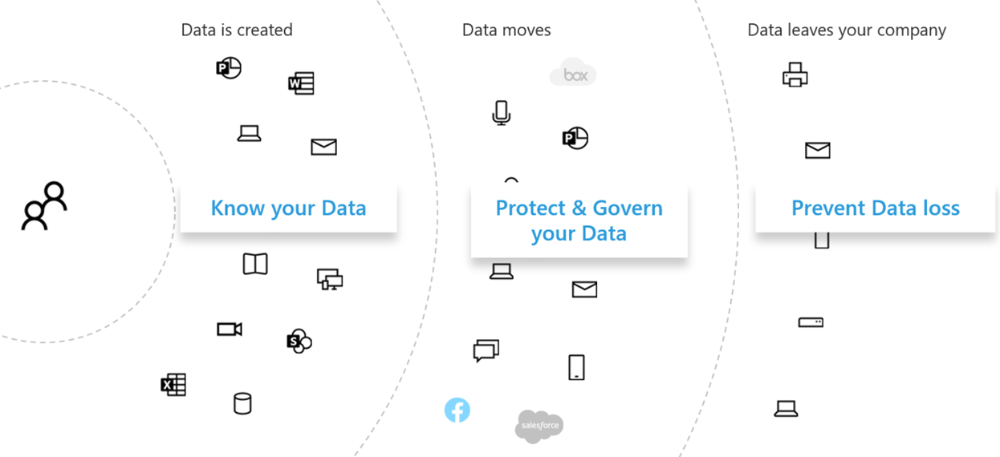

# Оценка рисков конфиденциальности данных и определение конфиденциальных элементов с помощью Microsoft 365Assess data privacy risks and identify sensitive items with Microsoft 365

Оценка нормативов конфиденциальности данных и рисков, на которые может лагаться ваша организация, является ключевым первым шагом перед реализацией любых связанных действий по улучшению, включая те, которые достижимы с помощью функций и служб Microsoft 365.Assessing the data privacy regulations and risks that your organization is subject to is a key first step before implementing any related improvement actions, including those achievable with Microsoft 365 features and services. 

## Потенциально применимые нормы конфиденциальности данныхPotentially applicable data privacy regulations

Хороший справочник по более широкой регулятивной структуре для нормативов конфиденциальности данных см. на портале [Microsoft Services Trust Portal,](https://servicetrust.microsoft.com/) а также в серии статей, посвященных общему регламенту по защите данных [(GDPR),](../compliance/gdpr.md)а также другим материалам по нормативным актам, на которые вы можете налагаться в вашей отрасли или регионе.For a good reference on the broader regulatory framework for data privacy regulations, see the [Microsoft Services Trust Portal](https://servicetrust.microsoft.com/) and the [series of articles on the General Data Protection Regulation (GDPR) regulation](../compliance/gdpr.md), as well as other materials on the regulations you may be subject to in your industry or region.

### GDPRGDPR

GDPR, наиболее известный и упоминаемый нормативными актами о конфиденциальности данных, регулирует сбор, хранение, обработку и совместное использование любых персональных данных, которые связаны с идентифицированным или идентифицируемым лицом, которое является резидентом Европейского Союза (ЕС).The GDPR, the most well-known and cited of the data privacy regulations, regulates the collection, storage, processing, and sharing of any personal data that relates to an identified or identifiable natural person that is a resident of the European Union (EU). 

В соответствии со статьей 4 GDPR:According to GDPR Article 4: 

- "персональные данные" — это любая информация, связанная с идентифицированным или идентифицируемым лицом ("субъект данных"); Идентифицируемым физическим лицом является лицо, которое может быть определено прямо или косвенно, в частности, по ссылке на идентификатор, такой как имя, идентификационный номер, данные о расположении, сетевой идентификатор или один или несколько факторов, характерных для физического, физического, генетических, ментальный, экономического или социального удостоверения этого физического лица.‘personal data’ means any information relating to an identified or identifiable natural person (‘data subject’); an identifiable natural person is one who can be identified, directly or indirectly, in particular by reference to an identifier such as a name, an identification number, location data, an online identifier or to one or more factors specific to the physical, physiological, genetic, mental, economic, cultural or social identity of that natural person.

### ISO 27001ISO 27001

Соблюдение других стандартов, таких как ISO 27001, также было распознано несколькими европейской надзорной органами как допустимый прокси намерения для людей, процессов и спектра технологий.Adherence to other standards like ISO 27001 has also been recognized by several European supervisory authorities as a valid proxy of intent across the people, process, and technology spectrum. Стандарты, которые он определяет, перекрывают и выполняют механизмы защиты на основе ISO-27001, могут рассматриваться как прокси-сервер, который выполняет некоторые обязательства по конфиденциальности в определенных обстоятельствах.The standards it specifies overlap and adherence to ISO-27001-driven protection mechanisms may be considered a proxy fulfilling some privacy obligations in certain circumstances.

### Другие нормативы конфиденциальности данныхOther data privacy regulations

Другие важные нормативы конфиденциальности данных также определяют требования к обработке персональных данных.Other prominent data privacy regulations also specify requirements for the handling of personal data.

В США к ним относятся Закон Калифорнии о защите потребителей[(CCPA),](../compliance/ccpa-faq.md)HIPAA-HITECH (закон США о защите данных в сфере здравоохранения) и Закон О защите данных (GLBA) Для Сша.In the United States, these include the California Consumer Protection Act ([CCPA](../compliance/ccpa-faq.md)), HIPAA-HITECH (United States health care privacy act), and the Graham Leach Bliley Act (GLBA). Кроме того, на месте или в разработке находятся дополнительные нормативные акты для конкретного состояния.Additional state-specific regulations are also in-place or in development. 

Во всем мире к дополнительным примерам относятся Национальный закон Германии о реализации GDPR (BDSG), Закон Бразилии о защите данных (LGPD) и многие другие.Around the world, additional examples include Germany's National GDPR Implementation Act (BDSG), the Brazil Data Protection Act (LGPD), and many others.

## Сопоставление нормативов с категориями технического контроля Microsoft 365Regulation mapping to Microsoft 365 technical control categories

Многие нормативные акты, связанные с конфиденциальностью данных, имеют перекрывающиеся требования, поэтому перед разработкой какой-либо схемы технического контроля следует понять, к какому регламенту они подчиняются.Many of the data privacy-related regulations have overlapping requirements, so you should understand which regulations they are subject to prior to developing any technical control scheme. 

Для более поздней ссылки в статьях этого общего решения в этой таблице приводятся выдержки из выборки нормативов конфиденциальности данных.For later reference in the articles of this overall solution, this table provides excerpts from a sampling of data privacy regulations. 

| НормативRegulation | Статья/разделArticle/section | ВыдержкаExcerpt | Применимые категории технического контроляApplicable technical control categories |
|:-------|:-----|:-------|:-------|
| GDPRGDPR | Статья 5(1)(f)Article 5(1)(f) | Персональные данные должны обрабатываться таким образом, чтобы обеспечить соответствующую безопасность персональных данных, включая защиту от несанкционированной или незаконной обработки, а также от случайной потери, уничтожения или повреждения, используя соответствующие технические или организационные меры ("целостность и конфиденциальность").Personal data shall be processed in a manner that ensures appropriate security of the personal data, including protection against unauthorized or unlawful processing and against accidental loss, destruction or damage, using appropriate technical or organizational measures ('integrity and confidentiality'.  |  (Все)(All)   УдостоверениеIdentity   УстройствоDevice   Защита от угрозThreat Protection   Защита информацииProtect information   Управление информациейGovern information   Обнаружение и ответDiscover and respond |
|  | Статья (32)(1)(a)Article (32)(1)(a) | Принимая во внимание состояние техники, затраты на реализацию и характер, область, контекст и цели обработки, а также риск различной вероятности и серьезности прав и свобод естественных лиц, контролер и обработчик должны реализовать соответствующие технические и организационные меры для обеспечения уровня безопасности, соответствующего риску , включая псевдоним по мере необходимости: (a) псевдонимизация и шифрование персональных данных.Taking into account the state of the art, the costs of implementation and the nature, scope, context and purposes of processing as well as the risk of varying likelihood and severity for the rights and freedoms of natural persons, the controller and the processor shall implement appropriate technical and organizational measures to ensure a level of security appropriate to the risk, including inter alia as appropriate: (a) the pseudonymization and encryption of personal data. | Защита информацииProtect information |
|  | Статья (13)(2)(a)Article (13)(2)(a) | "... в момент получения персональных данных контролер должен предоставить субъекту данных следующую дополнительную информацию, необходимую для обеспечения справедливой и прозрачной обработки: (a) период, в течение которого будут храниться персональные данные, или, если это невозможно, критерии, используемые для определения этого периода."…the controller shall, at the time when personal data are obtained, provide the data subject with the following further information necessary to ensure fair and transparent processing: (a) the period for which the personal data will be stored, or if that is not possible, the criteria used to determine that period. | Управление информациейGovern information |
|  | Статья (15)(1)(e)Article (15)(1)(e) | Субъект данных имеет право получить от контролера подтверждение того, обрабатываются ли персональные данные, связанные с ним, и где это так, доступ к персональным данным и следующая информация: (e) наличие права на запрос от контролера на исправление или стирание персональных данных или ограничение обработки персональных данных в отношении субъекта данных или на объект такой обработкиThe data subject shall have the right to obtain from the controller confirmation as to whether or not personal data concerning him or her are being processed, and where that is the case, access to the personal data and the following information: (e) the existence of the right to request from the controller rectification or erasure of personal data or restriction of processing of personal data concerning the data subject or to object to such processing | Обнаружение и ответDiscover and respond |
| LGPDLGPD | Статья 46Article 46 | Агенты обработки должны принять меры безопасности, технические и административные меры, способные защитить персональные данные от несанкционированного доступа и случайных или незаконных ситуаций уничтожения, потери, изменения, связи или любого типа несанкционированной или незаконной обработки.Processing agents shall adopt security, technical and administrative measures able to protect personal data from unauthorized accesses and accidental or unlawful situations of destruction, loss, alteration, communication, or any type of improper or unlawful processing. | Защита информацииProtect information   Управление информациейGovern information   Обнаружение и ответDiscover and respond|
|  | Статья 48Article 48 | Оператор должен сообщать органам государственной власти и субъектам данных об инцидентах безопасности, которые могут повлечь за собой риски или соответствующий ущерб для субъектов данных.The controller must communicate to the national authority and to the data subject the occurrence of a security incident that may create risk or relevant damage to the data subjects. | Обнаружение и ответDiscover and respond |
| HIPPA-HITECHHIPPA-HITECH | 45 CFR 164.312(e)(1)45 CFR 164.312(e)(1) | Реализуйте технические меры безопасности для защиты от несанкционированного доступа к охраняемой электронной медицинской информации, которая передается по сети электронных коммуникаций.Implement technical security measures to guard against unauthorized access to electronic protected health information that is being transmitted over an electronic communications network. | Защита информацииProtect information |
|  | 45 C.F.R.45 C.F.R. 164.312(e)(2)(ii)164.312(e)(2)(ii) | Реализуйте механизм шифрования охраняемой электронной медицинской информации, когда это будет сочтено целесообразным.Implement a mechanism to encrypt electronic protected health information whenever deemed appropriate. | Защита информацииProtect information |
|  | 45 CFR 164.312 (c) (2)45 CFR 164.312(c)(2) | Реализуйте электронные механизмы, позволяющие убедиться, что охраняемая медицинская информация в электронном виде не была изменена или удалена несанкционированным образом.Implement electronic mechanisms to corroborate that electronic protected health information has not been altered or destroyed in an unauthorized manner. | Управление информациейGovern information |
|  | 45 CFR 164.316(b)(1)(i)45 CFR 164.316(b)(1)(i) | Если для документации действия, действия или оценки требуется документироваться, охраняем записи о действии, действии или оценке в письменной форме (которая может быть электронной)If an action, activity, or assessment is required by this subpart to be documented, maintain a written (which may be electronic) record of the action, activity, or assessment | Управление информациейGovern information |
|  | 45 CFR 164.316(b)(1)(ii)45 CFR 164.316(b)(1)(ii) | Храните документацию, необходимую согласно требованиям из параграфа (b)(1) данного раздела, в течение 6 лет с даты ее создания или окончания срока ее действия (смотря какая из них наступит позже).Retain the documentation required by paragraph (b)(1) of this section for 6 years from the date of its creation or the date when it last was in effect, whichever is later. | Управление информациейGovern information |
|  | 45 C.F.R.45 C.F.R. 164.308(a)(1)(ii)(D)164.308(a)(1)(ii)(D) | Внедрить процедуры для регулярного просмотра записей о действиях информационной системы, таких как журналы аудита, отчеты о доступе и отчеты об отслеживании инцидентов безопасностиImplement procedures to regularly review records of information system activity, such as audit logs, access reports, and security incident tracking reports | Обнаружение и ответDiscover and respond |
|  | 45 C.F.R.45 C.F.R. 164.308(a)(6)(ii)164.308(a)(6)(ii) | Выявляйте и реагируйте на предполагаемые или известные нарушения безопасности; смягчайте, насколько это практически возможно, вредные последствия нарушений безопасности, о которых известно соответствующему субъекту или деловому партнеру; документируйте нарушения безопасности и их последствия.Identify and respond to suspected or known security incidents; mitigate, to the extent practicable, harmful effects of security incidents that are known to the covered entity or business associate; and document security incidents and their outcomes. | Обнаружение и ответDiscover and respond |
|  | 45 C.F.R.45 C.F.R. 164.312(b)164.312(b) | Внедрить аппаратные, программные и процедурные механизмы, которые записывают и проверяют деятельность в информационных системах, содержащих или которые используют охраняемую электронной медицинской информацией.Implement hardware, software, and procedural mechanisms that record and examine activity in information systems that contain or use electronic protected health information. | Обнаружение и ответDiscover and respond |
| CCPACCPA | 1798.105(c)1798.105(c) | Предприятие, которое получает проверяемый запрос от потребителя на удаление личной информации потребителя в соответствии с подразделом (a) этого раздела, должно удалить личную информацию потребителя из его записей и понабдить поставщиков услуг удалить личную информацию потребителя из своих записей.A business that receives a verifiable request from a consumer to delete the consumer’s personal information pursuant to subdivision (a) of this section shall delete the consumer’s personal information from its records and direct any service providers to delete the consumer’s personal information from their records | Обнаружение и ответDiscover and respond |
|  | 1798.105(d)1798.105(d) | (исключения 1798.105(c)(exceptions to 1798.105(c)   Компании или поставщику услуг не требуется выполнять запрос потребителя на удаление персональных данных потребителя, если необходимо, чтобы предприятие или поставщик услуг поддерживало личную информацию потребителя, чтобы: (дополнительные сведения см. в текущем регламенте).A business or a service provider shall not be required to comply with a consumer’s request to delete the consumer’s personal information if it is necessary for the business or service provider to maintain the consumer’s personal information in order to: (refer to the current regulation for additional information). | Обнаружение и ответDiscover and respond |
|||||

>[!Important]
>Этот список не является исчерпывающим.This is not intended to be an exhaustive list. Дополнительные  сведения о применимости указанных разделов к перечисленным категориям технического контроля можно найти в диспетчере соответствия требованиям или юридическом консультанте или консультанте по обеспечению соответствия требованиям.Refer to [Compliance Manager](../compliance/compliance-manager.md) or your legal or compliance advisor for further information on the applicability of the cited sections to the technical control categories listed.
>

## Знание данныхKnowing your data

Независимо от нормативных требований, на которые вы распространяете свои действия, различные типы пользовательских данных в вашей организации и за ее пределами взаимодействуют с вашими системами— это все важные факторы, которые могут повлиять на общую стратегию защиты персональных данных в зависимости от отраслевых и правительственных норм, применимой к вашей организации.Regardless of the regulations you are subject to, where different user data types inside and outside your organization interact with your systems are all important factors that may impact your overall personal data protection strategy, subject to the industry and government regulations that apply to your organization. Это относится к месту хранения персональных данных, типу и их объему и при каких обстоятельствах они были собраны.This includes where personal data is stored, what type it is, and how much of it there is, and under what circumstances it was collected.
 

### Перенос данныхData portability 

Данные также перемещаются по мере их обработки, уточнения и иных версий.Data also moves around over time as it is processed, refined, and other versions are derived from it. Исходного снимка никогда не бывает достаточно.An initial snapshot is never enough. Необходимо постоянно зная ваши данные.There needs to be an ongoing process for knowing your data. Это одна из самых сложных задач для крупных организаций, которые обрабатывают значительные объемы персональных данных.This represents one of the biggest challenges for large organizations that handle significant volumes of personal data. Организации, которые не могут решить проблему "знать ваши данные", потенциально могут получить очень высокий риск и возможные штрафы от надзорных органов.Organizations that don't address the "know your data" problem could potentially end up with very high risk and possible fines from regulatory agencies.

 
### Где персональные данныеWhere the personal data is

Чтобы решить проблемы конфиденциальности данных, вы не можете полагаться на общие понятия о том, где могут существовать персональные данные, как сейчас, так и в будущем.To address data privacy regulations, you can’t rely on general notions of where you think personal data might exist, either now or in the future. Правила конфиденциальности данных требуют, чтобы организации докажет, что они знают, где персональные данные на постоянной основе.Data privacy regulations require that organizations prove that they know where personal data is on an ongoing basis. Это делает важно сделать начальный снимок всех источников данных для возможного хранения персональных данных, включая среду Microsoft 365, и установить механизмы для непрерывного мониторинга и обнаружения.This makes it important to take an initial snapshot of all your data sources for possible storage of personal information, including your Microsoft 365 environment, and establish mechanisms for ongoing monitoring and detection.

Если вы еще не оценивали общую готовность и риски, связанные с правилами конфиденциальности данных, используйте следующую трехшаговую структуру для начала работы.If you have not already assessed your overall readiness and risk associated with data privacy regulations, use the following 3-step framework to get started. 

>[!Note]
>Данная статья и ее содержимое не предназначены для того, чтобы взять на себя роль юридических консультаций.This article and its content are not meant to take the place of legal advisory services. В нем просто есть некоторые основные рекомендации и ссылки на средства, которые могут быть вам необходимы на ранних этапах оценки.It just provides some basic guidance and links to tools that may be of assistance in the early stages of your assessment.
>
 
## Шаг 1. Разработайте основы для сценариев персональных данных в организацииStep 1: Develop a foundational understanding of your organization's personal data scenarios 

Необходимо оценить степень риска конфиденциальности данных на основе типа персональных данных, которыми он управляет в настоящее время, где они хранятся, на какие защитные средства на них наложены, как управляется жизненный цикл и кто имеет к ним доступ.You need to gauge exposure to data privacy risk based on the type of personal data it currently manages, where it is stored, what protective controls are placed on it, how it's lifecycle is managed, and who has access to it. 

В качестве отправной точки важно указать, какие типы персональных данных существуют в среде Microsoft 365.As a starting point, it's important to inventory what types of personal data exist in your Microsoft 365 environment. Используйте эти категории:Use these categories:

- Данные о сотрудниках, необходимые для выполнения бизнес-функцийEmployee data required to carry out day-to-day business functions
- Данные организации о своих бизнес-клиентах, партнерах и других отношениях в сценарии "бизнес-бизнес" (B2B)Data the organization has about its business customers, partners, and other relationships in the business-to-business (B2B) scenario
- Данные организации о потребителях, которые предоставляют сведения в веб-службы, которыми организация управляет в сценарии "бизнес-клиент" (B2C)Data the organization has about consumers who provide information to online services that the organization manages in the business-to-customer (B2C) scenario

Вот пример различных типов данных для типичных отделов организации.Here is an example of the different types of data for typical departments of an organization.

Большая часть персональных данных, на которые налагается регулирование конфиденциальности данных, обычно собираются и хранятся за пределами Microsoft 365.Much of the personal data that is subject to data privacy regulation is typically collected and stored outside of Microsoft 365. Все персональные данные из веб-приложений или мобильных приложений, с которыми сталкиваются пользователи, должны быть экспортироваться из таких приложений в Microsoft 365, чтобы в Microsoft 365 была тщательно проверять конфиденциальность данных.Any personal data from consumer-facing web or mobile applications would need to have been exported from such applications to Microsoft 365 in order to be subject to data privacy scrutiny within Microsoft 365. 

Уровень конфиденциальности данных в Microsoft 365 может быть более ограниченным по отношению к веб-приложениям и системам CRM, которые это решение не решает.Your data privacy exposure in Microsoft 365 may be more limited relative to your web applications and CRM systems, which this solution does not address.

Кроме того, при оценке профиля риска важно помнить о следующих распространенных проблемах, связанных с соблюдением конфиденциальности данных:It's also important to think about the following common data privacy compliance challenges when evaluating your risk profile:

 - **Распространение персональных данных.****Personal data distribution.** Насколько точечная информация о заданной теме?How scattered is information about a given subject? Достаточно ли известно, чтобы убедить органы надзора в том, что имеются надлежащие средства контроля?Is it known well enough to convince regulatory bodies that proper controls are in place? Можно ли при необходимости его исследование и исправление?Can it be investigated and remediated if needed?
- **Защита от эксфильтрации.****Protecting against exfiltration.** Как защитить персональные данные заданного типа или источника от компрометации и как реагировать на них?How do you protect personal data of a given type or source from being compromised and how to respond if it was?
- **Защита и риск.****Protection vs. risk.** Какие механизмы защиты информации подходят относительно риска и как обеспечить непрерывность и производительность бизнеса и свести к минимуму влияние на конечных пользователей, если требуется вмешательство конечных пользователей?What information protection mechanisms are appropriate relative to the risk and how to maintain business continuity and productivity and minimize end-user impact if end-user intervention is required? Например, следует ли использовать ручную классификацию или шифрование?For example, should manual classification or encryption be used?
- **Хранение персональных данных.****Personal data retention.** Сколько времени нужно хранить информацию, содержащую персональные данные, по допустимым бизнес-причинам и как избежать прошлых действий, которые не должны сохраняться навсегда, сбалансировав потребности в хранении для непрерывности бизнеса?How long does information containing personal data need to be kept around for valid business reasons and how to avoid past keep-it-forever practices, balanced with retention needs for business continuity?
- **Обработка запросов субъектов данных.****Handling data subject requests.** Какие механизмы будут необходимы для обработки запросов субъектов данных (DSRs) и любых исправлений, таких как анонимизация, исправление и удаление?What mechanisms will be needed to handle data subject requests (DSRs) and any remedial actions, such as anonymization, redaction, and deletion?
- **Постоянный мониторинг и отчетность.****Ongoing monitoring and reporting.** Какие методы ежедневного мониторинга, анализа и отчетности доступны для различных типов данных и источников?What sort of day-to-day monitoring, investigative, and reporting techniques are available for the different data types and sources?
- **Ограничения на обработку данных.****Limitations on data processing.** Существуют ли ограничения на использование данных для собираемой или хранимой с помощью этих методов, которые организация должна отражать в средствах контроля конфиденциальности?Are there limitations on data use for information collected or stored through these methods that the organization must reflect in privacy controls? Например, обязательства по тому, что персонал отдела продаж не будет использовать персональные данные, могут потребовать от вашей организации на месте механизмов предотвращения передачи или хранения этой информации в системах, связанных с организацией продаж.For example, commitments that personal data will not be used by sales personnel may require your organization to put mechanisms in place to prevent transfer or storage of that information in systems associated with the sales organization.

### Данные о сотрудниках, необходимые для выполнения бизнес-функцийEmployee data required to carry out day-to-day business functions

Организации по своей природе должны собирать данные о сотрудниках в целях электронного удостоверения и отдела кадров в зависимости от того, на что они согласились в своих соглашениях о сотрудниках.Organizations by nature need to collect data on employees for electronic identity and HR purposes, subject to what they agree to in their employee agreements. Если человек работает в компании, это обычно не является проблемой.As long as a person works for a company, this is typically not an issue. Организация может захотеть создать механизмы для предотвращения утечки или утечки персональных данных сотрудников злоумышленниками.The organization may want to put mechanisms in place to prevent malicious actors from exfiltration or leaking employee personal data. 

Если сотрудник покидает компанию, организации обычно имеют процессы, процедуры, а также расписания хранения и удаления для удаления учетных записей пользователей, списания почтовых ящиков и личных дисков, а также изменения состояния сотрудника в таких системах, как системы управления персоналом.If a person leaves a company, organizations typically have processes, procedures, and retention and deletion schedules for removing user accounts, decommissioning mailboxes and personal drives, and changing the employee status in things like human resources systems. В ситуациях, когда речь идет о судебных разбирательствах, сотрудник или другая сторона, участвующие в судебном расследовании, могут иметь допустимые причины для получения сведений о персональных данных, хранимых в системах организации.For situations where litigation is involved, an employee or another party to a legal investigation may have valid reasons for obtaining information about personal data stored in the organization's systems. В некоторых случаях эта сторона может запросить удаление или анонимную анонимную обработку таких данных.On some occasions, that party may request that such data be removed or anonymized. 

Для решения таких потребностей в организациях должны быть процессы и процедуры, которые устраняют профилактические, оперативно-разыскные и исправление, чтобы упростить такие запросы, заметив, что некоторые сведения о сотруднике могут быть разумно считаться критически важными для непрерывности бизнеса.To address such needs, organizations should have processes and procedures in place that address preventative, detective, and remedial needs to facilitate such requests, noting that some information about an employee may be reasonably considered crucial for business continuity. Например, сведения о том, что отдельный автор файла или выполнил функцию.For example, information that an individual authored a file or performed a function. 

>[!Note]
>Сведения о методах анализа и устранения личных данных в Microsoft 365 см. в статье "Мониторинг [и реагирование".](information-protection-deploy-monitor-respond.md)For investigative and remediation techniques for personal data in Microsoft 365, see the [monitor and respond article](information-protection-deploy-monitor-respond.md). Кроме того, может потребоваться использовать автоматизированные схемы классификации и защиты, чтобы контролировать персональные данные в организации, а также предотвращать их выход из организации в ситуациях злоумышленников.You may also want to employ automated classification and protection schemes to make sure that personal data is controlled while inside the organization, as well as prevent it from leaving the organization in malicious actor situations. Дополнительные [сведения см. в](information-protection-deploy-protect-information.md) статье "Защита информации".See the [protect information article](information-protection-deploy-protect-information.md) for more information.
>
 
### Данные организации о своих бизнес-клиентах в сценарии B2BData the organization has about its business customers in the B2B scenario

Сбор B2B-сведений также является сложной задачей, так как вашей организации может потребоваться хранить записи имен клиентов и транзакций в различных системах для обеспечения непрерывности бизнеса, но при этом защитить эту информацию от случайного или злонамеренного раскрытия.Collection of B2B information is also a challenge because your organization might need to keep records of customer names and transactions in its various systems for business continuity purposes yet protect that information from inadvertent or malicious exfiltration. Как и данные сотрудников, в организациях должны быть политики, процедуры и технические средства контроля для защиты таких данных, а также их возраст в соответствии с определенными расписаниями хранения и удаления.Like employee data, organizations must have policies, procedures, and technical controls in place to protect such data, as well as age it out according to defined retention and deletion schedules. 

Как правило, контракты с внешними клиентами, партнерами и другими организациями, с которыми организация работает, будут иметь язык обработки таких данных, включая защиту, хранение и удаление как во время, так и после связи сущности с организацией.Typically, contracts with external customers, partners, and the other entities with which the organization does business will have language addressing the handling of such data, including protection, retention, and deletion both during and after the entity has a relationship with the organization. 

### Данные организации о потребителях, которые предоставляют сведения в веб-службы, которыми организация управляет в сценарии B2CData the organization has about consumers who provide information to online services that the organization manages in the B2C scenario

Эта категория является одной из наиболее важных для пользователей в области конфиденциальности данных из-за многих общедоступных экземпляров утечки данных клиентов.This category is the one most people think about for data privacy, due to many public instances of customer data leakage. Это может быть преднамеренным, например третьей стороной по контракту с поставщиком или непреднамеренной, например путем вымещения злоумышленником.This can be intentional, such as a third party under contract to the provider, or unintentional, such as exfiltration by a malicious actor. Защита данных потребителей — одна из основных причин, по которой ЕС и другие страны приняли эти нормы.Consumer data protection is one of the primary reasons the EU and others enacted these regulations. Нормативы конфиденциальности данных, такие как GDPR и CCPA, требуют планирования:Data privacy regulations like GDPR and CCPA require you to do planning for:

- [Планы действий](../compliance/gdpr-action-plan.md) и [контрольные списки готовности к подотчетности](../compliance/gdpr-arc-office365.md)[Action plans](../compliance/gdpr-action-plan.md) and [accountability readiness checklists](../compliance/gdpr-arc-office365.md)
- [Оценки влияния на защиту данныхData Protection Impact Assessments](../compliance/gdpr-data-protection-impact-assessments.md)
- [Уведомления о нарушении безопасностиBreach notifications](../compliance/gdpr-breach-office365.md)
- [Запросы субъектов данныхData subject requests](../compliance/gdpr-dsr-office365.md)

Если ваша организация не занимается сбором данных напрямую из-за потребителя, эта категория может быть менее проблемной.If your organization does not do a lot of direct-from-consumer data collection, this category may be less of an issue. Однако для обеспечения соответствия требованиям может потребоваться пройти процедуры, описанные в этих статьях.However, you may still need to go through the processes outlined in these articles to achieve compliance.

### Сводка по шагу 1Step 1 summary

Понимание рисков и нормативов конфиденциальности данных — это важный первый шаг, основанный на основах сценариев персональных данных в вашей организации.Understanding your exposure to risk and data privacy regulation is an important first step that is based on a foundational understanding of your organization's personal data scenarios.

Если у вас нет персональных данных от потребителей в среде Microsoft 365 или они ограничены определенными частями среды и потребность в техническом контроле зависит от того, существует ли экспозиция данных типа потребителя, этот технический контроль может потребоваться только в частях среды с высоким уровнем риска, а не везде.If you don't have personal data from consumers in your Microsoft 365 environment or it is confined to certain parts of the environment and the need for a technical control is predicated on there being consumer-type data exposure, then that technical control may only need to be employed in high risk parts of the environment, not everywhere.

Хотя рекомендации по внешней организации или стандартному набору контроля, например из диспетчера соответствия требованиям в Microsoft 365, могут помочь вам проинформировать о стратегии управления, выбор реализации должен быть обусловлен осведомленностью о наличии данных для оценки риска.While an external organization or standard control set recommendation, such as from Compliance Manager in Microsoft 365, may help inform your control strategy, your choice of implementation should be driven by data inventory awareness to quantify your real risk exposure.

Большинство организаций могут быть подвержены одному из вышеперечисленного сценариев.Most organizations will have some exposure to one of the above scenarios. Комплексный подход к оценке очень важен.Taking a holistic approach to assessment is important.

## Шаг 2. Оценка готовности к соблюдению нормативных требований к конфиденциальности данныхStep 2: Assess your readiness for complying with data privacy regulations

Хотя вопросы, связанные с GDPR, заданные в бесплатном средстве оценки [GDPR](https://www.microsoft.com/cyberassessment/en/gdpr/uso365) корпорации Майкрософт, можно начать с понимания общей готовности к конфиденциальности данных.Although specific to GDPR, the questions posed in the free [Microsoft GDPR assessment tool](https://www.microsoft.com/cyberassessment/en/gdpr/uso365) provide a good start towards understanding your overall data privacy readiness. 

Организации, на которые накладываются другие нормы конфиденциальности данных, такие как CCPA в США или LGPD Бразилии, также могут воспользоваться преимуществами этого средства в перечне готовности из-за перекрывающихся положений GDPR.Organizations subject to other data privacy regulations, such as CCPA in the United States or Brazil’s LGPD, may also benefit from this tool’s inventory of readiness due overlapping provisions with the GDPR.

Оценка GDPR состоит из указанных здесь разделов.GDPR assessment consists of these sections:

| РазделSection | DescriptionDescription |
|:-------|:-----|
| УправлениеGovernance | <ol><li>Политика конфиденциальности явно сообщает, какие данные обрабатываются?Does your privacy policy explicitly state what data information is being processed? </li><li>Вы регулярно проводите оценки влияния на конфиденциальность (PIAS)?Do you regularly run Privacy Impact Assessments (PIAs)? </li><li> Используете ли вы средство для управления личной информацией?Do you use a tool to manage personal information (PI)? </li><li> Имеются ли у вас юридические полномочия для ведения бизнеса с использованием данных pi для любого конкретного лица?Do you have legal authority to conduct business using PI data on any given individual? Отслеживает ли вы согласие на данные?Do you track consent for data? </li><li> Отслеживаете, внедряйте и управляете средствами контроля аудита?Do you track, implement, and manage audit controls? Отслеживается ли утечка данных?Do you monitor for data leaks? </li></ol>|
| Удаление и уведомлениеDeletion and notification | <ol><li>Даете ли вы явные инструкции по доступу к данным пользователей?Do you give explicit instructions on how users' data can be accessed? </li><li> Есть ли задокументированные процессы обработки отказа от согласия?Do you have documented processes in place for handling opt out consent? </li><li> У вас есть процесс автоматического удаления данных?Do you have an Automated Deletion process for data? </li><li>   Есть ли у вас процесс проверки удостоверений при работе с клиентом?Do you have a process to validate identity when engaging with a customer? </li></ol>|
| Меры риска и информационная безопасностьRisk mitigation and information security | <ol><li>Используются ли средства для сканирования неструктурированных данных?Do you use tools to scan unstructured data? </li><li>Все ли серверы находятся в состоянии "в курсе" и используют ли вы брандмауэры для их защиты?Are all servers up to date, and do you leverage firewalls to protect them? </li><li>Регулярно ли запускается резервное копирование серверов?Do you run regular backups of your servers? </li><li>Активно ли отслеживаются утечки данных?Do you actively monitor for data leaks? </li><li>Шифруются ли неавтные данные и при передаче данных?Do you encrypt your data at rest and in transmission? </li></ol>|
| Управление политикамиPolicy management | <ol><li>Как управлять корпоративными правилами привязки (BCRs)?How do you manage your Binding Corporate Rules (BCRs)? </li><li>Отслеживает ли вы согласие на данные?Do you track consent for data? </li><li> В масштабах от 1 до 5, 5, которые полностью охвачены, охватываются ли контракты классификацией данных и требованиями к обработке?On a scale of 1 to 5, 5 being completely covered, do your contracts cover data classifications and handling requirements? </li><li>Вы регулярно тестировали план реагирования на инциденты?Do you have and regularly test an incident response plan? </li><li>Какую политику вы используете для управления доступом?What policy do you use to manage access? </li></ol>|
|||
 
## Шаг 3. Определение типов конфиденциальной информации, которые происходят в среде Microsoft 365.Step 3: Identify sensitive information types that occur in your Microsoft 365 environment. 

Этот шаг включает идентификацию определенных типов конфиденциальной информации, на которые налагаются определенные нормативные меры, а также их появление в среде Microsoft 365.This step involves identification of particular sensitive information types that are subject to specific regulatory controls, as well as the occurrence of them in your Microsoft 365 environment. 

Поиск контента в вашей среде, содержащего персональные данные, может быть сложной задачей, которая ранее содержала сочетание поиска соответствия, обнаружения электронных данных, Advanced eDiscovery, DLP и аудита.Finding content in your environment containing personal can be a formidable task, formerly involving a combination of using Compliance Search, eDiscovery, Advanced eDiscovery, DLP, and auditing. 

Благодаря новому  решению классификации данных в Центре администрирования соответствия  требованиям Майкрософт это стало намного проще с помощью обозревателя содержимого, который работает со встроенными или пользовательскими типами конфиденциальной информации, включая те, которые связаны с персональными данными.With the new **Data Classification** solution in the Microsoft Compliance admin center, this has become much easier with the [Content Explorer](../compliance/data-classification-content-explorer.md) capability, which works with either built-in or custom sensitive information types, including those related to personal data.
 
### Типы конфиденциальной информацииSensitive information types

В Центре администрирования соответствия требованиям (Майкрософт) предварительно загружено более 100 типов конфиденциальной информации, большинство из которых связаны с идентификацией и поиском персональных данных.The Microsoft Compliance admin center comes pre-loaded with over 100 sensitive information types, most of them related to identifying and locating personal data. Эти встроенные типы конфиденциальной информации могут помочь в определении и защите номеров кредитных карт, банковских счетов, паспортов и других данных на основе шаблонов, определенных регулярным выражением (regex) или функцией.These built-in sensitive information types can help identify and protect credit card numbers, bank account numbers, passport numbers, and more, based on patterns that are defined by a regular expression (regex) or a function. Дополнительные сведения см. в статье [Что позволяют искать типы конфиденциальной информации](../compliance/what-the-sensitive-information-types-look-for.md).To learn more, see [What the sensitive information types look for](../compliance/what-the-sensitive-information-types-look-for.md).

Если необходимо определить и защитить конфиденциальные элементы определенного или регионального типа организации, например пользовательский формат для идентификации сотрудников или другие персональные данные, которые еще не охвачены встроенным типом конфиденциальной информации, можно создать пользовательский тип конфиденциальной информации с помощью указанных здесь методов.If you need to identify and protect an organization-specific or regional type of sensitive items, such as a custom format for employee IDs, or other personal information not already covered by a built-in sensitive information type, you can create a custom sensitive information type with these methods: 

- PowerShellPowerShell
- Настраиваемые правила с точным совпадением данных (EDM)Custom rules with exact data match (EDM)
- С помощью пользовательского интерфейса администратора Центра соответствия требованиям, как выделено в статье "Использование оценки соответствия требованиям [и диспетчера соответствия требованиям"](information-protection-deploy-compliance.md)Through the Compliance Center admin UI, as highlighted in the [Use Compliance Score and Compliance Manager article](information-protection-deploy-compliance.md)

Вы также можете настроить существующий встроенный тип конфиденциальной информации.You can also customize an existing, built-in sensitive information type.

Дополнительные сведения см. в указанных здесь статьях.See these articles for more information:

- [Настройка встроенных типов конфиденциальной информацииCustomize a built-in sensitive information type](../compliance/customize-a-built-in-sensitive-information-type.md)
- [Сведения о типах конфиденциальной информацииLearn about sensitive information types](../compliance/sensitive-information-type-learn-about.md)
- [Создание пользовательского типа конфиденциальной информации в Центре безопасности и соответствия требованиямCreate a custom sensitive information type in the Security & Compliance Center](../compliance/create-a-custom-sensitive-information-type.md)
- [Создание пользовательского типа конфиденциальной информации в PowerShell Центра безопасности и соответствия требованиямCreate a custom sensitive information type in Security & Compliance Center PowerShell](../compliance/create-a-custom-sensitive-information-type-in-scc-powershell.md)
- [Создание пользовательских типов конфиденциальной информации с помощью классификации на основе точного совпадения данныхCreate custom sensitive information types with Exact Data Match based classification](../compliance/create-custom-sensitive-information-types-with-exact-data-match-based-classification.md)

### Обозреватель содержимогоContent Explorer

Важным средством для определения появления конфиденциальных элементов  в вашей среде является новый обозреватель содержимого в Центре администрирования соответствия требованиям Microsoft 365.An important tool that for determining the occurrence of sensitive items in your environment is the new [Content Explorer](../compliance/data-classification-content-explorer.md) in the Microsoft 365 Compliance admin center. Это автоматизированное средство для начального и текущего сканирования всей подписки Microsoft 365 на появление типов конфиденциальной информации и отображение результатов.It's an automated tool for initial and ongoing scanning of your entire Microsoft 365 subscription for the occurrence of sensitive information types and display of the results.
 
Новое средство обозревателя содержимого позволяет быстро определять расположения конфиденциальных элементов в вашей среде с помощью встроенных типов конфиденциальной информации или пользовательских элементов.The new Content Explorer tool allows you to quickly identify the locations of sensitive items in your environment, using either built-in sensitive information types or custom ones. Это может включать создание процесса и назначенную ответственность за регулярное изучение присутствия и расположения конфиденциальных элементов.This may involve establishing a process and assigned responsibility to regularly investigate the presence and location of sensitive items.

Наряду с другими действиями, которые были выделены в этой статье, это дает отправную точку для определения общей подверженности риску, готовности и расположения конфиденциальных элементов для защиты с помощью запланированной конфигурации и мониторинга Microsoft 365.Along with the other steps highlighted in this article, this provides a starting point for identifying your overall risk exposure, readiness, and location of sensitive items to protect through planned Microsoft 365 configuration and monitoring. 

### Другие методы идентификации персональных данных в вашей средеOther methods to identify personal data in your environment

Помимо обозревателя содержимого, организации имеют доступ к возможности поиска контента для создания настраиваемого поиска для поиска персональных данных в своей среде с использованием расширенных условий поиска и пользовательских фильтров.In addition to the Content Explorer, organizations have access to the Content Search capability to produce custom searches to find personal data in their environment, using advanced search criteria and custom filters.

В этой статье предоставляются подробные инструкции по использованию средства "Поиск контента" для обнаружения [персональных данных.](../compliance/search-for-and-find-personal-data.md)Detailed guidance on the use of Content Search for discovery of personal data is provided in [this article](../compliance/search-for-and-find-personal-data.md). Поиск контента и другие методы обнаружения также изучаются в [DSR для GDPR и CCPA.](../compliance/gdpr-dsr-office365.md#introduction-to-dsrs)Content Search and other discovery techniques are also explored in [DSRs for the GDPR and CCPA](../compliance/gdpr-dsr-office365.md#introduction-to-dsrs).

Дополнительные сведения о методах исследования и устранения последствий для персональных данных в Microsoft 365 предоставляются в статье о мониторе и [ответе.](information-protection-deploy-monitor-respond.md)Additional insights on investigative and remediation techniques for personal data in Microsoft 365 are provided in the [monitor and respond article](information-protection-deploy-monitor-respond.md).

> [!NOTE]
> Чтобы узнать, какая конфиденциальную информацию у вас есть в файлах, хранимых локально, обратитесь к [Службе Azure Information Protection.](https://docs.microsoft.com/azure/information-protection/quickstart-findsensitiveinfo)To Find what sensitive information you have in files stored on-premises, please refer to [Azure Information Protection](https://docs.microsoft.com/azure/information-protection/quickstart-findsensitiveinfo).

