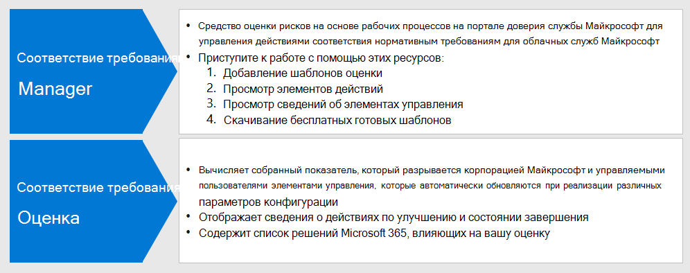

# Использование оценки соответствия требованиям и диспетчера соответствия требованиям для управления действиями по улучшению

Оценка соответствия требованиям Майкрософт и диспетчер соответствия требованиям можно использовать вместе для управления улучшениями, связанными с требованиями к конфиденциальности данных, такими как GDPR, ККПА для защиты личных данных в странах Европейского союза [()](../compliance/gdpr.md), [ACT для защиты от пользователей в Калифорнии](../compliance/ccpa-faq.md)(США), HIPAA-HiTech (ACT здравоохранения США) и ACT защиты данных в Бразилии (лгпд). 

В этой статье приводятся рекомендации по использованию этих средств для обеспечения конфиденциальности данных.

>[!Note]
>Действия клиентов, предоставленные в диспетчере соответствия требованиям, являются рекомендациями. Вы можете оценить эффективность этих рекомендаций в нормативных условиях, прежде чем приступать к их реализации. Рекомендации диспетчера соответствия требованиям не следует рассматривать как гарантию соответствия требованиям.
>

## Запланированные обновления для оценки соответствия требованиям и диспетчера соответствия требованиям

[Оценка соответствия требованиям](../compliance/compliance-score.md) (в настоящее время предварительная версия) требует добавления целевой оценки для регламентирования (например, GDPR) из [диспетчера соответствия требованиям](../compliance/compliance-manager-overview.md). В будущих выпусках большинство функций в диспетчере соответствия требованиям будут объединены в единый процесс оценки соответствия требованиям, что снижает потребность в нескольких средствах.

Ниже приведены средства для подписки, для которых требуется выполнить вход.

- [Оценка соответствия требованиям в центре администрирования соответствия требованиям Майкрософт](https://compliance.microsoft.com/compliancescore)
- [Диспетчер соответствия требованиям на портале доверия служб Майкрософт](https://servicetrust.microsoft.com/ComplianceManager/V3)

## Начало работы с диспетчером соответствия требованиям 

[Диспетчер соответствия требованиям](../compliance/working-with-compliance-manager.md) (в настоящее время находится в предварительной версии) это бесплатное средство оценки рисков на основе рабочих процессов на портале доверия службы Майкрософт для управления действиями соответствия нормативным требованиям, связанными со службами Microsoft Cloud Services. В рамках подписки Microsoft 365 или Azure Active Directory (Azure AD) диспетчер соответствия требованиям позволяет управлять соответствием нормативным требованиям в рамках модели общей ответственности для облачных служб Майкрософт.

Несмотря на то, что вы можете просматривать общий рейтинг соответствия требованиям и выполнять ряд других функций на странице **рейтинг** соответствия требованиям центра соответствия требованиям, необходимо использовать диспетчер соответствия требованиям с помощью портала "доверия служб", чтобы сначала настроить оценки для своих нормативных сведений. После этого данные этих оценок отобразятся в показателе соответствия требованиям для дальнейшего просмотра и фильтрации. 

С помощью интерфейса диспетчера соответствия можно выбрать один или несколько нормативных шаблонов, связанных с конфиденциальностью данных, и сгруппировать их для оценки и отслеживания необходимых действий по улучшению в наборе. Кроме того, вы можете просмотреть сведения об элементах управления для каждого конкретного вызова в соответствии с целевой службой, отделенными от Microsoft VS. элементами управления, управляемыми клиентами.

Оценки и состояние улучшения, выбранные здесь, также отображаются в показателе соответствия требованиям в центре соответствия требованиям корпорации Майкрософт, что подчеркивает важность начальной установки в диспетчере соответствия требованиям. Эти связи показаны на этом рисунке.
 

Основные действия, которые помогут приступить к работе.

### 1. шаблоны оценки

В диспетчере соответствия требованиям первым этапом является добавление оценок, относящихся к нормативным требованиям к данным, и включение их в определенную группу "правила конфиденциальности данных".

[Группы](../compliance/working-with-compliance-manager.md#groups) — это контейнеры, позволяющие организовывать оценки и предоставлять общий доступ к общим данным и задачам рабочих процессов между оценками, имеющими одинаковые или связанные с управляемыми пользователями элементы управления. Когда две различные оценки в одной группе совместно используют управляемый заказчиком элемент управления, выполнение сведений о реализации, проверки и состояния элемента управления автоматически синхронизируется с одним и тем же элементом управления в любой другой оценке в группе. Это объединяет назначенные элементы действий для каждого элемента управления в группе и сокращает объем работ по дублированию. 

Вы также можете использовать группы для упорядочивания. Оценки по годам, областям, стандартам соответствия требованиям или другим группам для организации вашей работы по обеспечению соответствия требованиям.

### 2. элементы Action

После добавления оценок Вы можете просматривать элементы действий, относящиеся к каждой группе, или по отдельным нормативам:

- **Список действий по улучшению.** Перейдите к списку действий и просмотрите действия по улучшению, связанные с положениями, включенными в группу. Многие действия охватывают нормативные требования, поэтому один элемент списка может представлять несколько нормативных актов. 
 
- **Фильтрация действий по улучшению.** Для многих нормативных требований к конфиденциальности данных и групп нормативных требований список действий по улучшению может быть очень большим, поэтому рекомендуется фильтровать список с помощью раскрывающегося списка фильтров. Например, если выбрано значение "технические элементы управления", список будет уменьшен до только тех, которые содержат техническую реализацию в Организации, так как многие действия связаны с административными операциями в различных аспектах бизнеса, которые также задокументированы в диспетчере соответствия требованиям. В этой статье мы будем сосредоточиться на технических элементах управления, поэтому рекомендуется применять этот подход.
 
- **Дополнительная информация и обзор.** Для каждого действия щелкните ссылку **Дополнительные**сведения, чтобы узнать больше о рекомендуемых действиях, или **Проверьте**, что открывает форму, позволяющую выполнять следующие действия:
 
   - Назначение действия пользователю в Организации для управления
   - Управление документами, связанными с адресацией действия
   - Указание состояния элемента
   - Указание дат реализации и тестирования
   - Запись дополнительной информации, примечаний по внедрению и примечаний плана тестирования для действия субъекта
  
- **Элементы, которые не относятся к области.** Некоторые действия по улучшению, включенные в список "действия", могут не относиться к запланированной реализации. Вы можете указать, что они выходят за область в диспетчере соответствия требованиям, и удалить действие и его свидетельство из вычисления значения оценки соответствия требованиям. 

Например, если в Организации выбрано использование управляемого ключа Майкрософт ", рекомендации по использованию ключа клиента не применимы к развертыванию. В этом случае ваша организация будет помечать ее как **не в области** **действия элементов управления** для шаблона соответствующих нормативных документов.
 
### 3. сведения об элементах управления

Для представления, специфического для оценки, просмотрите [сведения об элементах управления](../compliance/compliance-manager-overview.md#controls) для каждой группы оценки. Это обеспечивает представление, зависящее от оценки, которое отличается от списка "действия", которое предоставляет представление, специфическое для элемента управления.
 

Перейдите к списку **элементы управления** и просмотрите список служб в области для интересующей нормативной информации. 
 
Группы элементов управления для конкретных нормативных элементов — список действий, предоставляемых областью управления для каждой области обслуживания. Для каждого набора действий Диспетчер соответствия требованиям предоставляет дополнительные сведения о действии, а также предлагает или предоставляет варианты проверки, помогающие Организации выбирать подход к управлению.
 
Обратите внимание, что этот интерфейс предоставляет возможность просмотра сведений, относящихся к техническим действиям, а также состояния действий, связанных с элементом управления, и дополнительные сведения о правилах, к которым относится действие.

### 4. скачивание шаблона

Для тех, кто более знаком с нормативным анализом на основе электронных таблиц, другой способ — скачать шаблон для каждой соответствующей оценки с помощью списка шаблонов. В загруженных шаблонах перечислены как нормативные, так и сведения технического управления для каждого шаблона, а также могут быть более понятны некоторые роли для навигации и фильтрации, а также для создания представлений для бизнеса.
 
Вы также можете добавить новый шаблон, настраиваемый для Организации, на основе существующего шаблона, используя команду **Добавить шаблон**. Для этого необходимо скачать шаблон выбора (например, HIPAA/HITECH), а затем изменить его для целей и отправить обратно в средство управления соответствием требованиям, после чего оно будет проанализировать оценки и оценить аналогично другим шаблонам и оценкам в рамках общего менеджера соответствия требованиям и набора средств оценки соответствия требованиям.
 
>[!Tip]
>При работе с большим количеством нормативных требований или перекрыванием действий по улучшению рекомендуется загружать каждый соответствующий шаблон и объединять наборы данных, удалять действия по улучшению или типы элементов управления, которые не относятся к вашей организации, и отправлять повторно. Это может быть проще, чем при навигации по всем разделам сведений об элементах управления и помечать каждую из них как выходную область.
>

## Оценка соответствия требованиям

После выполнения спецификаций оценки и проверки соответствия требованиям в диспетчере соответствия требованиям вы можете перейти к средству [оценки соответствия требованиям](../compliance/compliance-score.md) и проанализировать баллы и срез, а также костей данных, включая область управления.

Средство оценки соответствия требованиям в центре администрирования соответствия требованиям Microsoft 365 предоставляет несколько подходов к просмотру и фильтрации данных о соответствии, полученных от диспетчера соответствия требованиям и различных служб Майкрософт 365. Это средство автоматически обновляется при реализации различных параметров конфигурации и распределяется по показателям безопасности Майкрософт, поэтому многие действия по улучшению будут отображаться в обоих показателях. 
 
Оценка соответствия обеспечивает следующее:

- Собранный балл, разбитый корпорацией Майкрософт и элементами управления, управляемыми клиентами
- Свертка действий по улучшению и состояния завершения
- Список решений Microsoft 365, влияющих на вашу оценку

### Вычисление оценки соответствия требованиям

Коротко говоря, показатель вычисляется на основе реализации Майкрософт и реализации элементов управления, управляемыми клиентами, как описано в [статье расчет оценки соответствия требованиям Майкрософт](../compliance/compliance-score-methodology.md).

Элементам управления назначается значение оценки в зависимости от того, являются ли они обязательными или непревентивными, а также являются ли они превентивными, обнаруживающее или корректирующими. Эти общие данные представляют риск невозможности их реализации относительно других элементов управления.

Как показано в статье расчет оценки соответствия требованиям Майкрософт, превентивные элементы управления получают более высокие показатели по сравнению с обнаруживающее и исправленными, а обязательные элементы управления получают более высокие показатели по сравнению с неизбирательными.
 
Обратите внимание, что в пользовательском интерфейсе администратора оценки соответствия не перечислены эти параметры и не предусмотрена возможность их фильтрации. Тем не менее, если вы Скачайте связанный шаблон из средства управления соответствием требованиям, в полученном наборе данных будут перечислены эти параметры для большинства нормативных требований.

Для технических элементов управления Оценка соответствия будет автоматически обновлять рейтинг действий по улучшению после активации соответствующего компонента. Другие, не связанные с техническими действиями управления, &mdash; такие как работающие и связанные с документацией, &mdash; необходимо записать вручную в средстве "Диспетчер соответствия требованиям" на портале доверия служб. 

Вы также можете реализовать определенные действия по улучшению для других целей &mdash; , например, используя метки хранения по причинам, не связанным с соблюдением конфиденциальности данных, &mdash; чтобы вы могли получить баллы за использование такой функции, даже если она используется для других целей, и не является частью преднамеренного действия соответствия требованиям.

Ваш рейтинг соответствия требованиям должен рассматриваться относительной мерой для отслеживания улучшения на широком масштабе. Не следует заменять оценку. 

### Дополнительные рекомендации

Вот несколько важных советов по использованию оценки соответствия требованиям и диспетчера соответствия требованиям для обеспечения соответствия требованиям к соблюдению конфиденциальности данных:

- Каждая регламентирование данных содержит сочетание технических элементов управления, спецификаций документации и требований к эксплуатации, процессу и отчетности. Все эти действия отображаются в действиях по улучшению. 

- В этой статье основное внимание уделяется подмножеству технических элементов управления, указанных для обеспечения конфиденциальности данных в диспетчере соответствия требованиям и показателях соответствия требованиям. Для получения дополнительных сведений об административных элементах управления, не являющихся техническими, обратитесь к [документации](../compliance/compliance-score.md) по диспетчеру соответствия требованиям.

- Чтобы обратить внимание на представление действий по улучшению в интересующую область, можно выполнить фильтрацию по типу действий на вкладке **решения** в администраторе оценки соответствия требованиям.

- Относительную важность и приоритет действий по улучшению, определенных в показателе соответствия требованиям, следует рассматривать в рамках более широкого рассмотрения рисков вместе с риском конфиденциальности данных, который должен управляться вашей организацией. 

- Если вы являетесь глобальной организацией и добавляете несколько шаблонов для обеспечения конфиденциальности данных в Диспетчер соответствия требованиям в качестве оценок, показатель соответствия будет сочетать каждую из них в списке полей для каждого действия по улучшению.
 
- Даже при использовании объединения действий по улучшению в соответствии с различными нормативными требованиями, если выбраны Шаблоны оценки для GDPR, ЛГПД, ККПА и HIPAA — HITECH, например почти 400 действия по улучшению будут отображаться в показателе соответствия требованиям. Чтобы лучше справиться с этим длинным списком, используйте фильтр действий по улучшению, чтобы уменьшить набор результатов до управляемого списка.

- Фильтр категории предоставляет возможность фильтрации действий улучшения по логической группировке, которая отслеживает, защищает, сохраняет и исследует статьи в данном общем решении. 

- Некоторые элементы управления, перечисленные в действиях по улучшению, могут быть более тесно связаны с определенной нормативной статьей, в то время как другие элементы управления могут быть более косвенно связанными с духу регламентированного и много раз, что нужно учитывать.

