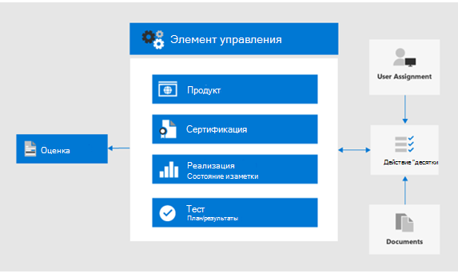

# Использование оценки соответствия требованиям и диспетчера соответствия требованиям для управления действиями по улучшениюUse Compliance Score and Compliance Manager to manage improvement actions

Оценка соответствия требованиям Майкрософт и диспетчер соответствия требованиям можно использовать вместе для управления улучшениями, связанными с требованиями к конфиденциальности данных, такими как GDPR, ККПА для защиты личных данных в странах Европейского союза [()](../compliance/gdpr.md), [ACT для защиты от пользователей в Калифорнии](../compliance/ccpa-faq.md)(США), HIPAA-HiTech (ACT здравоохранения США) и ACT защиты данных в Бразилии (лгпд).Microsoft Compliance Score and Compliance Manager can be used together to manage improvements related to data privacy regulations such as the European Union [General Data Protection Regulation (GDPR)](../compliance/gdpr.md), [California Consumer Protection Act CCPA)](../compliance/ccpa-faq.md), HIPAA-HITECH (US health care privacy act), and the Brazil Data Protection Act (LGPD). 

В этой статье приводятся рекомендации по использованию этих средств для обеспечения конфиденциальности данных.This article provides guidance on the use of these tools for data privacy purposes.

>[!Note]
>Действия клиентов, предоставленные в диспетчере соответствия требованиям, являются рекомендациями.The customer actions provided in Compliance Manager are recommendations. Вы можете оценить эффективность этих рекомендаций в нормативных условиях, прежде чем приступать к их реализации.It is up to you to evaluate the effectiveness of these recommendations in your regulatory environments prior to implementation. Рекомендации диспетчера соответствия требованиям не следует рассматривать как гарантию соответствия требованиям.Compliance Manager recommendations should not be interpreted as a guarantee of compliance.
>

## Запланированные обновления для оценки соответствия требованиям и диспетчера соответствия требованиямPlanned updates for Compliance Score and Compliance Manager

[Оценка соответствия требованиям](../compliance/compliance-score.md) (в настоящее время предварительная версия) требует добавления целевой оценки для регламентирования (например, GDPR) из [диспетчера соответствия требованиям](../compliance/compliance-manager-overview.md).[Compliance Score](../compliance/compliance-score.md) (currently in preview) requires adding your target assessments for a regulation (such as GDPR) from the [Compliance Manager](../compliance/compliance-manager-overview.md). В будущих выпусках большинство функций в диспетчере соответствия требованиям будут объединены в единый процесс оценки соответствия требованиям, что снижает потребность в нескольких средствах.In a future release, much of the functionality in Compliance Manager will be merged into a unified Compliance Score experience, reducing the need for multiple tools.

Ниже приведены средства для подписки, для которых требуется выполнить вход.Here are the tools for your subscription, which require you to sign-in:

- [Оценка соответствия требованиям в центре администрирования соответствия требованиям МайкрософтCompliance Score in the Microsoft Compliance admin center](https://compliance.microsoft.com/compliancescore)
- [Диспетчер соответствия требованиям на портале доверия служб МайкрософтCompliance Manager in the Microsoft Services Trust Portal](https://servicetrust.microsoft.com/ComplianceManager/V3)

## Начало работы с диспетчером соответствия требованиямGetting started with Compliance Manager 

[Диспетчер соответствия требованиям](../compliance/working-with-compliance-manager.md) (в настоящее время находится в предварительной версии) это бесплатное средство оценки рисков на основе рабочих процессов на портале доверия службы Майкрософт для управления действиями соответствия нормативным требованиям, связанными со службами Microsoft Cloud Services.[Compliance Manager](../compliance/working-with-compliance-manager.md) (currently in preview) is a free workflow-based risk assessment tool in the Microsoft Service Trust Portal for managing regulatory compliance activities related to Microsoft cloud services. В рамках подписки Microsoft 365 или Azure Active Directory (Azure AD) диспетчер соответствия требованиям позволяет управлять соответствием нормативным требованиям в рамках модели общей ответственности для облачных служб Майкрософт.As part of your Microsoft 365 or Azure Active Directory (Azure AD) subscription, Compliance Manager helps you manage regulatory compliance within the shared responsibility model for Microsoft cloud services.

Несмотря на то, что вы можете просматривать общий рейтинг соответствия требованиям и выполнять ряд других функций на странице **рейтинг** соответствия требованиям центра соответствия требованиям, необходимо использовать диспетчер соответствия требованиям с помощью портала "доверия служб", чтобы сначала настроить оценки для своих нормативных сведений.While you can view your overall compliance score and perform a number of other functions in the Compliance center's **Compliance Score** page, you need to use Compliance Manager through the Services Trust Portal to first configure assessments for your data privacy regulations. После этого данные этих оценок отобразятся в показателе соответствия требованиям для дальнейшего просмотра и фильтрации.Data from these assessments will then show up in Compliance Score for further viewing and filtering. 

С помощью интерфейса диспетчера соответствия можно выбрать один или несколько нормативных шаблонов, связанных с конфиденциальностью данных, и сгруппировать их для оценки и отслеживания необходимых действий по улучшению в наборе.Using the Compliance Manager interface, you can select one or more data privacy-related regulation templates and group them to assess and track required improvement actions across the set. Кроме того, вы можете просмотреть сведения об элементах управления для каждого конкретного вызова в соответствии с целевой службой, отделенными от Microsoft VS. элементами управления, управляемыми клиентами.You can also view information about the controls each regulation calls for specific to the target service, separated by Microsoft vs. customer-managed controls.

Оценки и состояние улучшения, выбранные здесь, также отображаются в показателе соответствия требованиям в центре соответствия требованиям корпорации Майкрософт, что подчеркивает важность начальной установки в диспетчере соответствия требованиям.Assessments and improvement status selected here also appear in Compliance Score in the Microsoft Compliance Center, which emphasize the importance of your initial setup in Compliance Manager. Эти связи показаны на этом рисунке.These relationships are shown in this figure.
 

Основные действия, которые помогут приступить к работе.Here are the key steps to help you get started.

### 1. шаблоны оценки1. Assessment templates

В диспетчере соответствия требованиям первым этапом является добавление оценок, относящихся к нормативным требованиям к данным, и включение их в определенную группу "правила конфиденциальности данных".From the Compliance Manager, the first step is to add assessments specific to the data privacy regulations of interest and include them in a defined "Data Privacy Regulations" group.

[Группы](../compliance/working-with-compliance-manager.md#groups) — это контейнеры, позволяющие организовывать оценки и предоставлять общий доступ к общим данным и задачам рабочих процессов между оценками, имеющими одинаковые или связанные с управляемыми пользователями элементы управления.[Groups](../compliance/working-with-compliance-manager.md#groups) are containers that allow you to organize Assessments and share common information and workflow tasks between Assessments that have the same or related customer-managed controls. Когда две различные оценки в одной группе совместно используют управляемый заказчиком элемент управления, выполнение сведений о реализации, проверки и состояния элемента управления автоматически синхронизируется с одним и тем же элементом управления в любой другой оценке в группе.When two different Assessments in the same group share customer-managed control, the completion of implementation details, testing, and status for the control automatically synchronize to the same control in any other Assessment in the Group. Это объединяет назначенные элементы действий для каждого элемента управления в группе и сокращает объем работ по дублированию.This unifies the assigned Action Items for each control across the group and reduces duplicating work. 

Вы также можете использовать группы для упорядочивания.You can also choose to use groups to organize. Оценки по годам, областям, стандартам соответствия требованиям или другим группам для организации вашей работы по обеспечению соответствия требованиям.Assessments by year, area, compliance standard, or other groupings to help organize your compliance work.

### 2. элементы Action2. Action items

После добавления оценок Вы можете просматривать элементы действий, относящиеся к каждой группе, или по отдельным нормативам:Once the assessments have been added, you can view Action Items specific to each group or individual regulation:

- **Список действий по улучшению.****Improvement action list.** Перейдите к списку действий и просмотрите действия по улучшению, связанные с положениями, включенными в группу.Navigate to the Action Items list and view the improvement actions associated across the regulations included in the group. Многие действия охватывают нормативные требования, поэтому один элемент списка может представлять несколько нормативных актов.Many actions span regulations so a single list item may represent multiple regulations. 
 
- **Фильтрация действий по улучшению.****Improvement action filtering.** Для многих нормативных требований к конфиденциальности данных и групп нормативных требований список действий по улучшению может быть очень большим, поэтому рекомендуется фильтровать список с помощью раскрывающегося списка фильтров.For many data privacy regulations and groups of regulations, the list of improvement actions can be quite large, so consider filtering the list using the filter drop down. Например, если выбрано значение "технические элементы управления", список будет уменьшен до только тех, которые содержат техническую реализацию в Организации, так как многие действия связаны с административными операциями в различных аспектах бизнеса, которые также задокументированы в диспетчере соответствия требованиям.For example, if you select "technical controls", the list will be reduced to just those which have a technical implementation in the organization, as many of the actions are related to administrative operations in various aspects of the business which are also documented in Compliance Manager. В этой статье мы будем сосредоточиться на технических элементах управления, поэтому рекомендуется применять этот подход.In this article, we will focus on technical controls, so this filtering approach is recommended.
 
- **Дополнительная информация и обзор.****Additional information and review.** Для каждого действия щелкните ссылку **Дополнительные**сведения, чтобы узнать больше о рекомендуемых действиях, или **Проверьте**, что открывает форму, позволяющую выполнять следующие действия:For each action, you can click on the link to **Read More**, which tells you more about the recommended activity, or **Review**, which opens a form allowing you to do the following:
 
   - Назначение действия пользователю в Организации для управленияAssign the action to a someone in your organization to manage
   - Управление документами, связанными с адресацией действияManage documents related to addressing the action
   - Указание состояния элементаSpecify status for the item
   - Указание дат реализации и тестированияSpecify implementation and test dates
   - Запись дополнительной информации, примечаний по внедрению и примечаний плана тестирования для действия субъектаRecord additional information, implementation notes, and test plan notes for the subject action
  
- **Элементы, которые не относятся к области.****Non-applicable items as out-of-scope.** Некоторые действия по улучшению, включенные в список "действия", могут не относиться к запланированной реализации.Some improvement actions included in the Action Items list might not apply to your planned implementation. Вы можете указать, что они выходят за область в диспетчере соответствия требованиям, и удалить действие и его свидетельство из вычисления значения оценки соответствия требованиям.You can specify that they are out of scope in Compliance Manager and remove the action and its evidence from the calculation of the compliance score value. 

Например, если в Организации выбрано использование управляемого ключа Майкрософт ", рекомендации по использованию ключа клиента не применимы к развертыванию.For example, if your organization has elected to use Microsoft Managed Key", a recommendation to Use Customer Key is not applicable to your deployment. В этом случае ваша организация будет помечать ее как **не в области** **действия элементов управления** для шаблона соответствующих нормативных документов.In this case, your organization would mark it as **Not in scope** in the **Control Actions** for the applicable regulatory template.
 
### 3. сведения об элементах управления3. Controls info

Для представления, специфического для оценки, просмотрите [сведения об элементах управления](../compliance/compliance-manager-overview.md#controls) для каждой группы оценки.For an assessment-specific view, view the [Controls Info](../compliance/compliance-manager-overview.md#controls) for each assessment group. Это обеспечивает представление, зависящее от оценки, которое отличается от списка "действия", которое предоставляет представление, специфическое для элемента управления.This provides an assessment-specific view, which is difference than the Action Items list, which provides a technical control-specific view.
 

Перейдите к списку **элементы управления** и просмотрите список служб в области для интересующей нормативной информации.Navigate to the **Controls Info** list and view the list of in-scope services for the regulation in question. 
 
Группы элементов управления для конкретных нормативных элементов — список действий, предоставляемых областью управления для каждой области обслуживания.Regulation-specific control groupings list the actions provided by control area for each service area. Для каждого набора действий Диспетчер соответствия требованиям предоставляет дополнительные сведения о действии, а также предлагает или предоставляет варианты проверки, помогающие Организации выбирать подход к управлению.For each set of actions, the Compliance Manager provides more information on the action and may suggest or provide review options to assist the organization in choosing a control approach.
 
Обратите внимание, что этот интерфейс предоставляет возможность просмотра сведений, относящихся к техническим действиям, а также состояния действий, связанных с элементом управления, и дополнительные сведения о правилах, к которым относится действие.Note that this interface provides the capability to view details specific to the technical action, together with the status of actions related to the control, and supplemental context about the regulations to which the action is related.

### 4. скачивание шаблона4. Template download

Для тех, кто более знаком с нормативным анализом на основе электронных таблиц, другой способ — скачать шаблон для каждой соответствующей оценки с помощью списка шаблонов.For those more familiar with spreadsheet-based regulatory analysis, another approach is to download the template for each respective assessment using the Templates listing. В загруженных шаблонах перечислены как нормативные, так и сведения технического управления для каждого шаблона, а также могут быть более понятны некоторые роли для навигации и фильтрации, а также для создания представлений для бизнеса.The downloaded templates list both the regulatory as well as technical control information for each template and may be easier for certain roles to navigate/filter and to generate business-specific views.
 
Вы также можете добавить новый шаблон, настраиваемый для Организации, на основе существующего шаблона, используя команду **Добавить шаблон**.You can also add a new template customized for your organization based on an existing template, using **Add Template**. Для этого необходимо скачать шаблон выбора (например, HIPAA/HITECH), а затем изменить его для целей и отправить обратно в средство управления соответствием требованиям, после чего оно будет проанализировать оценки и оценить аналогично другим шаблонам и оценкам в рамках общего менеджера соответствия требованиям и набора средств оценки соответствия требованиям.This requires that you download a template of choice (such as HIPAA/HITECH)), then modify it for your purposes and upload back into the Compliance Manager tool, where it will now drive assessments and scoring similar to other templates and assessments as part of the overall Compliance Manager and Compliance Score toolset.
 
>[!Tip]
>При работе с большим количеством нормативных требований или перекрыванием действий по улучшению рекомендуется загружать каждый соответствующий шаблон и объединять наборы данных, удалять действия по улучшению или типы элементов управления, которые не относятся к вашей организации, и отправлять повторно.if dealing with a large number of regulations or overlapping improvement actions, consider downloading each respective template and combining the data sets, removing improvement actions or control types that do not apply to your organization, and re-uploading. Это может быть проще, чем при навигации по всем разделам сведений об элементах управления и помечать каждую из них как выходную область.This may be easier than navigating every control info section and marking each as out of scope.
>

## Рейтинг соответствия требованиямCompliance Score

После выполнения спецификаций оценки и проверки соответствия требованиям в диспетчере соответствия требованиям вы можете перейти к средству [оценки соответствия требованиям](../compliance/working-with-compliance-score.md) и проанализировать баллы и срез, а также костей данных, включая область управления.Once the assessments and review specifications are performed in Compliance Manager, you can now go to the [Compliance Score](../compliance/working-with-compliance-score.md) tool and review the score and slice and dice the data further, including by control area.

Средство оценки соответствия требованиям в центре администрирования соответствия требованиям Microsoft 365 предоставляет несколько подходов к просмотру и фильтрации данных о соответствии, полученных от диспетчера соответствия требованиям и различных служб Майкрософт 365.The Compliance Score tool in the Microsoft 365 Compliance admin center provides several approaches to review and filter compliance data obtained from Compliance Manager and various Microsoft 365 services. Это средство автоматически обновляется при реализации различных параметров конфигурации и распределяется по показателям безопасности Майкрософт, поэтому многие действия по улучшению будут отображаться в обоих показателях.This tool is automatically updated when various configuration settings are implemented and shares signals with the Microsoft Secure Score so that many improvement actions will show up in both scores. 
 
Оценка соответствия обеспечивает следующее:The Compliance Score provides:

- Собранный балл, разбитый корпорацией Майкрософт и элементами управления, управляемыми клиентамиA collected score, broken down by Microsoft and customer-managed controls
- Свертка действий по улучшению и состояния завершенияA rollup of improvement actions and completion status
- Список решений Microsoft 365, влияющих на вашу оценкуA listing of Microsoft 365 solutions impacting your score

### Вычисление оценки соответствия требованиямHow the compliance score gets calculated

Коротко говоря, показатель вычисляется на основе реализации Майкрософт и реализации элементов управления, управляемыми клиентами, как описано в [статье расчет оценки соответствия требованиям Майкрософт](../compliance/compliance-score-methodology.md).In short, the score is calculated based on a combination of Microsoft and customer-managed control implementations, as explained in more detail in the [Microsoft Compliance Score calculation article](../compliance/compliance-score-methodology.md).

Элементам управления назначается значение оценки в зависимости от того, являются ли они обязательными или непревентивными, а также являются ли они превентивными, обнаруживающее или корректирующими.Controls are assigned a score value based on whether they're mandatory or discretionary, and whether they're preventative, detective, or corrective. Эти общие данные представляют риск невозможности их реализации относительно других элементов управления.These collectively represent the risk of not implementing it relative to other controls.

Как показано в статье расчет оценки соответствия требованиям Майкрософт, превентивные элементы управления получают более высокие показатели по сравнению с обнаруживающее и исправленными, а обязательные элементы управления получают более высокие показатели по сравнению с неизбирательными.As presented in the Microsoft Compliance Score calculation article, preventative controls get a higher score than detective and corrective ones, and mandatory controls get a higher score than discretionary ones.
 
Обратите внимание, что в пользовательском интерфейсе администратора оценки соответствия не перечислены эти параметры и не предусмотрена возможность их фильтрации.Note that the Compliance Score admin UI does not list these parameters, nor does it provide the ability to filter by them. Тем не менее, если вы Скачайте связанный шаблон из средства управления соответствием требованиям, в полученном наборе данных будут перечислены эти параметры для большинства нормативных требований.However, if you download the associated template from the Compliance Manager tool, the resulting data set does list these parameters for most regulations.

Для технических элементов управления Оценка соответствия будет автоматически обновлять рейтинг действий по улучшению после активации соответствующего компонента.For technical controls, Compliance Score will automatically update the improvement action score once the related feature is activated. Другие, не связанные с техническими действиями управления, &mdash; такие как работающие и связанные с документацией, &mdash; необходимо записать вручную в средстве "Диспетчер соответствия требованиям" на портале доверия служб.Other, non-technical control actions&mdash;such as those that are operational or related to documentation&mdash;need to be recorded manually in the Compliance Manager tool on the Services Trust Portal. 

Вы также можете реализовать определенные действия по улучшению для других целей &mdash; , например, используя метки хранения по причинам, не связанным с соблюдением конфиденциальности данных, &mdash; чтобы вы могли получить баллы за использование такой функции, даже если она используется для других целей, и не является частью преднамеренного действия соответствия требованиям.You many also be implementing certain improvement actions for other purposes&mdash;for example using retention labels for reasons other than data privacy regulation compliance&mdash;so you would get credit for using such a feature even if it is being used for other purposes, and not part of a deliberate compliance action.

Ваш рейтинг соответствия требованиям должен рассматриваться относительной мерой для отслеживания улучшения на широком масштабе.Your Compliance Score should be considered a relative measure to track improvement on a broad scale. Не следует заменять оценку.You should not pursue a perfect score. 

### Дополнительные рекомендацииAdditional guidance

Вот несколько важных советов по использованию оценки соответствия требованиям и диспетчера соответствия требованиям для обеспечения соответствия требованиям к соблюдению конфиденциальности данных:Here are a few important tips for the use of Compliance Score and Compliance Manager for you to achieve data privacy regulation compliance:

- Каждая регламентирование данных содержит сочетание технических элементов управления, спецификаций документации и требований к эксплуатации, процессу и отчетности.Each data privacy regulation has a combination of technical controls, documentation specifications, and operational, process, and reporting requirements. Все эти действия отображаются в действиях по улучшению.All of these show up in the improvement actions. 

- В этой статье основное внимание уделяется подмножеству технических элементов управления, указанных для обеспечения конфиденциальности данных в диспетчере соответствия требованиям и показателях соответствия требованиям.This article focuses on a subset of the technical controls specified for data privacy in Compliance Manager and Compliance Score. Для получения дополнительных сведений об административных элементах управления, не являющихся техническими, обратитесь к [документации](../compliance/working-with-compliance-score.md) по диспетчеру соответствия требованиям.Refer to the Compliance Manager tool and [documentation](../compliance/working-with-compliance-score.md) for more information on non-technical administrative controls.

- Чтобы обратить внимание на представление действий по улучшению в интересующую область, можно выполнить фильтрацию по типу действий на вкладке **решения** в администраторе оценки соответствия требованиям.To focus the view of improvement actions to your area of interest, you can filter by action type in the **Solutions** tab in the Compliance Score admin.

- Относительную важность и приоритет действий по улучшению, определенных в показателе соответствия требованиям, следует рассматривать в рамках более широкого рассмотрения рисков вместе с риском конфиденциальности данных, который должен управляться вашей организацией.The relative importance and priority of improvement actions identified in Compliance Score should be considered as part of a broader risk review along with the data privacy risk you've determined your organization needs to manage. 

- Если вы являетесь глобальной организацией и добавляете несколько шаблонов для обеспечения конфиденциальности данных в Диспетчер соответствия требованиям в качестве оценок, показатель соответствия будет сочетать каждую из них в списке полей для каждого действия по улучшению.If you are a global organization and you add multiple data privacy regulation templates into Compliance Manager as Assessments, Compliance Score will combine each applicable one in a field listing for each improvement action.
 
- Даже при использовании объединения действий по улучшению в соответствии с различными нормативными требованиями, если выбраны Шаблоны оценки для GDPR, ЛГПД, ККПА и HIPAA — HITECH, например почти 400 действия по улучшению будут отображаться в показателе соответствия требованиям.Even with improvement action aggregation across multiple regulatory requirements, if the regulation assessment templates for GDPR, LGPD, CCPA, and HIPAA-HITECH are selected, for example, almost 400 improvement actions will be listed in Compliance Score. Чтобы лучше справиться с этим длинным списком, используйте фильтр действий по улучшению, чтобы уменьшить набор результатов до управляемого списка.To better tackle this long list, use the improvement action filter to reduce the result set to a more manageable list.

- Фильтр категории предоставляет возможность фильтрации действий улучшения по логической группировке, которая отслеживает, защищает, сохраняет и исследует статьи в данном общем решении.The Categories filter provides a means to filter improvement actions by logical grouping, which the Track, Prevent, Protect, Retain, and Investigate articles in this overall solution align to. 

- Некоторые элементы управления, перечисленные в действиях по улучшению, могут быть более тесно связаны с определенной нормативной статьей, в то время как другие элементы управления могут быть более косвенно связанными с духу регламентированного и много раз, что нужно учитывать.Some of the controls listed in the improvement actions may be considered more directly tied to a specific regulatory article, while other controls may be more indirectly associated with the spirit of a regulation and are many times just things you should consider doing anyway.

