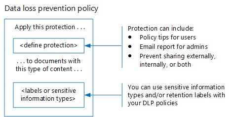

# Защита данных в соответствии с нормами конфиденциальности данныхProtect information subject to data privacy regulation

В вашей подписке можно использовать несколько элементов управления защитой информации для удовлетворения потребностей и нормативам, предъявляемым к конфиденциальности данных.A number of information protection controls can be employed in your subscription to help address data privacy compliance needs and regulations. К ним относятся общие сведения о регулировании безопасности данных (GDPR), HIPAA-HITECH (ACT о конфиденциальности в США), ACT для защиты потребителей в Калифорнии (ККПА) и ACT защиты данных в Бразилии (ЛГПД).These include General Data Protection Regulation (GDPR), HIPAA-HITECH (the United States health care privacy act), California Consumer Protection Act (CCPA), and the Brazil Data Protection Act (LGPD).

Эти элементы управления находятся в следующих областях решения:These controls are within following solution areas:

- Метки конфиденциальностиSensitivity labels
- Предотвращение потери данных (DLP)Data loss prevention (DLP)
- Шифрование сообщений Office (OME)Office message encryption (OME)
- Элементы управления доступом для Teams и сайтовTeams and sites access controls

>[!Note]
>Это решение описывает функции обеспечения безопасности и соответствия требованиям для защиты данных, подчиняются нормам конфиденциальности данных.This solution describes security and compliance features to protect information subject to data privacy regulations. Полный список функций безопасности в Microsoft 365 можно найти в [статье документация по безопасности microsoft 365](https://docs.microsoft.com/microsoft-365/security/).For a complete list of security features in Microsoft 365, see [Microsoft 365 security documentation](https://docs.microsoft.com/microsoft-365/security/). Полный список функций обеспечения соответствия требованиям в Microsoft 365 можно найти в [документации по соответствию майкрософт 365](https://docs.microsoft.com/microsoft-365/compliance/).For a complete list of compliance features in Microsoft 365, see [Microsoft 365 compliance documentation](https://docs.microsoft.com/microsoft-365/compliance/).
>

## Требования к конфиденциальности данных, влияющие на элементы управления защитой информацииData privacy regulations that impact information protection controls

Ниже приведен пример списка нормативных актов о конфиденциальности данных, которые могут относиться к средствам защиты информации:Here is a sample list of data privacy regulations that may relate to information protection controls:

- GDPR статья 5 (1) (f))GDPR Article 5(1)(f))
- Статья GDPR (32) (1) (a)GDPR Article (32)(1)(a)
- ЛГПД статья 46LGPD Article 46
- HIPAA-HITECH (45 CFR 164.312 (e) (1))HIPAA-HITECH (45 CFR 164.312(e)(1))
- HIPAA-HITECH (45 К.Ф.Р.HIPAA-HITECH (45 C.F.R. 164.312 (e) (2) (II))164.312(e)(2)(ii))

Ознакомьтесь со [статьей Оценка конфиденциальности данных и определение конфиденциальных элементов](information-protection-deploy-assess.md) для получения дополнительной информации.See the [assess data privacy risks and identify sensitive items article](information-protection-deploy-assess.md) for more information on each of the above.

Требования к конфиденциальности данных для защиты информации рекомендуют:Data privacy regulations for information protection recommend:

- Защита от потери или несанкционированного доступа, использования и/или передачи.Protection against loss or unauthorized access, usage and/or transmission.
- Применение защитных механизмов с учетом риска.Risk-based application of protective mechanisms.
- Использование шифрования там, где это необходимо.Use of encryption where appropriate.

В организации также может потребоваться защита содержимого Microsoft 365 для других целей, таких как другие требования к соответствиям или по бизнес-причинам.Your organization may also want to protect Microsoft 365 content for other purposes, such as other compliance needs or for business reasons. Установка вашей схемы защиты информации для обеспечения конфиденциальности данных должна выполняться в рамках общего планирования, реализации и управления информационной защитой.Establishing your information protection scheme for data privacy should be done as part of overall information protection planning, implementation, and management.

Чтобы начать работу с схемой защиты информации в Microsoft 365, приведенный ниже раздел содержит краткий список связанных возможностей и действий по улучшению для Microsoft 365.To help you get started with an information protection scheme in Microsoft 365, the following section includes a short list of related capabilities and improvement actions for Microsoft 365. Список включает возможности и действия по улучшению, которые применяются к правилам конфиденциальности данных.The list includes capabilities and improvement actions that are applicable to data privacy regulations. Тем не менее, список не включает старые технологии, если существует более новая возможность, которая в значительной степени заменяет старую.However, the list doesn't include older technologies if there's a newer capability that largely supersedes the older one. Например, служба управления правами на доступ к данным (IRM) для SharePoint и OneDrive не включена в список, но включены метки чувствительности.For example, Information Rights Management (IRM) for SharePoint and OneDrive is not included in the list but sensitivity labels are included.

## Управление защитой информации в Microsoft 365Managing information protection in Microsoft 365

[Решения для защиты информации](../compliance/protect-information.md) Майкрософт включают ряд интегрированных возможностей в Microsoft 365, Microsoft Azure и Microsoft Windows.Microsoft [information protection solutions](../compliance/protect-information.md) include a number of integrated capabilities across Microsoft 365, Microsoft Azure, and Microsoft Windows. В Microsoft 365 решения для защиты информации включают:In Microsoft 365, information protection solutions include:

- [Шифрование службы с помощью ключа клиентаService encryption with Customer Key](../compliance/customer-key-overview.md)
- [Типы конфиденциальной информации](../compliance/what-the-sensitive-information-types-look-for.md) (описанные в [статье Оценка рисков конфиденциальности данных и определение конфиденциальных элементов](information-protection-deploy-assess.md))[Sensitive information types](../compliance/what-the-sensitive-information-types-look-for.md) (described in the [assess data privacy risks and identify sensitive items article](information-protection-deploy-assess.md))
- [Метки конфиденциальностиSensitivity labels](../compliance/sensitivity-labels.md) 
  - Уровень службы/контейнераService/container-level
  - Клиентский/контентный уровеньClient-side/content-level
  - Автоматизированная поддержка для данных — для REST в SharePoint и OneDriveAutomated for data-at-rest in SharePoint and OneDrive
- Защита от потери данных (DLP)Data Loss Prevention (DLP)
- [Microsoft 365 Message Encryption новые возможности (OME)](../compliance/ome.md) и [Расширенное шифрование сообщений](../compliance/ome-advanced-message-encryption.md) OME[Office 365 Message Encryption new capabilities (OME)](../compliance/ome.md) and OME [Advanced Message Encryption](../compliance/ome-advanced-message-encryption.md)

Кроме того, защита на уровне сайта и библиотеки — это важные механизмы, которые необходимо включить в любую схему защиты.In addition, site and library level protection are important mechanisms to include in any protection scheme.

Дополнительные сведения о других возможностях защиты информации за прев Microsoft 365 можно найти в следующих статьях:For information on other information protection capabilities outside of Microsoft 365, see:

- [Безопасность облачных приложений Майкрософт (МКАС)Microsoft Cloud Application Security (MCAS)](https://docs.microsoft.com/cloud-app-security/)
- [Azure Information ProtectionAzure Information Protection](https://docs.microsoft.com/azure/information-protection/what-is-information-protection)
- [Microsoft Endpoint ManagerMicrosoft Endpoint Manager](https://www.microsoft.com/microsoft-365/microsoft-endpoint-manager)
- [Windows Information ProtectionWindows Information Protection](https://docs.microsoft.com/windows/security/information-protection/windows-information-protection/protect-enterprise-data-using-wip)

## Метки конфиденциальностиSensitivity labels

Метки конфиденциальности из Microsoft Information Protection Framework позволяют классифицировать и защищать данные вашей организации, не отменяя производительность пользователей и возможность сотрудничества.Sensitivity labels from the Microsoft Information Protection framework let you classify and protect your organization's data without hindering the productivity of users and their ability to collaborate.

### Необходимые условия для меток конфиденциальностиPrerequisites for sensitivity labels

Выполните эти действия перед реализацией любой из возможностей на основе меток конфиденциальности, выделенных ниже:Complete these activities prior to implementing any of the sensitivity label-based capabilities highlighted below:

1. Ознакомьтесь со следующими сведениями:Understand the following:
   - **Бизнес-требования.****Business requirements.** Определите бизнес-причины для применения меток конфиденциальности на предприятии.Establish the business reasons for applying sensitivity labels in your enterprise. Например, ваши требования к конфиденциальности данных для защиты информации.For example, your data privacy requirements for information protection.
   - **Возможности меток конфиденциальности.****Sensitivity label capabilities.** Метки чувствительности могут стать сложными, поэтому перед началом работы обязательно ознакомьтесь с [документацией по меткам конфиденциальности](../compliance/sensitivity-labels.md) .Sensitivity labeling can get complex, so make sure to read the [sensitivity labels documentation](../compliance/sensitivity-labels.md) before getting started.
   - **Основные вещи, которые следует запомнить** Метки конфиденциальности управляются в центре администрирования соответствия требованиям Майкрософт, но параметры нацеленности и приложений значительно отличаются.**Key things to remember** Sensitivity labels are managed in the Microsoft Compliance admin center but the targeting and application options vary significantly.
      - Существуют метки конфиденциальности для сайтов, групп и Teams на уровне контейнера (параметры не применяются к содержимому в контейнере).There are sensitivity labels for sites, groups, and Teams at the container level (the settings do not apply to content inside the container). Они публикуются для пользователей и групп, которые применяют их при подготовке сайта, группы или группы.These are published to users and groups who apply them when a site, group or Team is provisioned.
      - Для активного контента существуют метки конфиденциальности.There are sensitivity labels for active content. Они также публикуются для пользователей или групп, которые либо вручную применяются, либо автоматически применяются в следующих случаях:These are also published to user or groups, who either manually apply them, or they get applied automatically when:
        - Файл открывается/редактируется или сохраняется на рабочем столе пользователя или на сайте SharePoint.The file is opened/edited/saved, either to the user’s desktop or a SharePoint site.
        - Черновик и отправка сообщения электронной почты.An email is drafted and sent.
      - Для автоматических приложений существуют метки чувствительности для автоматических приложений в SharePoint и OneDrive в дополнение к сообщениям в транзите через Exchange.There are sensitivity labels for automatic application to files at rest in SharePoint and OneDrive in addition to emails in transit through Exchange. Они предназначены для всех сайтов или определенных, и автоматически применяются к файлам в других средах.These are targeted to either all sites or specific ones and automatically apply to the files at rest in these environments.

2. Рационализации текущей метки конфиденциальности с помощью прошлых или альтернативных методовRationalize current sensitivity labeling with past or alternative methods

   - Azure Information ProtectionAzure Information Protection

      Для текущей схемы меток чувствительности может потребоваться согласование с любой существующей реализацией с подпиской на [Azure Information Protection](../compliance/sensitivity-labels.md#sensitivity-labels-and-azure-information-protection) .The current sensitivity labeling scheme may need to be reconciled with any existing [Azure Information Protection](../compliance/sensitivity-labels.md#sensitivity-labels-and-azure-information-protection) labeling implementation.
   - OMEOME

      Если вы планируете использовать современные метки чувствительности для защиты электронной почты и существующие методы шифрования электронной почты, такие как OME, они могут сосуществовать, но вам следует ознакомиться со сценариями, в которых их следует применять.If you are planning to use modern sensitivity labeling for email protection and existing email encryption methods like OME are in place, they can co-exist, but you should understand the scenarios in which either should be applied. Ознакомьтесь с разметкой Office 365, посвященной [шифрованию сообщений (OME)](#office-365-message-encryption-ome-new-capabilities), которая включает в себя таблицу, которая сравнивает современные средства защиты типов меток с учетом OME.See [Office 365 Message Encryption new capabilities (OME)](#office-365-message-encryption-ome-new-capabilities), which includes a table comparing modern sensitivity label-type protection with OME-based protection.

3. Запланируйте интеграцию в более обширную схему защиты информации.Plan for integration into a broader information protection scheme. В верхней части сосуществования с OME текущие метки чувствительности могут использоваться вместе со всеми функциями, такими как Microsoft 365 предотвращение потери данных (DLP) и Microsoft Cloud App Security.On top of coexistence with OME, current sensitivity labels can be used along-side capabilities like Microsoft 365 data loss prevention (DLP) and Microsoft Cloud App Security. Сведения о [метках конфиденциальности и Microsoft Cloud App Security](../compliance/sensitivity-labels.md#sensitivity-labels-and-microsoft-cloud-app-security) для достижения целей защиты данных, связанных с конфиденциальностью данных.See [Sensitivity Labels and Microsoft Cloud App Security](../compliance/sensitivity-labels.md#sensitivity-labels-and-microsoft-cloud-app-security) to achieve your data privacy-related information protection goals.

4. Разработайте классификацию меток конфиденциальности и управления схемой.Develop a sensitivity label classification and control scheme. Просмотр [таксономии данных и метки чувствительности](https://aka.ms/dataclassificationwhitepaper).See [Data Classification and Sensitivity Label Taxonomy](https://aka.ms/dataclassificationwhitepaper).

### Общие рекомендацииGeneral guidance

1. **Определение схемы.****Schema definition.** Прежде чем использовать технические возможности для применения меток и защиты, работайте в Организации, чтобы определить схему классификации.Before using technical capabilities to apply labels and protection, work across your organization to define a classification schema. Возможно, у вас уже есть схема классификации, которая упрощает добавление персональных данных.You might already have a classification schema, which makes it easier to add personal data. 
2. **Начало работы.****Getting started.** Начните с определения числа и имен подписей, которые необходимо реализовать.Begin by deciding on the number and names of labels to implement. Выполните эту операцию, не беспокоясь о том, какую технологию использовать и как будут применяться метки.Do this activity without worrying about which technology to use and how labels will be applied. Применяйте эту схему к глобально во всей Организации, включая данные, которые хранятся локально и в других облачных службах.Apply this schema universally throughout your organization, including data that resides on premises and in other cloud services.
3. **Дополнительные рекомендации** При проектировании и внедрении политик, меток и условий учитывайте следующие рекомендации.**Additional recommendations** When designing and implementing policies, labels, and conditions, consider following these recommendations:

   - **Используйте существующую схему классификации (при наличии).****Use existing classification schema (if any).** Во многих организациях уже используется классификация данных в некоторой форме.Many organizations already are using data classification in some form. Тщательно оцените существующую схему меток и, если это возможно, используйте ее как есть.Carefully evaluate the existing label schema and if possible, use it as is. Использование знакомых меток, распознаваемых для конечных пользователей, будет выполнять внедрение.Using familiar labels that are recognizable to your end-users will drive adoption.
   - **Пуск мал.****Start small.** Количество меток, которые можно создать, практически не ограничено.There is virtually no limit to the number of labels that you can create. Однако большое количество меток и вложенных меток может замедлить процесс принятия.However, large numbers of labels and sub-labels can slow adoption.
   - **Использование сценариев и вариантов использования.****Use scenarios and use cases.** Определите наиболее распространенные варианты использования в Организации и используйте сценарии, полученные из нормативов по конфиденциальности данных, на которые вы являетесь субъектом.Identify common use cases within your organization and use scenarios derived from the data privacy regulations to which you are subject. Проверьте, правильно ли будет работать Указанная метка и конфигурация классификации.Verify if the envisioned label and classification configuration will work in practice.
   - **Запрашивать новые метки.****Question every request for a new label.** Требуется ли для каждого сценария или варианта использования новые метки или можно ли использовать уже имеющиеся элементы?Does every scenario or use case really need a new label or can you use what you already have? Сохранение количества меток в минимальном объеме.Keeping the number of labels to a minimum improves adoption.
   - **Используйте вложенные метки для ключевых отделов.****Use sub-labels for key departments.** Некоторые отделы будут иметь определенные потребности, требующие определенных меток.Some departments will have specific needs that require specific labels. Определите эти метки как вложенные метки для существующей метки и попробуйте использовать политики, назначаемые группам пользователей, а не глобально.Define these labels as sub-labels to an existing label and consider using scoped policies that are assigned to user groups instead of globally.
   - **Рассмотрите политики с областью действия.****Consider scoped policies.** Политики, предназначенные для подмножества пользователей, не позволят перегружать метки.Policies targeted at subsets of users will prevent label overload. Политика с областью позволяет назначать конкретные метки ролей или подметок только сотрудникам, которые работают в определенном отделе.A scoped policy enables assigning role or department specific labels or sub-labels to just employees that work for that specific department. 
   - **Используйте осмысленные имена меток.****Use meaningful label names.** Старайтесь не использовать жаргон, стандарты или аббревиатуры в качестве имен меток.Try not to use jargon, standards, or acronyms as label names. Попробуйте использовать имена, ресонате с конечным пользователем, чтобы оптимизировать внедрение.Try to use names that resonate with the end user to improve adoption. Вместо таких меток, как персональные, PCI, HIPAA, ЛБИ, МБИ и HBI, рекомендуется рассмотреть такие имена, как некоммерческие, общедоступные, общие, конфиденциальные и строго конфиденциальные.Instead of using labels like PII, PCI, HIPAA, LBI, MBI and HBI, consider names like Non-Business, Public, General, Confidential and Highly Confidential.

### Создание и развертывание меток конфиденциальности для сайтов, групп и рабочих группCreate and deploy sensitivity labels for sites, groups, and teams

Когда вы создаете [метки конфиденциальности](../compliance/sensitivity-labels-teams-groups-sites.md) в центре соответствия требованиям Microsoft 365, теперь вы можете применять их к следующим контейнерам:When you create [sensitivity labels](../compliance/sensitivity-labels-teams-groups-sites.md) in the Microsoft 365 compliance center, you can now apply them to these containers:

- Сайты Microsoft TeamsMicrosoft Teams sites
- Группы Microsoft 365 (ранее группы Office 365)Microsoft 365 groups (formerly Office 365 groups)
- Сайты SharePointSharePoint sites

Используйте следующие параметры метки, чтобы защитить содержимое этих контейнеров:Use the following label settings to help protect the content in those containers:

- Конфиденциальность (общедоступная или частная) сайты Teams, подключенных к группам Microsoft 365Privacy (public or private) of Microsoft 365 group-connected Teams sites
- Доступ внешних пользователейExternal user access
- Доступ с неуправляемых устройствAccess from unmanaged devices

Для обеспечения конфиденциальности данных, чтобы предотвратить внешний общий доступ для контейнеров, которые будут использоваться для хранения контента с конфиденциальными личными данными, пометьте файлы, содержащие данные, как частные, и потребуются управляемые устройства.For data privacy, to prevent external sharing for containers that will be used for storing content with sensitive personal data, mark the files containing the data as private, and require managed devices.

### Создание и развертывание меток конфиденциальности для контентаCreate and deploy sensitivity labels for content

Метки конфиденциальности, применяемые к файлам, позволяют шифровать их содержимое, подводя содержимое и определять другие элементы управления для контента приложений Office, включая Outlook и Office в Интернете.Sensitivity labels applied to files allow you to encrypt their content, watermark the content, and define other controls for Office applications content, including Outlook and Office on the web.

Когда вы будете готовы приступить к защите данных Организации с помощью меток конфиденциальности:When you're ready to start protecting your organization's data with sensitivity labels:

1. **Создание меток.****Create the labels.** Создайте и назовите метки конфиденциальности согласно таксономии классификации вашей организации для разных уровней конфиденциальности контента.Create and name your sensitivity labels according to your organization's classification taxonomy for different sensitivity levels of content. Дополнительные сведения о разработке таксономии классификации приведены в [статье классификация данных и метка конфиденциальности таксономии](https://aka.ms/dataclassificationwhitepaper).For more information on developing a classification taxonomy, see the [Data Classification and Sensitivity Label Taxonomy white paper](https://aka.ms/dataclassificationwhitepaper).
2. **Определение возможностей каждой метки.****Define what each label can do.** Настройте параметры защиты, связанные с каждой меткой.Configure the protection settings you want associated with each label. Например, может потребоваться, чтобы содержимое с низким уровнем конфиденциальности (например, "Общая" надпись) было применено только к верхнему или нижнему колонтитулу, а более высокий уровень конфиденциальности (например, метка "конфиденциальная") должен иметь подложку и включить шифрование.For example, you might want lower sensitivity content (such as a "General" label) to have just a header or footer applied, while higher sensitivity content (such as a "Confidential" label) should have a watermark and have encryption enabled.
3. **Публикация меток.****Publish the labels.** После настройки меток конфиденциальности опубликуйте их с помощью политики меток.After your sensitivity labels are configured, publish them by using a label policy. Определите, какие пользователи и группы должны иметь доступ к меткам и какие параметры политики использовать.Decide which users and groups should have the labels and what policy settings to use. Одну метку можно использовать повторно.A single label is reusable. Вы можете определить его один раз, а затем включить в несколько политик меток, назначенных разным пользователям.You define it once and then you can include it in several label policies assigned to different users.

После публикации меток конфиденциальности из центра соответствия требованиям Microsoft 365 они начинают отображаться в [приложениях Office](../compliance/sensitivity-labels-office-apps.md) для классификации и защиты контента, созданного или измененного пользователем.Once you publish sensitivity labels from the Microsoft 365 compliance center, they start to appear in [Office apps](../compliance/sensitivity-labels-office-apps.md) for users to classify and protect content as it's created or edited.

Для обеспечения конфиденциальности данных вы вручную применяете метку конфиденциальности с шифрованием и другими правилами к электронной почте или содержимому, содержащему конфиденциальную личную информацию.For data privacy, you manually apply a sensitivity label with encryption and other rules to email or content containing sensitive personal information.

>[!Note]
>Метки конфиденциальности с включенным шифрованием, примененные к электронной почте, имеют перекрывающиеся функции с OME.Sensitivity labels with encryption enabled applied to email have some overlapping functionality with OME. [В статье безопасные сценарии электронной почты сравниваются с метками OME и чувствительностью](#secure-email-scenarios-comparison-with-ome-and-sensitivity-labels).See [Secure email scenarios comparison with OME and sensitivity labels](#secure-email-scenarios-comparison-with-ome-and-sensitivity-labels).

### Автоматическое добавление меток на стороне клиента при редактировании документов или составлении сообщений электронной почтыClient-side auto-labeling when users edit documents or compose emails

При создании метки чувствительности можно [автоматически назначать эту метку](../compliance/apply-sensitivity-label-automatically.md) содержимому, включая электронную почту, если она соответствует заданным условиям.When you create a sensitivity label, you can [automatically assign that label](../compliance/apply-sensitivity-label-automatically.md) to content including email when it matches conditions that you specify.

Возможность автоматически применять метки конфиденциальности к содержимому важна, потому что:The ability to apply sensitivity labels to content automatically is important because:

- не потребуется обучать пользователей работе с классификациями;You don't need to train your users when to use each of your classifications.
- вам не нужно будет рассчитывать на то, что пользователи правильно классифицируют весь контент;You don't need to rely on users to classify all content correctly.
- пользователям больше не нужно будет знать о ваших политиках — они могут сосредоточиться на своей работе;Users no longer need to know about your policies—they can instead focus on their work.

Автомаркировка поддерживает добавление меток для пользователей, а также автоматическое применение метки.Auto-labeling supports recommending a label to users, as well as automatically applying a label. В обоих случаях пользователь решает, принять или отклонить метку, чтобы добиться правильного применения меток к содержимому.But in both cases, the user decides whether to accept or reject the label, to help ensure the correct labeling of content.

Применение меток на стороне клиента сопряжено с минимальными задержками для документов, поскольку метку можно применить еще до сохранения документа.This client-side labeling has minimal delay for documents because the label can be applied even before the document is saved. Тем не менее, не все клиентские приложения поддерживают автоматическое применение меток.However, not all client apps support auto-labeling. Эта возможность поддерживается клиентом единой метки Azure Information Protection и [некоторыми версиями приложений Office](../compliance/sensitivity-labels-office-apps.md#support-for-sensitivity-label-capabilities-in-apps).This capability is supported by the Azure Information Protection unified labeling client, and [some versions of Office apps](../compliance/sensitivity-labels-office-apps.md#support-for-sensitivity-label-capabilities-in-apps).

Инструкции по настройке можно узнать [в статье Настройка автоматической метки для приложений Office](../compliance/sensitivity-labels-office-apps.md#support-for-sensitivity-label-capabilities-in-apps).For configuration instructions, see [How to configure auto-labeling for Office apps](../compliance/sensitivity-labels-office-apps.md#support-for-sensitivity-label-capabilities-in-apps).

Для обеспечения конфиденциальности данных метки чувствительности автоматически применяются к контенту, содержащему конфиденциальную личную информацию.For data privacy, you auto-apply sensitivity labels for content containing sensitive personal information.

### Автоматическая маркировка на стороне службы, когда контент уже сохраненService-side auto-labeling when content is already saved

Этот метод называется автоматической классификацией с метками конфиденциальности.This method is referred to as auto classification with sensitivity labels. Кроме того, вы также можете услышать, что она называется автоматическим добавлением меток для данных на других (для документов в SharePoint и OneDrive) и данными в транзитном расположении (для сообщений электронной почты, отправляемых или получаемых Exchange).You might also hear it referred to as auto-labeling for data at rest (for documents in SharePoint and OneDrive) and data in transit (for email that is sent or received by Exchange). Для Exchange он не включает сообщения электронной почты в почтовые ящики.For Exchange, it doesn't include emails in mailboxes at rest.
 
Так как эта метка применяется самой службой, а не приложением пользователя, нет необходимости беспокоиться о том, что у пользователей есть приложения и какая версия.Because this labeling is applied by the service itself rather than by user application, you don't need to worry about what apps users have and what version. Поэтому эта функция доступна сразу во всей организации и пригодна для крупномасштабного применения меток.As a result, this capability is immediately available throughout your organization and suitable for labeling at scale. Политики автоматического применения меток не поддерживают рекомендуемые метки, поскольку пользователь не взаимодействует с процессом применения меток.Auto-labeling policies don't support recommended labeling because the user doesn't interact with the labeling process. Вместо этого администратор запускает политики в режиме имитации, чтобы убедиться в правильности меток содержимого до фактического применения меток.Instead, the administrator runs the policies in simulation mode to help ensure the correct labeling of content before actually applying the label.

Инструкции по настройке: [Настройка политик автоматических меток для SharePoint, OneDrive и Exchange](../compliance/apply-sensitivity-label-automatically.md#how-to-configure-auto-labeling-policies-for-sharepoint-onedrive-and-exchange).For configuration instructions, see [How to configure auto-labeling policies for SharePoint, OneDrive, and Exchange](../compliance/apply-sensitivity-label-automatically.md#how-to-configure-auto-labeling-policies-for-sharepoint-onedrive-and-exchange).

Для обеспечения конфиденциальности данных на сайтах следует отправлять метки чувствительности для автоматического шифрования содержимого, содержащего конфиденциальную личную информацию.For data privacy within sites of concern, push sensitivity labels for automatic encryption of content containing sensitive personal information.

## Защита от потери данныхData loss prevention 

С помощью [функции защиты от потери данных (DLP)](../compliance/data-loss-prevention-policies.md) в Microsoft 365 можно определять, предупреждать и блокировать рискованные, нежелательные или нежелательные возможности совместного доступа, такие как совместное использование данных с персональными и внешними сведениями.You can use [data loss prevention (DLP)](../compliance/data-loss-prevention-policies.md) in Microsoft 365 to detect, warn, and block risky, inadvertent, or inappropriate sharing, such as sharing of data containing personal information, both internally and externally.

DLP позволяет:DLP allows you to:

- Определите и следите за рискованными действиями общего доступа.Identify and monitor risky sharing activities.
- Проучите пользователей с помощью контекстного руководства, чтобы принять правильные решения.Educate users with in-context guidance to make the right decisions.
- Принудительно применять политики использования данных для контента без снижения производительности.Enforce data use policies upon content without inhibiting productivity.
- Интеграция с классификацией и добавлением меток для обнаружения и защиты данных при совместной работе.Integrate with classification and labeling to detect and protect data when it is shared.

### Поддерживаемые рабочие нагрузки для защиты от потери данныхSupported workloads for DLP

С помощью политики защиты от потери данных в центре соответствия требованиям Microsoft 365 вы можете определять, отслеживать и автоматически защищать конфиденциальные элементы во многих расположениях в Microsoft 365, таких как Exchange Online, SharePoint, OneDrive и Microsoft Teams.With a DLP policy in the Microsoft 365 compliance center, you can identify, monitor, and automatically protect sensitive items across many locations in Microsoft 365, such as Exchange Online, SharePoint, OneDrive, and Microsoft Teams.

Например, можно определить любой документ, содержащий номер кредитной карты, который хранится на любом сайте OneDrive, или можно отслеживать только сайты OneDrive для определенных пользователей.For example, you can identify any document containing a credit card number that's stored in any OneDrive site, or you can monitor just the OneDrive sites of specific people.

Кроме того, вы можете отслеживать и защищать конфиденциальные элементы в локально установленных версиях Excel, PowerPoint и Word, которые включают возможность определять конфиденциальные элементы и применять политики защиты от потери данных.You can also monitor and protect sensitive items in the locally-installed versions of Excel, PowerPoint, and Word, which include the ability to identify sensitive items and apply DLP policies. Защита от потери данных обеспечивает непрерывное отслеживание, когда пользователи совместно используют контент из этих приложений Office.DLP provides continuous monitoring when people share content from these Office apps.

На этом рисунке показан пример защиты персональных данных с использованием защиты от потери данных.This figure shows an example of DLP protecting personal data.

DLP используется для идентификации документа или сообщения электронной почты, содержащего запись о работоспособности, а затем автоматически блокирует доступ к этому документу или блокирует отправку сообщения электронной почты.DLP is used to identify a document or email containing a health record and then automatically blocks access to that document or blocks the email from being sent. Затем DLP уведомляет получателя с помощью подсказки политики и отправляет оповещение конечному пользователю и администратору.DLP then notifies the recipient with a policy tip and sends an alert to the end-user and admin.

### Планирование защиты от потери данныхPlanning for DLP

Запланируйте политики защиты от потери данных для:Plan your DLP policies for: 

- Бизнес-требований.Your business requirements.

- Оценка организации на основе рисков, описанная в [статье Оценка рисков конфиденциальности данных и определение конфиденциальных элементов](information-protection-deploy-assess.md).A risk-based assessment of the organization as described in the [assess data privacy risks and identify sensitive items article](information-protection-deploy-assess.md).

- Другие механизмы защиты и управления информацией на месте или при планировании конфиденциальности данных.Other information protection and governance mechanisms in place or in planning for data privacy.

- Типы конфиденциальной информации, которые вы определили для персональных данных на основе работ по оценке, описанные в [статье Оценка рисков конфиденциальности данных и определение конфиденциальных элементов](information-protection-deploy-assess.md).The sensitive information types that you’ve identified for personal data based on your assessment work as described in the [assess data privacy risks and identify sensitive items article](information-protection-deploy-assess.md). Условия политики DLP могут основываться на типах конфиденциальной информации и метках хранения.DLP policy conditions can be based on both sensitive information types and retention labels.

- Метки хранения необходимо указать условия защиты от потери данных.The retention labels you'll need to specify DLP conditions. Для получения дополнительных сведений просмотрите [сведения, которые подчиняются нормам конфиденциальности данных в вашей организации](information-protection-deploy-govern.md) .See the [govern information subject to data privacy regulation in your organization](information-protection-deploy-govern.md) article for more information.

- Постоянное Управление политиками DLP, которое требует от пользователя в организации работы и настройки политик изменений в типах конфиденциальной информации, метках хранения, нормативах и политиках соответствия требованиям.Ongoing DLP policy management, which requires someone in the organization to operate and tune policies for changes in sensitive information types, retention labels, regulations, and compliance policies.

Несмотря на то, что метки конфиденциальности невозможно использовать в условиях политики DLP, некоторые сценарии защиты для предотвращения доступа могут быть достижимы с помощью меток конфиденциальности, которые можно автоматически применять на основе типов конфиденциальной информации.Although sensitivity labels can’t be used in DLP policy conditions, certain protection scenarios to prevent access may be achievable with just sensitivity labels that can be auto-applied based on sensitive information types. Если вы размещаете метки надежности, подумайте о том, следует ли использовать DLP для расширения защиты, так как:If robust sensitivity labeling is in place, consider whether DLP should be used to augment protection because:

  - Защита от потери данных может препятствовать совместному использованию файлов.DLP can prevent sharing of files. Метки конфиденциальности могут просто запретить доступ.Sensitivity labels can just prevent access.

  - Защита от потери данных имеет более детализированные уровни управления с точки зрения правил, условий и действий.DLP has more granular levels of control in terms of rules, conditions, and actions.

  - Политики защиты от потери данных можно применять к сообщениям чата в Teams и каналах.DLP policies can be applied to Teams chat and channel messages. Метки конфиденциальности можно применять только к документам и электронной почте.Sensitivity labels can only be applied to documents and email.

### Политики защиты от потери данныхDLP policies

Политики защиты от потери данных настраиваются в центре администрирования соответствия требованиям Майкрософт и определяют уровень защиты, тип конфиденциальной информации, которую будет искать политика, а также целевые рабочие нагрузки.DLP policies are configured in the Microsoft Compliance admin center and specify the level of protection, the sensitive information type the policy is looking for, and the target workloads. Их базовые компоненты состоят из идентификации защиты и типов данных.Their basic components consist of identifying the protection and the types of data.

Ниже приведен пример политики DLP для осведомленности о GDPR.Here is an example DLP policy for awareness of GDPR.

В [этой статье](../compliance/create-test-tune-dlp-policy.md) приводятся дополнительные сведения о создании и применении политик защиты от потери данных.See [this article](../compliance/create-test-tune-dlp-policy.md) for more information about creating and applying DLP policies.

### Уровни защиты для обеспечения конфиденциальности данныхProtection levels for data privacy

В следующей таблице перечислены три конфигурации усиления защиты с использованием защиты от потери данных.The following table lists three configurations of increasing protection using DLP.

Первая конфигурация, осведомленность, может использоваться в качестве отправной точки и минимального уровня защиты для соответствия требованиям законодательства по конфиденциальности данных.The first configuration, Awareness, can be used as a starting point and minimum level of protection to address compliance needs for data privacy regulations.

>[!Note]
>Так как уровни защиты увеличиваются, возможность пользователей обмениваться данными и получать к ним доступ будет снижаться в некоторых случаях и может повлиять на производительность и возможность выполнения ежедневных задач.As the levels of protection increase, the ability of users to share and access information will decrease in some cases and could potentially impact their productivity or ability to complete daily tasks.
>

Чтобы сотрудники продолжали работать в более безопасной среде при увеличении уровней защиты, запланируйте и Научите их в новых политиках и процедурах безопасности.To help your employees continue to be productive in a more secure environment when increasing protection levels, take the time to train and educate them on new security policies and procedures.

### Пример использования меток конфиденциальности с DLPExample of using sensitivity labels with DLP

Метки конфиденциальности могут совместно работать с DLP, чтобы обеспечить конфиденциальность данных в строго регулируемой среде.Sensitivity labels can work together with DLP to provide data privacy in a highly regulated environment. Основные этапы интегрированного развертывания:Here are the key steps of the integrated deployment:

1. Нормативные требования и другие бизнес-требования для обеспечения конфиденциальности данных задокументированы.Regulatory and otherwise business requirements for data privacy are documented.
2. Целевые источники данных, типы и права собственности характеризуются относительно проблем конфиденциальности данных.Target data sources, types, and ownership are characterized relative to data privacy concerns.
3. Определена общая стратегия для устранения требований и защиты и управления активными областями конфиденциальности данных.An overall strategy to address requirements and protect and govern data privacy hotspots is established.
4. Поэтапный план действий, позволяющий решить стратегию управления конфиденциальностью данных, помещается в место.A phased action plan to address the data privacy control strategy is put into place.

После определения этих элементов можно использовать типы конфиденциальной информации, таксономию метки чувствительности и политики DLP.Once these elements are determined, you can use sensitive information types, your sensitivity labeling taxonomy, and DLP policies together. На этом рисунке показан пример.This figure shows an example.

[Просмотреть увеличенную версию этого изображенияSee a larger version of this image](https://github.com/MicrosoftDocs/microsoft-365-docs/raw/public/microsoft-365/media/information-protection-deploy-protect-information/information-protection-deploy-protect-information-sensitivity-lables-dlp.png)

Ниже приведены сценарии защиты данных с использованием меток защиты от потери данных и меток конфиденциальности, как показано на рисунке.Here are some data protection scenarios using DLP and sensitivity labels together as shown in the figure.

| СценарийScenario | ПроцессProcess |
|:-------|:-----|
| AA | <ol><li>Метки конфиденциальности для контента публикуются администратором для пользователей и групп для ручного или автоматических приложений для контента и электронной почты.Sensitivity labels for content are published by an administrator to users and groups for manual or automatic application to content and email. </li><li>Пользователь а применяет метки вручную или автоматически при взаимодействии с контентом, с шифрованием или другими параметрами.User A applies the labels manually or automatically when interacting with content, with encryption or other settings applied. </li><li>Пользователь а отправляет защищенную электронную почту или файл пользователю б, который является гостям пользователем.User A sends a protected email or file to User B, a guest user. </li></ol> |
| BB | Политика защиты от потери данных, опубликованная администратором для пользователя, блокирует отправку электронной почты и/или файла пользователю б.DLP policy published by an administrator to User A blocks User A from sending the email and/or file to User B. |
| CC |  Метка конфиденциальности с параметром "владелец не может пригласить гостей" публикуется для пользователя а, который подготавливает командную группу или сайт SharePoint.Sensitivity label with “owner can’t invite guests” setting is published to User A, who provisions a Teams team or SharePoint site. Другой пользователь сайта выбирает попытки совместного использования файла с пользователем б, но DLP блокирует ее.Another user of the site selectively tries sharing a file with User B, but DLP blocks it. |
| DD | Метка чувствительности для автоприложения на контент сайта публикуется на одном или нескольких сайтах, предоставляя другой уровень защиты, что приводит к защищенному сайту.Sensitivity label for auto-application to site content is published to one or more sites, providing another layer of protection, resulting in a protected site. |
|||

## Новые возможности шифрования сообщений Office 365 (OME)Office 365 Message Encryption (OME) new capabilities

Пользователи часто используют электронную почту для обмена конфиденциальными элементами, например сведения о работоспособности пациента или сведения о клиентах и сотрудниках.People often use email to exchange sensitive items, such as patient health information or customer and employee information. Шифрование сообщений электронной почты гарантирует, что только предназначенные для получателей сообщения могут просматривать содержимое сообщения.Email message encryption helps ensure that only intended recipients can view message content.

С помощью [OME](../compliance/ome.md)вы можете отправлять и получать зашифрованные сообщения между людьми в Организации и за ее пределами.With [OME](../compliance/ome.md), you can send and receive encrypted messages between people inside and outside your organization. OME работает с Outlook.com, Yahoo!, Gmail и другими почтовыми службами.OME works with Outlook.com, Yahoo!, Gmail, and other email services. OME гарантирует, что только предназначенные получатели могут просматривать содержимое сообщений.OME helps ensure that only intended recipients can view message content.

Для обеспечения конфиденциальности данных можно использовать OME для защиты внутренних сообщений, содержащих конфиденциальные элементы.For data privacy, you use OME to protect internal messages containing sensitive items. Служба шифрования сообщений Office 365 — это веб-служба, созданная на основе Microsoft Azure Rights Management (Azure RMS), которая является частью Azure Information Protection.Office 365 Message Encryption is an online service that's built on Microsoft Azure Rights Management (Azure RMS) which is part of Azure Information Protection. К ним относятся политики шифрования, удостоверения и авторизации для защиты электронной почты.This includes encryption, identity, and authorization policies to help secure your email. Сообщения можно шифровать с помощью шаблонов управления правами, параметра "не пересылать" и "только шифровать".You can encrypt messages by using rights management templates, the Do Not Forward option, and the encrypt-only option.

Вы также можете определить правила для обработки почтового процесса, чтобы применить эту защиту.You can also define mail flow rules to apply this protection. Например, вы можете создать правило, которое требует шифрования всех сообщений, адресованных определенному получателю, или содержащих определенные слова ключевых слов в строке темы, а также указать, что получатели не могут копировать или печатать содержимое сообщения.For example, you can create a rule that requires the encryption of all messages addressed to a specific recipient, or that contains specific keywords words in the subject line, and also specify that recipients can't copy or print the contents of the message.

Кроме того, [Расширенное шифрование сообщений](../compliance/ome-advanced-message-encryption.md) OME помогает обеспечить соблюдение обязательств по обеспечению, требующих более гибких элементов управления внешним получателям и их доступ к зашифрованным сообщениям электронной почты.In addition, OME [Advanced Message Encryption](../compliance/ome-advanced-message-encryption.md) helps you meet compliance obligations that require more flexible controls over external recipients and their access to encrypted emails. С помощью расширенного шифрования сообщений OME в Microsoft 365 вы можете управлять конфиденциальными сообщениями электронной почты, совместно используемыми в Организации с помощью автоматических политик, которые определяют типы конфиденциальной информации.With OME Advanced Message Encryption in Microsoft 365, you can control sensitive emails shared outside the organization with automatic policies that detect sensitive information types. 

Для обеспечения конфиденциальности данных при необходимости совместного использования электронной почты с внешней стороной можно указать дату истечения срока действия и отозвать сообщения.For data privacy, if you need to share email with an external party, you can specify an expiration date and revoke messages. Вы можете отозвать и задать срок действия для сообщений, отправляемых внешним получателям.You can only revoke and set an expiration date for messages sent to external recipients.

### Безопасное сравнение сценариев электронной почты с метками OME и чувствительностьюSecure email scenarios comparison with OME and sensitivity labels

OME и почтовые метки, применяемые к сообщению электронной почты с шифрованием, имеют некоторый перекрытие, поэтому важно понимать, к каким сценариям может применяться или как показано в этой таблице.OME and sensitivity labels applied to email with encryption have some overlap, so it’s important to understand which scenarios that either might apply to, as shown in this table.

| СценарийScenario | Метки чувствительностиSensitivity Labels | OMEOME |
|:-------|:-----|:-------|
| Внутренние и партнерыInternal + partners   Безопасная связь и сотрудничество между внутренними пользователями и доверенными партнерамиSecurely communicate and collaborate between internal users and trusted partners | Рекомендовать — метки с полностью настраиваемой классификацией и защитойRecommend – labels with fully customized classification and protection | Да — шифровать только или не пересылать защиту без классификацииYes – Encrypt only or Do Not Forward protection with no classification |
| Внешние стороныExternal parties   Безопасная передача данных и взаимодействие с любыми внешними и потребительными пользователямиSecurely communicate and collaborate with any external/consumer users | Да — предварительно определить получателей в меткеYes – predefine recipients in label | Рекомендовать — JIT-защита на основе получателейRecommend – just-in-time protection based on recipients |
| Внутренние и партнерские, с истекающим сроком действия и отзывомInternal + partners, with expiration/revocation   Управление доступом к почте и содержимому с помощью внутренних пользователей и доверенных партнеров с истекающим сроком действия и отзывом.Control access of mail and content with internal users and trusted partners with expiration and revocation | Рекомендация — полностью настраиваемая защита с помощью длительности доступа. пользователь может вручную отслеживать и отзывать файлыRecommend - fully customized protection with access duration, user can manually track and revoke files | Нет — без отзыва и истечения срока действия внутренних сообщенийNo – no revocation or expiration for internal mail |
| Внешние стороны с истекающим сроком действия/отзывомExternal parties with expiration/revocation   Управление доступом к почте и содержимому с помощью внешних и потребительских пользователей с истекающим сроком действия и отзывомControl access of mail and content with external/consumer users with expiration and revocation | Да — пользователь может вручную отслеживать файлыYes – user can manually track files | Рекомендовать (в ~) — Администратор может отозвать почту из центра безопасности & соответствия требованиямRecommend (E5) – admin can revoke mail from Security & Compliance Center |
| Автоматическое добавление метокAuto-labeling   Организация хочет автоматически защищать почту и вложения с определенным конфиденциальным содержимым и/или конкретными получателями.Organization wants to automatically protect mail/attachments with specific sensitive content and/or specific recipients | Рекомендовать (/д) — Автоматическая маркировка в клиентах Exchange и Outlook, дополняет правила обработки почты и политику защиты от потери данныхRecommend (E5) - Auto-labeling in Exchange and Outlook clients, augments mail flow rules and DLP policy | Правила обработки почты "Да" и "политика DLP" только с шифрованием или не пересылать защитуYes - mail flow rules and DLP policy with Encrypt only or Do Not Forward protection |
||||

Кроме того, в этих двух методах могут возникнет различия в работе конечных пользователей и администраторов.There will also be differences in end-user and admin experiences between these two methods.

## Teams с защитой строго конфиденциальных данныхTeams with protection for highly sensitive data

Для организаций, планирующих хранение персональных данных в соответствии с нормативами конфиденциальности данных в Teams, ознакомьтесь с разделом [Настройка группы с изоляцией безопасности](secure-teams-security-isolation.md), в которой представлены подробные инструкции и указания по настройке:For organizations that plan to store personal data subject to data privacy regulations in Teams, see [Configure a team with security isolation](secure-teams-security-isolation.md), which provides detailed guidance and configuration steps for:

- Доступ к удостоверениям и устройствамIdentity and device access
- Создание частной командыCreation of a private team
- Блокировка разрешений для базовых сайтов группыLockdown of underlying team site permissions
- Метка чувствительности на основе группы с шифрованиемA group-based sensitivity label with encryption
