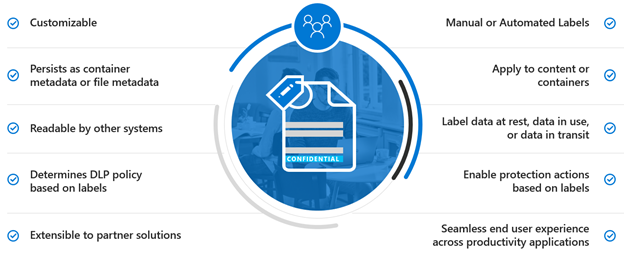

# Защита информации, влияемой на нормы конфиденциальности данныхProtect information subject to data privacy regulation

В вашей подписке можно использовать ряд средств контроля защиты информации, чтобы обеспечить соответствие требованиям и нормативным требованиям в области конфиденциальности данных.A number of information protection controls can be employed in your subscription to help address data privacy compliance needs and regulations. К ним относятся Общий регламент по защите данных (GDPR), HIPAA-HITECH (закон США о конфиденциальности в сфере здравоохранения), Закон Калифорнии о защите потребителей (CCPA) и Закон Бразилии о защите данных (LGPD).These include General Data Protection Regulation (GDPR), HIPAA-HITECH (the United States health care privacy act), California Consumer Protection Act (CCPA), and the Brazil Data Protection Act (LGPD).

Эти элементы управления находятся в следующих областях решения:These controls are within following solution areas:

- Метки конфиденциальностиSensitivity labels
- Предотвращение потери данных (DLP)Data loss prevention (DLP)
- Шифрование сообщений Office (OME)Office message encryption (OME)
- Элементы управления доступом Teams и сайтовTeams and sites access controls

>[!Note]
>В этом решении описываются функции обеспечения безопасности и соответствия требованиям для защиты информации, на которую налагаются правила конфиденциальности данных.This solution describes security and compliance features to protect information subject to data privacy regulations. Полный список функций безопасности в Microsoft 365 см. в документации [по безопасности Microsoft 365.](https://docs.microsoft.com/microsoft-365/security/)For a complete list of security features in Microsoft 365, see [Microsoft 365 security documentation](https://docs.microsoft.com/microsoft-365/security/). Полный список функций обеспечения соответствия требованиям в Microsoft 365 см. в документации по [обеспечению соответствия требованиям Microsoft 365.](https://docs.microsoft.com/microsoft-365/compliance/)For a complete list of compliance features in Microsoft 365, see [Microsoft 365 compliance documentation](https://docs.microsoft.com/microsoft-365/compliance/).
>

## Нормативы конфиденциальности данных, которые влияют на средства контроля защиты информацииData privacy regulations that impact information protection controls

Вот пример нормативов конфиденциальности данных, которые могут относиться к средствам контроля защиты информации:Here is a sample list of data privacy regulations that may relate to information protection controls:

- Статья GDPR 5(1)(f))GDPR Article 5(1)(f))
- Статья GDPR (32)(1)(a)GDPR Article (32)(1)(a)
- Статья 46, посвященная LGPDLGPD Article 46
- HIPAA-HITECH (45 CFR 164.312(e)(1))HIPAA-HITECH (45 CFR 164.312(e)(1))
- HIPAA-HITECH (45 C.F.R.HIPAA-HITECH (45 C.F.R. 164.312(e)(2)(ii))164.312(e)(2)(ii))

Дополнительные [сведения о каждом из](information-protection-deploy-assess.md) вышеперечисленных пунктов см. в статье об оценке рисков конфиденциальности данных и определении конфиденциальных элементов.See the [assess data privacy risks and identify sensitive items article](information-protection-deploy-assess.md) for more information on each of the above.

Правила конфиденциальности данных для защиты информации рекомендуется:Data privacy regulations for information protection recommend:

- Защита от потери или несанкционированного доступа, использования и/или передачи.Protection against loss or unauthorized access, usage and/or transmission.
- Применение защитных механизмов с учетом рисков.Risk-based application of protective mechanisms.
- Используйте шифрование, если это необходимо.Use of encryption where appropriate.

Вашей организации также может потребоваться защитить контент Microsoft 365 для других целей, таких как другие требования или бизнес-причины.Your organization may also want to protect Microsoft 365 content for other purposes, such as other compliance needs or for business reasons. Создание схемы защиты информации для обеспечения конфиденциальности данных должно быть сделано в рамках общего планирования, внедрения и управления защитой информации.Establishing your information protection scheme for data privacy should be done as part of overall information protection planning, implementation, and management.

Чтобы помочь вам начать работу со схемой защиты информации в Microsoft 365, в следующем разделе содержится краткий список связанных возможностей и действий по улучшению для Microsoft 365.To help you get started with an information protection scheme in Microsoft 365, the following section includes a short list of related capabilities and improvement actions for Microsoft 365. Этот список содержит возможности и действия по улучшению, применимые к нормативам конфиденциальности данных.The list includes capabilities and improvement actions that are applicable to data privacy regulations. Однако список не включает старые технологии, если есть более новые возможности, которые в значительной степени замеют старую.However, the list doesn't include older technologies if there's a newer capability that largely supersedes the older one. Например, управление правами на данные (IRM) для SharePoint и OneDrive не включено в список, но метки конфиденциальности включены.For example, Information Rights Management (IRM) for SharePoint and OneDrive is not included in the list but sensitivity labels are included.

## Управление защитой информации в Microsoft 365Managing information protection in Microsoft 365

Решения [Майкрософт для защиты](../compliance/information-protection.md) информации включают ряд интегрированных возможностей в Microsoft 365, Microsoft Azure и Microsoft Windows.Microsoft [information protection solutions](../compliance/information-protection.md) include a number of integrated capabilities across Microsoft 365, Microsoft Azure, and Microsoft Windows. В Microsoft 365 решения для защиты информации включают:In Microsoft 365, information protection solutions include:

- [Шифрование службы с помощью ключа клиентаService encryption with Customer Key](../compliance/customer-key-overview.md)
- [Типы конфиденциальной информации](../compliance/what-the-sensitive-information-types-look-for.md) (описанные в статье об оценке рисков конфиденциальности данных [и определении конфиденциальных элементов)](information-protection-deploy-assess.md)[Sensitive information types](../compliance/what-the-sensitive-information-types-look-for.md) (described in the [assess data privacy risks and identify sensitive items article](information-protection-deploy-assess.md))
- [Метки конфиденциальностиSensitivity labels](../compliance/sensitivity-labels.md) 
  - Уровень обслуживания/контейнераService/container-level
  - На стороне клиента или на уровне контентаClient-side/content-level
  - Автоматическая обработка неавтоматизированных данных в SharePoint и OneDriveAutomated for data-at-rest in SharePoint and OneDrive
- Защита от потери данных (DLP)Data Loss Prevention (DLP)
- [Предотвращение потери данных конечной точки Microsoft 365 (предварительная версия)Microsoft 365 Endpoint data loss prevention (preview)](https://docs.microsoft.com/microsoft-365/compliance/endpoint-dlp-learn-about?view=o365-worldwide)
- Новые возможности шифрования сообщений [Office 365 (OME)](../compliance/ome.md) и OME [Advanced Message Encryption](../compliance/ome-advanced-message-encryption.md)[Office 365 Message Encryption new capabilities (OME)](../compliance/ome.md) and OME [Advanced Message Encryption](../compliance/ome-advanced-message-encryption.md)

Кроме того, защита на уровне сайта и библиотеки — это важные механизмы, которые необходимо включить в любую схему защиты.In addition, site and library level protection are important mechanisms to include in any protection scheme.

Сведения о других возможностях защиты информации за пределами Microsoft 365 см. в:For information on other information protection capabilities outside of Microsoft 365, see:

- [Microsoft Cloud Application Security (MCAS)Microsoft Cloud Application Security (MCAS)](https://docs.microsoft.com/cloud-app-security/)
- [Azure Information ProtectionAzure Information Protection](https://docs.microsoft.com/azure/information-protection/what-is-information-protection)
- [Microsoft Endpoint ManagerMicrosoft Endpoint Manager](https://www.microsoft.com/microsoft-365/microsoft-endpoint-manager)
- [Windows Information ProtectionWindows Information Protection](https://docs.microsoft.com/windows/security/information-protection/windows-information-protection/protect-enterprise-data-using-wip)

## Метки конфиденциальностиSensitivity labels

Метки конфиденциальности из структуры Microsoft Information Protection позволяет классифицировать и защищать данные организации, не метивировать производительности пользователей и их возможности совместной работы.Sensitivity labels from the Microsoft Information Protection framework let you classify and protect your organization's data without hindering the productivity of users and their ability to collaborate.

### Необходимые условия для меток конфиденциальностиPrerequisites for sensitivity labels

Выполните эти действия перед реализацией любой из возможностей на основе меток конфиденциальности, указанных ниже:Complete these activities prior to implementing any of the sensitivity label-based capabilities highlighted below:

1. В этой теме приводится понимание следующих понятий:Understand the following:
   - **Бизнес-требования.****Business requirements.** Определить бизнес-причины применения меток конфиденциальности на предприятии.Establish the business reasons for applying sensitivity labels in your enterprise. Например, требования к конфиденциальности данных для защиты информации.For example, your data privacy requirements for information protection.
   - **Возможности меток конфиденциальности.****Sensitivity label capabilities.** Метки конфиденциальности могут быть сложными,  поэтому перед началом работы обязательно ознакомьтесь с документацией по метки конфиденциальности.Sensitivity labeling can get complex, so make sure to read the [sensitivity labels documentation](../compliance/sensitivity-labels.md) before getting started.
   - **Основные моменты, которые необходимо запомнить** Метки конфиденциальности управляются в Центре администрирования соответствия требованиям Майкрософт, но параметры таргетинга и приложений значительно различаются.**Key things to remember** Sensitivity labels are managed in the Microsoft Compliance admin center but the targeting and application options vary significantly.
      - На уровне контейнера существуют метки конфиденциальности для сайтов, групп и Teams (параметры не применяются к контенту внутри контейнера).There are sensitivity labels for sites, groups, and Teams at the container level (the settings do not apply to content inside the container). Они публикуются для пользователей и групп, которые применяют их при предоставлении сайта, группы или группы.These are published to users and groups who apply them when a site, group or Team is provisioned.
      - Для активного содержимого существуют метки конфиденциальности.There are sensitivity labels for active content. Они также публикуются для пользователей или групп, которые применяют их вручную или применяются автоматически, когда:These are also published to user or groups, who either manually apply them, or they get applied automatically when:
        - Файл открывается, редактируется и сохраняются на рабочем столе пользователя или на сайте SharePoint.The file is opened/edited/saved, either to the user’s desktop or a SharePoint site.
        - Сообщение электронной почты составляется и отправляется.An email is drafted and sent.
      - В SharePoint и OneDrive помимо сообщений электронной почты, которые проходят через Exchange, существуют метки конфиденциальности для автоматического приложения к файлам в неавтоматической папке.There are sensitivity labels for automatic application to files at rest in SharePoint and OneDrive in addition to emails in transit through Exchange. Они нацелены либо на все сайты, либо на определенные сайты и автоматически применяются к неавтным файлам в этих средах.These are targeted to either all sites or specific ones and automatically apply to the files at rest in these environments.

2. Рационализация текущих меток конфиденциальности с помощью прошлых или альтернативных методовRationalize current sensitivity labeling with past or alternative methods

   - Azure Information ProtectionAzure Information Protection

      Текущую схему меток конфиденциальности может потребоваться согласовать с любой существующей реализацией меток [Azure Information Protection.](../compliance/sensitivity-labels.md#sensitivity-labels-and-azure-information-protection)The current sensitivity labeling scheme may need to be reconciled with any existing [Azure Information Protection](../compliance/sensitivity-labels.md#sensitivity-labels-and-azure-information-protection) labeling implementation.
   - OMEOME

      Если вы планируете использовать современные метки конфиденциальности для защиты электронной почты и существующие методы шифрования электронной почты, такие как OME, они могут сосуществовать, но вам следует понять сценарии, в которых следует применять те или иные из них.If you are planning to use modern sensitivity labeling for email protection and existing email encryption methods like OME are in place, they can co-exist, but you should understand the scenarios in which either should be applied. См. новые возможности шифрования сообщений [Office 365 (OME),](#office-365-message-encryption-ome-new-capabilities)в том числе таблицу, сравниваемую современную защиту на основе меток конфиденциальности с защитой на основе OME.See [Office 365 Message Encryption new capabilities (OME)](#office-365-message-encryption-ome-new-capabilities), which includes a table comparing modern sensitivity label-type protection with OME-based protection.

3. Планирование интеграции в более широкую схему защиты информации.Plan for integration into a broader information protection scheme. Помимо сосуществования с OME, текущие метки конфиденциальности можно использовать наряду с возможностями, например Microsoft 365 data loss prevention (DLP) и Microsoft Cloud App Security.On top of coexistence with OME, current sensitivity labels can be used along-side capabilities like Microsoft 365 data loss prevention (DLP) and Microsoft Cloud App Security. Чтобы достичь целей защиты информации, связанных с конфиденциальностью данных, см. метки конфиденциальности и [Microsoft Cloud App Security.](../compliance/sensitivity-labels.md#sensitivity-labels-and-microsoft-cloud-app-security)See [Sensitivity Labels and Microsoft Cloud App Security](../compliance/sensitivity-labels.md#sensitivity-labels-and-microsoft-cloud-app-security) to achieve your data privacy-related information protection goals.

4. Разработайте классификацию меток конфиденциальности и схему управления.Develop a sensitivity label classification and control scheme. См. [сведения о классификации данных и таксономии меток конфиденциальности.](https://aka.ms/dataclassificationwhitepaper)See [Data Classification and Sensitivity Label Taxonomy](https://aka.ms/dataclassificationwhitepaper).

### Общие рекомендацииGeneral guidance

1. **Определение схемы.****Schema definition.** Прежде чем использовать технические возможности для применения меток и защиты, определите схему классификации во всей организации.Before using technical capabilities to apply labels and protection, work across your organization to define a classification schema. Возможно, у вас уже есть схема классификации, которая упрощает добавление персональных данных.You might already have a classification schema, which makes it easier to add personal data. 
2. **Начало работы.****Getting started.** Начните с принятия решения о количестве и именах меток для реализации.Begin by deciding on the number and names of labels to implement. Сделайте это действие, не беспокоясь о том, какую технологию использовать и как метки будут применяться.Do this activity without worrying about which technology to use and how labels will be applied. Применяйте эту схему универсально во всей организации, включая данные, которые находятся локально и в других облачных службах.Apply this schema universally throughout your organization, including data that resides on premises and in other cloud services.
3. **Дополнительные рекомендации** При разработке и внедрении политик, меток и условий рассмотрите следующие рекомендации:**Additional recommendations** When designing and implementing policies, labels, and conditions, consider following these recommendations:

   - **Используйте существующую схему классификации (при ее использовании).****Use existing classification schema (if any).** Многие организации уже используют классификацию данных в определенной форме.Many organizations already are using data classification in some form. Тщательно оцените существующую схему меток и, по возможности, используйте ее как есть.Carefully evaluate the existing label schema and if possible, use it as is. Использование знакомых меток, которые понятны конечным пользователям, повысят внедрение.Using familiar labels that are recognizable to your end-users will drive adoption.
   - **Начните с малого.****Start small.** Количество подписей, которые можно создать, практически не ограничивается.There is virtually no limit to the number of labels that you can create. Однако большое количество меток и подметок может замедлить внедрение.However, large numbers of labels and sub-labels can slow adoption.
   - **Используйте сценарии и сценарии использования.****Use scenarios and use cases.** Определите распространенные случаи использования в организации и сценарии использования, производные от правил конфиденциальности данных, к которым вы подчинялись.Identify common use cases within your organization and use scenarios derived from the data privacy regulations to which you are subject. Проверьте, будет ли предполагаемая конфигурация меток и классификации работать на практике.Verify if the envisioned label and classification configuration will work in practice.
   - **Запросить каждый запрос новой метки.****Question every request for a new label.** Нужен ли каждому сценарию или варианту использования новая метка или вы можете использовать то, что у вас уже есть?Does every scenario or use case really need a new label or can you use what you already have? Минимальное количество меток улучшает внедрение.Keeping the number of labels to a minimum improves adoption.
   - **Используйте в подчиненную метку для ключевых отделов.****Use sub-labels for key departments.** У некоторых отделов будут особые потребности, для работы с которые требуются определенные метки.Some departments will have specific needs that require specific labels. Определите эти метки как в подчиненные метки для существующей метки и рассмотрите возможность использования политик с областью действия, которые назначены группам пользователей, а не глобально.Define these labels as sub-labels to an existing label and consider using scoped policies that are assigned to user groups instead of globally.
   - **Рассмотрите политики с областью действия.****Consider scoped policies.** Политики, нацеленные на подмайки пользователей, предотвращают перегрузку меток.Policies targeted at subsets of users will prevent label overload. Политика с областью действия позволяет назначать метки ролей или отделов или вуч только сотрудникам, работающим в этом отделе.A scoped policy enables assigning role or department specific labels or sub-labels to just employees that work for that specific department. 
   - **Используйте осмысленные имена меток.****Use meaningful label names.** Старайтесь не использовать в качестве имен меток жаргон, стандарты или акронимы.Try not to use jargon, standards, or acronyms as label names. Чтобы улучшить внедрение, попробуйте использовать имена, которые будут совершенствоваться с конечным пользователем.Try to use names that resonate with the end user to improve adoption. Вместо таких меток, как PII, PCI, HIPAA, LBI, MBI и HBI, рассмотрите такие имена, как "Не бизнес", "Общедоступный", "Общие", "Конфиденциально" и "Строго конфиденциально".Instead of using labels like PII, PCI, HIPAA, LBI, MBI and HBI, consider names like Non-Business, Public, General, Confidential and Highly Confidential.

### Создание и развертывание меток конфиденциальности для сайтов, групп и группCreate and deploy sensitivity labels for sites, groups, and teams

При создании [меток конфиденциальности](../compliance/sensitivity-labels-teams-groups-sites.md) в Центре соответствия требованиям Microsoft 365 вы можете применить их к этим контейнерам:When you create [sensitivity labels](../compliance/sensitivity-labels-teams-groups-sites.md) in the Microsoft 365 compliance center, you can now apply them to these containers:

- Сайты Microsoft TeamsMicrosoft Teams sites
- Группы Microsoft 365 (ранее группы Office 365)Microsoft 365 groups (formerly Office 365 groups)
- сайты SharePointSharePoint sites

Используйте следующие параметры метки, чтобы защитить содержимое этих контейнеров:Use the following label settings to help protect the content in those containers:

- Конфиденциальность (общедоступных или частных) сайтов Teams, подключенных к группам Microsoft 365Privacy (public or private) of Microsoft 365 group-connected Teams sites
- Доступ внешних пользователейExternal user access
- Доступ с неуправляемых устройствAccess from unmanaged devices

Для обеспечения конфиденциальности данных, чтобы предотвратить внешний общий доступ для контейнеров, которые будут использоваться для хранения контента с конфиденциальными персональными данными, пометить файлы, содержащие данные, как частные, и требовать управляемых устройств.For data privacy, to prevent external sharing for containers that will be used for storing content with sensitive personal data, mark the files containing the data as private, and require managed devices.

### Создание и развертывание меток конфиденциальности для контентаCreate and deploy sensitivity labels for content

Метки конфиденциальности, применяемые к файлам, позволяют шифровать их содержимое, подкапливать содержимое и определять другие элементы управления для содержимого приложений Office, включая Outlook и Office в Интернете.Sensitivity labels applied to files allow you to encrypt their content, watermark the content, and define other controls for Office applications content, including Outlook and Office on the web.

Когда вы будете готовы начать защищать данные организации с помощью меток конфиденциальности:When you're ready to start protecting your organization's data with sensitivity labels:

1. **Создание меток.****Create the labels.** Создайте и назовите метки конфиденциальности согласно таксономии классификации вашей организации для разных уровней конфиденциальности контента.Create and name your sensitivity labels according to your organization's classification taxonomy for different sensitivity levels of content. Дополнительные сведения о разработке таксономии классификации см. в документе "Классификация данных и таксономия меток [конфиденциальности".](https://aka.ms/dataclassificationwhitepaper)For more information on developing a classification taxonomy, see the [Data Classification and Sensitivity Label Taxonomy white paper](https://aka.ms/dataclassificationwhitepaper).
2. **Определение возможностей каждой метки.****Define what each label can do.** Настройте параметры защиты, связанные с каждой меткой.Configure the protection settings you want associated with each label. Например, может потребоваться, чтобы к содержимому с более низкой конфиденциальности (например, меткой "Общие") применялся только нижний или нижний нижний уровень, а к содержимому с более высокими уровнями конфиденциальности (например, меткой "Конфиденциально") должен быть подгон и включено шифрование.For example, you might want lower sensitivity content (such as a "General" label) to have just a header or footer applied, while higher sensitivity content (such as a "Confidential" label) should have a watermark and have encryption enabled.
3. **Публикация меток.****Publish the labels.** После настройки меток конфиденциальности опубликуйте их с помощью политики меток.After your sensitivity labels are configured, publish them by using a label policy. Определите, какие пользователи и группы должны иметь доступ к меткам и какие параметры политики использовать.Decide which users and groups should have the labels and what policy settings to use. Одна метка может быть повторной.A single label is reusable. Вы определяете его один раз, а затем можете включить в несколько политик меток, которые назначены разным пользователям.You define it once and then you can include it in several label policies assigned to different users.

После публикации меток конфиденциальности в Центре соответствия требованиям Microsoft 365 они начинают отображаться в приложениях [Office,](../compliance/sensitivity-labels-office-apps.md) чтобы пользователи могли классифицировать и защищать контент по мере его создания или редактирования.Once you publish sensitivity labels from the Microsoft 365 compliance center, they start to appear in [Office apps](../compliance/sensitivity-labels-office-apps.md) for users to classify and protect content as it's created or edited.

Для обеспечения конфиденциальности данных вы вручную применяем метку конфиденциальности с шифрованием и другими правилами к электронной почте или содержимому, содержащим конфиденциальную личную информацию.For data privacy, you manually apply a sensitivity label with encryption and other rules to email or content containing sensitive personal information.

>[!Note]
>Метки конфиденциальности с включенным шифрованием, примененными к электронной почте, имеют некоторые перекрывающиеся функции с OME.Sensitivity labels with encryption enabled applied to email have some overlapping functionality with OME. См. [сравнение сценариев безопасной электронной почты с OME и меток конфиденциальности.](#secure-email-scenarios-comparison-with-ome-and-sensitivity-labels)See [Secure email scenarios comparison with OME and sensitivity labels](#secure-email-scenarios-comparison-with-ome-and-sensitivity-labels).

### Автоматическое маркировка на стороне клиента при редактировании документов или записи сообщений электронной почтыClient-side auto-labeling when users edit documents or compose emails

При создании метки конфиденциальности  вы можете автоматически назначить эту метку содержимому, включая электронную почту, если она соответствует задамым условиям.When you create a sensitivity label, you can [automatically assign that label](../compliance/apply-sensitivity-label-automatically.md) to content including email when it matches conditions that you specify.

Возможность автоматически применять метки конфиденциальности к содержимому важна, потому что:The ability to apply sensitivity labels to content automatically is important because:

- не потребуется обучать пользователей работе с классификациями;You don't need to train your users when to use each of your classifications.
- вам не нужно будет рассчитывать на то, что пользователи правильно классифицируют весь контент;You don't need to rely on users to classify all content correctly.
- пользователям больше не нужно будет знать о ваших политиках — они могут сосредоточиться на своей работе.Users no longer need to know about your policies—they can instead focus on their work.

Автоматическое применение меток поддерживает рекомендации по метке для пользователей, а также автоматическое применение метки.Auto-labeling supports recommending a label to users, as well as automatically applying a label. В обоих случаях пользователь решает, принять или отклонить метку, чтобы добиться правильного применения меток к содержимому.But in both cases, the user decides whether to accept or reject the label, to help ensure the correct labeling of content.

Применение меток на стороне клиента сопряжено с минимальными задержками для документов, поскольку метку можно применить еще до сохранения документа.This client-side labeling has minimal delay for documents because the label can be applied even before the document is saved. Тем не менее, не все клиентские приложения поддерживают автоматическое применение меток.However, not all client apps support auto-labeling. Эта возможность поддерживается клиентом унифицированных меток Azure Information Protection и [некоторыми версиями приложений Office.](../compliance/sensitivity-labels-office-apps.md#support-for-sensitivity-label-capabilities-in-apps)This capability is supported by the Azure Information Protection unified labeling client, and [some versions of Office apps](../compliance/sensitivity-labels-office-apps.md#support-for-sensitivity-label-capabilities-in-apps).

Инструкции по настройке см. в инструкциях по настройке автоматического [маркировки для приложений Office.](../compliance/sensitivity-labels-office-apps.md#support-for-sensitivity-label-capabilities-in-apps)For configuration instructions, see [How to configure auto-labeling for Office apps](../compliance/sensitivity-labels-office-apps.md#support-for-sensitivity-label-capabilities-in-apps).

Для обеспечения конфиденциальности данных метки конфиденциальности автоматически применяются к содержимому, содержащим конфиденциальные персональные данные.For data privacy, you auto-apply sensitivity labels for content containing sensitive personal information.

### Автоматическое маркировка на стороне службы, когда контент уже сохраненService-side auto-labeling when content is already saved

Этот метод называется автоматической классификацией с метками конфиденциальности.This method is referred to as auto classification with sensitivity labels. Вы также можете услышать, что это называется автоматической маркировкой неавтоматных данных (для документов в SharePoint и OneDrive) и данных в пути (для электронной почты, отправленной или полученной Exchange).You might also hear it referred to as auto-labeling for data at rest (for documents in SharePoint and OneDrive) and data in transit (for email that is sent or received by Exchange). Для Exchange он не включает сообщения электронной почты в неавтных почтовых ящиках.For Exchange, it doesn't include emails in mailboxes at rest.
 
Так как метки применяются самой службой, а не пользовательским приложением, вам не нужно беспокоиться о том, какие приложения есть у пользователей и какая версия.Because this labeling is applied by the service itself rather than by user application, you don't need to worry about what apps users have and what version. Поэтому эта функция доступна сразу во всей организации и пригодна для крупномасштабного применения меток.As a result, this capability is immediately available throughout your organization and suitable for labeling at scale. Политики автоматического применения меток не поддерживают рекомендуемые метки, поскольку пользователь не взаимодействует с процессом применения меток.Auto-labeling policies don't support recommended labeling because the user doesn't interact with the labeling process. Вместо этого администратор запускает политики в режиме имитации, чтобы убедиться в правильности меток содержимого до фактического применения меток.Instead, the administrator runs the policies in simulation mode to help ensure the correct labeling of content before actually applying the label.

Инструкции по настройке см. в инструкциях по настройке политик автоматического маркировки [для SharePoint, OneDrive и Exchange.](../compliance/apply-sensitivity-label-automatically.md#how-to-configure-auto-labeling-policies-for-sharepoint-onedrive-and-exchange)For configuration instructions, see [How to configure auto-labeling policies for SharePoint, OneDrive, and Exchange](../compliance/apply-sensitivity-label-automatically.md#how-to-configure-auto-labeling-policies-for-sharepoint-onedrive-and-exchange).

Для обеспечения конфиденциальности данных на интересущих сайтах метки конфиденциальности можно нажимать для автоматического шифрования контента, содержащего конфиденциальную личную информацию.For data privacy within sites of concern, push sensitivity labels for automatic encryption of content containing sensitive personal information.

## Защита от потери данныхData loss prevention 

Вы можете использовать службу защиты от потери данных [(DLP)](../compliance/data-loss-prevention-policies.md) в Microsoft 365, чтобы обнаруживать, предупреждать и блокировать рискованный, непреднамеренное или недопустимое совместное использование, например обмен данными, содержащими персональные данные, как внутри, так и извне.You can use [data loss prevention (DLP)](../compliance/data-loss-prevention-policies.md) in Microsoft 365 to detect, warn, and block risky, inadvertent, or inappropriate sharing, such as sharing of data containing personal information, both internally and externally.

DLP позволяет:DLP allows you to:

- Выявляйте и отслеживайте рискованные действия по совместному доступу.Identify and monitor risky sharing activities.
- Учим пользователей с рекомендациями в контексте принимать правильные решения.Educate users with in-context guidance to make the right decisions.
- Применение политик использования данных к контенту без снижения производительности.Enforce data use policies upon content without inhibiting productivity.
- Интеграция с классификацией и маркировкой для обнаружения и защиты данных при их совместном доступе.Integrate with classification and labeling to detect and protect data when it is shared.

### Поддерживаемые рабочие нагрузки для DLPSupported workloads for DLP

С помощью политики DLP в Центре соответствия требованиям Microsoft 365 вы можете идентифицировать, отслеживать и автоматически защищать конфиденциальные элементы во многих расположениях Microsoft 365, таких как Exchange Online, SharePoint, OneDrive и Microsoft Teams.With a DLP policy in the Microsoft 365 compliance center, you can identify, monitor, and automatically protect sensitive items across many locations in Microsoft 365, such as Exchange Online, SharePoint, OneDrive, and Microsoft Teams.

Например, можно определить любой документ, содержащий номер кредитной карты, который хранится на любом сайте OneDrive, или отслеживать только сайты OneDrive определенных людей.For example, you can identify any document containing a credit card number that's stored in any OneDrive site, or you can monitor just the OneDrive sites of specific people.

Вы также можете отслеживать и защищать конфиденциальные элементы в локально установленных версиях Excel, PowerPoint и Word, которые включают возможность идентифицировать конфиденциальные элементы и применять политики DLP.You can also monitor and protect sensitive items in the locally-installed versions of Excel, PowerPoint, and Word, which include the ability to identify sensitive items and apply DLP policies. DLP обеспечивает непрерывный мониторинг при совместном доступе людей к содержимому из этих приложений Office.DLP provides continuous monitoring when people share content from these Office apps.

На этом рисунке показан пример защиты персональных данных от данной защиты.This figure shows an example of DLP protecting personal data.

DLP используется для идентификации документа или сообщения электронной почты, содержащего запись о состоянии здоровья, а затем автоматически блокирует доступ к этому документу или блокирует отправку сообщения электронной почты.DLP is used to identify a document or email containing a health record and then automatically blocks access to that document or blocks the email from being sent. Затем DLP оповещает получателя подсказкой политики и отправляет оповещение конечному пользователю и администратору.DLP then notifies the recipient with a policy tip and sends an alert to the end-user and admin.

### Планирование DLPPlanning for DLP

Планирование политик DLP для:Plan your DLP policies for: 

- Бизнес-требования.Your business requirements.

- Оценка организации с учетом рисков, описанная в статье об оценке рисков конфиденциальности данных и [определении конфиденциальных элементов.](information-protection-deploy-assess.md)A risk-based assessment of the organization as described in the [assess data privacy risks and identify sensitive items article](information-protection-deploy-assess.md).

- Другие механизмы защиты информации и управления в организации или планировании конфиденциальности данных.Other information protection and governance mechanisms in place or in planning for data privacy.

- Типы конфиденциальной информации, которые вы определили для персональных данных на основе вашей оценки работы, как описано в оценке рисков конфиденциальности данных и определении [конфиденциальных элементов статьи](information-protection-deploy-assess.md).The sensitive information types that you’ve identified for personal data based on your assessment work as described in the [assess data privacy risks and identify sensitive items article](information-protection-deploy-assess.md). Условия политики DLP могут основываться как на типах конфиденциальной информации, так и на метах хранения.DLP policy conditions can be based on both sensitive information types and retention labels.

- Метки хранения, которые необходимо указать для условий DLP.The retention labels you'll need to specify DLP conditions. Дополнительные сведения см. в статье об управлении информацией, [подавляемой](information-protection-deploy-govern.md) согласно правилам конфиденциальности данных в вашей организации.See the [govern information subject to data privacy regulation in your organization](information-protection-deploy-govern.md) article for more information.

- Непрерывное управление политиками DLP, которое требует от кого-либо из организации действовать и настраивать политики для изменений в типах конфиденциальной информации, метах хранения, нормативах и политиках соответствия требованиям.Ongoing DLP policy management, which requires someone in the organization to operate and tune policies for changes in sensitive information types, retention labels, regulations, and compliance policies.

Хотя метки конфиденциальности нельзя использовать в условиях политики DLP, некоторые сценарии защиты для предотвращения доступа могут быть достижимы с помощью только меток конфиденциальности, которые можно автоматически применять на основе типов конфиденциальной информации.Although sensitivity labels can’t be used in DLP policy conditions, certain protection scenarios to prevent access may be achievable with just sensitivity labels that can be auto-applied based on sensitive information types. Если применяется надежное маркировка конфиденциальности, подумайте, следует ли использовать DLP для расширения защиты, так как:If robust sensitivity labeling is in place, consider whether DLP should be used to augment protection because:

  - DLP может запретить общий доступ к файлам.DLP can prevent sharing of files. Метки конфиденциальности могут просто запретить доступ.Sensitivity labels can just prevent access.

  - DLP имеет более детализированный уровень контроля с точки зрения правил, условий и действий.DLP has more granular levels of control in terms of rules, conditions, and actions.

  - Политики DLP можно применять к сообщениям чата и канала Teams.DLP policies can be applied to Teams chat and channel messages. Метки конфиденциальности можно применять только к документам и электронной почте.Sensitivity labels can only be applied to documents and email.

### Политики защиты от потери данныхDLP policies

Политики DLP настраиваются в Центре администрирования соответствия требованиям Майкрософт и указывают уровень защиты, тип конфиденциальной информации, который ищет политика, а также целевые рабочие нагрузки.DLP policies are configured in the Microsoft Compliance admin center and specify the level of protection, the sensitive information type the policy is looking for, and the target workloads. Их основные компоненты состоят из определения защиты и типов данных.Their basic components consist of identifying the protection and the types of data.

Вот пример политики DLP для информирования о GDPR.Here is an example DLP policy for awareness of GDPR.

Дополнительные [сведения о](../compliance/create-test-tune-dlp-policy.md) создании и применении политик DLP см. в этой статье.See [this article](../compliance/create-test-tune-dlp-policy.md) for more information about creating and applying DLP policies.

### Уровни защиты конфиденциальности данныхProtection levels for data privacy

В следующей таблице перечислены три конфигурации повышения защиты с помощью DLP.The following table lists three configurations of increasing protection using DLP.

Первую конфигурацию "Осведомленность" можно использовать в качестве отправной точки и минимального уровня защиты для соответствия требованиям нормативных требований к конфиденциальности данных.The first configuration, Awareness, can be used as a starting point and minimum level of protection to address compliance needs for data privacy regulations.

>[!Note]
>По мере повышения уровней защиты в некоторых случаях снижается способность пользователей обмениваться информацией и получать к ним доступ, что потенциально может повлиять на их производительность или способность выполнять повседневные задачи.As the levels of protection increase, the ability of users to share and access information will decrease in some cases and could potentially impact their productivity or ability to complete daily tasks.
>

Чтобы ваши сотрудники по-прежнему эффективно работают в более безопасной среде при повышении уровней защиты, у вас будет время для обучения и обучения сотрудников новым политикам и процедурам безопасности.To help your employees continue to be productive in a more secure environment when increasing protection levels, take the time to train and educate them on new security policies and procedures.

### Пример использования меток конфиденциальности с DLPExample of using sensitivity labels with DLP

Метки конфиденциальности могут работать вместе с DLP для обеспечения конфиденциальности данных в среде с жестко регламента.Sensitivity labels can work together with DLP to provide data privacy in a highly regulated environment. Ниже ключевых этапов интегрированного развертывания.Here are the key steps of the integrated deployment:

1. Задокументированы нормативные и иные бизнес-требования в отношении конфиденциальности данных.Regulatory and otherwise business requirements for data privacy are documented.
2. Целевые источники данных, типы и права собственности характеризуются в связи с конфиденциальностью данных.Target data sources, types, and ownership are characterized relative to data privacy concerns.
3. Создана общая стратегия для решения требований, защиты и управления хот-спотами конфиденциальности данных.An overall strategy to address requirements and protect and govern data privacy hotspots is established.
4. В настоящее время имеется план поэтапных действий для решения стратегии управления конфиденциальностью данных.A phased action plan to address the data privacy control strategy is put into place.

После того как эти элементы будут определены, вы сможете использовать типы конфиденциальной информации, таксономию меток конфиденциальности и политики DLP.Once these elements are determined, you can use sensitive information types, your sensitivity labeling taxonomy, and DLP policies together. На этом рисунке показан пример.This figure shows an example.

[См. более крупную версию этого изображенияSee a larger version of this image](https://github.com/MicrosoftDocs/microsoft-365-docs/raw/public/microsoft-365/media/information-protection-deploy-protect-information/information-protection-deploy-protect-information-sensitivity-lables-dlp.png)

Ниже показаны некоторые сценарии защиты данных с использованием DLP и меток конфиденциальности, как показано на рисунке.Here are some data protection scenarios using DLP and sensitivity labels together as shown in the figure.

| СценарийScenario | ПроцессProcess |
|:-------|:-----|
| AA | <ol><li>Метки конфиденциальности для содержимого публикуются администратором для пользователей и групп для ручного или автоматического применения к содержимому и электронной почте.Sensitivity labels for content are published by an administrator to users and groups for manual or automatic application to content and email. </li><li>Пользователь А применяет метки вручную или автоматически при взаимодействии с содержимым с помощью шифрования или других параметров.User A applies the labels manually or automatically when interacting with content, with encryption or other settings applied. </li><li>Пользователь А отправляет защищенную электронную почту или файл пользователю Б, гостевому пользователю.User A sends a protected email or file to User B, a guest user. </li></ol> |
| BB | Политика DLP, опубликованная администратором для пользователя А, блокирует отправку пользователем А сообщения электронной почты и/или файла пользователю Б.DLP policy published by an administrator to User A blocks User A from sending the email and/or file to User B. |
| CC |  Метка конфиденциальности с параметром "Владелец не может приглашать гостей" публикуется для пользователя А, который настраивает команду Teams или сайт SharePoint.Sensitivity label with “owner can’t invite guests” setting is published to User A, who provisions a Teams team or SharePoint site. Другой пользователь сайта выборочно пытается поделиться файлом с пользователем B, но DLP блокирует его.Another user of the site selectively tries sharing a file with User B, but DLP blocks it. |
| DD | Метка конфиденциальности для автоматического применения к контенту сайта публикуется на одном или нескольких сайтах, обеспечивая другой уровень защиты, что приводит к защите сайта.Sensitivity label for auto-application to site content is published to one or more sites, providing another layer of protection, resulting in a protected site. |
|||

## Новые возможности шифрования сообщений Office 365 (OME)Office 365 Message Encryption (OME) new capabilities

Люди часто используют электронную почту для обмена конфиденциальными элементами, например сведениями о здоровье пациентов или сведениями о клиентах и сотрудниках.People often use email to exchange sensitive items, such as patient health information or customer and employee information. Шифрование сообщений электронной почты позволяет гарантировать, что только получатели смогут просматривать содержимое сообщения.Email message encryption helps ensure that only intended recipients can view message content.

С [помощью OME](../compliance/ome.md)вы можете отправлять и получать зашифрованные сообщения между людьми внутри и за пределами организации.With [OME](../compliance/ome.md), you can send and receive encrypted messages between people inside and outside your organization. OME работает с Outlook.com, Yahoo!, Gmail и другими службами электронной почты.OME works with Outlook.com, Yahoo!, Gmail, and other email services. OME позволяет гарантировать, что только получатели смогут просматривать содержимое сообщения.OME helps ensure that only intended recipients can view message content.

Для обеспечения конфиденциальности данных используйте OME для защиты внутренних сообщений, содержащих конфиденциальные элементы.For data privacy, you use OME to protect internal messages containing sensitive items. Шифрование сообщений Office 365 — это веб-служба, созданная на основе Службы управления правами Microsoft Azure (Azure RMS), которая входит в состав Azure Information Protection.Office 365 Message Encryption is an online service that's built on Microsoft Azure Rights Management (Azure RMS) which is part of Azure Information Protection. К ним относятся политики шифрования, удостоверений и авторизации для защиты электронной почты.This includes encryption, identity, and authorization policies to help secure your email. Вы можете шифровать сообщения с помощью шаблонов управления правами, параметра "Не переадправление" и параметра "Только шифрование".You can encrypt messages by using rights management templates, the Do Not Forward option, and the encrypt-only option.

Вы также можете определить правила потока почты для применения этой защиты.You can also define mail flow rules to apply this protection. Например, можно создать правило, которое требует шифрования всех сообщений, адресованных определенному получателю, или которое содержит определенные ключевые слова в строке темы, а также указать, что получатели не могут копировать или печатать содержимое сообщения.For example, you can create a rule that requires the encryption of all messages addressed to a specific recipient, or that contains specific keywords words in the subject line, and also specify that recipients can't copy or print the contents of the message.

Кроме того, расширенные средства шифрования сообщений [OME](../compliance/ome-advanced-message-encryption.md) помогают выполнять обязательства по обеспечению соответствия требованиям, которые требуют более гибкого контроля над внешними получателями и их доступом к зашифрованным электронным письмам.In addition, OME [Advanced Message Encryption](../compliance/ome-advanced-message-encryption.md) helps you meet compliance obligations that require more flexible controls over external recipients and their access to encrypted emails. С помощью OME Advanced Message Encryption в Microsoft 365 вы можете управлять конфиденциальными сообщениями электронной почты, которые совместно используют внешние организации, с помощью автоматических политик, которые обнаруживают типы конфиденциальной информации.With OME Advanced Message Encryption in Microsoft 365, you can control sensitive emails shared outside the organization with automatic policies that detect sensitive information types. 

Для обеспечения конфиденциальности данных, если необходимо поделиться электронной почтой с внешней стороной, можно указать дату окончания срока действия и отоискить сообщения.For data privacy, if you need to share email with an external party, you can specify an expiration date and revoke messages. Вы можете отоискить и установить дату окончания срока действия для сообщений, отправленных внешним получателям.You can only revoke and set an expiration date for messages sent to external recipients.

### Сравнение сценариев безопасной электронной почты с OME и метами конфиденциальностиSecure email scenarios comparison with OME and sensitivity labels

Метки OME и конфиденциальности, применяемые к электронной почте с шифрованием, частично перекрываются, поэтому важно понимать, к каким сценариям они могут применяться, как показано в этой таблице.OME and sensitivity labels applied to email with encryption have some overlap, so it’s important to understand which scenarios that either might apply to, as shown in this table.

| СценарийScenario | Метки конфиденциальностиSensitivity Labels | OMEOME |
|:-------|:-----|:-------|
| Внутренние и партнерыInternal + partners   Безопасное взаимодействие и сотрудничество между внутренними пользователями и доверенными партнерамиSecurely communicate and collaborate between internal users and trusted partners | Рекомендация — метки с полностью настраиваемой классификацией и защитойRecommend – labels with fully customized classification and protection | Да — только шифровать или не переададовать защиту без классификацииYes – Encrypt only or Do Not Forward protection with no classification |
| Внешние стороныExternal parties   Безопасное взаимодействие и сотрудничество с любыми внешними или потребительскими пользователямиSecurely communicate and collaborate with any external/consumer users | Да — предописать получателей в меткеYes – predefine recipients in label | Рекомендуемая защита на основе получателейRecommend – just-in-time protection based on recipients |
| Внутренние + партнеры с истечением срока действия или отзывомInternal + partners, with expiration/revocation   Контроль доступа к почте и содержимому с внутренними пользователями и доверенными партнерами по истечении срока действия и отзывуControl access of mail and content with internal users and trusted partners with expiration and revocation | Рекомендация — полностью настраиваемая защита с длительностью доступа, пользователь может вручную отслеживать и отоскить файлыRecommend - fully customized protection with access duration, user can manually track and revoke files | Нет — без отзыва или истечения срока действия для внутренней почтыNo – no revocation or expiration for internal mail |
| Внешние стороны с истечением срока действия или отзывомExternal parties with expiration/revocation   Контроль доступа к почте и содержимому с внешними или потребительскими пользователями с помощью срока действия и отзываControl access of mail and content with external/consumer users with expiration and revocation | Да — пользователь может отслеживать файлы вручнуюYes – user can manually track files | Рекомендация (E5) — администратор может отоскить почту из Центра безопасности & соответствия требованиямRecommend (E5) – admin can revoke mail from Security & Compliance Center |
| Автоматическое маркировкаAuto-labeling   Организация хочет автоматически защитить почту и вложения с помощью определенного конфиденциального содержимого и/или определенных получателейOrganization wants to automatically protect mail/attachments with specific sensitive content and/or specific recipients | Рекомендация (E5) — автоматическое маркировка в клиентах Exchange и Outlook, дополняет правила потока почты и политику DLPRecommend (E5) - Auto-labeling in Exchange and Outlook clients, augments mail flow rules and DLP policy | Да — правила потока почты и политика DLP с защитой только шифрования или без пересылкиYes - mail flow rules and DLP policy with Encrypt only or Do Not Forward protection |
||||

Эти два метода также отличаются в пользовательском интерфейсе и интерфейсе администратора.There will also be differences in end-user and admin experiences between these two methods.

## Teams с защитой высоко конфиденциальных данныхTeams with protection for highly sensitive data

Организации, которые планируют хранить персональные данные, на которые будут лагаться правила конфиденциальности данных в Teams, см. в описании настройки команды с изоляцией системы [безопасности,](secure-teams-security-isolation.md)которая предоставляет подробные инструкции и инструкции по настройке для:For organizations that plan to store personal data subject to data privacy regulations in Teams, see [Configure a team with security isolation](secure-teams-security-isolation.md), which provides detailed guidance and configuration steps for:

- Доступ к удостоверениям и устройствамIdentity and device access
- Создание закрытой командыCreation of a private team
- Блокировка разрешений на доступ к сайту группыLockdown of underlying team site permissions
- Метка конфиденциальности на основе группы с шифрованиемA group-based sensitivity label with encryption
