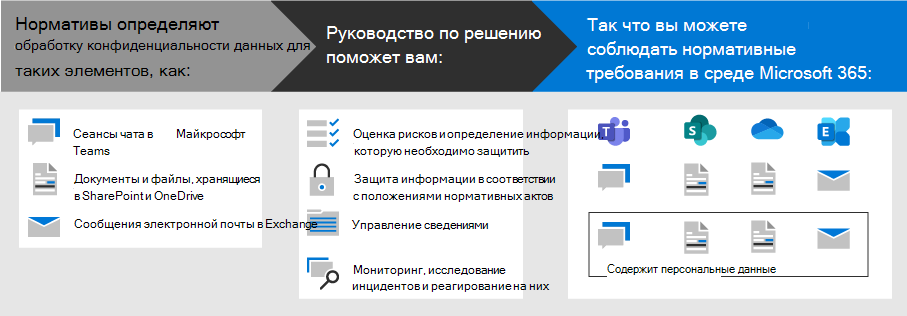

# Развертывание защиты информации для норм конфиденциальности данных с помощью Microsoft 365

Ваша организация может подчиняться региональным нормам конфиденциальности, которые требуют защиты, управления и предоставления прав и управления личными данными, хранящимися в ИТ ИТ, включая как в локальной среде, так и в облаке. Лучший пример соблюдения конфиденциальности данных — общее нормативное положение Европейского союза по защите данных (GDPR). Несоблюдение нормативных требований по конфиденциальности данных может привести к существенным настройкам.

Примеры типов данных в Microsoft 365 включают сеансы чата в Microsoft Teams, сообщения электронной почты в Exchange и файлы в SharePoint и OneDrive. Это решение предоставляет руководство по оценке рисков и определению информации, защите, управления и реагированию на инциденты конфиденциальности данных для персональных данных, хранящихся в службах Microsoft 365, которые подчиняются нормативам конфиденциальности данных.

Кроме того, вы можете получить дополнительные сведения об использовании удостоверений, устройств и средств защиты от угроз Microsoft 365 для обеспечения конфиденциальности данных. 

Чтобы обеспечить соблюдение условий для защиты информации с учетом требований к конфиденциальности данных, используйте следующие возможности и функции Microsoft 365.

| Возможность или функция | Описание | Лицензирование |
|:-------|:-----|:-------|
| Диспетчер соответствия требованиям | Управление действиями соответствия нормативным требованиям, получение общей оценки текущей конфигурации соответствия требованиям и рекомендации по улучшению средства оценки рисков на основе рабочих процессов в центре соответствия требованиям Microsoft 365. | Microsoft 365 E3 и E5 |
| Расширенная защита от угроз Office (ATP) | Защитите от атак свои приложения и данные в Microsoft 365, такие как сообщения электронной почты, документы Office и средства совместной работы. | Microsoft 365 E3 и E5 | 
| Метки конфиденциальности | Классифицируйте и защищайте данные своей организации путем присвоения меток различных уровней защиты сообщениям электронной почты, файлам и сайтам, не вызывая снижения эффективности работы пользователей и не ограничивая возможностей их совместной работы. | Microsoft 365 E3 и E5 |
| Защита от потери данных (DLP) | Выявляйте, создавайте предупреждения и блокируйте рискованное, ненамеренное или нежелательное предоставление общего доступа (внутри и вне организации) к ресурсам, например к информации, содержащей персональные данные. | Microsoft 365 E3 и E5 | 
| Метки и политики хранения данных | Воспользуйтесь такими элементами управления информацией, как параметр продолжительности хранения данных и требования к хранению персональных данных о клиентах, для соблюдения политик организации и нормативных требований в отношении данных. | Microsoft 365 E3 и E5 |
| Шифрование электронной почты | Воспользуйтесь возможностью отправки и получения пользователями в организации и за ее пределами зашифрованных сообщений электронной почты, содержащих данные, на которые распространяется действие нормативных положений, например персональные данные клиентов. | Microsoft 365 E3 и E5 |
||||

## Организация рекомендаций, приведенных в этом решении

Чтобы получить представление о средствах Microsoft 365, доступных для идентификации и управления личными данными, а также для наблюдения за ними, в отношении одного или нескольких нормативных требований, эти рекомендации организованы по разделам.
 

Каждый из этих разделов соответствует отдельной статье в этом решении.

>[!Note]
>Если вы уже знакомы с вашими обязательствами по конфиденциальности данных и их работами с существующим планом, вы можете сосредоточиться на этой статье: предотвращение, защита, сохранение и исследование.

>[!Important]
>Следуя этим рекомендациям, не обязательно забудьте в соответствии с требованиями к конфиденциальности данных, особенно учитывая количество действий, необходимых вне контекста компонентов. Вы несете ответственность за обеспечение соответствия требованиям и соблюдение юридических и нормативных групп, а также поиск рекомендаций и советов от сторонних производителей, специализирующихся на соответствие требованиям.
>

## Plan: Оценка рисков конфиденциальности данных и определение конфиденциальных элементов

Оценка требований к конфиденциальности данных и рисков, на которые распространяется ваша организация, является ключевым первым шагом, прежде чем приступить к внедрению усовершенствований, в том числе доступных с помощью конфигурации Microsoft 365. Это может быть полная оценка готовности или идентификация определенных типов конфиденциальной информации, которые подчиняются нормативным требованиям, а также их появлениям в среде Microsoft 365.

Дополнительную информацию можно узнать в статье [Оценка рисков конфиденциальности данных и определение конфиденциальных элементов](information-protection-deploy-assess.md).

## Отслеживание: Запуск оценки риска и проверка оценки соответствия требованиям

Диспетчер соответствия требованиям, доступный в центре соответствия требованиям Microsoft 365, предоставляет встроенную возможность отслеживания и управления действиями по улучшению в целом, а также связанные с несколькими нормативами конфиденциальности, которые относятся к вам.

Используйте встроенные шаблоны оценки, относящиеся к каждому конкретному подстановке, где можно отслеживать элементы действий для каждого выбранного шаблона оценки, а также просматривать конкретные нормативные элементы управления и связывать их с определенными действиями.

Дополнительные сведения см. [в статье Использование диспетчера соответствия требованиям для управления действиями по улучшению](information-protection-deploy-compliance.md).

## Запретить: Защита персональных данных

Microsoft 365 предоставляет ряд возможностей по обеспечению конфиденциальности данных, устройств и угроз, которые можно использовать для соблюдения соответствия требованиям. 

Дополнительные сведения см в статье [использование удостоверений, устройств и защиты от угроз для обеспечения конфиденциальности данных](information-protection-deploy-identity-device-threat.md).

В этой статье кратко описана информация о правилах конфиденциальности данных, которые обычно вызываются в этих областях, и приведен список связанных решений Microsoft 365 со ссылками на дополнительные сведения, которые помогут вам решить любые требования к реализации. 

## Защита данных в соответствии с нормами конфиденциальности данных

Требования к конфиденциальности данных определяют ряд средств защиты персональных данных, которые можно использовать в среде, в том числе более 40 для защиты информации в рамках всего четырех нормативных требований к данным в нашем образце набора GDPR, безопасности клиента в Калифорнии (ККПА), HIPAA-HITECH (ACT о конфиденциальности для США) и ACT защиты данных в Бразилии (ЛГПД).

Дополнительную информацию можно узнать [в статье Защита конфиденциальных данных в соответствии с конфиденциальными сведениями в вашей организации](information-protection-deploy-protect-information.md).

В этой статье описываются основные схемы управления, которые можно использовать для адресации требований к защите данных в Организации.

## Сохранение: Управление сведениями, которые подчиняются нормам конфиденциальности данных

Требования к конфиденциальности данных для управления персональными сведениями, которые можно использовать в вашей среде, в том числе более двадцати четырех элементов управления в рамках четырех правил конфиденциальности данных в нашем примере набора GDPR, ККПА, HIPAA/HITECH и ЛГПД.

Дополнительные сведения см в разделе Управление [сведениями, которые подчиняются конфиденциальности данных в вашей организации](information-protection-deploy-govern.md).

Несмотря на то, что правила конфиденциальности данных могут быть неясными в отношении управления сведениями &mdash; , например хранения пурпосефул, удаления и архивации, &mdash; Эта статья посвящена основным схемам управления, в которых можно использовать информацию по управлению адресами для обеспечения конфиденциальности данных в Организации.

## Исследование: мониторинг, исследование и реагирование на инциденты конфиденциальности данных

Существуют функции Microsoft 365, которые помогают отслеживать, изучать и отвечать на инциденты конфиденциальности данных в вашей организации, как вы оператионализее связанные возможности. 

Процесс, процедуры и другая документация для каждого из них могут быть важны для демонстрации соответствия нормативным требованиям.

Дополнительную информацию можно узнать [в статье мониторинг и реагирование на инциденты конфиденциальности данных в Организации](information-protection-deploy-monitor-respond.md).
