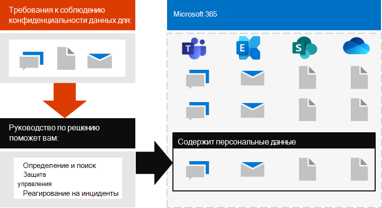

# Развертывание защиты информации для норм конфиденциальности данных с помощью Microsoft 365Deploy information protection for data privacy regulations with Microsoft 365

Ваша организация может подчиняться региональным нормам конфиденциальности, которые требуют защиты, управления и предоставления прав и управления личными данными, хранящимися в ИТ ИТ, включая как в локальной среде, так и в облаке.Your organization may be subject to regional data privacy regulations that require you to protect, manage, and provide rights and control over personal information stored in your IT infrastructure, including both on-premises and in the cloud. Лучший пример соблюдения конфиденциальности данных — общее нормативное положение Европейского союза по защите данных (GDPR).The best example of a data privacy regulation is the European Union's General Data Protection Regulation (GDPR). Несоблюдение нормативных требований по конфиденциальности данных может привести к существенным настройкам.Failure to comply with data privacy regulations can result in substantial fines.

Примеры типов данных в Microsoft 365 включают сеансы чата в Microsoft Teams, сообщения электронной почты в Exchange и файлы в SharePoint и OneDrive.Examples of the types of data in Microsoft 365 include chat sessions in Microsoft Teams, emails in Exchange, and files in SharePoint and OneDrive. В этом решении представлены рекомендации по определению, обнаружению, защите и реагированию на инциденты конфиденциальности данных для персональных данных, хранящихся в службах Microsoft 365, которые подчиняются нормативам конфиденциальности данных.This solution provides guidance on how to identify, locate, protect, govern, and respond to data privacy incidents for personal data stored in Microsoft 365 services that is subject to data privacy regulations.

Кроме того, вы можете получить дополнительные сведения об использовании удостоверений, устройств и средств защиты от угроз Microsoft 365 для обеспечения конфиденциальности данных.Additional information is also provided on the use of Microsoft 365 identity, device, and threat protection controls for your data privacy needs. 

Чтобы обеспечить соблюдение условий для защиты информации с учетом требований к конфиденциальности данных, используйте следующие возможности и функции Microsoft 365.To meet the criteria for protecting information for compliance with data privacy regulations, use these Microsoft 365 capabilities and features.

| Возможность или функцияCapability or feature | ОписаниеDescription | ЛицензированиеLicensing |
|:-------|:-----|:-------|
| Диспетчер соответствия требованиямCompliance Manager | Управление действиями соответствия нормативным требованиям, относящимися к облачным службам Майкрософт, с помощью этого средства оценки рисков на основе рабочих процессов на портале доверия службы Майкрософт.Manage regulatory compliance activities related to Microsoft cloud services with this workflow-based risk assessment tool in the Microsoft Service Trust Portal. | Microsoft 365 E3 и E5Microsoft 365 E3 and E5 |
| Рейтинг соответствия требованиям (предварительная версия)Compliance Score (preview) | Ознакомьтесь с общей оценкой текущей конфигурации соответствия требованиям и рекомендациями по ее улучшению в центре соответствия требованиям Microsoft 365.See an overall score of your current compliance configuration and recommendations for improving it in the Microsoft 365 Compliance Center. | Microsoft 365 E3 и E5Microsoft 365 E3 and E5 |
| Office Advanced Threat protection (ATP)Office Advanced Threat Protection (ATP) | Защитите свои приложения и данные Microsoft 365, такие как сообщения электронной почты, документы Office и средства совместной работы, от атак.Protect your Microsoft 365 apps and data—such as email messages, Office documents, and collaboration tools—from attack. | Microsoft 365 E3 и E5Microsoft 365 E3 and E5 | 
| Метки конфиденциальностиSensitivity labels | Классификация и защита данных Организации без снижения производительности пользователей и их возможности совместной работы путем размещения меток с различными уровнями защиты электронной почты, файлов или сайтов.Classify and protect your organization's data without hindering the productivity of users and their ability to collaborate by placing labels with various levels of protection on email, files, or sites. | Microsoft 365 E3 и E5Microsoft 365 E3 and E5 |
| Защита от потери данных (DLP)Data Loss Protection (DLP) | Определять, предупреждать и блокировать рискованные, нежелательные или нежелательные общие сведения, такие как совместное использование данных, содержащих персональные данные, как внутренних, так и внешних.Detect, warn, and block risky, inadvertent, or inappropriate sharing, such as sharing of data containing personal information, both internally and externally. | Microsoft 365 E3 и E5Microsoft 365 E3 and E5 | 
| Метки и политики хранения данныхData retention labels and policies | Реализуйте элементы управления для управления сведениями, например продолжительность хранения данных и требований к хранению персональных данных на клиентах, чтобы соответствовать политикам организации или нормативам с данными.Implement information governance controls, such as how long to keep data and requirements on the storage of personal data on customers, to comply with your organization's policies or data regulations. | Microsoft 365 E3 и E5Microsoft 365 E3 and E5 |
| Шифрование электронной почтыEmail encryption | Отправка и получение зашифрованных сообщений электронной почты между людьми в Организации и за ее пределами, которые содержат поднадзорные данные, такие как персональные данные клиентов.Send and receive encrypted email messages between people inside and outside your organization that contains regulated data, such as personal data on customers. | Microsoft 365 E3 и E5Microsoft 365 E3 and E5 |
||||

## Организация рекомендаций, приведенных в этом решенииOrganization of the guidance in this solution

Чтобы получить представление о средствах Microsoft 365, доступных для идентификации и управления личными данными, а также для наблюдения за ними, в отношении одного или нескольких нормативных требований, эти рекомендации организованы по разделам.To help you understand the Microsoft 365 tools available to identify, manage, control, and monitor personal data subject to one or more privacy-related regulations, this guidance is organized into sections.
 

Каждый из этих разделов соответствует отдельной статье в этом решении.Each of these sections correspond to a separate article in this solution.

>[!Note]
>Если вы уже знакомы с вашими обязательствами по конфиденциальности данных и их работами с существующим планом, вы можете сосредоточиться на этой статье: предотвращение, защита, сохранение и исследование.If you are already familiar with your data privacy obligations and are executing against an existing plan, you may want to focus on the Prevent, Protect, Retain, and Investigate guidance.

>[!Important]
>Следуя этим рекомендациям, не обязательно забудьте в соответствии с требованиями к конфиденциальности данных, особенно учитывая количество действий, необходимых вне контекста компонентов.Following this guidance will not necessarily make you compliant with any data privacy regulation, especially considering the number of steps required that are outside the context of the features. Вы несете ответственность за обеспечение соответствия требованиям и соблюдение юридических и нормативных групп, а также поиск рекомендаций и советов от сторонних производителей, специализирующихся на соответствие требованиям.You are responsible for ensuring your compliance and to consult your legal and compliance teams or to seek guidance and advice from third parties that specialize in compliance.
>

## Plan: Оценка рисков конфиденциальности данных и определение конфиденциальных элементовPlan: Assess data privacy risks and identify sensitive items 

Оценка требований к конфиденциальности данных и рисков, на которые распространяется ваша организация, является ключевым первым шагом, прежде чем приступить к внедрению усовершенствований, в том числе доступных с помощью конфигурации Microsoft 365.Assessing data privacy regulations and risks that your organization is subject to is a key first step to take before starting to implement improvements, including those achievable through Microsoft 365 configuration. Это может быть полная оценка готовности или идентификация определенных типов конфиденциальной информации, которые подчиняются нормативным требованиям, а также их появлениям в среде Microsoft 365.This may include an overall readiness assessment or identification of particular sensitive information types that are subject to regulatory controls your organization needs to comply with, as well as the occurrence of them in your Microsoft 365 environment.

Дополнительную информацию можно узнать в статье [Оценка рисков конфиденциальности данных и определение конфиденциальных элементов](information-protection-deploy-assess.md).For more information, see [Assess data privacy risks and identify sensitive items](information-protection-deploy-assess.md).

## Отслеживание: использование оценки соответствия требованиям и диспетчера соответствия требованиямTrack: Use Compliance Score and Compliance Manager 

Оценка соответствия требованиям и диспетчер соответствия требованиям предоставляют интегрированный набор средств, доступных в центре администрирования соответствия требованиям Microsoft 365 и доверенном портале.Compliance Score and Compliance Manager provide an integrated set of tools available in the Microsoft 365 Compliance admin center and Services Trust Portal. В совокупности эти средства предоставляют встроенную возможность отслеживания и управления действиями по улучшению в целом, а также в отношении нескольких нормативных требований к данным, к которым вы подчиняются.Together, these tools provide you with a built-in ability to track and manage improvement actions overall as well as those related to multiple data privacy regulations to which you are subjected.

Кроме того, эти средства позволяют использовать встроенные шаблоны оценки, относящиеся к каждому конкретному подстановке, где можно отслеживать элементы действий для каждого выбранного шаблона оценки, а также просматривать определенные нормативные элементы управления и связывать их с определенными действиями.The tools also allow you to leverage built in assessment templates specific to each regulation, where you can track action items for each assessment template selected, as well as view specific regulatory controls, and relate them to specific actions.

Для получения дополнительных сведений см. [использование оценки соответствия и диспетчера соответствия требованиям для управления действиями по улучшению](information-protection-deploy-compliance.md).For more information, see [Use Compliance Score and Compliance Manager to manage improvement actions](information-protection-deploy-compliance.md).

## Запретить: использовать удостоверение, устройство и защиту от угроз для обеспечения конфиденциальности данныхPrevent: Use identity, device, and threat protection for data privacy regulation

Microsoft 365 предоставляет ряд возможностей по обеспечению конфиденциальности данных, устройств и угроз, которые можно использовать для соблюдения соответствия требованиям.Microsoft 365 provides a number of identity, device, and threat protection capabilities that you can use to help comply with data privacy regulatory compliance. 

Дополнительные сведения см в статье [использование удостоверений, устройств и защиты от угроз для обеспечения конфиденциальности данных](information-protection-deploy-identity-device-threat.md).For more information, see [Use identity, device, and threat protection for data privacy regulation](information-protection-deploy-identity-device-threat.md).

В этой статье кратко описана информация о правилах конфиденциальности данных, которые обычно вызываются в этих областях, и приведен список связанных решений Microsoft 365 со ссылками на дополнительные сведения, которые помогут вам решить любые требования к реализации.This article briefly describes what the data privacy regulations generally call for in these areas and provides a listing of related Microsoft 365 solutions, with links to more information to help you address any implementation requirements. 

## Защита данных в соответствии с нормами конфиденциальности данныхProtect information subject to data privacy regulation

Требования к конфиденциальности данных определяют ряд средств защиты персональных данных, которые можно использовать в среде, в том числе более 40 для защиты информации в рамках всего четырех нормативных требований к данным в нашем образце набора GDPR, безопасности клиента в Калифорнии (ККПА), HIPAA-HITECH (ACT о конфиденциальности для США) и ACT защиты данных в Бразилии (ЛГПД).Data privacy regulations dictate a number of personal information protection controls that can be employed in your environment, including more than forty Protect Information controls across just the four data privacy regulations in our sample set of GDPR, California Consumer Protection Act (CCPA), HIPAA-HITECH (United States health care privacy act), and the Brazil Data Protection Act (LGPD).

Дополнительную информацию можно узнать [в статье Защита конфиденциальных данных в соответствии с конфиденциальными сведениями в вашей организации](information-protection-deploy-protect-information.md).For more information, see [Protect information subject to data privacy regulation in your organization](information-protection-deploy-protect-information.md).

В этой статье описываются основные схемы управления, которые можно использовать для адресации требований к защите данных в Организации.This article lays out the main control schemes that can be used for addressing information protection needs for data privacy in your organization.

## Сохранение: Управление сведениями, которые подчиняются нормам конфиденциальности данныхRetain: Govern information subject to data privacy regulation

Требования к конфиденциальности данных для управления персональными сведениями, которые можно использовать в вашей среде, в том числе более двадцати четырех элементов управления в рамках четырех правил конфиденциальности данных в нашем примере набора GDPR, ККПА, HIPAA/HITECH и ЛГПД.Data privacy regulations call for personal information governance controls that can be employed in your environment, including more than twenty-four controls across the four data privacy regulations in our sample set of GDPR, CCPA, HIPAA-HITECH, and LGPD.

Дополнительные сведения см в разделе Управление [сведениями, которые подчиняются конфиденциальности данных в вашей организации](information-protection-deploy-govern.md).For more information, see [Govern information subject to data privacy regulation in your organization](information-protection-deploy-govern.md).

Несмотря на то, что правила конфиденциальности данных могут быть неясными в отношении управления сведениями &mdash; , например хранения пурпосефул, удаления и архивации, &mdash; Эта статья посвящена основным схемам управления, в которых можно использовать информацию по управлению адресами для обеспечения конфиденциальности данных в Организации.While the data privacy regulations can be vague regarding information governance&mdash;such as purposeful retention, deletion and archiving&mdash;this article lays out the primary control schemes that you can use address information governance needs for data privacy in your organization.

## Исследование: отслеживание и реагирование на соблюдение конфиденциальности данныхInvestigate: Monitor and respond subject to data privacy regulation

Существуют функции Microsoft 365, которые помогают отслеживать, изучать и отвечать на инциденты конфиденциальности данных в вашей организации, как вы оператионализее связанные возможности.There are Microsoft 365 features available to help you monitor, investigate, and respond to data privacy incidents in your organization as you operationalize related capabilities. 

Процесс, процедуры и другая документация для каждого из них могут быть важны для демонстрации соответствия нормативным требованиям.Having processes, procedures, and other documentation for each of these can be important to demonstrate compliance to regulatory bodies.

Дополнительную информацию можно узнать [в статье мониторинг и реагирование на инциденты конфиденциальности данных в Организации](information-protection-deploy-monitor-respond.md).For more information, see [Monitor and respond to data privacy incidents in your organization](information-protection-deploy-monitor-respond.md).
