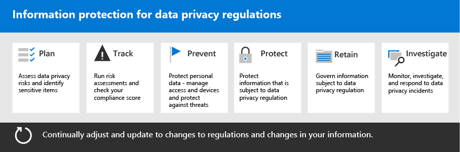

# Развертывание защиты информации для правил конфиденциальности данных с помощью Microsoft 365Deploy information protection for data privacy regulations with Microsoft 365

В организации могут оказаться региональные правила конфиденциальности данных, которые требуют от вас защиты, управления и предоставления прав и контроля за личной информацией, хранимой в ИТ-инфраструктуре, включая локальное и облачное пространство.Your organization may be subject to regional data privacy regulations that require you to protect, manage, and provide rights and control over personal information stored in your IT infrastructure, including both on-premises and in the cloud. Лучшим примером регулирования конфиденциальности данных является Общее регулирование защиты данных в Европейском союзе (GDPR).The best example of a data privacy regulation is the European Union's General Data Protection Regulation (GDPR). Несоблюдение правил конфиденциальности данных может привести к значительным штрафам.Failure to comply with data privacy regulations can result in substantial fines.

Примеры типов данных в Microsoft 365 включают сеансы чата в Microsoft Teams, сообщения электронной почты в Exchange и файлы в SharePoint и OneDrive.Examples of the types of data in Microsoft 365 include chat sessions in Microsoft Teams, emails in Exchange, and files in SharePoint and OneDrive. Это решение содержит рекомендации по оценке рисков и соответствующим действиям по защите персональных данных в Microsoft 365.This solution provides guidance on how to assess risks and take appropriate action to protect personal data in Microsoft 365. Это включает определение персональных данных, чтобы вы могли защищать, управлять и реагировать на инциденты конфиденциальности данных.This includes identifying  personal information so you can protect, govern, and respond to data privacy incidents.

Дополнительные сведения также предоставляются об использовании элементов управления Microsoft 365, устройств и защиты от угроз для ваших потребностей в конфиденциальности данных.Additional information is also provided on the use of Microsoft 365 identity, device, and threat protection controls for your data privacy needs. 

Эти Microsoft 365 и функции помогают вам соответствовать критериям защиты информации.These Microsoft 365 capabilities and features help you meet the criteria for protecting information.

| Возможность или функцияCapability or feature | ОписаниеDescription | ЛицензированиеLicensing |
|:-------|:-----|:-------|
| Диспетчер соответствия требованиямCompliance Manager | Управление действиями по соблюдению нормативных требований, получить общую оценку текущей конфигурации соответствия требованиям и найти рекомендации по улучшению.Manage regulatory compliance activities, get an overall score of your current compliance configuration, and find recommendations for improvement. Это средство оценки рисков на основе рабочего процесса в центре Microsoft 365 соответствия требованиям.This is a workflow-based risk assessment tool in the Microsoft 365 compliance center. | Microsoft 365 E3 и E5Microsoft 365 E3 and E5 |
| Microsoft Defender для Office 365Microsoft Defender for Office 365 | Защитите от атак свои приложения и данные в Microsoft 365, такие как сообщения электронной почты, документы Office и средства совместной работы.Protect your Microsoft 365 apps and data—such as email messages, Office documents, and collaboration tools—from attack. | Microsoft 365 E3 и E5Microsoft 365 E3 and E5 | 
| Метки конфиденциальностиSensitivity labels | Классификация и защита данных организации, не препятствуя производительности пользователей и их возможности совместной работы.Classify and protect your organization's data without hindering the productivity of users and their ability to collaborate. Развешить метки с различными уровнями защиты на электронной почте, файлах или сайтах.Place labels with various levels of protection on email, files, or sites. | Microsoft 365 E3 и E5Microsoft 365 E3 and E5 |
| Защита от потери данных (DLP)Data Loss Protection (DLP) | Обнаружение, предупреждение и блокировка рискованного, непреднамеренного или ненадлежащего обмена данными, содержащими персональные данные, как внутренними, так и внешними.Detect, warn, and block risky, inadvertent, or inappropriate sharing of data containing personal information, both internally and externally. | Microsoft 365 E3 и E5Microsoft 365 E3 and E5 | 
| Метки и политики хранения данныхData retention labels and policies | Реализация элементов управления информацией.Implement information governance controls. Они могут включать определение времени хранения данных (например, персональных данных, связанных с клиентами) в соответствии с политиками или правилами организации.These can include determining how long to keep data (such as personal data related to customers) to comply with your organization's policies or data regulations. | Microsoft 365 E3 и E5Microsoft 365 E3 and E5 |
| Шифрование электронной почтыEmail encryption | Защита персональных данных путем отправки и получения зашифрованных сообщений электронной почты между людьми внутри организации и за ее пределами.Protect personal data by sending and receiving encrypted email messages between people inside and outside your organization. | Microsoft 365 E3 и E5Microsoft 365 E3 and E5 |
||||

## Организация руководства в этом решенииOrganization of the guidance in this solution

Чтобы помочь вам понять Microsoft 365, которые помогут вам выполнить один или несколько правил, связанных с конфиденциальностью, это руководство организовано в разделах.To help you understand the Microsoft 365 tools available to help you meet one or more privacy-related regulations, this guidance is organized into sections.
 

Каждый из этих разделов соответствует отдельной статье в этом решении.Each of these sections corresponds to a separate article in this solution.

>[!Note]
>Если вы уже знакомы с обязательствами по конфиденциальности данных и выполняете их по существующему плану, вам может потребоваться сосредоточиться на руководстве По предотвращению, защите, удержанию и расследованию.If you are already familiar with your data privacy obligations and are executing against an existing plan, you may want to focus on the Prevent, Protect, Retain, and Investigate guidance.

>[!Important]
>Следуя этому указанию, вы не обязательно будете соблюдать любое регулирование конфиденциальности данных, особенно с учетом количества необходимых действий, которые находятся за пределами контекста функций.Following this guidance will not necessarily make you compliant with any data privacy regulation, especially considering the number of steps required that are outside the context of the features. Вы несете ответственность за обеспечение соответствия требованиям, а также за консультации с юридическими и юридическими группами, а также за консультации с третьими сторонами, специализирующимися на соблюдении требований.You are responsible for ensuring your compliance and to consult your legal and compliance teams or to seek guidance and advice from third parties that specialize in compliance.
>

## План: Оценка рисков конфиденциальности данных и определение конфиденциальных элементовPlan: Assess data privacy risks and identify sensitive items

Оценка правил конфиденциальности данных и рисков, которые могут быть подвергнуты вашей организации, является ключевым первым шагом перед началом реализации улучшений, включая настройку возможностей в Microsoft 365.Assessing data privacy regulations and risks that your organization is subject to is a key first step to take before starting to implement improvements, including configuring capabilities in Microsoft 365. Эта работа может включать общую оценку готовности или идентификацию определенных типов конфиденциальной информации, которые должны соответствовать требованиям нормативных органов организации.This work can include an overall readiness assessment or identification of particular sensitive information types that are subject to regulatory controls your organization needs to comply with.

Дополнительные сведения см. в статьи Оценка рисков конфиденциальности данных [и определение конфиденциальных элементов.](information-protection-deploy-assess.md)For more information, see [Assess data privacy risks and identify sensitive items](information-protection-deploy-assess.md).

## Track. Запустите оценки рисков и проверьте свою оценку соответствия требованиямTrack: Run risk assessments and check your compliance score

Диспетчер соответствия требованиям, доступный в центре Microsoft 365 соответствия требованиям, предоставляет вам встроенную возможность отслеживать и управлять действиями по улучшению в целом, а также с действиями, связанными с несколькими правилами конфиденциальности данных, которые применяются к вам.Compliance Manager, available in the Microsoft 365 compliance center, provides you with a built-in ability to track and manage improvement actions overall as well as those related to multiple data privacy regulations that apply to you.

Можно использовать встроенные шаблоны оценки, определенные каждому правилу, где можно отслеживать элементы действий для каждого выбранного шаблона оценки, а также просматривать определенные элементы регулирования и соотносят их с определенными действиями.You can use built in assessment templates specific to each regulation, where you can track action items for each assessment template selected, as well as view specific regulatory controls, and relate them to specific actions.

Дополнительные сведения см. в [дополнительных сведениях в use Compliance Manager для управления действиями по улучшению.](information-protection-deploy-compliance.md)For more information, see [Use Compliance Manager to manage improvement actions](information-protection-deploy-compliance.md).

## Предотвращение: защита персональных данныхPrevent: Protect personal data

Microsoft 365 предоставляет возможности удостоверений, устройств и защиты от угроз, которые можно использовать для соответствия требованиям законодательства о конфиденциальности данных.Microsoft 365 provides identity, device, and threat protection capabilities that you can use to help comply with data privacy regulatory compliance. 

Дополнительные сведения см. в дополнительных [сведениях: Использование удостоверений, устройств и](information-protection-deploy-identity-device-threat.md)защиты от угроз для регулирования конфиденциальности данных.For more information, see [Use identity, device, and threat protection for data privacy regulation](information-protection-deploy-identity-device-threat.md).

В этой статье кратко описывается, к чему обычно призывают правила конфиденциальности данных в этих областях, и содержится список связанных Microsoft 365 решений, а также ссылки на дополнительные сведения, которые помогут вам решить любые требования к реализации.This article briefly describes what the data privacy regulations generally call for in these areas and provides a listing of related Microsoft 365 solutions, with links to more information to help you address any implementation requirements. 

## Защита информации с учетом правил конфиденциальности данныхProtect information subject to data privacy regulation

Правила конфиденциальности данных диктуют ряд элементов управления защитой персональных данных, которые могут быть использованы в вашей среде, в том числе более 40 элементов управления для защиты информации только по четырем правилам конфиденциальности данных в нашем примере набора GDPR, Закона о защите прав потребителей в Калифорнии (CCPA), HIPAA-HITECH (Закон о конфиденциальности здравоохранения США) и Бразильского закона о защите данных (LGPD).Data privacy regulations dictate a number of personal information protection controls that can be employed in your environment, including more than 40 controls for protecting information across just the four data privacy regulations in our sample set of GDPR, California Consumer Protection Act (CCPA), HIPAA-HITECH (United States health care privacy act), and the Brazil Data Protection Act (LGPD).

Дополнительные сведения см. в инструкции [Protect information subject to data privacy regulation in your organization.](information-protection-deploy-protect-information.md)For more information, see [Protect information subject to data privacy regulation in your organization](information-protection-deploy-protect-information.md).

В этой статье изложатся основные схемы управления, которые можно использовать для решения потребностей в защите информации для конфиденциальности данных в организации.This article lays out the main control schemes that can be used for addressing information protection needs for data privacy in your organization.

## Сохранение: управление сведениями, которые регулируются правилами конфиденциальности данныхRetain: Govern information subject to data privacy regulation

В правилах конфиденциальности данных используются элементы управления персональными данными, которые могут быть использованы в вашей среде, включая более 24 элементов управления по четырем правилам конфиденциальности данных в нашем примере набора GDPR, CCPA, HIPAA-HITECH и LGPD.Data privacy regulations call for personal information governance controls that can be employed in your environment, including more than 24 controls across the four data privacy regulations in our sample set of GDPR, CCPA, HIPAA-HITECH, and LGPD.

Дополнительные сведения см. в инструкции [По регулированию конфиденциальности](information-protection-deploy-govern.md)данных в организации.For more information, see [Govern information subject to data privacy regulation in your organization](information-protection-deploy-govern.md).

Хотя правила конфиденциальности данных могут быть расплывчатыми в отношении управления информацией, таких как целенаправленное хранение, удаление и архивация этой статьи, изложить основные схемы управления, которые можно использовать для обеспечения конфиденциальности данных в &mdash; &mdash; организации.While the data privacy regulations can be vague regarding information governance&mdash;such as purposeful retention, deletion and archiving&mdash;this article lays out the primary control schemes that you can use address information governance needs for data privacy in your organization.

## Исследование: мониторинг, расследование и реагирование на инциденты конфиденциальности данныхInvestigate: Monitor, investigate, and respond to data privacy incidents

Существуют Microsoft 365, которые помогут отслеживать, исследовать и реагировать на инциденты конфиденциальности данных в организации при работе с связанными возможностями.There are Microsoft 365 features available to help you monitor, investigate, and respond to data privacy incidents in your organization as you operationalize related capabilities. 

Наличие процессов, процедур и других документов для использования этих функций может иметь важное значение для демонстрации соответствия нормативным органам.Having processes, procedures, and other documentation for using these features can be important to demonstrate compliance to regulatory bodies.

Дополнительные сведения см. в [см. в интернете Monitor и реагирование на](information-protection-deploy-monitor-respond.md)инциденты конфиденциальности данных в организации.For more information, see [Monitor and respond to data privacy incidents in your organization](information-protection-deploy-monitor-respond.md).
