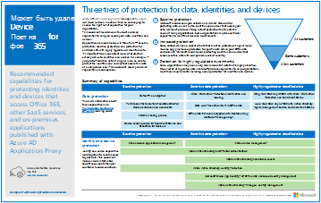

# Иллюстрации повышения производительности в Microsoft 365

В серии "Корпоративные решения для Microsoft 365" представлены инструкции по реализации возможностей Microsoft 365, особенно при их пересечении с технологиями.

### Microsoft Teams и связанные службы повышения производительности в Microsoft 365 для ИТ-архитекторов
Логическая архитектура служб повышения производительности в Microsoft 365, начиная с Microsoft Teams.

|**Ресурс**|**Описание**|
|:-----|:-----|
|   [PDF](https://github.com/MicrosoftDocs/microsoft-365-docs/raw/public/microsoft-365/downloads/msft-m365-teams-logical-architecture.pdf) \| [Visio](https://github.com/MicrosoftDocs/OfficeDocs-Enterprise/raw/live/Enterprise/downloads/msft-m365-teams-logical-architecture.vsdx)   Обновление: апрель 2019 г.   |Корпорация Майкрософт предоставляет набор служб повышения производительности, которые взаимодействуют между собой, обеспечивая возможности совместной работы для управления данными, безопасности и соответствия требованиям.    Этот набор иллюстраций демонстрирует логическую архитектуру служб повышения производительности для корпоративных архитекторов, начиная с Microsoft Teams.|

### Группы в Microsoft 365 для ИТ-архитекторов
Что следует знать ИТ-архитекторам о группах в Microsoft 365

|**Ресурс**|**Описание**|
|:-----|:-----|
|   [PDF](https://github.com/MicrosoftDocs/microsoft-365-docs/raw/public/microsoft-365/downloads/msft-m365-groups.pdf) \| [Visio](https://github.com/MicrosoftDocs/OfficeDocs-Enterprise/raw/live/Enterprise/downloads/msft-m365-groups.vsdx)   Обновлено 2020 мая|На этих иллюстрациях подробно показаны разные типы групп, как они создаются и управляются, а также приводится несколько рекомендаций по управлению.|

### Безопасность и защита информации для межрегиональных организаций
Безопасность и защита информации для межрегиональных организаций с единым клиентом Microsoft 365

|**Ресурс**|**Описание**|
|:-----|:-----|
|   [PDF](https://github.com/MicrosoftDocs/microsoft-365-docs/raw/public/microsoft-365/downloads/msft-security-info-protect-multi-region.pdf) \| [Visio](https://github.com/MicrosoftDocs/microsoft-365-docs/raw/public/microsoft-365/downloads/msft-security-info-protect-multi-region.vsdx) Обновление: март 2020 г. |Использование единого клиента Microsoft 365 для глобальной организации является оптимальным вариантом, обеспечивающим максимально комфортную работу, по многим причинам. Тем не менее, многие архитекторы ломают голову над тем, как соответствовать требованиям безопасности и защиты информации в разных регионах. В этой подборке разделов содержатся рекомендации. |

### Стратегия развертывания ATP в Microsoft Defender

В зависимости от среды некоторые средства лучше подходят для определенных архитектур.

|**Элемент**|**Описание**|
|:-----|:-----|
|  [PDF](https://github.com/MicrosoftDocs/windows-itpro-docs/raw/public/windows/security/threat-protection/microsoft-defender-atp/downloads/mdatp-deployment-strategy.pdf)  \| [Visio](https://github.com/MicrosoftDocs/windows-itpro-docs/raw/public/windows/security/threat-protection/microsoft-defender-atp/downloads/mdatp-deployment-strategy.vsdx)  Обновление: февраль 2020 г.| Материалы по архитектуре помогут вам спланировать развертывание для следующих архитектур: <ul><li> Облачное развертывание </li><li> Совместное управление </li><li> Локальное развертывание</li><li>Оценка и локальное внедрение</li>

### Базовая инфраструктура Microsoft 365 корпоративный

Быстро ознакомьтесь с [базовой инфраструктурой](https://docs.microsoft.com/microsoft-365/enterprise/deploy-foundation-infrastructure) для Microsoft 365 корпоративный, чтобы приступить к развертыванию.
  
|**Ресурс**|**Описание**|
|:-----|:-----|
|   [Смотреть в Интернете](https://aka.ms/m365efoundinfraposter) \| [PDF-ФАЙЛ](https://github.com/MicrosoftDocs/microsoft-365-docs/raw/public/microsoft-365/downloads/Microsoft365EnterpriseFoundInfra.pdf)   Обновление: декабрь 2019 г.| На этом плакате представлена сводка каждого этапа базовой инфраструктуры с точки зрения целей, функций и инструментов, решений разработки, результатов конфигурации, адаптации, а также текущего мониторинга и обновлений.  | 

   

### Защита идентификации и устройств для Office 365

Рекомендуемые возможности для защиты удостоверений и устройств, имеющих доступ к Office 365 и отличных от SaaS-служб и локальных приложений, которые опубликованы с помощью прокси приложения Azure AD.

|**Ресурс**|**Описание**|
|:-----|:-----|
|[          ](https://www.microsoft.com/download/details.aspx?id=55032)   [PDF](https://go.microsoft.com/fwlink/p/?linkid=841656)  \| [Visio](https://go.microsoft.com/fwlink/p/?linkid=841657)  \| [Другие языки](https://www.microsoft.com/download/details.aspx?id=55032)   Обновление: ноябрь 2018 г.|Важно, чтобы уровни защиты данных, удостоверений и устройств согласовывались между собой. В этом документе приводится сравнительная характеристика различных возможностей, а также предоставляются дополнительные сведения о возможностях защиты удостоверений и устройств.    |
   
<!--

### File protection solutions in Office 365

Recommended capabilities for protecting files in Office 365 based on three different sensitivity levels.
  
|**Item**|**Description**|
|:-----|:-----|
|[          ](https://www.microsoft.com/download/details.aspx?id=55523)   [PDF](https://go.microsoft.com/fwlink/?linkid=2004320)  \| [Visio](https://download.microsoft.com/download/7/8/9/789645A5-BD10-4541-BC33-F8D1EFF5E911/MSFT_cloud_architecture_O365%20file%20protection.vsdx)   |It's important to use consistent levels of protection across your data, identities, and devices. This document shows you which capabilities are comparable with more information on capabilities to protect files in Office 365.    |
   

### Office 365 Information Protection for GDPR

Prescriptive recommendations for discovering, classifying, protecting, and monitoring personal data. This solution uses General Data Protection Regulation (GDPR) as an example, but you can apply the same process to achieve compliance with many other regulations.

|**Item**|**Description**|
|:-----|:-----|
|    [PDF](https://download.microsoft.com/download/E/C/D/ECD5A339-EF10-4420-B3A9-99098884D716/MSFT_Cloud_architecture_information%20protection%20for%20GDPR.pdf) \| [Visio](https://download.microsoft.com/download/E/C/D/ECD5A339-EF10-4420-B3A9-99098884D716/MSFT_Cloud_architecture_information%20protection%20for%20GDPR.vsdx)    |To see this content in article format, see [Office 365 Information Protection for GDPR](https://docs.microsoft.com/Office365/SecurityCompliance/office-365-information-protection-for-gdpr).      |

### Microsoft Security Guidance for Political Campaigns, Nonprofits, and Other Agile Organizations 

This guidance describes how to implement a secure cloud environment. The solution guidance can be used by any organization. It includes extra help for agile organizations with BYOD access and guest accounts. You can use this guidance as a starting-point for designing your own environment.

|**Item**|**Description**|
|:-----|:-----|
|**Microsoft Security Guidance for Political Campaigns**   [          ](https://download.microsoft.com/download/B/4/D/B4D520C3-4D0C-4B4D-BFB9-09F0651C2775/MSFT_Cloud_architecture_security%20for%20political%20campaigns.pdf)   [PDF](https://download.microsoft.com/download/B/4/D/B4D520C3-4D0C-4B4D-BFB9-09F0651C2775/MSFT_Cloud_architecture_security%20for%20political%20campaigns.pdf)  \| [Visio](https://download.microsoft.com/download/B/4/D/B4D520C3-4D0C-4B4D-BFB9-09F0651C2775/MSFT_Cloud_architecture_security%20for%20political%20campaigns.vsdx)   |This guidance uses a political campaign organization as an example. Use this guidance as a starting point for any environment.    |
|**Microsoft Security Guidance for Nonprofits**   [          ](https://download.microsoft.com/download/9/4/3/94389612-C679-4061-8DF2-D9A15D72B65F/Microsoft_Cloud%20Architecture_Security%20for%20Nonprofits.pdf)   [PDF](https://download.microsoft.com/download/9/4/3/94389612-C679-4061-8DF2-D9A15D72B65F/Microsoft_Cloud%20Architecture_Security%20for%20Nonprofits.pdf)  \| [Visio](https://download.microsoft.com/download/9/4/3/94389612-C679-4061-8DF2-D9A15D72B65F/Microsoft_Cloud%20Architecture_Security%20for%20Nonprofits.vsdx)   |This guide is slightly revised for nonprofit organizations. For example, it references Office 365 Nonprofit plans. The technical guidance is the same as the political campaign solution guide.    |

This guidance includes Test Lab Guides. For more information, see [Microsoft Security Guidance for Political Campaigns, Nonprofits, and Other Agile Organizations](https://docs.microsoft.com/Office365/SecurityCompliance/microsoft-security-guidance-for-political-campaigns-nonprofits-and-other-agile-o).

-->

### Решения Майкрософт для телефонии

Корпорация Майкрософт поддерживает несколько вариантов начала работы с Teams в облаке Майкрософт. Этот плакат поможет вам определить, какие решения Майкрософт для телефонии (телефонная система в облаке или локальная корпоративная голосовая связь) оптимальны для пользователей в вашей организации, а также как организация может подключаться к телефонной сети общего пользования (ТСОП).

  
[PDF](https://github.com/MicrosoftDocs/OfficeDocs-SkypeForBusiness/raw/live/Teams/downloads/telephony-solutions/microsoft-telephony-solutions-12-19.pdf) | [Visio](https://github.com/MicrosoftDocs/OfficeDocs-SkypeForBusiness/raw/live/Teams/downloads/telephony-solutions/microsoft-telephony-solutions-12-18.vsdx)  
Обновление: январь 2019 г.

Дополнительные сведения см. в статье [Решения Майкрософт для телефонии](https://docs.microsoft.com/SkypeForBusiness/hybrid/msft-telephony-solutions).
  
  
## См. также

[Архитектурные модели для SharePoint, Exchange, Skype для бизнеса и Lync](https://docs.microsoft.com/office365/enterprise/architectural-models-for-sharepoint-exchange-skype-for-business-and-lync)
  
[Руководства по лаборатории тестирования для облачных решений](https://docs.microsoft.com/office365/enterprise/cloud-adoption-test-lab-guides-tlgs)
