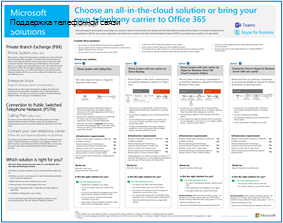

# Иллюстрации повышения производительности в Microsoft 365

Серия Microsoft 365 корпоративных решений содержит рекомендации по реализации Microsoft 365 возможностей, особенно в тех случаях, когда возможности пересекаются с технологиями, в том числе Teams схемами архитектуры.

## Microsoft Teams и связанные службы повышения производительности в Microsoft 365 для ИТ-архитекторов
Логическая архитектура служб повышения производительности в Microsoft 365, начиная с Microsoft Teams.

| Item | Описание |
|:-----|:-----|
|   [PDF](https://github.com/MicrosoftDocs/microsoft-365-docs/raw/public/microsoft-365/downloads/msft-m365-teams-logical-architecture.pdf) \| [Visio](https://github.com/MicrosoftDocs/microsoft-365-docs/raw/public/microsoft-365/downloads/msft-m365-teams-logical-architecture.vsdx)   Обновлено в январе 2021 г.   |Корпорация Майкрософт предоставляет набор служб повышения производительности, которые взаимодействуют между собой, обеспечивая возможности совместной работы для управления данными, безопасности и соответствия требованиям.    Этот набор иллюстраций демонстрирует логическую архитектуру служб повышения производительности для корпоративных архитекторов, начиная с Microsoft Teams.|

## Группы в Microsoft 365 для ИТ-архитекторов
На этой иллюстрации содержатся сведения для ИТ-архитекторов о Microsoft 365 Groups. Чтобы узнать о настройке и администрировании Microsoft 365 групп и групп  для совместной работы в организации, см. в этой ссылке Настройка безопасного взаимодействия с Microsoft 365 и что такое управление [совместной деятельностью?.](/microsoft-365/solutions/collaboration-governance-overview)

| Item | Описание |
|:-----|:-----|
|   [PDF](https://github.com/MicrosoftDocs/microsoft-365-docs/raw/public/microsoft-365/downloads/msft-m365-groups.pdf) \| [Visio](https://github.com/MicrosoftDocs/OfficeDocs-Enterprise/raw/live/Enterprise/downloads/msft-m365-groups.vsdx)   Обновлено в мае 2020 г.|На этих иллюстрациях подробно показаны разные типы групп, как они создаются и управляются, а также приводится несколько рекомендаций по управлению.|

## Миграция в Microsoft 365

Корпорация Майкрософт предоставляет средства для переноса локального сетевого файла и сайтов SharePoint Server для Microsoft 365 с акцентом на защиту и обеспечение безопасности контента во время миграции. В этом наборе иллюстраций показано, какие методы доступны для перемещения контента в SharePoint, Teams и OneDrive, а также способы перемещения данных в процессе. 

| Item | Описание |
|:-----|:-----|
|  [PDF](https://download.microsoft.com/download/0/5/b/05b7fb7c-1557-4ebb-9036-c5fc3a4cd94c/m365-migration-posters-mm-spmt.pdf)\|[Visio](https://download.microsoft.com/download/0/5/b/05b7fb7c-1557-4ebb-9036-c5fc3a4cd94c/m-365-migration-posters-mm-spmt.vsdx)   Обновлено в марте 2021 г. |Содержимое: <ul><li>  Перенос файловых ресурсов</li><li>Миграция SharePoint Server </li> </ul>  Дополнительные сведения см. в [материалах Migrate your content to Microsoft 365.](/sharepointmigration/migrate-to-sharepoint-online)|

## Microsoft 365 и возможности обеспечения соответствия требованиям

Microsoft 365 включает широкий набор возможностей защиты и соответствия требованиям. Вместе с средствами обеспечения производительности Майкрософт эти возможности предназначены для того, чтобы помочь организациям сотрудничать в режиме реального времени, придерживаясь строгих нормативных рамок соответствия требованиям. 

В этом наборе иллюстраций используется одна из наиболее регулируемых отраслей , финансовые службы, чтобы продемонстрировать, как эти возможности могут применяться для решения общих нормативных требований. Вы можете адаптировать эти изображения для собственного применения. 

| Элемент | Описание |
|:-----|:-----|
|   Английский язык: [Скачать в виде PDF-файла](https://download.microsoft.com/download/3/a/6/3a6ab1a3-feb0-4ee2-8e77-62415a772e53/m365-compliance-illustrations.pdf)  \| [Скачать в виде файла Visio](https://download.microsoft.com/download/3/a/6/3a6ab1a3-feb0-4ee2-8e77-62415a772e53/m365-compliance-illustrations.vsdx)   Японский язык: [Скачать в виде PDF-файла](https://download.microsoft.com/download/6/f/1/6f1a7d0e-dd8e-442e-b073-8e94327ae4f8/m365-compliance-illustrations.pdf)  \| [Скачать в виде файла Visio](https://download.microsoft.com/download/6/f/1/6f1a7d0e-dd8e-442e-b073-8e94327ae4f8/m365-compliance-illustrations.vsdx)   Обновление: ноябрь 2020 г.|Содержимое: <ul><li>  Защита информации (Майкрософт) и защита от потери данных</li><li>Политики и метки хранения </li><li>Информационные барьеры</li><li>Соответствие требованиям к обмену данными</li><li>Внутренний риск</li><li>Внедрение сторонних данных</li>|

## Безопасность и защита информации для межрегиональных организаций
Безопасность и защита информации для организаций с несколькими регионами с одним Microsoft 365 клиентом

| Item | Описание |
|:-----|:-----|
|   [PDF](https://github.com/MicrosoftDocs/microsoft-365-docs/raw/public/microsoft-365/downloads/msft-security-info-protect-multi-region.pdf) \| [Visio](https://github.com/MicrosoftDocs/microsoft-365-docs/raw/public/microsoft-365/downloads/msft-security-info-protect-multi-region.vsdx) Обновление: март 2020 г. |Использование единого клиента Microsoft 365 для глобальной организации является оптимальным вариантом, обеспечивающим максимально комфортную работу, по многим причинам. Тем не менее, многие архитекторы ломают голову над тем, как соответствовать требованиям безопасности и защиты информации в разных регионах. В этой подборке разделов содержатся рекомендации. |

## Стратегия развертывания Microsoft Defender для конечной точки

В зависимости от среды некоторые средства лучше подходят для определенных архитектур.

| Item | Описание |
|:-----|:-----|
|  [PDF](https://github.com/MicrosoftDocs/microsoft-365-docs/raw/public/microsoft-365/security/defender-endpoint/downloads/mdatp-deployment-strategy.pdf)  \| [Visio](https://github.com/MicrosoftDocs/microsoft-365-docs/raw/public/microsoft-365/security/defender-endpoint/downloads/mdatp-deployment-strategy.vsdx)  Обновление: февраль 2020 г.| Материалы по архитектуре помогут вам спланировать развертывание для следующих архитектур: <ul><li> Облачное развертывание </li><li> Совместное управление </li><li> Локальное развертывание</li><li>Оценка и локальное внедрение</li>

## Защита удостоверений и устройств для Microsoft 365

Рекомендуемые возможности для защиты удостоверений и устройств с доступом к Microsoft 365, другим службам SaaS и локальному приложению, опубликованным с помощью Прокси-сервера приложения Azure AD.

| Item | Описание |
|:-----|:-----|
|    [Просмотр в формате PDF](../downloads/MSFT_cloud_architecture_identity&device_protection.pdf) \| [Скачивание в формате PDF](https://github.com/MicrosoftDocs/microsoft-365-docs/raw/public/microsoft-365/downloads/MSFT_cloud_architecture_identity&device_protection.pdf) \| [Скачайте как Visio](https://github.com/MicrosoftDocs/microsoft-365-docs/raw/public/microsoft-365/downloads/MSFT_cloud_architecture_identity&device_protection.vsdx)     Обновлено в сентябре 2020 г.|Важно, чтобы уровни защиты данных, удостоверений и устройств согласовывались между собой. В этой модели показано, какие возможности сопоставимы с дополнительными сведениями о возможностях защиты удостоверений и устройств.    |
 

## Advanced eDiscovery архитектуры в Microsoft 365

Advanced eDiscovery рабочий процесс и поток данных, в том числе в Microsoft 365-geo средах. 

| Item | Описание |
|:-----|:-----|
|   [Представление как изображение](../media/solutions-architecture-center/m365-advanced-ediscovery-architecture.png) \| [Скачивание в формате PDF](https://download.microsoft.com/download/d/1/c/d1ce536d-9bcf-4d31-b75b-fcf0dc560665/m365-advanced-ediscovery-architecture.pdf) \| [Скачайте как Visio](https://download.microsoft.com/download/d/1/c/d1ce536d-9bcf-4d31-b75b-fcf0dc560665/m365-advanced-ediscovery-architecture.vsdx)     Обновлено в октябре 2020 г.|Содержимое: <ul><li>  Конечный рабочий процесс в одной среде</li><li>Конечный рабочий процесс в среде Microsoft 365 Multi-Geo </li><li>Конечный поток данных, поддерживающих рабочий процесс EDRM</li> |
  

## Решения Майкрософт для телефонии

Корпорация Майкрософт поддерживает несколько вариантов начала работы с Teams в облаке Майкрософт. Этот плакат поможет вам определить, какие решения Майкрософт для телефонии (телефонная система в облаке или локальная корпоративная голосовая связь) оптимальны для пользователей в вашей организации, а также как организация может подключаться к телефонной сети общего пользования (ТСОП).

| Item | Описание |
|:-----|:-----|
|   [PDF](https://download.microsoft.com/download/4/3/5/435cd4e9-ca56-4fd1-acb6-d1fda7952320/microsoft-voice-solutions.pdf) \| [Visio](https://download.microsoft.com/download/7/5/c/75c13012-e20c-48bd-a6dd-ea49d1a3420d/microsoft-voice-solutions.vsdx)  Обновлено в марте 2021 г. | Дополнительные сведения см. в [Teams голосового решения.](/microsoftteams/cloud-voice-landing-page)|

## Настройка инфраструктуры для гибридной работы

С Microsoft 365 и другими облачными технологиями Майкрософт вы можете предоставить своим сотрудникам безопасный доступ к локальной и облачной информации, средствам и ресурсам организации из своих домов. 

  
[PDF](https://download.microsoft.com/download/9/b/b/9bb5fa79-74e9-497b-87c5-4021e53d9fc2/hybrid-worker-infrastructure.pdf)  |  [PowerPoint](https://download.microsoft.com/download/9/b/b/9bb5fa79-74e9-497b-87c5-4021e53d9fc2/hybrid-worker-infrastructure.pptx)  
Обновлено июнь 2021 г.

Дополнительные сведения см. в статье для этого плаката: Настройка инфраструктуры для гибридной работы с [Microsoft 365](empower-people-to-work-remotely.md).

## Microsoft Teams с изоляцией безопасности

С Microsoft 365 вы можете настроить частную команду в Microsoft Teams и использовать SharePoint параметры безопасности сайта и уникальную метку конфиденциальности для шифрования файлов, чтобы только члены группы могли расшифровать их.

  
[PDF](https://github.com/MicrosoftDocs/microsoft-365-docs/raw/public/microsoft-365/downloads/team-security-isolation-poster.pdf)  |  [PowerPoint](https://download.microsoft.com/download/8/0/5/8057fc16-c044-40b6-a652-7ed555ba2895/team-security-isolation-poster.pptx)   Обновлено в августе 2020 г.

Дополнительные сведения см. в статье для этого плаката: Настройка группы [с изоляцией безопасности.](secure-teams-security-isolation.md)

  
## См. также

[Архитектурные модели для SharePoint, Exchange, Skype для бизнеса и Lync](../enterprise/architectural-models-for-sharepoint-exchange-skype-for-business-and-lync.md)
  
[Руководства по лаборатории тестирования для облачных решений](../enterprise/cloud-adoption-test-lab-guides-tlgs.md)
