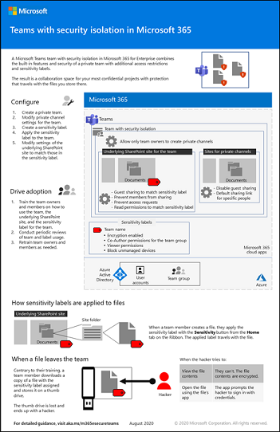

# Настройка команды с изоляцией для обеспечения безопасности

Эта статья содержит рекомендации и инструкции по настройке закрытой команды в Microsoft Teams и использованию уникальной метки конфиденциальности для шифрования файлов, чтобы их могли расшифровать только участники команды.

Помимо закрытого доступа в этой статье описывается способ настройки соответствующего сайта SharePoint, доступного из раздела **Файлы** канала команды. Это обеспечивает дополнительную защиту, требующуюся для хранения строго регулируемых данных.

Элементы настройки команды для работы со строго регулируемыми данными:

- Закрытая команда
- Дополнительная защита соответствующего сайта SharePoint для команды, которая:
  - запрещает участникам сайта предоставлять общий доступ к сайту третьим лицам;
  - блокирует запросы на доступ к сайту от лиц, которые не являются участниками сайта.
- Специальная метка конфиденциальности для команды, которая:
    - блокирует доступ к содержимому SharePoint с неуправляемых устройств;
    - разрешает или запрещает гостевой доступ к команде в зависимости от ваших требований;
    - шифрует документы, к которым применяется метка.

> [!IMPORTANT]
> Включите [метки конфиденциальности для защиты содержимого в Microsoft Teams, группах Office 365 и сайтах SharePoint](https://docs.microsoft.com/microsoft-365/compliance/sensitivity-labels-teams-groups-sites), прежде чем продолжить выполнение инструкций из этой статьи.

 2-страничное краткое описание этого сценария приведено на [плакате "Microsoft Team с изоляцией для обеспечения безопасности"](../downloads/team-security-isolation-poster.pdf).

Вы также можете скачать этот плакат в формате [PDF](https://github.com/MicrosoftDocs/microsoft-365-docs/raw/public/microsoft-365/downloads/team-security-isolation-poster.pdf) или [PowerPoint](https://github.com/MicrosoftDocs/microsoft-365-docs/raw/public/microsoft-365/downloads/team-security-isolation-poster.pptx) и распечатать его на бумаге размера letter, legal или tabloid (11 x 17).

## Начальная защита

Чтобы защитить доступ к команде и базовому сайту SharePoint, ознакомьтесь со следующими рекомендациями.
- [Политики доступа для удостоверений и устройств](https://docs.microsoft.com/microsoft-365/enterprise/identity-access-policies)
- [Политики доступа SharePoint Online](https://docs.microsoft.com/microsoft-365/enterprise/sharepoint-file-access-policies).
- [Развертывание команд с базовым уровнем защиты](configure-teams-baseline-protection.md)

## Предоставление общего доступа гостям

В зависимости от характера вашего бизнеса, вы можете захотеть включить гостевой общий доступ для этой команды. Если вы планируете сотрудничать в команде с людьми из-за пределов организации, включите гостевой общий доступ. 

Подробности о безопасном предоставлении общего доступа гостям см. в следующих ресурсах:

- [Ограничьте случайное воздействие файлов при обмене с людьми за пределами вашей организации](https://docs.microsoft.com/microsoft-365/solutions/share-limit-accidental-exposure)
- [Создание безопасной среды гостевого общего доступа](https://docs.microsoft.com/microsoft-365/solutions/create-secure-guest-sharing-environment)

Чтобы разрешить или заблокировать гостевой общий доступ, мы используем сочетание метки конфиденциальности для команды и элементов управления общим доступом на уровне сайта для связанного сайта SharePoint, которые рассматриваются ниже.

## Создание закрытой команды

Так как мы создаем метку конфиденциальности специально для команды, следующим шагом является создание команды. Если у вас уже есть команда, вы можете использовать ее.

Создание команды для конфиденциальной информации
1. В командах нажмите **Teams** в левой части приложения, затем нажмите **Присоединиться или создать группу** в нижней части списка команд.
2. Нажмите **Создать группу** (первая карта, верхний левый угол).
3. Выберите **Создать группу с нуля**.
4. В списке **Чувствительность** оставьте значение по умолчанию.
5. В разделе **Конфиденциальность** нажмите **Конфиденциальный**.
6. Введите название команды, связанной с конфиденциальным проектом. Например, **Проект Сатурн**.
7. Нажмите кнопку **Создать**.
8. Добавьте пользователей в команду и щелкните **Закрыть**.

## Параметры закрытого канала

Рекомендуется ограничить создание закрытых каналов владельцами команд.

Ограничение создания закрытого канала
1. В группе нажмите **Дополнительные параметры**, а затем нажмите **Управление группой**.
2. На вкладке **Настройки** разверните **Разрешения участников**.
3. Снимите флажок **Разрешить участникам создавать частные каналы**.

Вы также можете использовать [политики команд](https://docs.microsoft.com/MicrosoftTeams/teams-policies), чтобы контролировать, кто может создавать закрытые каналы.

## Создание метки конфиденциальности

Чтобы настроить команду с изоляцией для обеспечения безопасности, мы будем использовать метку конфиденциальности, специально созданную для этой команды. Эта метка используется на уровне команды для управления гостевым общим доступом и блокирования доступа с неуправляемых устройств. Она также может использоваться для классификации и шифрования отдельных файлов в команде, чтобы их могли открывать только владельцы и участники команд.

Если у вас есть внутренний партнер или группа заинтересованных лиц, которым требуется просматривать зашифрованные документы, но не редактировать их, вы можете добавить их в метку с разрешениями только для просмотра. Затем вы можете добавить этих лиц на сайт SharePoint команды с разрешениями читателей, и у них будет доступ только для чтения к сайту, где хранятся документы, но не к самой команде.

Создание метки конфиденциальности
1. Откройте [центр соответствия требованиям Microsoft 365](https://compliance.microsoft.com).
2. В разделе **Решения** нажмите **Защита информации**.
3. Нажмите **Создать метку**.
4. Введите имя метки, похожее на название команды. Например, **Строго конфиденциально — проект Сатурн**.
5. Добавьте подсказку и нажмите кнопку **Далее**.
6. На странице **Шифрование** в раскрывающемся списке **Шифрование** выберите **Применить**.
7. Чтобы добавить разрешения команды: 
  а. Нажмите кнопку **Назначить разрешения**. 
  б. Щелкните **Добавить пользователей или группы**, выберите созданную команду и нажмите **Добавить**. 
  в. Нажмите кнопку **Выбрать разрешения**. 
  г. Выберите **Совместное редактирование** в раскрывающемся списке и нажмите **Сохранить**. 
8. Если вы хотите добавить пользователей или группы с доступом только для чтения к файлам с меткой: 
  а. Нажмите кнопку **Назначить разрешения**. 
  б. Щелкните **Добавить пользователей или группы**, выберите пользователей или группы для добавления и нажмите **Добавить**. 
  в. Нажмите кнопку **Выбрать разрешения**. 
  г. Выберите **Пользователь с правом на просмотр** в раскрывающемся списке и нажмите **Сохранить**. 
  д. Щелкните **Сохранить**.
9. Нажмите кнопку **Далее**.
10. На странице **Маркировка содержимого** включите маркировку содержимого, если вы хотите автоматически добавлять колонтитулы или водяной знак к файлам, классифицированным с помощью этой метки.
11. На странице **настроек сайта и группы** установите для **параметров сайта и группы** значение **Вкл**.
12. В раскрывающемся списке **Конфиденциальность сайтов групп, связанных с Office 365**, выберите **Частный - только участники могут получить доступ к сайту**.
13. Если вы хотите разрешить гостевой доступ, установите флажок **Разрешить владельцам групп Office 365 добавлять людей вне организации в группу**. 
14. В разделе **Неуправляемые устройства** выберите **Блокировать доступ**.
15. Нажмите кнопку **Далее**.
16. На странице **Автоматическая маркировка приложений Office** нажмите **Далее**.
17. Нажмите **Отправить**, а затем нажмите **Готово**.

После создания метки вам потребуется опубликовать ее для пользователей, которые будут ее использовать. В нашем случае мы сделаем метку доступной только пользователям в команде.

Публикация метки конфиденциальности
1. В Центре соответствия требованиям Microsoft 365 на странице **Защита информации** выберите вкладку **Политики меток**.
2. Нажмите **Опубликовать ярлыки**.
3. На странице **Выберите метки конфиденциальности для публикации** щелкните **Выберите метки конфиденциальности для публикации**.
4. Выберите созданную метку и нажмите **Добавить**.
5. Нажмите кнопку **Далее**.
6. На странице "Публикация для пользователей и групп" щелкните **Выбрать пользователей и группы**.
7. Нажмите **Добавить** и выберите созданную команду.
8. Нажмите **Добавить**, а затем — **Готово**.
9. Нажмите кнопку **Далее**.
10. На странице "Параметры политики" установите флажок **При удалении метки или снижении уровня ее классификации пользователи должны указывать обоснование** и нажмите **Далее**.
11. Введите имя для политики и нажмите **Далее**.
12. Нажмите **Отправить**, а затем — **Готово**.

## Применение метки к команде

После публикации метки вы должны применить ее к команде, чтобы параметры гостевого общего доступа и управляемых устройств вступили в силу. Это выполняется в Центре администрирования SharePoint. Обратите внимание, что после публикации метки может потребоваться некоторое время, чтобы она стала доступной.

Применение метки конфиденциальности
1. Откройте [Центр администрирования SharePoint](https://admin.microsoft.com/sharepoint).
2. В разделе **Сайты** выберите **Активные сайты**.
3. Щелкните сайт, связанный с командой.
4. На вкладке **Политики** в разделе **Конфиденциальность ** щелкните **Изменить**.
5. Выберите созданную метку и нажмите **Сохранить**.

## Параметры SharePoint

В SharePoint требуется выполнить три действия:

- Обновите параметры гостевого общего доступа для сайта в Центре администрирования SharePoint, чтобы они соответствовали параметрам, выбранным при создании метки, и измените ссылку общего доступа по умолчанию на вариант *Люди, у которых уже есть доступ*.
- Обновите параметры общего доступа к сайту на самом сайте, чтобы участники не могли делиться файлами, папками или сайтом и отключать запросы на доступ.
- Если вы добавили в метку пользователей или группы с разрешениями на просмотр, вы можете добавить их на сайт SharePoint с разрешениями на чтение.

### Параметры гостей в SharePoint

Параметр гостевого общего доступа, выбранный при создании метки (который влияет только на участие в команде), должен соответствовать параметрам гостевого общего доступа гостей для связанного сайта SharePoint следующим образом:

|Настройка метки|Настройка сайта SharePoint|
|:------------|:----------------------|
|**Разрешить владельцам групп Office 365 добавлять в группу людей вне организации** выбрано|**Новые и существующие гости** (по умолчанию для новых команд)|
|**Разрешить владельцам групп Office 365 добавлять в группу людей вне организации** не выбрано|**Только пользователи из организации**|

Мы также обновим тип ссылки общего доступа по умолчанию, чтобы уменьшить риск случайного предоставления файлов и папок более широкой аудитории, чем предполагалось.

Обновление параметров сайта
1. Откройте [центр администрирования SharePoint](https://admin.microsoft.com/sharepoint).
2. В разделе **Сайты** выберите **Активные сайты**.
3. Нажмите на сайт, который связан с командой.
4. На вкладке **Политики** в разделе **Внешний обмен** нажмите **Изменить**.
5. Если вы разрешили общий доступ к гостям при создании конфиденциальной метки, убедитесь, что выбраны **Новые и существующие гости**. Если вы запретили общий доступ при создании метки, выберите **Только пользователи из вашей организации**.
6. В разделе Тип ссылки для общего доступа по умолчанию снимите флажок **То же, что и на уровне организации**, и выберите **Люди с существующим доступом**.
7. Щелкните **Сохранить**.

#### Закрытые каналы

Если вы добавите закрытые каналы в команду, каждый закрытый канал создаст новый сайт SharePoint с параметрами общего доступа по умолчанию. Эти сайты не отображаются в Центре администрирования SharePoint, поэтому для обновления настроек гостевого общего доступа требуется использовать командлет PowerShell [Set-SPOSite](https://docs.microsoft.com/powershell/module/sharepoint-online/set-sposite) со следующими параметрами:

- `-SharingCapability Disabled`, чтобы отключить гостевой доступ (он включен по умолчанию)
- `-DefaultSharingLinkType Internal`, чтобы, изменить ссылку общего доступа по умолчанию на вариант *Люди, у которых уже есть доступ*

Если вы не планируете использовать закрытые каналы в своей команде, рекомендуется отключить возможность их создания участниками команды в разделе **Разрешения участников** в [настройках команды](https://support.microsoft.com/office/ce053b04-1b8e-4796-baa8-90dc427b3acc).

### Параметры общего доступа к сайту

Чтобы гарантировать, что сайт SharePoint не будет использоваться совместно с людьми, которые не являются членами команды, мы ограничиваем такой обмен для владельцев. Мы также ограничиваем общий доступ к файлам и папкам для владельцев групп. Это помогает гарантировать, что владельцы знают, когда файл передается кому-то за пределами группы.

Чтобы настроить общий доступ только для владельцев сайтов
1. В Teams перейдите на вкладку **Общие** команды, которую вы хотите обновить.
2. На панели инструментов для команды щелкните **Файлы**.
3. Щелкните многоточие, а затем — **Открыть в SharePoint**.
4. На панели инструментов базового сайта SharePoint щелкните значок параметров и выберите вариант **Разрешения для сайта**.
5. На панели разрешений сайта в разделе **Параметры общего доступа** нажмите **Изменить параметры общего доступа**.
6. В разделе **Разрешения на предоставление общего доступа** выберите **Только владельцы сайта могут делиться файлами, папками и сайтом** и щелкните **Сохранить**.

### Настраиваемые разрешения для сайтов

Если вы добавили пользователей с правом просмотра в метку конфиденциальности, вы можете добавить их на сайт SharePoint с доступом на чтение, чтобы они могли легко получать доступ к файлам.

Добавление пользователей на сайт
1. На сайте щелкните значок параметров и выберите **Разрешения для сайта**.
2. Нажмите **Пригласить людей** и щелкните **Предоставление доступа только к сайту**.
3. Введите имена пользователей и групп, которых вы хотите пригласить.
4. Для каждого добавляемого пользователя или группы измените их разрешения с **Изменить** на **Чтение**.
5. Выберите, нужно ли отправить им письмо со ссылкой на сайт.
6. Нажмите **Добавить**.

## Дополнительная защита

В Microsoft 365 доступны дополнительные методы защиты контента. Рассмотрите возможность использования следующих параметров для улучшения защиты вашей организации.

- Ваши пользователи должны согласиться с [условиями использования](https://docs.microsoft.com/azure/active-directory/conditional-access/terms-of-use).
- Настройте [политику времени ожидания сеанса](https://docs.microsoft.com/azure/active-directory/conditional-access/howto-conditional-access-session-lifetime) для гостей.
- Создайте [типы конфиденциальной информации](https://docs.microsoft.com/microsoft-365/compliance/custom-sensitive-info-types) и используйте [защиту от потери данных](https://docs.microsoft.com/microsoft-365/compliance/data-loss-prevention-policies) для настройки политик доступа к конфиденциальной информации.
- Используйте проверки [доступа Azure Active Directory](https://docs.microsoft.com/azure/active-directory/governance/access-reviews-overview), чтобы периодически проверять доступ к команде и участие в ней.

## Внедрение возможностей среди участников команды

После создания команды нужно обеспечить применение ее возможностей и дополнительной защиты для участников команды.

## Обучение пользователей

Участники команды могут получить доступ к команде и всем ее ресурсам, включая чаты, собрания и другие приложения. При работе с файлами из раздела **Файлы** канала участники команды должны назначать метку конфиденциальности создаваемым файлам.

После применения метки к файлу он становится зашифрованным. Участники команды могут открывать его и совместно работать с ним в режиме реального времени. Если файл покидает сайт и пересылается злоумышленнику, ему потребуется предоставить учетные данные пользователя, являющегося участником команды, чтобы открыть его и просмотреть содержимое. 

Обучите участников команды, рассказав им:

- насколько важно использовать новую команду для чатов, собраний, файлов и других ресурсов сайта SharePoint, а также о последствиях утечки строго регулируемых данных, таких как юридические последствия, штрафные санкции за несоблюдение нормативно-правовых актов, появление программ-шантажистов или потеря конкурентного преимущества;
- как получить доступ к команде;
- как создавать файлы на сайте и отправлять новые файлы, которые хранятся локально;
- как пометить файлы с помощью правильной метки конфиденциальности для команды;
- как метка защищает файлы даже в случае их утечки с сайта.

В программу такого обучения следует включить практические занятия, где участники команды смогут опробовать эти возможности и ознакомиться с результатами.

### Проведение периодических проверок использования и ответы на отзывы участников команды

В последующие за обучением недели:

- Быстро рассмотрите отзывы участников команды и отрегулируйте политики и настройки.
- Проанализируйте использование команды и сравните результаты с требованиями к использованию.
- Убедитесь в правильном применении метки конфиденциальности к строго регулируемым файлам. (Вы можете узнать, каким файлам присвоены метки, просмотрев папку в SharePoint и добавив столбец **Конфиденциальность** с помощью параметра **Показать/скрыть столбцы** элемента **Добавить столбец**.

При необходимости следует провести повторное обучение пользователей.

## См. также

[Azure AD Privileged Identity Management](https://docs.microsoft.com/azure/active-directory/privileged-identity-management/pim-configure)