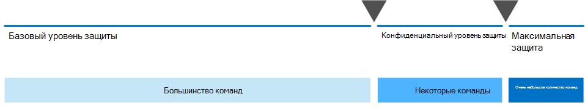

# Настройка безопасной совместной работы с помощью Microsoft 365Set up secure collaboration with Microsoft 365

Возможность легко обмениваться информацией с нужными людьми, а предотвращение чрезмерного обмена — это ключ к успеху организации.Being able to easily share information with the right people while preventing oversharing is key to an organization's success. Это включает возможность безопасного обмена конфиденциальными данными только с теми, у кого должен быть к ним доступ.This includes being able to share sensitive data safely with only those who should have access to it. В зависимости от проекта это может включать обмен конфиденциальными данными с людьми за пределами организации.Depending on the project, this might include sharing sensitive data with people outside your organization.

Это руководство по решению для совместной работы включает два компонента, которые помогут вам:This collaboration solution guidance includes two components to help you:
- Развертывание Microsoft Teams с правильным уровнем защиты для каждого проектаDeploy Microsoft Teams with the right level of protection for each project
- Настройка внешнего общего доступа с соответствующими настройками безопасности для каждого проектаConfigure external sharing with appropriate security settings for each project

Если универсальные и простые в использовании средства для совместной работы с контентом недоступны, пользователи часто будут совместно работать с документами по электронной почте.If versatile and easy-to-use content collaboration tools aren't available, users will often collaborate by emailing documents. Это утомительный и подверженный ошибкам метод совместной работы, который может повысить риск ненадлежащего обмена информацией.This is a tedious and error-prone method of collaboration, and can increase the risk of inappropriate sharing of information. Если люди находят слишком сложное совместное использование информации, они могут вернуться к использованию потребительских продуктов, которые не управляются ИТ-технологией.If people find sharing information too difficult, they could revert to using consumer products that are not governed by IT. Это может представлять еще большую угрозу.This can pose an even greater risk.

С помощью Microsoft 365 вы можете развернуть Teams с различными конфигурациями, которые помогают:With Microsoft 365, you can deploy Teams with a variety of configurations that help:

- Защита интеллектуальной собственностиProtect your intellectual property
- Простая совместная работаEnable easy collaboration
- Создайте баланс между безопасностью и возможностью использования, что повышает удовлетворенность пользователей и снижает риск теневого ИТ-интерфейсаCreate a balance between security and usability that increases user satisfaction and reduces the risk of shadow IT

Большинство организаций имеют разнообразные сведения с различной степенью конфиденциальности и различной степенью влияния на бизнес, если информация ненадлежащим образом передается в общий доступ.Most organizations have a variety of information, with varying degrees of sensitivity and varying degrees of business impact if the information is inappropriately shared. В зависимости от конфиденциальности заданного фрагмента информации, может потребоваться разрешить общий доступ с:Depending on the sensitivity of a given piece of information, you may want to allow sharing with:

- Любой (неавтерицированный)Anyone (unauthenticated)
- Люди в организацииPeople inside the organization
- Конкретные люди в организацииSpecific people inside the organization
- Конкретные люди в организации и за ее пределамиSpecific people inside and outside the organization

Такие сведения, как маркетинговые кампании, предназначены для общего доступа за пределами организации.Information such as marketing brochures are meant for sharing broadly outside the organization. Такие сведения, как меню в кафетерии, не предназначены для внешнего общего доступа, но не влияют на бизнес при внешнем доступе.Information such as cafeteria menus aren't meant for external sharing, but would have no business impact if they were shared externally. Эти типы информации требуют небольшой защиты или не требуют никакой защиты.These types of information need little or no protection.

Те же маркетинговые организации, которые находятся на стадии разработки, могут совместно использовать только внутри организации.Those same marketing brochures, while under development, might only be shared inside the organization. В этом случае параметров общего доступа по умолчанию в Teams может быть достаточно.In this case, the default sharing settings in Teams may be sufficient.

Информация о новом продукте, который находится на стадии разработки, может считаться конфиденциальной даже в организации.Information about a new product that is under development might be considered sensitive, even within the organization. В этом случае можно использовать более высокую степень защиты.A greater degree of protection might be appropriate in this case. Например, вы можете ограничить доступ к этой информации участникам определенной команды.You could restrict access to this information to members of a specific team, for example. В зависимости от проекта может потребоваться сотрудничество с людьми за пределами вашей организации, такими как поставщик или партнерская организация.Depending on the project, you may need to collaborate with people outside your organization, such as a vendor or partner organization.

Для информации, которая критически важна для успешного выполнения вашей организации или предъявляет строгие требования к безопасности или обеспечению соответствия требованиям, может потребоваться еще более высокий уровень защиты.Information that is critical to your organization's success, or has stringent security or compliance requirements might require even greater levels of protection.

Для всех сценариев, отмеченных выше, вы можете использовать команды в Microsoft Teams для хранения, обмена информацией и совместной работы над ними.For all the scenarios noted above, you can use teams in Microsoft Teams to store, share, and collaborate on the information. 

Чтобы настроить безопасную совместную работу, используйте эти возможности и функции Microsoft 365.To configure secure collaboration, you use these Microsoft 365 capabilities and features.

| Продукт или компонентProduct or component | Возможность или функцияCapability or feature | ЛицензированиеLicensing |
|:-------|:-----|:-------|
| Microsoft Defender для Office 365Microsoft Defender for Office 365 | Безопасные вложения для SPO, OneDrive и Teams; Безопасные документы; Безопасные ссылки для TeamsSafe Attachments for SPO, OneDrive and Teams; Safe Documents; Safe Links for Teams    | Microsoft 365 E1, E3 и E5Microsoft 365 E1, E3 and E5 |
| SharePointSharePoint    | Политики общего доступа к сайтам и файлам, разрешения общего доступа к сайтам, ссылки для общего доступа, запросы на доступ, параметры гостевого общего доступа к сайтуSite and file sharing policies, Site sharing permissions, Sharing links, Access requests, Site guest sharing settings | Microsoft 365 E1, E3 и E5Microsoft 365 E1, E3 and E5 |
| Microsoft TeamsMicrosoft Teams   | Гостевой доступ, частные команды, частные каналыGuest access, private teams, private channels | Microsoft 365 E1, E3 и E5Microsoft 365 E1, E3 and E5 |
| Соответствие требованиям Microsoft 365Microsoft 365 Compliance  | Метки конфиденциальностиSensitivity labels    | Microsoft 365 E3 и E5Microsoft 365 E3 and E5 |

### Использование Teams для всех видов данныхUsing Teams for all kinds of data

Для управления доступом к информации с различными конфиденциальности мы разработали три разных уровня защиты [для Teams.](configure-teams-three-tiers-protection.md)To manage access to information with different sensitivities, we've developed [three different tiers of protection for Teams](configure-teams-three-tiers-protection.md). Вы можете настроить любой из этих уровней для лучшего решения потребностей или бизнеса.You can customize any of these tiers to better address the needs or your business. 

Эти уровни *(* *базовые,* конфиденциальные и высоко конфиденциальные)  постепенно увеличивают меры защиты, которые помогают предотвратить чрезмерное и потенциальную утечку информации, как показано в следующей таблице.These tiers - *baseline*, *sensitive*, and *highly sensitive* - gradually increase the protections that help prevent oversharing and potential information leakage, as shown in the following table.

|-|**Базовый уровень****Baseline tier**|**Уровень конфиденциальной информации****Sensitive tier**|**Уровень с высокой конфиденциальной чувствительности****Highly sensitive tier**|
|:--|:-----------|:------------|:-------------------|
|Команда "Открытый" или "закрытый"Public or private team|Любой из нихEither|ЧастныйPrivate|ЧастныйPrivate|
|Общий доступ без проверки подлинностиUnauthenticated sharing|ЗаблокированоBlocked|ЗаблокированоBlocked|ЗаблокированоBlocked|
|Общий доступ к файламFile sharing|РазрешеноAllowed|РазрешеноAllowed|Делиться могут только владельцы команд.Only team owners can share.|
|Членство в командеTeam membership|Любой может присоединиться к общедоступным командам.Anyone can join public teams. Для принятия частных команд требуется утверждение владельца команды.Team owner approval required to join private teams.|Для принятия этой команды требуется утверждение владельца команды.Team owner approval required to join.|Для принятия этой команды требуется утверждение владельца команды.Team owner approval required to join.|
|Шифрование документовDocument encryption|||Доступно с меткой конфиденциальностиAvailable with sensitivity label|
|Предоставление общего доступа гостямGuest sharing|РазрешеноAllowed|Может быть разрешено или заблокированоCan be allowed or blocked|Может быть разрешено или заблокированоCan be allowed or blocked|
|Неугодные устройстваUnmanaged devices|Без ограниченийNo restriction|Доступ только через ИнтернетWeb-only access|ЗаблокированоBlocked|

Настройка этих уровней включает в себя:Configuring these tiers involves:

- Настройка параметров в Teams для гостевого доступа и частных каналовConfiguring settings in Teams for guest access and private channels
- Настройка параметров на связанном с командой сайте SharePoint для внутреннего и гостевого общего доступа, запросов на доступ и ссылок для общего доступаConfiguring settings in a team's associated SharePoint site for internal and guest sharing, access requests, and sharing links
- Для *уровней конфиденциальности* и с высокой степенью конфиденциальности настройте метки конфиденциальности для классификации команд, а также контролируйте гостевой общий доступ и доступ с неугодных устройств For the *sensitive* and *highly sensitive* tiers, configuring sensitivity labels to classify the teams, and control guest sharing and access from unmanaged devices
- Для уровня *с высокой* конфиденциальности настройка метки конфиденциальности для шифрования документов, к которым она применяетсяFor the *highly sensitive* tier, configuring a sensitivity label to encrypt the documents to which it is applied

Начните с базового уровня, а  затем  добавьте команды, которые используют конфиденциальные и высоко конфиденциальные уровни для защиты информации в организации.Start with the baseline tier, and then add teams that use the *sensitive* and *highly sensitive* tiers as needed to help protect the information in your organization. См. эти ресурсы для начала работы:See these resources to get started:

- [Настройка команд с базовым уровнем защитыConfigure teams with baseline protection](configure-teams-baseline-protection.md)
- [Настройте группы с защитой для конфиденциальных данныхConfigure teams with protection for sensitive data](configure-teams-sensitive-protection.md)
- [Настроить группы с защитой для конфиденциальных данныхConfigure teams with protection for highly sensitive data](configure-teams-highly-sensitive-protection.md)

Если у вас есть проект с высокой конфиденциальности, который требует дополнительной защиты от общего доступа даже в вашей организации, можно настроить команду, которая использует собственную метку конфиденциальности для шифрования файлов, чтобы только участники группы могли их читать.If you have a highly sensitive project that requires additional protection from sharing even within your organization, you can configure a team that uses its own sensitivity label to encrypt files so that only team members can read them. Подробные сведения см. в подстроке "Настройка команды [с изоляцией системы](secure-teams-security-isolation.md) безопасности".See [Configure a team with security isolation](secure-teams-security-isolation.md) for details.

### Обмен данными с людьми за пределами организацииSharing with people outside your organization

Вам может потребоваться поделиться сведениями о [конфиденциальности с людьми за пределами вашей организации.](collaborate-with-people-outside-your-organization.md)You may need to [share information of any sensitivity with people outside your organization](collaborate-with-people-outside-your-organization.md). Это может варьироваться от общего доступа к одному документу с одним человеком до совместной работы над крупным проектом с крупной партнерской организацией или облителями со всего мира.This could range from sharing a single document with a single person to collaborating on a major project with a large partner organization or freelancers from around the world. В Microsoft 365 этот диапазон внешнего общего доступа можно легко и с помощью соответствующих защитных мер защитить вашу конфиденциальную информацию.In Microsoft 365, this range of external sharing can be done easily and with the appropriate safeguards to help protect your sensitive information.

Эти ресурсы помогут вам начать настройку среды для совместной работы с людьми за пределами организации:These resources will help you get started with setting up your environment for collaborating with people outside your organization:

- [Совместно работайте над документами](collaborate-on-documents.md) для общего доступа к отдельным файлам папок.[Collaborate on documents](collaborate-on-documents.md) for sharing individual files of folders.
- [Совместная работа на сайте](collaborate-in-site.md) для совместной работы с гостями на сайте SharePoint.[Collaborate in a site](collaborate-in-site.md) for collaborating with guests in a SharePoint site.
- [Совместная работа в качестве](collaborate-as-team.md) команды для совместной работы с гостями в команде.[Collaborate as a team](collaborate-as-team.md) for collaborating with guests in a team.

В зависимости от конфиденциальности общей информации можно добавить меры безопасности для предотвращения чрезмерного делиться.Depending on the sensitivity of the information being shared, you can add safeguards to help prevent oversharing. Эти ресурсы помогут вам настроить средства защиты, необходимые для вашей организации:These resources will help you set up the protections that you need for your organization:

- [Рекомендации по предоставлению общего доступа к файлам и папкам непроверенным пользователямBest practices for sharing files and folders with unauthenticated users](best-practices-anonymous-sharing.md)
- [Ограничьте случайное воздействие файлов при обмене с людьми за пределами вашей организацииLimit accidental exposure to files when sharing with people outside your organization](share-limit-accidental-exposure.md)
- [Создание безопасной среды гостевого общего доступаCreate a secure guest sharing environment](create-secure-guest-sharing-environment.md)

Если у вас есть крупный проект с партнерской организацией, вы можете использовать Azure Entitlement Management для управления гостями из этой организации в команде, настроенной для проекта.If you have a major project with a partner organization, you can use Azure Entitlement Management to manage the guests from that organization in a team that you set up for the project. Дополнительные сведения см. в подсети ["Создание экстрасети B2B с управляемыми](b2b-extranet.md) гостями".See [Create a B2B extranet with managed guests](b2b-extranet.md) for details.

## Развертывание решения безопасной совместной работыDeploy the secure collaboration solution

Когда вы будете готовы развернуть это решение, продолжите следующие действия:When you're ready to deploy this solution, continue with these steps:
1. Настройте [три разных уровня защиты для Teams.](configure-teams-three-tiers-protection.md)Configure the [three different tiers of protection for Teams](configure-teams-three-tiers-protection.md).
2. Настройте параметры для общего [доступа к информации любой конфиденциальности с людьми за пределами вашей организации.](collaborate-with-people-outside-your-organization.md)Configure settings for [sharing information of any sensitivity with people outside your organization](collaborate-with-people-outside-your-organization.md).

## См. такжеSee also

[Документация по безопасности Microsoft 365Microsoft 365 security documentation](https://docs.microsoft.com/microsoft-365/security)

[Документация Microsoft 365 по соответствию требованиямMicrosoft 365 compliance documentation](https://docs.microsoft.com/microsoft-365/compliance)

[Знакомство с Microsoft TeamsWelcome to Microsoft Teams](https://docs.microsoft.com/MicrosoftTeams/Teams-overview)
