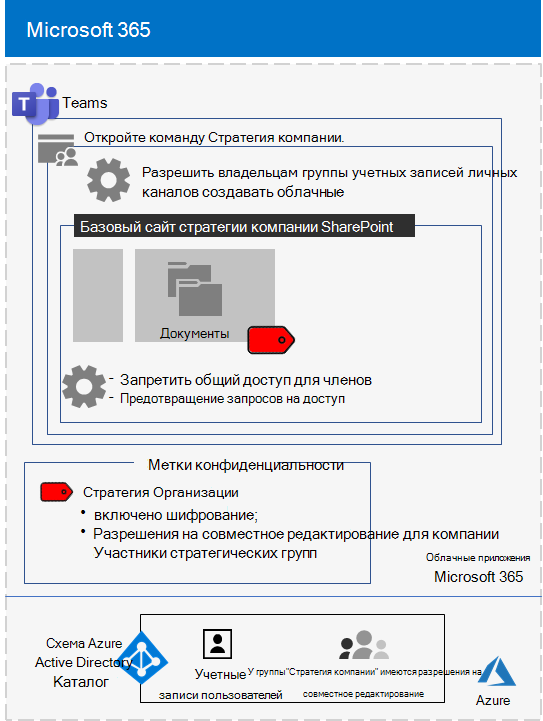
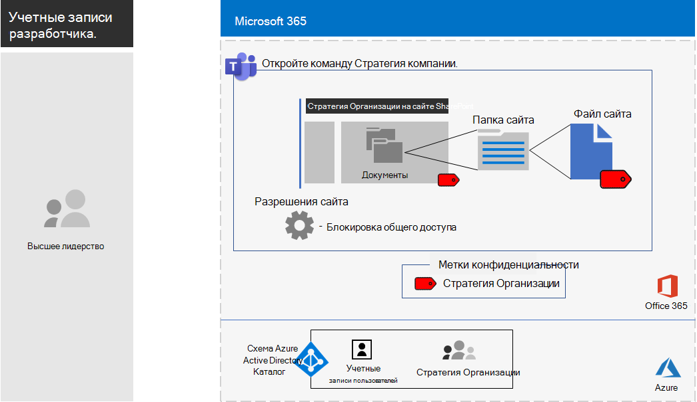

# <a name="configure-a-team-with-security-isolation-in-a-devtest-environment"></a>Настройте группу с изоляцией безопасности в среде разработки/тестирования

В этой статье приводятся пошаговые инструкции по созданию [группы с изоляцией безопасности](secure-teams-security-isolation.md) в среде разработки/тестирования.



Используйте эту среду разработки и тестирования, чтобы экспериментировать и настраивать параметры в соответствии с вашими потребностями, прежде чем внедрять этот тип команды в производство.
  
## <a name="phase-1-build-out-your-microsoft-365-enterprise-test-environment"></a>Этап 1. Создание собственной тестовой среды Microsoft 365 корпоративный

Если вы просто хотите тестировать чувствительные и высокочувствительные команды легким способом с минимальными требованиями, следуйте инструкциям в [Облегченной базовой конфигурации](https://docs.microsoft.com/microsoft-365/enterprise/lightweight-base-configuration-microsoft-365-enterprise).

Если вы хотите протестировать чувствительные и высокочувствительные команды на моделируемом предприятии, следуйте инструкциям в разделе [Синхронизация хэша паролей](https://docs.microsoft.com/microsoft-365/enterprise/password-hash-sync-m365-ent-test-environment).

>[!Note]
>Тестирование группы с изолированной защитой не требует имитированной среды корпоративного тестирования, которая включает симулированную интрасеть, подключенную к Интернету, и синхронизацию каталогов для леса доменных служб Active Directory (AD DS). Он предоставляется здесь как вариант, чтобы вы могли протестировать группу с изоляцией безопасности и поэкспериментировать с ней в среде, представляющей типичную организацию.
>
    
## <a name="phase-2-create-and-configure-your-azure-active-directory-ad-group-and-users"></a>Этап 2. Создание и настройка группы и пользователей Azure Active Directory (AD)

На этом этапе вы создаете и настраиваете группу Azure AD и пользователей для вымышленной организации.
  
Сначала создайте группу безопасности на портале Azure.
  
1. Откройте отдельную вкладку в браузере, а затем перейдите на портал Azure по адресу [https://portal.azure.com](https://portal.azure.com). Если необходимо, выполните вход с использованием данных учетной записи глобального администратора для вашей пробной или оплаченной подписки Microsoft 365 E5.
    
2. На портале Azure выберите **Azure Active Directory > Группы**.
    
3. В колонке **Группы — Все группы** выберите пункт **+ Создать группу**.
    
4. В колонке **Группа**:
    
  - В разделе **Тип группы** выберите **Безопасность**.
    
  - Введите **Топ-менеджмент** в поле **Имя**.
    
  - Выберите **Назначенные** в поле **Тип членства**.
      
5. Нажмите кнопку **Создать**, а затем закройте колонку **Группа**.
    
Затем настройте автоматическое лицензирование, чтобы членам новой группы **C-Suite** автоматически назначалась лицензия Microsoft 365 E5.
  
1. На портале Azure последовательно выберите **Azure Active Directory > Лицензии > Все продукты**.
    
2. В списке выберите **Microsoft 365 корпоративный E5** и щелкните **Назначить**.
    
3. В колонке **Назначение лицензии** щелкните **Пользователи и группы**.
    
4. В списке групп выберите группу **C-Suite**.
    
5. Выберите **Выбрать** > **Назначить**.
    
6. Закройте вкладку портала Azure в браузере.
    
Затем [подключитесь к модулю PowerShell для Graph Azure Active Directory](https://docs.microsoft.com/office365/enterprise/powershell/connect-to-office-365-powershell#connect-with-the-azure-active-directory-powershell-for-graph-module).
  
Введите имя своей организации, свое местоположение и общий пароль, а затем выполните эти команды из командной строки PowerShell или интегрированной среды сценариев (ISE), чтобы создать новые учетные записи пользователей и добавить их в группу C-Suite:
  
```powershell
$orgName="<organization name, such as contoso-test for the contoso-test.onmicrosoft.com trial subscription domain name>"
$location="<the ISO ALPHA2 country code, such as US for the United States>"
$commonPassword="<common password for all the new accounts>"

$PasswordProfile=New-Object -TypeName Microsoft.Open.AzureAD.Model.PasswordProfile
$PasswordProfile.Password=$commonPassword

$groupName="C-Suite"
$userNames=@("CEO","CFO","CIO") 
$groupID=(Get-AzureADGroup | Where { $_.DisplayName -eq $groupName }).ObjectID
ForEach ($element in $userNames){ 
New-AzureADUser -DisplayName $element -PasswordProfile $PasswordProfile -UserPrincipalName ($element + "@" + $orgName + ".onmicrosoft.com") -AccountEnabled $true -MailNickName $element -UsageLocation $location 
Add-AzureADGroupMember -RefObjectId (Get-AzureADUser | Where { $_.DisplayName -eq $element }).ObjectID -ObjectId $groupID
}
```

> [!NOTE]
> Общий пароль используется для автоматизации и упрощения конфигурации среды разработки и тестирования. Очевидно, что это не рекомендуется в производственных подписках. 
  
Выполните указанные ниже действия, чтобы убедиться, что лицензирование на основе групп работает должным образом.
  
1. Войдите в [центр администрирования Microsoft 365](https://admin.microsoft.com).
    
2. На новой вкладке браузера**Центр администрирования Microsoft 365** щелкните **Пользователи**.
    
3. В списке пользователей выберите **Генеральный директор**.
    
4. На панели, в которой перечислены свойства учетной записи пользователя **CEO**, убедитесь, что ей была назначена лицензия **Microsoft 365 корпоративный E5** в **лицензиях на продукт**.
    
## <a name="phase-3-create-your-team"></a>Этап 3. Создание вашей группы

На этом этапе вы создаете и настраиваете группу с изоляцией безопасности для членов группы старшего руководства для совместной работы над стратегией компании.

Во-первых, включите метки чувствительности для защиты содержимого в Microsoft Teams, группах Office 365 и сайтах SharePoint, прежде чем продолжить выполнение действий, описанных в [этой статье](https://docs.microsoft.com/microsoft-365/compliance/sensitivity-labels-teams-groups-sites).

Затем создайте группу.

1. В командах нажмите **Teams** в левой части приложения, затем нажмите **Присоединиться или создать группу** в нижней части списка команд.
2. Нажмите **Создать группу** (первая карта, верхний левый угол).
3. Выберите **Создать группу с нуля**.
4. В списке **Чувствительность** оставьте значение по умолчанию.
5. В разделе **Конфиденциальность** нажмите **Приватный**.
6. Введите **Стратегия компании**, а затем нажмите **Создать** > **Закрыть**.

Далее необходимо настроить метку чувствительности со следующими настройками:

- Название метки: "Стратегия компании"
- Шифрование включено
- У группы "Стратегия компании" имеются разрешения на совместное редактирование

Выполните приведенные ниже действия.

1. Откройте [центр соответствия требованиям Microsoft 365](https://compliance.microsoft.com).
2. В разделе **Решения** нажмите **Защита информации**.
3. Нажмите **Создать метку**.
4. Введите **Стратегия компании** для названия этикетки.
5. Введите в качестве всплывающей подсказки **документы по стратегии компании старшего руководства** и нажмите кнопку **Далее**.
6. На странице **Шифрование** в раскрывающемся списке **Шифрование** выберите **Применить**.
7. Чтобы добавить разрешения команды:<br>
  а. Нажмите кнопку **Назначить разрешения**.<br>
  б. Нажмите **Добавить пользователей или группы**, выберите **Стратегия компании**, а затем нажмите **Добавить**.<br>
  в. Нажмите кнопку **Выбрать разрешения**.<br>
  г. Выберите **Соавтора** в раскрывающемся списке и нажмите **Сохранить**.<br>
8. Нажмите кнопку **Далее**.
9. На странице **Маркировка содержимого** нажмите кнопку **Далее**.
10. На странице **настроек сайта и группы** установите для **параметров сайта и группы** значение **Вкл**.
11. В раскрывающемся списке **Конфиденциальность сайтов групп, связанных с Office 365**, выберите **Частный - только участники могут получить доступ к сайту**.
12. В разделе **Неуправляемые устройства** выберите **Блокировать доступ**.
13. Нажмите кнопку **Далее**.
14. На странице **Автоматическая маркировка приложений Office** нажмите **Далее**.
15. Нажмите **Отправить**, а затем нажмите **Готово**.

Затем опубликуйте новый ярлык, выполнив следующие действия: 

1. В Центре соответствия требованиям Microsoft 365 на странице **Защита информации** выберите вкладку **Политики меток**.
2. Нажмите **Опубликовать ярлыки**.
3. На странице **Выберите метки чувствительности для публикации** нажмите **Выбрать метки чувствительности для публикации**.
4. Выберите **Стратегию компании** и нажмите кнопку **Добавить**.
5. Нажмите кнопку **Далее**.
6. На странице **Опубликовать для пользователей и групп** нажмите **Выбрать пользователей и группы**.
7. Нажмите **Добавить** и выберите **Стратегия компании**.
8. Нажмите **Добавить**, а затем нажмите **Готово**.
9. Нажмите кнопку **Далее**.
10. На странице параметров политики установите флажок **Пользователи должны предоставить обоснование для удаления метки или метки более низкой классификации**, а затем нажмите **Далее**.
11. Введите название **Стратегии компании** и нажмите кнопку **Далее**.
12. Нажмите **Отправить**, а затем нажмите **Готово**.

После того, как ярлык **Стратегия компании** станет доступным после публикации, может пройти некоторое время.

Затем примените свой новый ярлык к команде **Стратегии компании** и обновите тип ссылки для обмена по умолчанию, чтобы уменьшить риск случайного обмена файлами и папками с более широкой аудиторией, чем предполагалось. 

1. Откройте [центр администрирования SharePoint](https://admin.microsoft.com/sharepoint).
2. В разделе **Сайты** выберите **Активные сайты**.
3. Откройте команду **Стратегия компании**.
4. На вкладке **Политики** под разделом **Чувствительность** нажмите **Изменить**.
5. Выберите метку **Стратегия компании** и нажмите **Сохранить**.
6. На вкладке **Политики** в разделе **Внешний обмен** нажмите **Изменить**.
5. **Только пользователи из организации**
6. В разделе тип ссылки для **Общего доступа по умолчанию** снимите флажок **То же, что и на уровне организации** и выберите **Люди с существующим доступом**.
7. Щелкните **Сохранить**.

Затем настройте совместное использование сайта только для владельцев для команды **стратегии компании**.

1. В командах перейдите на вкладку **Общие** команды **Стратегии компании**.
2. На панели инструментов для команды щелкните **Файлы**.
3. Щелкните многоточие, а затем — **Открыть в SharePoint**.
4. На панели инструментов базового сайта SharePoint щелкните значок параметров и выберите вариант **Разрешения для сайта**.
5. На панели разрешений сайта в разделе **Общий доступ к сайту** нажмите кнопку **Изменить, как участники могут делиться**.
6. В разделе **Разрешения на предоставление общего доступа** выберите **Только владельцы сайта могут делиться файлами, папками и сайтом** и щелкните **Сохранить**.
7. Закройте панели **Разрешения** и **Настройки**.

Если вы войдете в качестве члена группы Стратегии компании, вы увидите **Стратегию компании** в параметре **Чувствительность** на главной панели инструментов Word, Excel и PowerPoint. Выберите метку **Стратегия компании** в параметре **Чувствительность**, чтобы назначить метку файлу.

Ниже приведена итоговая конфигурация для команды "Стратегия компании".


Файлы в команде могут иметь метку чувствительности Стратегии компании, назначенную членами группы Стратегии компании. Пример:


 
## <a name="next-step"></a>Следующий шаг

Когда вы будете готовы к производственному развертыванию, см. [Настройка группы с изоляцией безопасности](secure-teams-security-isolation.md) для получения подробной информации о конфигурации.
