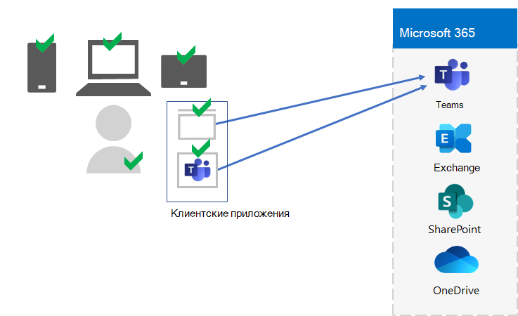
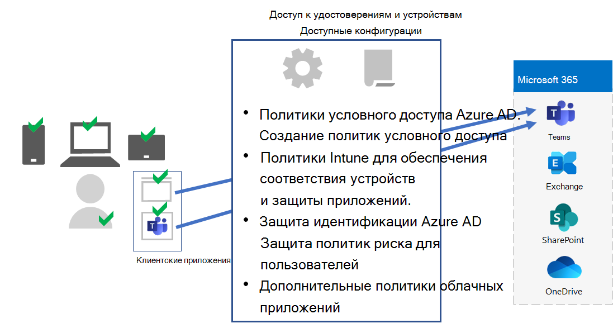
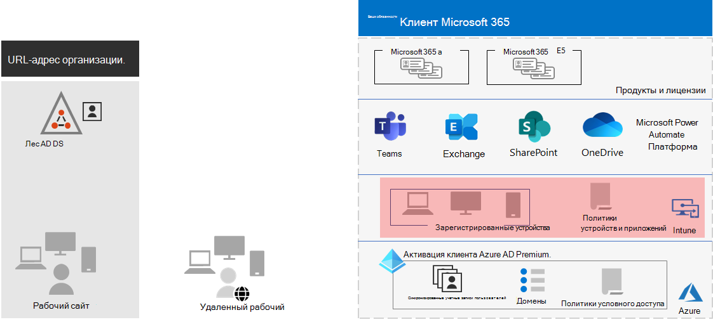

# Этап 5. Управление устройствами и приложениями для клиентов Microsoft 365 для предприятий

Microsoft 365 для предприятий включает функции для управления устройствами и использования приложений на этих устройствах в организации с помощью управления мобильными устройствами (MDM) и управления мобильными приложениями (MAM). Вы можете управлять устройствами с iOS, Android, macOS и Windows, чтобы защитить доступ к ресурсам организации, включая ваши данные. Например, можно запретить отправку сообщений электронной почты людям за пределами организации или изолировать данные организации от персональных данных на личных устройствах сотрудников.

Вот пример проверки и управления пользователями, их устройствами и их использованием локальных и облачных приложений для повышения производительности, таких как Microsoft Teams.

Чтобы помочь вам защитить ресурсы организации, Microsoft 365 для предприятий включает функции для управления устройствами и их доступа к приложениям. Существует два варианта управления устройствами:

- Microsoft Intune— комплексное решение для управления устройствами и приложениями для предприятий.
- Базовая мобильность и безопасность, которая является подмножество служб Intune, включенных во все продукты Microsoft 365 для управления устройствами в организации. Дополнительные сведения см. в сведениях [о возможностях базовой мобильности и безопасности.](https://docs.microsoft.com/microsoft-365/admin/basic-mobility-security/capabilities)

Если у вас есть Microsoft 365 E3 или E5, следует использовать Intune.

## Microsoft Intune

Microsoft [Intune используется](https://docs.microsoft.com/mem/intune/fundamentals/planning-guide) для управления доступом к организации с помощью MDM или MAM. MDM — это когда пользователи "регистрировать" свои устройства в Intune. После регистрации устройство является управляемым устройством и может получать политики, правила и параметры организации. Например, вы можете установить определенные приложения, создать политику паролей, установить VPN-подключение и много другое.

Пользователи с личными устройствами могут не захоть зарегистрировать свои устройства или управляться с помощью Intune и политик вашей организации. Однако вам все равно необходимо защитить ресурсы и данные организации. В этом сценарии вы можете защитить свои приложения с помощью MAM. Например, можно использовать политику MAM, которая требует, чтобы пользователь ввести ПИН-код при доступе к SharePoint на устройстве.

Вы также определите, как вы собираетесь управлять личными устройствами и устройствами, которые принадлежат организации. Вам может потребоваться по-разному обрабатывать устройства в зависимости от их использования.

## Конфигурации доступа для удостоверений и устройств

Корпорация Майкрософт предоставляет набор конфигураций для доступа к [удостоверениям](../security/office-365-security/microsoft-365-policies-configurations.md) и устройствам, чтобы обеспечить безопасную и продуктивную работу сотрудников. К таким конфигурациям относятся следующие:

- Политики условного доступа Azure AD
- Соответствие устройств Microsoft Intune требованиям и политики защиты приложений
- Политики риска для пользователей в службе Защиты идентификации Azure AD
- Дополнительные политики облачных приложений

Вот пример применения этих параметров и политик для проверки и ограничения пользователей, их устройств, а также их использования локальных и облачных приложений для повышения производительности, таких как Microsoft Teams.

Для доступа к устройствам и управления приложениями используйте конфигурации, указанные в этих статьях:

- [Необходимые компоненты](../security/office-365-security/identity-access-prerequisites.md)
- [Основные политики доступа для удостоверений и устройств](../security/office-365-security/identity-access-policies.md)

## Результаты этапа 5

Для управления устройствами и приложениями для клиента Microsoft 365 вы определили параметры и политики Intune для проверки и ограничения пользователей, их устройств, а также их использования локальных и облачных приложений для повышения производительности.

Вот пример клиента с устройствами Intune и управлением приложениями с выделением новых элементов.

На этой иллюстрации клиент имеет:

- Устройства, которые принадлежат организации, зарегистрированные в Intune.
- Политики устройств и приложений Intune для зарегистрированных и личных устройств.

## Текущее обслуживание для управления устройствами и приложениями

На постоянной основе может потребоваться: 

- Управление регистрацией устройств.
- Пересмотрите параметры и политики для дополнительных приложений, устройств и требований безопасности.
